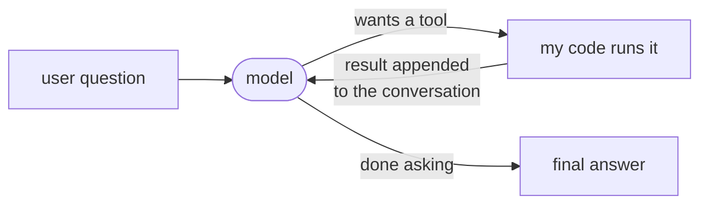
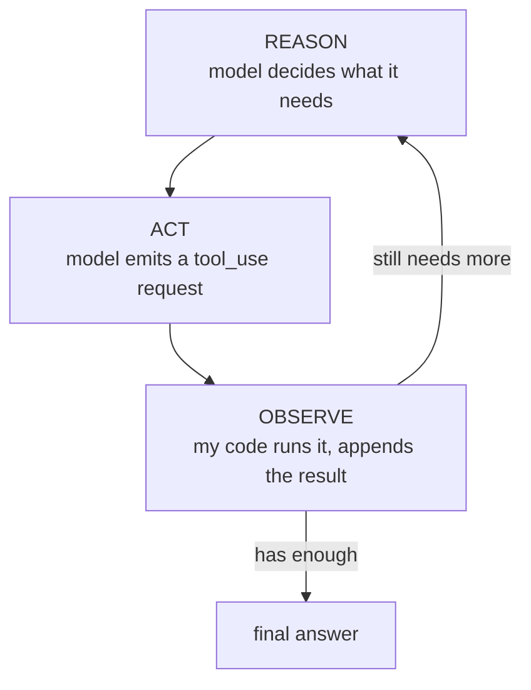
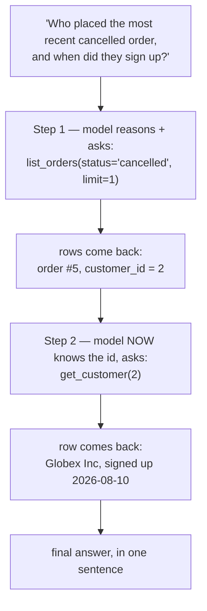
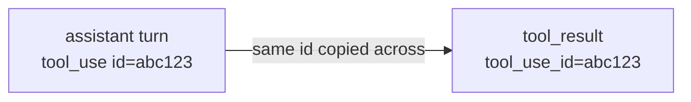
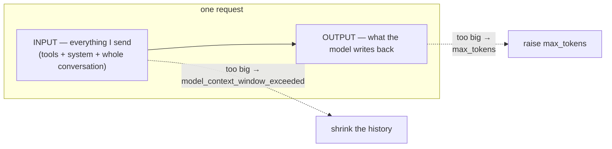
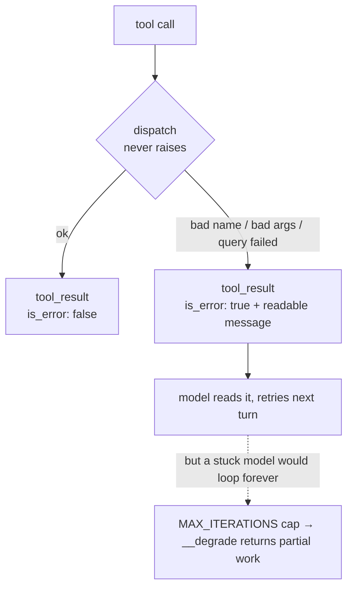

# The Agent Loop — reason → act → observe → repeat (the ReAct pattern)

> Personal revision notes. Plain language, no jargon for its own sake.
> Diagrams are in Mermaid so they render visually.
> Every example is from the `tool-agent` project I actually built — a plain-English question → tool calls → real Postgres queries → answer.

---

## 0. The 10-second mental model

A single tool call is **one** round-trip: model asks for a tool → my code runs it → the result goes back → the model answers.

**An agent is that same round-trip, put in a loop.** That is genuinely all it is. No new model, no special endpoint, no framework. I keep feeding results back until the model stops asking for tools.



The arrow going **back into the model** is the whole idea. One trip through = a tool call. Looping that arrow = an agent.

---

## 1. ReAct — the three moves, named

The pattern has a name: **ReAct**, short for **Rea**son + **Act**. Three moves, repeated until done:

| Move | What happens | Who does it |
|---|---|---|
| **Reason** | "To answer this I need the cancelled orders first." | The **model** (thinks) |
| **Act** | Emits a request: `list_orders(status='cancelled')` | The **model** (it only *asks*) |
| **Observe** | The rows come back and get added to the conversation | **My code** (runs it, appends result) |

Then it loops — the model reasons again, now knowing what it just learned.



> **The model never runs anything — not even in an agent.** It still only emits *requests*. The loop doesn't give it hands; the loop just means **my code keeps offering to be its hands** until it stops asking.

---

## 2. Why a loop is needed at all

Some questions can't be answered in one tool call — **not because the tool is weak, but because you don't know the second question until you've seen the first answer.**

The real example from my project:

> *"Who placed the most recent cancelled order, and when did they sign up?"*

I cannot pre-plan this. To look up the customer's signup date I need their **id** — and I don't know which customer it is until the orders query comes back. The steps are **discovered as you go**:



This is the line between a **workflow** and an **agent**:

| | Workflow | Agent |
|---|---|---|
| Who decides the steps | You, in advance | The model, as it goes |
| Shape in code | `a() → b() → c()` | a `while` loop |
| Good for | Known, fixed sequences | "It depends what we find" |

> **If you already know the exact steps, don't use an agent — just write the calls.** The loop only earns its cost when the path is genuinely unknown up front. (More on when *not* to reach for an agent in note 03.)

---

## 3. The loop in real code

The actual shape, trimmed to essentials:

```python
messages = [{"role": "user", "content": user_question}]

for step in range(1, MAX_ITERATIONS + 1):
    resp = call_model(messages, system=SYSTEM, tools=TOOLS)    # ← REASON

    if resp.stop_reason != "tool_use":                         # model is done
        return "".join(b.text for b in resp.content if b.type == "text")

    # keep the model's own turn in history first — see §5, not optional
    messages.append({"role": "assistant", "content": resp.content})

    results = []
    for block in resp.content:
        if block.type == "tool_use":
            output = dispatch(block.name, block.input)         # ← ACT (my code runs it)
            results.append({
                "type": "tool_result",
                "tool_use_id": block.id,                       # ← ties result to the request
                "content": output["content"],
                "is_error": output["is_error"],
            })

    messages.append({"role": "user", "content": results})      # ← OBSERVE
```

Read it as three lines and ReAct falls straight out:

- `call_model(...)` — **reason**
- `dispatch(...)` — **act**
- `messages.append(results)` — **observe**

Loop back to the top. That's the agent.

---

## 4. The model has no memory — the conversation IS its memory

**Q: The model worked out `customer_id = 2` in step 1. How does it still know that in step 2?**

Because I sent it again. **The model remembers nothing between calls.** Every request is a fresh read of the entire `messages` list. It only *looks* continuous because the list keeps growing.

After the two-tool question, `messages` looks like this:

| # | role | content |
|---|---|---|
| 1 | user | "Who placed the most recent cancelled order…" |
| 2 | assistant | *(the model's `tool_use` request for `list_orders`)* |
| 3 | user | `tool_result` → the order row, containing `customer_id: 2` |
| 4 | assistant | *(its `tool_use` request for `get_customer(2)`)* |
| 5 | user | `tool_result` → the customer row |
| 6 | assistant | the final text answer |

> **Everything the model learns lives in that list and nowhere else.** No hidden state, no server-side session. That's also why the list is the thing that eventually gets expensive — the whole menu of tools + system prompt is re-sent on *every* turn (prompt caching is the fix; that lives in the older `Agents and MCP` note).

---

## 5. Two rules that fall out of "the list is the memory"

Both of these bite if you get them wrong.

**Rule 1 — append the model's own turn BEFORE the result.** Rows 2 and 4 above are the model's requests. If you skip them and jump straight to the result, the conversation contains an *answer to a question that was never asked*. The API rejects it — and even if it didn't, the model would be reading nonsense.

**Rule 2 — the `tool_use_id` is what pairs a result to its request.** Row 3's result carries the id from row 2's request. If the model asks for **two tools at once**, this id is the only thing saying which result belongs to which request — position alone is not enough.



---

## 6. How the loop knows when to stop

The exit condition is **one field the API returns: `stop_reason`**. You never set it — you read it.

| `stop_reason` | Plain meaning | What the loop should do |
|---|---|---|
| `tool_use` | "Run this for me." | Run it, append the result, **loop again** |
| `end_turn` | "I'm done, here's the answer." | Return the text — **exit** |
| `max_tokens` | Reply got cut off mid-sentence | Stop. Looping won't help — it truncates again |
| `model_context_window_exceeded` | The conversation itself no longer fits | Stop. Opposite fix: shrink the history |
| `refusal` | The model declined | Stop. Don't retry the same prompt |

The two token ones sound alike and are **opposites** — which is exactly why they're easy to confuse:



> **`max_tokens` = the reply was too long. `model_context_window_exceeded` = the question was too long.** Fixing one by doing the other makes it worse.

---

## 7. Making errors survivable — and the new bug that creates

The model *inventing a slightly wrong tool name or argument* is one of the most ordinary things it does. If a bad call crashes the run, the agent is fragile. So every tool call goes through **one dispatcher that never raises** — it turns each failure into a message the model can read:

```python
def dispatch(name, tool_input):
    fn = HANDLERS.get(name)                      # .get(), not [] — never raises
    if fn is None:
        return {"content": f"Error: unknown tool {name!r}. Available: {', '.join(sorted(HANDLERS))}.",
                "is_error": True}
    try:
        output = fn(**validate(name, tool_input))
    except ValidationError as e:                 # bad arguments — model should retry
        return {"content": f"Error: invalid arguments for {name}: {e}", "is_error": True}
    except Exception as e:                        # the query itself failed
        return {"content": f"Error running {name}: {type(e).__name__}: {e}", "is_error": True}
    return {"content": json.dumps(output, default=str), "is_error": False}
```

The error text goes back as a normal `tool_result` with **`is_error: True`** — a flag the API supports, so the model is *told* it failed instead of guessing from prose. It reads "unknown tool, here are the real names" and retries correctly. **A bad tool call now costs one extra turn instead of killing the run.**

**And that is exactly what creates a new problem.** With errors survivable, a model stuck retrying a broken call loops **forever** — the crash used to be the thing that stopped it. So the loop needs a ceiling:

```python
for step in range(1, MAX_ITERATIONS + 1):     # 10, instead of `while True`
    ...
return __degrade(f"hit MAX_ITERATIONS ({MAX_ITERATIONS})", messages)
```

And when you hit the ceiling, **return the partial work rather than raising** — the model may have made three good tool calls before getting stuck, and throwing an exception discards all of it. `__degrade()` digs the last text out of the conversation and returns it with a note about *why* it stopped.



> The general shape, worth keeping: **every safety net you add moves the failure somewhere else.** Catching errors removed the crash and created the infinite loop. The iteration cap is what closes it.

---

## 8. The traps (the ones I actually hit)

- **Skipping the assistant turn.** Appending a `tool_result` without first appending the model's request breaks the conversation. Easy to do, confusing to debug (§5).
- **Splitting parallel results across messages.** If the model asks for two tools at once, both results go in **one** user message. Sending them separately teaches the model to stop asking for parallel calls — latency silently triples (more in note 02).
- **No iteration cap.** `while True` plus survivable errors = a run that never ends and quietly burns money.
- **Trusting a passing run.** My `dispatch` once had `is_error: True` on the *success* path — every good call was being reported as a failure — and the answers still *looked* perfect, because models narrate smoothly over contradictory input. **Passing output ≠ correct mechanism.** Test the error branches directly.
- **Tool results are untrusted input.** Whatever comes back from a database or a web page lands in the model's context. If it contains instructions, the model may read them. Same care as user input. (This is the seed of the guardrails work — its own note.)

---

## 9. The answer you can say out loud

> "An agent isn't a different model — it's the tool-calling round-trip put in a **loop**. The model **reasons** about what it needs, **acts** by emitting a tool request (it still never executes anything — my code does), and I let it **observe** by appending the result back into the conversation. Then it goes again. That's **ReAct**.
>
> The loop exists for questions where you can't plan the steps up front — *'who placed the most recent cancelled order and when did they sign up'* needs the orders query to finish before you even know which customer to look up. If I already knew the sequence, I'd just write the calls; the loop only earns its cost when the path is unknown.
>
> The model has no memory between calls, so the whole growing `messages` list is re-sent every turn — and I have to append its own request turn before the result, paired by `tool_use_id`. The loop stops by reading `stop_reason`, not by me deciding. Every tool call goes through one dispatcher that never raises, so failures come back as `is_error` results the model can recover from — which is exactly why the loop also needs an iteration cap, or a stuck model would retry forever."

---

## 10. Quick-reference glossary

| Term | Meaning |
|---|---|
| **Agent** | The tool-call round-trip run in a loop until the model stops asking for tools. Not a special model. |
| **ReAct** | **Rea**son → **Act** → Observe, repeated. The name for that loop. |
| **Reason / Act / Observe** | Model thinks → model emits a tool request → my code runs it and appends the result. |
| **Agent loop** | `call model → if tool_use: run it, append result → repeat`. |
| **`stop_reason`** | Field the API returns saying why generation stopped. The loop's only exit condition. |
| **`tool_use_id`** | Id on the model's request; copied onto the result so the two are paired. |
| **`is_error`** | Flag on a `tool_result` telling the model that call failed, instead of making it guess from the text. |
| **Dispatcher** | One function between the loop and the tools that never raises — turns every failure into a readable message. |
| **Degrade** | Return partial work with a reason instead of raising, when a guard trips. |
| **`MAX_ITERATIONS`** | Ceiling on loop turns. Needed *because* errors were made survivable. |
| **Workflow vs agent** | Known fixed steps → workflow (just write the calls). Unknown path → agent (the loop). |

---

*End of notes — continues in `02-Multi-Tool-Orchestration.md`.*
