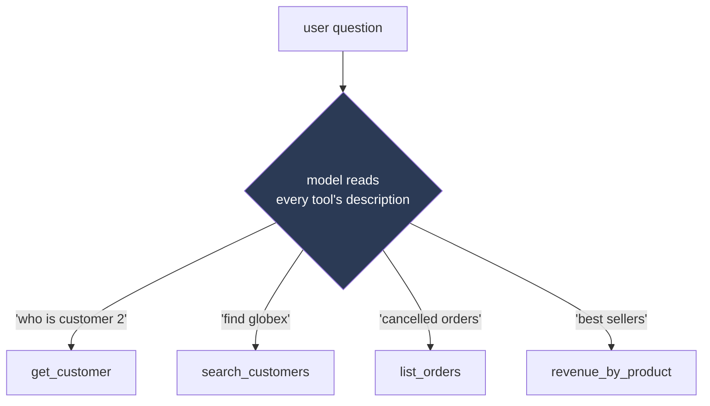
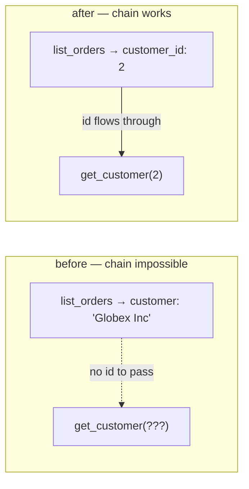
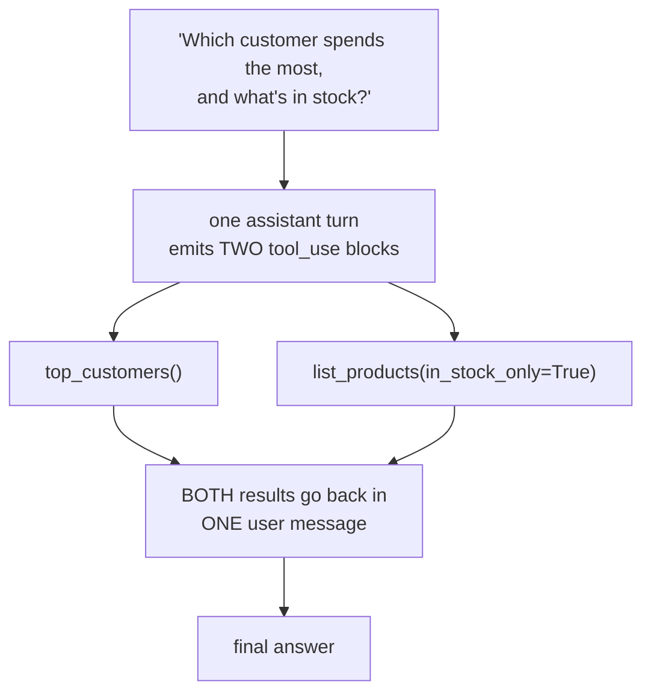

# Multi-Tool Orchestration — how the model chooses among many tools (and chains them)

> Personal revision notes. Plain language, real examples from the `tool-agent` project.
> Diagrams in Mermaid. This note follows on from `01-The-Agent-Loop-ReAct.md`.

---

## 0. The 10-second mental model

Note 01 was one tool in a loop. **Orchestration is the same loop with a *menu* of tools** — and the question the model has to answer on every turn becomes:

> *"Given everything I know so far, which tool (if any) do I reach for next — and with what arguments?"*

The surprising part: **nothing in my code makes that choice.** There is no `if "revenue" in question:` anywhere. The model picks, entirely by reading the tools' descriptions. So the descriptions aren't documentation — **they are the routing logic.**

---

## 1. The menu — one tool per *shape* of question

My project has six tools, deliberately covering distinct shapes so the model can tell them apart:

| Tool | Shape | Answers questions like |
|---|---|---|
| `get_customer(customer_id)` | **lookup** — one row by id | "Who is customer 2?" |
| `search_customers(name_contains, limit?)` | **search** — rows by fuzzy text | "Find customers called 'globex'" |
| `list_orders(customer_id?, status?, limit?)` | **filtered list** — many rows, narrowed | "Show me cancelled orders" |
| `list_products(in_stock_only?, limit?)` | **filtered list** — products | "What's in stock?" |
| `revenue_by_product()` | **aggregate** — a computed summary | "What sells best?" |
| `top_customers(limit?)` | **aggregate** — ranked summary | "Who are our biggest customers?" |

Six tools, but only a handful of *shapes*: lookup, search, filtered list, aggregate. When a new question arrives, the model matches it to a shape.

---

## 2. Tool descriptions ARE the routing logic

Because the model chooses by reading `description`, a vague description is a **routing bug**, not a cosmetic one. Compare:

```python
# weak — when would the model pick this over list_orders?
"description": "Gets revenue."

# strong — says WHEN to reach for it, in the user's own words
"description": (
    "Total revenue and units sold per product across all non-cancelled orders. "
    "Use for questions about sales, revenue, or best-selling products."
)
```

The pattern to keep: **say what it returns, then say when to reach for it.** The second half is what actually does the picking.

And the boundary is best drawn from **both sides**. In my project `get_customer` needs a numeric id, so its description points *away* from itself when the user only has a name:

> `get_customer`: "Look up ONE customer by their numeric id. If you only have a name, use `search_customers` first."

Now the model won't try to feed a name into `get_customer` — the description of one tool actively hands off to another.



> There is no router box in *my* code. That diamond lives **inside the model**, steered only by the words in the descriptions.

---

## 3. Two schema details the model quietly relies on

**`enum` narrows the guessing.** `status` is declared as `enum: ["pending", "shipped", "delivered", "cancelled"]`. Without it, the model might invent `"canceled"` or `"CANCELLED"` and silently match zero rows. The enum forces it onto a value the database actually uses.

**Optional vs required arguments = one flexible tool instead of four rigid ones.** `list_orders` requires *nothing* — so the model can call it bare for everything, or narrow it by customer, by status, or both:

```python
list_orders()                                  # everything
list_orders(status="cancelled")                # just cancelled
list_orders(customer_id=2, status="shipped")   # this customer's shipped orders
```

One tool covers many questions. The alternative — `list_all_orders`, `list_cancelled_orders`, `list_orders_by_customer` — is four near-identical tools the model then has to disambiguate between, which is *harder*, not easier.

> **Fewer, clearly distinct tools beat many overlapping ones.** If two descriptions could both plausibly answer the same question, the model will sometimes pick wrong — and no amount of system-prompt scolding reliably fixes it. Fix the descriptions and the schema instead.

---

## 4. Chaining — the bug that taught me what orchestration really needs

This is the most useful thing I learned, and it took a real failure to see it.

The two-tool question — *"who placed the most recent cancelled order, and when did they sign up?"* — kept failing. The model called `list_orders(status='cancelled')` correctly, got the row back… and then stopped, or guessed. It never called `get_customer`.

The tools were both fine. The descriptions were fine. **The problem was the shape of the data coming back.**

My `list_orders` query joined to the customers table and returned the customer's **name**:

```sql
SELECT o.id, o.quantity, o.status, o.created_at,
       c.name AS customer, p.name AS product, p.price_cents   -- ← name, but no id
FROM orders o
JOIN customers c ON c.id = o.customer_id
...
```

So the model saw `customer: "Globex Inc"` — and `get_customer` needs a **numeric id**. The model had a name and no way to turn it into an id. **The chain physically could not form.** The fix was one column:

```sql
SELECT o.id, o.customer_id, o.quantity, o.status, o.created_at,   -- ← added o.customer_id
```

After that, the chain formed on the first try.



> **The lesson, generalized: for tool B to follow tool A, A's *output* must physically contain the *input* B needs.** Good descriptions get the model to *pick* the right tools. Only matching data shapes let it *chain* them.

So when designing a tool set, don't only ask *"is each tool useful?"* — ask **"can the model get from this tool's output to that tool's input?"** Human-friendly output (names, labels) often breaks chaining; the model needs the join keys too. It's fine to return both.

---

## 5. Parallel tool calls — many tools in ONE turn

Chaining is *sequential* — B needs A's output. But some questions need two **independent** pieces of information, and the model can ask for both in a single turn.

Real example from my project:

> *"Which customer spends the most, and what's in stock?"*

These two facts don't depend on each other, so the model emits **two `tool_use` blocks in one assistant turn** — `top_customers()` and `list_products(in_stock_only=True)` — and the whole thing resolves in two steps instead of three.



**The rule that matters here:** both results must go back in **one** user message, each tagged with its own `tool_use_id`. If you split them into two separate messages:

- some APIs error outright, and
- even where it's tolerated, you've taught the model that parallel calls "don't work" — so it stops making them, and **latency silently triples** on every future multi-fact question.

This is the same "the list is the memory, pairing is by id" discipline from note 01 — it just matters more when several results are in flight at once.

---

## 6. Valid ≠ safe — arguments are untrusted input

The model *chose* the tool and *filled in* the arguments. Nothing has checked them yet. The JSON schema only **declares** what's allowed — it's a request to the model, not enforcement. So there's a validation layer between the model's decision and the actual execution, with two distinct reactions:

| Kind of bad argument | Reaction | Example |
|---|---|---|
| The model got it **wrong** — should retry | **REJECT** (raise, comes back as `is_error`) | `status="canceled"`, a name where an id belongs |
| The intent is fine, the **number** is unreasonable | **CLAMP** (silently cap) | `limit=999999` → capped at `MAX_LIMIT=100` |

```python
def _list_orders(args):
    clean = {"limit": _clamped_limit(args.get("limit"), 10)}     # CLAMP an absurd number
    if args.get("status") is not None:
        if args["status"] not in ORDER_STATUSES:
            raise ValidationError(...)                            # REJECT a bad enum → model retries
        clean["status"] = args["status"]
    return clean                                                  # returns a NEW dict — invented keys dropped
```

Two details worth remembering:

- Each validator returns a **new dict containing only the keys the handler accepts**, so a key the model invented is *dropped* rather than reaching `fn(**args)`.
- `isinstance(True, int)` is `True` in Python (bool subclasses int), so a bool would sail through as the id `1` without an explicit guard.

> **Gatekeeping belongs in the code, not in the prompt.** An agent chains several calls without you seeing each one, so "please only use valid statuses" in the system prompt is not a control — the validator is. This is also the on-ramp to the guardrails work (permission scoping, confirming destructive actions, prompt-injection defense) — its own note.

---

## 7. The traps

- **Vague descriptions.** They *are* the routing logic. "Gets revenue" gives the model nothing to choose with.
- **Overlapping tools.** Two tools that could both answer the same question → the model picks wrong sometimes, unfixable by prompt.
- **Human-friendly output that can't be chained.** Names without ids (§4). Each tool looks fine alone and they fail *together*.
- **Splitting parallel results.** Both go in one user message, or the model stops parallelizing (§5).
- **Trusting the schema as a control.** The schema is a *request* to the model; the validator is the *enforcement* (§6).
- **Too many tools.** More tools = more chances to confuse the model *and* a bigger token tax every turn. Prefer few, flexible, distinct.

---

## 8. The answer you can say out loud

> "Orchestration is the agent loop with a **menu** of tools. Nothing in my code routes the question — the model reads each tool's `description` and picks, so the descriptions literally *are* the routing logic. I write them as 'what it returns, then when to reach for it', and I draw the boundary from both sides — `get_customer`'s description points at `search_customers` when you only have a name.
>
> Picking the right tool isn't enough for **chaining**: tool A's output has to physically contain the input tool B needs. I had a bug where `list_orders` returned the customer's *name* but not their *id*, so the model could never chain into `get_customer` — one missing column, and no prompt tuning would ever have fixed it.
>
> Independent facts get asked for in **parallel** — two `tool_use` blocks in one turn — and both results must come back in one user message, or the model learns parallel calls don't work and latency triples. And because the model both chose the tool and filled the arguments, those arguments are **untrusted**: I validate them in code (reject a bad enum, clamp an absurd limit), never in the prompt. Valid ≠ safe."

---

## 9. Quick-reference glossary

| Term | Meaning |
|---|---|
| **Orchestration** | The model choosing among several tools — and chaining them — using only their descriptions and outputs. |
| **Routing** | Which tool gets picked. Lives *inside the model*, driven by descriptions; there is no router in my code. |
| **Tool description** | The text the model reads to choose. "What it returns + when to use it." The actual routing logic. |
| **`enum`** | A fixed set of allowed values on an argument; stops the model inventing near-miss values. |
| **Chaining** | Tool B consuming tool A's output — only possible if A returns the key B needs. |
| **Parallel tool calls** | Several `tool_use` blocks in one turn for independent facts; all results returned in one user message. |
| **Validation: reject** | The model got an argument wrong → raise → comes back as `is_error` → model retries. |
| **Validation: clamp** | Intent fine, number unreasonable → silently cap (e.g. `limit` → 100). |
| **Valid ≠ safe** | A well-formed argument can still be dangerous; gatekeeping goes in code, not the prompt. |

---

*End of notes — continues in `03-Agentic-Patterns-and-When-Not-To.md`.*
