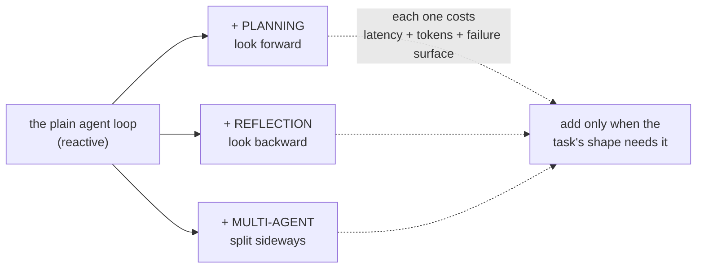
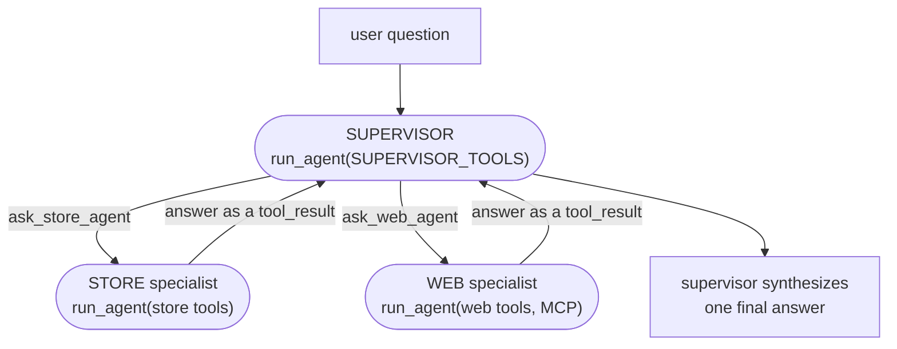
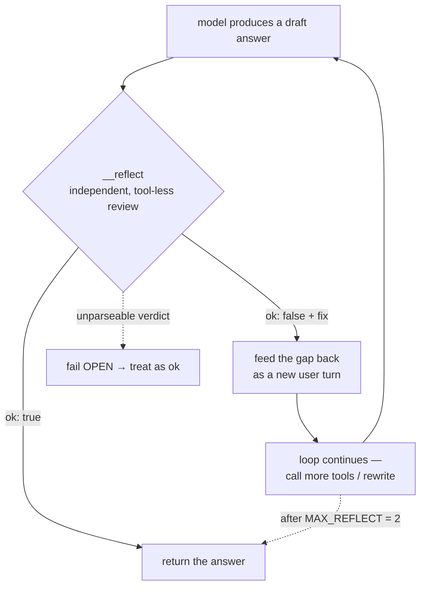
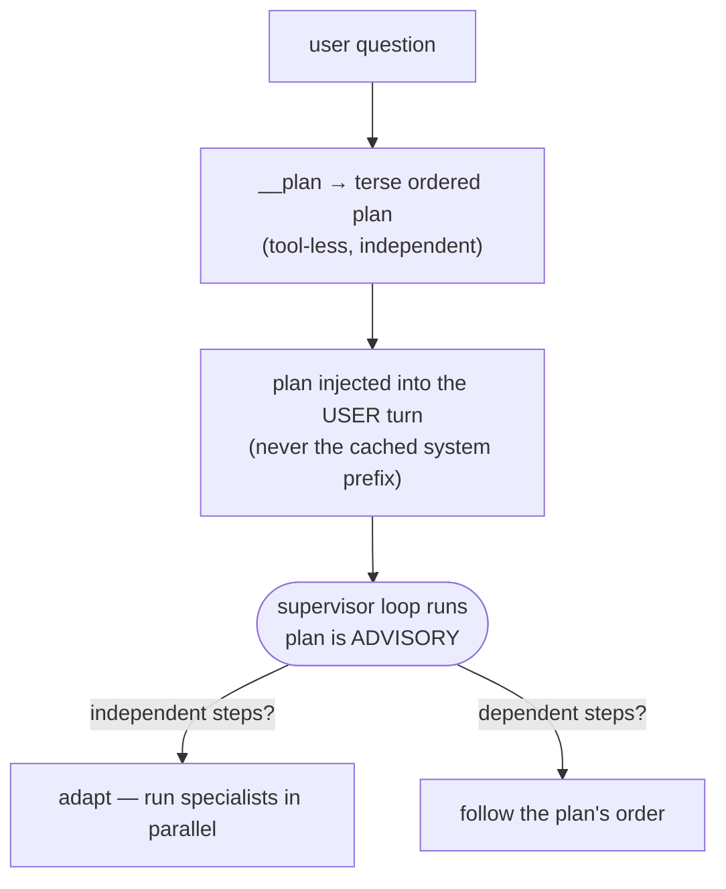
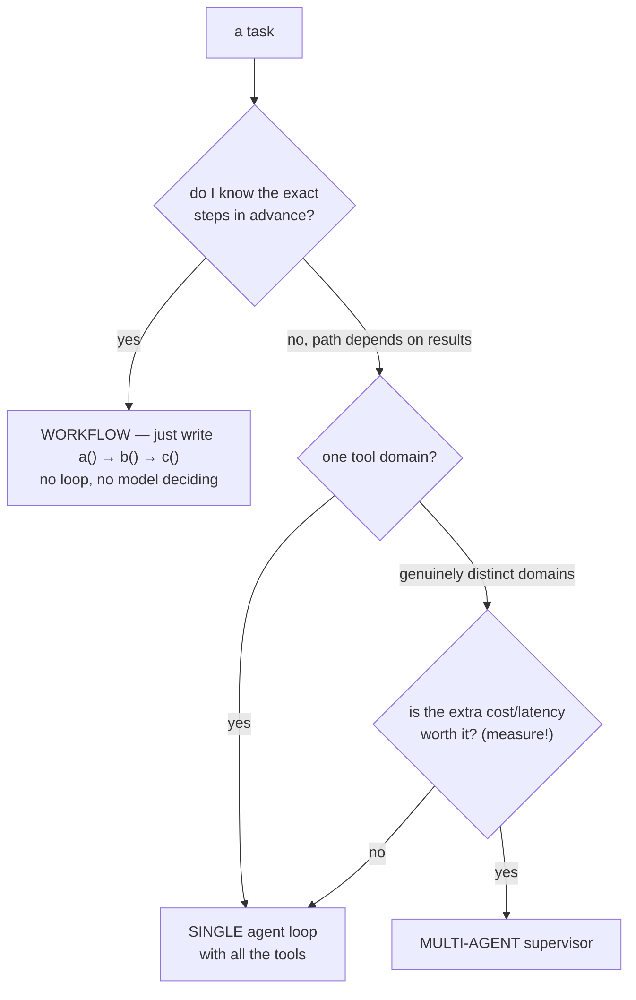
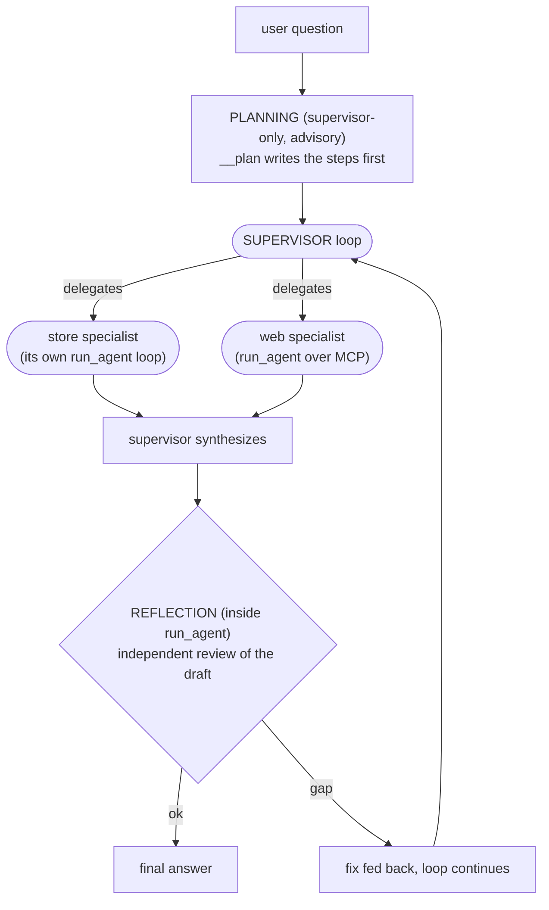

# Agentic Patterns — planning, reflection, multi-agent (and when NOT to use an agent)

> Personal revision notes. Real examples from the `tool-agent` project — the multi-agent supervisor, the reflection gate, and the planner all live in `app/multiagent.py` and `app/agent.py`.
> Diagrams in Mermaid. Follows on from notes 01 (the loop) and 02 (orchestration).

---

## 0. The 10-second mental model

The plain agent loop from note 01 is **reactive** — it decides the next step only after seeing the last result. That's enough for a lot of tasks. **Agentic patterns are optional structures you add on top when reactivity alone isn't enough:**

| Pattern | The direction it adds | One-line idea |
|---|---|---|
| **Planning** | look **forward** | write the steps *before* acting |
| **Reflection** | look **backward** | check the answer *after* drafting it |
| **Multi-agent** | **sideways** | split the work across specialists |

And the most important lesson sits underneath all three: **most tasks need none of them.** Every pattern buys capability with latency, cost, and new failure modes. The skill is knowing when the task's shape actually demands the structure — covered in §5.



---

## 1. Multi-agent — a sub-agent is just a tool whose body is another loop

This is the pattern that reframes everything. **A "specialist agent" is not a new kind of thing — it's a tool, and the code that runs the tool happens to be another whole agent loop.**

My project has two genuinely different tool worlds:

- **store tools** — 6 tools over a Postgres database (customers / orders / products)
- **web tools** — a separate MCP server (`web-toolkit`) that fetches and reads web pages

A **supervisor** sits on top. Its "tools" aren't SQL queries — they're the two specialists:

```python
SUPERVISOR_TOOLS = [
    {"name": "ask_store_agent", "description": "Ask the store specialist about customers, orders, or products."},
    {"name": "ask_web_agent",   "description": "Ask the web specialist to look something up on the public web (needs a URL)."},
]

def supervisor_dispatch(name, tool_input):
    q = tool_input["question"]
    if name == "ask_store_agent":
        return {"content": store_agent(q), "is_error": False}   # ← runs a WHOLE agent loop
    if name == "ask_web_agent":
        return {"content": web_agent(q),   "is_error": False}   # ← and so does this
```

The beautiful part: **it's the exact same loop three times.** `run_agent` was refactored to take its tools, system prompt, and dispatcher as parameters, so the supervisor and both specialists are all just `run_agent(...)` with different arguments.



**Routing is model-driven, not coded.** There is no `if` deciding which specialist runs — the supervisor's LLM reads the two tool descriptions and picks, exactly like the single-agent orchestration in note 02. A store-only question routes store-only; a URL question routes web-only; a mixed question calls both and synthesizes.

> **The MCP boundary, in one line:** the model doesn't speak MCP. The host/client code bridges MCP's format into the model's tool-call format (in my project, `web_tool_schema()` *is* that adapter — it calls the server's `list_tools` and converts each to the shape the model expects). That's why MCP is model-agnostic: any tool-calling LLM can drive the same server through its own adapter.

---

## 2. When NOT to use multi-agent (this is half the lesson)

Multi-agent is seductive and usually wrong. Each specialist call is a **whole nested loop** — its own model calls, its own latency, its own chance to fail. Stacking them multiplies all three.

| A single agent with all tools | Multi-agent supervisor |
|---|---|
| One loop, one context | N+1 loops, N+1 contexts |
| Cheapest, lowest latency | Multiplies both |
| Fewer places to fail | Every specialist is a new failure surface |
| Fine for one tool domain | Only pays off across **genuinely distinct** domains |

My project earns multi-agent **only because** the two worlds are truly separate: a Postgres store and an external web server, with different tools, different prompts, and a real protocol boundary (MCP) between them. If everything were store tools, a single agent with all six would be simpler and better in every way.

> **The test:** don't split into agents because it feels organized. Split only when you have distinct tool domains that genuinely don't share context — and even then, ask whether one agent holding all the tools would do fine. Usually it would.

**And measure it, don't assume.** My `run_supervisor` returns `(answer, summary)`, where `summary` records the delegations, per-agent token usage, and a `cost_usd` estimate. That exists so I can answer *"is multi-agent actually worth it for this question?"* with a number — run the same question through a plain single agent and through the supervisor, and compare cost and quality. (The cost figure is list price, meant for A-vs-B comparison, not billing.)

---

## 3. Reflection — an independent reviewer, looking backward

Reflection is the loop checking its **own draft answer** before returning it. The trap it avoids: a model asked *"is your answer good?"* about its own transcript will almost always rubber-stamp itself.

So the reviewer is deliberately **independent**:

- It's a **separate, tool-less `call_model`** with a **fresh two-message context** — just the *question* and the *draft answer*, not the actor's whole history.
- It returns a tiny JSON verdict: `{"ok": true}` or `{"ok": false, "fix": "<the gap>"}`.
- If the draft fails, the fix is fed back as a **new user turn** and the loop continues — the model can call more tools or rewrite.

```python
def __reflect(question, draft):
    review = [{"role": "user", "content": f"QUESTION:\n{question}\n\nDRAFT ANSWER:\n{draft}"}]
    resp = call_model(messages=review, system=REFLECT_SYSTEM)   # no tools, fresh context
    try:
        verdict = json.loads(text)
        return {"ok": bool(verdict.get("ok", True)), "fix": str(verdict.get("fix", ""))}
    except json.JSONDecodeError:
        return {"ok": True, "fix": ""}                          # ← FAIL OPEN
```

Three design choices worth keeping:

1. **It's bounded.** `MAX_REFLECT = 2` rounds, then the draft is accepted as-is. Combined with `MAX_ITERATIONS` from note 01, there are two independent ceilings so it can never spin.
2. **It fails OPEN.** If the verdict won't parse, treat the draft as acceptable. Reflection is an *enhancement*, never a gate that could trap a perfectly good answer behind a malformed critique.
3. **It lives INSIDE `run_agent`**, so the supervisor *and* both specialists inherit the gate for free — a direct payoff of the one-reusable-loop design.



> **The honest limitation (worth stating out loud):** the reviewer sees only the *question* and the *draft* — **not** the tool-result evidence. So it catches *partial* answers (a sub-question left unaddressed, vague hedging) well, but it **cannot verify grounding** — a confident claim the tools never actually supported passes review. The natural upgrade is to feed the tool results into the review too; that turns it into a *faithfulness* check (the RAG world calls this LLM-as-judge). Deferred, but flagged.

---

## 4. Planning — write the steps before acting, but keep it advisory

Planning adds a **forward** look: before delegating anything, produce an explicit ordered plan.

```python
def __plan(question):
    resp = call_model(messages=[{"role": "user", "content": question}], system=PLANNER_SYSTEM)  # tool-less
    return "".join(b.text for b in resp.content if b.type == "text").strip()
```

Same independent-call shape as `__reflect` — tool-less, fresh context. It returns a terse 1–4 step numbered plan naming which specialist handles each step. Then the supervisor runs as normal, with the plan added to its context.

Two decisions define how it behaves:

**It's ADVISORY, not binding.** The plan is injected as context and the supervisor is told *"follow it, but adapt if a result requires it."* The reactive loop still runs. This is the opposite of strict code-driven plan-then-execute, and the difference showed up live:

> A mixed question — *"what's our top-selling product; also look up `<wikipedia URL>` and summarize"* — got a plan that said **store → web → synthesize**, serially. But the two steps were independent (the URL was given up front), so the supervisor **fired both specialists in parallel in a single turn**, *adapting* the plan's ordering. A strict plan-then-execute would have forced them sequential and been slower.

**It's SUPERVISOR-ONLY**, not inside `run_agent`. Planning is where multi-step *coordination* happens; the specialists stay lean. Putting a planning step inside every agent would tax a trivial one-tool run for nothing.

> **One subtle but load-bearing detail:** the plan is injected into the **user turn**, *not* the system prompt. The system prompt + tool menu are the cached prefix and must stay byte-for-byte stable — a per-question plan in the prefix would bust prompt caching on every single call (see note 01 / the caching note). Per-question content goes in the user turn; only the stable stuff goes in the prefix.



**Planning and reflection compose for free.** Because the plan is part of the message `run_agent` receives, `__reflect` sees it too — so the reviewer can catch *"the draft skipped planned step 2."* Forward-looking planning and backward-looking reflection wired together without touching the loop itself.

---

## 5. When NOT to use an agent at all

The single most valuable judgment in this whole area. Work outward from cheapest:



- **Known, fixed steps → not an agent at all.** If you can write `a() → b() → c()`, do that. A loop that lets the model *decide* the steps is pure overhead when the steps are already known. (This is the workflow-vs-agent line from note 01.)
- **Unknown path, one tool domain → a single agent loop.** The default. Note 01 + note 02 cover this fully.
- **Reflection / planning → only when they earn it.** Skip reflection on answers that can't really be "incomplete". Skip planning on trivial one-tool runs — that's exactly *why* planning is supervisor-only in my project.
- **Multi-agent → last resort, and only across genuinely distinct domains** (§2), ideally with a measured before/after to prove it.

> The through-line: **each pattern is a cost you pay for a capability.** Reactivity is free-est; planning, reflection, and multi-agent each add latency, tokens, and failure surface. Reach for the *least* structure the task's shape actually requires.

---

## 6. How the three patterns sit together in my project



Multi-agent = the *shape* (supervisor + specialists). Planning = the *forward* pass before delegating. Reflection = the *backward* pass before returning. All three ride on **one reusable `run_agent` loop**.

---

## 7. The answer you can say out loud

> "The plain agent loop is **reactive** — it picks the next step after seeing the last result. The agentic patterns add structure on top: **planning** looks forward (write the steps before acting), **reflection** looks backward (check the draft before returning), and **multi-agent** splits the work sideways.
>
> In my project a specialist is just a **tool whose body is another agent loop** — the supervisor's 'tools' are `ask_store_agent` and `ask_web_agent`, and routing between them is model-driven, no `if` statements. It's the same `run_agent` three times. It earns multi-agent only because the store DB and the web MCP server are genuinely distinct domains — otherwise one agent with all the tools is simpler.
>
> **Reflection** is an *independent* reviewer — a separate tool-less call that sees only the question and the draft — bounded to two rounds and failing *open* so it never traps a good answer. Its honest limit is that it can't see the tool evidence, so it catches partial answers but not ungrounded ones.
>
> **Planning** is supervisor-only and *advisory* — the plan is injected into the user turn (not the cached system prefix), and the supervisor may adapt it; that's how it fired two independent specialists in parallel instead of following the plan's serial order.
>
> And the biggest lesson is knowing when to use **none** of this: known steps → just write the calls; unknown path but one tool domain → a single agent; multi-agent only across truly distinct domains, and only when a measured before/after says it's worth the extra cost and latency."

---

## 8. Quick-reference glossary

| Term | Meaning |
|---|---|
| **Agentic pattern** | Optional structure added to the plain loop: planning, reflection, or multi-agent. |
| **Reactive loop** | The plain agent — decides each step only after seeing the previous result. |
| **Multi-agent** | A supervisor whose tools are other agents. A specialist = a tool whose body is another `run_agent` loop. |
| **Supervisor / router** | The top agent that delegates to specialists by reading their tool descriptions (model-driven routing). |
| **Specialist** | An agent scoped to one tool domain (store tools, or web/MCP tools). |
| **MCP boundary** | The model doesn't speak MCP; the host adapts MCP tools into the model's tool-call format. Model-agnostic. |
| **Reflection** | An independent, tool-less review of the draft answer; bounded (`MAX_REFLECT=2`) and fails open. |
| **Fail open** | On an unparseable verdict, treat the draft as acceptable — an enhancement never blocks a good answer. |
| **Grounding / faithfulness** | Whether a claim is actually supported by the tool evidence. Current reflection can't check this (yet). |
| **Planning** | A forward pass that writes the steps before acting; here it's supervisor-only and **advisory**. |
| **Advisory plan** | The plan is guidance the model may adapt — not a rigid script (contrast: strict plan-then-execute). |
| **Workflow vs agent** | Known steps → workflow (write the calls). Unknown path → agent (the loop). |
| **When NOT to** | Every pattern costs latency + tokens + failure surface; use the least structure the task needs. |

---

*End of notes. See also: `01-The-Agent-Loop-ReAct.md`, `02-Multi-Tool-Orchestration.md`.*
