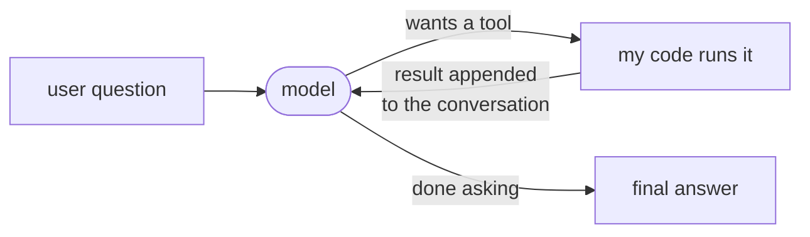
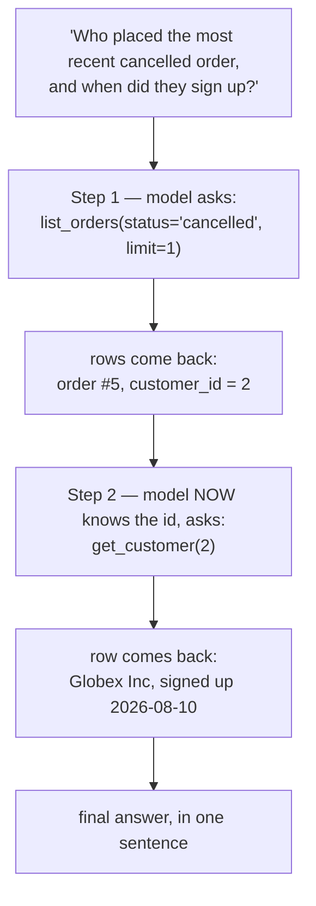
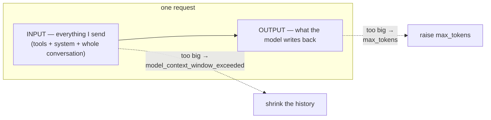
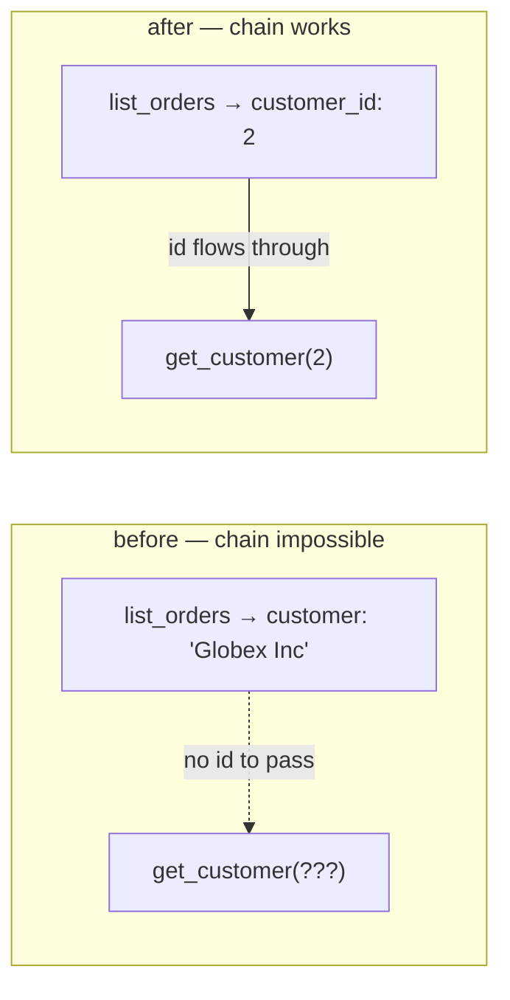

# The Agent Loop & Multi-Tool Orchestration — turning one tool call into something that finishes a task

> Personal study notes. Everything explained in plain terms.
> Diagrams are in Mermaid so they render visually.
> Every example here is from the `toolCall` project I actually built — a plain-English question → tool calls → real Postgres queries → answer.

---

## 0. The 10-second mental model

Note 04 ended with **one** round-trip: model asks for a tool → my code runs it → result goes back → model answers.

**An agent is that same round-trip, put in a loop.** That's genuinely it. No new model, no special API, no framework. You keep feeding results back until the model stops asking for tools.



The arrow going **back** into the model is the whole idea. One trip through = a tool call. Looping that arrow = an agent.

The name for this pattern is **ReAct** — short for **Rea**son + **Act**. Three moves, repeated:

| Move | What happens | Who does it |
|---|---|---|
| **Reason** | "To answer this I need the cancelled orders first." | The model |
| **Act** | Emits a request: `list_orders(status='cancelled')` | The model (it only *asks*) |
| **Observe** | The rows come back and get added to the conversation | **My code** |

Then it loops: the model reasons again, now knowing what it learned.

---

## 1. Why a loop is needed at all

Some questions can't be answered in one tool call — **not because the tool is weak, but because you don't know the second question until you've seen the first answer.**

Real example from my project:

> *"Who placed the most recent cancelled order, and when did they sign up?"*

I cannot pre-plan this. To look up the customer's signup date I need their id — and I don't know which customer it is until the orders query comes back. The steps are **discovered as you go**:



This is the difference between a **workflow** and an **agent**:

| | Workflow | Agent |
|---|---|---|
| Who decides the steps | You, in advance | The model, as it goes |
| Shape in code | `a() → b() → c()` | `while` loop |
| Good for | Known, fixed sequences | "It depends what we find" |

If you already know the exact steps, **don't use an agent** — just write the three function calls. The loop earns its cost only when the path is genuinely unknown up front.

---

## 2. The loop in real code

Here is the actual shape (trimmed to the essentials):

```python
messages = [{"role": "user", "content": user_question}]

while True:
    resp = call_model(messages, system=SYSTEM, tools=TOOLS)   # ← REASON

    if resp.stop_reason != "tool_use":                        # model is done
        return "".join(b.text for b in resp.content if b.type == "text")

    # keep the model's own turn in the history — see §3, this is not optional
    messages.append({"role": "assistant", "content": resp.content})

    results = []
    for block in resp.content:
        if block.type == "tool_use":
            output = dispatch(block.name, block.input)        # ← ACT (my code runs it)
            results.append({
                "type": "tool_result",
                "tool_use_id": block.id,                      # ← ties result to the request
                "content": output,
            })

    messages.append({"role": "user", "content": results})     # ← OBSERVE
```

Read it as three lines and the ReAct pattern falls out:

- `call_model(...)` — **reason**
- `dispatch(...)` — **act**
- `messages.append(results)` — **observe**

Loop back to the top. That's the agent.

> **The model never runs anything, even in an agent.** It still only emits requests. The loop doesn't give it hands — the loop just means *my code keeps offering to be its hands* until it stops asking.

---

## 3. The conversation IS the agent's memory

**Q: The model figured out `customer_id = 2` in step 1. How does it still know that in step 2?**

Because I sent it again. **The model remembers nothing between calls.** Every request is a fresh read of the entire `messages` list. It looks continuous only because the list keeps growing.

After the two-tool question, `messages` looks like this:

| # | role | content |
|---|---|---|
| 1 | user | "Who placed the most recent cancelled order…" |
| 2 | assistant | *(the model's `tool_use` request for `list_orders`)* |
| 3 | user | `tool_result` → the order row, containing `customer_id: 2` |
| 4 | assistant | *(its `tool_use` request for `get_customer(2)`)* |
| 5 | user | `tool_result` → the customer row |
| 6 | assistant | the final text answer |

Two rules fall straight out of this, and both bite if you get them wrong:

**1. You must append the model's own turn before you append the result.** Rows 2 and 4 above are the model's requests. If you skip them and jump straight to the result, the conversation contains an answer to a question that was never asked — the API rejects it, and if it didn't, the model would be reading nonsense.

**2. The `tool_use_id` is what pairs them.** Row 3's result carries the id from row 2's request. If the model asks for two tools at once, this id is the only thing saying which result belongs to which request — position is not enough.

> **Everything the model learns lives in that list and nowhere else.** No hidden state, no session on the server. That's also why the list is the thing that eventually gets expensive (→ §7).

---

## 4. How the loop knows when to stop

The exit condition is one field the API returns: **`stop_reason`**. You never set it — you read it.

| `stop_reason` | Plain meaning | What the loop should do |
|---|---|---|
| `tool_use` | "Run this for me." | Run it, append the result, **loop again** |
| `end_turn` | "I'm done, here's the answer." | Return the text — **exit** |
| `max_tokens` | Reply got cut off mid-sentence | Stop. Looping won't help — the same call truncates again |
| `model_context_window_exceeded` | The conversation itself no longer fits | Stop. Opposite fix: shrink the history |
| `refusal` | The model declined | Stop. Don't retry the same prompt |

The two token ones sound alike and are opposites, which is exactly why they're easy to confuse:



**`max_tokens` = the reply was too long. `model_context_window_exceeded` = the question was too long.** Fixing one by doing the other makes it worse.

---

## 5. Multi-tool orchestration — how the model picks

Now the second half: what happens when there's more than one tool on the menu.

My project has three, deliberately covering three different shapes of question:

| Tool | Shape | Answers questions like |
|---|---|---|
| `get_customer(customer_id)` | **lookup** — one row by id | "Who is customer 2?" |
| `list_orders(customer_id?, status?, limit?)` | **filtered list** — many rows, narrowed | "Show me cancelled orders" |
| `revenue_by_product()` | **aggregate** — a computed summary | "What sells best?" |

**Nothing in my code routes the question.** There's no `if "revenue" in question:` anywhere. The model reads the `description` of each tool and picks. That means:

> **The tool descriptions are the routing logic.** They're not comments — they're the only thing the model has to choose with. A vague description is a routing bug.

Compare:

```python
# weak — when would the model pick this over list_orders?
"description": "Gets revenue."

# strong — says WHEN to use it, in the user's own words
"description": (
    "Total revenue and units sold per product across all non-cancelled orders. "
    "Use for questions about sales, revenue, or best-selling products."
)
```

The pattern: **say what it returns, then say when to reach for it.** The second half is what does the picking.

Two more things the model reads without you thinking about it:

- **`enum` narrows the guessing.** `status` is declared as `enum: ["pending", "shipped", "delivered", "cancelled"]`, so the model fills in `"cancelled"` rather than inventing `"canceled"` or `"CANCELLED"` and quietly matching zero rows.
- **Optional vs required.** `list_orders` requires nothing, so the model can call it bare to get everything, or narrow it — one tool covering many questions instead of four near-identical tools.

**Fewer, clearly distinct tools beat many overlapping ones.** If two descriptions could both plausibly answer the same question, the model will sometimes pick the wrong one, and no amount of system-prompt scolding reliably fixes it. Fix the descriptions instead.

---

## 6. Chaining — the bug that taught me what orchestration really needs

This is the most useful thing I learned, and it took a real failure to see it.

The two-tool question kept failing. The model would call `list_orders(status='cancelled')` correctly, get the row back… and then stop, or guess. It never called `get_customer`.

The tools were both fine. The descriptions were fine. **The problem was the shape of the data coming back.**

My `list_orders` query joined to the customers table and returned the customer's **name**:

```sql
SELECT o.id, o.quantity, o.status, o.created_at,
       c.name AS customer, p.name AS product, p.price_cents   -- ← name, but no id
FROM orders o
JOIN customers c ON c.id = o.customer_id
...
```

So the model saw `customer: "Globex Inc"` — and `get_customer` needs a **numeric id**. The model had a name and no way to turn it into an id. The chain physically could not form. The fix was one column:

```sql
SELECT o.id, o.customer_id, o.quantity, o.status, o.created_at,   -- ← added o.customer_id
```

After that, the chain formed on the first try.

> **The lesson, generalized: for tool B to follow tool A, A's *output* must contain the *input* B needs.** Good descriptions get the model to pick the right tool. Only matching data shapes let it chain them.

So when designing a tool set, don't just ask *"is each tool useful?"* — ask **"can the model get from this tool's output to that tool's input?"** Human-friendly output (names, labels) often breaks chaining; the model needs the join keys too. It's fine to return both.



---

## 7. What a loop costs, and why caching is not optional

The tool menu and system prompt are **re-sent on every single turn** — the model is stateless, so there's no alternative. In a 3-step agent run you pay for that fixed block three times.

Measured on my own project (3 tools, short system prompt), input tokens per step:

```
step 1: 768      ← tools + system + question
step 2: 964      ← everything above + the model's request + the rows
step 3: 1094     ← and so on
```

The fixed part is ~750 tokens, and it's in **all three**. That's the tax.

**Prompt caching** is the fix. You mark a point in the request; everything before it gets stored, and later requests that start with the same bytes read it back at about **10% of the price** instead of being re-processed. The same run with caching turned on:

| step | processed fresh | written to cache | **read from cache** |
|---|---|---|---|
| 1 | 2 | 762 | 0 |
| 2 | 2 | 188 | **762** |
| 3 | 2 | 126 | **950** |

Step 1 pays to store the prefix. Step 2 reads all 762 back and only stores the 188 tokens that turn added. Step 3 reads 950. Fresh processing drops to **2 tokens**. Roughly **45% off the input cost** on a 3-step run, and it gets better the longer the loop runs — reads grow, writes stay small.

Because the conversation only ever grows at the end, the right setting is a **rolling** cache point that lands at the end of whatever's there now. Each turn caches its own tail; the next turn reads everything before it.

> ⚠️ **The gotcha that cost me two runs: caching has a minimum size, it differs per model, and below it caching just silently does nothing.** No error, no warning — the cache numbers simply stay `0`. My prefix is ~750 tokens. On `claude-opus-4-8` the minimum is **1024**, so my perfectly-correct caching config did nothing at all. On `claude-opus-5` the minimum is **512**, so the exact same code started working on the first request. Same code, different model, silent difference.

That is the lesson worth keeping: **when a feature can fail silently, "it ran fine" is not evidence it worked.** Read the numbers.

---

## 8. Making errors survivable creates a brand-new failure

Two changes to the loop, and the second one only exists because of the first.

**One dispatcher instead of calling functions directly.** The naive version:

```python
fn = HANDLERS[block.name]     # KeyError if the model invents a tool name
output = fn(**block.input)    # TypeError if it invents an argument
```

Both crash the whole run. But the model *inventing a slightly wrong tool name* is one of the most ordinary things it does. So everything goes through one function that **never raises** — it turns each failure into a message the model can read:

```python
def dispatch(name, tool_input):
    fn = HANDLERS.get(name)                      # .get(), not [] — never raises
    if fn is None:
        return {"content": f"Error: unknown tool {name!r}. Available: {', '.join(sorted(HANDLERS))}.",
                "is_error": True}
    try:
        output = fn(**tool_input)
    except TypeError as e:                       # bad or missing arguments
        return {"content": f"Error: bad arguments for {name}: {e}", "is_error": True}
    except Exception as e:                       # the query itself failed
        return {"content": f"Error running {name}: {type(e).__name__}: {e}", "is_error": True}
    return {"content": json.dumps(output, default=str), "is_error": False}
```

The error text goes back as a normal `tool_result` with **`is_error: True`** — a flag the API supports so the model is *told* it failed rather than having to infer it from prose. The model reads "unknown tool, here are the real names" and retries correctly. **A bad tool call now costs one extra turn instead of killing the run.**

**And that is exactly what creates the new problem.** With errors survivable, a model stuck retrying a broken call loops **forever** — the crash used to be the thing that stopped it. So the loop needs a ceiling:

```python
for step in range(1, MAX_ITERATIONS + 1):     # 10, instead of `while True`
    ...
return _degrade(f"hit MAX_ITERATIONS ({MAX_ITERATIONS})", messages)
```

And when you hit the ceiling, **return the partial work rather than raising** — the model may have made three good tool calls before getting stuck, and throwing an exception discards all of it. `_degrade()` digs the last text out of the conversation and returns it with a note about why it stopped.

> The general shape, worth remembering: **every safety net you add moves the failure somewhere else.** Catching errors removed the crash and created the infinite loop. The iteration cap is what closes it.

---

## 9. The traps

- **Skipping the assistant turn.** Appending a `tool_result` without first appending the model's request breaks the conversation. Easy to do, confusing to debug.
- **Splitting results across messages.** If the model asks for two tools at once, both results go in **one** user message. Sending them separately teaches the model to stop asking for parallel calls.
- **No iteration cap.** `while True` plus survivable errors = a run that never ends and quietly burns money.
- **Human-friendly tool output that can't be chained.** Names without ids (§6). The tools look fine in isolation and fail together.
- **Trusting a passing run.** My `dispatch` once had `is_error: True` on the *success* path — every good call was being reported to the model as a failure — and the answers still looked perfect, because models narrate smoothly over contradictory input. Test the error branches directly; don't infer them from a good-looking answer.
- **Tool results are untrusted input.** Whatever comes back from a database or a web page lands in the model's context. If it contains instructions, the model reads them. Same care as user input.
- **Valid ≠ safe.** Still true here, more so — an agent chains several calls without you seeing them individually. Gatekeeping belongs in the code, not in the prompt.

---

## 10. The answer you can say out loud

> "An agent isn't a different model — it's the tool-calling round-trip put in a loop. The model **reasons** about what it needs, **acts** by emitting a tool request (it still never executes anything — my code does), and **observes** when I append the result back to the conversation. Then it goes again. That's ReAct.
>
> The loop exists for questions where you can't plan the steps up front — *'who placed the most recent cancelled order and when did they sign up'* needs the orders query to finish before you even know which customer to look up. If I already knew the sequence, I'd just write the three calls; the loop earns its cost only when the path is unknown.
>
> The model has no memory between calls, so the whole growing `messages` list is re-sent every turn — which means the tool menu is re-paid for every turn too. Prompt caching fixes that: on my project it cut input cost about 45% on a 3-step run. It also has a per-model minimum size and fails **silently** below it, which is why I read the cache counters instead of assuming.
>
> With several tools, nothing in my code does the routing — the model picks by reading each tool's `description`, so those descriptions *are* the routing logic. And picking the right tool isn't enough for chaining: tool A's output has to physically contain the input tool B needs. I had a bug where `list_orders` returned the customer's name but not their id, so the model could never chain into `get_customer` — one missing column, and no amount of prompt tuning would have fixed it.
>
> Finally, every tool call goes through one dispatcher that never raises; failures come back as `is_error` results the model can read and recover from. That makes errors survivable — which is exactly why the loop also needs an iteration cap, because a model retrying a broken call would otherwise never stop."

---

## 11. Quick-reference glossary

| Term | Meaning |
|---|---|
| **Agent** | The tool-call round-trip run in a loop until the model stops asking for tools. Not a special model. |
| **ReAct** | Reason → Act → Observe, repeated. The name for that loop. |
| **Agent loop** | `call model → if tool_use: run it, append result → repeat`. |
| **`stop_reason`** | Field the API returns saying why generation stopped. The loop's only exit condition. |
| **`tool_use_id`** | Id on the model's request; copied onto the result so the two are paired. |
| **`is_error`** | Flag on a `tool_result` telling the model that call failed, instead of making it guess from the text. |
| **Dispatcher** | One function between the loop and the tools that never raises — turns every failure into a readable message. |
| **Degrade** | Return partial work with a reason instead of raising, when a guard trips. |
| **`MAX_ITERATIONS`** | Ceiling on loop turns. Needed *because* errors were made survivable. |
| **Orchestration** | The model choosing among several tools, and chaining them, using only their descriptions and outputs. |
| **Chaining** | Tool B consuming tool A's output — only possible if A returns the key B needs. |
| **Prompt caching** | Storing the repeated prefix so later turns read it at ~10% cost instead of reprocessing it. |
| **Rolling cache point** | Cache marker placed at the end of the current conversation, so each turn caches its own tail. |
| **Minimum cacheable prefix** | Size below which caching silently does nothing. Model-dependent (1024 on Opus 4.8, 512 on Opus 5). |
| **Token tax** | Tools + system prompt re-sent on every turn of the loop; caching is the main mitigation. |

---

*End of notes.*
