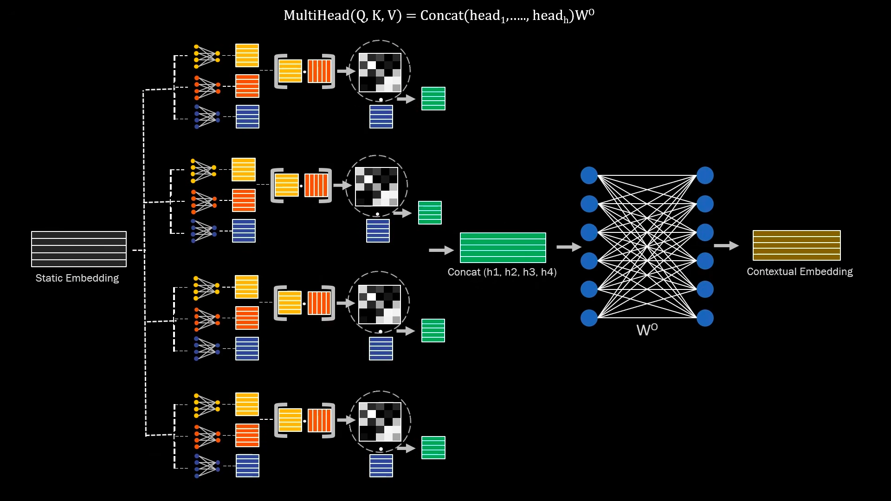

# How LLM Works

### Part 3 — Attention (how words gain context)

> Study notes. This rung picks up exactly where embeddings + position left off. Part 2 ended with *"tokens → word embeddings → + position embeddings → **attention** → …"* and flagged that attention is what turns **context-free** vectors into **context-aware** ones. This doc is about **what attention does, its exact terms (Q/K/V), and the math behind it** — so "attention" stops being a buzzword and becomes a concrete recipe you could compute by hand.

---

## 0. The big picture in one line

```
Each word looks at every other word, decides which ones are relevant to it,
and pulls in meaning from them — updating its own vector.
```

Before attention, "it" is a generic pronoun vector. After attention, "it" has *become* mostly "trophy," because it looked around and worked out what it refers to. Attention is the machine that does that looking-around.

> One-liner to say out loud: *"Self-attention lets every token mix in information from every other token, weighted by how relevant each one is."*

---

## 1. Why we need it (the "why")

Static embeddings give every word **one fixed meaning**, but real meaning depends on context:

- "river **bank**" vs "**bank** account" — same word, different meaning.
- "The trophy didn't fit in the suitcase because **it** was too **big**." → "it" = trophy.
  "…because **it** was too **small**." → "it" = suitcase. *Only the surrounding words decide.*

**The job:** turn a word's fixed vector into one that reflects the specific sentence it's in. That transformation is **attention**.

Two things it buys us that older models (RNNs) couldn't do well:

1. **Long-range links** — word #200 can look directly at word #1 in a *single step*. Distance doesn't matter.
2. **Full parallelism** — all word-to-word comparisons happen at once (great for GPUs). This is why the 2017 paper was called **"Attention Is All You Need."**

---

## 2. The three terms: Query, Key, Value (the "what")

Attention has exactly three roles. The cleanest analogy is **search** (think YouTube / a library):

| Term | Search analogy | In attention | "Who am I to…" |
|------|----------------|--------------|----------------|
| **Query (Q)** | what you *type* in the search box | what *this* word is looking for | …ask |
| **Key (K)** | the *title/tags* of each item | what *each* word offers | …be matched against |
| **Value (V)** | the *item you actually get* | the content that gets passed along | …hand over |

Every word produces all three. It sends out **its own Query**, and offers **its Key and Value** to everyone else. Then:

> Match my **Query** against everyone's **Key** → get a relevance score per word → turn scores into % → take that weighted blend of everyone's **Value** → that blend is my new vector.

Where do Q, K, V come from? Each is the word's embedding **multiplied by a learned weight matrix**:

```
Q = x · W_Q        K = x · W_K        V = x · W_V
```

`x` is the token's incoming vector (word + position). `W_Q`, `W_K`, `W_V` are **learned during training** — they're the actual knowledge of the attention layer. Same three matrices are applied to every token.

---

## 3. The math, step by step (the "how")

The entire mechanism is one famous formula:

```
Attention(Q, K, V) = softmax( (Q · Kᵀ) / √d_k ) · V
```

Don't panic — it's five small steps. Let's do each with a tiny worked example: **3 words**, vector size `d_k = 2` (real models use 64–128 per head; 2 keeps it hand-computable).

Say after projecting we have these Query/Key/Value vectors:

```
word     Q            K            V
w1      [1, 0]       [1, 0]       [10, 0]
w2      [0, 1]       [0, 1]       [0, 10]
w3      [1, 1]       [1, 1]       [5,  5]
```

We'll compute the new vector **for w3** (the others work the same way in parallel).

### Step 1 — Score: Query · Keyᵀ (dot product)

Take w3's Query `[1,1]` and dot it with **every** word's Key. A dot product is a similarity measure — bigger = more aligned = more relevant.

```
score(w3→w1) = [1,1]·[1,0] = 1
score(w3→w2) = [1,1]·[0,1] = 1
score(w3→w3) = [1,1]·[1,1] = 2
raw scores = [1, 1, 2]
```

### Step 2 — Scale: divide by √d_k

Divide every score by the square root of the vector dimension (`√2 ≈ 1.41`).

```
scaled = [1/1.41, 1/1.41, 2/1.41] = [0.71, 0.71, 1.41]
```

**Why scale?** With big vectors, dot products grow large; feeding large numbers into softmax makes it "spiky" (one value ≈ 1, rest ≈ 0), which **kills the gradient** and stops learning. Dividing by `√d_k` keeps the numbers in a sane range. This is why it's called **scaled dot-product attention**.

### Step 3 — Softmax: turn scores into weights that sum to 1

Softmax exponentiates each score and normalizes, giving a clean probability distribution — the **attention weights** ("how much attention w3 pays to each word").

```
softmax([0.71, 0.71, 1.41]) ≈ [0.27, 0.27, 0.46]     (sums to 1.0)
```

So w3 pays 27% attention to w1, 27% to w2, and 46% to itself.

### Step 4 — Weighted sum of Values

Blend everyone's **Value** vector using those weights:

```
new_w3 = 0.27·[10,0] + 0.27·[0,10] + 0.46·[5,5]
       = [2.7, 0]   + [0, 2.7]   + [2.3, 2.3]
       = [5.0, 5.0]
```

That `[5.0, 5.0]` is w3's **new, context-aware vector** — a mix of everything it found relevant. Do this for w1, w2, w3 simultaneously → out come three updated vectors. **That's one attention operation, start to finish.**

### The whole thing as matrices (why it's fast)

In practice you don't loop word-by-word. Stack all Queries into a matrix `Q`, all Keys into `K`, all Values into `V`, and the same five steps become **three matrix multiplications** the GPU does in one shot:

```
scores  = Q · Kᵀ            # (n×n) — every word vs every word
weights = softmax(scores / √d_k)
output  = weights · V       # (n×d) — the new vectors
```

`n` = number of tokens. Notice `scores` is `n × n` — every token against every token. (Hold that thought — §7.)

---

## 4. Self-attention vs cross-attention (the "which")

Same math, different sources for Q/K/V:

- **Self-attention** — Q, K, V all come from the **same** sequence. Words in a sentence looking at each other. This is the workhorse inside GPT/BERT.
- **Cross-attention** — Q comes from **one** sequence, K & V from **another**. Used in translation/encoder-decoder models: the output sentence (Q) attends to the input sentence (K, V). Also how many multimodal models let text attend to an image.

"Self" just means everyone's looking within their own group.

---

## 5. Masked (causal) attention — how GPT keeps it fair

A text-*generating* model must predict the next word using **only the words before it** — it can't peek at the future (that would be cheating during training). So before softmax, we **mask** all "future" scores by setting them to `−∞`, which softmax turns into `0` weight.

```
w1 can see: w1
w2 can see: w1 w2
w3 can see: w1 w2 w3        ← never w4, w5…
```

This is **causal / masked self-attention** — the "decoder" style used by GPT. (BERT is *unmasked*: it sees the whole sentence at once, which is why it's for understanding, not generation.)

---

## 6. Multi-head attention (looking many ways at once)

One attention pass captures **one kind** of relationship. But words relate in many ways simultaneously — grammar, reference, topic, tone. So we run several attention operations in **parallel**, each called a **head**, each with its *own* `W_Q/W_K/W_V`.

> Analogy: several people read the same sentence, each highlighting a different pattern (one tracks grammar, one tracks who-refers-to-what, one tracks tone), then you staple all their notes together.

Mechanically:

```
1. Split into h heads (e.g. 12). Each head gets its own W_Q/W_K/W_V.
2. Run scaled dot-product attention in each head, independently, in parallel.
3. Concatenate all heads' outputs back into one long vector.
4. Multiply by an output matrix W_O to mix them into the final result.
```

The whole thing is the title formula:

```
MultiHead(Q, K, V) = Concat(head₁, …, head_h) · W_O
```

Typical counts: 8, 12, 16, 32+ heads. Each head's dimension is usually `d_model / h` (e.g. 768 / 12 = 64), so the total cost stays about the same as one big head — you get diversity *for free*.

### 6.1 Reading the diagram



Walk it left → right:

| Stage in the image | What's happening |
|---|---|
| **Static Embedding** (grey box, far left) | one word's context-free vector (word + position). The *same* vector fans out to **all** heads (dashed lines) — heads are **not** fed different slices of the word; each gets the whole thing. |
| **little neural nets → 🟡🟠🔵 boxes** | inside each head the input is projected into **Query (🟡)**, **Key (🟠)**, **Value (🔵)** using *that head's own* `W_Q/W_K/W_V`. |
| **🟡 · 🟠 in the bracket** | `Q · Kᵀ / √d_k` → the scores (Steps 1–2 of §3). |
| **black-&-white checkered circle** | the **attention-weight matrix after softmax** — a bright cell = "this word attends strongly to that word." Each head's grid looks different because each had different Q/K. |
| **🟢 green box (per head)** | `weights · V` = that head's output vectors — the view from *this* lens. |
| **Concat(h1,h2,h3,h4)** | staple the 4 green outputs side-by-side into one long vector. |
| **W_O (dense blue mesh)** | multiply the concatenated vector by `W_O` to *mix* the heads → the **Contextual Embedding** (olive box) that flows to the next layer. |

### 6.2 Where does W_O come from?

`W_O` is a **learned weight matrix — exactly like `W_Q/W_K/W_V`.** It is *not* computed from the data or derived by a rule:

1. **Born random** — filled with small random numbers when the model is created; it knows nothing yet.
2. **Learned by backprop** — training measures the error (loss) and nudges every number in `W_O` (and every other matrix) to reduce it. After training it is **frozen**.
3. **Its job** — `Concat` only *stacks* the heads side by side; they never actually combined. `W_O` is the **mixing layer** that blends "head 1 found the grammar link, head 2 found what 'it' refers to, head 3 caught the tone" into one coherent vector.
4. **Its shape** — `(h·d_head) × d_model`. Since usually `h·d_head = d_model`, `W_O` is square and its main role is *mixing* — it also guarantees the output is the same size as the input, so blocks can stack.

> One-liner: *"W_O is the fifth matrix — three that **look** (W_Q/K/V, per head) and one that **combines** (W_O). All learned, all random at init, all frozen after training."*

---

## 7. Cost & limitations (the gotchas)

- **Quadratic cost — O(n²).** The `scores` matrix is `n × n`, so doubling the sequence length **quadruples** the compute and memory. This is *the* central bottleneck of transformers and why long context is expensive.
- **That's why context windows are limited** and why there's a whole research industry in **efficient attention** (FlashAttention for speed/memory; sparse/sliding-window attention like Longformer; linear-attention approximations).
- **No order sense on its own** — attention is order-blind; it *relies on* position embeddings (Part 2) to know word order.
- **Attention weights ≠ explanation.** It's tempting to read the weights as "what the model is thinking," but high attention doesn't cleanly mean "this is why it decided X." Treat them as a useful hint, not proof.

---

## 8. Where attention sits in the full block

Attention is not the whole transformer — it's one sub-layer. A transformer **block** is:

```
x → [ Multi-Head Attention ] → add & normalize → [ Feed-Forward network ] → add & normalize → out
        (mix info ACROSS words)                      (think about EACH word)
```

- **Attention** moves information *between* tokens (context).
- **Feed-forward** processes *each* token on its own (computation/"thinking").
- **Residual connections ("add")** and **layer normalization ("normalize")** keep training stable.

Stack this block **N times** (GPT-3: 96 times) and you have the core of an LLM. Attention is the part that makes the words *talk to each other*; the next doc covers the full block.

---

## 9. How the weights are stored & counted — parameters, d_model, layers

This bundles the questions that trip everyone up once multi-head clicks: what's actually kept after training, and how a pile of matrices becomes "175 billion parameters."

### 9.1 What is a "parameter"?

A weight matrix is just a **grid of numbers**. **Each single number is one parameter.**

```
        ┌            ┐
   W =  │  0.1   0.4 │
        │ -0.2   0.9 │      →  6 numbers  →  6 parameters
        │  0.7  -0.3 │
        └            ┘        (a 3×2 matrix)
```

So a matrix is **not** one parameter — it's a *container* of `rows × cols` parameters. "Billions of parameters" = the total count of all these numbers across the whole model. **Parameter count of a matrix = rows × columns.**

### 9.2 What is `d_model`?

`d_model` is the **length of a token's vector** as it flows through the model — the model's "width." Every embedding, every attention output, every layer's input and output is a vector of this size. GPT-3: `d_model = 12,288`. A single head works on a slice of it: `d_head = d_model / h`.

### 9.3 What is a "layer"?

A **layer = one full transformer block** = Multi-Head Attention + Feed-Forward (+ residual & layer-norm). An LLM stacks this identical block **N times**, and every layer has its **own fresh set** of matrices (layer 1's `W_Q` ≠ layer 5's `W_Q`):

```
input → [Layer 1] → [Layer 2] → … → [Layer N] → output
```

More layers = more chances to build up increasingly abstract understanding.

### 9.4 Does the model keep separate copies per head / per layer?

- **Per head — logically yes:** each head has its own `W_Q/W_K/W_V`. **Physically** they're usually **packed into one big matrix per layer** and *sliced* into `h` heads at runtime. So on disk it's *one* `W_Q` per layer that gets reshaped, not `h` little separate files. Same math, faster on GPUs.
- **Per layer — fully separate:** every layer stores its own complete set; nothing is shared between layers.
- After training, **every matrix is frozen and saved** — that saved checkpoint file *is* the model. Inference just reuses these frozen matrices; nothing is re-learned.

### 9.5 How you actually get to "175 billion" (GPT-3, worked)

```
d_model = 12,288 ,  N = 96 layers

one attention matrix  W_Q :  12,288 × 12,288           ≈ 151 M parameters
attention per layer   (W_Q + W_K + W_V + W_O = 4)      ≈ 604 M
feed-forward per layer (2 matrices, d_model × 4·d_model) ≈ 1,200 M
──────────────────────────────────────────────────────────────────
one layer                                              ≈ 1.8 B
× 96 layers                                            ≈ 173 B
+ embeddings / output                                  ≈ 175 B  ✅
```

So "175B parameters" is literally *every number in every matrix, added up*. Note: earlier we counted ~27,700 **matrices** for attention — that counts the *boxes*; the 175B counts the *numbers inside* all the boxes. **Different units — that's the usual point of confusion.**

### The whole chain in one view

```
number                          →  a parameter
grid of numbers                 →  a matrix   (W_Q ≈ 151M numbers)
matrices bundled together       →  one LAYER  (~1.8B params)
layer stacked N times           →  the MODEL  (~175B params)
```

---

## 10. Quick glossary

| Term | Plain meaning |
|------|---------------|
| **Attention** | Mechanism where each token pulls in info from relevant tokens |
| **Self-attention** | Q, K, V all from the same sequence (words attend to each other) |
| **Cross-attention** | Q from one sequence, K/V from another (e.g. output attends to input) |
| **Query (Q)** | What a token is looking for; matched against keys |
| **Key (K)** | What a token offers; compared against queries |
| **Value (V)** | The content a token passes along when attended to |
| **W_Q / W_K / W_V** | Learned weight matrices that produce Q, K, V from the input |
| **Dot product** | Multiply-and-sum of two vectors; a similarity score |
| **Scaled dot-product attention** | The core formula: softmax(QKᵀ/√d_k)·V |
| **√d_k scaling** | Divide scores by √(dimension) to keep softmax stable |
| **Softmax** | Turns raw scores into weights that are positive and sum to 1 |
| **Attention weights** | The per-token % of attention paid; output of softmax |
| **Masked / causal attention** | Block a token from seeing future tokens (GPT-style) |
| **Multi-head attention** | Run several attention ops in parallel, each a "head", then combine |
| **Head** | One independent attention operation with its own Q/K/V matrices |
| **W_O** | Output matrix that mixes concatenated heads into the final vector |
| **Parameter** | One individual learned number inside a weight matrix |
| **Matrix** | A grid of numbers; holds `rows × cols` parameters |
| **d_model** | Length of a token's vector throughout the model (its "width"); GPT-3 = 12,288 |
| **d_head** | A single head's slice of the vector, = `d_model / h` |
| **Layer / block** | One full transformer block (attention + feed-forward), stacked N times |
| **Checkpoint** | The saved file of all frozen weights after training — literally "the model" |
| **O(n²)** | Compute/memory grows with the square of sequence length |
| **Residual connection** | Add a layer's input to its output; stabilizes deep training |
| **Layer normalization** | Rescale a vector to a stable range; stabilizes training |

---

## 11. FAQ — the exact questions from this session

**Q: In one line, what does attention do?**
It lets every word look at every other word, score how relevant each is, and blend in their meaning — so a word's vector becomes specific to *this* sentence.

**Q: What are Q, K, V really?**
Three vectors made from each token by multiplying its embedding by learned matrices `W_Q/W_K/W_V`. Query = what I'm looking for, Key = what I offer for matching, Value = what I hand over when chosen. It's a search: match queries against keys, then collect values.

**Q: What's the actual math?**
`Attention(Q,K,V) = softmax(QKᵀ / √d_k) · V`. Five steps: (1) dot Query with every Key → scores; (2) divide by √d_k; (3) softmax → weights summing to 1; (4) weighted sum of Values → new vector; (5) done in parallel for all tokens via matrix multiply.

**Q: Why divide by √d_k?**
Large dot products make softmax saturate (one weight ≈1, rest ≈0), which flatlines gradients and stalls learning. Scaling keeps scores moderate so training works.

**Q: Why "multi-head"?**
One head captures one type of relationship. Multiple heads (each with its own Q/K/V) capture grammar, reference, topic, etc. simultaneously, then get concatenated and mixed by `W_O`. Roughly free because each head is smaller.

**Q: Why is long context expensive?**
Attention compares every token with every token → an `n × n` score matrix → O(n²) compute and memory. Doubling length quadruples cost. Hence context limits and "efficient attention" research.

**Q: How is GPT's attention different from BERT's?**
GPT uses **masked/causal** self-attention (each token sees only earlier tokens, so it can generate). BERT uses **unmasked** self-attention (sees the whole sentence, so it's for understanding).

**Q: Where does W_O come from?**
It's a learned matrix just like W_Q/K/V — random at init, tuned by backprop, frozen after training. Its job is to *mix* the concatenated head outputs into one d_model-sized vector. `Concat` alone just stacks the heads; W_O is what actually blends them.

**Q: After training, does the model keep W_Q/K/V/W_O? Many copies per head?**
Yes — all weights are frozen and saved; that file *is* the model. Logically each head has its own W_Q/K/V (per layer), but physically they're packed into one big matrix per layer and sliced into heads at runtime. Every layer keeps its own full, separate set — nothing shared between layers.

**Q: What's the difference between a "matrix" and a "parameter"?**
A parameter is one number. A matrix is a grid holding `rows × cols` parameters. So one W_Q in GPT-3 (12,288 × 12,288) is a *single matrix* but holds ~151 million *parameters*. Counting matrices ≠ counting parameters.

**Q: What is d_model, and what is a layer?**
`d_model` = the length of a token's vector everywhere in the model (GPT-3 = 12,288). A *layer* = one full transformer block (attention + feed-forward), and the model stacks N of them (GPT-3 = 96), each with its own weights.

**Q: How do you actually get to "175 billion parameters"?**
Add up every number in every matrix. Per layer ≈ 1.8B (≈0.6B attention + ≈1.2B feed-forward); × 96 layers ≈ 173B; + embeddings ≈ 175B. It's just a giant sum of all the learned numbers.

---

## 12. What's next (the following rungs)

- **The full transformer block** — attention + feed-forward + residual + layer-norm, stacked N times. This assembles everything so far (tokens → embeddings → position → attention → block → deep stack) into an actual model.
- Then **output & sampling** — how the final vectors become a probability over the vocabulary and how the next token is picked (temperature, top-k, top-p). *(Already partly covered in the Part 2 — Sampling notes.)*
- On the applied side: **RAG** and **vector databases** — the "outward" track that uses embeddings at runtime.

---

*Notes generated from a first-principles walkthrough. Q/K/V values and scores above are illustrative, hand-picked to be computable, not real model outputs. Continues from Part 2 — Embeddings & Position.*
