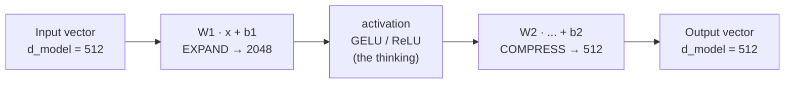
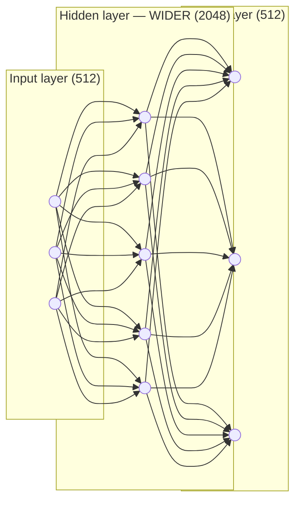
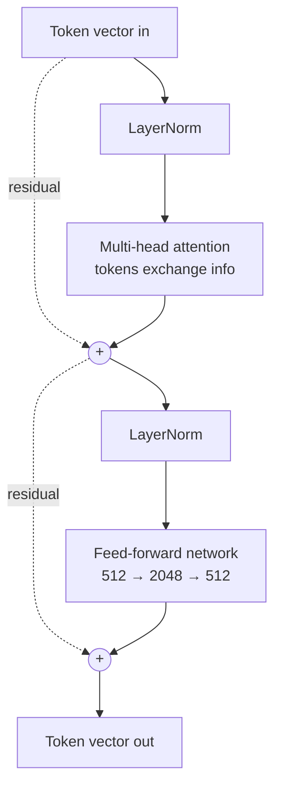
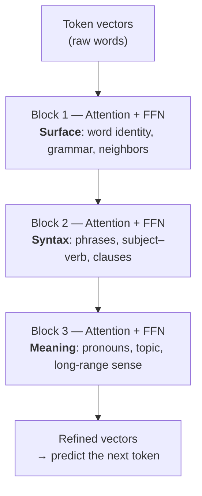

# Transformer Notes — FFN, Blocks, and How It All Fits

> Personal study notes. Everything explained in plain terms, with every symbol spelled out.
> Diagrams are written in Mermaid so they render visually.

---

## 0. The 10-second mental model

A transformer is a tall stack of identical **blocks**. Each block does two things in order:

1. **Attention** — tokens look at each other and gather relevant context. ("Who should I listen to?")
2. **FFN (feed-forward network)** — each token thinks on its own about what it just gathered. ("Given what I'm holding, what does it mean?")

Then it repeats: mix → think → mix → think → ... all the way up.

- **Attention = mixing across tokens** (tokens talk to each other).
- **FFN = per-token transforming** (each token processed alone, no talking).

---

## 1. The FFN (Feed-Forward Network)

### 1.1 What it is in one sentence

The FFN takes **one token's vector**, blows it up into a much bigger scratch space so it has room to detect lots of patterns, does a nonlinear "thinking" step there, then squashes the result back to the original size.

Everyday analogy: take a small note (input) → spread your working-out across a big whiteboard (expand) → think (activation) → write down a short conclusion (compress). The whiteboard is temporary; you only keep the conclusion.

### 1.2 The formula, every symbol explained

```
FFN(x) = W2 · activation(W1 · x + b1) + b2
```

Read it **inside-out**, the way the data actually flows:

| Symbol | Plain-English meaning |
|--------|----------------------|
| `x` | The input — one token's vector (e.g. 512 numbers). The "small note." |
| `W1` | First weight matrix. Multiplying `x` by `W1` **expands** 512 → 2048 numbers. Learned during training. |
| `b1` | First bias — a list of 2048 numbers added on after the multiply. An adjustable offset, like the `+ c` in `y = mx + c`. |
| `activation(...)` | The **nonlinear** step (GELU or ReLU). This is the actual "thinking." Without it the whole FFN collapses into plain linear algebra and learns nothing interesting. ReLU in plain terms: "if a number is negative, set it to 0; otherwise keep it." That simple bend is what gives the model its power. |
| `W2` | Second weight matrix. **Compresses** 2048 → 512. Learned. |
| `b2` | Second bias — final offset, size 512. |

**Flow:** `x` → multiply by `W1`, add `b1` → bend with activation → multiply by `W2`, add `b2` → 512 numbers out.

> Only the `W`s and `b`s are **learned** during training. `x` changes every time (it's the input). The `W`s and `b`s are fixed after training and **shared across every token**.

### 1.3 Diagram — the dimension flow



### 1.4 Why expand THEN compress?

It's about **giving the network room to work**.

- Say you have 512 features but want to detect ~2000 possible patterns ("is this a verb?", "is it plural?", "is it about food?", ...). You can't check 2000 things in 512 slots — they step on each other.
- `W1` opens up 2048 slots so each can specialize in **one** pattern.
- The activation acts like a switch on each slot: present patterns "light up" (positive survives), absent patterns shut off (negatives → 0 with ReLU).
- `W2` compresses back to 512 — but this isn't "undoing" the expansion. It **combines** the lit-up patterns into a refined 512-number summary.
- It **must** return to 512 because the output is added back to the token via the residual connection (sizes must match).

> **Key nuance:** "expand" does NOT mean "add information." The extra numbers are **elbow room** — the same information, spread out enough that the nonlinearity can cleanly separate patterns a cramped 512-wide space would tangle together.

Analogy: unzip a file to work with its contents, then zip the result back up to pass it along.

### 1.5 Modern variant you'll see in real code (SwiGLU)

LLaMA, Mistral, etc. don't use the plain 2-matrix FFN. They use **SwiGLU** — a *gated* version with three matrices:

```
FFN(x) = W3 · ( SiLU(W1·x) ⊙ (W2·x) )
```

Two parallel projections up: one through SiLU, one left linear as a "gate," multiplied element-wise (`⊙`), then projected down by `W3`. The gate lets the network modulate its own signal per dimension. Because there are 3 matrices now, `d_ff` is usually shrunk (~⅔ × 4 × d_model) to keep the parameter count similar.

---

## 2. The FFN is just an MLP in disguise

The classic "textbook neural network" (input layer → hidden layers → output layer, fully connected) is called an **MLP (Multi-Layer Perceptron)**.

**The FFN is a tiny MLP:** input → **one wide hidden layer** → output. Just two sets of connections = `W1` and `W2`.

The common confusion: a textbook MLP diagram often shows **3 hidden layers**. A transformer's FFN has only **1** hidden layer. And the transformer's *depth* comes from stacking **blocks**, NOT from stacking hidden layers inside one FFN.



- Connections between input and hidden = `W1` (expand).
- Connections between hidden and output = `W2` (compress).

> **Two different kinds of "depth":** hidden layers = depth *inside one MLP*. Blocks = depth *of the transformer*. They look similar ("3 of something") but live on different axes. Across 3 transformer blocks you have **3 separate 2-layer MLPs** (one per block), each with its own weights — not one MLP with 3 hidden layers.

---

## 3. One transformer block

A block = attention sublayer + FFN sublayer, each wrapped in **LayerNorm** (before) and a **residual add** (after).



**Terms:**

- **LayerNorm** — rescales the numbers so they stay in a stable range. In modern models it sits *before* each operation ("pre-norm"), so only the *copy* going into the sublayer is normalized; the main stream stays clean.
- **Residual add (`+`)** — `x = x + sublayer(x)`. The sublayer never *replaces* the vector; it computes an *update* that gets added on. This is why input and output sizes must match.
- **Residual stream** — the main line the vector travels on. Think of it as a "running document" each sublayer edits in the margins.

---

## 4. Why many blocks? (The eye-opener)

### 4.1 One block genuinely CANNOT do the job

Not "does it worse" — **cannot at all**. Some computations need a *chain*: resolve A, and only then can you use A to resolve B. B's input literally doesn't exist until A's block has run. It's like reading page 2 before page 1 is written.

> **More blocks = more things become POSSIBLE**, not the same thing done more carefully. Deeper models score higher *because* they can represent functions shallow ones can't reach at all.

### 4.2 The "it / trophy" example (what's really happening)

Sentence: *"The trophy didn't fit in the suitcase because **it** was too big."*

The real mechanism (not a literal labeled hop):

- A token can only look at what other tokens **currently contain**.
- In block 1, every token is still raw — nobody has gathered full context yet. So "it" looking around finds only shallow neighbors. Shallow lookup because everything being looked *at* is shallow.
- To resolve "it," the word "big" must first connect to "suitcase" and "trophy" — but *that* connecting is its own attention step in an **earlier** block.
- Only after that does "suitcase"/"big" carry enriched meaning that lets "it" point correctly in a **later** block.

> The "chain" isn't attention physically hopping. It's that **each block enriches every token a little, and a token can only benefit from another token's enrichment once that enrichment has already happened in an earlier block.** Better content this round → smarter lookups next round.

**Re-reading analogy:** First read = just the words. Second read = start connecting who did what. Third read = the ambiguous "it" clicks — but only because earlier reads built the context. Each block = one read-through.

### 4.3 Diagram — three blocks stacked (the progression)



Same structure every block, **richer input each time**. The vector climbs from *"what are these words"* at the bottom to *"what do they mean together"* at the top.

---

## 5. Who decides which block does what? (Nobody — it's learned)

This surprises engineers used to assigning responsibilities explicitly. There is **no code** saying "block 3, handle pronouns."

What actually happens:

1. You fix the **shape** (e.g. 32 identical blocks, given width, given number of heads).
2. Initialize all weights **randomly**.
3. Train the whole stack end-to-end on ONE objective: **predict the next token**.
4. Gradient descent nudges every weight to reduce prediction error. The division of labor **emerges on its own** as a byproduct.

Why it emerges reliably: block 1's input is raw tokens, so the most useful thing it *can* learn is surface work — that's the only signal available. Block 5's input is whatever blocks 1–4 produced, so it builds on richer material. Each block specializes in whatever is both useful for the goal and possible given what it receives. **The gradient of least resistance.**

**The engineer's decisions** = only the coarse dials: number of blocks, width, number of heads. Those set *capacity*. *What each block ends up doing* is learned.

**How do we even know they specialize?** Reverse-engineering after training (the field of **interpretability**). Freeze a trained model, run text through, probe the intermediate vectors. A classic result ("BERT rediscovers the NLP pipeline") shows layers line up with a traditional linguistic pipeline, in order, all on their own.

---

## 6. "What is each block's job?" — the answer you can say out loud

> "Each block does the same two things — attention, then a feed-forward step — but on progressively richer input. Early blocks handle surface stuff like word identity and grammar, middle blocks build up phrases and sentence structure, and later blocks work out meaning and long-range relationships. Nobody assigns these roles; they emerge on their own during training, because each block can only build on what the blocks below it already figured out."

The progression in more detail:

- **Early blocks** — close to raw text: word identity, word forms (plural, past tense), local neighbor patterns.
- **Middle blocks** — syntax and phrases: subject↔verb, grouping "the big red house" into one idea, clause boundaries.
- **Later blocks** — meaning: resolving a pronoun three clauses back, tracking topic, holding the overall sense needed to predict what's next.

**Two honest caveats** (say these if the person is technical):

1. Early→middle→late is a **tendency, not a strict rule**. Features are smeared across blocks; one block usually does several things at once.
2. Nobody designed it. You choose the number/size of blocks; the roles are **discovered** by training and read back out afterward by interpretability research. A full account of "what block 17 computes" is still an open problem.

> **One-line takeaway:** same operation every block, richer input each time, roles emerge rather than get assigned.

---

## 7. Do we still use MLPs today?

Yes — more than ever. Split it into two senses:

- **As a component inside bigger models — huge.** The FFN inside every transformer block *is* an MLP. Every time you use an LLM you're running billions of MLP computations (~⅔ of the model's weights live in FFN layers). CNNs and vision transformers end with MLP "heads"; recommender systems stack MLPs. The building block is everywhere.
- **As a standalone model — narrower today.** A plain MLP on its own is still solid for simple **tabular** data (rows/columns, e.g. house-price or fraud-score prediction). But for tabular data, tree methods (XGBoost, LightGBM) often beat it, and for text/images/audio, transformers and CNNs took over because they add the right structure (attention, convolution) a plain MLP lacks.

> The nice realization: studying the FFN this whole time, you were studying an MLP. The FFN is an MLP wearing a transformer's clothing.

---

## 8. Quick-reference glossary

| Term | Meaning |
|------|---------|
| **Token** | One chunk of input text (roughly a word or word-piece). |
| **Vector / embedding** | The list of numbers representing a token (size = `d_model`). |
| **d_model** | Width of a token's vector (e.g. 512). Input & output size of the FFN. |
| **d_ff** | Width of the FFN's hidden layer (e.g. 2048, ~4× d_model). |
| **Attention** | Mixing step — tokens gather info from each other. |
| **Multi-head attention** | Several attention operations in parallel ("heads"), each looking for different relationships. |
| **FFN** | Feed-forward network — per-token thinking step. A 2-layer MLP. |
| **Activation** | The nonlinear bend (ReLU/GELU/SiLU) that lets the model learn non-straight-line patterns. |
| **W1, W2 / b1, b2** | Learned weight matrices and biases inside the FFN. |
| **LayerNorm** | Rescaling step that keeps numbers stable; sits before each sublayer (pre-norm). |
| **Residual add** | `x = x + sublayer(x)` — sublayer output is an *update*, not a replacement. |
| **Residual stream** | The main line the vector travels on through all blocks (the "running document"). |
| **Block / layer** | Attention + FFN together (each with LayerNorm + residual). The unit that gets stacked. |
| **MLP** | Multi-Layer Perceptron — the classic fully-connected neural network. |
| **Interpretability** | Research that reverse-engineers what a trained model's parts do. |

---

*End of notes.*
