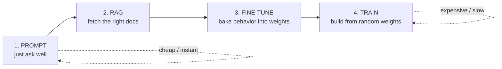
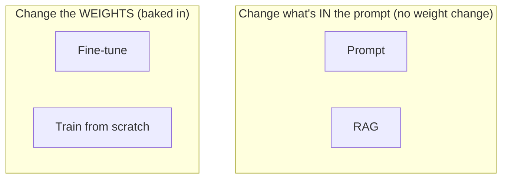
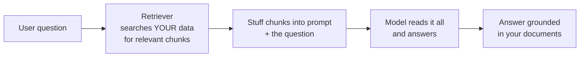
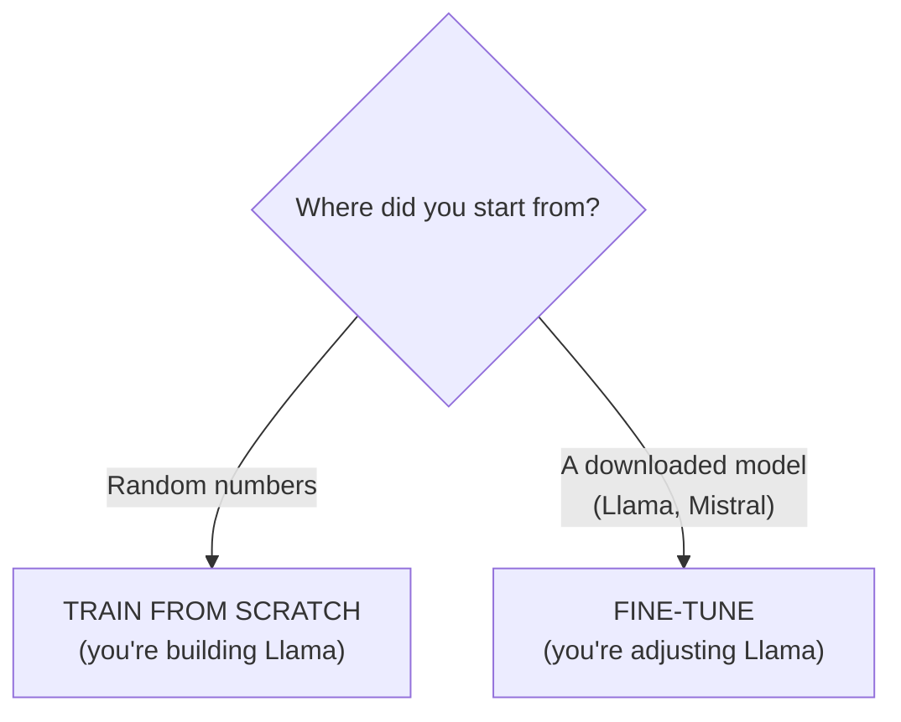
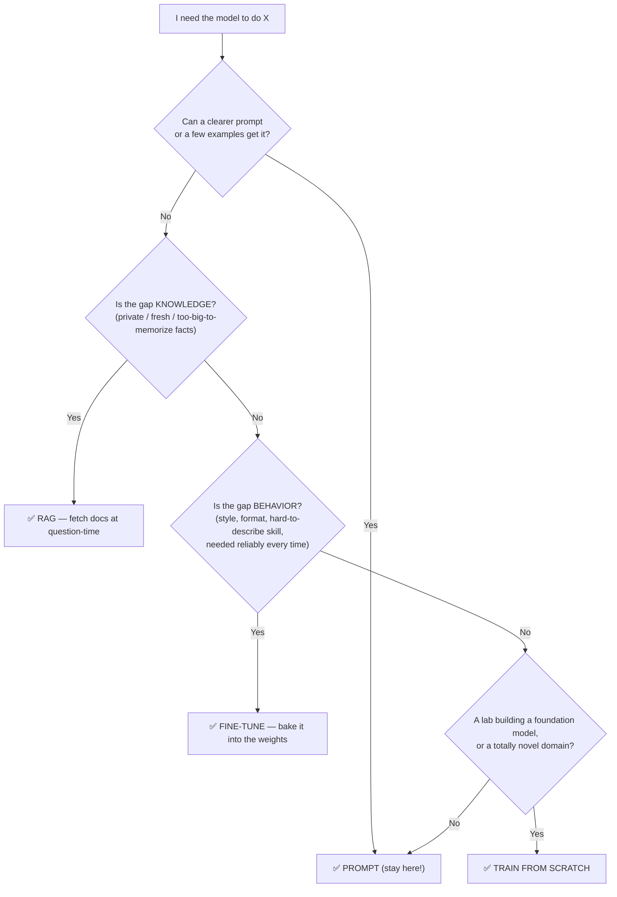
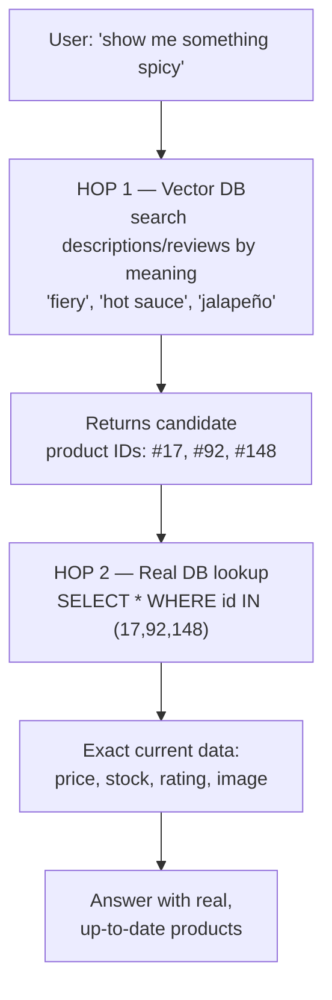
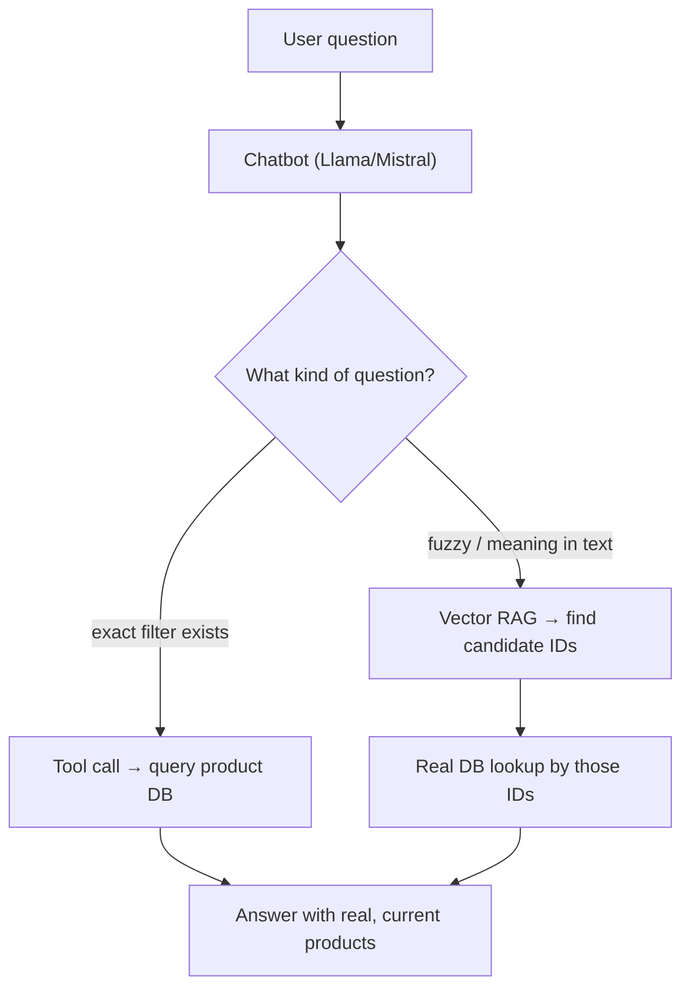

# Customizing an LLM — The Ladder: Prompt vs RAG vs Fine-tune vs Train

> Personal study notes. Everything explained in plain terms.
> Diagrams are written in Mermaid so they render visually.
> Ends with a real ecommerce chatbot case study built from the ground up.

---

## 0. The 10-second mental model

A base model (GPT, Llama, Mistral) is **already trained**. It's a smart generalist on their first day at your company. There are **four ways** to make this generalist useful for *your* job, cheapest/fastest → most expensive/slowest:

1. **Prompt** — *tell them what to do* (just talk to them).
2. **RAG** — *hand them the right documents* to read before they answer.
3. **Fine-tune** — *send them to a course* so a new skill/style becomes second nature.
4. **Train from scratch** — *raise a person from birth* to be exactly the expert you want.

> **The golden rule: climb only as high as you have to.** Start at the bottom rung. Move up only when the current rung genuinely *cannot* do the job. ~90% of real problems are solved on the bottom two rungs (Prompt + RAG).

---

## 1. The one distinction that makes the whole ladder click

Before the rungs, get this straight — most people get it wrong. There are **two different kinds of problems**:

| Problem type | The question it answers | Fixed by |
|---|---|---|
| **Knowledge** | "*Does the model have the right facts?*" | Prompt / **RAG** |
| **Behavior** | "*Does the model act / write / format the right way?*" | Prompt / **Fine-tune** |

And a second axis that splits the top half from the bottom half:

- **Prompt & RAG** → do **NOT** change the model's weights. You only change *what you put in front of it* at question-time. Instant, reversible, no training.
- **Fine-tune & Train** → **DO** change the weights. The change is *baked into the model*. Slower, costs money, permanent until you retrain.

> Keep repeating: **knowledge gap → RAG. behavior gap → fine-tune.** The most common industry mistake is reaching for expensive fine-tuning when the real problem was a knowledge gap (needed RAG) or just a lazy prompt.

---

## 2. Rung 1 — Prompting (just ask well)

**What it is:** You write better instructions. No training, no weights touched. Everything happens inside the **context window** (the text you feed in for that one request).

This rung includes more than it sounds like:
- **Instructions / system prompt** — "You are a support agent. Be concise. Never give legal advice."
- **Few-shot examples** — paste 2–3 example input→output pairs in the prompt; the model copies the pattern. Hugely underused.
- **Formatting the ask** — "think step by step," "output JSON."

**Analogy:** A skilled new hire who does exactly what you ask — *if* you ask clearly. Most "the AI is dumb" complaints are really "I gave a vague instruction."

| | |
|---|---|
| **Cost** | Almost nothing |
| **Speed** | Instant |
| **Changes weights?** | No |
| **Good for** | Behavior/format shaping, one-off tasks, prototyping, ~most tasks |
| **Limits** | Bounded by context window; still only knows what it was trained on; you re-send instructions every call |

> **Try this rung first, every time.** "We need to fine-tune" often turns into "oh, a better prompt fixed it."

---

## 3. Rung 2 — RAG (Retrieval-Augmented Generation)

**What it is:** At question-time, first **fetch the relevant documents** from *your* data (wiki, PDFs, database, today's news), paste them into the prompt, *then* ask. The model reads them and answers using them. Still **no weight change** — you're just changing *what's in the prompt*, automatically.

**Analogy:** An open-book exam. The student (model) is smart but doesn't have your private textbook memorized — so let them look up the right page *right before* answering.

**What it solves:** The base model doesn't know your **private** data, and its knowledge is **frozen** at its training cutoff (no last-week's-news, no internal policies). RAG feeds fresh, private facts at question-time.

| | |
|---|---|
| **Cost** | Moderate (build a search index / vector DB, keep it updated) |
| **Speed** | Set up once, then instant per query |
| **Changes weights?** | No |
| **Good for** | Private data, large knowledge bases, facts that change often, needing citations |
| **Limits** | Only as good as your retrieval; doesn't change *how* the model writes/behaves |

> **RAG is the answer to almost every "the model doesn't know X."** It's cheap, instantly updatable (just edit the document), and gives you receipts. Adding facts by fine-tuning is expensive, fragile, and forgotten easily.

---

## 4. Rung 3 — Fine-tuning (send it to a course)

**What it is:** Take the base model and **actually adjust its weights** by training further on *your* example input→output pairs. The new behavior gets **baked in**, so you no longer explain it in every prompt.

**Analogy:** Sending the employee to a specialized course. Afterward they *just do it that way* by instinct — no daily instructions needed.

**Good at — behavior, not facts:**
- A consistent **style/voice** (always sound like our brand).
- A reliable **format** every time (always valid JSON in this exact schema).
- A **skill** that's hard to describe but easy to *show* with 1,000 examples.
- Making a **smaller/cheaper** model behave like it "gets" your niche task.

**Bad at — facts.** Fine-tune on your product catalog and it learns the *style* of catalog entries but invents fake products (hallucinates), and goes stale the moment the catalog changes. That's a RAG job.

- **LoRA / PEFT** — the modern, cheap way: train a tiny set of add-on weights instead of all billions. Cheaper, faster, swappable like plugins. This is what "fine-tuning" usually means in practice.

| | |
|---|---|
| **Cost** | Real but manageable with LoRA (GPU time + a curated dataset — the dataset is the hard part) |
| **Speed** | Hours to days per run |
| **Changes weights?** | **Yes** |
| **Good for** | Consistent behavior/style/format, teaching a hard-to-describe skill, shrinking cost |
| **Limits** | Needs a quality dataset; poor for adding facts; goes stale; must retrain to update |

> **Fine-tune for *how it behaves*, never for *what it knows*.** Fine-tuning to add information? Stop — you want RAG.

---

## 5. Rung 4 — Training from scratch (raise it from birth)

**What it is:** Start from **random weights** and pre-train a brand-new model on a massive dataset. This is what OpenAI, Anthropic, Meta do to *create* base models.

**Analogy:** Not hiring or training an existing person — *raising a child from birth* into the exact expert you need.

**Reality check:** Millions of dollars, thousands of GPUs, trillions of tokens, a specialist team. Only for **foundation-model labs** or a **truly novel domain/modality** no model covers (proteins, a brand-new data type). For 99.9% of people, this rung **never applies**.

| | |
|---|---|
| **Cost** | Enormous ($millions, huge team + data) |
| **Speed** | Weeks to months |
| **Changes weights?** | **Yes — builds them from nothing** |
| **Good for** | Foundation-model labs; genuinely new domains |
| **Limits** | Cost, data, expertise — out of reach for almost everyone |

---

## 6. Key clarification — "fine-tune" vs "train from scratch"

A common confusion (worth nailing): **if I download Llama/Mistral and train them on my data, is that "training"?**

**No — that's fine-tuning.** Training from scratch means starting from **random weights**. The moment you begin from someone else's pre-trained model, you're on the fine-tune rung, no matter how much data you add.

> **Simple test:** Did you start from *random numbers* or a *downloaded model*? Random → train from scratch. Downloaded → fine-tune.

**But the deeper trap:** even when fine-tuning is the right *word*, it may be the wrong *tool* — it depends on **what's in your data**:

- **You want the model to KNOW the data** (answer about your users/orders/catalog) → **knowledge** problem → **RAG**, not fine-tune. Fine-tuning on DB rows makes it hallucinate fake records and go stale.
- **You want the model to BEHAVE a certain way** (your platform's tone/format/skill) → **behavior** problem → **fine-tune** is right.

> You rarely feed raw DB records into fine-tuning. The database is a **RAG** job.

---

## 7. The decision guide (how to actually pick)

> **And they stack.** Not either/or. A serious production system = a **good prompt** + **RAG** for private facts + *maybe* a **light fine-tune** for consistent format — all on top of someone else's base model. You climb rungs and keep the ones below.

---

## 8. Case study — a chatbot for an ecommerce site

Goal: a bot on our store where a user can ask *"which products are spicy?"* and get real, current answers. Let's build up the right architecture from our questions.

### 8.1 First instinct — is this RAG or fine-tune?

"Which products are spicy" needs **exact, current** facts from a catalog that changes daily → **knowledge** problem → **RAG family**, *never* fine-tune. Fine-tuning couldn't keep up and would invent products.

### 8.2 The fork inside RAG — two ways to fetch facts

| | **Structured query** (tool calling / text-to-SQL) | **Vector RAG** (semantic search) |
|---|---|---|
| Best for | Filterable, exact data in tables/DB | Fuzzy meaning in free text |
| How | Model calls your DB/API: `WHERE spice_level='hot'` | Model searches *descriptions/reviews* by meaning |
| Good question | "spicy products under $20, in stock" | "something with a kick for a summer BBQ" |
| Answer | Exact, complete, current | Approximate, based on how things are described |

- **If "spicy" is a real field/tag in the DB** → use **tool calling / text-to-SQL**. Turn the question into a `WHERE` filter, get the exact list. Don't fuzzy-guess when a clean filter is perfect.
- **If "spicy" only appears loosely in descriptions/reviews** → **vector RAG**, because it matches *meaning*, not exact words.

### 8.3 The clever case — no "spicy" category exists, but the meaning lives in text

What if there's **no spice field**, but descriptions/reviews say "fiery kick," "loaded with chili"? Then combine both in a **two-hop retrieval**:

**Why two hops — why not stop after the vector DB found them?** Because the two stores hold different things:

- **Vector DB** = a *frozen snapshot* of text turned into meaning-vectors. Great for "what is this *about*," but often **stale** (price/stock embedded last month is wrong now).
- **Real DB** = the *ground truth right now* — but can't answer "spicy" (no such column).

> **Vector DB = "find me the right *things*" (fuzzy). Real DB = "tell me the *truth* about those things" (exact & fresh).** Vector finds the IDs; the real DB fills in trustworthy details.

**How the vector DB knows "spicy" without a field:** when products were added, each product's **description/review text** was embedded into a vector. "Spicy" lands *near* "fiery kick"/"loaded with chili" in meaning-space even though the word never appears. That's the magic — it matches **meaning, not keywords** — and it hands back product IDs.

**The one requirement — the bridge is the product ID.** Each vector entry must carry the real DB's ID as metadata (`{id: 92, text: "...fiery jalapeño..."}`). That ID is the handoff: vector search returns IDs, the DB lookup keys on them.

### 8.4 What the whole bot looks like

Most production ecommerce bots use **tool calling as the backbone** (products, prices, stock, orders = structured lookups) plus **vector RAG** for the fuzzy stuff (reviews, "help me choose"). All on the RAG rung — **no fine-tuning for any of the facts.**

> Where fine-tuning *might* enter later: only to lock the bot's **tone/format** ("reply short, friendly, with a product card") — the *behavior*, never the product facts.

---

## 9. The answer you can say out loud

> "There's a ladder of ways to customize an LLM, cheap to expensive: **prompting** (ask well, with examples), **RAG** (fetch your relevant documents into the prompt), **fine-tuning** (adjust the model's weights on your examples so a behavior is baked in), and **training from scratch** (build a whole new model from random weights). Climb only as high as you must — start with prompting. The key split: missing *facts* is a knowledge problem → **RAG**; not *acting* right is a behavior problem → **fine-tuning**. Prompt and RAG don't touch the weights; fine-tune and train do. Downloading Llama and training it on my data is **fine-tuning**, not training. And for something like an ecommerce bot, product questions are always RAG — often tool-calling the DB, sometimes vector search to interpret fuzzy words, sometimes both in a two-hop (vector finds the IDs, the real DB gives the current truth)."

---

## 10. Quick-reference glossary

| Term | Meaning |
|---|---|
| **Base / foundation model** | The pre-trained generalist you start from (GPT, Llama, Mistral). |
| **Prompting** | Steering the model with instructions/examples in the request. No weight change. |
| **Few-shot** | Putting a few example input→output pairs in the prompt so it copies the pattern. |
| **Context window** | Text the model can "see" in one request; the space prompting/RAG work within. |
| **RAG** | Retrieval-Augmented Generation — fetch relevant data at question-time, add to the prompt. |
| **Retriever / vector DB** | The search system that finds relevant chunks of your data for RAG. |
| **Embedding / vector** | Text turned into numbers that capture *meaning*, so similar meanings sit close together. |
| **Semantic search** | Searching by meaning, not exact keywords (how vector DBs match). |
| **Tool calling / text-to-SQL** | Model turns a question into a real DB/API query and uses the exact result. |
| **Two-hop retrieval** | Vector search finds candidate IDs → real DB lookup fetches their current truth. |
| **Fine-tuning** | Continuing training on your examples to adjust weights and bake in a behavior. |
| **LoRA / PEFT** | Cheap fine-tuning — train a small add-on set of weights instead of all of them. |
| **Pre-training / training from scratch** | Building a model from random weights on massive data. Lab-scale. |
| **Hallucination** | The model confidently making up facts — a risk when you wrongly fine-tune to add knowledge. |
| **Knowledge vs behavior** | Facts the model has (fix with RAG) vs how it acts (fix with fine-tuning). |

---

*End of notes.*
