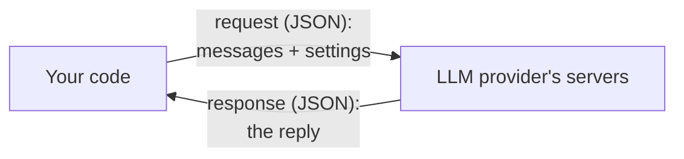
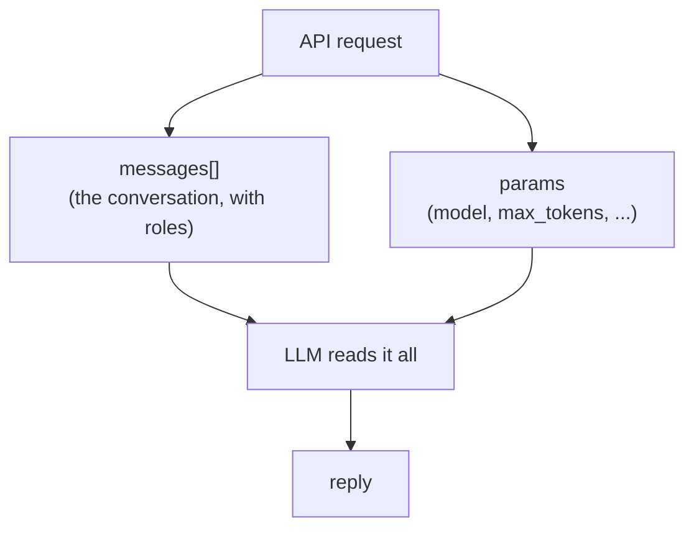
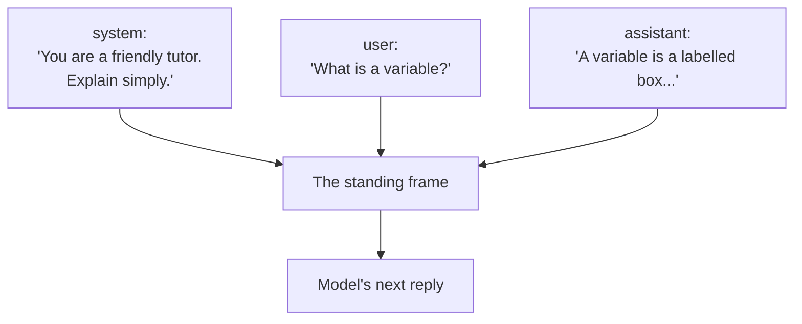
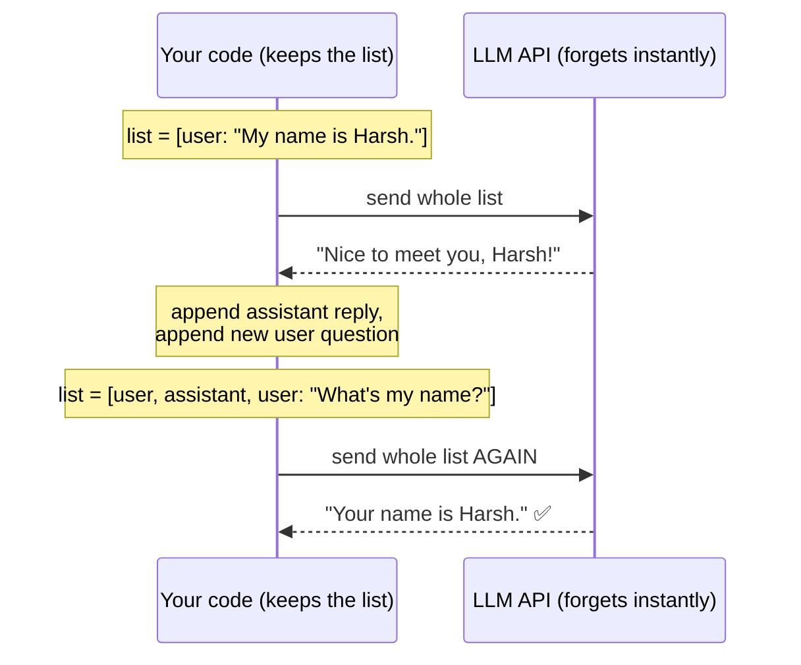
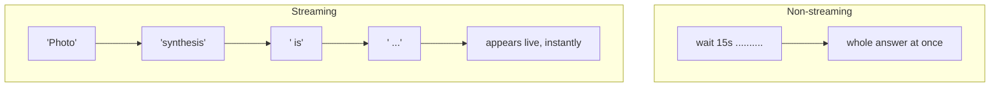
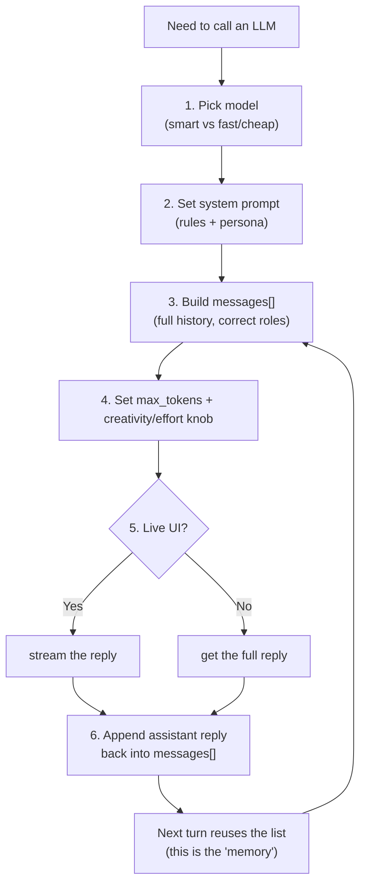

# Calling an LLM API — Roles, Params, Streaming & Multi-turn State

> Personal study notes. Everything explained in plain terms.
> Diagrams are written in Mermaid so they render visually.
> Code examples use Python + the Anthropic SDK, with notes on how OpenAI differs.

---

## 0. The 10-second mental model

An LLM (Claude, GPT, …) lives on a company's servers — **not** on your laptop. To use it, your code sends an **HTTP request** ("here's the conversation, please reply") and gets text back.

That's all "calling an LLM API" means: **send a structured conversation over the internet, receive a reply.**



> **The one fact that explains everything below: the API is _stateless_.** The server does **not** remember your previous messages. Every call starts from a blank slate. So *you* keep the conversation and re-send it each time. This single fact is why "multi-turn state" (§4) even exists as a problem.

---

## 1. The request has two parts: the conversation + the settings

Every call is just these two things:

| Part | What it is | Examples |
|---|---|---|
| **The conversation** | A list of messages, each tagged with a **role** | system / user / assistant messages |
| **The settings (params)** | Knobs that control the output | which model, reply length, creativity, streaming |

Get these two right and you can call any LLM API. Everything else is detail.



---

## 2. Message roles — system / user / assistant

A conversation isn't one blob of text. It's a **list of messages**, and each carries a **role** that tells the model *who is speaking*. Think of a play's script with labelled speakers.

| Role | Who | Purpose |
|---|---|---|
| **system** | You, the developer | Standing rules, personality, context. The "job description." Not part of the chat — it frames *everything*. |
| **user** | The human | What the person asks or says. |
| **assistant** | The AI | The model's replies (past and present). |

**Why bother separating them?** So the model knows how to weigh each line. A `system` line ("be a terse tutor") shapes the whole conversation; a `user` line is a request to answer; an `assistant` line is a reminder of what the AI already said.



> **Analogy.** `system` = the sign at a help desk ("Rules: be polite, answer in English"). `user` = a customer's question. `assistant` = the clerk's answer. The sign isn't a question — it silently governs every answer.

### Example

```python
from anthropic import Anthropic

client = Anthropic()  # reads the API key from the environment (ANTHROPIC_API_KEY)

response = client.messages.create(
    model="claude-opus-4-8",
    max_tokens=1024,
    system="You are a friendly tutor. Explain simply, with one example each.",
    messages=[
        {"role": "user", "content": "What is a variable in programming?"}
    ],
)

print(response.content[0].text)
```

- `system` is its own top-level field (the standing instructions).
- `messages` is the **list** — here, one `user` turn.
- The reply text lives in `response.content[0].text`.

> ⚠️ **Provider difference — where `system` goes.**
> - **Anthropic (Claude):** `system` is a separate top-level parameter (as above).
> - **OpenAI (GPT):** there's no separate field — the system prompt is just the **first message in the list** with `{"role": "system", "content": "..."}`.
>
> Same concept ("standing instructions"), different plumbing. The `user` / `assistant` roles work the same in both.

---

## 3. Params — the knobs you turn

Params are the settings sent alongside the conversation. The ones that matter:

| Param | What it controls | Plain-terms |
|---|---|---|
| **model** | Which "brain" | Smart/slow/pricey (Opus) vs fast/cheap (Haiku). |
| **max_tokens** | Max length of the **reply** | A "word budget." 1 token ≈ ¾ of a word. Too small → reply cut off mid-sentence. |
| **creativity knob** | Randomness of output | Low = focused, predictable. High = varied, creative. (Name varies — see the ⚠️ box.) |
| **stream** | Reply arrives piece-by-piece | See §5. |
| **tools** | Give the model abilities | Call functions, search, run code (a later topic). |

```python
response = client.messages.create(
    model="claude-opus-4-8",
    max_tokens=500,        # cap the reply length
    messages=[{"role": "user", "content": "Write a two-line poem about the sea."}],
)
```

> **Two params you set on _every_ call: `model` and `max_tokens`.** Don't lowball `max_tokens` — if the model hits the cap, the answer truncates and you have to retry. A sane default is ~1024 for short answers, higher for long ones.

> ⚠️ **Provider difference — the "creativity" knob.** The *concept* (a dial for randomness/effort) is universal; the *exact parameter* is not:
> - **OpenAI (GPT):** `temperature` (0 = deterministic-ish, higher = more random), plus `top_p`.
> - **Newest Claude (Opus 4.8, Sonnet 5, …):** `temperature`/`top_p`/`top_k` were **removed**. Instead you steer with `output_config.effort` (`low` → `max`) and the model does "adaptive thinking" — it decides how hard to think on its own.
>
> So: understand the idea as "a knob for randomness/effort," but always check the current docs for the model you're calling before hard-coding a param name.

---

## 4. Multi-turn state — how a chatbot "remembers"

The trickiest idea, and it follows directly from §0: **the API has no memory.** Each call is independent. So how does a chatbot recall what you said three messages ago?

**You remember it. You re-send the whole conversation every single turn.**

Each turn you *append* the new messages to your list and send the **entire history** again. The model re-reads all of it and continues.



### Turn 1

```python
messages = [
    {"role": "user", "content": "My name is Harsh."}
]
r1 = client.messages.create(model="claude-opus-4-8", max_tokens=200, messages=messages)
# r1 -> "Nice to meet you, Harsh!"
```

### Turn 2 — you must add the AI's reply **and** the new question

```python
messages.append({"role": "assistant", "content": r1.content[0].text})  # what the AI said
messages.append({"role": "user", "content": "What's my name?"})        # the new question

r2 = client.messages.create(model="claude-opus-4-8", max_tokens=200, messages=messages)
# r2 -> "Your name is Harsh."  ✅  (works ONLY because turn 1 was re-sent)
```

The list the model now sees:

```
[
  {role: user,      content: "My name is Harsh."}
  {role: assistant, content: "Nice to meet you, Harsh!"}
  {role: user,      content: "What's my name?"}
]
```

If you had **not** re-sent the first two messages, turn 2 would answer "I don't know your name" — because the server genuinely forgot.

> **Analogy.** The LLM is a brilliant consultant with **total amnesia** after every meeting. Before each meeting you hand them the full transcript of everything said so far. They read it, respond intelligently, then forget again. Keeping and re-delivering that transcript is *your* job as the developer.

**Two consequences worth burning in:**

1. **Cost grows every turn.** You pay per token and re-send the whole history each turn, so long chats get pricier as they go. (Fixes you'll meet later: *prompt caching*, and *summarizing* old turns.)
2. **There's a context limit.** Each model can only read so much at once (its **context window**). Long conversations must eventually be trimmed or summarized.

---

## 5. Streaming — reply word-by-word

**The problem.** A long answer can take 10–20 seconds. Waiting for the whole thing means the user stares at a blank screen, and very long replies can even time out.

**The fix — streaming.** The server sends the reply in small pieces (tokens) *as it generates them*, instead of all at once. This is exactly why ChatGPT/Claude appear to "type" at you.



### Example

```python
with client.messages.stream(
    model="claude-opus-4-8",
    max_tokens=1024,
    messages=[{"role": "user", "content": "Explain photosynthesis."}],
) as stream:
    for text in stream.text_stream:
        print(text, end="", flush=True)   # print each piece as it arrives
```

**When to stream:**

| Stream it ✅ | Don't bother ❌ |
|---|---|
| Chat UIs / anything a person watches live | Quick background jobs, nobody watching |
| Long outputs (avoids timeouts) | Short classification/extraction results |

> **Analogy.** Non-streaming = the waiter brings your whole meal at once after a long wait. Streaming = each dish arrives as it's ready. Same food, feels far faster.

---

## 6. The full flow — one clean picture



---

## 7. The answer you can say out loud

> "Calling an LLM API means sending a conversation plus some settings to the provider's server and getting a reply. The conversation is a **list of messages**, each with a **role**: `system` (my standing rules and the AI's persona), `user` (the human), and `assistant` (the AI's turns). The settings are **params** — always `model` and `max_tokens` (the reply's length budget), plus a creativity/effort knob whose exact name depends on the provider (OpenAI uses `temperature`; the newest Claude models dropped it for an `effort` setting). **Streaming** sends the reply token-by-token so a live UI feels instant and long replies don't time out. And the crucial part: the API is **stateless** — it forgets everything between calls — so to get multi-turn 'memory' I keep the conversation on my side and **re-send the whole history each turn**, appending the AI's last reply and the user's new message. That also means cost grows with the conversation and I'm bounded by the model's context window."

---

## 8. Quick-reference glossary

| Term | Meaning |
|---|---|
| **API call** | One request/response round trip to the LLM's server. |
| **Stateless** | The server keeps no memory between calls; each request is independent. |
| **Message** | One turn in the conversation: `{role, content}`. |
| **Role** | Who is speaking: `system`, `user`, or `assistant`. |
| **System prompt** | Standing instructions / persona that frame the whole conversation. |
| **Token** | A chunk of text (~¾ of a word) the model reads/writes; billing and limits are per token. |
| **max_tokens** | Cap on the length of the model's reply. |
| **temperature / effort** | The randomness/creativity (or thinking-depth) knob; exact name varies by provider. |
| **Streaming** | Receiving the reply piece-by-piece as it's generated, instead of all at once. |
| **Multi-turn** | A conversation with more than one back-and-forth. |
| **Conversation history** | The full list of past messages you re-send each turn to give the model "memory." |
| **Context window** | The max amount of text a model can read in a single request. |
| **SDK** | The provider's official library (e.g. `anthropic`, `openai`) that wraps the raw HTTP calls. |

---

*End of notes.*
