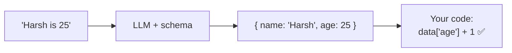
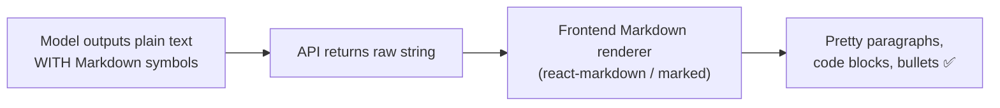

# Structured Output — Forcing JSON Your Code Can Parse Deterministically

> Personal study notes. Everything explained in plain terms.
> Diagrams are in Mermaid so they render visually.

---

## 0. The 10-second mental model

An LLM's native output is **free text meant for a human**. But in a real app, the next thing that touches the output is usually **your code**, not a person — and code can't reliably read a sentence.

**Structured output = forcing the model to reply in a fixed, machine-readable shape (JSON) that matches a schema your code already expects.** Same shape, every call → your parser never has to guess. That's the "**deterministically**" part.



Without it you'd get `"Sure! Harsh is 25 years old 😊"` — and `result['age']` explodes.

---

## 1. The big confusion, cleared first

> *"If the schema is `{age: number}`, how does the model answer any question? What if I ask for code?"*

**The schema belongs to your *feature*, not to the user's question.** You (the developer) attach a schema only to a task where **you already know the shape you want back**. The user never sees or picks it — they just provide raw input.

```
Feature: "Resume parser"    → schema {name, email, skills[]}
Feature: "Sentiment tagger" → schema {sentiment: enum}
Feature: "General chatbot"  → NO schema  (see §5)
```

You'd never point the age-extractor at a coding question — same as you'd never call `parseInvoice()` on a photo of a cat. **Structured output is for narrow, known-shape tasks.** Open-ended tasks don't use it.

| Is the output shape known ahead of time? | Force a schema? |
|---|---|
| Yes — extract fields, pick a label, fill a form | ✅ |
| No — general chat, open Q&A, "write me code" | ❌ free text |

---

## 2. The reliability ladder (flimsy → bulletproof)

There are several ways to get JSON out; knowing the ladder *is* the skill.

| Level | Method | Reliability |
|---|---|---|
| 1 | **Just ask** — "reply in JSON" in the prompt | 😬 weak — may add prose / ```json fences / trailing commas |
| 2 | Ask **+ few-shot + delimiters** (topic 02's tools) | 🙂 better, not guaranteed |
| 3 | **Prefill** the assistant turn with `{` (Claude) | 👍 forces a JSON start |
| 4 | **Tool / function calling** — model fills a schema | 💪 strong |
| 5 | **Native structured output** (JSON Schema mode) | 🔒 guaranteed |

The jump that matters: **1–2 are "please," 4–5 are "guaranteed."** Levels 4–5 use **constrained decoding** — at generation time the model is *physically restricted* to only emit tokens that keep the output valid against the schema. It literally can't wander off-format.

---

## 3. The contract — JSON Schema

You describe the shape; the model must fill it.

```json
{
  "type": "object",
  "properties": {
    "name":      { "type": "string" },
    "age":       { "type": "integer" },
    "sentiment": { "type": "string", "enum": ["positive", "negative", "neutral"] }
  },
  "required": ["name", "age", "sentiment"]
}
```

> `enum` is the superpower: the model **cannot** return "kinda positive" — it must pick one of your listed values. That's how classification outputs become safe to `switch` on.

---

## 4. How to do it (per provider)

**Anthropic (Claude)**

*Prefill (quick, level 3):*
```python
messages=[
    {"role": "user", "content": "Extract name and age from 'Harsh is 25'. JSON only."},
    {"role": "assistant", "content": "{"}    # forces JSON start; prepend "{" back to the reply
]
```
*Tool use (robust, level 4):* define a tool whose **input schema** is your desired shape and force the model to call it — the tool arguments come back as schema-valid JSON.

**OpenAI (GPT) — native structured output (level 5):**
```python
response_format={"type": "json_schema", "json_schema": {...}, "strict": True}
# strict: True = guaranteed to match the schema
```

**The clean production pattern — Pydantic:** define the shape once as a Python class; the SDK builds the schema *and* validates the reply back into a typed object.
```python
from pydantic import BaseModel

class Person(BaseModel):
    name: str
    age: int

person = extract(Person, "Harsh is 25")   # -> Person(name='Harsh', age=25)
```
One definition = the schema you send **and** the type you get back.

---

## 5. Markdown vs Structured Output — DON'T confuse these

> *"But how do ChatGPT / Claude show perfect paragraphs, code blocks, bullets, bold text?"*

That is **not** structured output. It's **Markdown**, and it's a totally separate mechanism.

**The model just writes plain text with Markdown symbols in it** (`- item`, `**bold**`, ```` ```python ````). Then the **app's frontend runs a Markdown renderer** that turns those symbols into styled HTML. If you called the raw API, you'd see the literal `**` and backticks — the visuals only appear because the website renders them.



*Why* does it produce Markdown? Two soft reasons — **not** a schema:
1. **Training / RLHF** — trained & rewarded to format readably, so it's learned default behavior.
2. **System prompt nudge** — often *"Use Markdown, code blocks for code, bullets for lists"* (the role/tone lever from topic 02).

So it's **soft** (learned + requested), not **hard** (constrained). Nothing physically stops a flat-paragraph reply.

| | **Markdown formatting** | **Structured output (JSON)** |
|---|---|---|
| For whom? | A **human** reading | Your **code** parsing |
| What is it? | Plain text with `**`, `-`, ``` ``` marks | Strict JSON matching a schema |
| Who uses it? | UI renderer → visuals | Program → `data["field"]` |
| Enforced how? | Soft (learned + prompt nudge) | Hard (constrained decoding) |
| Example | ChatGPT / Claude chat answers | Extraction, classification, tool calls |

**A general chatbot needs neither a schema.** You just (1) let the model write Markdown, and (2) render that Markdown in your frontend.

---

## 6. The one trap — valid ≠ correct

Structured output guarantees the **shape**, not the **truth**. The model can still return `{"age": 999}` — valid JSON, valid schema, wrong answer.

> Structured output removes **format** errors, not **content** errors. You still validate *values* (ranges, allowed IDs) and sanity-check anything critical.

---

## 7. The answer you can say out loud

> "Structured output means forcing the model to reply as JSON matching a schema my code expects, so parsing is deterministic. The schema belongs to a **specific feature** with a known output shape — extraction, classification, tool calls — not to the user's question; open-ended tasks just use free text. I get it via a **reliability ladder**: asking in the prompt (weak) → prefill → **tool/function calling** → **native JSON-schema mode** with constrained decoding (guaranteed valid). In practice I define the shape once with **Pydantic** and let the SDK build the schema and validate the reply. Separately, the pretty formatting in chatbots is **Markdown**, not structured output — the model writes plain text with Markdown symbols and the frontend renders it; that's soft (learned + a system-prompt nudge), whereas JSON schema is hard (constrained). And valid-shape ≠ correct-content, so I still validate values."

---

## 8. Quick-reference glossary

| Term | Meaning |
|---|---|
| **Structured output** | Forcing model replies into a fixed machine-readable shape (JSON). |
| **JSON Schema** | The contract describing required fields, types, and allowed values. |
| **enum** | Schema rule limiting a field to a fixed set of values. |
| **Constrained decoding** | Generation-time restriction to only tokens that keep output schema-valid → hard guarantee. |
| **Prefill** | Seeding the assistant turn (e.g. with `{`) to force a format (Claude). |
| **Tool / function calling** | Model outputs arguments that conform to a tool's input schema. |
| **Pydantic** | Python lib to define a shape as a class → generates schema + validates reply. |
| **Markdown** | Plain-text formatting marks (`**`, `-`, ``` ``` ```) a UI renders into visuals — not structured output. |
| **Valid ≠ correct** | Schema guarantees shape, never truth of the values. |

---

*End of notes.*
