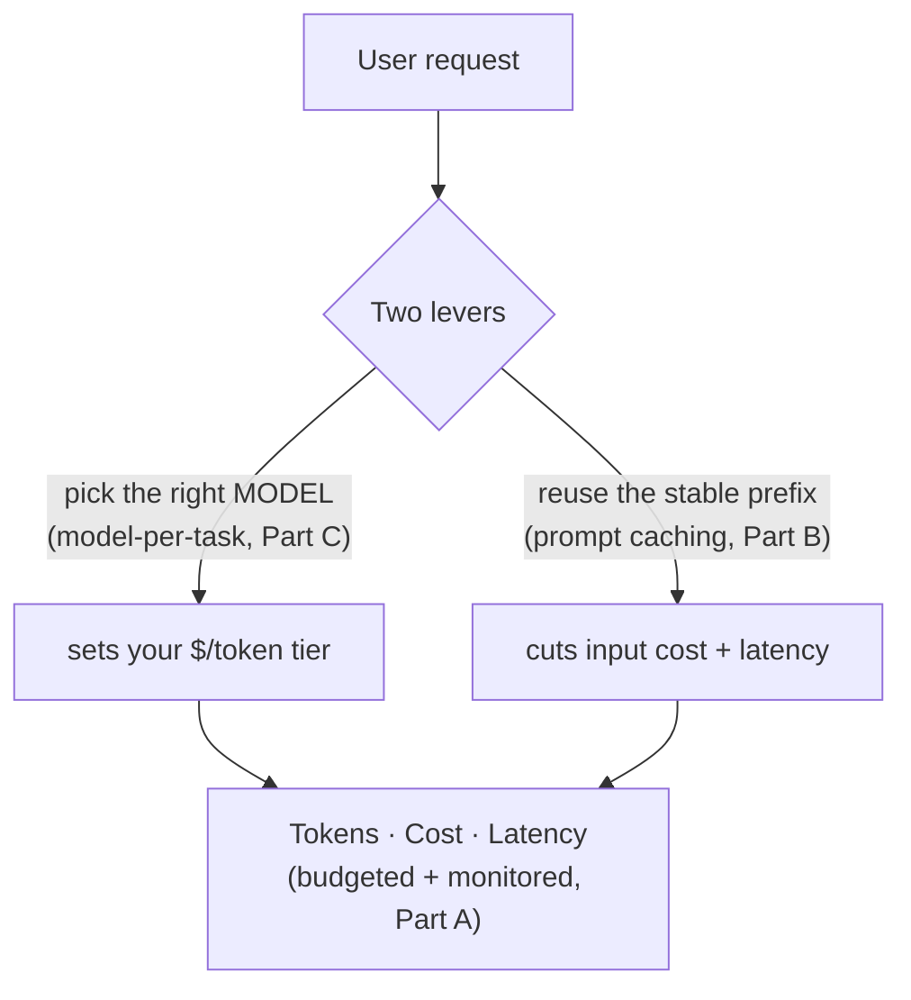
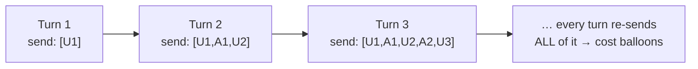
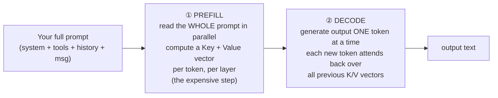
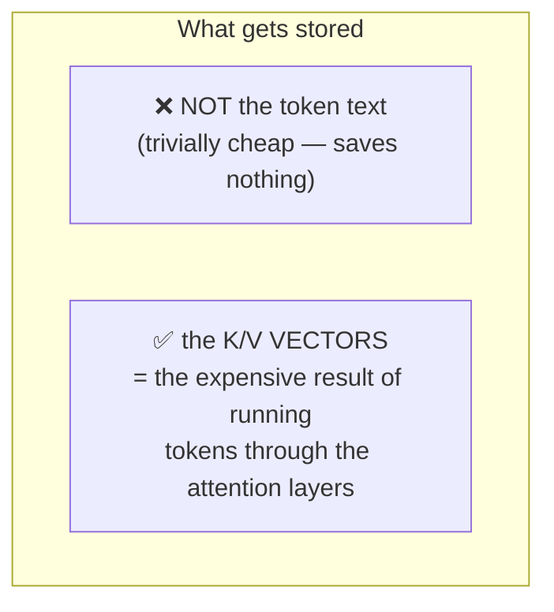
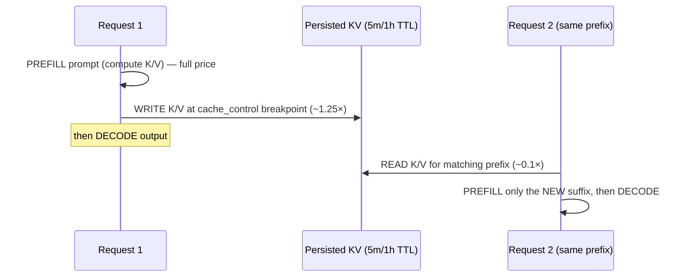
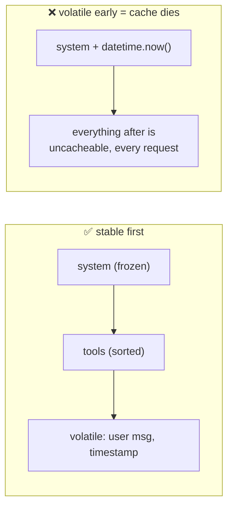
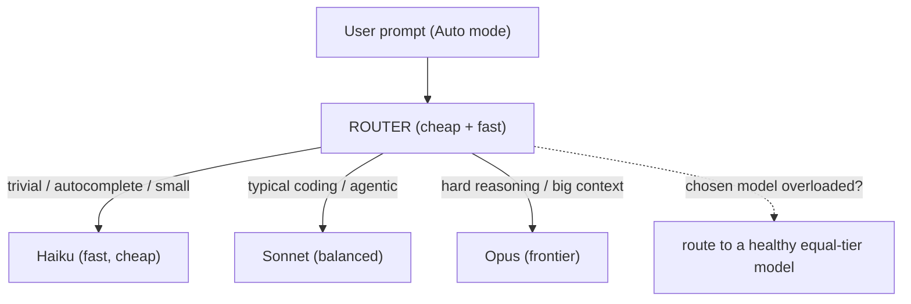
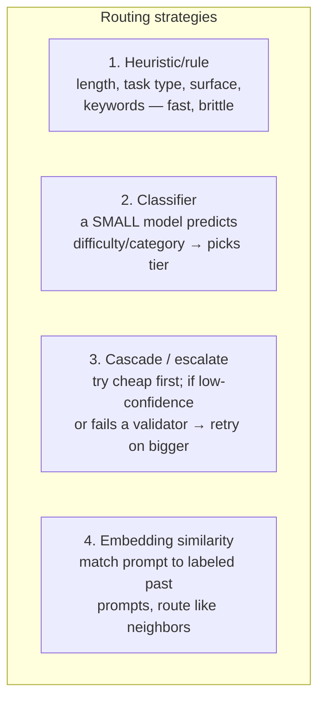
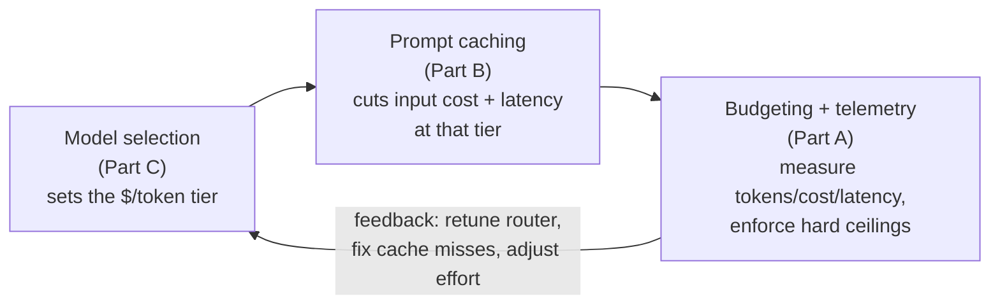

# Cost, Latency & Model Selection — Making an LLM App Cheap, Fast, and Smart *Enough*

> Personal study notes. Everything explained in plain terms.
> Diagrams are in Mermaid so they render visually.
> Built up from a long Q&A — every "but wait, how does *that* work?" is captured below.

---

## 0. The 10-second mental model

In the playground, an LLM feels free. In **production**, three numbers decide whether your app is viable:

1. **Tokens** — how much text goes in and comes out (everything is priced and timed in tokens).
2. **Cost** — dollars, which is just tokens × rate × traffic.
3. **Latency** — how long the user waits.

**Prompt caching** and **model-per-task selection** are the two biggest *levers* you pull to move those three numbers. Budgeting is the *measurement + control* layer that keeps them from running away.

Burn this in: **you don't 'use less' — you decide, per surface, which of the three is the binding constraint, then pull the lever that moves it.**

---

# PART A — Token / Cost / Latency Budgeting

## 1. Everything is tokens, and output is ~5× input

A token ≈ 4 characters / ¾ of a word (more for code and non-English). Every request bills **two counts at different rates**:

| | What it is | Rate (Opus 4.8) |
|---|---|---|
| **Input tokens** | Everything you *send*: system prompt, tool menu, history, user message, retrieved docs | **$5 / 1M** |
| **Output tokens** | Everything the model *generates* — **including hidden "thinking" tokens** | **$25 / 1M** |

> **The one rule that drives all cost architecture: output costs ~5× input.** Shrinking what the model *writes* is worth ~5× more than shrinking what you *send*. (And handily, latency also scales with output — §4 — so the same move wins twice.)

Sticker prices right now (per 1M tokens):

| Model | Input | Output | Context |
|---|---|---|---|
| Opus 4.8 (frontier) | $5 | $25 | 1M |
| Sonnet 5 (balanced) | $3 | $15 | 1M |
| Haiku 4.5 (fast/cheap) | $1 | $5 | 200K |

---

## 2. Why cost is *unpredictable* if you don't bound it

Three forces silently inflate the bill:

**(a) Conversation history grows quadratically.** Every chat turn resends the **entire** prior conversation as input. A 20-turn chat isn't 20× one turn — it's `1 + 2 + 3 + … + 20`.

**(b) Thinking tokens are invisible but billed.** With adaptive/extended thinking on, the model can emit thousands of reasoning tokens you never see — all at the **output** rate.

**(c) Agents make many calls per user action.** One "fix this bug" might be 15 model calls under the hood, each re-sending the tool menu + growing history.

This is *why* we **budget** rather than just "prompt shorter."

---

## 3. The three budgets and their knobs

| Budget | What it bounds | Primary knobs |
|---|---|---|
| **Token** | Actual token count | `max_tokens` (hard ceiling), **task budgets** (soft ceiling the model *sees*), `effort`, compaction / context editing |
| **Cost** | Dollars | cheaper model (Part C), fewer tokens (caching, compaction), less output (lower effort), **Batch API** for async work |
| **Latency** | Wall-clock wait | streaming, smaller/faster model, lower effort, prompt caching (cuts TTFT), fast mode, parallel calls |

The token knobs, distinguished (this trips people up):

- **`max_tokens`** — a **hard** output ceiling the model is *not aware of*. Hit it → output truncates mid-sentence. Set per task: ~256 (classification), ~16K (default), ~64K (long streaming work).
- **Task budget** — a **soft** ceiling the model *can see* as a countdown, so it *paces itself* and wraps up gracefully instead of being guillotined. The right tool for **agent loops**.
- **`effort`** (`low`→`max`) — how much the model *thinks and acts*. Your main quality↔cost dial.
- **Compaction / context editing** — summarize or prune old history so the "growing history" problem (§2a) stays bounded.

---

## 4. Name the *binding constraint* per surface

You never optimize all three equally — you decide which one binds, then pull its lever. Key facts:

- **Latency scales with *output* length, not input** — tokens generate roughly one-at-a-time (→ §6). A huge *cached* input adds little wait; a long *answer* adds a lot.
- Streaming doesn't reduce total time — it **hides** it (user sees the first token immediately).

| Surface | Binds on | Play |
|---|---|---|
| Interactive chat / voice | **Latency** | stream · fast model · modest effort · cache the system prompt |
| Background / bulk jobs | **Cost** | Batch API · cheapest capable model · don't bother streaming |
| Autonomous agents | **Tokens** (they run away) | task budgets · compaction · effort ceilings |

> The classic junior mistake: optimizing cost on a latency-bound surface (or vice-versa). **Name the constraint first.**

---

# PART B — Prompt Caching

## 5. The problem it solves

In real apps a big chunk of every request is **identical across calls** — the same 5K-token system prompt, the same tool menu, the same few-shot examples, the same retrieved doc. Without caching you pay full input price to **re-process those identical tokens every single time.**

To see *what* caching reuses, we first need to see what an LLM call actually does internally.

## 6. Every LLM call runs in TWO phases: prefill, then decode

- **Prefill** processes your entire input **at once**. For every token, at every layer, attention computes a **Key (K)** and **Value (V)** vector — the model's internal "meaning of this token in context." Cost scales with input length. This is the heavy step.
- **Decode** produces output **sequentially**, one token at a time. To make each new token, attention must look back at *every prior token* — so it needs their K/V vectors.

## 7. What's actually cached = the **KV cache**, NOT tokens

> **Follow-up I had: "do we cache tokens? during calculation? after generating a token?"** — None of those exactly.

During decode, recomputing K/V for the whole history at every step would be insane. So the model **stores the K/V vectors in memory (the "KV cache") and reuses them** — that's why each output token is fast (it only computes K/V for the *one* new token).

So: **you cache the *computation over* the tokens (K/V vectors), never the tokens themselves.**

## 8. Prompt caching = persisting that KV cache *across requests*

Normally the KV cache is **thrown away when the request ends.** The next request re-prefills your 5K-token system prompt from scratch.

**Prompt caching just keeps the prefill's K/V vectors alive across requests**, keyed by a **hash of the prefix bytes**, so a later matching request loads them instead of recomputing.

The point in the pipeline:
- **Written** at the *end of prefill* (the cache-write).
- **Read** at the *start* of a later matching request's prefill — *before* the heavy compute, so it's skipped.
- **Never** about the generated output, and **never** per-output-token.

> One-liner: **prompt caching = a KV cache persisted and reused across requests.** Same *data* as the in-request KV cache, longer *lifetime*.

| | In-request KV cache | Prompt caching (the feature) |
|---|---|---|
| Stores | K/V vectors | same K/V vectors |
| Lives for | one call | many calls (5-min / 1-hr TTL) |
| Purpose | fast decode | skip re-prefilling identical prefix |
| You control it? | no (always on) | yes — `cache_control` breakpoints, billed |
| Keyed by | position in sequence | **hash of the prefix bytes** |

Consequences of the "across requests" part: it may be **offloaded from GPU memory** between calls (why a read is ~0.1×, not free), there's a **minimum cacheable prefix** (~1–4K tokens; shorter silently won't cache), and it **expires on a TTL**.

## 9. The one invariant: it's a **prefix match**

> **Any byte change anywhere in the prefix invalidates everything after it.**

Render order is fixed: **`tools` → `system` → `messages`**. The cache key is the exact bytes up to each breakpoint.

This falls straight out of §7: a token's K/V vector depends on **all tokens before it** (that's what attention does). Change token #500 → every K/V from #500 on is now computed over different context → invalid. The cache is reusable only up to the last byte-identical point.

**Practical rules that follow:**
- **Freeze the system prompt** — never interpolate `datetime.now()`, a session ID, or a username into it. Inject dynamic context *later* (a message, not the system prompt).
- **Keep tools deterministic** — they render at position 0; adding/reordering one, or unsorted JSON, nukes everything. Sort them.
- **Don't switch model mid-conversation** — caches are model-scoped (this matters for Part C routing).
- **Put the breakpoint at the end of the *shared* part**, not after the part that varies per request.

## 10. The economics (why it's almost free money)

| | Cost vs normal input |
|---|---|
| Cache **read** (hit) | ~**0.1×** (90% cheaper) + cuts latency (TTFT) |
| Cache **write** (5-min TTL) | ~**1.25×** |
| Cache **write** (1-hour TTL) | ~**2×** |

**Break-even:** 5-min TTL profits after **2 requests**; 1-hr TTL after ~**3**. Any prefix reused more than once or twice within the TTL is worth caching.

## 11. Verify it — the silent-invalidator audit

Caching fails **silently** (no error, you just quietly pay full price). The only way to know is the response `usage`:

- `cache_read_input_tokens > 0` → working.
- `cache_read_input_tokens == 0` across identical repeated requests → something in the prefix is changing.

Usual culprits: `datetime.now()`/UUID in the system prompt · JSON serialized without sorted keys · a per-user tool set · conditional system-prompt sections. Two more gotchas: the **~1–4K min prefix**, and a **20-block lookback window** (in long agent turns with many tool-result blocks, add intermediate breakpoints or the next request won't find the cache).

---

# PART C — Model-per-Task Selection

## 12. There is no "best" model — there's a frontier

Every model sits on a **capability ↔ cost ↔ latency** frontier. The skill is matching each task to the **cheapest, fastest model that still clears the quality bar.** Opus-for-everything wastes money; Haiku-for-everything fails the hard tasks.

| Tier | Model | Use for | Cost spread |
|---|---|---|---|
| **Frontier** | Opus 4.8 / Fable 5 | hardest reasoning, long-horizon agents, tricky judgment, complex code | $5–10 / $25–50 |
| **Balanced** | Sonnet 5 | most production work — coding, agentic at near-Opus quality | $3 / $15 |
| **Fast/cheap** | Haiku 4.5 | classification, extraction, routing, simple summarization, high volume | $1 / $5 |

The spread is **5–10×** — so getting this right is often the single biggest cost lever you have.

## 13. How to choose — four axes

1. **Task difficulty** — simple/single-step (classify, extract, route) → small model. Multi-step/ambiguous/needs planning → frontier.
2. **Cost of error** — misrouted ticket (cheap to fix) vs wrong financial calc or bad prod code change (expensive) → higher error cost justifies a bigger model.
3. **Latency sensitivity** — user waiting → fast tier; overnight batch → cheapest, latency irrelevant.
4. **Volume** — a task run millions×/day should be pushed to the cheapest model that *passes eval*; a task run 10×/day can afford Opus.

## 14. Dynamic routing — how "Auto mode" (like Cursor) actually works

> **Follow-up I had: when the user picks 'Auto', can we route each prompt to a different model at runtime?** Yes — via a **router**.

**The hard part:** you must pick the model *before* doing the task, so you don't yet know how hard it is (chicken-and-egg). The request hits a **router** first — a **cheap, fast** decision layer (tens of ms; never an Opus call, or the router costs more than the work).

**The four routing strategies (combined in practice):**

- **Heuristic** — hard-coded signals (context size, surface it came from, user tier, rate-limit state). Fast but can't tell a *hard* one-liner from an easy one.
- **Classifier** — the real "Auto brain": a tiny model judges difficulty in ~100ms, tuned against *your* evals. Catches what heuristics can't.
- **Cascade** — sidesteps the chicken-and-egg by *trying*: run cheap → if output fails a check (won't compile, JSON won't parse, low confidence) → escalate. Most traffic stays cheap; the hard tail pays **twice** and is slower.
- **Embedding** — route like similar historical prompts.

## 15. What Cursor "Auto" is (the general pattern)

Proprietary, but the shape is recognizable — and it optimizes on **more than difficulty**:

- **Task shape / surface** — tab-completion vs inline edit vs agent mode have wildly different needs.
- **Context size** — how much code is pulled in → whether you need big context.
- **Provider health / load** — a big one people miss: if the frontier model is rate-limited or slow *right now*, route to a healthy equal-tier model (load-balancing, not just quality-matching).
- **Cost policy** — Auto is partly a *vendor cost* feature: steer routine work to cheaper models, reserve frontier for what needs it.

So **Auto ≈ classifier (difficulty) + heuristics (surface, context) + live health/load + cost policy**, resolved per request in milliseconds.

## 16. The core tension + the non-negotiable

**Routing is a bet placed under uncertainty** — you predict difficulty before doing the work:

- Route by **prediction** (classifier) → cheap/fast, but you'll misroute some hard prompts to weak models.
- Route by **trying** (cascade) → more accurate, but the hard tail is slower and pays double.

Every Auto mode picks a point on that tradeoff. The tell that *no router is perfect*: they all still give power users a **manual model picker** to override.

> **Non-negotiable: evaluate, don't guess.** "Does Haiku pass on this task?" is empirical. Run a representative eval set across tiers → pick the cheapest that clears the bar → re-run whenever a new model ships (a task that needed Opus last quarter may run on Sonnet today). Choosing models by vibes is the most common, most expensive mistake in the field. Production systems also query the provider's **models API** for live capability/pricing instead of hardcoding.

---

## 17. How the three fit together (one optimization loop)

A mature setup does **all three**: route each task to the right model, cache the stable prefix on every call, monitor tokens/cost/latency per request with hard ceilings. Skip any one → the system is either too expensive, too slow, or unpredictable under load.

---

## 18. The answer you can say out loud

> "In production an LLM app lives or dies on three numbers — **tokens, cost, latency** — and I manage them with two levers plus a control layer.
>
> **Budgeting:** everything is tokens; output costs ~5× input, and latency scales with *output* length, so shrinking what the model writes wins twice. Cost is unpredictable because chat history is re-sent every turn (quadratic), thinking tokens are billed but invisible, and agents make many calls — so I bound it with `max_tokens` (hard ceiling), **task budgets** (soft ceiling the model paces against), `effort`, and compaction. Then I name the *binding constraint* per surface: chat = latency, batch = cost, agents = tokens.
>
> **Prompt caching** is really a **KV cache persisted across requests.** Every call runs prefill (compute a Key/Value vector per token — the expensive step) then decode (generate one token at a time, reusing those vectors). Caching keeps the prefill's K/V vectors alive across requests, keyed by a prefix-byte hash: written at the end of prefill (~1.25×), read at the start of a matching request (~0.1×). It's a **prefix match** — any byte change invalidates everything after it, because a token's vector depends on all tokens before it — so I freeze the system prompt, sort tools, and verify with `cache_read_input_tokens`.
>
> **Model-per-task:** no best model, just a capability/cost/latency frontier; pick the cheapest that passes *eval* per task, by difficulty, error cost, latency, and volume. 'Auto mode' is a cheap **router** deciding per request — heuristics + a small-model difficulty classifier + live provider health + cost policy — with a cascade safety net and a manual override, because routing is a bet placed before you know how hard the task is."

---

## 19. Quick-reference glossary

| Term | Meaning |
|---|---|
| **Token** | ~4 chars / ¾ word; the unit everything is priced and timed in. |
| **Input vs output tokens** | What you send vs what the model generates (incl. thinking). Output ≈ 5× the price. |
| **`max_tokens`** | Hard output ceiling the model isn't aware of; hit it → truncation. |
| **Task budget** | Soft token ceiling the model *sees* as a countdown and paces against. For agent loops. |
| **`effort`** | `low`→`max` dial on how much the model thinks/acts; main quality↔cost knob. |
| **Compaction / context editing** | Summarize / prune old history to bound the quadratic-growth cost. |
| **Binding constraint** | The one of {cost, latency, tokens} that matters most for a given surface. |
| **Prefill** | Phase 1: process the whole prompt in parallel, compute K/V per token. The expensive step. |
| **Decode** | Phase 2: generate output one token at a time, reusing prior K/V. |
| **K/V vectors** | Per-token attention Key/Value — the model's contextual "meaning" of a token. |
| **KV cache** | Stored K/V vectors so decode doesn't recompute history each step. |
| **Prompt caching** | Persisting the prefill KV cache **across requests**, keyed by prefix-byte hash. |
| **Prefix match invariant** | Any byte change in the prefix invalidates the cache from that point on. |
| **Cache read / write** | Read ≈ 0.1× (hit); write ≈ 1.25× (5m) / 2× (1h). Break-even ~2–3 requests. |
| **Silent invalidator** | A per-request change (timestamp, UUID, unsorted JSON) that kills caching with no error. |
| **Capability/cost frontier** | The tradeoff surface across model tiers; pick the cheapest that passes eval. |
| **Router** | Cheap, fast layer that picks the model per request (the brain of "Auto mode"). |
| **Cascade / escalation** | Try a cheap model first; escalate to a bigger one on failure/low confidence. |
| **Eval** | Representative test set used to decide empirically which model passes a task. |

---

*End of notes.*
