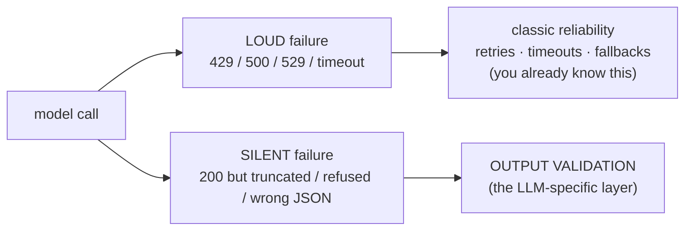
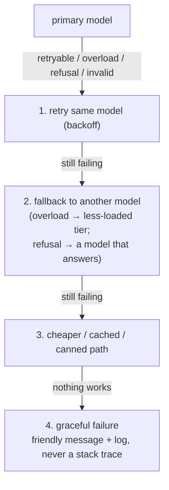

# Treating the Model as a Flaky Dependency — Retries, Timeouts, Validation, Fallbacks

> Personal study notes. Kept **deliberately brief**: this is ordinary distributed-systems reliability engineering — the LLM is *just another unreliable service*. I already know backoff, timeouts, and circuit breakers from full-stack work, so I only spell out the **one part that's LLM-specific**.

---

## 0. The 10-second mental model

An LLM API call is a **network call to a flaky external service.** Wrap it exactly like any third-party dependency.

**The only new thing vs a normal service:** it can fail **silently** — return **HTTP 200 with wrong / truncated / refused** content. A normal service fails *loudly* (status code); an LLM has a second failure mode with no error attached.



So: **standard reliability patterns + one extra layer (output validation).** That's the whole note.

---

## 1. Retries — standard, one LLM caveat

Same as any service. Only retry **transient** errors:

| Retryable | Not retryable |
|---|---|
| `429`, `500`, `529`, `408/409`, network | `400`, `401`, `403`, `404`, `413` |

Backoff + jitter, honor `retry-after`, cap at 2–3. **The SDK already does this** — auto-retries `408/409/429/5xx` + connection errors, `max_retries=2` default. Usually just tune the count.

> **LLM caveat — idempotency:** retrying a plain generation is safe (worst case you pay twice). But inside a tool-calling loop, a blind retry can fire a side-effecting tool (email, charge) **twice**. Retry the *call*; make *tool execution* idempotent or gated.

---

## 2. Timeouts — standard, three gotchas

Default client timeout ~10 min. Three things to actually remember:

1. **Units differ per SDK** — Python/Ruby seconds, **TS milliseconds**, Go `Duration`, etc. Easy footgun.
2. **Stream long outputs.** Above ~16K `max_tokens`, a non-streaming call can hit the HTTP timeout (whole response lands at the end). Streaming keeps the connection live and sidesteps it.
3. **Wall-clock = `timeout × (retries + 1)`** — each retry gets a fresh timeout. Budget for it.

*(If you ever hand-roll HTTP: library timeouts are per-chunk, not total — they reset on every byte, so a slow trickle blocks forever. Just use the SDK.)*

Size the timeout to the surface: tight for interactive chat, generous for batch.

---

## 3. Output validation — the LLM-specific layer *(spend your attention here)*

**HTTP 200 ≠ usable output.** Validate in three cheapening-first levels:

**Level 1 — check `stop_reason` before touching `content`:**

| `stop_reason` | Meaning | Action |
|---|---|---|
| `end_turn` | clean finish | ✅ proceed |
| `max_tokens` | **truncated** mid-answer | retry higher; discard partial |
| `refusal` | safety-declined (still 200; `content` may be empty) | don't retry same prompt → fallback |
| `model_context_window_exceeded` | input too big | compact / split |
| `pause_turn` / `tool_use` | server-tool loop / wants a tool | resume / run tool |

> The #1 reliability bug: `response.content[0].text` **without** checking `stop_reason` — crashes on a refusal, serves garbage on truncation.

**Level 2 — structure:** if you asked for JSON, **parse + schema-validate** (`json.loads` + Pydantic / `.parse()`). Never trust the raw string. (Native structured output / strict tool use = hard format guarantee; weaker paths can still emit a ```json fence or bad JSON.)

**Level 3 — semantics:** format can be perfect and content still wrong — **valid ≠ correct.** Does the code compile? Is the number in range? Is the cited fact actually in the source? Is the action authorized?

**On failure:** retry (higher `effort`, or a "your last output was invalid because X, fix it" repair prompt) → escalate to a bigger model (the cascade from note 05) → fallback. The win is *detecting* it, not shipping it.

---

## 4. Fallbacks — a degrade ladder, never a raw error at the user



- **529 / rate limit** → switch to a less-loaded tier (Haiku is often less congested). Same load-balancing idea as Auto-mode routing (note 05), pointed at *health*.
- **Refusal** → retry on a broader-availability model. Some APIs do this **server-side** (Claude Fable 5's `fallbacks` param auto-reruns on Opus 4.8 — no client logic).
- **Provider outage** → multi-provider fallback (bigger commitment, real uptime).
- **Circuit breaker** — if the primary keeps failing, stop hammering it for a cooldown and go straight to fallback. Standard, applies unchanged.

Log every failure (error, model, retries, latency, cost) — feeds the eval/telemetry loop from note 05.

---

## 5. The wrapper (all four words in one shape)

```
call_model(prompt):
    with TIMEOUT (sized to surface; stream if output is long):     # §2
        for attempt in RETRIES (backoff+jitter, retryable only):    # §1
            resp = model.create(...)
            if retryable transport error:  continue
            if not validate(resp):         continue / escalate      # §3
            return resp
    return FALLBACK(prompt)                                          # §4
    # + circuit breaker around it, + log everything
```

---

## 6. The answer you can say out loud

> "An LLM is just another unreliable network dependency, so I wrap every call the way I'd wrap any third-party service — timeout (sized to the surface, streaming for long outputs), retries with exponential backoff on *transient* errors only (429/5xx/529/network, not 4xx), and a fallback ladder ending in a graceful message, all behind a circuit breaker. The **one LLM-specific addition** is output validation: a model can return HTTP 200 and still be wrong, so I check `stop_reason` (refusal / truncation) before reading content, parse-and-schema-validate structured output, and run a semantic check where it matters — because valid ≠ correct. Everything else is standard distributed-systems reliability; the model is just a service that can also fail silently."

---

## 7. Quick-reference glossary

| Term | Meaning |
|---|---|
| **Transport vs semantic flakiness** | Loud failure (status code) vs silent failure (200-but-wrong). The second is the LLM delta. |
| **Retryable error** | Transient (`429/500/529/408/409`/network) — safe to retry. 4xx like `400/401/403/404/413` are not. |
| **Backoff + jitter** | Wait exponentially longer between retries, with randomness, to avoid a thundering herd. |
| **Idempotency (LLM)** | Retry the call freely; gate side-effecting *tools* so a retry doesn't double-fire them. |
| **`stop_reason` check** | Inspect *why* generation stopped (refusal / max_tokens / …) before trusting `content`. |
| **Output validation** | The extra layer: stop_reason → structural parse → semantic correctness. valid ≠ correct. |
| **Fallback ladder** | retry → other model → cached/canned → graceful error. Never surface a raw exception. |
| **Circuit breaker** | Stop calling a repeatedly-failing dependency for a cooldown; route to fallback. |
| **Server-side fallback** | API auto-reruns a refused request on a backup model (e.g. Fable 5 → Opus 4.8), no client logic. |

---

*End of notes.*
