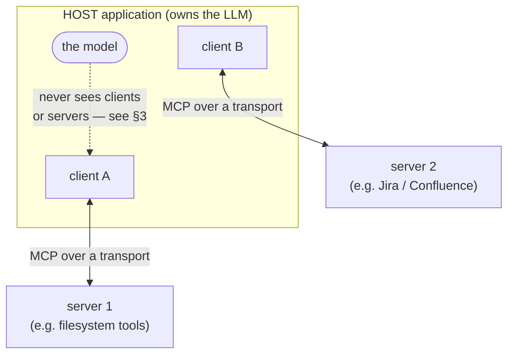
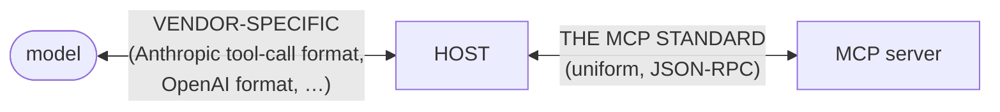
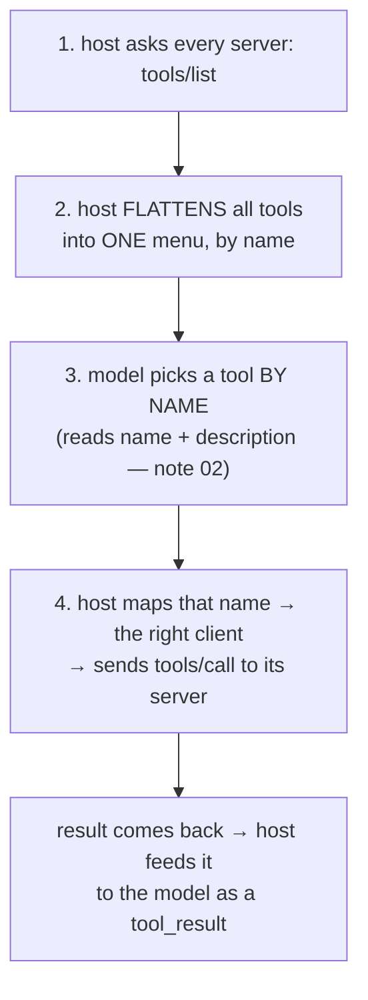
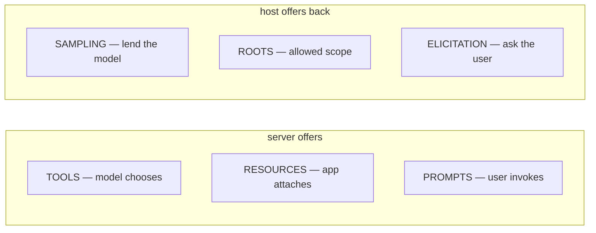
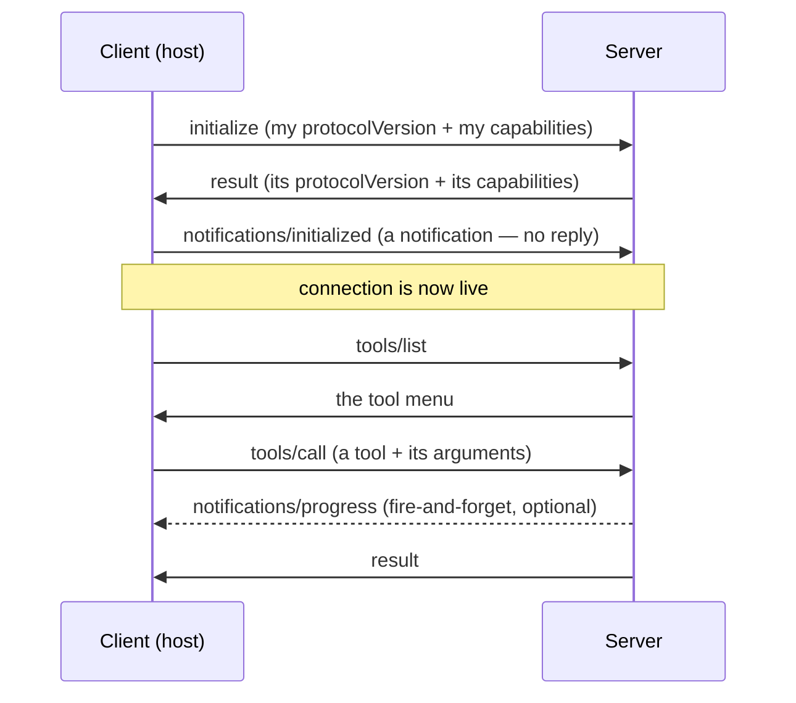
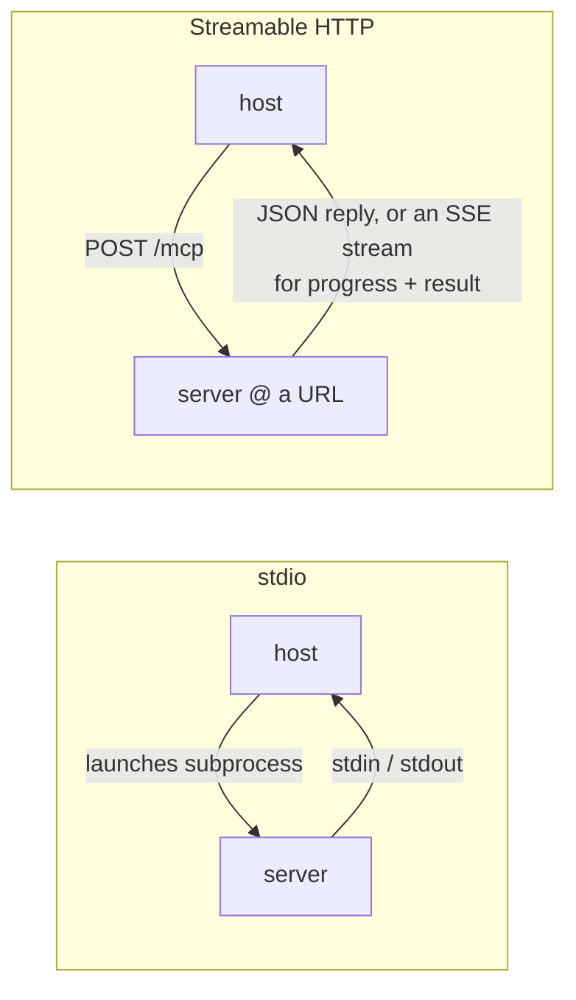

# MCP — host / client / server, the primitives (tools · resources · prompts), and transports (stdio · HTTP)

> Personal revision notes. Plain language, general reference — the concepts, not one specific server.
> Diagrams in Mermaid. Follows on from notes 01–03 (the loop, orchestration, agentic patterns).

---

## 0. The 10-second mental model

In notes 01–02 my tools were Python functions the agent loop imported directly. **MCP turns that in-process function call into a real protocol boundary** — the tools live behind a standard interface, so *any* host can use them and *any* server can offer them, without either side knowing the other's internals.

Think of it as **USB for tools.** A server exposes capabilities through a standard socket; a host plugs in and uses them. The point is the *standardisation of the socket*, not any one tool.

Three roles, and it's worth getting them exactly right because the names are easy to blur:

| Role | What it is | Example |
|---|---|---|
| **Host** | The application the user interacts with; owns the LLM | Claude Code, Claude Desktop, an IDE plugin |
| **Client** | A connector *inside* the host — **exactly one per server** | the session the host opens to a given server |
| **Server** | The process that actually exposes tools/resources/prompts | a filesystem server, a Jira server, a database server |

> **One client ↔ one server, always.** Two servers = two clients inside the host. That 1:1 isolation is what keeps servers from interfering with each other.

---

## 1. Why the boundary matters — the two-layer insight

This is the idea that makes everything else click. There are **two** conversations, and only one of them is standardised:

- **Model ↔ Host** is *vendor-specific* — Anthropic's tool-call shape isn't OpenAI's.
- **Host ↔ Server** is *the MCP standard* — uniform, the same for everyone.

**The host is the adapter between the two.** And that is precisely *why MCP is model-agnostic*: swap the model, and only the model↔host half changes; every MCP server keeps working untouched. Whenever a host connects to a server, part of its job is to convert that server's MCP tool definitions into whatever tool-call format its own model speaks.

> The model never learns MCP. It only ever sees its own vendor's tool format. MCP lives entirely below it.

---

## 2. Underneath it all: JSON-RPC 2.0

MCP is not a new wire format — it's **JSON-RPC 2.0** messages passed over a transport. Three message types, and the difference between them is the whole protocol:

| Message | Has an `id`? | Expects a reply? | Example |
|---|---|---|---|
| **Request** | yes | yes | `{"id": 1, "method": "tools/call", "params": {...}}` |
| **Response** | yes (echoes the request's) | — it *is* the reply | `{"id": 1, "result": {...}}` or `{"id": 1, "error": {...}}` |
| **Notification** | **no** | no — fire and forget | `{"method": "notifications/progress", "params": {...}}` |

The `id` is the **correlation key**: a response carries back the same `id` as its request, so several requests can be in flight at once and each reply still finds its home (exactly the `tool_use_id` pairing idea from note 01, one layer down). A **notification** has no `id` on purpose — it's one-way, which is how progress updates stream back without needing a reply.

Errors are structured JSON-RPC error objects with numeric codes (e.g. `-32601` method not found, `-32602` invalid params), not HTTP status codes. And note: **MCP dropped JSON-RPC batching** — one message per frame, keeps things simpler.

> **REST vs RPC, said simply:** REST is *nouns* — you `GET /orders/5`. RPC is *verbs* — you call a method, `tools/call`, and name it in the message body. MCP is RPC: there's essentially **one endpoint** and the "method" field says what you want.

---

## 3. Routing — how the model reaches a tool it can't even see

The model never sees clients or servers. So how does calling a tool actually work? The **host** does the plumbing in four moves:

1. On startup the host calls **`tools/list`** on every connected server.
2. It **flattens** them all into one flat menu — the model just sees a list of tool names, with no idea which server each came from.
3. The model picks one **by name** (steered by the description — same orchestration logic as note 02).
4. The host **maps the name back to the owning client** and sends **`tools/call`** to that server. The result returns and becomes a `tool_result`.

> So "the model used the Jira tool" really means: the model emitted a name, the host recognised that name as belonging to the Jira client, and routed the call there. **Routing is the host's job; the model only ever deals in names.**

An important consequence: `tools/list` and `tools/call` are **framework methods, not routes anyone writes.** A server typically exposes a *single* JSON-RPC endpoint (e.g. `/mcp`); there is no per-tool URL like `/fetch_url`. You register a function as a tool and the framework answers `tools/list` / `tools/call` on your behalf.

---

## 4. The primitives — who is each one *for*?

MCP exposes three things from the **server**, and the clean way to remember them is **who controls each**:

| Server primitive | Controlled by | Meaning | Example |
|---|---|---|---|
| **Tools** | the **model** | actions the model may *choose* to call | `search_issues`, `fetch_url` |
| **Resources** | the **application** | data the app can load into context (read-only) | a file, a database row, a doc the host attaches |
| **Prompts** | the **user** | pre-written templates the user invokes deliberately | a `/summarize-page` slash command |

The distinction is *who decides it gets used*: the **model** decides to call a tool; the **app** decides to attach a resource; the **user** decides to run a prompt. Same JSON-RPC underneath, three different intents.

There is also a smaller set of **client** primitives — capabilities the *server* can ask the *host* for, the direction reversed:

| Client primitive | What the server is asking the host to do |
|---|---|
| **Sampling** | "run an LLM completion for me" (server borrows the host's model) |
| **Roots** | "which directories/URIs am I allowed to touch?" |
| **Elicitation** | "ask the user this follow-up question for me" |

> Most servers implement only **tools** — that's the common case. Resources, prompts, and the client primitives are optional; a server declares what it actually has during the handshake (§5).

---

## 5. The lifecycle — a handshake before any work

A connection doesn't jump straight to calling tools. It opens with a short negotiation, then stays open:

1. **`initialize`** — the client sends its protocol version and what it supports; the server replies with the same. This is **capability negotiation**: each side declares what it can do, and they proceed on the intersection.
2. **`notifications/initialized`** — a one-way notification saying "handshake done, go." No `id`, no reply.
3. From there the session is live: `tools/list`, `tools/call`, progress notifications, etc., all on the one open connection.

**This is observable on a real host.** Using `/mcp` and `claude --debug=mcp` in Claude Code, you can read the actual handshake logs for connected servers:

- **Atlassian** advertised **tools + resources but NO prompts**; **Datadog** advertised **all three**. That's capability negotiation in the flesh — each server declaring a *different* set.
- The protocol version negotiated was a dated string like **`2025-11-25`**.
- Some offered capabilities get **declined** — a live example of one side offering something the other doesn't take.
- The claude.ai proxy transport logs **decoded summaries, not raw JSON-RPC frames**, and **caches `tools/list` on warm start** — so no raw `tools/list` frame appears on a warm reconnect. (Raw frames show up from a local stdio server instead.)

> **Auth vs the handshake:** OAuth-style **authentication happens once** (you authorise the server), but the **`initialize` handshake happens every session**. Don't confuse "I'm logged in" (persistent) with "the connection is negotiated" (per-session).

---

## 6. Transports — stdio vs Streamable HTTP

The lifecycle and primitives are the same regardless of *how* the bytes travel. There are two standard transports:

| | **stdio** | **Streamable HTTP** |
|---|---|---|
| How it connects | host launches the server as a subprocess; talks over stdin/stdout | server runs as an HTTP service; host connects to a URL |
| Where the server runs | same machine, local | local *or* remote |
| Lifetime | dies with the host process | independent, long-lived |
| Best for | local tools, dev, filesystem access | shared/remote servers, multiple hosts |

**The SSE nuance worth remembering:** "Streamable HTTP" is one endpoint (`POST` your request to `/mcp`), but the server *may* reply with a **Server-Sent Events stream** instead of a single JSON body when it needs to push multiple messages back — e.g. progress notifications arriving *before* the final result. That's how a long-running tool streams progress while it's still working. (This replaced the older two-endpoint HTTP+SSE design.)

**Rule of thumb:** a local, personal tool that reads your files → **stdio**. A tool many hosts share, or one hosted remotely → **Streamable HTTP**.

---

## 7. Things to keep straight (protocol-level)

- **The model never sees MCP.** It only ever sees its vendor's tool format; the host translates. So "does my server work with model X?" is really "does the *host* speak both MCP and model X's format?" — and any decent host does.
- **`tools/list` and `tools/call` are methods, not URLs.** A server is usually one endpoint; the method field says what you want. Don't look for a route per tool.
- **camelCase on the wire, but SDKs may rename.** JSON-RPC frames use camelCase (`inputSchema`, `structuredContent`, `isError`), yet a given SDK may expose those as snake_case fields on its objects. Read your SDK's actual field names — mixing the two silently gives you nothing back.
- **Auth once, `initialize` every session** (§5).
- **A server declares its own capabilities** — never assume a server has resources or prompts just because the spec defines them; check what came back from `initialize`.
- **`tools/list` can be cached warm**, so you won't always see the discovery frame on a reconnect — look at a cold/local connection to watch the full handshake.

---

## 8. Where this connects to the rest

- MCP is the **protocol boundary** that lets an agent (notes 01–03) use tools that live in a *separate process or server* instead of importing them directly — which is what makes a multi-agent "specialist over a real tool domain" (note 03) more than an in-process function call.
- The **routing** in §3 (host flattens `tools/list`, model picks by name, host maps name→client) is the *same* description-driven picking from note 02 — just with the host doing an extra name→server lookup.
- Because MCP tools return into the model's context like any other tool result, the **"tool results are untrusted input"** warning from notes 01–02 applies in full — anything a server returns (a fetched web page, a file, a ticket body) could carry an injection. That's the on-ramp to the guardrails note.

---

## 9. The answer you can say out loud

> "MCP is a standard socket for tools — 'USB for tools'. Three roles: the **host** is the app that owns the model, a **client** is a connector inside it (exactly one per server), and a **server** exposes the actual tools. The key insight is that there are **two conversations**: model↔host is vendor-specific, host↔server is the uniform MCP standard, and the host is the adapter between them — which is *why* MCP is model-agnostic. The model never sees clients or servers; the host asks every server for its tools with `tools/list`, flattens them into one menu, the model picks **by name**, and the host maps that name back to the owning client and sends `tools/call`.
>
> Underneath it's **JSON-RPC 2.0** — requests and responses paired by `id`, plus one-way notifications (how progress streams back). A connection opens with an **`initialize`** handshake that negotiates protocol version and capabilities — you can watch this on a real host: one server advertises tools+resources but no prompts, another advertises all three. Servers offer three **primitives** by who controls them — **tools** (the model chooses), **resources** (the app attaches), **prompts** (the user invokes) — plus reverse **client** primitives (sampling, roots, elicitation). Two **transports**: **stdio** (host launches the server as a local subprocess) and **Streamable HTTP** (server at a URL, one `/mcp` endpoint, which can reply with an SSE stream for progress)."

---

## 10. Quick-reference glossary

| Term | Meaning |
|---|---|
| **MCP** | Model Context Protocol — a standard interface for exposing tools/resources/prompts to LLM apps. |
| **Host** | The application that owns the model and connects to servers (Claude Code, Claude Desktop, an IDE). |
| **Client** | A connector inside the host — **one per server**; owns that connection. |
| **Server** | The process exposing capabilities (filesystem, Jira, a database, …). |
| **Two-layer insight** | model↔host is vendor-specific; host↔server is standard MCP; the host adapts between them → model-agnostic. |
| **JSON-RPC 2.0** | The wire format: request/response paired by `id`, plus one-way notifications. MCP drops batching. |
| **Notification** | A JSON-RPC message with no `id` — fire-and-forget (e.g. progress). |
| **Routing** | Host flattens all `tools/list` into one menu → model picks by name → host maps name→client → `tools/call`. |
| **Tools / Resources / Prompts** | Server primitives, by controller: **model** chooses / **app** attaches / **user** invokes. |
| **Sampling / Roots / Elicitation** | Client primitives — what a server can ask the host for (borrow the model / allowed scope / ask the user). |
| **`initialize`** | The handshake: exchange protocol version + capabilities, then `notifications/initialized`. Per-session. |
| **Capability negotiation** | Each side declares what it supports; they proceed on the overlap (some capabilities get declined). |
| **stdio transport** | Host launches the server as a subprocess; talk over stdin/stdout. Local. |
| **Streamable HTTP transport** | Server at a URL; one endpoint (`/mcp`); may reply with an SSE stream for progress + result. |
| **Auth once vs handshake every session** | OAuth authorises once; `initialize` re-negotiates every new connection. |

---

*End of notes. See also: `01-The-Agent-Loop-ReAct.md`, `02-Multi-Tool-Orchestration.md`, `03-Agentic-Patterns-and-When-Not-To.md`.*
