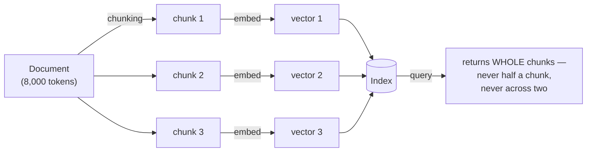
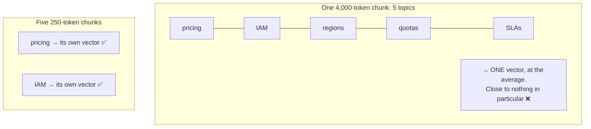
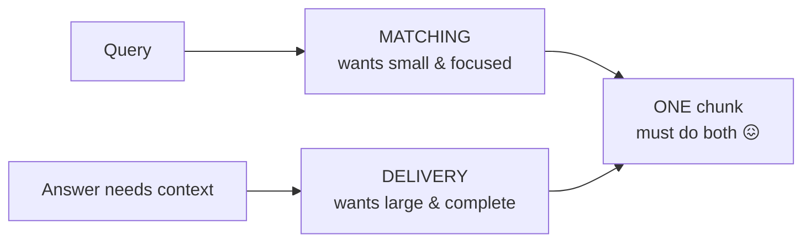
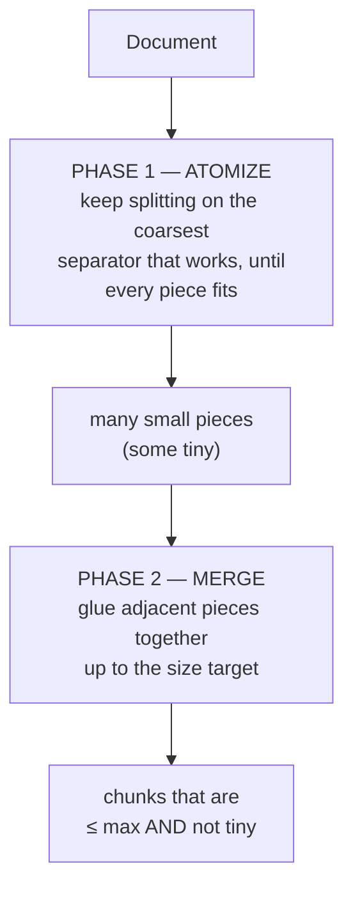
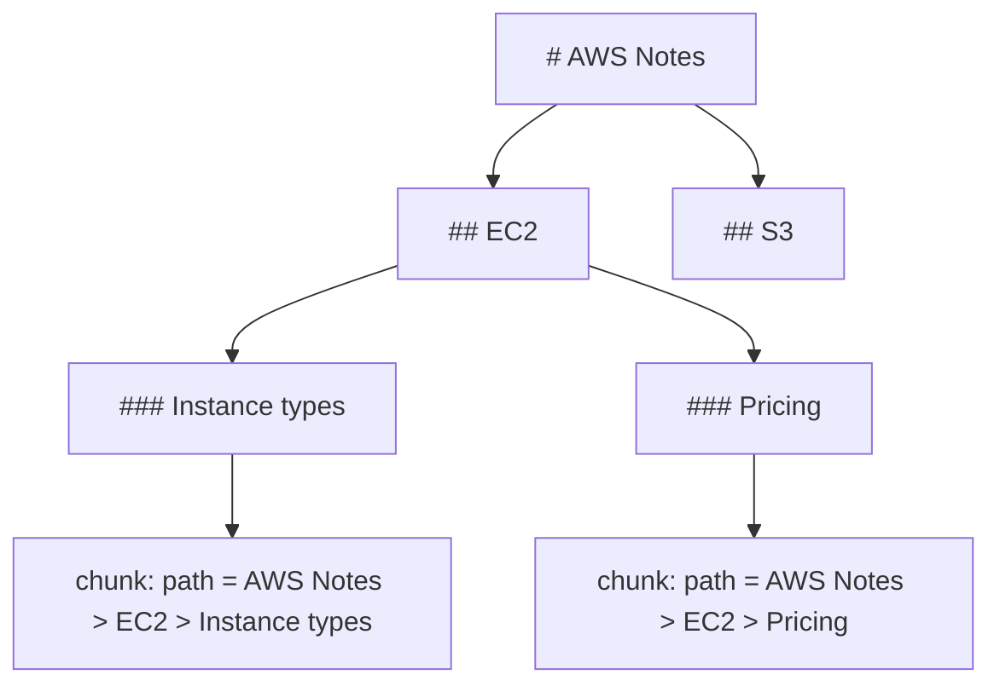
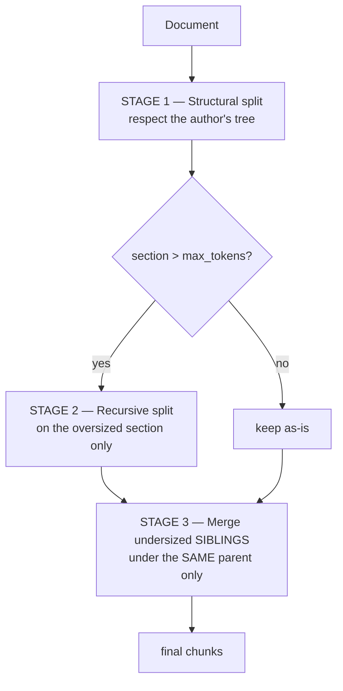
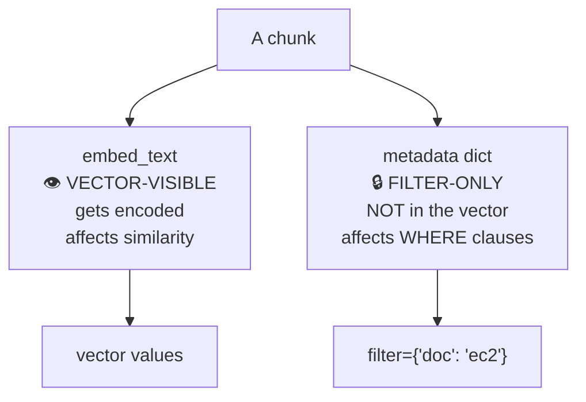
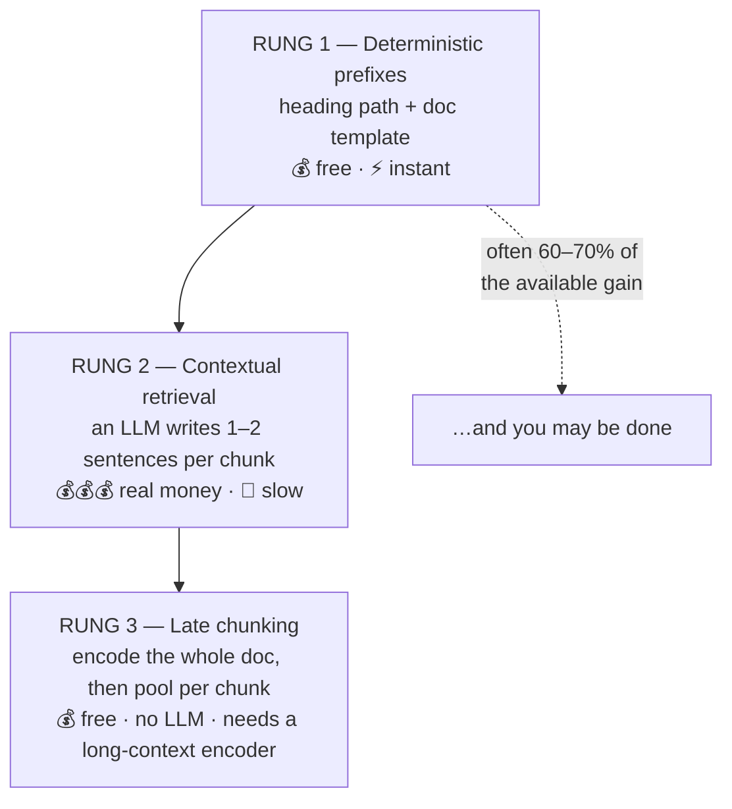
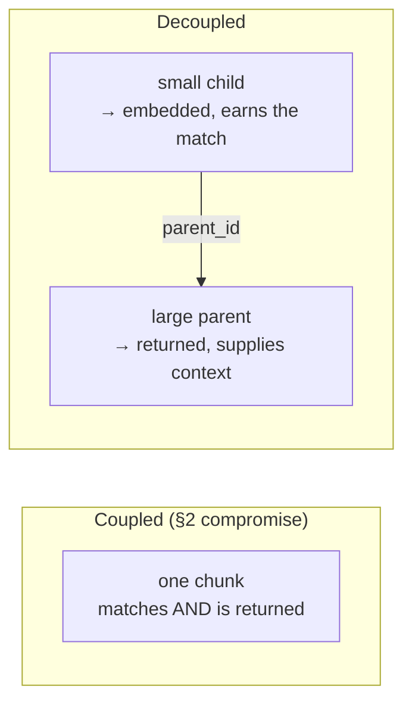
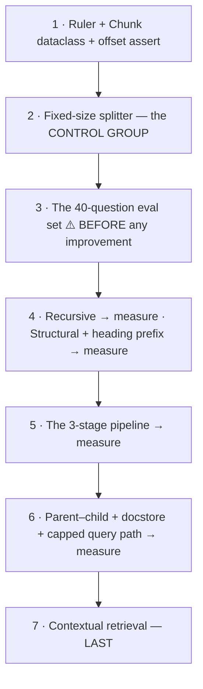

# Chunking Strategies — Deciding What Becomes a Vector

> Personal study notes. Everything explained in plain terms, definition-first.
> Diagrams are in Mermaid so they render visually.
> Companion to [01 — Vector Databases & Pinecone](./01-Vector-Databases-and-Pinecone.md), [02 — Index vs Namespace vs Record](./02-Index-Namespace-Record.md), [03 — Distance Metrics](./03-Distance-Metrics.md) and [04 — ANN & HNSW](./04-ANN-and-HNSW.md).
>
> **Scope:** this is the **ingestion side** of the vector-DB layer. Notes 02–04 all assumed vectors already existed and asked how they're stored and found. This note asks the question that comes *before* all of them: **given a pile of documents, what exactly becomes each vector?**
>
> ⚠️ **Scope correction to note 01.** Note 01's rung-1 PROJECT block says "⛔ do NOT go down the chunking rabbit hole here — that belongs to the RAG track." That call was **wrong, and this note overrides it.** Chunking decides what text becomes a vector, and *nothing downstream can recover from getting it wrong* — a fact the index can't retrieve is invisible to every reranker and every LLM that comes after. It belongs here, in the ingestion pipeline, not in a RAG note. What stays out of scope is what the *LLM does with* the retrieved text (prompt construction, grounding, citations, answer generation) — that's still a separate note.

---

## 0. The 10-second mental model

A document is too long to be one vector. So you cut it into pieces. **Every piece becomes one row in the index, and search can only ever return whole pieces.**

That single fact is the whole subject:



> **The line worth memorizing:** **you retrieve what you embedded.** If a fact was split across two chunks, no query will ever match it cleanly. If a fact sits in a chunk full of unrelated text, its signal gets diluted. Chunking is where retrieval quality is decided — before the index exists.

---

## 1. Why chunk at all — four independent reasons

> **Definition:** **chunking** is splitting a document into smaller pieces before embedding, so each piece becomes its own record in the index.

People assume the reason is "the model has a limit." That's only one of four, and it's the least interesting.

### 1a. The hard ceiling

Every embedding model has a **maximum sequence length**. Feed it more and the extra is **silently truncated** — not an error, just missing.

| Model | max_seq_length |
|---|---|
| `all-MiniLM-L6-v2` | 256 tokens |
| `bge-base-en-v1.5` | 512 tokens |
| OpenAI `text-embedding-3-*` | 8,191 tokens |

A 20-page document cannot be one vector on any of them. This is the reason everyone knows.

### 1b. Dilution — the reason that actually matters

> **Definition:** **dilution** is the loss of signal that happens when one vector has to represent many different ideas at once. The vector lands at the *average* of all of them, and is therefore close to none of them.

An embedding is a **single point** in meaning space. Give it a chunk covering five topics and the point lands in the middle of all five.



**This is why chunking helps even when the whole document would fit under the ceiling.** Even with an 8,191-token model, a 6,000-token doc as one vector retrieves badly. Chunking is about *sharpening the signal*, not just fitting the input.

### 1c. You retrieve what you embed

Search returns whole chunks. That means chunk boundaries are also the boundaries of what can be delivered. A fact split across a boundary is **structurally unretrievable** — no reranker, no LLM, no clever prompt can put it back together, because neither half ever matched.

### 1d. The downstream budget

Whatever comes after retrieval has a finite context window. If your chunks are 4,000 tokens and you retrieve 5, that's 20,000 tokens for one query. Chunk size is a **cost and latency knob**, not just a quality knob.

> **The interview line:** "Chunking exists for four reasons — the model's ceiling, signal dilution, the fact that retrieval only ever returns whole chunks, and the downstream token budget. Only the first one is about model limits."

---

## 2. The core trade-off — one chunk, two jobs

This is the tension every technique in this note is trying to escape.

A chunk plays **two roles at once**:

| Role | What it means | Wants chunks to be… |
|---|---|---|
| **The matching unit** | the text that gets embedded and compared to the query | **small** — so the vector is sharp and undiluted |
| **The delivery unit** | the text that gets returned to whoever asked | **large** — so the answer has enough context to be useful |



Those want **opposite sizes**. Every strategy in this note is either:

1. **Picking a compromise size** (Parts A/B — fixed, recursive, structural), or
2. **Refusing the compromise** by making the matching unit and the delivery unit *different objects* (Part D — decoupling).

> **The interview line:** "The core problem is that one chunk is both the matching unit and the delivery unit, and those want opposite sizes. Size tuning is a compromise; decoupling is the actual fix."

---

## 3. Size & overlap — the numbers

### 3a. Characters ≠ tokens. Count with the model's own tokenizer.

> **Definition:** a **token** is the unit the model actually consumes — usually a word-piece, not a character and not a word.

Rough English prose is ~4 characters per token. But that ratio collapses on real content:

| Content | Chars per token |
|---|---|
| Plain English prose | ~4 |
| Code, JSON, YAML | ~2–3 |
| Markdown tables (`\|`, `---`) | ~2 |
| Non-English / accented text | can be ~1 |

⚠️ **The bug this causes is silent.** Set `chunk_size=500` believing it's tokens when the library measures characters, and you ship chunks a quarter of the intended size. No error — just quietly worse retrieval.

```python
# ❌ don't
if len(text) > 1000: split()

# ✅ do — the model's own tokenizer is the only ruler that counts
from transformers import AutoTokenizer
tok = AutoTokenizer.from_pretrained("sentence-transformers/all-MiniLM-L6-v2")
n_tokens = len(tok.encode(text, add_special_tokens=False))
```

> 🔑 **The practical rule:** isolate token counting behind one `count_tokens()` function. When you change embedding models, you change one file.

### 3b. `max_seq_length` is a **ceiling**, not a target

Everyone's first instinct with a 512-token model is to make 512-token chunks. That's backwards — you've maximised dilution (§1b) *and* left yourself zero headroom for the enrichment prefixes in §10.

| Model limit | Sensible target | Why |
|---|---|---|
| 256 | ~150–200 | headroom for a heading-path prefix |
| 512 | ~250–350 | the common sweet spot |
| 8,191 | ~300–600 | dilution still applies; the limit isn't the constraint |

> **Target ~50–70% of the ceiling.** The remaining space is for enrichment, and it protects you against tokenizer drift when you count with an approximate ruler.

### 3c. Overlap — and the inflation formula

> **Definition:** **overlap** means each chunk repeats the last N tokens of the previous one, so a sentence cut in half still appears whole inside at least one chunk.

```
chunk 1: [------- 250 tokens -------]
chunk 2:                   [------- 250 tokens -------]
                           └─ 50 shared ─┘
```

**The cost is not free, and it's easy to underestimate.** With overlap ratio `r`, the stride between chunk starts is `(1 − r) × max`, so:

> **Total stored tokens ≈ D / (1 − r)** — the **inflation factor is `1/(1 − r)`.**

| Overlap ratio `r` | Inflation | 1M-token corpus becomes |
|---|---|---|
| 0% | 1.00× | 1.0M tokens stored |
| 20% (50 of 250) | **1.25×** | 1.25M |
| 50% (125 of 250) | **2.00×** | 2.0M |
| 75% | **4.00×** | 4.0M |

That inflation hits vector count, storage, embedding cost, *and* query latency — all at once.

> ⚠️ **Set overlap in absolute tokens, not as a percentage.** ~**50 tokens** is enough to keep a sentence whole, and that's the entire job. A percentage silently scales the cost with chunk size for no added benefit: 20% of 250 is a sensible 50 tokens; 20% of 2,000 is a wasteful 400.

### 3d. Overlap is a fixed-size-chunking crutch

This is the part most people never get told. Overlap exists to heal **mid-sentence cuts**. Its whole reason for being is that fixed-size chunking cuts blindly.

Once you split on **natural boundaries** (§4, §5), there are no mid-sentence cuts left to heal — and overlap becomes pure waste. And once you adopt **parent–child decoupling** (§11), it becomes redundant twice over, because the returned parent already contains the neighbouring text.

| Strategy | Overlap needed? |
|---|---|
| Fixed-size | ✅ yes — ~50 tokens, it's a genuine patch |
| Recursive / structural | ⚠️ rarely — boundaries are already clean |
| Parent–child decoupling | ❌ no — the parent supplies the context |

> **The interview line:** "Overlap is a patch for blind cuts. Fix the cuts and you don't need the patch — and you stop paying the `1/(1−r)` inflation on storage and latency."

---

## 4. Recursive chunking — atomize, then merge

> **Definition:** **recursive character/token splitting** tries a list of separators from **coarsest to finest**. Split on paragraphs; any piece still too big gets split on lines; still too big, on sentences; then words; then a hard cut. Then adjacent small pieces are **merged back** up to the size target.

The mental model that makes this click is **atomize-then-merge**, in two distinct phases:



The separator ladder, coarse → fine:

```python
SEPARATORS = ["\n\n", "\n", ". ", " ", ""]   # paragraph → line → sentence → word → hard cut
```

```python
def _atomize(text, base, seps, max_tokens):
    """Recursively cut until every piece fits. `base` tracks the char offset."""
    if count_tokens(text) <= max_tokens:
        return [(base, base + len(text))] if text.strip() else []
    if not seps:                                   # nothing left — hard cut
        return _by_token(text, base, max_tokens)
    sep, rest = seps[0], seps[1:]
    out, cursor = [], 0
    for piece in text.split(sep):
        out += _atomize(piece, base + cursor, rest, max_tokens)
        cursor += len(piece) + len(sep)             # ← the separator's own length
    return out

def _merge(atoms, text, max_tokens):
    """Grow a window over adjacent atoms while it still fits."""
    out, cur = [], None
    for s, e in atoms:
        if cur and count_tokens(text[cur[0]:e]) <= max_tokens:
            cur = (cur[0], e)                      # extend the END forward
        else:
            if cur: out.append(cur)
            cur = (s, e)
    if cur: out.append(cur)
    return out
```

Two details in that code carry the whole implementation:

- ⚠️ **`cursor += len(piece) + len(sep)`** — `split()` throws the separator away. If you don't add its length back, **every offset after the first split is wrong.** This is the single most common bug in hand-written splitters.
- ✅ **Merging grows by moving `end` forward**, which means the separator you split on is silently re-included in the slice. You never rejoin with `"\n\n".join(...)`, and you never lose formatting.

**Why this beats fixed-size:** boundaries land on real structure. A 180-token paragraph stays one chunk. A 900-token paragraph gets split at sentence ends rather than mid-word. And because there are no mid-sentence cuts, you don't need overlap (§3d).

> **The interview line:** "Recursive splitting is atomize-then-merge: cut on the coarsest separator that works until everything fits, then glue neighbours back up to target. The offset arithmetic across the discarded separator is where it goes wrong."

---

## 5. Structural chunking — split on the document's own tree

> **Definition:** **structural chunking** ignores size as the primary criterion and splits on the document's *own* hierarchy — markdown headings, HTML tags, code functions, JSON keys. The author already told you where the topic boundaries are; use their answer.

This is strictly better than guessing, because a heading *is* a semantic boundary by construction.



### 5a. The two bugs — both of them will fire on real content

```python
FENCE   = re.compile(r"^\s*(```|~~~)")
HEADING = re.compile(r"^(#{1,6})\s+(.*)")

def split_structural(md):
    stack, sections, cur, in_fence, pos = [], [], None, False, 0
    for line in md.split("\n"):
        if FENCE.match(line):
            in_fence = not in_fence                   # ← BUG 1 fix
        m = None if in_fence else HEADING.match(line)
        if m:
            level, title = len(m.group(1)), m.group(2).strip()
            stack = stack[:level - 1] + [title]        # ← BUG 2 fix
            if cur: cur["end"] = pos; sections.append(cur)
            cur = {"start": pos, "path": list(stack)}
        pos += len(line) + 1                          # +1 for the \n
    if cur: cur["end"] = len(md); sections.append(cur)
    return sections
```

**🐞 Bug 1 — code fences contain `#` characters.**

```python
# create the index
pc.create_index(name="notes", dimension=384)
```

A naive `line.startswith("#")` reads `# create the index` as an **H1** and shreds the document at a boundary that doesn't exist. The `in_fence` toggle is the fix. This isn't hypothetical — a technical note is *full* of `#` comments in Python blocks and `#` in shell snippets.

**🐞 Bug 2 — stale ancestry.**

Walk this document:

```
## Indexes            → stack = ["Indexes"]
### Deleting          → stack = ["Indexes", "Deleting"]
## Pricing            → stack should become ["Pricing"]
```

If you only ever *append* to `stack`, "Deleting" stays in the ancestry forever, and every later chunk gets labelled `Indexes > Deleting > Pricing`. **`stack[:level-1] + [title]` truncates to the new level first, then appends.**

> ⚠️ **Stale ancestry is worse than no ancestry.** No ancestry means missing context. Stale ancestry means *confidently wrong* context — embedded straight into the vector, where it actively pulls the chunk toward the wrong region of meaning space.

### 5b. The heading-path prefix — the orphaned-fact fix

Structural splitting hands you something free and valuable: **each chunk knows where it lives.**

Consider this chunk, sitting on its own in the index:

```
It defaults to 40KB and cannot be raised.
```

Retrievable by nothing. "It" is unresolvable. Now prefix the heading path:

```
Pinecone > Records > Metadata limits

It defaults to 40KB and cannot be raised.
```

Now it matches a query about *Pinecone metadata limits*. One line of code:

```python
chunk.embed_text = " > ".join(path) + "\n\n" + chunk.text
```

**Costs nothing. Needs no LLM. Do it before you consider anything else in §10.**

> **The interview line:** "Structural splitting uses the author's own topic boundaries, and it gives you the heading path for free — which is the cheapest fix that exists for orphaned pronouns and dangling facts."

---

## 6. The 3-stage production pipeline

Neither recursive nor structural is enough alone. Structural respects topics but produces wildly uneven sizes — one section is 3,000 tokens and the next is a 12-token stub. Recursive produces even sizes but ignores topics.

**Production answer: use all three passes, in this order.**



```python
def pipeline(md, *, max_tokens=250, min_tokens=80):
    sections = split_structural(md)                      # 1. respect the tree
    chunks = []
    for s in sections:
        if count_tokens(s.text) > max_tokens:
            sub = split_recursive(s.text, max_tokens=max_tokens)   # 2. fix oversized
            chunks += rebase(sub, s.start)               # ← offsets are relative to s.text!
        else:
            chunks.append(s.to_chunk())
    return merge_small_siblings(chunks, min_tokens)       # 3. fix undersized
```

Three details that matter:

- ⚠️ **`rebase(sub, s.start)`** — `split_recursive` was handed `s.text`, so its offsets are relative to the *section*, not the document. Every nested splitter needs its offsets rebased by the parent's start. This bug passes the inner splitter's own test and fails the outer one.
- ⚠️ **Stage 3 merges undersized *siblings under the same parent only*.** Merging across a heading boundary is how you glue "Pricing" onto "Deleting an index" and produce a chunk that answers neither question well. The heading path is what tells you two chunks are siblings.
- Each stage fixes exactly one failure mode: stage 1 respects topics, stage 2 handles the one 3,000-token section, stage 3 cleans up the eight 12-token stubs. **Fixed-size chunking does none of the three, and that's the entire quality gap.**

> **The interview line:** "Structural for boundaries, recursive as the fallback for oversized sections, sibling-merge for the stubs — one pass each, in that order."

---

## 7. Semantic chunking — the honest verdict

> **Definition:** **semantic chunking** embeds every sentence, measures the similarity between consecutive sentences, and cuts wherever the similarity drops below a threshold — the theory being that a similarity drop marks a topic change.

It sounds like the obvious right answer. It is **oversold, and you should not default to it.** Four reasons:

| # | Problem | Detail |
|---|---|---|
| 1 | **Expensive at ingest** | you embed every sentence *before* you can even decide where to cut — then embed the chunks. Two full passes. |
| 2 | **The threshold is a new hyperparameter** | and it's corpus-specific, not transferable. You've replaced "pick a size" with "pick a similarity threshold," which is *harder* to reason about and harder to tune. |
| 3 | **Consecutive-sentence similarity is a noisy signal** | prose legitimately jumps between topics inside one coherent argument, and a short transitional sentence ("But there's a catch.") reads as a topic change to cosine similarity when it isn't one. |
| 4 | **On structured documents it loses to §5 outright** | on markdown, code, or HTML, the author's heading tree is a *ground-truth* topic boundary. Inferring boundaries statistically when the document already declares them explicitly is strictly worse — and more expensive. |

> ✅ **When it's actually worth it:** long, flat, unstructured prose with no headings at all — transcripts, scanned OCR output, long-form articles that are one continuous wall of text. That's a real case, and it's narrow.
>
> ⛔ **Otherwise: use §6 and spend the effort on §10 and §11 instead.** Enrichment and decoupling buy far more retrieval quality per unit of work than boundary-detection cleverness does.

---

## 8. Per-format cheat table

| Format | Split on | Watch out for |
|---|---|---|
| **Markdown** | headings (`#`–`######`) | `#` inside code fences (§5a bug 1) |
| **Code** | function / class / method | don't split a function body; keep the signature with it |
| **HTML** | `<h1>`–`<h6>`, `<section>`, `<article>` | strip `<nav>`, `<footer>`, boilerplate first |
| **PDF** | page → paragraph | headers/footers repeat on every page and pollute every chunk |
| **CSV / tables** | row groups | **repeat the header row into every chunk** (see §11c) |
| **JSON** | top-level keys / array items | a naive character split produces invalid JSON |
| **Transcripts** | speaker turns, timestamps | one turn can be a single word — merge aggressively |
| **Slides** | one slide = one chunk | usually already the right size; add the deck title as prefix |

---

## 9. D1 — Metadata's two channels, and the #1 silent bug

Everything so far answered **"where do I cut?"** The rest of this note answers a different question: **given the cuts, what do I embed, and what do I return?**

Start here, because getting this wrong invalidates everything downstream.

> ⚠️ **In Pinecone (and every mainstream vector DB), the metadata dictionary is NOT part of the vector.** It is stored *alongside* the vector, and it is used for **filtering**, never for similarity.

That means a chunk has **two completely separate channels**:



| Channel | Field | What it does | What it does NOT do |
|---|---|---|---|
| **Vector-visible** | `embed_text` | encoded into the vector; drives similarity | — |
| **Filter-only** | `metadata` dict | narrows the candidate set at query time | ❌ **does not affect similarity at all** |

**The bug this causes**, which you will see in the wild constantly:

```python
# ❌ THE #1 SILENT CHUNKING BUG
# "I added the heading to metadata so results about HNSW will match better."
index.upsert([{
    "id": "c1",
    "values": embed(chunk.text),           # heading is NOT in here
    "metadata": {"heading": "ANN and HNSW"},   # ...and this is invisible to search
}])

# ✅ THE FIX — enrichment goes in the VECTOR channel
index.upsert([{
    "id": "c1",
    "values": embed("ANN and HNSW\n\n" + chunk.text),   # ← now it affects similarity
    "metadata": {"heading": "ANN and HNSW"},            # ← still useful, for filtering
}])
```

No error. No warning. Recall simply doesn't improve, and there is nothing in the response to tell you why.

The other half of the split matters too:

```python
@dataclass
class Chunk:
    text: str                     # what gets RETURNED to the caller
    embed_text: str | None = None # what gets ENCODED (defaults to text)
    start: int                    # char offset in the source doc — see §12
    end: int
    meta: dict = field(default_factory=dict)   # filter-only
```

Keeping `text` and `embed_text` as separate fields is what makes §10 possible (enrich the vector without polluting what the user sees) *and* what makes §11 possible (match on one string, return a different one).

> **The interview line:** "Metadata has two channels — the vector sees `embed_text`, the filter sees the metadata dict, and Pinecone metadata is not in the vector. Putting a heading in metadata and expecting better recall is the number-one silent chunking bug."

---

## 10. D2 — The enrichment ladder

> **Definition:** **enrichment** means adding context *inside* the chunk's borders, so the vector knows things the raw text alone doesn't say.

Three rungs, in strict cost order. **Climb them in order and stop when recall is good enough.**



### 10a. Rung 1 — deterministic prefixes (do this first, always)

Two prefixes, zero cost, no model call:

```python
# heading path — from structural splitting (§5b)
prefix = " > ".join(chunk.meta["path"])

# document template — a fixed line describing the source
prefix = f"From {doc_title} ({doc_kind}). Section: {section}."

chunk.embed_text = prefix + "\n\n" + chunk.text
```

> 🔑 **This is often 60–70% of the total gain available from enrichment**, for none of the cost. Anyone who jumps straight to LLM-generated context has skipped the cheap win.

### 10b. Rung 2 — contextual retrieval

> **Definition:** **contextual retrieval** sends the *whole document plus one chunk* to an LLM and asks for 1–2 sentences situating that chunk in the document. That generated context is prepended to `embed_text` before encoding.

```python
import anthropic

client = anthropic.Anthropic()

PROMPT = """<document>
{doc}
</document>

Here is a chunk from that document:
<chunk>
{chunk}
</chunk>

Give 1-2 short sentences situating this chunk within the document, to improve
search retrieval of the chunk. Answer with the context only, nothing else."""

def contextualize(doc: str, chunk: str) -> str:
    resp = client.messages.create(
        model="claude-opus-5",
        max_tokens=200,
        system=[{
            "type": "text",
            "text": PROMPT.split("Here is a chunk")[0].format(doc=doc),
            "cache_control": {"type": "ephemeral"},   # ← the whole cost story
        }],
        messages=[{"role": "user", "content": f"Here is a chunk...\n<chunk>\n{chunk}\n</chunk>"}],
    )
    return resp.content[0].text

# then:
chunk.embed_text = contextualize(doc, chunk.text) + "\n\n" + chunk.text
```

**Prompt caching is not an optimization here — it is the only thing that makes this affordable.** You send the same document N times (once per chunk). Without caching you pay full input price for the document on every single call.

> ⚠️ **The caching rule that makes or breaks it: stable content first.** Caching is a **prefix match** — any byte change anywhere in the prefix invalidates everything after it. The document is stable across all N calls, so it goes in `system` with the `cache_control` breakpoint. The chunk varies every call, so it goes **after** the breakpoint, in `messages`. Put the chunk before the breakpoint and your cache hit rate is zero, with no error to tell you.
>
> Verify it: `resp.usage.cache_read_input_tokens` must be non-zero from the second call onward. If it's zero across repeated calls, something in your prefix is varying — a timestamp, an unsorted `json.dumps`, a UUID.

**⚠️ Minimum cacheable prefix is model-dependent — and it is NOT monotonic across generations.** Below the minimum, caching **silently doesn't happen**:

| Model | Minimum cacheable prefix |
|---|---|
| **Claude Opus 5** | **512 tokens** |
| Claude Sonnet 5, Opus 4.8, Sonnet 4.6 | 1,024 tokens |
| Opus 4.7 | 2,048 tokens |
| **Claude Haiku 4.5**, Opus 4.6 | **4,096 tokens** |

That table has a trap in it: the *cheapest* model has the *highest* minimum. Documents under ~4,000 tokens won't cache at all on Haiku 4.5 — which destroys the economics of the model you picked specifically to save money.

**Cache economics:** reads cost ~**0.1×** the base input price. Writes cost **1.25×** (5-minute TTL) or **2×** (1-hour TTL). Break-even is **2 requests** on the 5-minute TTL, **3 requests** on the 1-hour. Contextual retrieval does N requests against one document, so it is always well past break-even.

**Worked cost table** — computed from live rates, for a **10,000-token document split into 40 chunks of ~250 tokens**, generating ~75 tokens of context each:

| Model | Input / output $ per MTok | Cost per doc | **Per 1M document tokens** |
|---|---|---|---|
| **Claude Opus 5** | $5 / $25 | $0.40 | **≈ $40** |
| **Claude Sonnet 5** | $3 / $15 | $0.24 | **≈ $24** |
| **Claude Haiku 4.5** | $1 / $5 | $0.08 | **≈ $8** |
| Opus 5, **no caching** | $5 / $25 | $2.15 | **≈ $215** |

Two things to read off that table:

- **Caching is ~5× cheaper than not caching.** That's the single biggest lever.
- ⚠️ **The per-million-document-token cost scales with document *size*.** You send the document once per chunk, so cost grows as roughly `D²/chunk_size` per document. A 100,000-token document is ~10× more expensive *per million tokens* than a 10,000-token one. Any published "$X per million tokens" figure for contextual retrieval is meaningless without the document size attached.

> **Verdict:** real gains, real money, and it's the **last** thing you should add — see §13.

### 10c. Rung 3 — late chunking (the deterministic alternative)

> **Definition:** **late chunking** feeds the **whole document** through a long-context embedding model to get one vector per *token*, and only then groups those token vectors by chunk and **mean-pools** each group. The boundaries are picked exactly as before; what changes is that each token vector was computed *while the model could see the whole document*.

This one took three passes to land, so here is the table that makes it unambiguous. **Two independent things happen in every strategy — what picks the boundaries, and what produces the vector:**

| Technique | What picks the cut points | What produces the vector |
|---|---|---|
| Fixed-size | a token counter | encoder sees **the chunk alone** |
| Recursive | a separator list | encoder sees **the chunk alone** |
| Structural | the doc's heading tree | encoder sees **the chunk alone** |
| **Semantic chunking** | **an embedding model** (sentence similarity) | encoder sees the chunk alone |
| LLM chunking | **an LLM** | encoder sees the chunk alone |
| Contextual retrieval | any of the above | encoder sees **LLM-written context + chunk** |
| **Late chunking** | any of the above | encoder sees **the WHOLE DOCUMENT**, then mean-pools each chunk's token span |

Two misreadings that table kills:

- ❌ **"Late chunking uses an LLM."** No. It uses the *embedding model*, once, over the whole document. No generation, fully deterministic, no per-token generation cost.
- ❌ **"Late chunking creates the chunks."** No. It doesn't touch boundaries at all. The thing that *does* use a model to pick boundaries is **semantic chunking** — that's the technique it's easy to blend this with.

Side by side, the `split(doc)` line is **identical**; only the encoder call moves:

```python
# ── normal (early) chunking ──────────────────────
chunks = split(doc)                       # ← same line
vectors = [encode(c.text) for c in chunks]        # encoder sees each chunk alone

# ── late chunking ────────────────────────────────
chunks = split(doc)                       # ← same line
token_vecs = encode_tokens(doc)                   # ONE pass over the WHOLE doc
vectors = [mean_pool(token_vecs[c.tok_start:c.tok_end]) for c in chunks]
```

> 🔑 **The unlock:** the splitter and the encoder are **two independent consumers of the same document** that only meet at the end. Late chunking changes what the encoder consumed. It changes nothing about the splitter.

**"But averages aren't specific about anything"** — a fair objection, and the answer is that **mean-pooling was always there.** A normal 250-token chunk vector is *already* 250 token vectors averaged. Late chunking averages the exact same count of vectors; the only difference is that those vectors were computed with attention over the whole document rather than over 250 isolated tokens.

The honest limits:

- ⚠️ **It cannot rescue a bad boundary.** If a fact is split across two chunks, both chunks now have better context — but the fact is still split.
- ⚠️ **Attention thins over distance.** In a 30,000-token document, a chunk near the end sees the beginning only weakly. It is not equivalent to explicitly-written context.
- ⚠️ **It needs a long-context embedding model** (`jina-embeddings-v3` and similar). It's impossible on a 256-token model.
- 🔎 **The don't-average-at-all alternative** is **late interaction** (ColBERT): keep every token vector and score query tokens against document tokens directly. Much better retrieval, and ~100× the storage. Different trade, worth knowing exists.

> **The interview line:** "Late chunking is contextual retrieval's deterministic cousin — same boundaries, same pooling, but the encoder saw the whole document. No LLM, no per-chunk cost, and it can't fix a bad cut."

---

## 11. D3 — Decoupling: match on one thing, return another

This is the section that **ends the §2 conflict** instead of compromising on it.

> **Definition:** **decoupling** means the **matching unit** and the **delivery unit** are different objects. You embed something small and sharp; you return something larger and complete.



Three patterns:

| Pattern | Embed | Return | Use when |
|---|---|---|---|
| **Sentence-window** | one sentence | that sentence ± N neighbours | dense factual prose |
| **Parent–child** | 250-token child | its ~1,500-token parent section | **the default — start here** |
| **Summary-index** | an LLM summary of the section | the full section | long sections with a clear thesis |

### 11a. Parent–child — the builder

```python
def build_parent_child(md, doc_id, *, parent_max=1500, child_max=250):
    parents  = pipeline(md, max_tokens=parent_max)      # §6, coarse
    docstore, children = {}, []
    for pi, p in enumerate(parents):
        pid = f"{doc_id}#p{pi}"
        docstore[pid] = p                               # ← parents are NOT in the index
        for ci, c in enumerate(split_recursive(p.text, max_tokens=child_max)):
            c.start += p.start; c.end += p.start        # ← rebase to the DOC (§6)
            c.id     = f"{pid}c{ci}"
            c.meta   = {"parent_id": pid, "doc_id": doc_id, "path": p.path_str}
            c.embed_text = p.path_str + "\n\n" + c.text # ← child matches, parent delivers
            children.append(c)
    return children, docstore
```

> ⚠️ **Parents live in a docstore, not in the index.** This is not a style preference — Pinecone caps metadata at **40KB per record**, and a 1,500-token parent repeated across its 6 children will blow through it. The architecture is *forced by the platform*: **children are vectors, parents are rows.** The docstore can be a pickled dict, a SQLite table, or a JSON file.

### 11b. The query path — where the three bugs live

```python
res = index.query(namespace=NS, vector=embed(q), top_k=20, include_metadata=True)

seen, budget, out = set(), 0, []
for m in res["matches"]:
    pid = m["metadata"]["parent_id"]
    if pid in seen:                             # dedup children → parents
        continue
    seen.add(pid)
    parent = docstore[pid]
    cost = count_tokens(parent.text)
    if budget + cost > MAX_CONTEXT_TOKENS:      # ⚠️ budget by RETURNED TOKENS
        break
    budget += cost
    out.append(parent)
    if len(out) >= MAX_PARENTS:                 # ⚠️ the cap
        break
```

| 🐞 Bug | What goes wrong | Fix |
|---|---|---|
| **k inflation** | you ask for `top_k=5` and dedup collapses 5 children into 2 parents — you silently return less than you asked for | over-retrieve children (`top_k=20`) knowing dedup will shrink the set. **This is deliberate, not a mistake.** |
| **budgeting by `k`** | 5 parents × 1,500 tokens = 7,500 tokens. "top_k=5" tells you nothing about cost. | **budget by returned tokens**, and cap `MAX_PARENTS` |
| **parents in the index** | 40KB metadata limit, plus you store each parent once per child | docstore (§11a) |

> ⚠️ **Dedup frequently does *not* shrink the set.** 10 children under 10 *different* parents is 10 parents — potentially 12,000 tokens for one query. The cap and the token budget are load-bearing, not defensive.

And note where these fixes live: **not in the splitter, not in the builder, not in the index — on the query path.** "My chunking is good" and "my retrieval is good" are different claims.

### 11c. Decoupling is also the seam that handles heterogeneous content

Here's a failure worth internalising, because the diagnosis is counterintuitive.

**Scenario:** you adopt parent–child. Overall recall@5 improves — but the table-heavy slice *regresses* from 0.81 to 0.69.

The instinct is to reach for better return-side context. **Wrong side.** Decoupling made the **matching unit worse**:

- The old 350-token chunk carried the table's **header row and caption** inside itself.
- The new 250-token child is a header-less row fragment: `t3.micro | 0.0104 | 730`.

Three numbers and a pipe. It matches nothing. The regression is on the **embed side**, not the return side.

The fix is one branch, in exactly one place:

```python
def build_embed_text(chunk, parent):
    if parent.meta.get("kind") == "table":
        # cheap first try: repeat the header row into every table child
        return f"{parent.path_str}\n{parent.meta['header_row']}\n{chunk.text}"
    return f"{parent.path_str}\n\n{chunk.text}"
```

> 🔑 **Only `build_embed_text` branches.** The splitters don't know tables exist. The upsert doesn't. The query path doesn't. **That's the point of decoupling as an architecture** — it's the seam that lets *one* pipeline serve heterogeneous content, instead of forcing you to maintain two.
>
> The deeper fix for tables is **row linearization** — rewrite each row so it reads as a self-describing sentence (`"A t3.micro instance costs $0.0104 per hour, 730 hours per month."`). Same idea, more work: make the matching unit answer the question on its own.

> **The interview line:** "Decoupling ends the dual-role conflict — small children earn the match, large parents get delivered. The cost is that retrieval hygiene moves to the query path: cap the parents, budget by returned tokens, and keep parents in a docstore because they don't fit in metadata."

---

## 12. D4 — Evaluation: the regression suite for retrieval

Everything above is a **choice**. Without measurement you are guessing, and every technique in §10 and §11 sounds equally plausible on paper.

### 12a. What the eval set actually is

> ⚠️ **This is not a one-off experiment you run when you change chunking strategy.** The eval set is a **regression test suite for retrieval.** You wouldn't refactor a codebase without tests; this is the same thing.

Things that change retrieval quality and therefore need a re-run:

| Trigger | Why |
|---|---|
| **Swapping the embedding model** | the single biggest lever there is |
| Changing chunking strategy | the obvious one |
| Editing `top_k` or filters | changes what's in the candidate set |
| Ingesting a new batch of documents | new content can crowd out old |
| **Nothing at all, on a schedule** | drift detection |

### 12b. Gold labels anchor to **char spans**, not chunk IDs

This is the trick that makes the whole thing work.

```jsonl
{"q": "why does brute force not survive scale",
 "doc_id": "04-ANN-and-HNSW", "gold": [[1180, 1690]]}
```

**Why not chunk IDs?** Because chunk IDs are invalidated by the exact experiment the eval set exists to run. Change from fixed-250 to parent–child and every chunk ID changes — you'd have to re-label 40 questions by hand every time, which means you'd stop doing it.

Char spans are stated **once** against the raw document and stay valid forever. Scoring becomes a span-overlap test:

```python
def is_hit(chunk, gold_spans, min_cover=0.5):
    for gs, ge in gold_spans:
        overlap = max(0, min(chunk.end, ge) - max(chunk.start, gs))
        if overlap / (ge - gs) >= min_cover:
            return True
    return False
```

> 🔑 **This is why `start` and `end` had to be in the `Chunk` dataclass from line one (§9).** Every splitter must carry offsets through, or evaluation is impossible. Retrofitting offsets into a working pipeline is genuinely painful.
>
> ⚠️ **Don't confuse the trick with the reason.** Span anchoring is what makes the eval set *survive* a strategy change — that's a design property. The *purpose* of the set is regression testing.

### 12c. The three numbers, and the noise floor

Build **30–50 hand-filtered questions**. Not 500 auto-generated ones — hand-filtered, because a bad question silently poisons the metric forever. Your own notes are a good corpus: you already know the answers, which is what makes hand-filtering feasible in an afternoon.

Report exactly three numbers per strategy:

| Metric | What it tells you |
|---|---|
| **recall@5** | the headline: is the right thing there? |
| **recall@20** | separates "the retriever can't find it" from "the ranker put it 8th" — **different fixes** |
| **returned tokens per query** | the cost axis |

> ⚠️ **recall@k is blind to cost by construction.** It asks "is the right thing present?" It never asks "what else came along with it?" That's exactly why parent–child can hold recall flat at 0.74 while returned tokens go from 1,200 to 5,800 — and recall@k reports nothing wrong. **You must track the token number separately, or you cannot see the regression at all.**

**The statistics, honestly:** at ~40 questions the noise band is roughly **±7–8 percentage points**. A strategy that moves recall@5 from 0.78 to 0.81 has moved **nothing**. Chase 10-point deltas; ignore 2-point ones.

### 12d. Namespaces are how you make this cheap enough to actually do

One index, one namespace per corpus **version**:

```python
index.upsert(namespace="v1_fixed250",     vectors=[...])
index.upsert(namespace="v2_parentchild",  vectors=[...])
```

Same 40 questions, both namespaces, side-by-side numbers. Deleting a losing strategy is one `delete(namespace=...)` call, not a re-ingest. **This is the operational reason evaluation is affordable, and therefore the reason you'll actually keep doing it.**

> **The interview line:** "The eval set is a regression suite for retrieval, gold labels anchor to char spans so they survive a strategy change, and you report recall@5, recall@20, and returned-tokens — because recall@k is blind to cost by construction."

---

## 13. D5 — Build order

Deliberate, and the last item is deliberately last.



| Step | Why here |
|---|---|
| 1 | the ruler, the dataclass, and `assert source[c.start:c.end] == c.text`. Everything depends on these three. |
| 2 | **fixed-size is your control group.** Without a baseline number, every later "improvement" is a vibe. |
| 3 | **the eval set comes before the first improvement**, so every later step has a number attached. |
| 4–6 | one change, one measurement. Free wins first (prefixes), architecture second (decoupling). |
| 7 | ⚠️ **contextual retrieval last** — it's the only step that costs money *per document*, and steps 4–6 usually capture most of the available gain for free. Adding it first means paying for gains you'd have got anyway. |

---

## 14. The whole thing on one card

| Question | Answer | Section |
|---|---|---|
| Why chunk? | ceiling · **dilution** · you-retrieve-what-you-embed · downstream budget | §1 |
| What's the core tension? | one chunk is both the **matching unit** and the **delivery unit** | §2 |
| How big? | ~50–70% of `max_seq_length`; count with the **model's own tokenizer** | §3 |
| Overlap? | ~**50 absolute tokens**; inflation is `1/(1−r)`; **only for fixed-size** | §3 |
| Where to cut? | **structural** → recursive on oversized → merge undersized siblings | §4–§6 |
| Semantic chunking? | **oversold — don't default to it.** Flat unstructured prose only. | §7 |
| What gets embedded? | `embed_text` — the metadata dict is **filter-only** | §9 |
| Cheapest quality win? | **heading-path prefix.** Free. 60–70% of enrichment's gain. | §10a |
| LLM-generated context? | works, costs real money, **cache the document**, do it **last** | §10b |
| No-LLM alternative? | **late chunking** — same cuts, encoder saw the whole doc | §10c |
| Best single architecture? | **parent–child** — child matches, parent delivers | §11 |
| Where do the bugs live? | the **query path**: cap parents, budget by returned tokens | §11b |
| How do I know any of this works? | 30–50 questions, **char-span** gold labels, recall@5 + @20 + **returned tokens** | §12 |

---

## Takeaways

- **You retrieve what you embed.** A fact split across a boundary, or diluted inside a 4,000-token chunk, is unreachable — and nothing downstream can recover it.
- **Chunking is not only about model limits.** Dilution makes chunking worthwhile even when the whole document would fit.
- **The core tension is dual-role:** one chunk is both the matching unit (wants small) and the delivery unit (wants large). Size tuning compromises; **decoupling actually resolves it.**
- **Count tokens with the embedding model's own tokenizer**, and treat `max_seq_length` as a ceiling — target ~50–70% of it.
- **Overlap is a fixed-size crutch.** Set it in absolute tokens (~50), remember the `1/(1−r)` inflation, and drop it once boundaries are clean.
- **Structural → recursive → sibling-merge** is the production pipeline. Semantic chunking is oversold; save the effort for enrichment and decoupling.
- **The metadata dict is not in the vector.** Enrichment must go in `embed_text`. This bug is silent.
- **Climb the enrichment ladder in cost order.** The free heading-path prefix is often 60–70% of the total gain; contextual retrieval goes last because it's the only step that costs money per document.
- **Late chunking ≠ semantic chunking.** Boundaries and vectors are chosen by two independent mechanisms; late chunking only changes the second.
- **Parent–child is the default decoupling pattern**, and its bugs live on the **query path** — cap the parents, budget by returned tokens, keep parents in a docstore (Pinecone metadata caps at 40KB).
- **Anchor gold labels to char spans, not chunk IDs**, so the eval set survives the very change it exists to measure. Carry `start`/`end` from the splitter on.
- **Report returned-tokens alongside recall.** recall@k is blind to cost by construction.
- **±7–8 points is the noise floor at 40 questions.** Chase 10-point deltas; ignore 2-point ones.
