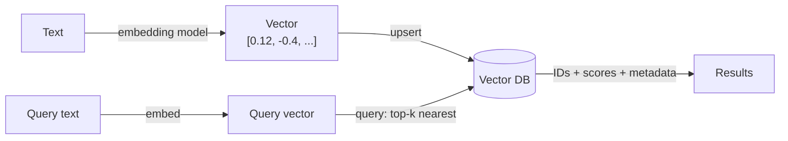
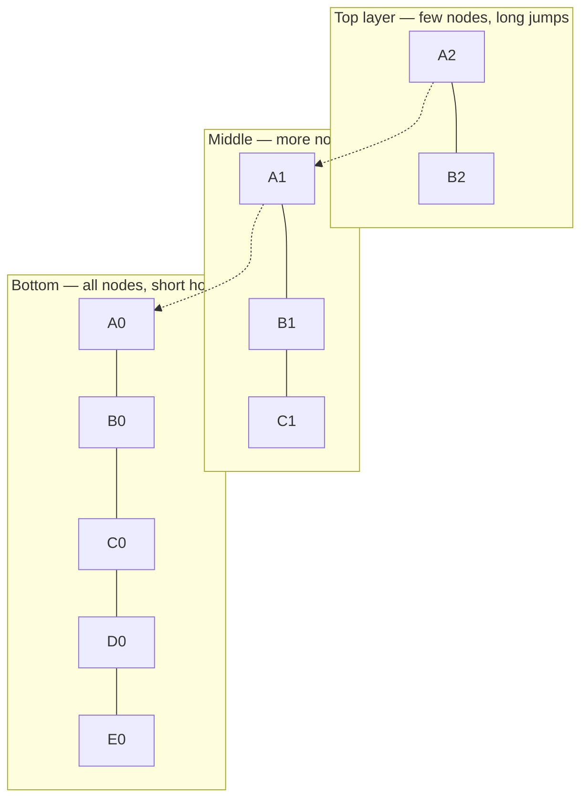
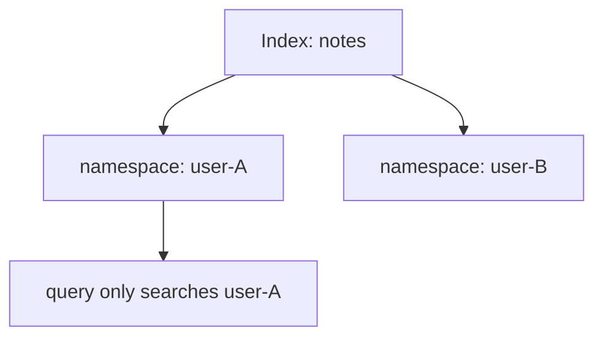
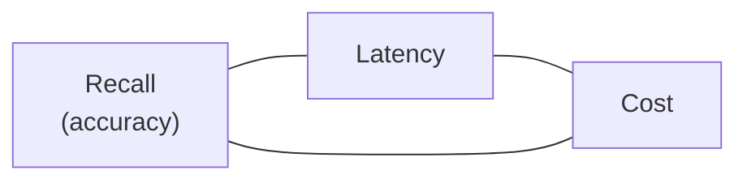

# Vector Databases & Pinecone — Where Embeddings Live

> Personal study notes. Everything explained in plain terms.
> Diagrams are written in Mermaid so they render visually.
> Code examples use Python + the Pinecone SDK, with notes on how local stores differ.
>
> **Scope:** this note is about the **vector database** itself — storing vectors, indexing them, and querying them fast. It is **not** about RAG (chunking, grounding, citations, "chat with your docs"). That's a separate note. Here we only care about the storage-and-search layer.

---

## 0. The 10-second mental model

An embedding turns text into a list of numbers (a **vector**) that captures meaning. A **vector database** is where those vectors live so you can ask:

> "Given this query vector, which stored vectors are the **closest** to it?"

That's the whole job: **store many vectors, then find the nearest ones to a query — fast.**



A vector DB is **not** magic — it's a specialized index over `similarity`, the same cosine idea from the embeddings note.

---

## 1. Why not just use a normal database?

A regular DB is great at **exact** matches (`WHERE id = 42`). It is terrible at "find the 5 rows whose meaning is closest to this one," because that means comparing your query against **every** stored vector — millions of distance calculations per search.

Vector DBs solve this with an **ANN index** (Approximate Nearest Neighbor) that skips most comparisons and still returns near-perfect results in milliseconds.

| Need | Use |
|---|---|
| Exact lookup, joins, transactions | normal DB (Postgres, etc.) |
| "Closest by meaning" over many vectors | vector DB / vector index |
| Both | Postgres **+ `pgvector`** extension |

---

## 2. The core objects

Every vector DB has the same handful of concepts (Pinecone's names shown):

| Object | What it is |
|---|---|
| **Index** | the container for a set of vectors — has a fixed **dimension** & **metric** |
| **Record / vector** | one entry: an `id`, the vector `values`, and optional `metadata` |
| **Namespace** | a partition **inside** an index — isolated groups of records (e.g. per user) |
| **Dimension** | length of each vector — **must match your embedding model** (e.g. 1536) |
| **Metric** | how "closeness" is measured (cosine / dotproduct / euclidean) |

> ⚠️ **Dimension is fixed at index creation.** If you switch embedding models to one with a different output size, you build a **new** index — you cannot resize.

---

## 3. Distance metrics — how "closeness" is measured

| Metric | Intuition | Use when |
|---|---|---|
| **cosine** | angle between vectors, ignores length | most text embeddings (the default) |
| **dotproduct** | angle **and** magnitude | some models trained for it; hybrid/sparse |
| **euclidean (L2)** | straight-line distance | image / spatial embeddings |

**Rule:** use the metric your embedding model's docs recommend. For most text models that's **cosine**. Mismatching the metric silently hurts result quality.

---

## 4. How it's fast — ANN & HNSW (conceptual)

A brute-force search compares the query to **every** vector — accurate but slow. An **ANN index** trades a tiny bit of accuracy for a massive speed-up.

The dominant algorithm is **HNSW** (Hierarchical Navigable Small World) — think of it as a multi-layer "skip list" of vectors: you start at a coarse top layer, hop toward the neighborhood of the query, then refine in denser lower layers.



You don't implement HNSW — Pinecone (and `pgvector`, Qdrant, etc.) do it for you. What you **do** control is the trade-off knob: more accuracy (higher recall) vs. lower latency/cost.

---

## 5. The landscape — local vs cloud

| Store | Runs where | Free & local? | Notes |
|---|---|---|---|
| **`pgvector`** | your own Postgres | ✅ fully local | reuse a DB you already run; best starting point |
| **Chroma** | in-process / local file | ✅ fully local | dead-simple for prototyping |
| **Qdrant** | Docker locally, or cloud | ✅ local via Docker | strong filtering, open-source |
| **Milvus** | self-host or cloud | ✅ self-host | built for very large scale |
| **Pinecone** | **cloud only** | ⚠️ free *tier*, but always hosted | fully managed, no ops |

> **Key fact about Pinecone:** there is **no local/offline Pinecone.** Even in dev, your code makes a network call to their cloud. For purely offline experiments, prefer `pgvector` / Chroma / Qdrant. Use Pinecone specifically to learn the **managed-service** workflow.

---

## 6. Pinecone specifics

### Serverless vs pod-based

| | **Serverless** | **Pod-based** |
|---|---|---|
| Capacity planning | none — it scales itself | you pick pod size/count |
| Cost model | pay per read/write + storage | pay per running pod (steady cost) |
| Start here? | ✅ yes | only at steady, known scale |

### The free tier (for local projects)

- Pinecone's free **Starter** plan exists exactly for prototyping/learning.
- Serverless only, with caps on storage & number of indexes.
- Your local script talks to the hosted index over the network + an API key.
- **The numbers change** — check pinecone.io/pricing for the current limits before relying on them.

---

## 7. Core operations (Python)

```python
from pinecone import Pinecone, ServerlessSpec

pc = Pinecone(api_key="...")

# create an index — dimension MUST match your embedding model
pc.create_index(
    name="notes",
    dimension=1536,
    metric="cosine",
    spec=ServerlessSpec(cloud="aws", region="us-east-1"),
)
index = pc.Index("notes")

# upsert: id + vector values + metadata
index.upsert(vectors=[
    {"id": "doc-1", "values": [0.12, -0.4, ...], "metadata": {"source": "aws", "topic": "iam"}},
])

# query: the k nearest vectors to a query vector
res = index.query(
    vector=[0.10, -0.38, ...],
    top_k=5,
    include_metadata=True,
    filter={"source": {"$eq": "aws"}},   # metadata filter
)

# housekeeping
index.fetch(ids=["doc-1"])
index.delete(ids=["doc-1"])
index.describe_index_stats()
```

The same verbs exist everywhere — only the client differs:

| Pinecone | `pgvector` equivalent |
|---|---|
| `upsert` | `INSERT ... ON CONFLICT DO UPDATE` |
| `query(top_k=5)` | `ORDER BY embedding <=> query LIMIT 5` |
| `filter={...}` | `WHERE source = 'aws'` |

---

## 8. Namespaces & metadata filtering

Two ways to narrow a search:

- **Metadata filter** — keep everything in one namespace, filter at query time (`filter={"topic": {"$eq": "iam"}}`). Flexible.
- **Namespace** — physically separate partitions inside an index. Best for **isolation** (multi-tenant: user A can't see user B's vectors).



> Rule of thumb: **namespace for isolation, metadata for filtering.** A query in one namespace never touches another's data.

---

## 9. Improving result quality (vector-DB features)

These are properties of the **store**, not of RAG:

- **Hybrid search** — combine dense (semantic) vectors with sparse (keyword) vectors so exact terms aren't lost. Pinecone supports sparse-dense records.
- **Re-ranking** — retrieve a wide `top_k` (say 50), then reorder to the best few with a reranker. Higher precision at a small latency cost.
- **Pre- vs post-filtering** — whether the metadata filter is applied *during* the ANN search or *after*; affects recall. Know which your store does.

The universal tuning triangle:



You can push any two; the third gives. Tune to your app's needs.

---

## 10. Operations, cost & evaluation

- **Monitoring** — index fullness, query latency, usage/billing.
- **Cost control** — serverless read/write units vs. a steady pod; estimate before scaling.
- **Evaluation** — **recall@k**: of the truly-nearest vectors, how many did the ANN index actually return? This measures the *store*, independent of any downstream LLM.
- **Source of truth stays elsewhere.** The vector DB holds vectors + light metadata; your real data lives in Postgres/S3. **The index is always rebuildable** — treat it as a cache, not a database of record.
- **Re-embedding trap** — changing embedding models means re-embedding **everything** into a new index (dimension/metric may differ).

---

## Learning roadmap — Vector DB only

Staged like the main AI-Engineer roadmap. This is the **storage-and-search** path only — **no RAG** (no chunking, grounding, or answer-generation; that's a separate track). Climb one rung at a time.

### `0` · Concepts &nbsp; `UNDERSTAND FIRST` &nbsp; `~2 DAYS`

- [ ] Index vs namespace vs record — the core objects
- [ ] Dimension **must** match your embedding model; you can't resize an index
- [ ] Distance metrics — cosine / dotproduct / euclidean, and matching metric to model
- [ ] ANN vs brute force; HNSW at a conceptual level (why search is millisecond-fast)
- [ ] Local vs cloud stores — `pgvector` / Chroma / Qdrant vs Pinecone (cloud-only)

> **MILESTONE** — In your own words: "what does a vector DB do that a normal DB can't, and when is a *managed* one worth paying for?"

### `1` · First index, first query &nbsp; `~3 DAYS`

- [ ] Account, API key, `pinecone` client setup
- [ ] Create a **serverless** index (start here — no capacity planning)
- [ ] `upsert` vectors with IDs + metadata
- [ ] `query` — top-k, `include_metadata`, `include_values`
- [ ] Metadata filtering — `filter={"source": {"$eq": "aws"}}`
- [ ] `fetch`, `update`, `delete`, `describe_index_stats`

> **PROJECT** — Ingest ~500 embedded entries from a dataset you own (e.g. your AWS notes) into a free serverless index, then run semantic search. Success = returned entries are genuinely the closest in meaning. *(No LLM — pure retrieval.)*

### `2` · Namespaces & data organization &nbsp; `~2 DAYS`

- [ ] Namespaces for multi-tenancy (isolated partitions inside one index)
- [ ] Namespace **vs** metadata-filter — when to use which for isolation
- [ ] ID design & idempotent upserts (no duplicate vectors on re-ingest)
- [ ] Batch upserts — chunk large ingests, respect rate limits

> **PROJECT** — Extend the search app so two "users" have isolated corpora via namespaces; verify one can't retrieve the other's vectors.

### `3` · Result quality &nbsp; `~3 DAYS`

- [ ] Hybrid search — dense + sparse (semantic + keyword) so exact terms aren't lost
- [ ] Re-ranking — retrieve a wide `top_k`, reorder to the best few
- [ ] Pre- vs post-filtering and its effect on recall
- [ ] The recall ↔ latency ↔ cost tuning triangle

> **MILESTONE** — Given a query where pure semantic search misses an exact keyword, show hybrid search fixing it.

### `4` · Ops, cost & evaluation &nbsp; `~3 DAYS`

- [ ] Monitoring — index fullness, query latency, usage/billing
- [ ] Cost control — serverless read/write units vs. pod-based at steady scale
- [ ] **recall@k** — did the ANN index return the truly-nearest vectors?
- [ ] Rebuild / backup — the index is a cache; source of truth stays in Postgres/S3
- [ ] **Exit plan** — abstract the store behind a `VectorStore` interface so swapping is a config change

> **MILESTONE** — Justify, with numbers, whether Pinecone or `pgvector` fits a given workload.

**Pace:** ~2.5–3 weeks total.

---

## Guiding principles

- **`pgvector` first, always.** Only climb to Pinecone when scale / latency / no-ops genuinely demand it.
- **Abstract the client.** Wrap the store behind your own `VectorStore` interface from day one — vendor lock-in is the main risk of a managed DB. Swapping to Qdrant should be a config change, not a rewrite.
- **The index is a cache.** Keep the source of truth in a real database; you can always re-embed and rebuild.
- **Match dimension & metric to the embedding model.** Get these wrong and quality silently degrades.
