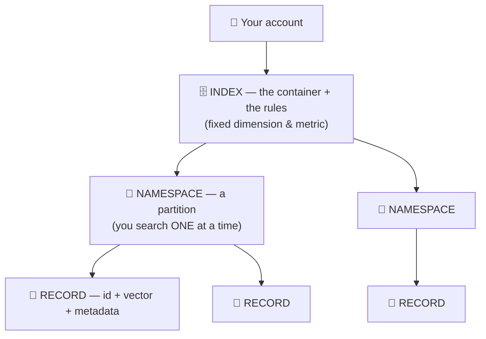
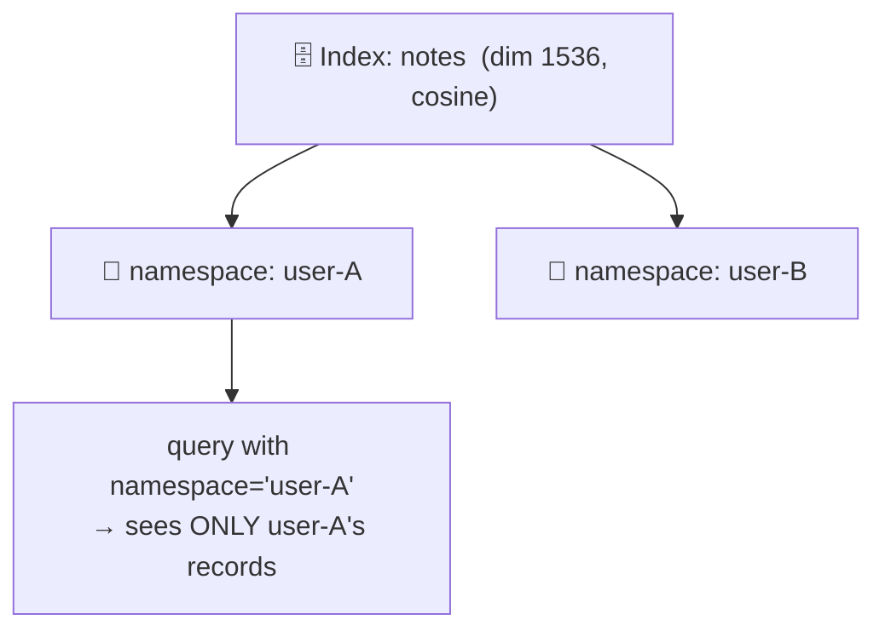
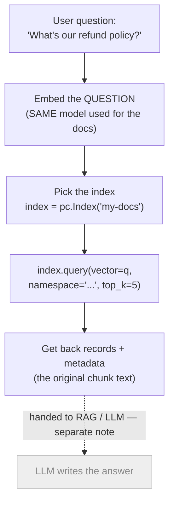
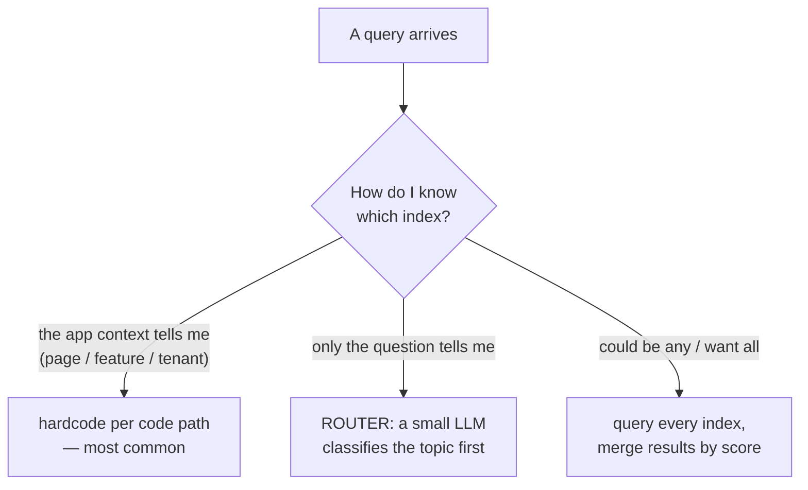
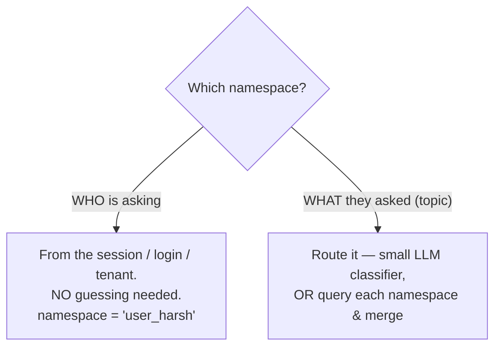
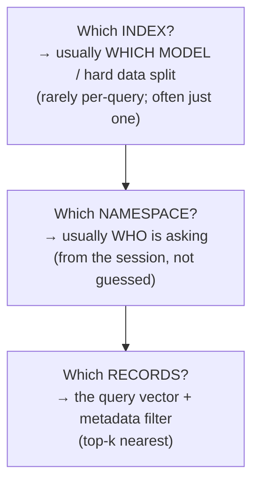

# Index vs Namespace vs Record — The Core Objects

> Personal study notes. Everything explained in plain terms, definition-first.
> Diagrams are in Mermaid so they render visually.
> Companion to [01 — Vector Databases & Pinecone](./01-Vector-Databases-and-Pinecone.md); this note zooms into the three nesting objects and the one question they always raise: **"which one does my query go to?"**
>
> **Scope:** still the **vector-DB layer only** — storing and finding vectors. The final "feed to an LLM and write an answer" step (RAG) is shown greyed-out for context but lives in a separate note.

---

## 0. The 10-second mental model

Three objects, nested like dolls. **Index holds namespaces, namespaces hold records.**



Read it as a path: **Account → Index → Namespace → Record.** You never search "everything you own" — you search **one index, one namespace** at a time.

---

## 1. The filing-cabinet picture

The whole hierarchy maps onto an office:

```
🏢 YOUR ACCOUNT (the office)
│
├── 🗄️ INDEX  "products-search"              ← a whole filing CABINET
│    │        dimension = 1536, metric = cosine   ← rules stamped on the cabinet
│    │
│    ├── 📁 NAMESPACE "electronics"           ← a DRAWER in the cabinet
│    │     ├── 📄 id="tv_01"   [0.2, -0.5, ...]  {brand:"sony"}    ← a SHEET of paper
│    │     └── 📄 id="phone_5" [0.7, -0.1, ...]  {brand:"apple"}
│    │
│    └── 📁 NAMESPACE "clothing"              ← another DRAWER
│          └── 📄 id="shirt_9" [0.3, 0.3, ...]  {size:"M"}
│
└── 🗄️ INDEX  "support-tickets"              ← a SEPARATE cabinet
     │        dimension = 768, metric = dotproduct  ← its OWN different rules
     └── 📁 NAMESPACE "" (default drawer)
           └── 📄 id="ticket_88" [0.4, ...]  {status:"open"}
```

- **Cabinet = Index** — a big box that holds stuff, with **rules stamped on it** (dimension, metric). Cabinet #1 only accepts 1536-long vectors; cabinet #2 only accepts 768-long ones. A folder from one physically won't fit the other.
- **Drawer = Namespace** — a divider *inside* one cabinet. When you search, you **open one drawer** and look only in there.
- **Sheet of paper = Record** — the actual thing sitting in a drawer.

---

## 2. Record — the atom

> **Definition:** a **record** is one stored item — a single vector plus its id and optional metadata. It's what you `upsert` in, and what a query returns.

```
{
  id:       "doc_42_chunk_3",      // your unique string key
  values:   [0.021, -0.44, ...],   // the embedding (the vector itself)
  metadata: { source: "handbook.pdf", page: 12, tag: "hr" }
}
```

- **id** — you assign it. Upserting the same id **overwrites** (that's why it's "upsert" = update-or-insert).
- **values** — the actual vector, from an embedding model. **This is the only part similarity search runs on.**
- **metadata** — optional attached JSON. Used to **filter** (`where tag == "hr"`) and to carry the info you need after retrieval (original text, URL, page). Similarity is *never* run on metadata — only exact/range filtering.

---

## 3. Index — the container **and** the rulebook (the confusing one)

> **Definition:** an **index** is the top-level store where records physically live and get searched. It fixes two rules — **dimension** and **metric** — that *every* record inside must obey.

This is the object people find fuzzy, so slow down on two questions:

**"Where does the index live?"** → On the vector-DB's servers (for Pinecone, always in their cloud), inside your account. You create it *first*, before you have any data — at that moment the cabinet exists but is **empty**.

```python
pc.create_index(
    name="products-search",   # naming the cabinet
    dimension=1536,           # RULE: vectors must be exactly this long
    metric="cosine",          # RULE: measure closeness this way
)
# cabinet now exists, but has zero drawers and zero papers
```

**"How do records live inside it?"** → When you upsert, you name *which cabinet* and *which drawer*, and the record then physically sits there:

```python
index = pc.Index("products-search")          # grab the cabinet
index.upsert(
    vectors=[("tv_01", [0.2, -0.5, ...], {"brand": "sony"})],
    namespace="electronics",                 # put this paper in THIS drawer
)
# record "tv_01" now lives in  products-search → electronics
```

> ⚠️ **Dimension & metric are frozen at creation.** Switch to an embedding model with a different output size and you must build a **new** index — you cannot resize a cabinet. (See note 01.)

**The one sentence to lock in:**

> **Index = the container that holds everything *and* sets the rules everyone inside must follow.** Different embedding model / different data → different index.

---

## 4. Namespace — a partition you search one at a time

> **Definition:** a **namespace** is a labeled subdivision *inside* an index. Every record belongs to exactly one namespace (default `""`). A query runs against **one namespace at a time** — records in another namespace are invisible to it.

Same dimension and metric as the index (they're inherited). Just partitioned storage + partitioned search scope.



**Why they exist — isolation.** The classic use is **multi-tenancy**: one index, one namespace per user/tenant, so user A can never retrieve user B's vectors. You get data isolation *and* faster search (smaller space) without paying for a whole extra cabinet per tenant.

---

## 5. Namespace vs metadata filter (they both narrow, differently)

| | **Namespace** | **Metadata filter** |
|---|---|---|
| When it's chosen | *before* the search — which drawer | *during* the search — a `where` clause |
| Cross-group query | impossible — one at a time | easy — just change the filter |
| Best for | **hard isolation** (tenants, environments) | **flexible slicing** of one pool (tags, dates) |

> Rule of thumb: **namespace when groups must never be searched together; metadata when you want many flexible cuts over one shared pool.**

---

## 6. The retrieval flow — where you actually name the index

Putting it in motion. You always talk to a **specific index** — you can't query "the database" in the abstract.



**Two must-match rules:**

1. **Same embedding model** to store docs *and* to embed the question — otherwise the vectors aren't comparable and the length won't even fit the index.
2. **Same index** you upserted into is the one you query — records only exist in the cabinet you put them in.

You specify the index at the **"Pick the index"** step: you must walk up to a cabinet before you can open a drawer and pull papers.

---

## 7. "But which index?" — routing when you have several

If you have multiple indexes, you never query *blindly*. Something resolves the choice **before** the pick step. Three cases:



- **Case 1 — context knows (most common).** The HR page always hits `hr-docs`; the Code page always hits `code-docs`. "Hardcoded" is *correct* here — each feature owns its cabinet. Most doc-chat apps have exactly **one** index, so this is trivially true.
- **Case 2 — a router.** If only the question's content decides, put a cheap LLM classifier *before* the pick: `"How many vacation days?" → "hr" → pc.Index("hr-docs")`.
- **Case 3 — query all, merge.** Embed once, query every index, keep the overall top-k by score. No routing mistakes, but N× the cost/latency.

> **Twist that ties back to note 01:** if all your indexes share the *same* embedding model, they probably shouldn't be separate indexes at all — they should be **one index with namespaces**. Separate **indexes** = different models/dimensions. Separate **namespaces** = same model, different groups.

---

## 8. "And which namespace?" — same question, one level down

Choosing a namespace is the **same routing problem** as choosing an index — the signals are identical (context / router / search-all). But namespaces make it easier, because of *what they're usually for*.

**The key question: does the answer come from WHO is asking, or WHAT they asked?**



- **WHO → you already have it.** Namespaces are *built* for identity boundaries — user, tenant, project, language. Your app knows who logged in, so the namespace is handed to you; you never guess. A user only ever searches their own drawer.
  ```python
  # harsh logs in → session tells you who they are
  index.query(vector=q, namespace="user_harsh", top_k=5)   # no guessing
  ```
- **WHAT → route it.** If namespaces split by *topic* (`hr` / `code` / `finance`) and the question could be any, use the same classifier-or-merge approach as indexes.

**Namespace superpower — clean merging.** Because all namespaces in one index share the same dimension & metric, their scores are directly comparable, so "query each, merge by score" is clean.

> ⚠️ **Pinecone detail:** you must name a namespace per query — there's no literal "search all namespaces" call, so you **loop over them and merge**. Some other DBs let a single query span partitions. The *concept* is the same either way.

---

## 9. The whole thing on one card



| Object | One-line definition | How its "which one?" is decided |
|---|---|---|
| **Index** | the container that holds records **and** fixes dimension + metric | which embedding model / hard data split; usually just one |
| **Namespace** | a partition inside an index you search one at a time (isolation) | **who** is asking — from the session, not guessed |
| **Record** | one item: id + vector + metadata | the query + metadata filter picks the nearest |

---

## Takeaways

- **Index = cabinet + rulebook.** Created first (empty), lives on the DB's servers, freezes dimension & metric for everything inside. New model → new index.
- **Namespace = drawer.** Same rules as the cabinet, but isolated; you search **one at a time**. Built for *who* (tenants/users).
- **Record = sheet of paper.** id + vector + metadata; similarity runs only on the vector, filtering only on metadata.
- **You never query blindly.** The index comes from app context (or a router); the namespace almost always comes from *who is asking*.
- **Same-model data → one index + namespaces**, not many indexes. Reserve separate indexes for genuinely different embedding models.
