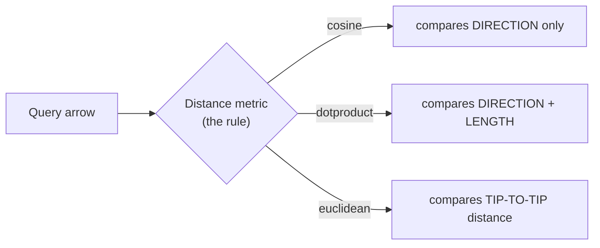
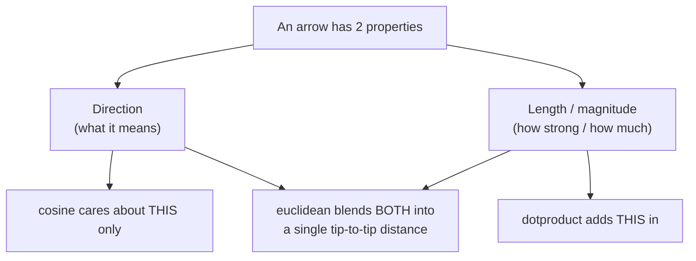
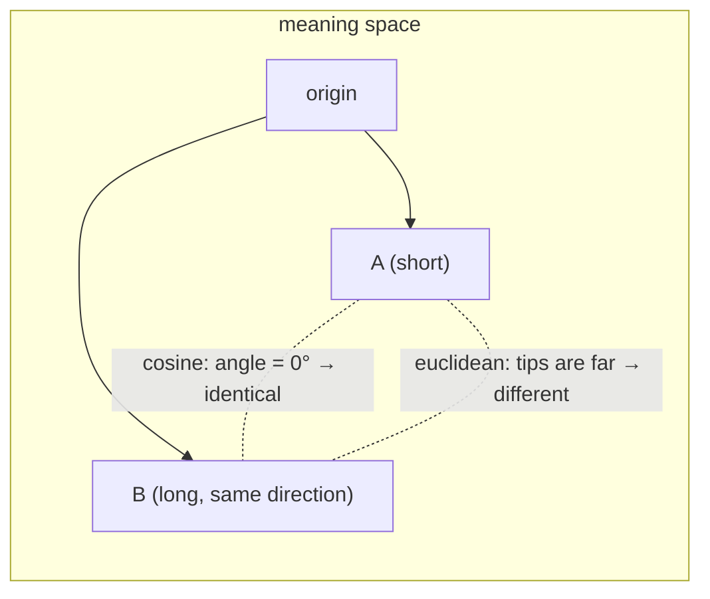
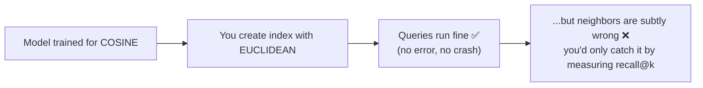
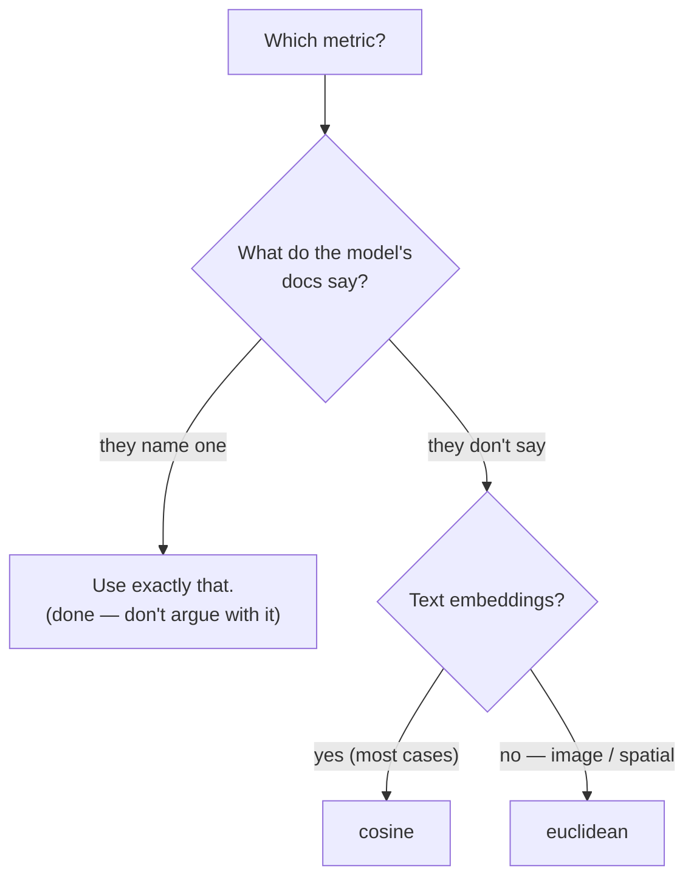

# Distance Metrics — How "Closeness" Is Measured

> Personal study notes. Everything explained in plain terms, definition-first.
> Diagrams are in Mermaid so they render visually.
> Companion to [01 — Vector Databases & Pinecone](./01-Vector-Databases-and-Pinecone.md) and [02 — Index vs Namespace vs Record](./02-Index-Namespace-Record.md). Note 02 said the index freezes a **metric**; this note is entirely about **what that metric is and how to pick it**.
>
> **Scope:** still the **vector-DB layer only**. We care about *measuring similarity between two vectors* — not embeddings themselves (that's the embeddings note) and not RAG.

---

## 0. The 10-second mental model

Every vector is an **arrow** pointing somewhere in "meaning space." A search asks: *"which stored arrows are most **similar** to my query arrow?"* A **distance metric** is the rule for scoring that similarity — and there are three common rules that measure **different things**.



> The metric is **frozen at index creation** (see note 02). Pick it wrong and there's **no error** — results just quietly get worse. So the whole game is: *match the metric to what your embedding model was trained for.*

---

## 1. Why there's even a choice

Two arrows can differ in **two ways**: which *direction* they point, and how *long* they are. Each metric weighs those two differently.



That single fact — *"does length matter or not?"* — is what separates the three metrics.

---

## 2. Cosine — "are they pointing the same way?"

> **Definition:** cosine similarity measures the **angle** between two arrows and ignores their length. Range **−1 → +1**; **higher = more similar**.

- Same direction → **1** (identical meaning)
- 90° apart → **0** (unrelated)
- Opposite → **−1** (opposite meaning)

**Analogy:** two people point at the same star — one with a pencil, one with a broomstick. Different lengths, *same direction*. Cosine calls them identical, because only the aim matters.

```
A = [2, 0]   (short arrow → right)
B = [10, 0]  (long arrow  → right, same way)

cosine(A, B) = 1   →  "same meaning" (length ignored)
```

**Why it's the default for text:** a 20-page document and a one-line summary of it should count as *similar in topic*. Length mostly reflects "how much text," not "what it's about" — so throwing length away is exactly right.

---

## 3. Dot product — "same way, and how strongly?"

> **Definition:** the dot product multiplies the arrows component-by-component and sums it. It rewards **both** matching direction **and** greater length. **Higher = more similar**, and it's unbounded.

**Analogy:** same two star-pointers. Cosine says "equal." Dot product says *"the broomstick is pointing harder"* — longer arrow, bigger score.

```
A = [2, 0]      dot(A, B) = 2*10 + 0*0 = 20
B = [10, 0]     (bigger than for the short arrow → length boosted the score)
```

**When to use it:** only when your embedding model's docs say so. Some models are trained so that **magnitude carries signal** (e.g. longer = more important/confident). Also common in **hybrid / sparse** setups (see note 01, §9).

> 🔑 **The link worth memorizing:** if all vectors are **normalized** (rescaled to length 1), cosine and dot product produce the **same ranking**. Many models normalize their output — which is why the two are often treated as interchangeable.

---

## 4. Euclidean (L2) — "how far apart are the tips?"

> **Definition:** euclidean distance is the straight-line, ruler distance between the two arrow **tips**. Range **0 → ∞**; **lower = more similar** (the opposite direction from cosine!).

- Distance **0** → identical
- Bigger number → less similar

**Analogy:** two pins on a map. Euclidean is simply *"how many kilometres between the pins,"* measured with a straight ruler.

```
A = [2, 0]      euclidean = √((10−2)² + 0²) = √64 = 8
B = [10, 0]     → "fairly far apart"
```

**When to use it:** image / spatial embeddings, where the actual *position* in space is meaningful — not just direction.

> ⚠️ **Direction flips.** For cosine & dotproduct, **bigger = better**. For euclidean, **smaller = better**. Keep this straight when you read scores or set thresholds.

---

## 5. Watch them disagree (the key insight)

Same two vectors. Three metrics. Three different verdicts:

| Pair | **cosine** (angle) | **dotproduct** (angle+length) | **euclidean** (tip distance) |
|---|---|---|---|
| `[2,0]` vs `[10,0]` | **1** → identical | **20** → strong match | **8** → far apart |
| meaning | "same topic" | "same topic, one is 'stronger'" | "very different points in space" |

None is wrong — they answer **different questions**. Cosine sees "same direction → identical"; euclidean sees "very different lengths → far apart." That gap is the entire reason picking the right metric matters.



---

## 6. Matching metric to model — the part that bites you

> **The rule that matters most:** an embedding model is **trained with one specific notion of distance.** During training it learns to place similar things close together *according to that one metric*. Query with a different metric and you're asking the wrong question of the data.

The trap is that it fails **silently**:



So the practical procedure is boring on purpose:

1. **Open your embedding model's docs.**
2. **Use the metric it recommends.** Don't overthink it.
3. That metric is **frozen at index creation** — changing your mind later = rebuild the index.

Rough real-world defaults (but the docs win):

| Model family / data | Usual metric |
|---|---|
| Most text embeddings (OpenAI, Cohere, most sentence-transformers) | **cosine** |
| Models explicitly tuned for it; hybrid/sparse | **dotproduct** |
| Image / spatial embeddings | **euclidean** |

---

## 7. Choosing — a 10-second decision



> If you're unsure and it's text: **cosine**. You'll rarely be wrong.

---

## 8. The whole thing on one card

| Metric | Measures | Range | Similar means | Use when |
|---|---|---|---|---|
| **cosine** | direction only (angle) | −1 → 1 | **higher** | most **text** — the default |
| **dotproduct** | direction **+** length | −∞ → ∞ | **higher** | model says so; hybrid/sparse; ≡ cosine if normalized |
| **euclidean (L2)** | tip-to-tip distance | 0 → ∞ | **lower** | image / **spatial** embeddings |

---

## Takeaways

- **Direction vs length is the whole story.** cosine = direction only · dotproduct = direction + length · euclidean = straight-line tip distance.
- **Score direction differs.** cosine & dotproduct: **bigger = closer**. euclidean: **smaller = closer**.
- **cosine ≈ dotproduct when vectors are normalized** — same ranking.
- **Match the metric to the model** — it was trained for one; using another degrades quality **silently** (no error, just worse neighbors). Follow the model's docs.
- **Frozen at index creation** (like dimension, note 02). Change your mind → rebuild the index.
- **Default for text: cosine.** When in doubt, that's the safe pick.
