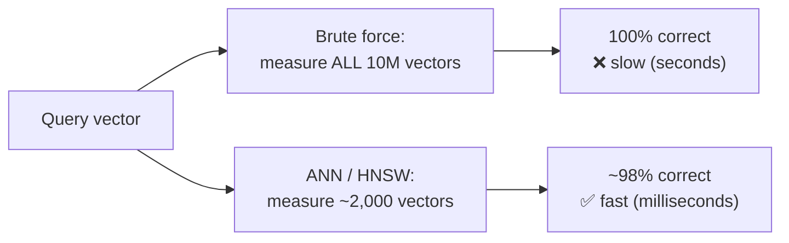
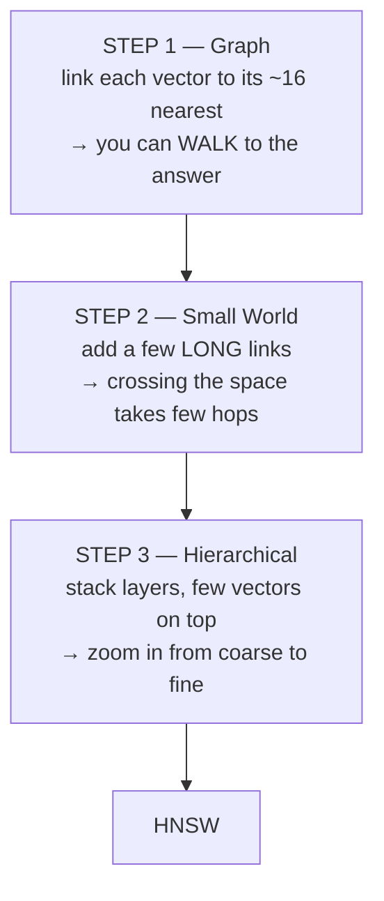
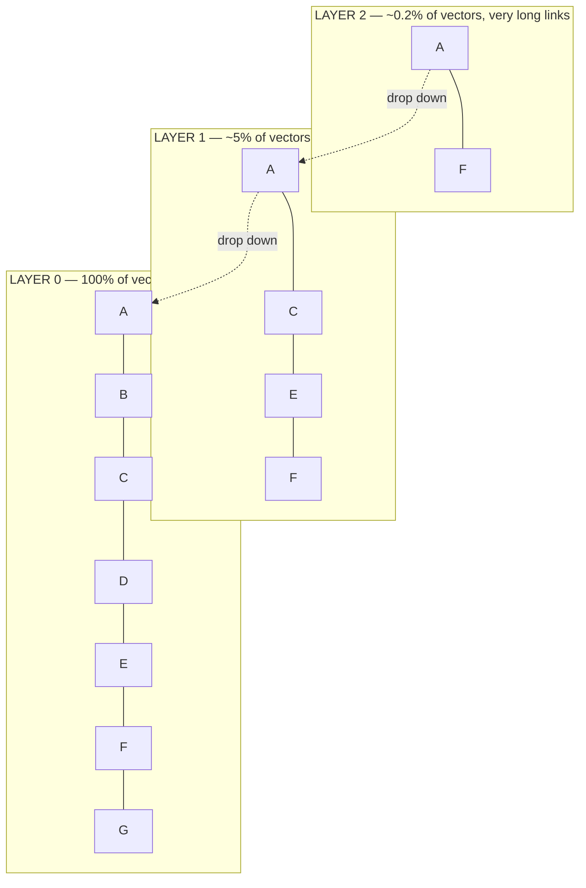
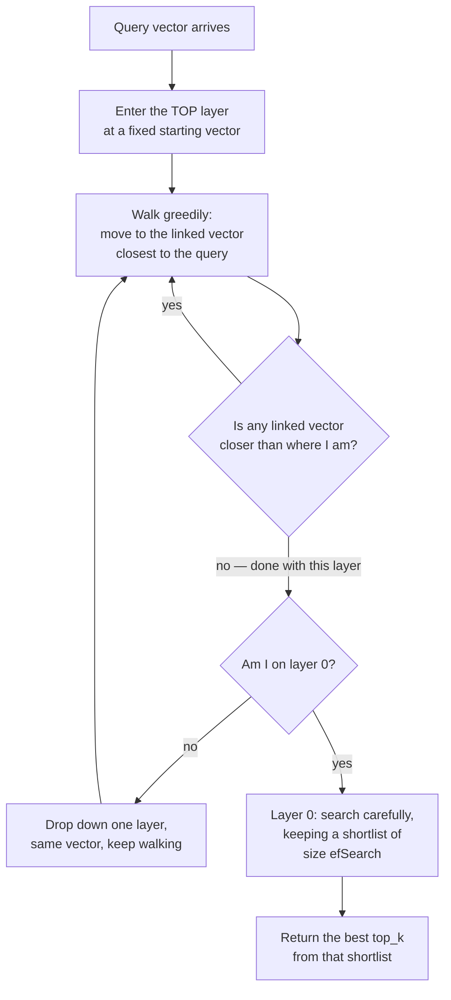
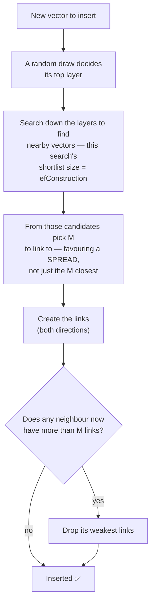
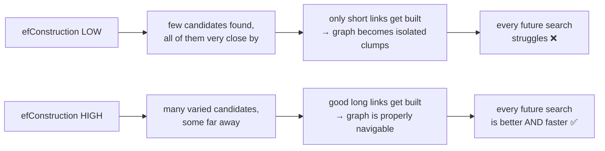
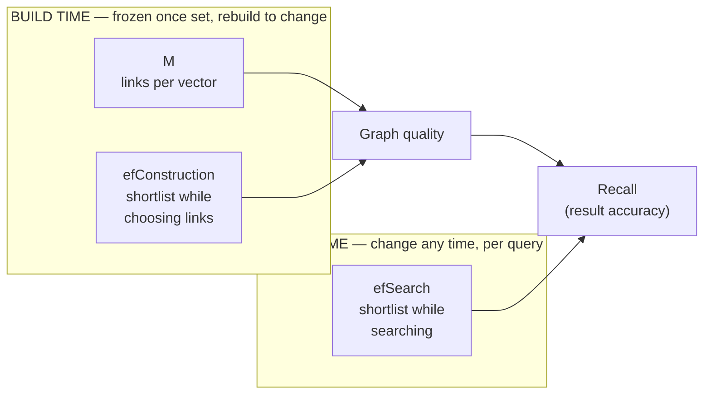

# ANN & HNSW — How Search Stays Fast

> Personal study notes. Everything explained in plain terms, definition-first.
> Diagrams are in Mermaid so they render visually.
> Companion to [01 — Vector Databases & Pinecone](./01-Vector-Databases-and-Pinecone.md), [02 — Index vs Namespace vs Record](./02-Index-Namespace-Record.md) and [03 — Distance Metrics](./03-Distance-Metrics.md). Note 01 §4 mentioned ANN and HNSW in a few lines; **this note is the full version of that section.**
>
> **Scope:** still the **vector-DB layer only**. Note 03 covered *how one distance is measured*. This note covers *how you avoid measuring millions of them.* Not about embeddings, not about RAG.

---

## 0. The 10-second mental model

To answer "which stored vectors are closest to my query?", the honest way is to measure the distance to **every** stored vector. That is correct but slow.

**ANN** is the decision to *stop being perfectly correct* so you can be much faster. **HNSW** is the most popular way of doing that: it connects the vectors into a **graph of shortcuts**, and search **walks** the graph instead of scanning everything.

> The trade in one line: **you lose about 2% of accuracy and gain about 1000× of speed.** For search, that is almost always worth it.

---

## 1. The problem — why brute force fails

> **Definition:** **brute-force search** (also called **exact search** or **KNN**) measures the distance from the query to every stored vector, sorts the results, and returns the closest `k`. It is always 100% correct.

Here is why it does not survive scale. Take 10 million vectors of 1536 numbers each:

| Step | Cost |
|---|---|
| One distance measurement | ~1536 multiply + add operations |
| × 10,000,000 vectors | **~15 billion operations — for ONE search** |
| At 100 searches/second | completely impossible on normal hardware |

And it gets worse in a straight line: **double your data → double your search time.** Forever. There is no way to tune your way out of that.

> ✅ **But do use brute force when it fits.** Under roughly 10,000 vectors it is fast enough, it needs no index, and it is never wrong. Only reach for ANN when the numbers force you to.

---

## 2. ANN — the idea

> **Definition:** **ANN** = **A**pproximate **N**earest **N**eighbor. Instead of guaranteeing the true closest vectors, it returns *almost always the closest* vectors, by looking at only a small fraction of the data.

The justification is practical, not mathematical:

- If you return 10 results and one of them should really have been ranked 12th instead of 7th — **no user ever notices.**
- If you make the user wait 3 seconds — **every user notices.**

So accuracy is spent to buy speed. And because accuracy is now a *number you chose* rather than a guarantee, you need a way to measure it:

> **Definition:** **recall@k** = of the vectors that were *truly* the closest `k`, what fraction did the search actually return? `recall@10 = 0.98` means: on average it found 9.8 of the true top 10.

**Recall is the score for the index itself.** It has nothing to do with LLMs or answer quality — it only asks "did the shortcut lose anything?" Typical production target: **0.95 – 0.99**.

### How every ANN method works

All of them share one shape: **do extra work once, up front, so that each search can safely skip almost everything.** That upfront work is called **building an index**.

The main families:

| Family | The trick | Example |
|---|---|---|
| **Clustering (IVF)** | group vectors into ~1000 clusters; search only the few clusters nearest the query | FAISS IVF |
| **Hashing (LSH)** | a hash function built so that *similar* vectors land in the same bucket | older systems |
| **Trees** | split the space in half again and again; follow the branches down | Annoy |
| **Graphs** | link each vector to its nearest neighbours, then **walk** the links toward the query | **HNSW** ← the winner |

Graphs gave the best recall-for-the-speed on normal embedding data, so **HNSW became the default almost everywhere** (`pgvector`, Qdrant, Weaviate, Milvus, Elasticsearch, FAISS).

---

## 3. HNSW — built up in three steps

The name is the design, read backwards: **Small World** → **Navigable** → **Hierarchical**. Add one idea at a time.

### Step 1 — link the vectors, then walk

Give every vector a link to its ~16 nearest vectors. Now search like this:

1. Start at some vector.
2. Look at all the vectors it links to.
3. Move to whichever one is closest to the query.
4. Repeat until no linked vector is closer than where you already are.

This is called **greedy search**. It works because of one property of embedding space:

> **Closeness is roughly see-through.** If A is near B, and B is near C, then A is probably not far from C. So a vector only needs to know its **own** neighbours — no vector holds a map of everything — and yet following "which neighbour is closer?" reliably carries the walk across the whole space.

**The remaining problem:** if every link is short, crossing the space needs thousands of tiny steps.

### Step 2 — add a few long links ("small world")

So HNSW deliberately keeps a **mix**: mostly short links to close neighbours, plus a few **long** links reaching far-away regions. A few long links collapse the number of hops needed dramatically.

> **Definition:** a **small world** graph is one with dense local links plus a few long-range shortcuts. **Navigable** means you can actually route through it using only local information (each vector's own links). Hence **NSW = Navigable Small World**.

Those long links are not a nice-to-have — without them the graph becomes disconnected clumps and the walk cannot get between them.

### Step 3 — stack layers ("hierarchical")

The final idea, the **H**. Vectors are placed on **layers**:

- **Layer 0 holds every vector.** It is the complete graph.
- Each layer above holds a **random sample** of the layer below. On insert, each vector gets a random draw deciding how high it goes — so most vectors exist only on layer 0, few reach layer 1, very few reach layer 2. It thins out fast.
- **Higher layers have longer links**, simply because their vectors are far apart (there are so few of them).

The point: **the top layers are a cheap coarse locator, the bottom layer is the precise one.**

---

## 4. The search flow

This is the part worth memorising. One pass, top to bottom:

Read that as: **coarse hops up top, careful search at the bottom.**

Upper layers run with **no shortlist at all** — they are only narrowing down the region, so precision there does not matter. All the careful work happens on layer 0, the only layer that has every vector.

### Why layer 0 needs a shortlist

Plain greedy walking has a failure mode:

> The walk reaches a vector where **every** linked vector is farther from the query than the current one, so it stops. But a closer vector did exist elsewhere in the graph — reachable only by first stepping through a vector that looked *worse*. The walk quit too early.

This is called getting stuck in a **local minimum**, and it is the main weakness of walking a graph.

The fix: while walking, keep a **shortlist** of promising vectors that were seen but not visited. When the current path dead-ends, resume from the next-best entry on the shortlist instead of stopping.

**The length of that shortlist is `efSearch`.** That is all it is.

---

## 5. The build flow

Inserting a vector uses the **same search** described above — the index builds itself with its own search routine.

Two details in that flow carry all the weight:

1. **`efConstruction` is the shortlist size for the neighbour-finding search.** A longer shortlist finds *more and more varied* candidates to choose links from.
2. **Step "pick M" does not just take the M closest.** It deliberately keeps some links pointing at *far* regions. This is how the long links from §3 get created.

Put those together and you get the reason `efConstruction` matters:

---

## 6. The three knobs

### `efSearch` — how hard each search tries

> **Definition:** the size of the shortlist kept during the layer-0 search. Bigger = explores more of the graph = higher recall, slower. Must be **≥ `top_k`**.

**This is the only HNSW knob you can change without rebuilding.** It is *the* recall ↔ latency dial.

| `efSearch` | roughly recall@10 | relative latency |
|---|---|---|
| 10 | ~0.75 | 1× |
| 50 | ~0.95 | 2–3× |
| 100 | ~0.98 | 4× |
| 500 | ~0.995 | 15× |

> 🔑 **Notice the shape: recall flattens out, latency does not.** 100 → 500 costs 4× the time for about 1% more accuracy. Most real systems live at **50–150**. Going higher is close to pure waste.
>
> ⚠️ **If you over-fetch for a re-ranker** (note 01 §9 — pull `top_k=50`, then reorder), `efSearch` must rise with `top_k`. `efSearch = 50` with `top_k = 50` is the broken case and recall collapses. Rule of thumb: **`efSearch` ≈ 2 × `top_k`, minimum.**

### `efConstruction` — how hard the build tried

> **Definition:** the size of the shortlist used when searching for a new vector's neighbours at insert time. Bigger = better candidates to pick links from = a permanently better graph.

- Costs **build time only** — not memory, not query speed.
- **Frozen at build.** Changing it means reindexing everything.
- Because it is a one-time payment for a permanent gain, **be generous.** It stops helping past ~200–500.

### `M` — how many links per vector

> **Definition:** the maximum number of links each vector keeps per layer (layer 0 usually gets `2 × M`). More links = more routes through the graph = better recall.

Unlike the other two, this one costs you in **three** directions at once:

| ↑ `M` gives you | ↑ `M` costs you |
|---|---|
| better recall | **memory, permanently** — roughly `8 × M` to `10 × M` bytes *per vector* |
| | slower search — each hop has more links to check |

> ⚠️ **The memory trap.** At 1536 dimensions a vector is ~6 KB, so `M=16` graph overhead (~150 bytes) is invisible. But if you **quantize** the vectors down to ~100–800 bytes, the *graph* can cost more than the vectors do. This is the usual reason people are surprised that quantizing barely shrank their index.

### Starting values

| Knob | Sane default | Range you'd ever use |
|---|---|---|
| `M` | **16** | 8 – 64 |
| `efConstruction` | **200** | 100 – 500 |
| `efSearch` | **100** | 50 – 400 |

Tuning order: **fix `M=16`, raise `efConstruction` until recall stops improving, then tune `efSearch` per query.** Only raise `M` if recall is still poor at high `efSearch` — that is the signal the *graph* is the limit, not the search effort.

---

## 7. Why this is millisecond-fast

Each layer cuts the remaining region by a constant factor, so the number of hops grows with **log(n)**, not with **n**:

| Vectors stored | Brute force distance checks | HNSW distance checks |
|---|---|---|
| 10,000 | 10,000 | ~1,000 |
| 1,000,000 | 1,000,000 | ~2,000 |
| 100,000,000 | 100,000,000 | ~3,000 |

Read the right-hand column carefully. Going from 10 thousand to 100 **million** vectors — **10,000× more data** — roughly **triples** the work. The left column went up 10,000×.

> 🔑 **That is the whole reason a vector DB can hold hundreds of millions of vectors and still answer in single-digit milliseconds.** Not because the machine is fast — because it only ever looks at a few thousand vectors.

---

## 8. What HNSW is bad at

It is not free. The real costs, and they matter in production:

| Weakness | Why |
|---|---|
| **Memory hungry** | the graph lives in RAM: ~100–600 bytes per vector *on top of* the vector itself |
| **Deletes are awkward** | you can't cleanly cut a vector out of a link network, so most systems just **mark it deleted** and filter it out at query time; the junk builds up until a rebuild |
| **Slow to build** | inserting 1M vectors means running 1M searches |
| **Filtered search hurts** | "similar **and** `author = X`" — if the matching subset is small and scattered, the walk keeps landing on vectors that get filtered away and recall drops badly |

That last one is why **pre- vs post-filtering** (note 01 §9) is worth knowing about — it is a direct consequence of how the graph walk works.

---

## 9. The Pinecone reality check

> ⚠️ **Pinecone does not expose any of these knobs.** There is no `M`, no `efConstruction`, no `efSearch` in the Pinecone API. You send `top_k` and Pinecone decides everything internally. Serverless Pinecone isn't even plain HNSW — it uses its own index design.

So do not try to memorise values for Pinecone. Learn this note as **how ANN search thinks**, because:

- The **recall ↔ latency ↔ cost** triangle (note 01 §9) exists in *every* vector DB — Pinecone just hides the controls.
- You **do** set these by hand in `pgvector` (`m`, `ef_construction`, `hnsw.ef_search`), Qdrant, Weaviate, Milvus, and raw FAISS.
- It explains *why* **recall@k** is the metric to evaluate a store with (note 01 §10) — recall is the thing ANN spends.

> Framed usefully: **choosing a managed vector DB is a bet that someone else tunes these better than you would.** Pinecone's pitch is "we chose for you." `pgvector`'s is "here's `hnsw.ef_search`, good luck."

---

## 10. The whole thing on one card

| Term | Plain meaning | When you set it |
|---|---|---|
| **Brute force / KNN** | check every vector; always correct, slow | fine under ~10k vectors |
| **ANN** | check a few thousand instead; ~98% correct, ~1000× faster | the whole strategy |
| **recall@k** | how much accuracy the shortcut cost you (target 0.95–0.99) | what you **measure** |
| **HNSW** | layered graph of links; walk it coarse → fine | the default method |
| **`M`** | links per vector → memory + quality | build, **frozen** |
| **`efConstruction`** | shortlist while choosing links → graph quality | build, **frozen** |
| **`efSearch`** | shortlist while searching → recall vs speed | **any time, per query** |

---

## Takeaways

- **Brute force is correct but scales linearly** — 10× the data is 10× the time. Under ~10k vectors, just use it.
- **ANN trades a little accuracy for a lot of speed.** ~98% recall for ~1000× less work. Users notice latency; they don't notice the missing 12th-best result.
- **`recall@k` is the score for the index itself** — measure it, independent of any LLM.
- **HNSW = graph + long links + layers.** Walk the links instead of scanning; long links make it few-hop; layers let you zoom in coarse → fine.
- **The search flow:** greedy hops from the top layer down, then one careful shortlist search on layer 0. Only layer 0 has every vector.
- **The build flow uses the same search** — which is why build quality compounds into search quality.
- **`efSearch` is the one live knob.** Bigger = more accurate, slower. Recall flattens, latency doesn't — stay around 50–150, and keep it **≥ 2× `top_k`** if you over-fetch for a re-ranker.
- **`efConstruction` and `M` are frozen at build.** `efConstruction` costs only build time, so be generous. `M` costs **RAM forever**.
- **Speed comes from log(n).** 10,000× more data ≈ 3× more work.
- **Real costs:** RAM, awkward deletes, slow builds, and **filtered search hurting recall**.
- **Pinecone hides all three knobs.** Learn this as *how ANN thinks* — you'd actually turn these dials in `pgvector` / Qdrant / Weaviate.
