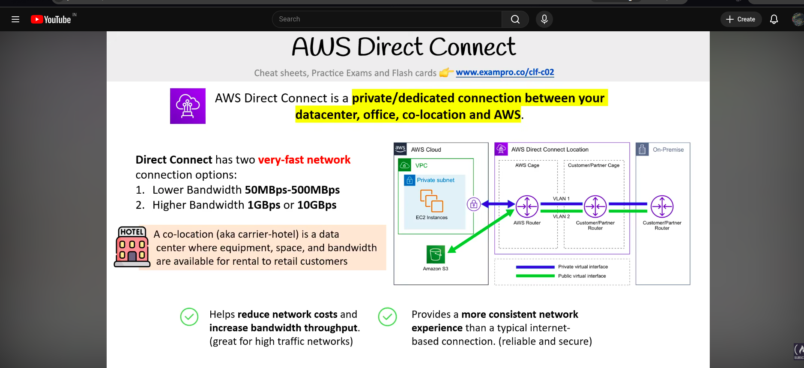
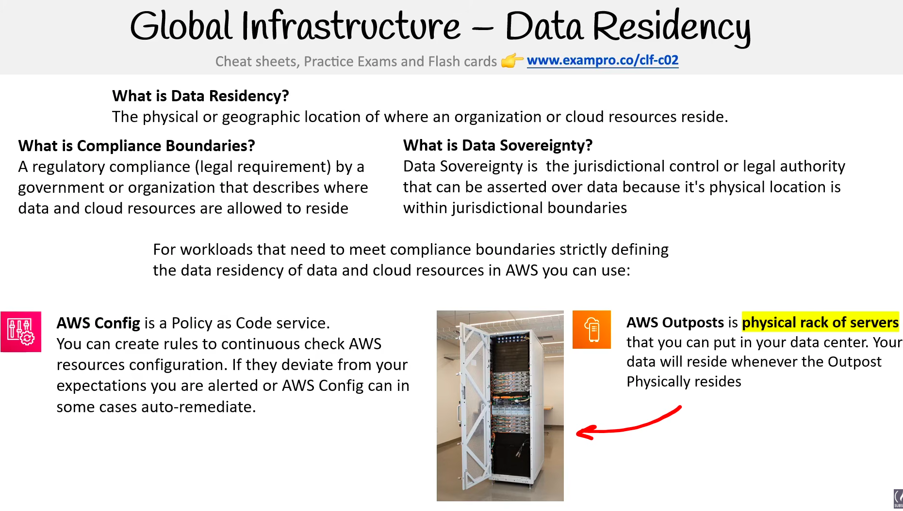
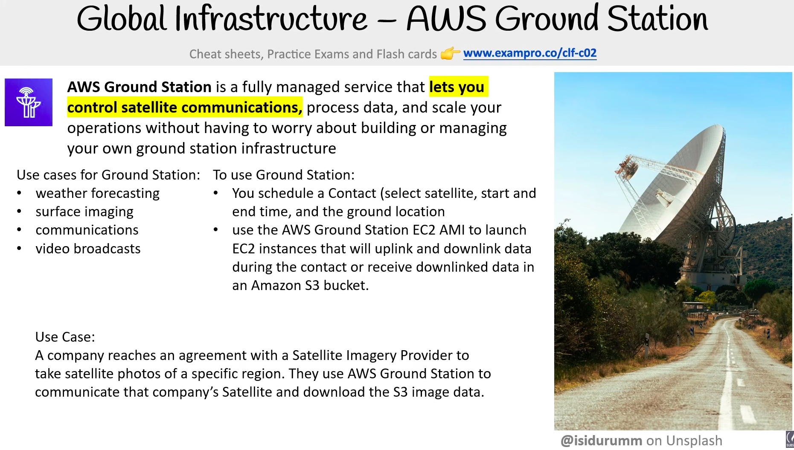
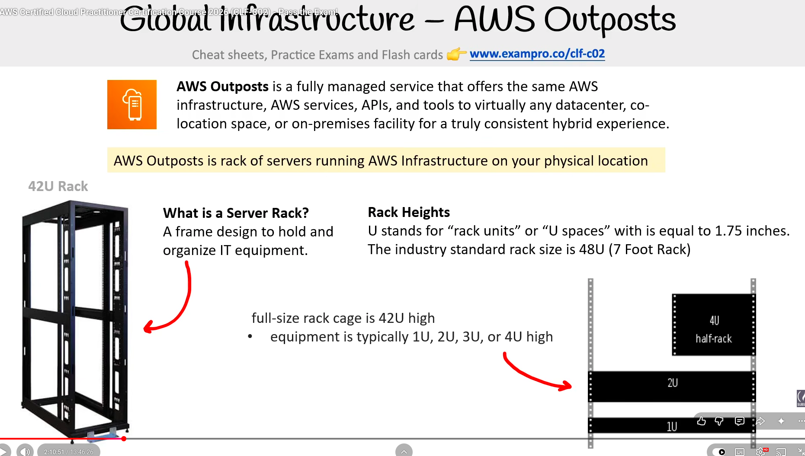

# AWS Global Infrastructure

> **Exam:** AWS Certified Cloud Practitioner (CLF-C02)
> **Topic 1:** Regions, AZs, Local Zones, Wavelength Zones, Edge Locations, Regional Edge Cache, Direct Connect

The whole point of AWS Global Infrastructure is to give you choices about **where** your apps run so you can optimize for **latency, availability, cost, and compliance (data residency)**. Those four words are the recurring exam themes.

---

## 1. Regions

A **Region** is a separate geographic area in the world (e.g., Mumbai `ap-south-1`, N. Virginia `us-east-1`, Oregon `us-west-2`).

- Each Region is **fully independent and isolated** from others (for fault tolerance and data sovereignty).
- A Region contains **multiple Availability Zones** (minimum 3 in most modern Regions).
- **You choose your Region** based on:
  - **Latency** → pick a Region close to your users.
  - **Compliance / data residency** → some data must legally stay in a country.
  - **Cost** → prices differ between Regions.
  - **Service availability** → not every AWS service is in every Region.
- Data does **not** automatically leave a Region. You control any cross-Region copying.

**Exam triggers:** "data must stay in country," "comply with regulations," "choose location for lowest cost/latency" → **Region**.

---

## 2. Availability Zones (AZs)

An **Availability Zone** is one or more **discrete data centers** with redundant power, networking, and cooling, inside a Region.

- AZs in a Region are **physically separate** (km apart) but connected by **high-speed, low-latency private links**.
- Named like `us-east-1a`, `us-east-1b`, `us-east-1c`.
- **Purpose = High Availability + Fault Tolerance.** If one AZ fails (fire, power, flood), the others keep running.

**Best practice:** Deploy across **multiple AZs** (Multi-AZ) so a single data center failure doesn't take down your app. (e.g., RDS Multi-AZ, load balancing across AZs.)

**Exam triggers:** "high availability," "fault tolerant," "survive a data center failure" → **multiple AZs**.

### Region vs AZ (mental model)
```
Region (Oregon, us-west-2)
├── AZ-a  ┐
├── AZ-b  │  separate buildings, same area, fast private links
└── AZ-c  ┘
```

---

## 3. Local Zones

A **Local Zone** is an **extension of a Region** placed in a **large city / metro area** that is far from the parent Region.

- It is a **child of the Region**, sitting **beside the AZs — NOT inside an AZ.**
- **Purpose = ultra-low latency** for users in a city that has no nearby Region.
- Runs a **limited subset** of AWS services (e.g., EC2, EBS, some others) — not everything a full Region has.
- You **extend your existing VPC** into the Local Zone; it behaves like another subnet.
- Usually a **single location → limited built-in HA.** For high availability you fail back to the multi-AZ **parent Region**.

```
Region (Oregon)
├── AZ-a, AZ-b, AZ-c   (clustered near Oregon → for HA)
└── Local Zone (Los Angeles)  (far away → for low latency to LA users)
```

**Use cases:** real-time gaming, live video/media production, AR/VR, latency-sensitive apps.

**Best-practice pattern (hybrid):** latency-sensitive front-end in the **Local Zone**, durable/stateful data (databases, backups) in the **multi-AZ parent Region**.

**Exam triggers:** "single-digit millisecond latency to users in a specific city," "no Region nearby" → **Local Zone**.

---

## 4. Wavelength Zones

A **Wavelength Zone** embeds AWS compute and storage **inside a telecom carrier's 5G network**, at the edge of the mobile network.

- **Purpose = ultra-low latency for 5G / mobile devices.**
- Traffic from a 5G device reaches your app **without leaving the carrier's network** (no hop out to the public internet and back).
- Deployed **in partnership with telecom carriers** (e.g., Verizon, Vodafone).
- Also extends your VPC.

**Use cases:** connected/autonomous vehicles, smart factories & IoT, mobile AR/VR, live mobile gaming.

**Exam triggers:** "5G," "mobile edge," "telecom / carrier network," "low latency for mobile devices" → **Wavelength**.

### Local Zone vs Wavelength (quick contrast)
| | **Local Zone** | **Wavelength Zone** |
|---|---|---|
| Lives in | A major city/metro | Inside a 5G carrier network |
| Target users | General users in that city | 5G mobile devices |
| Keyword | "specific city, low latency" | "5G / mobile / carrier" |

---

## 5. Edge Locations (CloudFront cache)

**Edge Locations** are sites used by **Amazon CloudFront** (AWS's Content Delivery Network / CDN) to **cache content close to end users**.

- There are **far more Edge Locations than Regions/AZs** — they're spread widely across the globe.
- When a user requests content (image, video, web page), it's served from the **nearest Edge Location** instead of the origin Region → **faster delivery + reduced load on origin**.
- Also used by **Amazon Route 53** (DNS) and **AWS Shield / WAF** (security at the edge).
- **Amazon S3 Transfer Acceleration** uses Edge Locations to speed up uploads.

**Exam triggers:** "cache content close to users," "CDN," "CloudFront," "speed up content delivery globally" → **Edge Location**.

---

## 6. Regional Edge Cache

A **Regional Edge Cache** sits **between the Edge Locations and the origin** (your S3 bucket / web server).

- Larger cache than an individual Edge Location, with a **longer cache retention**.
- **Purpose:** holds content that is **not popular enough** to stay in the small Edge Location caches but is still requested occasionally.
- Flow when content is **not** in the Edge Location cache:
  ```
  User → Edge Location → Regional Edge Cache → Origin (S3 / server)
  ```
- This means a cache "miss" at the Edge can still be served from the Regional Edge Cache **without going all the way back to the origin** → reduces origin load and improves latency for less-frequently-accessed content.

**Exam triggers:** "improve cache hit ratio for less popular content," "layer between edge and origin" → **Regional Edge Cache**.

---

## 7. AWS Direct Connect



**AWS Direct Connect** is a **dedicated, private physical network connection** between your **on-premises data center / office / co-location** and AWS — it does **not** go over the public internet.

- **Purpose:** consistent, reliable performance + lower latency + often **lower data transfer cost** for large/steady volumes.
- More **stable and predictable** than an internet-based VPN (no public-internet variability).
- Common in **hybrid cloud** setups and for transferring **large amounts of data** regularly.
- Often **paired with a VPN** for an encrypted, redundant connection.

### Bandwidth options
| Tier | Speed |
|---|---|
| Lower bandwidth | **50 Mbps – 500 Mbps** |
| Higher bandwidth | **1 Gbps or 10 Gbps** |

### Co-location (aka "carrier hotel")
A **co-location** is a third-party data center where equipment, rack space, and network bandwidth are rented out to multiple customers. To use Direct Connect you connect from your network into a **Direct Connect Location** (often a carrier hotel), which then provides the private link into AWS.

```
Your data center / office ──► Direct Connect Location (co-location) ──► AWS Region
```

**Direct Connect vs VPN:**
| | **Direct Connect** | **Site-to-Site VPN** |
|---|---|---|
| Path | Dedicated private line | Over the public internet (encrypted) |
| Performance | Consistent, low latency | Variable (internet-dependent) |
| Setup | Slower (physical) | Fast to set up |
| Cost profile | Better for large steady transfer | Lower upfront, cheap to start |

**Exam triggers:** "dedicated private connection," "consistent network performance," "bypass the public internet," "hybrid + large data transfer" → **Direct Connect**.

---

## 8. Data Residency



**Data Residency** = the **physical / geographic location** where an organization's data and cloud resources actually reside.

This matters because many countries and industries require data to **stay within specific borders**. To talk about it precisely the exam uses three related terms:

| Term | What it means |
|---|---|
| **Data Residency** | The physical/geographic location where data and cloud resources reside. |
| **Compliance Boundary** | A **regulatory rule (legal requirement)** from a government or organization that **defines where** data and cloud resources are **allowed to reside**. |
| **Data Sovereignty** | The **jurisdictional / legal authority** that can be asserted over data **because of its physical location** (i.e., whose laws apply to that data). |

> **Mental model:** *Residency* = where the data **is**. *Compliance boundary* = where the data is **allowed to be**. *Sovereignty* = **whose laws** apply once it's there.

### How AWS helps you meet data-residency requirements

For workloads that must strictly stay inside a compliance boundary, AWS gives you two key tools:

**AWS Config — "Policy as Code" service**
- Continuously **checks the configuration of your AWS resources** against rules you define.
- If something **deviates from your expected configuration**, AWS Config can **alert you** or, in some cases, **auto-remediate**.
- Example rule: "no S3 bucket may be created outside `ap-south-1` (Mumbai)."

**AWS Outposts — physical rack of AWS servers in YOUR data center**
- AWS-managed hardware that you install **on-premises** (your own building or co-location).
- Your data **physically resides wherever the Outpost is installed** → guarantees data never leaves your premises / country.
- Use when regulations forbid data from going into a public AWS Region at all.
- See **Section 10** for the full breakdown (rack sizing, hybrid model, exam triggers).

**Exam triggers:**
- "data must physically remain in country X" / "must stay on-premises" → **AWS Outposts**.
- "continuously check that resources comply with policy" / "policy as code" / "detect and auto-remediate misconfigurations" → **AWS Config**.
- "whose laws govern this data?" → **Data Sovereignty**.
- "legal rule about where data is allowed to live" → **Compliance Boundary**.

---

## 9. AWS Ground Station



**AWS Ground Station** is a **fully managed service** that lets you **control satellite communications**, **process data**, and **scale operations** — without having to build or manage your own ground-station infrastructure (no antennas, no real-estate, no maintenance crew).

Think of it as **"satellite communications as a service"**: AWS owns and operates a global network of antennas, and you rent time on them.

### Common use cases
- **Weather forecasting** (downloading data from weather satellites)
- **Surface imaging** (satellite imagery of Earth)
- **Communications**
- **Video broadcasts**

### How you actually use it
1. **Schedule a Contact** — book a time slot with a specific satellite, choosing the **satellite**, **start/end time**, and the **ground location** (which AWS antenna site to use).
2. **Launch an EC2 instance from the AWS Ground Station EC2 AMI** — this special AMI is pre-configured to **uplink** (send) and **downlink** (receive) data during the contact window.
3. **Receive the data** — downlinked satellite data can be **streamed to your EC2 instance** or **stored directly in an Amazon S3 bucket** for later processing.

```
Satellite ⇅ AWS-owned Antenna (Ground Station)  ──►  EC2 (Ground Station AMI)  ──►  S3 bucket
                                                           or
                                                  ──►  S3 bucket directly
```

### Worked example (the kind of scenario the exam loves)
> A company partners with a **satellite imagery provider** to take photos of a specific region. They use **AWS Ground Station** to communicate with that provider's satellite and **download the imagery into an S3 bucket** for processing.

**Exam triggers:**
- "satellite," "antenna," "downlink / uplink," "communicate with a satellite without building infrastructure" → **AWS Ground Station**.
- "schedule a contact with a satellite" → **AWS Ground Station**.

---

## 10. AWS Outposts



**AWS Outposts** is a **fully managed service** that delivers the **same AWS infrastructure, services, APIs, and tools** to virtually **any data center, co-location space, or on-premises facility** — giving you a **truly consistent hybrid experience**.

In one sentence: **AWS Outposts is a rack of AWS-built servers, running AWS infrastructure, physically sitting in *your* location.** AWS owns, ships, installs, monitors, patches, and replaces the hardware — you just plug it in and consume it like a Region.

### Why it exists (the problem it solves)
Some workloads **cannot** move to a public AWS Region, but the team still wants the AWS experience. Typical reasons:
- **Data residency / sovereignty** — regulators require data to physically stay on-prem or in a specific country.
- **Ultra-low latency to local systems** — e.g., factory floor, hospital equipment, trading systems that must respond in microseconds.
- **Local data processing** — huge volumes that aren't practical to ship to a Region.
- **Connectivity-limited sites** — remote sites with poor/intermittent internet (ships, mines, oil rigs).

Outposts gives you **EC2, EBS, S3, RDS, ECS/EKS, etc.** running **on-premises**, but managed **from the same AWS console / APIs** you already use.

### How it physically arrives — the rack
An Outpost is shipped as a **server rack** (or a smaller 1U/2U "Outposts server" for tighter spaces).

**What is a Server Rack?**
A **frame designed to hold and organize IT equipment** — servers, switches, storage units. The frame is measured in **"U" units** of vertical space.

**Rack Heights (the "U" unit):**
- **1U = 1.75 inches** of vertical space inside the rack (a "rack unit" / "U space").
- **Industry-standard rack = 48U** (~ **7-foot rack**, full server-room cabinet).
- **Full-size rack cage = 42U** high (the usable mounting area).
- **Individual equipment** is typically **1U, 2U, 3U, or 4U** tall — meaning a single server might occupy one to four of those slots.

```
┌──────────────────────────┐  ← top of rack
│ 4U device  (4 × 1.75")   │
├──────────────────────────┤
│ 2U device                │
├──────────────────────────┤
│ 1U device                │
│ 1U device                │
│            ...           │
└──────────────────────────┘  ← bottom (rack stands on the floor)
        42U usable, 48U total height
```

This matters because the exam may describe Outposts in physical terms (e.g., "a 42U rack of AWS hardware delivered to a customer's data center").

### Outposts form factors
| Form factor | Size | Typical use |
|---|---|---|
| **Outposts rack** | Full **42U** cabinet | Large on-prem deployments, data centers, co-location |
| **Outposts servers** | **1U or 2U** units | Smaller sites — branch offices, factory floors, retail stores |

### Mental model: where Outposts sits in the Global Infrastructure picture
```
AWS Region (cloud)
  ├── Availability Zones        ← in AWS data centers
  ├── Local Zones / Wavelength  ← AWS hardware in metro / 5G sites
  └── Outposts                  ← AWS hardware in YOUR building
```
All four are operated by AWS and managed via the same console — Outposts just happens to live in **your** facility.

### Exam triggers
- "Run AWS services **on-premises**" / "**hybrid cloud** with the same AWS APIs" → **AWS Outposts**.
- "Data must **never leave** the customer's data center" → **AWS Outposts** (vs. AWS Config, which just checks placement in Regions).
- "Consistent hybrid experience," "AWS-managed hardware in customer location" → **AWS Outposts**.
- "Low-latency access to **on-premises systems** while still using AWS services" → **AWS Outposts**.

### Common confusions
- **Outposts vs Local Zone:** Local Zone is **AWS-owned** infrastructure in a major **city**; Outposts is **AWS hardware in YOUR facility**.
- **Outposts vs AWS Config:** Config is software that **monitors compliance**; Outposts is **physical hardware** that **enforces residency** by location.
- **Outposts vs Direct Connect:** Direct Connect is just a **private network link** between on-prem and AWS Region; Outposts brings **AWS itself on-prem**.

---

## Quick Revision Cheat Sheet

| Component | One-line purpose | Keyword |
|---|---|---|
| **Region** | Geographic area, isolated | Compliance, data residency, cost |
| **Availability Zone** | Separate data center(s) in a Region | High availability, fault tolerance |
| **Local Zone** | Region extension in a far city | Low latency to a specific city |
| **Wavelength Zone** | AWS inside a 5G carrier network | 5G / mobile edge latency |
| **Edge Location** | CloudFront CDN cache near users | CDN, cache content, fast delivery |
| **Regional Edge Cache** | Bigger cache between edge & origin | Less-popular content, better hit ratio |
| **Direct Connect** | Private dedicated line to AWS | Dedicated, consistent, hybrid, bypass internet |
| **Data Residency** | Where data physically lives | Compliance boundary, sovereignty, AWS Config, Outposts |
| **AWS Ground Station** | Managed satellite comms (antennas as a service) | Satellite, contact, uplink/downlink, S3 |
| **AWS Outposts** | AWS-managed rack/servers in *your* data center | Hybrid, on-premises, 42U rack, data residency |

### Top exam confusions to nail
1. **AZ = availability**, **Local Zone = latency.** Don't mix them.
2. **Local Zone sits beside AZs (under the Region), not inside an AZ.**
3. **Wavelength = 5G/mobile** specifically; Local Zone = general city users.
4. **Edge Location** (many, small caches) vs **Regional Edge Cache** (fewer, bigger, longer-lived, between edge and origin).
5. **Direct Connect = private, NOT over the internet**; VPN = over the internet but encrypted.
6. **Data Residency** = *where the data is*; **Compliance Boundary** = *legal rule about where it's allowed to be*; **Data Sovereignty** = *whose laws apply to it*.
7. **AWS Config** = continuously checks/enforces configuration rules (policy-as-code). **AWS Outposts** = physical AWS hardware in *your* building → keeps data on-premises.
