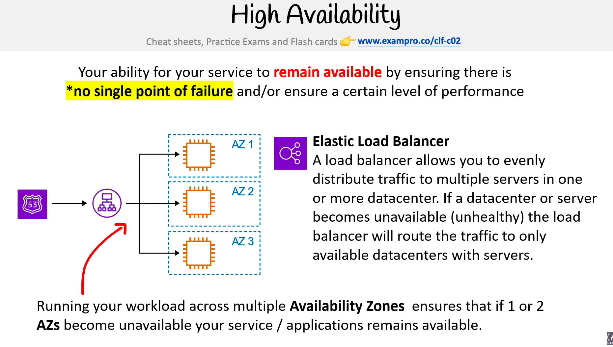
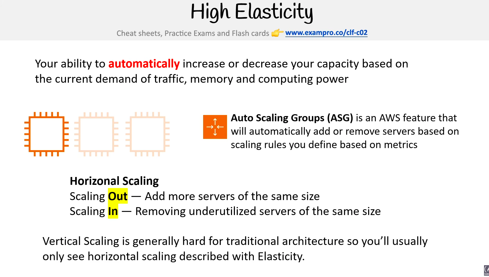
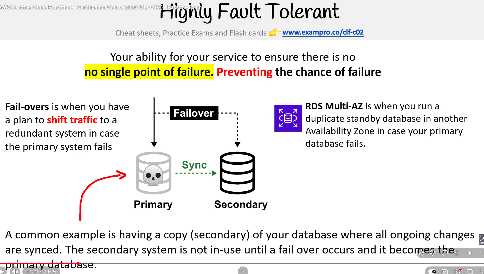
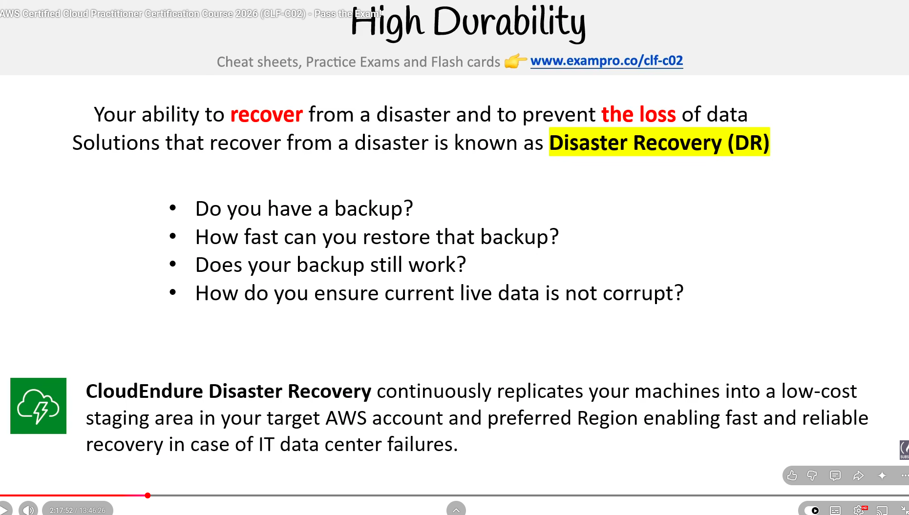
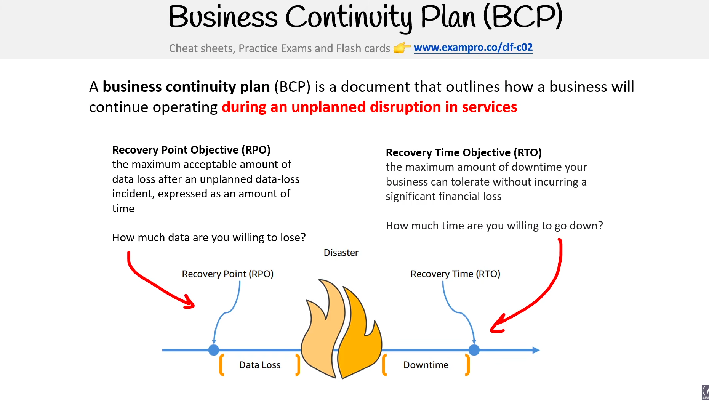
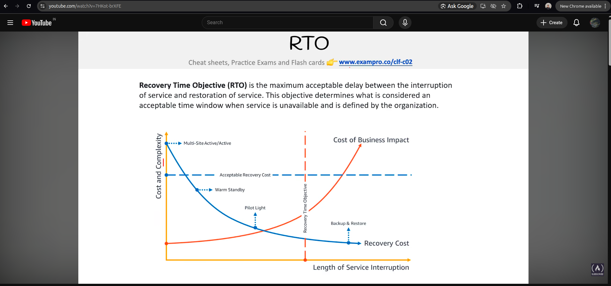

# Cloud Architecture

> **Exam:** AWS Certified Cloud Practitioner (CLF-C02)
> **Topic 2:** Cloud architecture concepts — High Availability, Fault Tolerance, Scalability, Elasticity, Disaster Recovery, Decoupling, and the Well-Architected Framework.

Cloud Architecture on the exam is mostly about **architectural qualities (the "-ilities")** — what makes a system stay up, perform under load, recover from disasters, and stay cost-efficient. These properties drive almost every multi-AZ / multi-Region / ELB / Auto Scaling question.

---

## 1. High Availability (HA)



### Definition
**High Availability** is your service's ability to **remain available** by ensuring there is **no single point of failure (SPOF)** and/or maintaining a **certain level of performance** even when components fail.

- It is usually measured as a **percentage of uptime** (e.g., 99.9% = "three nines," 99.99% = "four nines").
- "Available" means the service is **reachable and responding correctly** — not just powered on.

### The key idea: no single point of failure
A **Single Point of Failure (SPOF)** is any component whose failure brings the whole system down. HA design removes SPOFs by adding **redundancy** at every critical layer:

| Layer | SPOF example | HA fix |
|---|---|---|
| Server | One EC2 instance | Multiple EC2 instances behind a load balancer |
| Data center | One AZ | Deploy across multiple AZs |
| Database | Single DB node | Multi-AZ RDS / read replicas |
| Network entry | One IP / one NAT | Multiple ELBs, multi-AZ NAT Gateways |
| Region | One Region | Multi-Region active-active or active-passive |

### How AWS gives you HA: ELB + Multi-AZ

**Elastic Load Balancer (ELB)** — distributes incoming traffic across multiple servers, often in **multiple AZs**.
- If a **server** becomes unhealthy, ELB **stops sending traffic to it** and routes only to healthy ones.
- If a **whole AZ** goes down, ELB routes traffic to servers in the remaining healthy AZs.
- ELB itself is a **managed, highly-available** service — AWS runs redundant copies of it for you.

```
                    ┌──── AZ 1 ──── [EC2] [EC2]
User ──► ELB ──────┼──── AZ 2 ──── [EC2] [EC2]
                    └──── AZ 3 ──── [EC2] [EC2]
```

**Multi-AZ deployment** = the bread-and-butter pattern for HA on AWS:
> Running your workload across **multiple Availability Zones** ensures that if **1 or 2 AZs become unavailable**, your service / applications **remain available**.

### How HA differs from related concepts
| Concept | Question it answers |
|---|---|
| **High Availability** | "Is the service **up right now**?" → minimize downtime via redundancy. |
| **Fault Tolerance** | "Can the service **keep working with zero impact** during a failure?" → stronger than HA; usually requires N+1 or active-active. |
| **Scalability** | "Can the service **handle more load**?" → add capacity (vertical/horizontal). |
| **Elasticity** | "Does capacity **grow and shrink automatically** with demand?" → auto-scaling. |
| **Disaster Recovery** | "Can the service **recover from a major outage** (region loss, data loss)?" → backups, failover region, RPO/RTO targets. |

> **Mental model:** HA = *fewer / shorter outages*. Fault tolerance = *no visible impact*. DR = *coming back after a disaster*.

### Common AWS services that contribute to HA
- **Elastic Load Balancer (ELB)** — routes around unhealthy servers/AZs.
- **Auto Scaling Groups (ASG)** — automatically replaces failed instances and adds capacity.
- **Amazon RDS Multi-AZ** — synchronous standby in another AZ; automatic failover.
- **Amazon S3** — 99.99% availability by design; data replicated across multiple AZs.
- **Amazon Route 53** — DNS-level health checks + failover routing.
- **Amazon DynamoDB** — multi-AZ by default; **Global Tables** add multi-Region HA.

### Exam triggers
- "**No single point of failure**" → **High Availability**.
- "**Multiple Availability Zones**" / "survive an AZ outage" → **HA via Multi-AZ**.
- "Distribute traffic across servers and route around failures" → **Elastic Load Balancer**.
- "Service must keep responding even if a data center goes down" → **HA (Multi-AZ + ELB)**.
- "Measured in nines (99.9%, 99.99%)" → **Availability**.

### Common confusions to nail
1. **HA ≠ Fault Tolerance.** HA tolerates failures with **brief impact** (failover takes seconds). Fault tolerance tolerates failures with **no impact at all** (active-active redundancy). Fault tolerance is usually more expensive.
2. **HA ≠ Scalability.** A single server can be highly available (with a hot standby) but not scalable. A scalable system can still have SPOFs if not designed for HA.
3. **HA ≠ Disaster Recovery.** HA handles **everyday failures** (one server, one AZ). DR handles **catastrophic failures** (whole Region, data corruption).
4. **Multi-AZ is HA. Multi-Region is DR (or global HA).** Most exam questions about HA point to **Multi-AZ + ELB**, not Multi-Region.
5. **ELB is itself HA** — you don't need to "make the load balancer redundant"; AWS already does.

---

## 2. High Scalability

### Definition
**Scalability** is the ability of a system to **handle increased load** by **adding resources** — more servers, bigger servers, more capacity. It is about the **capability** to grow (and sometimes shrink), regardless of whether that change is manual or automatic.

> **Scalability ≠ Elasticity.** Scalability says *"I can grow if I need to."* Elasticity says *"I grow and shrink automatically as demand changes."*

### Two ways to scale

**1. Vertical Scaling — "scaling Up / Down"**
Make a **single server bigger or smaller** (more CPU, more RAM, faster disk).
- Example: change an EC2 instance from `t3.medium` → `m5.2xlarge`.
- Easy mentally, but has **hard limits** (you can't keep making one machine bigger forever) and usually requires **downtime / restart**.
- Common for **databases** and **legacy / monolithic apps** that don't run across multiple nodes.

**2. Horizontal Scaling — "scaling Out / In"** (the cloud-native default)
Add or remove **more servers of the same size**.
- **Scaling Out** = **add more servers** of the same size to handle more load.
- **Scaling In** = **remove** underutilized servers of the same size when load drops.
- Practically **no upper limit** (just keep adding instances behind a load balancer).
- Requires the app to be **stateless** / designed to run across multiple nodes.

```
Vertical (Up):    [small box] ──► [BIG box]              one node, bigger
Horizontal (Out): [box] ──►  [box][box][box][box]        many nodes, same size
```

> **Exam mnemonic:** **U**p/Down = same machine (**U**niform). **O**ut/In = more machines (**O**verflow into more boxes).

### Common confusions
- **Vertical scaling has a ceiling** — hardware limits, usually requires restart.
- **Horizontal scaling is what AWS optimizes for** — you'll almost always see "scaling out/in" tied to Auto Scaling Groups in exam questions.
- The image notes: *"Vertical Scaling is generally hard for traditional architecture, so you'll usually only see horizontal scaling described with Elasticity."*

### Exam triggers
- "Handle more load" / "growing user base" → **Scalability**.
- "Add more servers of the same size" → **Horizontal scaling (Scale Out)**.
- "Make the server bigger / more powerful" → **Vertical scaling (Scale Up)**.

---

## 3. High Elasticity



### Definition
**Elasticity** is your ability to **automatically increase or decrease your capacity** based on the **current demand** for traffic, memory, and computing power.

The keyword is **automatically**. A scalable system *can* be made bigger; an elastic system **makes itself bigger and smaller** as demand changes — and you only pay for what you actually use.

### The AWS service that delivers elasticity: Auto Scaling Groups (ASG)
**Auto Scaling Groups (ASG)** is the AWS feature that **automatically adds or removes EC2 instances** based on **scaling rules** you define against **metrics** (CPU utilization, request count, custom CloudWatch metrics, schedules, etc.).

A typical rule:
> *"If average CPU > 70% for 5 minutes, add 2 instances. If average CPU < 30% for 10 minutes, remove 1 instance. Stay between 2 and 20 instances."*

So during a traffic spike the ASG **scales out** automatically; when the spike passes it **scales in** automatically, saving cost.

### Horizontal scaling is the mechanism, elasticity is the behavior
Elasticity in AWS is almost always implemented via **horizontal scaling** (scaling out and in), because vertical scaling is hard to automate without downtime. So in exam wording:

> Elasticity = **Auto Scaling Group** + **horizontal scaling (Out/In)** + **CloudWatch metrics**.

### Other elastic AWS services (besides EC2 ASGs)
- **AWS Lambda** — inherently elastic; you don't manage capacity at all.
- **Amazon S3** — storage grows elastically; no provisioning.
- **DynamoDB On-Demand** — table capacity scales automatically with traffic.
- **Aurora Serverless** — database capacity scales up and down automatically.
- **Application Auto Scaling** — extends auto-scaling to ECS, DynamoDB, Aurora replicas, etc.

### Exam triggers
- "**Automatically** add or remove capacity based on demand" → **Elasticity**.
- "Scale **out** and scale **in** automatically" → **Auto Scaling Group**.
- "Match capacity to traffic spikes / pay only for what you use" → **Elasticity**.
- "Only buy capacity when you need it" → **Elasticity** (a cloud benefit).

---

## Scalability vs Elasticity — side-by-side

The two are closely related and the exam loves to test the difference. Easiest way to remember:

> **Scalability is the *capability* to handle growth. Elasticity is the *automation* of growing and shrinking with demand.**

| | **Scalability** | **Elasticity** |
|---|---|---|
| **What it answers** | "Can the system handle more load if needed?" | "Does the system automatically match demand right now?" |
| **Trigger** | Planned change (manual or scheduled) | Automatic, real-time, metric-driven |
| **Direction** | Usually **grows** (up or out) | Grows **and** shrinks (out **and** in) |
| **Time scale** | Minutes to days (often deliberate decisions) | Seconds to minutes (continuous) |
| **AWS examples** | Resizing an EC2, increasing RDS storage, adding more EC2s manually | Auto Scaling Groups, Lambda, DynamoDB On-Demand, Aurora Serverless |
| **Cost behavior** | You pay for the bigger/more capacity once added | You pay only while extra capacity exists (it goes away when demand drops) |
| **Keyword on exam** | "handle growth," "scale up," "scale out" | "**automatically**," "based on demand," "Auto Scaling" |

### Mental shortcut
- **Scalability** = *I have a bigger truck if I need it.*
- **Elasticity** = *Trucks magically appear and disappear as packages arrive.*

### Common confusions to nail
1. **All elastic systems are scalable, but not all scalable systems are elastic.** Elasticity requires automation.
2. **Vertical scaling alone is rarely elastic** — it usually needs a restart, so AWS elasticity uses horizontal scaling.
3. **"Scaling Up" vs "Scaling Out"** — Up = bigger server (vertical). Out = more servers (horizontal). Don't mix.
4. **Elasticity is a cost story too** — the ability to **scale in** (remove capacity) is what makes you save money, not just the ability to grow.
5. **ASG = Elasticity. ELB = Availability.** They're often used together, but each has a distinct purpose.

---

## 4. Fault Tolerance



### Definition
**Fault Tolerance** is your service's ability to **keep working even when a component fails**, by **ensuring no single point of failure** and **preventing the chance of failure** from being visible to users.

Where HA accepts a brief blip during failover, **fault tolerance aims for zero (or near-zero) user-visible impact** — the system rides through the failure because a redundant component is already running and ready.

### Failover — the core mechanism
A **failover** is a pre-planned mechanism to **shift traffic to a redundant system** the moment the primary system fails.

For failover to work cleanly you need:
1. A **standby/secondary** system already provisioned (not built on the fly).
2. **Data sync** between primary and secondary so the standby is up-to-date.
3. A **trigger** (health check) that detects failure.
4. A **traffic switch** (DNS, load balancer, or service-level) that redirects to the secondary.

```
            ┌─────────┐   sync   ┌──────────┐
 traffic ──►│ Primary │ ───────► │ Secondary│
            └─────────┘          └──────────┘
                 ✗ fails             ▲
                                     │
                  Failover ──────────┘   (traffic now goes here)
```

> A common example: a **secondary copy of your database** where all ongoing changes are continuously **synced** from the primary. The secondary is **not in use** until a failover occurs — at which point it becomes the new primary.

### Canonical AWS example: Amazon RDS Multi-AZ
**RDS Multi-AZ** = run a **duplicate standby database in another Availability Zone**, kept in **sync** with the primary.

- If the **primary DB or its entire AZ** fails, RDS **automatically fails over** to the standby (DNS endpoint stays the same — the app just reconnects).
- The standby is **passive** in normal operation (it does *not* serve read traffic — that's what read replicas are for).
- Designed to handle **infrastructure failures**: server, storage, network, or whole-AZ outages.

### Other fault-tolerant AWS patterns / services
- **Amazon S3** — stores objects across **multiple AZs** automatically; durability of 99.999999999% ("11 nines").
- **DynamoDB** — multi-AZ by default; **Global Tables** for multi-Region fault tolerance.
- **Elastic Load Balancer** — automatically routes around unhealthy targets and unhealthy AZs.
- **Auto Scaling Groups** — replace failed instances automatically (instance-level fault tolerance).
- **Route 53 health checks + failover routing** — DNS-level failover between Regions.
- **AWS Backup / cross-Region snapshots** — protect against data loss.

### Fault Tolerance vs High Availability — the exam trap
Both involve redundancy, so the exam frequently asks which one a scenario describes.

| | **High Availability (HA)** | **Fault Tolerance (FT)** |
|---|---|---|
| **Goal** | **Minimize** downtime | **Eliminate** user-visible downtime |
| **During a failure** | Brief blip (seconds — connection drops, retries) | Effectively **no impact** — traffic is already going elsewhere |
| **Redundancy style** | Standby that activates on failure | Often **active-active** (or instant, automated failover) |
| **Cost** | Cheaper | More expensive (more idle/duplicate capacity) |
| **Typical AWS example** | Multi-AZ EC2 behind ELB | RDS Multi-AZ failover, S3 (built-in), DynamoDB Global Tables |
| **Keyword** | "Stays available," "no SPOF" | "**No impact** during failure," "failover," "redundant standby" |

> **Rule of thumb:** if the scenario emphasises the user *not even noticing* the failure, the answer is **Fault Tolerance**. If it emphasises *the service being reachable*, it's **High Availability**.

### Exam triggers
- "**Failover**" / "switch to standby" → **Fault Tolerance**.
- "Duplicate standby database in another AZ" → **RDS Multi-AZ** → **Fault Tolerance**.
- "Continuously synced secondary system" → **Fault Tolerance**.
- "**Prevent** the chance of failure" / "no impact during failure" → **Fault Tolerance**.
- "Survive an AZ outage with **no downtime**" → **Fault Tolerance** (vs HA which would tolerate brief downtime).

### Common confusions
1. **HA tolerates failure, FT hides it.** HA = "we got it back up fast." FT = "you didn't even notice."
2. **RDS Multi-AZ is FAULT TOLERANCE, not read scaling.** The standby isn't readable — for read scaling use **Read Replicas**.
3. **A read replica is not the same as a failover standby.** Read replicas are for performance/scaling; standbys are for FT.
4. **Failover ≠ Backup.** Failover is real-time traffic switching; backup is restoring later from a snapshot.
5. **Fault tolerance is more expensive** — you're paying for capacity you mostly don't use, in exchange for zero-impact failure handling.

---

## 5. Durability, Business Continuity & Disaster Recovery





These three terms describe the same overall concern from different zoom levels: **what happens when something bad happens to your data or your service, and how do you get back?**

### How the vocabulary nests (broadest → narrowest)
| Term | Scope | What it deals with |
|---|---|---|
| **Business Continuity Plan (BCP)** | Whole business | A document covering how the company keeps running during disruption — people, suppliers, comms, alternate offices, **AND** IT systems. |
| **Disaster Recovery (DR)** | IT systems only | The IT subset of BCP — restoring systems and data after a disaster. |
| **Durability** | Data only | The probability that stored data will **not be lost** (e.g., S3's 11 nines). |
| **RPO & RTO** | Metrics | Two numbers the **BCP defines** that **DR design** must satisfy. |

> **One-sentence relationship:** *Durability* protects the data, *DR* gets the systems back online, and the *BCP* is the overarching plan that defines the targets — **RPO** and **RTO** — that both must meet.

```
            ┌──────── Business Continuity Plan (BCP) ────────┐
            │  people · suppliers · comms · alternate sites  │
            │                                                │
            │     ┌──── Disaster Recovery (DR) ────┐         │
            │     │  systems · backups · failover  │         │
            │     │                                │         │
            │     │      ┌──── Durability ────┐    │         │
            │     │      │  data not lost     │    │         │
            │     │      └────────────────────┘    │         │
            │     └────────────────────────────────┘         │
            │                                                │
            │   measured by → RPO (data loss) + RTO (time)   │
            └────────────────────────────────────────────────┘
```

---

### A. Durability — "is the data still there?"
**Durability** = your ability to **prevent the loss of data**. Usually expressed as a probability over a year, and AWS storage services advertise this number directly.

| Service | Durability | What it means |
|---|---|---|
| **Amazon S3 Standard** | **99.999999999%** ("**11 nines**") | Statistically, of 10,000,000 objects you'd expect to lose 1 every 10,000 years. |
| **Amazon S3 Glacier** | 11 nines | Same durability, cheaper, slower retrieval. |
| **Amazon EBS** | ~99.8–99.9% (single AZ); snapshots in S3 give 11 nines | A volume lives in one AZ; protect it with snapshots. |
| **DynamoDB** | Multi-AZ by default | Data replicated across 3 AZs. |

AWS achieves these numbers by **automatically replicating data across multiple devices and (for many services) multiple AZs**.

> **Durability ≠ Availability.** Durability = data is **not lost**. Availability = data is **reachable right now**. S3 can be 11-nines durable but a Region-wide outage can still make it temporarily unreachable.

---

### B. Business Continuity Plan (BCP) — the overarching document
A **BCP** is a **document** that outlines **how a business will continue operating during an unplanned disruption**.

It is **broader than IT**: it covers people, communications, suppliers, alternate sites, and the IT systems together. The IT/DR portion is what drives AWS architecture decisions — and the two BCP numbers that flow into DR design are **RPO** and **RTO**.

#### RPO — Recovery Point Objective
**Maximum acceptable amount of data loss**, expressed as an amount of time.

> **"How much data are you willing to lose?"**

- Measured **backwards** from the disaster to the last good backup/replica.
- Drives **how often you back up or replicate**. RPO = 1 h → back up at least hourly.
- **Low RPO (seconds/minutes)** → continuous replication (RDS Multi-AZ, AWS DRS, Aurora Global Database).
- **High RPO (hours/days)** → nightly snapshots are enough → cheaper.

#### RTO — Recovery Time Objective
**Maximum acceptable downtime** before the business takes a significant financial hit.

> **"How long can you afford to be down?"**

- Measured **forwards** from the disaster to when the service is back online.
- Drives **how "warm" your standby has to be**.
- **Low RTO (seconds/minutes)** → Warm Standby or Multi-Region Active-Active (expensive).
- **High RTO (hours)** → Backup & Restore or Pilot Light (cheaper).

#### The RPO/RTO timeline (from the BCP image)
```
                       ◀── Data Loss window ──▶  💥  ◀── Downtime window ──▶
    ───────────────────●─────────────────────── 🔥 ────────────────────●─────►  time
                       │                       Disaster                │
                  Recovery Point                                  Recovery Time
                     (RPO)                                            (RTO)
                "max acceptable                              "max acceptable
                  data loss"                                    downtime"
```

- **Left of the disaster** = **RPO** = data you may lose (everything written since the last replica/backup).
- **Right of the disaster** = **RTO** = how long users wait before the service is back.

---

### C. Disaster Recovery (DR) — the IT implementation of the BCP
**DR** is the IT-systems subset of the BCP. It's where the BCP's RPO/RTO targets meet actual AWS architecture choices.

#### Four DR-readiness questions (from the Durability image)
1. **Do you have a backup?**
2. **How fast can you restore that backup?** → measured against **RTO**.
3. **Does your backup still work?** → an untested backup isn't a backup.
4. **How do you ensure current live data is not corrupt?** → affects effective **RPO**.

#### DR strategies — picked to fit the BCP's RPO/RTO
In increasing cost and speed of recovery:

| Strategy | What it looks like | Fits when... |
|---|---|---|
| **Backup & Restore** | Snapshots/backups; restore in another Region after disaster. | RPO ≈ 24 h, RTO ≈ hours. Cheapest. |
| **Pilot Light** | Core systems (DB) replicated and idle in DR Region; spin up the rest on failure. | RPO ≈ minutes, RTO ≈ tens of minutes. |
| **Warm Standby** | Smaller-but-running copy of the workload in DR Region; scale up on failover. | RPO ≈ seconds, RTO ≈ minutes. |
| **Multi-Region Active-Active** | Full production capacity in two+ Regions at once. | RPO ≈ 0, RTO ≈ 0. Most expensive. |
| **Within-Region durability/HA** | **RDS Multi-AZ**, **DynamoDB**, **S3** | RPO ≈ 0 inside a single Region. |

#### The RTO cost trade-off (from the RTO image)



> **Recovery Time Objective (RTO)** is the **maximum acceptable delay between the interruption of service and the restoration of service**. It defines the acceptable time window during which the service can be unavailable — and it is **decided by the organization**, not by AWS.

The image plots **two opposing costs** against the **Length of Service Interruption** (x-axis) and **Cost and Complexity** (y-axis):

| Curve | Direction | Why |
|---|---|---|
| **Cost of Business Impact** | **Rises** as the interruption gets **longer** | The longer you're down, the more revenue / trust / SLA penalties you lose. |
| **Recovery Cost** | **Rises** as you demand a **shorter** interruption | Faster recovery needs warmer, more duplicated, always-on infrastructure — which costs and complicates more. |

The **sweet spot** is where the two curves cross — the **Acceptable Recovery Time** (your RTO). Spend less than that and business-impact losses dominate; spend more and you're over-paying for recovery speed you don't need.

The **DR strategies sit along the recovery-cost curve**, from fastest+priciest (top-left) to slowest+cheapest (bottom-right):

| Strategy | Length of interruption | Cost & complexity |
|---|---|---|
| **Multi-Site Active/Active** | Shortest (≈ 0) | Highest |
| **Warm Standby** | Short | High |
| **Pilot Light** | Medium | Medium |
| **Backup & Restore** | Longest | Lowest |

```
 Cost &        \                                          ● Cost of Business Impact
 Complexity     \  ● Multi-Site Active/Active            ╱
                 \                                      ╱
                  \   ● Warm Standby                   ╱
                   \                                  ╱
   Recovery Cost    \────●─ Pilot Light ────────────╱
                     \   :              ● Backup & Restore
                      \  :         ____________________
                          Acceptable Recovery Time (RTO)
                ───────────────────────────────────────────►
                      Length of Service Interruption
```

> **Mental model:** picking a DR strategy = finding where **"too slow" stops being cheap** and **"too fast" starts being wasteful**. The RTO your business sets tells you which strategy to buy.

#### AWS DR service: AWS Elastic Disaster Recovery (formerly CloudEndure DR)
**CloudEndure Disaster Recovery** — now rebranded as **AWS Elastic Disaster Recovery (AWS DRS)** — **continuously replicates your machines** into a **low-cost staging area** in your **target AWS account and preferred Region**, enabling **fast and reliable recovery** from data center failures.

Key properties:
- **Continuous replication** (not periodic snapshots) → low RPO.
- **Low-cost staging** → you don't pay for full-size instances until you actually fail over.
- **Cross-Region / cross-account** recovery — can use a different Region as your DR site.
- Works for **on-prem servers → AWS** (DR + migration) and **AWS → AWS** (cross-Region DR).

> **Naming note for the exam:** AWS rebranded **CloudEndure DR → AWS Elastic Disaster Recovery (AWS DRS)**. Both names appear in CLF-C02 study material — they refer to the same service.

---

### Exam triggers (combined quick reference)
| Trigger phrase | Answer |
|---|---|
| "Continue operating **during a disruption**" / "plan for the business" | **BCP** |
| "**Recover from a disaster**" / "data center failure" | **Disaster Recovery** |
| "**Prevent the loss of data**" / "11 nines" | **Durability** (S3) |
| "How much **data** can we afford to **lose**?" / "maximum acceptable data loss" | **RPO** |
| "How much **downtime** can the business tolerate?" / "maximum acceptable downtime" | **RTO** |
| "Continuously replicate machines to AWS for recovery" | **AWS Elastic Disaster Recovery (CloudEndure DR)** |
| "Low-cost staging until failover" | **AWS Elastic Disaster Recovery** |
| "Synchronous replication, RPO of 0" within a Region | **RDS Multi-AZ** / **DynamoDB** / **S3** |

### Common confusions (consolidated)
1. **BCP ⊃ DR ⊃ data-recovery tooling.** BCP covers people + processes + IT; DR is just the IT piece; durability is just the data piece.
2. **Durability ≠ Availability.** Durability = data isn't lost. Availability = data is reachable.
3. **Fault Tolerance ≠ DR.** FT handles **everyday failures with zero impact**. DR handles **catastrophic events** (Region loss, ransomware, accidental deletion) that even FT can't ride through.
4. **Multi-AZ vs Multi-Region.** Multi-AZ → HA / FT. Multi-Region → DR.
5. **RPO is about data, RTO is about time.** Both are *measured in time*, but RPO = how far back in time your data jumps; RTO = how long until you're back.
6. **Lower RPO/RTO = more expensive.** You pay for replication frequency and idle standby capacity.
7. **RPO of 0** requires **synchronous replication** — every write must be in two places before it's acknowledged.
8. **A backup is not a DR plan** — you also need a **tested restore procedure** and **known RTO/RPO targets**.
9. **CloudEndure DR = AWS Elastic Disaster Recovery (AWS DRS)** — same service, different name.

---

## 6. Decoupling

### Definition
**Decoupling** is designing a system so its components **don't depend directly on one another**. Instead of Component A calling Component B straight away, they communicate **through an intermediary** (a queue or a topic). That way a failure, slowdown, or traffic spike in one component **doesn't cascade** into the others.

> **Tightly coupled** = A talks **directly** to B; if B is down or slow, A breaks/waits. **Loosely coupled (decoupled)** = A drops a message in the middle; B picks it up when ready. A doesn't care if B is healthy *right now*.

```
Tightly coupled:   [Producer] ───────────► [Consumer]      ✗ if consumer dies, producer fails
Loosely coupled:   [Producer] ──► [Queue/Topic] ──► [Consumer]   ✓ buffer absorbs failure & load
```

### Why decoupling matters (the exam angle)
- **Fault tolerance** — if the consumer dies, messages **wait safely** in the queue instead of being lost.
- **Scalability / elasticity** — the queue **absorbs traffic spikes**; you scale consumers independently (often with an **Auto Scaling Group** driven by queue depth).
- **Independent components** — you can update, restart, or scale one side without touching the other.

### The AWS services that deliver decoupling

| Service | Pattern | One-liner | Keyword |
|---|---|---|---|
| **Amazon SQS** (Simple Queue Service) | **Queue** — *pull* | A message **queue**; a consumer **polls/pulls** messages and processes them one at a time. Messages persist until processed. | "queue," "decouple," "poll," "buffer," "process later" |
| **Amazon SNS** (Simple Notification Service) | **Pub/Sub** — *push* | A **topic** that **pushes** each message to **many subscribers at once** (fan-out) — email, SMS, Lambda, SQS queues. | "pub/sub," "fan-out," "notify many," "push to subscribers" |
| **Amazon EventBridge** | Event bus | Routes **events** between AWS services / SaaS apps using **rules** — event-driven decoupling. | "event bus," "event-driven," "route events by rule" |
| **Amazon Kinesis** | Streaming | Decouples **real-time streaming data** producers from consumers (analytics, logs, clickstreams). | "real-time streaming," "ingest data stream" |

> **SQS vs SNS — the classic exam trap:** **SQS = one queue, pulled by a consumer (one-to-one, process later).** **SNS = one topic, pushed to many subscribers at once (one-to-many, notify now).** A very common pattern is **SNS → multiple SQS queues** ("fan-out"): one event lands in several queues, each processed independently.

### Exam triggers
- "**Decouple** components / loosely coupled architecture" → **SQS** (or **SNS**).
- "**Queue** of messages processed later / buffer requests / poll for work" → **SQS**.
- "**Notify many** subscribers / send to email + SMS + Lambda at once / **fan-out**" → **SNS**.
- "Absorb a **traffic spike** so the backend isn't overwhelmed" → **SQS** (queue as a buffer).
- "**Event-driven**, route events between services by rule" → **EventBridge**.

### Common confusions to nail
1. **SQS pulls, SNS pushes.** Consumers **poll** SQS; SNS **pushes** to subscribers. Direction is the giveaway.
2. **SQS = one-to-one; SNS = one-to-many.** A queue is drained by consumers; a topic broadcasts to all subscribers.
3. **Decoupling improves both FT and scalability** — the queue both **survives** consumer failure and **absorbs** load spikes.
4. **SNS + SQS together = fan-out** — don't treat them as either/or; they're frequently combined.

---

## 7. AWS Well-Architected Framework

### Definition
The **AWS Well-Architected Framework** is a set of **best practices and guiding principles** AWS publishes to help you design and run **secure, reliable, efficient, cost-effective, and sustainable** workloads in the cloud. It's organised into **6 Pillars** — and the exam expects you to **match a scenario to the right pillar**.

### The 6 Pillars

| # | Pillar | What it's about | Keyword on the exam |
|---|---|---|---|
| 1 | **Operational Excellence** | **Run and monitor** systems; automate changes; improve processes (IaC, CloudWatch, runbooks). | "monitor / automate operations," "make small reversible changes" |
| 2 | **Security** | Protect data & systems — IAM, least privilege, encryption, traceability. | "protect data," "least privilege," "encryption," "IAM" |
| 3 | **Reliability** | **Recover from failure**, scale to meet demand, avoid disruption (Multi-AZ, backups, Auto Scaling). | "recover from failure," "high availability," "resilient" |
| 4 | **Performance Efficiency** | Use resources **efficiently**; pick the right instance/service; scale as demand changes. | "use resources efficiently," "right service for the job" |
| 5 | **Cost Optimization** | Avoid unnecessary spend — right-size, use the right pricing model, stop paying for idle. | "reduce cost," "avoid waste," "right-size," "pay for what you use" |
| 6 | **Sustainability** | Minimize the **environmental impact** of running cloud workloads (energy, efficient resource use). | "environmental impact," "reduce carbon / energy," "sustainable" |

> **Memory hook (6 pillars):** **"O-S-R-P-C-S"** → **Operational excellence, Security, Reliability, Performance efficiency, Cost optimization, Sustainability.** Sustainability was the **6th pillar added later** (2021) — a favourite "newest pillar" exam detail.

### The AWS Well-Architected Tool
> **AWS Well-Architected Tool** is a **free service in the console** that lets you **review your workloads against the 6 pillars**, identifies high-risk issues, and gives improvement recommendations. ("Which tool reviews a workload against best practices?" → **Well-Architected Tool**.)

### A few design principles worth recognising
- **Stop guessing capacity** — scale automatically (elasticity) instead of over-provisioning.
- **Make changes small and reversible**, and automate them (IaC).
- **Test at production scale**, then tear it down — cheap in the cloud.
- **Design for failure** — assume components will fail and architect around it.

### Exam triggers
- "Set of **best practices** for designing on AWS" / "**pillars**" → **Well-Architected Framework**.
- "Scenario about **reducing cost / right-sizing**" → **Cost Optimization** pillar.
- "Scenario about **recovering from failure / staying available**" → **Reliability** pillar.
- "Scenario about **monitoring & automating operations**" → **Operational Excellence** pillar.
- "Scenario about **environmental / carbon impact**" → **Sustainability** pillar (the newest).
- "**Tool** to review a workload against best practices" → **AWS Well-Architected Tool**.

### Common confusions to nail
1. **There are 6 pillars, not 5.** **Sustainability** is the most recent — easy to forget.
2. **Reliability vs Performance Efficiency.** Reliability = *recover & stay up*; Performance Efficiency = *use the right resources efficiently*. Don't swap them.
3. **Operational Excellence vs Reliability.** Operational Excellence = *running/monitoring/automating*; Reliability = *surviving failure & scaling*.
4. **The Framework ≠ the Tool.** The **Framework** is the best-practice guidance; the **Well-Architected Tool** is the console service that reviews you against it.

---

## Quick Revision Cheat Sheet (running)

| Concept | One-line definition | Keyword on the exam |
|---|---|---|
| **High Availability** | Service stays up via redundancy; no single point of failure | "No SPOF", "multi-AZ", "ELB", "stays available" |
| **Scalability** | Capability to handle more load by adding resources | "Scale up/down" (vertical), "scale out/in" (horizontal) |
| **Elasticity** | Capacity **automatically** grows and shrinks with demand | "Automatically," "Auto Scaling Group," "based on demand" |
| **Fault Tolerance** | Service keeps working with **no user impact** during a failure | "Failover," "RDS Multi-AZ," "synced standby," "no impact" |
| **Durability** | Data is not lost (e.g., S3 = 11 nines) | "11 nines," "prevent loss of data" |
| **Disaster Recovery (DR)** | IT recovery from a major event | "Recover," "CloudEndure / AWS DRS," "Pilot Light / Warm Standby" |
| **BCP** | Business-wide plan covering DR + people + suppliers | "Continue operating during a disruption" |
| **RPO / RTO** | Targets the BCP sets for DR design | "RPO = data loss tolerance," "RTO = downtime tolerance" |
| **Decoupling** | Components talk via a queue/topic, not directly | "loosely coupled," "buffer," "absorb spikes" |
| **SQS** | Message **queue**, consumer **pulls** (one-to-one) | "queue," "poll," "process later" |
| **SNS** | **Pub/sub** topic, **pushes** to many (one-to-many) | "fan-out," "notify many," "push" |
| **Well-Architected Framework** | 6 pillars of best-practice design | "pillars," "best practices" |
| **6 Pillars** | Operational Excellence, Security, Reliability, Performance Efficiency, Cost Optimization, Sustainability | "O-S-R-P-C-S," "Sustainability = newest" |
| **Well-Architected Tool** | Free console tool that reviews a workload vs the pillars | "review workload against best practices" |
