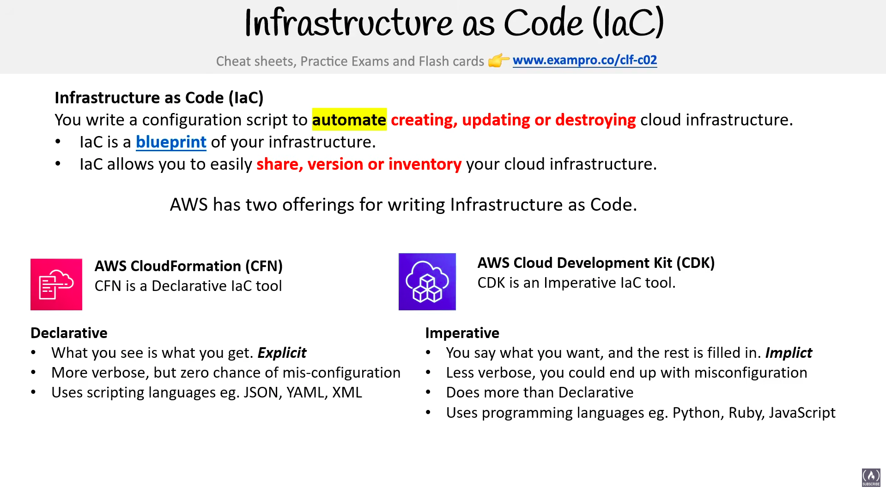
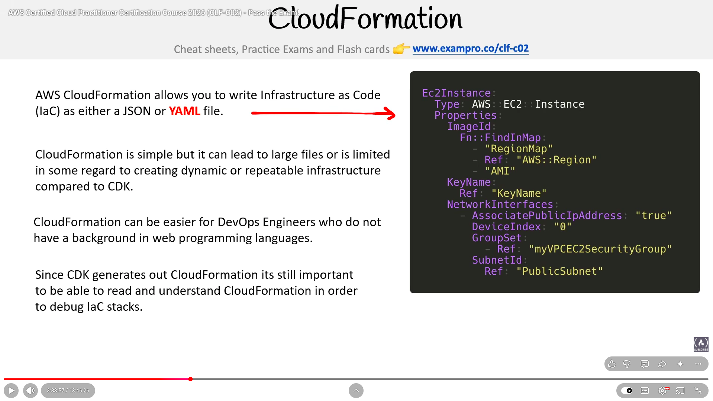
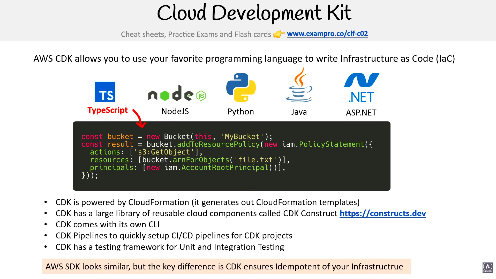

# Management and Development Tools

> **Exam:** AWS Certified Cloud Practitioner (CLF-C02)
> **Topic 3:** Management and development tooling — starting with how AWS *names and addresses* every resource (ARNs), then the tools used to build, deploy, and manage workloads.

Before you can manage or automate anything in AWS, you need a way to **uniquely identify the exact resource** you mean — across every account, Region, and service. That identifier is the **ARN**. Almost every IAM policy, CLI command, and automation script ultimately points at an ARN, so it's the right place to start this topic.

---

## 1. ARNs in AWS (Amazon Resource Names)

An **Amazon Resource Name (ARN)** is a **globally unique identifier** for an AWS resource. Every resource you create — an S3 bucket, an EC2 instance, an IAM user, a Lambda function, a DynamoDB table — has an ARN, and **no two resources ever share one**.

Think of an ARN as the **full postal address** of a resource: it tells AWS *which partition, which service, which Region, which account,* and *which specific resource* you mean — with zero ambiguity.

### Why ARNs exist (the problem they solve)
- Resource names alone are **not unique** — two different accounts can both have a bucket logically called "logs," two Regions can both have a security group named "web."
- IAM, automation, and cross-account access need to point at **one exact resource** and nothing else.
- ARNs give that **one unambiguous handle** that works the same way across all AWS services.

### ARN structure (the format you must recognize)
ARNs follow one consistent template. The exam expects you to recognize the parts, not memorize every service's variations.

```
arn:partition:service:region:account-id:resource-id
arn:partition:service:region:account-id:resource-type/resource-id
arn:partition:service:region:account-id:resource-type:resource-id
```

| Field | Meaning | Example values |
|---|---|---|
| `arn` | Literal prefix — every ARN starts with it | `arn` |
| `partition` | The group of Regions the resource is in | `aws` (standard), `aws-cn` (China), `aws-us-gov` (GovCloud) |
| `service` | The AWS service namespace | `s3`, `ec2`, `iam`, `lambda`, `dynamodb` |
| `region` | The Region code | `ap-south-1`, `us-east-1` (**blank** for global services) |
| `account-id` | The 12-digit AWS account ID that owns it | `123456789012` (**blank** for some services like S3) |
| `resource-id` / `resource-type` | Identifies the specific resource (and its type) | `my-bucket`, `instance/i-0abc123`, `user/Harsh` |

The separator between the last fields can be a **colon (`:`)** or a **slash (`/`)** — this varies **by service**, and AWS decides which. You don't choose it.

### Worked examples (read each field left-to-right)

**S3 bucket** — S3 is global, so Region and account are blank:
```
arn:aws:s3:::my-app-logs
        │ │└─ region (empty)
        │ └── account (empty)
        └──── service = s3
```

**S3 object** (a file inside the bucket):
```
arn:aws:s3:::my-app-logs/reports/2026/may.csv
```

**IAM user** — IAM is global (no Region), but **does** have an account ID:
```
arn:aws:iam::123456789012:user/Harsh
```

**EC2 instance** — fully Regional and account-scoped:
```
arn:aws:ec2:ap-south-1:123456789012:instance/i-0abc123def456
```

**Lambda function:**
```
arn:aws:lambda:us-east-1:123456789012:function:processOrders
```

> **Note:** **Global services** (IAM, S3, Route 53, CloudFront) leave the **Region field empty**. S3 additionally leaves the **account field empty** because bucket names are already globally unique. This is a classic "spot the difference" exam detail.

### Wildcards in ARNs (the IAM connection)
Inside **IAM policies** you can use `*` (any number of characters) and `?` (single character) in an ARN to match **many resources at once**:

```
arn:aws:s3:::my-app-logs/*          → every object in the bucket
arn:aws:ec2:ap-south-1:123456789012:instance/*   → every EC2 instance in that Region/account
arn:aws:s3:::*                       → every bucket (use with care!)
```

This is how a single IAM statement can grant access to a whole group of resources instead of listing each ARN.

### Where you actually see/use ARNs
- **IAM policies** — the `Resource` field of almost every policy statement is an ARN (or an ARN with wildcards).
- **Resource-based policies** — S3 bucket policies, SQS/SNS access policies, etc., reference principals and resources by ARN.
- **CLI / SDK / CloudFormation** — many commands and templates require an ARN to reference an existing resource.
- **Cross-account access** — you grant another account access by naming its ARN.
- **Service integrations** — e.g., a CloudWatch alarm pointing at an SNS topic ARN, or an event rule targeting a Lambda ARN.

### Mental model
```
arn : aws : ec2 : ap-south-1 : 123456789012 : instance/i-0abc123
 │     │     │        │             │              │
 │     │     │        │             │              └─ which exact resource
 │     │     │        │             └──────────────── whose account
 │     │     │        └────────────────────────────── which Region
 │     │     └─────────────────────────────────────── which service
 │     └───────────────────────────────────────────── which partition
 └─────────────────────────────────────────────────── it's an ARN
```

### Exam triggers
- "**Uniquely identify** an AWS resource" / "globally unique identifier for a resource" → **ARN**.
- "Specify the **resource** an IAM policy applies to" → an **ARN** in the policy's `Resource` field.
- "Grant access to **all objects** in a bucket / all instances in a Region" → **ARN with a `*` wildcard**.
- An identifier starting with `arn:aws:...` in a question → it's an **ARN**; read the fields to spot service/Region/account.

### Common confusions to nail
1. **Region & account fields can be empty.** Global services (IAM, S3, Route 53, CloudFront) omit Region; S3 also omits the account ID.
2. **The separator (`:` vs `/`) is service-defined** — don't assume one or the other.
3. **An ARN names a *resource*; an IAM ARN can also name a *principal*** (user/role) — same format, different use (who vs what).
4. **Resource name ≠ ARN.** A bucket "named" logs is not unique; its **ARN** is.

---

## 2. Infrastructure as Code (IaC)



**Infrastructure as Code (IaC)** is using a **configuration script** to **automate the creating, updating, or destroying** of cloud infrastructure — instead of clicking through the console by hand.

Think of IaC as a **blueprint** of your infrastructure: a text file that describes exactly what resources should exist. Because it's just code/config, you can easily **share, version (track in Git), and inventory** your cloud infrastructure.

### Why IaC matters
- **Repeatable** — spin up an identical environment (dev, staging, prod) from the same file.
- **Versioned** — store the blueprint in source control; see who changed what and roll back.
- **Auditable / shareable** — the file *is* the documentation of what's deployed.
- **Less human error** — no forgotten click or mis-typed setting when re-creating resources.

### AWS has two offerings for writing IaC

| | **AWS CloudFormation (CFN)** | **AWS Cloud Development Kit (CDK)** |
|---|---|---|
| **Style** | **Declarative** IaC tool | **Imperative** IaC tool |
| **Idea** | "What you see is what you get" — **explicit** | "Say what you want, the rest is filled in" — **implicit** |
| **Written in** | Scripting/markup: **JSON, YAML, XML** | Programming languages: **Python, Ruby, JavaScript** (etc.) |
| **Trade-offs** | More verbose, but **less chance of mis-configuration** | Less verbose, but **can end up with mis-configuration**; **does more than declarative** |

### Declarative vs Imperative (the key distinction)
- **Declarative (CloudFormation)** — you spell out **every** resource and setting explicitly. What you write is exactly what you get. More typing, fewer surprises.
- **Imperative (CDK)** — you write code that *generates* the infrastructure; sensible defaults are filled in for you. Less code, but the auto-filled parts can hide mis-configurations. CDK actually **synthesizes down into a CloudFormation template** under the hood.

### CloudFormation — a closer look



**AWS CloudFormation** lets you write Infrastructure as Code as either a **JSON** or **YAML** file (a *template*). The template lists the resources you want and their properties, and CloudFormation provisions them for you.

- **Simple, but verbose** — CloudFormation is easy to get started with, but templates can grow into **large files** and are **limited when it comes to dynamic or repeatable infrastructure** (compared to CDK).
- **Beginner-friendly for DevOps** — it can be **easier for DevOps engineers who don't have a programming background**, since you're writing config (JSON/YAML), not code.
- **Still foundational** — even though **CDK generates CloudFormation under the hood**, it's still important to be able to **read and understand CloudFormation** in order to **debug IaC stacks**.

**Anatomy of a template** — resources are declared with a **Type** (e.g. `AWS::EC2::Instance`) and a block of **Properties**:
```yaml
Ec2Instance:
  Type: AWS::EC2::Instance
  Properties:
    ImageId:
      Fn::FindInMap:
        - RegionMap
        - Ref: "AWS::Region"
        - AMI
    KeyName:
      Ref: KeyName
    NetworkInterfaces:
      - AssociatePublicIpAddress: "true"
        DeviceIndex: "0"
        GroupSet:
          - Ref: myVPCEC2SecurityGroup
        SubnetId:
          Ref: PublicSubnet
```
> The `Ref` and `Fn::FindInMap` entries are **intrinsic functions** — they let one resource reference another value (a parameter, a Region, another resource) instead of hard-coding it.

### CDK — a closer look



The **AWS Cloud Development Kit (CDK)** lets you use your **favorite programming language** to write Infrastructure as Code — **TypeScript, Node.js, Python, Java, and .NET (C#)**. Instead of a JSON/YAML template, you define resources as objects in real code:
```typescript
const bucket = new Bucket(this, 'MyBucket');
const result = bucket.addToResourcePolicy(new iam.PolicyStatement({
  actions: ['s3:GetObject'],
  resources: [bucket.arnForObjects('file.txt')],
  principals: [new iam.AccountRootPrincipal()],
}));
```

**Key facts:**
- **Powered by CloudFormation** — CDK **generates CloudFormation templates** under the hood (which is why reading CFN still matters for debugging).
- **Constructs** — CDK ships a large library of **reusable cloud components called CDK Constructs** (see **https://constructs.dev**), so you assemble infrastructure from building blocks instead of writing everything from scratch.
- **Own CLI** — CDK comes with its **own command-line tool** to synthesize and deploy.
- **Pipelines** — makes it quick to **set up CI/CD pipelines** for CDK projects.
- **Testing** — has a **testing framework for unit and integration testing** of your infrastructure.

> **The key difference from the plain AWS SDK:** they look similar, but **CDK ensures your infrastructure is *idempotent*** — running it repeatedly converges to the same desired state rather than creating duplicate resources.

### Exam triggers
- "**Automate** the creation/provisioning of infrastructure" / "**Infrastructure as Code**" → **CloudFormation** (or **CDK**).
- "**Declarative**, written in **JSON/YAML**" → **CloudFormation**.
- "Define infrastructure using a **programming language** (Python, etc.)" / "**imperative**" → **CDK**.
- "**Repeatable**, version-controlled, shareable environments" → **IaC**.

---

## 3. Management & Monitoring Tools (overview)

> **Scope note:** These services are introduced **briefly** here. Several (especially **CloudWatch**, **CloudTrail**, and **Config**) are large enough that they'll likely get their **own dedicated topic** later — but you need to recognise each one and, above all, **tell them apart** on the exam.

These are the core tools for **observing, auditing, and managing** what's running in your account.

### Amazon CloudWatch — *monitoring & metrics*
The **monitoring** service. Collects **metrics** (CPU, memory, request counts), **logs**, sets **alarms**, and triggers actions (e.g. notify via SNS, scale an ASG).
- Think: **"How is my system performing *right now*?"** — performance, dashboards, alarms.
- Drives **Auto Scaling** decisions and **operational dashboards**.

### AWS CloudTrail — *API audit log*
Records **who did what, when** — every **API call / action** taken in your account (via console, CLI, or SDK).
- Think: **"Who deleted that S3 bucket, and when?"** — auditing, governance, security forensics.
- Answers **accountability** questions; logs can be stored in S3 for long-term retention.

### AWS Config — *resource configuration & compliance*
Tracks the **configuration** of your resources **over time** and checks them against **rules** ("policy as code").
- Think: **"Is this resource configured correctly, and how has its config *changed*?"** — compliance, drift detection, config history.
- (Already met in Topic 1 for data-residency rules.)

### AWS Trusted Advisor — *best-practice checks*
Scans your account and gives **recommendations** across **5 categories**: **Cost Optimization, Performance, Security, Fault Tolerance, Service Limits**.
- Think: **"What should I improve?"** — automated best-practice advisor (deeper checks need Business/Enterprise Support).

### AWS Health Dashboard — *service & account health*
Shows the **health of AWS services** and **personalized alerts** about events affecting **your** resources (e.g. scheduled maintenance, outages).
- Think: **"Is the problem AWS's side or mine?"**

### AWS Systems Manager (SSM) — *operational management at scale*
Manage and automate tasks across fleets of EC2/on-prem servers — **patching**, running commands, and securely storing config/secrets (**Parameter Store**).
- Think: **"Operate many servers from one place."**

### The distinction the exam loves: CloudWatch vs CloudTrail vs Config

| Service | Question it answers | Keyword |
|---|---|---|
| **CloudWatch** | "How is it **performing**?" (metrics, logs, alarms) | **performance / monitoring** |
| **CloudTrail** | "**Who did** what, when?" (API call history) | **audit / who did it** |
| **Config** | "How is it **configured**, and what **changed**?" | **configuration / compliance** |

> **Mnemonic:** CloudWat**ch** = **performance**; CloudTra**il** = **a trail of who did what** (audit); Con**fig** = **con**figuration. Mixing these three up is one of the most common CLF-C02 mistakes.

### Exam triggers
- "**Monitor** performance / set an **alarm** / metrics & dashboards" → **CloudWatch**.
- "**Who** made this API call / **audit** account activity / governance" → **CloudTrail**.
- "Track **configuration changes** / check resources **comply** with rules" → **AWS Config**.
- "Get **recommendations** on cost, security, performance, fault tolerance, limits" → **Trusted Advisor**.
- "Is **AWS itself** having an issue / events affecting my resources" → **AWS Health Dashboard**.
- "**Patch** or run commands across many servers / store parameters" → **Systems Manager**.

---

## Quick Revision Cheat Sheet

| Concept | One-line purpose | Keyword |
|---|---|---|
| **ARN** | Globally unique address of any AWS resource | "uniquely identify a resource," `arn:aws:...` |
| **Partition** | Region group (`aws`, `aws-cn`, `aws-us-gov`) | China / GovCloud isolation |
| **Empty Region/account** | Marks a **global** service (IAM, S3, Route 53, CloudFront) | "global service" |
| **ARN wildcard `*`** | Match many resources in one IAM statement | "all objects / all instances" |
| **IaC** | Config script to automate create/update/destroy of infrastructure | "Infrastructure as Code," "automate," "repeatable" |
| **CloudFormation (CFN)** | **Declarative** IaC — explicit, JSON/YAML/XML | "declarative," "JSON/YAML template" |
| **CDK** | **Imperative** IaC — programming languages (Python, etc.) | "imperative," "use a programming language" |
| **CloudWatch** | Monitoring — metrics, logs, alarms, dashboards | "performance," "monitor," "alarm" |
| **CloudTrail** | Audit log of every API call (who did what, when) | "audit," "who did it," "API history" |
| **AWS Config** | Tracks resource configuration & compliance over time | "configuration," "compliance," "what changed" |
| **Trusted Advisor** | Best-practice recommendations (5 categories) | "recommendations," "cost/security/performance/FT/limits" |
| **AWS Health Dashboard** | Health of AWS services + alerts for your resources | "is AWS down?", "service health" |
| **Systems Manager** | Operate/patch many servers; Parameter Store | "patch fleet," "run command," "parameters" |

### Top exam points to remember
1. ARN = the **one unambiguous handle** for a resource across every account, Region, and service.
2. Format: `arn:partition:service:region:account-id:resource`.
3. **Global services leave the Region blank**; **S3 leaves Region *and* account blank**.
4. ARNs power the `Resource` field of **IAM policies** — with `*` to match groups of resources.
5. **IaC** automates infrastructure via a versioned, shareable script — **CloudFormation = declarative (JSON/YAML)**, **CDK = imperative (programming languages)**.
6. **Don't confuse the three observability tools:** **CloudWatch = performance/monitoring**, **CloudTrail = audit (who did what)**, **Config = configuration/compliance**.
