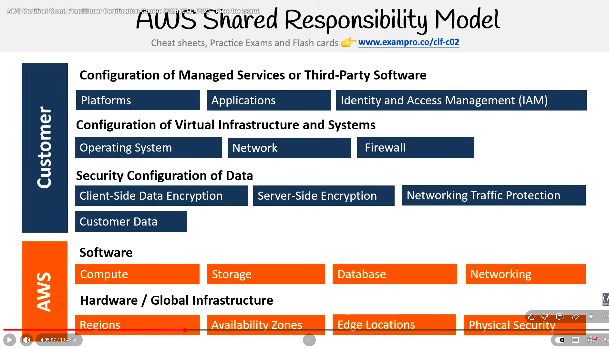

# Shared Responsibility Model

> **Exam:** AWS Certified Cloud Practitioner (CLF-C02)
> **Topic 4:** The **AWS Shared Responsibility Model** — the single most important security concept on the exam. It defines the **dividing line** between what *AWS* secures and what *you, the customer,* must secure. Almost every security question on the exam is really asking: *"whose side of the line is this on?"*

When you move to the cloud, security stops being one company's job and becomes a **shared** one. AWS does **not** secure everything for you, and you do **not** secure everything yourself. The model draws a clear boundary so neither side assumes the other has it covered — because a gap there is exactly where breaches happen.

---

## 1. The Core Idea — "OF" vs "IN" the Cloud

The whole model collapses into one sentence the exam repeats over and over:

> - **AWS** is responsible for the security **OF the cloud.**
> - **The customer** is responsible for security **IN the cloud.**

| | **AWS — security *OF* the cloud** | **Customer — security *IN* the cloud** |
|---|---|---|
| **Means** | Protecting the **infrastructure that runs all of AWS** | Protecting **everything you put on / configure within** that infrastructure |
| **Think of it as** | The **building, locks, and foundation** | **What you store inside and who you give keys to** |
| **Examples** | Hardware, data centers, the global network, the hypervisor | Your data, IAM users/permissions, OS patches, firewall rules, encryption settings |

**Analogy:** AWS is the **landlord** of an apartment building. They secure the building's structure, the front-door locks, the wiring, and the foundation (**OF**). *You*, the tenant, decide who gets a key, whether you lock your own apartment door, and what valuables you leave inside (**IN**).

---

## 2. The Full Breakdown (the diagram)

The diagram is split into two stacked halves. **Read it top-to-bottom: the higher up the stack, the more *you* own it.**

### 🟦 Customer — responsible for security *IN* the cloud (top half)
Everything you **configure, upload, or control**:

| Layer | What the customer secures |
|---|---|
| **Configuration of Managed Services / Third-Party Software** | **Platforms, Applications, Identity & Access Management (IAM)** |
| **Configuration of Virtual Infrastructure & Systems** | **Operating System, Network, Firewall** |
| **Security Configuration of Data** | **Client-Side Data Encryption, Server-Side Encryption, Networking Traffic Protection, Customer Data** |

**In plain terms, the customer always owns:**
- **Customer Data** — your data is *always* your responsibility.
- **IAM** — creating users/roles and granting the right (least-privilege) permissions.
- **Operating system & software patching** — on EC2 instances you manage the guest OS.
- **Network & firewall config** — Security Groups, NACLs, VPC setup.
- **Encryption choices** — whether data is encrypted at rest and in transit, and managing keys.

### 🟧 AWS — responsible for security *OF* the cloud (bottom half)
Everything **AWS builds, owns, and runs** so you don't have to:

| Layer | What AWS secures |
|---|---|
| **Software** | **Compute, Storage, Database, Networking** (the underlying service software) |
| **Hardware / Global Infrastructure** | **Regions, Availability Zones, Edge Locations, Physical Security** |

**In plain terms, AWS always owns:**
- **Physical security** of data centers (guards, biometric access, etc.).
- **Hardware** — the servers, storage, and networking gear.
- **The global infrastructure** — Regions, AZs, and Edge Locations.
- **The virtualization layer / hypervisor** that isolates customers from one another.

---

## 3. The Responsibility *Shifts* by Service Type (the nuance that catches people)

The line is **not fixed** — **it moves depending on the service model.** The more managed the service, the more AWS takes on and the less you do.

| Service model | Example | Who patches the OS? | Customer's job shrinks to… |
|---|---|---|---|
| **IaaS** (Infrastructure as a Service) | **EC2** | **Customer** | OS, patching, firewall, app, **and** data — you manage the most |
| **PaaS** (Platform as a Service) | **RDS, Elastic Beanstalk** | **AWS** | Mostly just data, access (IAM), and app-level config |
| **SaaS** (Software as a Service) | **S3, DynamoDB** | **AWS** | Almost entirely **just your data and who can access it** |

> **Key exam idea:** With **EC2 (IaaS)** *you* patch the operating system. With **RDS (PaaS/managed)** *AWS* patches the OS and database engine — you just manage data and access. "Who patches the OS?" is a classic question, and **the answer depends on whether the service is managed.**

**Constant no matter the service:** **your data, and your IAM/access management, are *always* the customer's responsibility.**

---

## 4. Types of Cloud Computing Responsibility (the layer stack)

This diagram makes Section 3 concrete. It breaks a workload into **9 layers** and shows, for each model, **who owns each layer** — the **customer** or the **Cloud Service Provider (CSP)**, i.e. AWS.

**The 9 layers (top = closest to your app, bottom = raw infrastructure):**
`Applications → Data → Runtime → Middleware → OS → Virtualization → Servers → Storage → Networking`

> **The rule:** as you move **On-Premise → IaaS → PaaS → SaaS**, the boundary line slides **upward** — the CSP takes over more layers from the bottom up, and your responsibility shrinks toward the top.

| Model | Example | **Customer** manages | **CSP (AWS)** manages |
|---|---|---|---|
| **On-Premise** | Your own data center | **Everything** (all 9 layers) | **Nothing** — there is no provider |
| **IaaS** (Infrastructure as a Service) | **EC2** | Applications, Data, Runtime, Middleware, OS | Virtualization, Servers, Storage, Networking |
| **PaaS** (Platform as a Service) | **Elastic Beanstalk, RDS** | Applications, Data | Runtime, Middleware, OS, Virtualization, Servers, Storage, Networking |
| **SaaS** (Software as a Service) | **S3, DynamoDB, Gmail** | (essentially) **just your data & access** | **Everything else** (all 9 layers) |

### How to read it
- **On-Premise** — you rack the servers, run the cables, patch the OS, *and* write the app. **You own all 9 layers.** (Not cloud — it's the baseline for comparison.)
- **IaaS** — AWS gives you the **raw infrastructure** (networking, storage, servers, virtualization); you bring **the OS and everything above it.** This is why on **EC2 you patch the OS** yourself.
- **PaaS** — AWS also manages the **OS, middleware, and runtime** — a ready-made platform. You only bring **your application and data.**
- **SaaS** — AWS runs the **entire stack** as a finished product; you just **use it and put your data in.**

> **Memory hook ("Pizza as a Service"):** *On-Premise* = cook pizza at home (you do everything). *IaaS* = buy the dough/ingredients, you assemble & bake. *PaaS* = order delivery, you supply the table & drinks. *SaaS* = eat at the restaurant (they do it all). The lower the layer, the sooner the provider takes it over.

> **Even in SaaS, your *data and who can access it* stay with you** — that's the one line that never crosses over, consistent with Section 3.

---

## 5. Worked Example — Shared Responsibility for *Compute*

Sections 3–4 gave the rule; this section shows it in action. Below, the **same compute workload** is offered at **six different levels of management** — and you can watch the responsibility line climb as AWS takes over more. Notice a brand-new tier at the very top: **FaaS (Function as a Service)**, where AWS manages *almost everything.*

### 🟦 Infrastructure as a Service (IaaS) — you manage the most

| Service | Example | **Customer** manages | **AWS** manages |
|---|---|---|---|
| **Bare Metal** | EC2 Bare Metal Instance | Host **OS configuration**, **Hypervisor** | Physical machine |
| **Virtual Machine** | **EC2** (Elastic Compute Cloud) | **Guest OS** configuration, Container runtime | **Hypervisor**, Physical machine |
| **Containers** | **ECS** (Elastic Container Service) | **Configuration / deployment / storage** of containers | The **OS**, Hypervisor, Container runtime |

> The trend within IaaS itself: **Bare Metal** = you even own the hypervisor → **EC2** = AWS takes the hypervisor → **ECS** = AWS also takes the OS and runtime. The line is already creeping up *before* you leave IaaS.

### 🟧 Platform as a Service (PaaS)

| Service | Example | **Customer** manages | **AWS** manages |
|---|---|---|---|
| **Managed Platform** | **AWS Elastic Beanstalk** | **Uploading your code**, some environment config, deployment strategies, config of associated services | **Servers, OS, Networking, Storage, Security** |

### 🟩 Software as a Service (SaaS)

| Service | Example | **Customer** manages | **AWS** manages |
|---|---|---|---|
| **Content Collaboration** | **Amazon WorkDocs** | **Contents of documents**, management of files, sharing/access-control config | **Servers, OS, Networking, Storage, Security** |

### 🟨 Function as a Service (FaaS) — you manage the *least*

| Service | Example | **Customer** manages | **AWS** manages |
|---|---|---|---|
| **Functions** | **AWS Lambda** | **Just upload your code** | Deployment, container runtime, networking, storage, security, physical machine — **basically everything else** |

> **The takeaway:** moving **Bare Metal → EC2 → ECS → Beanstalk → WorkDocs → Lambda**, your job shrinks from *"manage the OS and hypervisor"* all the way down to *"just hand over your code (or your data)."* Same security model — the **boundary just keeps sliding up.**

---

## 6. Exam Triggers

- "Security **OF** the cloud" → **AWS**.
- "Security **IN** the cloud" → **Customer**.
- "**Physical security** of data centers / hardware / global infrastructure" → **AWS**.
- "**Customer data**, **IAM** users & permissions, **encryption** settings" → **Customer** (always).
- "Who **patches the operating system** on an **EC2** instance?" → **Customer** (IaaS).
- "Who **patches the OS / DB engine** on **RDS**?" → **AWS** (managed service).
- "Configure **Security Groups / firewall / network**" → **Customer**.
- "Responsibility is **shared / shifts depending on the service**" → **Shared Responsibility Model**.

---

## 7. Common Confusions to Nail

1. **"Shared" does not mean 50/50.** The split shifts with the service — sometimes AWS does most, sometimes you do.
2. **Your data is *always* yours to secure** — no service model ever hands data responsibility to AWS.
3. **OS patching depends on the service.** EC2 → you. RDS/Lambda/S3 → AWS. Don't answer "always the customer."
4. **AWS secures the *physical*; the customer secures the *logical/config*.** Locks and walls = AWS; permissions and settings = you.
5. **IAM is the customer's job.** AWS provides the IAM *service* (OF), but configuring users, roles, and least-privilege is *your* job (IN).

---

## Quick Revision Cheat Sheet

| Concept | Owner | Keyword |
|---|---|---|
| Security **OF** the cloud | **AWS** | hardware, physical, global infrastructure |
| Security **IN** the cloud | **Customer** | data, config, access |
| Physical security / data centers | **AWS** | "physical," "facilities" |
| Regions, AZs, Edge Locations | **AWS** | "global infrastructure" |
| Hypervisor / virtualization layer | **AWS** | "isolation between customers" |
| **Customer data** | **Customer** | always the customer |
| **IAM** (users, roles, permissions) | **Customer** | "manage access," "least privilege" |
| OS patching on **EC2 (IaaS)** | **Customer** | "patch the OS yourself" |
| OS/DB patching on **RDS (managed)** | **AWS** | "managed service" |
| **Lambda (FaaS)** — just upload code | **AWS** does the rest | "serverless," "only manage code" |
| Encryption settings & key choices | **Customer** | "encrypt at rest / in transit" |
| Security Groups, NACLs, firewall | **Customer** | "network configuration" |

### Top exam points to remember
1. **AWS = security OF the cloud** (infrastructure, hardware, physical, global). **Customer = security IN the cloud** (data, config, access).
2. The boundary **shifts by service model** — IaaS (EC2) = customer does most; SaaS (S3) = AWS does most.
3. **Customer data and IAM/access are *always* the customer's responsibility**, on every service.
4. **OS patching is the giveaway:** EC2 → customer; RDS and other managed services → AWS.
5. "Shared" ≠ equal — it means **clearly divided** so no security gap is left unowned.
</content>
</invoke>
