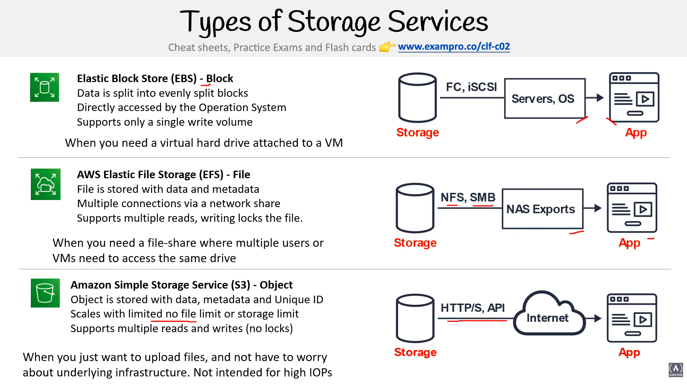
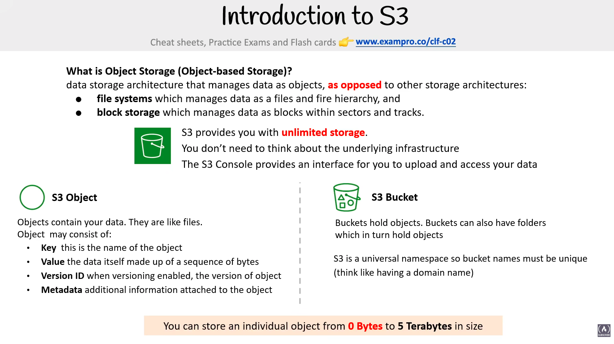
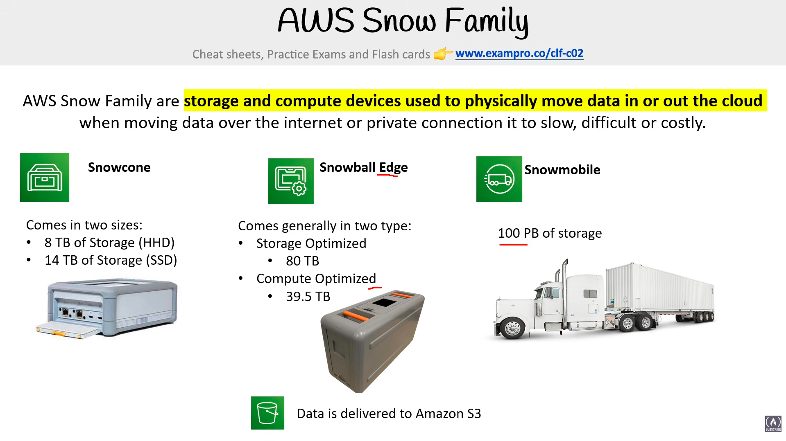
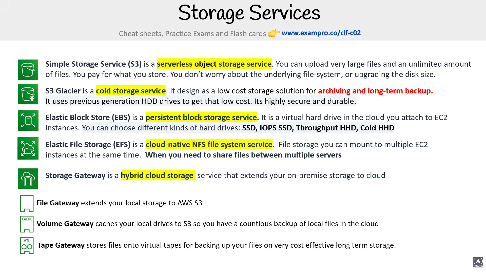
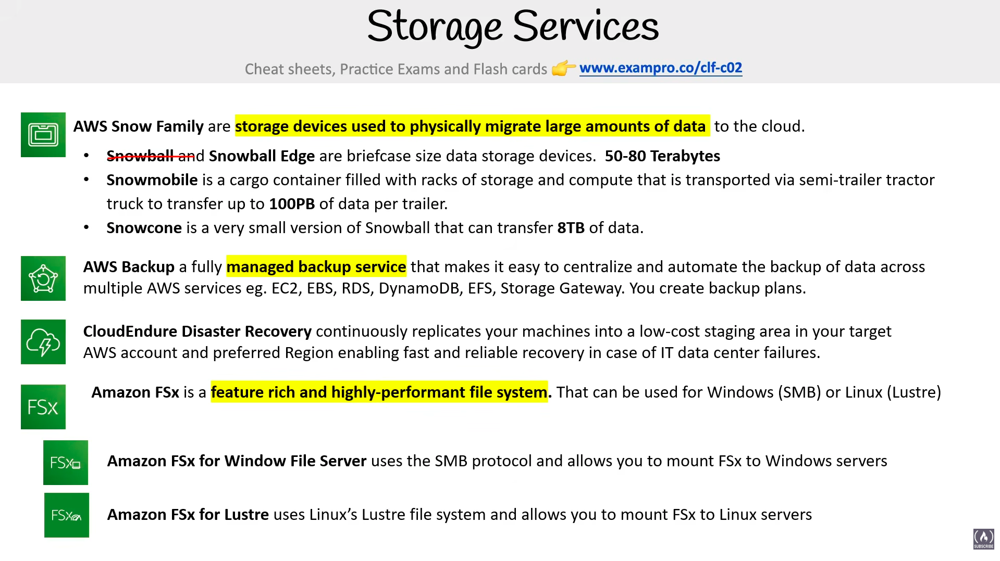

# Storage Services

> **Exam:** AWS Certified Cloud Practitioner (CLF-C02)
> **Topic 6:** The **three fundamental types of cloud storage** — **Block**, **File**, and **Object** — and the AWS service that delivers each (**EBS**, **EFS**, **S3**). The exam loves to describe a use case and ask *"which storage type/service fits?"* — so the goal is to instantly map a scenario to the right one.

Not all storage is the same. How data is *organised under the hood* changes what it's good at — booting an OS, sharing files across many machines, or cheaply holding endless objects. AWS offers one flagship service for each storage *type*, and knowing the difference is the whole battle on this topic.

---

## 1. The Three Types at a Glance (the diagram)

The diagram lines up the three side by side. Read each row as **storage type → AWS service → how the app reaches it.**

| Type | AWS Service | Protocol / Access | Mental model |
|---|---|---|---|
| **Block** | **EBS** (Elastic Block Store) | **FC, iSCSI** — attached directly, seen by the **OS** | A **virtual hard drive** bolted onto one VM |
| **File** | **EFS** (Elastic File System) | **NFS, SMB** — mounted over the **network** | A **shared network drive / NAS** many VMs mount |
| **Object** | **S3** (Simple Storage Service) | **HTTP/S, API** — reached over the **internet** | A giant **web-accessible bucket** of files |

> **The core split:** **Block** = one drive for one machine (the OS manages it). **File** = a shared folder many machines mount at once. **Object** = files-as-objects you upload/download over the web.

---

## 2. Block Storage — Amazon EBS

**Elastic Block Store (EBS)** is a **persistent block storage** service — a **virtual hard drive in the cloud** that you **attach to EC2 instances** (one at a time, in the same AZ). *Persistent* means the data survives even if the instance is stopped.

- Data is **split into evenly sized blocks**.
- It's accessed **directly by the Operating System** — the OS sees raw blocks and lays its own file system on top.
- Supports **only a single write** — it's attached to **one instance** at a time (no concurrent multi-instance sharing in the basic model).
- You can **choose different kinds of hard drives** to match cost/performance:

| Volume type | Backed by | Good for |
|---|---|---|
| **General Purpose SSD** | SSD | Default, balanced price/performance for most workloads |
| **Provisioned IOPS SSD** | SSD | **High IOPS** — databases needing the fastest, most consistent I/O |
| **Throughput Optimized HDD** | HDD | **Large, sequential** throughput workloads (big data, log processing) |
| **Cold HDD** | HDD | **Lowest-cost** HDD for infrequently accessed data |

> **SSD = IOPS/transactional · HDD = throughput/cheap.** "Highest IOPS" → **Provisioned IOPS SSD**; "lowest cost / infrequent" → **Cold HDD**.

**Use it when:** you need a **virtual hard drive attached to a VM** — e.g. the **boot volume** for an EC2 instance, or a database that needs low-latency, block-level disk access.

> **Think:** the C: drive / root disk of a server. Fast, low-latency, but tied to **one** machine.

---

## 3. File Storage — Amazon EFS

**Elastic File System (EFS)** is a **shared file system** — a managed **NAS** that **many instances mount at the same time** over the network.

- Files are **stored with their data and metadata** in a familiar folder/directory hierarchy.
- **Multiple connections** via a **network share** (NFS / SMB).
- Supports **multiple reads**, and **locks the file** while it's being written (so writes stay consistent).

**Use it when:** you need a **shared file-share that multiple users or VMs need to access the same drive** at once — e.g. a content management system, shared home directories, or a web-server fleet serving the same files.

> **Think:** a shared network drive the whole team (or whole fleet) mounts. The differentiator vs EBS is **shared / concurrent access**.

---

## 4. Object Storage — Amazon S3

**Simple Storage Service (S3)** stores data as **objects** reached over the **internet** via **HTTP/S and APIs** — not mounted as a disk.

- Each **object is stored with its data, metadata, and a unique ID**.
- **Scales** with **no limited size or storage limit** — effectively unlimited, you don't manage capacity.
- Supports **multiple reads and writes**, but **has no locks** (no file-locking like EFS).

**Use it when:** you **just want to upload files** and **not worry about the underlying infrastructure** — e.g. backups, static website assets, images, logs, data lakes. **Not intended for high IOPs** / low-latency disk workloads (that's EBS's job).

> **Think:** an infinitely large, web-accessible bucket. You don't see a "drive" — you `PUT`/`GET` objects by key over an API.

---

## 5. Amazon S3 — A Closer Look (Object Storage in Depth)

Since S3 is the workhorse of the three (and the exam's favourite), it's worth going one level deeper.

### What is Object Storage (object-based storage)?
A **data storage architecture that manages data as *objects*** — **as opposed to** the other two architectures you just saw:
- **File systems** — which manage data as a **file and folder hierarchy** (that's **EFS**).
- **Block storage** — which manages data as **blocks within sectors and tracks** (that's **EBS**).

**What S3 gives you:**
- A **serverless object storage** service — **no servers or disks to manage**.
- **Unlimited storage** — upload very large files and an unlimited number of files; you don't worry about provisioning capacity.
- **You don't need to think about the underlying infrastructure** — no file-system to manage, no disk size to upgrade.
- **Pay only for what you store.**
- The **S3 Console** provides an **interface to upload and access your data**.

### 🟢 S3 Object
Objects **contain your data — they are essentially files.** An object is made up of:

| Component | What it is |
|---|---|
| **Key** | The **name** of the object |
| **Value** | The **data itself** — a sequence of bytes |
| **Version ID** | When **versioning** is enabled, the version of the object |
| **Metadata** | **Additional information** attached to the object |

### 🟠 S3 Bucket
**Buckets hold objects.** Buckets can also **contain folders, which in turn hold objects.**

> **Critical exam fact:** **S3 is a *universal namespace*, so bucket names must be globally unique** — across **all** AWS accounts, worldwide. *(Think of it like a domain name — no two can be the same.)*

### Object size
> **You can store an individual object from `0 Bytes` to `5 Terabytes (TB)` in size.** *(Exam loves this exact range.)*

---

## 6. S3 Storage Classes

S3 isn't one-price-fits-all. **AWS offers a range of S3 storage classes that *trade* Retrieval Time, Accessibility, and Durability for cheaper storage.** The core idea the exam tests: **the less often you access data (and the slower you're willing to retrieve it), the cheaper it gets.**

> **The spectrum (top = instant & pricey → bottom = slow & cheapest):**
> **Standard → Intelligent-Tiering → Standard-IA → One-Zone-IA → Glacier → Glacier Deep Archive**

| Storage Class | One-line purpose | Key exam facts |
|---|---|---|
| **S3 Standard** *(default)* | **Frequently accessed** data | **Fast**; **99.99%** availability, **11 9's** durability; replicated across **≥ 3 AZs** |
| **S3 Intelligent-Tiering** | "**Set it and forget it**" — unknown/changing access patterns | Uses **ML** to analyse object usage and **auto-move** data to the most cost-effective tier — **no performance impact or overhead** |
| **S3 Standard-IA** *(Infrequent Access)* | Accessed **less than once a month**, but needs fast retrieval | **Cheaper** storage; **retrieval fee** applies; **50% less** than Standard (reduced availability) |
| **S3 One-Zone-IA** | Infrequent access, **re-creatable** data | Objects exist in **only ONE AZ** (avail. **99.5%**); **~20% cheaper** than Standard-IA; data **could be destroyed** if the AZ is lost; retrieval fee applies |
| **S3 Glacier** | **Archive** / long-term cold storage | Retrieval takes **minutes to hours**; storage is **very cheap** |
| **S3 Glacier Deep Archive** | **Lowest-cost** class — deep archive | **Cheapest** of all; data retrieval time is **~12 hours** |
| **S3 Outposts** | Store data **on-premises** (on an AWS Outposts rack) | **Has its own storage class** — keeps data on your own premises for local/low-latency or data-residency needs |

### How to read the trade-off
- **Standard** = always-on, fastest, most resilient (3+ AZs) — but most expensive.
- **IA classes** = cheaper *storage* but you **pay a retrieval fee** and accept lower availability — good for backups touched rarely.
- **One-Zone-IA** = even cheaper because it drops multi-AZ redundancy — **only use it for data you can recreate** (losing that one AZ loses the data).
- **Glacier / Glacier Deep Archive** = archival; you trade **retrieval *time*** (minutes-to-hours, up to **12 hrs**) for the **lowest price**.
- **Intelligent-Tiering** = let **AWS decide** for you when access patterns are unpredictable.
- **S3 Outposts** = its **own storage class** for keeping S3 data **on-premises** (on an Outposts rack) — for **local access / low latency** or **data-residency** requirements. (Ties back to **Outposts** in Topic 01 Global Infrastructure.)

> **Note:** durability is effectively **11 9's (99.999999999%)** across the classes — what really changes between them is **availability, AZ redundancy, retrieval time/cost, and price.**

---

## 7. AWS Snow Family — Physically Moving Data

Sometimes the internet just isn't an option. The **AWS Snow Family** are **physical storage and compute devices used to physically move data *in* or *out* of the cloud** — for when moving data **over the internet or a private connection is too slow, difficult, or costly** (think terabytes-to-petabytes, or remote sites with poor connectivity).

> **The whole point:** AWS **ships you a rugged device**, you copy your data onto it, and **ship it back** — then **the data is delivered to Amazon S3.** It's literally "sneakernet" at cloud scale.

| Device | Capacity | Notes |
|---|---|---|
| **AWS Snowcone** | Comes in **two sizes**: **8 TB** (HDD) and **14 TB** (SSD) | The **smallest**, most portable device — edge computing & small transfers |
| **AWS Snowball Edge** | Comes in **two types**: **Storage Optimized = 80 TB**, **Compute Optimized = 39.5 TB** | Mid-range; adds on-board **compute** for processing data at the edge |
| **AWS Snowmobile** | **100 PB** of storage | A literal **shipping container on a truck** — for **exabyte / massive datacentre-scale** migrations |

> **In all cases, data ends up in Amazon S3** once the device is returned to AWS.

### How to pick
- **Small / edge / portable (TBs):** **Snowcone** (8 TB HDD or 14 TB SSD).
- **Tens of TB, maybe process data on the device:** **Snowball Edge** (80 TB storage-optimized vs 39.5 TB compute-optimized).
- **Petabyte-to-exabyte, entire datacentre:** **Snowmobile** (100 PB per truck).

---

## 8. The Wider Storage Landscape — Gateways, FSx, Backup & DR

The earlier sections covered the headline services (EBS, EFS, S3, Glacier, Snow). These two summary slides round out the **full AWS storage catalogue** and add several services the exam expects you to **recognise by description.**

### Recap — services already covered, in one line each

| Service | One-liner (exam phrasing) |
|---|---|
| **S3** | **Serverless object storage**; upload unlimited/very large files; **pay for what you store**; no file-system or disk-size to manage |
| **S3 Glacier** | A **cold storage** service designed as a **low-cost** option for **archiving and long-term backup**; uses **previous-generation HDD** drives for low cost; highly secure & durable |
| **EBS** | A **persistent block storage** service — a **virtual hard drive in the cloud** you attach to EC2; choose SSD / IOPS SSD / Throughput HDD / Cold HDD |
| **EFS** | A **cloud-native NFS file system** you can **mount to multiple EC2 instances at the same time** — when you need to **share files between multiple servers** |
| **Snow Family** | **Physical devices** to move large data to the cloud (Snowcone / Snowball Edge / Snowmobile) — lands in **S3** |

Now the **new** services these slides introduce:

### 8.1 AWS Storage Gateway — hybrid cloud storage
A **hybrid cloud storage** service that **extends your on-premises storage to the cloud** (so your local apps still see normal storage, but it's backed by AWS). Three flavours:

| Gateway type | What it does |
|---|---|
| **File Gateway** | Extends your **local storage to Amazon S3** (files stored as S3 objects) |
| **Volume Gateway** | **Caches your local drives to S3** so you have a **continuous backup** of local files in the cloud |
| **Tape Gateway** | Stores files onto **virtual tapes** — backup on **very cost-effective long-term** storage (a drop-in replacement for physical tape backups) |

> **Trigger:** "**extend on-premises storage to the cloud**" / "**hybrid** storage" → **Storage Gateway**. "Virtual **tape** backup" → **Tape Gateway**.

### 8.2 Amazon FSx — fully managed third-party file systems
A **feature-rich and highly-performant file system** that runs the **managed versions of well-known file systems**. Two variants:

| Variant | Protocol / FS | Mount to |
|---|---|---|
| **Amazon FSx for Windows File Server** | **SMB** protocol | **Windows** servers |
| **Amazon FSx for Lustre** | Linux's **Lustre** file system | **Linux** servers (high-performance computing) |

> **EFS vs FSx:** **EFS** = AWS's own cloud-native **NFS** (Linux). **FSx** = managed **Windows (SMB)** or **Lustre** file systems. "Windows file share / SMB" → **FSx for Windows**; "Lustre / HPC on Linux" → **FSx for Lustre**.

### 8.3 AWS Backup — centralised, automated backups
A **fully managed backup service** that makes it easy to **centralize and automate the backup of data across multiple AWS services** — e.g. **EC2, EBS, RDS, DynamoDB, EFS, Storage Gateway.** You define **backup plans** (schedules + retention) in one place instead of per-service.

> **Trigger:** "**centralize / automate backups across many services**", "**backup plans**" → **AWS Backup**.

### 8.4 CloudEndure Disaster Recovery
**Continuously replicates your machines** into a **low-cost staging area** in your **target AWS account and preferred Region**, enabling **fast and reliable recovery** in case of **IT data center failures** — i.e. a DR solution for failing over on-prem/other servers into AWS.

> **Trigger:** "**continuous replication** for **disaster recovery**", "low-cost staging area", "fast recovery from data-center failure" → **CloudEndure Disaster Recovery**. (Ties back to **BCP/DR** in Topic 02.)

---

## 9. Choosing the Right One — Decision Cues

| If the scenario says… | Pick | Type |
|---|---|---|
| "Boot/root volume", "attach a disk to **one** EC2 instance", "low-latency block device for a database" | **EBS** | Block |
| "**Multiple** EC2 instances need to **share** the **same** files", "shared file system", "NFS/SMB mount" | **EFS** | File |
| "Store/upload files over **HTTP/API**", "**unlimited** scalable storage", "backups / static assets / data lake", "don't manage infrastructure" | **S3** | Object |

> **One-liner:** **EBS = one VM's hard drive · EFS = a shared network drive for many VMs · S3 = unlimited files over the web.**

---

## 10. Exam Triggers

- "**Block** storage" / "virtual **hard drive** attached to an instance" / "**boot volume**" → **EBS**.
- "Accessed **directly by the OS**", "evenly sized **blocks**", "**single** write / one instance" → **EBS**.
- "**File** storage", "**shared** file system", "**multiple** instances mount the **same** drive", "**NFS / SMB**" → **EFS**.
- "File **locks** during write", "multiple reads with a network share" → **EFS**.
- "**Object** storage", "**HTTP/S / API** access", "**unique ID** per object", "**unlimited** / no size limit", "upload files without managing infrastructure" → **S3**.
- "Multiple reads **and** writes, **no locks**" → **S3**.
- "**Not** for **high IOPs**" → that's a knock on **S3** (use **EBS** for high IOPs instead).
- "Bucket names must be **globally unique** / **universal namespace**" → **S3**.
- "**Key**, **Value**, **Version ID**, **Metadata**" → the parts of an **S3 object**.
- "Max size of a **single object**" → **5 TB** (range **0 Bytes – 5 TB**).
- "**Unknown / changing** access patterns", "**ML** picks the tier automatically" → **S3 Intelligent-Tiering**.
- "Accessed **less than once a month**, retrieve fast" → **S3 Standard-IA**.
- "Infrequent access, data is **re-creatable**, **single AZ**, cheapest IA" → **S3 One-Zone-IA**.
- "**Archive** / cold storage, retrieval in minutes–hours" → **S3 Glacier**.
- "**Lowest cost**, retrieval **~12 hours**" → **S3 Glacier Deep Archive**.
- "Replicated across **≥ 3 AZs**, frequently accessed, default" → **S3 Standard**.
- "Keep S3 data **on-premises** / on an **Outposts** rack", "data **residency**", "local low-latency S3" → **S3 Outposts**.
- "**Physically move / migrate** large data", "internet is **too slow / costly**", "ship a **device**" → **AWS Snow Family**.
- "**Smallest** / portable, **8 TB or 14 TB**" → **Snowcone**.
- "**80 TB** (storage) or **39.5 TB** (compute), edge processing" → **Snowball Edge**.
- "**100 PB**, truck / shipping container, datacentre-scale" → **Snowmobile**.
- "Where does Snow Family data land?" → **Amazon S3**.
- "**Extend on-premises storage to the cloud**", "**hybrid** cloud storage" → **AWS Storage Gateway**.
- "Virtual **tape** backup / replace physical tapes" → **Tape Gateway**; "local files cached/backed up to S3" → **Volume Gateway**; "local storage as S3 files" → **File Gateway**.
- "Managed **Windows file share / SMB**" → **Amazon FSx for Windows File Server**.
- "**Lustre** / high-performance Linux file system" → **Amazon FSx for Lustre**.
- "**Centralize / automate backups** across EC2, EBS, RDS, DynamoDB, EFS…", "**backup plans**" → **AWS Backup**.
- "**Continuously replicate** servers for **disaster recovery**", "low-cost staging area" → **CloudEndure Disaster Recovery**.
- "**Persistent** virtual hard drive for EC2", "**highest IOPS**" → **EBS** (Provisioned IOPS SSD).
- "**Cold storage**, archiving, long-term backup, lowest cost, previous-gen HDD" → **S3 Glacier**.

---

## 11. Common Confusions to Nail

1. **EBS vs EFS = single vs shared.** EBS attaches to **one** instance; EFS is **mounted by many** at once. "Share files between several EC2 instances" → **EFS**, not EBS.
2. **S3 is not a disk.** You don't "mount" S3 like a drive — you reach **objects** over **HTTP/API**. If a question says "mount as a file system," that's **EFS**, not S3.
3. **High IOPs / low latency → EBS, not S3.** S3 is for throughput and scale, **not** fast random disk access.
4. **Locking differs:** **EFS locks** files on write (consistent shared access); **S3 has no locks**.
5. **"Unlimited / scales automatically" → S3.** EBS volumes have a fixed provisioned size; S3 has effectively no capacity ceiling.
6. **EFS vs FSx.** **EFS** = AWS's own cloud-native **NFS** (Linux). **FSx** = managed **Windows (SMB)** or **Lustre** file systems. Don't pick EFS for a "Windows SMB file share" — that's **FSx for Windows**.
7. **Storage Gateway = hybrid (on-prem ↔ cloud); AWS Backup = centralized backups; CloudEndure = disaster recovery.** These three sound similar but answer different questions: *extend on-prem*, *back up many services*, *replicate for DR*.
8. **Snowball Edge vs Snowmobile vs Snowcone = scale.** Briefcase-size (tens of TB) vs truck/container (100 PB) vs tiny (8 TB). Pick by **how much data**.

---

## Quick Revision Cheat Sheet

| Service | Type | Access | Sharing | Best for |
|---|---|---|---|---|
| **EBS** | **Block** | iSCSI / FC — by the **OS** | **One** instance at a time | Boot volumes, databases, high-IOPs disk |
| **EFS** | **File** | **NFS / SMB** over network | **Many** instances at once | Shared file systems, fleets sharing files |
| **S3** | **Object** | **HTTP/S / API** over internet | Many reads & writes (**no lock**) | Backups, static assets, data lakes, unlimited storage |

**S3 deep-dive facts:**

| Fact | Value |
|---|---|
| Object parts | **Key, Value, Version ID, Metadata** |
| Where objects live | **Buckets** (which can hold **folders**) |
| Bucket naming | **Globally unique** — S3 is a **universal namespace** |
| Single object size | **0 Bytes → 5 TB** |
| Capacity | **Unlimited** — no infrastructure to manage |

**S3 storage classes (cheapest = slowest/least redundant):**

| Class | When | Retrieval | Note |
|---|---|---|---|
| **Standard** | Frequent access (default) | Instant | **≥ 3 AZs**, 99.99% avail |
| **Intelligent-Tiering** | Unknown/changing patterns | Instant | **ML** auto-tiers, no overhead |
| **Standard-IA** | < once a month | Instant (+fee) | Cheaper, reduced availability |
| **One-Zone-IA** | Infrequent, **recreatable** | Instant (+fee) | **Single AZ** — can be lost |
| **Glacier** | Archive / cold | **Minutes–hours** | Very cheap |
| **Glacier Deep Archive** | Deep archive | **~12 hours** | **Cheapest** |
| **Outposts** | Data must stay **on-premises** | Local | **Own** storage class, on an Outposts rack |

**AWS Snow Family (physically ship data → lands in S3):**

| Device | Capacity | Use |
|---|---|---|
| **Snowcone** | **8 TB** (HDD) / **14 TB** (SSD) | Smallest, portable, edge |
| **Snowball Edge** | **80 TB** (storage) / **39.5 TB** (compute) | Tens of TB + edge compute |
| **Snowmobile** | **100 PB** | Truck — datacentre-scale migration |

**Other storage services to recognise:**

| Service | What it is | Trigger |
|---|---|---|
| **Storage Gateway** | Hybrid cloud storage (File / Volume / **Tape** Gateway) | "extend **on-prem** storage to cloud" |
| **FSx for Windows** | Managed **SMB** file system | "**Windows** file share" |
| **FSx for Lustre** | Managed **Lustre** file system | "**HPC** / Linux Lustre" |
| **AWS Backup** | Centralized, automated backups across services | "**backup plans**, many services" |
| **CloudEndure DR** | Continuous replication for disaster recovery | "**DR**, replicate servers" |

### Top exam points to remember
1. **Three storage types → three services: Block = EBS, File = EFS, Object = S3.** Memorise this mapping.
2. **EBS** = a virtual **hard drive** for **one** EC2 instance, seen by the **OS** (blocks).
3. **EFS** = a **shared** network file system (**NFS/SMB**) that **many** instances mount at once, with **file locking**.
4. **S3** = **object** storage over **HTTP/API**, **unlimited** scale, **no locks**, **not for high IOPs**.
5. Map the scenario: **one disk → EBS · shared files → EFS · web-accessible unlimited files → S3.**
