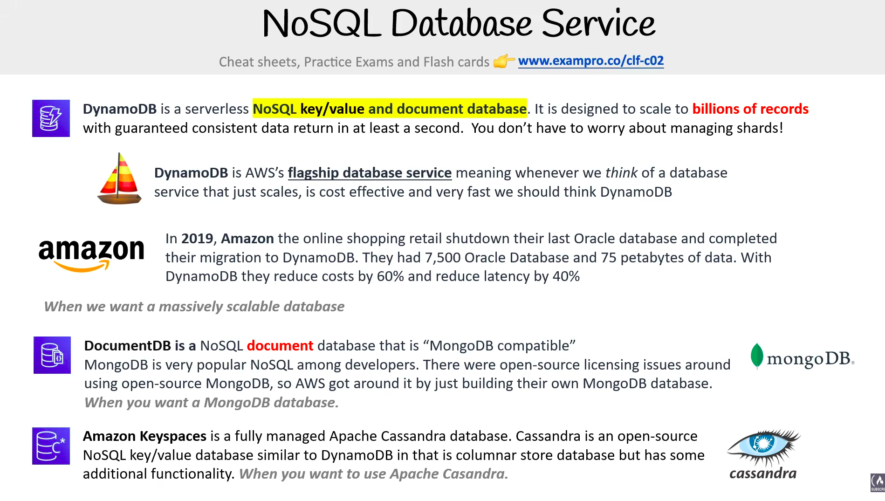
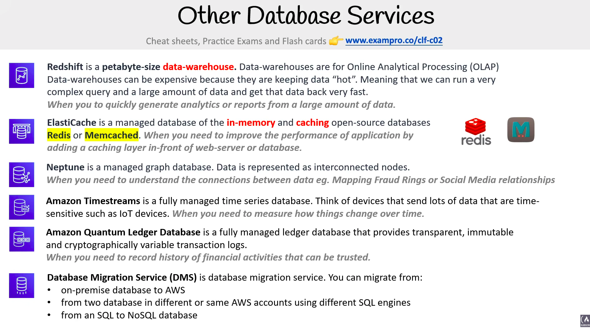

# Databases

> **Exam:** AWS Certified Cloud Practitioner (CLF-C02)
> **Topic 7:** **Databases on AWS** — moving from *storing files* (Topic 6) to *storing structured, queryable data*. The exam doesn't ask you to write SQL; it asks you to **pick the right database for a given workload** ("relational? key-value? in-memory? analytics?") and to know that AWS offers a **managed service for each kind**. Get the matching right and most database questions answer themselves.

A **database** is an organised store of data you can query and update. The single biggest idea on the exam is that databases come in **different shapes for different jobs**, and AWS sells a **purpose-built managed service** for each shape. "Managed" means AWS handles the heavy lifting — provisioning, patching, backups, replication — so you only worry about your data and access (the **PaaS** end of the [Shared Responsibility Model](04_Shared_Responsibility_Model.md)).

---

## 1. The Big Picture — Types of Databases

The first decision is **what kind of data** you're storing and **how you query it**.

| Type | Shape of data | Think of it as… | AWS service(s) |
|---|---|---|---|
| **Relational (SQL)** | Tables with rows & columns, fixed schema, relationships between tables | A set of linked spreadsheets | **Amazon RDS**, **Amazon Aurora** |
| **Non-relational (NoSQL)** | Flexible schema — key-value, document, graph, etc. | A big dictionary / JSON store | **DynamoDB** (key-value/document) |
| **In-memory** | Data held in RAM for microsecond reads (a cache) | A super-fast scratchpad | **ElastiCache**, **MemoryDB** |
| **Data warehouse** | Relational but **column-oriented**, built for analytics over huge datasets | A reporting engine (see §3) | **Amazon Redshift** |
| **Graph** | Nodes & relationships (social networks, fraud rings) | A web of connections | **Amazon Neptune** |

> **Two workload words the exam loves:**
> - **OLTP** (Online **Transaction** Processing) → lots of small, fast reads/writes (e.g. an e-commerce checkout). Served by **RDS / Aurora / DynamoDB**.
> - **OLAP** (Online **Analytical** Processing) → big, complex queries over historical data for reports. Served by a **data warehouse — Redshift**.

### Managed vs self-managed

You *could* install a database engine yourself on an **EC2** instance — but then **you** patch the OS, run backups, handle failover, and scale it (lots of work, IaaS). AWS's **managed** database services do all of that **for you**. On the exam, "fully managed," "no servers to manage," "automated backups/patching" → pick the **managed AWS database service**, not EC2.

| Concern | Self-managed DB on **EC2** | **Managed** AWS DB (RDS/Aurora/DynamoDB/Redshift) |
|---|---|---|
| OS & DB engine patching | **You** | **AWS** |
| Backups & snapshots | **You** script them | **AWS** automates them |
| Replication / failover / HA | **You** build it | **AWS** provides it (e.g. Multi-AZ) |
| Your job shrinks to | everything | **just your data & access** |

---

## 2. The AWS Database Landscape (purpose-built services)

AWS's pitch: **"the right tool for the right job."** You don't bend one database to every problem — you pick the managed service built for that workload.

| Service | Category | One-line "use it when…" |
|---|---|---|
| **Amazon RDS** | Relational (managed SQL) | You want a traditional SQL database (MySQL, PostgreSQL, MariaDB, Oracle, SQL Server) **without managing servers**. |
| **Amazon Aurora** | Relational (AWS-built) | You want MySQL/PostgreSQL-**compatible** SQL with **higher performance & availability**; **Aurora Serverless** auto-scales capacity. |
| **Amazon DynamoDB** | NoSQL key-value/document | You need a **serverless**, single-digit-millisecond, massively scalable key-value store. No schema, no servers. |
| **Amazon Redshift** | Data warehouse (OLAP) | You need **analytics/reporting** over **terabytes–petabytes** of data. (See §3.) |
| **Amazon ElastiCache** | In-memory cache | You need to **cache** frequent reads for microsecond latency (**Redis** or **Memcached**). |
| **Amazon Neptune** | Graph | Highly connected data — social graphs, recommendations, fraud detection. |
| **Amazon DocumentDB** | Document (MongoDB-compatible) | You run **MongoDB**-style document workloads, managed. |
| **Amazon QLDB** | Ledger | You need an **immutable, cryptographically verifiable** transaction log. |
| **Amazon Timestream** | Time-series | IoT / metrics data indexed by time. |
| **Amazon Keyspaces** | Wide-column (Cassandra) | Managed Apache **Cassandra**-compatible store. |

> **Exam shortcut:** memorise the **headliners** — **RDS/Aurora = relational SQL**, **DynamoDB = NoSQL/serverless key-value**, **Redshift = data warehouse/analytics**, **ElastiCache = in-memory cache**. The niche ones (Neptune=graph, Timestream=time-series, QLDB=ledger) usually appear as the obvious match to a keyword.

---

## 3. Data Warehouse

A **data warehouse** is a **relational datastore designed for analytic workloads** — and it is generally **column-oriented** rather than row-oriented. It's the database you reach for when you stop asking *"give me this one customer's order"* (a transaction) and start asking *"what were total sales by region last quarter?"* (an analytic report).

> **AWS's data warehouse service is Amazon Redshift.** If a question describes any of the traits below, the answer is almost always **Redshift**.

### Defining characteristics (straight from the slide)

- **Built for analytic workloads.** Companies accumulate **terabytes and millions of rows** of data and need a **fast** way to produce **analytics reports** over all of it.
- **Column-oriented.** Data warehouses are **optimised around columns**, not rows, because analytics mostly **aggregates column values** (e.g. *sum* a "sales" column across millions of rows). Reading just the needed columns is far faster than reading whole rows.
- **Performs aggregation.** **Aggregation = grouping data** to compute a **total, average, count,** etc. This is the core job of a warehouse.
- **Designed to be "HOT".** **Hot** means it can **return queries very fast even over vast amounts of data** — it's tuned for speed at scale.
- **Accessed infrequently (not real-time).** A warehouse **isn't meant for real-time reporting**. Reports are typically generated **once or twice a day, or once a week**, to produce **business and user reports**.
- **Consumes data from relational databases on a regular basis.** It **doesn't originate** the data — it **pulls in** data from your transactional (relational) databases periodically, often via an **ELT/ETL** pipeline (as the slide's `SQL → ELT → SQL` diagram shows).

### Row-oriented (OLTP) vs Column-oriented (OLAP/warehouse)

| | **Row-oriented** (RDS/Aurora — OLTP) | **Column-oriented** (Redshift — OLAP/warehouse) |
|---|---|---|
| Stores data by… | **row** (whole record together) | **column** (each column together) |
| Best at | many small **transactions** — insert/update one record fast | **aggregating** one or two columns over **millions of rows** |
| Typical query | "fetch / update this customer's order" | "total revenue by region this quarter" |
| Freshness | **real-time** | **batched** (refreshed daily/weekly) |
| AWS service | **RDS, Aurora** | **Amazon Redshift** |

> **The mental model:** a relational database (RDS/Aurora) is the **operational source of truth** that handles live transactions; the **data warehouse (Redshift)** is the **analytics copy** that periodically slurps in that data and is tuned to crunch huge aggregate reports quickly.

---

## 4. Document Store

A **document store** is a **NoSQL database that stores documents as its primary data structure.** A "document" is a self-contained record — most commonly **JSON (or JSON-like)**, and sometimes **XML** — that holds its fields (and even nested data) all in one place, with **no fixed schema**. This is the NoSQL family you reach for when each record looks like a flexible JSON object rather than a rigid table row.

> **Key relationship (from the slide):** document stores are a **sub-class of key-value stores** — each document is essentially a *value* retrieved by a *key*, but the store also understands the document's internal fields, so you can query inside it.
>
> **AWS services:** **Amazon DocumentDB** (MongoDB-compatible, purpose-built document database) and **Amazon DynamoDB** (key-value **and** document store).

### Document store vs Relational (RDBMS) — the mapping

The slide lines up each relational concept with its document-store equivalent. This is the cleanest way to "translate" SQL thinking into NoSQL document thinking:

| Relational (RDBMS) | Document store | What it means |
|---|---|---|
| **Tables** | **Collections** | A group/container of records. |
| **Rows** | **Documents** | One record — a single JSON/XML object instead of a table row. |
| **Columns** | **Fields** | A named attribute *inside* a document (can vary doc-to-doc). |
| **Indexes** | **Indexes** | Same idea — structures that speed up lookups (kept on both sides). |
| **Joins** | **Embedding & Linking** | Instead of joining tables, you **embed** related data inside the document or **link** by reference. |

> **The big mental shift:** relational databases **normalise** data across many tables and **join** them at query time. Document stores instead **embed** related data inside a single document (or **link** to another document) — so one read often returns everything you need, no join required. Flexible schema + no joins = fast, scalable, but you trade away strict relational integrity.

---

## 5. NoSQL Database Services on AWS ⭐ (high-yield exam topic)

AWS offers three managed **NoSQL** services, each matching a different open-source/NoSQL style. **DynamoDB is by far the most exam-relevant** — if you remember one NoSQL service for the exam, make it DynamoDB.

### 🟧 Amazon DynamoDB — AWS's flagship NoSQL database

A **serverless NoSQL key-value *and* document database**, designed to **scale to billions of records** with no servers and **no shard management** to worry about.

**Straight from the slide:**
- **Serverless** — no servers to provision or manage; **you don't manage shards/partitions**, AWS does it automatically.
- Scales to **billions of records** with consistent data return.
- AWS's **flagship database service** — the slide's rule of thumb: *whenever you think of a database that just **scales, is cost-effective, and very fast**, think **DynamoDB**.*
- **Proof point (memorable exam-flavoured story):** in **2019 Amazon.com shut down its last Oracle database** and finished migrating to DynamoDB — **7,500 Oracle databases / 75 PB of data** migrated, **cutting cost ~60%** and **latency ~40%**.
- **Use it when you want a massively scalable database.**

**Extra DynamoDB points worth knowing for the exam** (commonly asked, beyond the slide):
- **Fully managed & serverless** → AWS handles provisioning, patching, scaling, replication. You manage only **data and access** (the SaaS end of the [Shared Responsibility Model](04_Shared_Responsibility_Model.md)).
- **Single-digit-millisecond performance at any scale** — DynamoDB's signature marketing line; "consistent, fast performance regardless of size."
- **Highly available & durable** — data is **automatically replicated across 3 Availability Zones** in a Region.
- **Global Tables** → **multi-Region, multi-active** replication for low-latency global apps and DR.
- **DAX (DynamoDB Accelerator)** → an **in-memory cache** for DynamoDB giving **microsecond** read latency (don't confuse with ElastiCache, which is general-purpose).
- **Two capacity/pricing modes:** **On-Demand** (pay-per-request, unpredictable workloads, no capacity planning) vs **Provisioned** (you set read/write capacity, cheaper for steady, predictable traffic).
- **Backups:** on-demand backups + **Point-in-Time Recovery (PITR)**.
- **No schema** beyond a required **primary key** — flexible attributes per item.

> **Exam shorthand:** "**serverless**," "**key-value**," "**NoSQL**," "**single-digit-millisecond**," "**scales automatically / no servers / no shards**," "**massive scale**" → **DynamoDB**, almost every time.

### 🟢 Amazon DocumentDB — "MongoDB-compatible"

A NoSQL **document** database that is **MongoDB-compatible**. MongoDB is hugely popular with developers, but open-source MongoDB had **licensing issues**, so AWS built its own **fully managed, MongoDB-compatible** service to sidestep that.
- **Use it when:** you want a **MongoDB-style document database** but managed by AWS (lift-and-shift existing MongoDB workloads).

### 🔷 Amazon Keyspaces — managed Apache Cassandra

A **fully managed Apache Cassandra** database. **Cassandra** is an open-source **NoSQL key-value / wide-column (columnar) store** — similar to DynamoDB in being columnar, but with some additional Cassandra-specific functionality.
- **Use it when:** you're running (or migrating) **Apache Cassandra** workloads and want them managed.

### Quick compare — the three NoSQL services

| Service | NoSQL style | "Compatible with" | Pick it when the question says… |
|---|---|---|---|
| **DynamoDB** ⭐ | Key-value **&** document, **serverless** | (AWS-native) | "serverless," "massive scale," "single-digit ms," "no servers/shards," "key-value" |
| **DocumentDB** | Document | **MongoDB** | "MongoDB," "document database," "JSON documents" |
| **Keyspaces** | Wide-column / key-value | **Apache Cassandra** | "Cassandra," "wide-column," "CQL" |

> **The matching trick:** each service is the **managed AWS answer to a keyword** — *MongoDB → DocumentDB*, *Cassandra → Keyspaces*, *generic "serverless NoSQL at scale" → DynamoDB.*

---

## 6. Amazon RDS — Relational Database Service ⭐

**Amazon RDS** is AWS's **managed relational database service** that supports **multiple SQL engines**. The slide states the exam's core framing: **"relational" is synonymous with SQL and OLTP** (Online Transaction Processing), and **relational databases are the most commonly used type of database** among tech companies and start-ups. RDS removes the grunt work (provisioning, patching, backups, failover) — you just pick an engine and use it (**PaaS** on the [Shared Responsibility Model](04_Shared_Responsibility_Model.md): AWS patches the OS & DB engine, you own data, schema and access).

### The 6 SQL engines RDS supports

| Engine | Type | Slide note |
|---|---|---|
| **MySQL** | Open-source | Most popular open-source SQL DB; **bought by and now owned by Oracle**. |
| **MariaDB** | Open-source | A **fork (copy) of MySQL** created after Oracle bought MySQL, under a different open-source license. |
| **PostgreSQL (PSQL)** | Open-source | Most popular open-source SQL DB **among developers**; richer features than MySQL but **added complexity**. |
| **Oracle** | Proprietary (licensed) | Oracle's proprietary DB, common in **enterprises**; you must **buy a license**. |
| **Microsoft SQL Server** | Proprietary (licensed) | Microsoft's proprietary DB; you must **buy a license**. |
| **Aurora** | AWS-built, fully managed | AWS's own engine (see below). |

> **Memory hook:** **3 open-source** (MySQL, MariaDB, PostgreSQL) + **2 commercial/licensed** (Oracle, SQL Server) + **1 AWS-native** (Aurora) = **6 engines**.

### 🟦 Amazon Aurora

A **fully managed** relational database that is **MySQL- or PostgreSQL-compatible** — and faster than the originals: the slide cites **MySQL 5× faster** and **PostgreSQL 3× faster**.
- **Use it when:** you want a **highly available, durable, scalable and secure** relational database for **PostgreSQL or MySQL** workloads.
- *(Exam extras: Aurora keeps **6 copies of your data across 3 AZs** and auto-scales storage — that's why it's the "high availability/durability" answer.)*

### 🟦 Aurora Serverless

The **serverless, on-demand version of Aurora** — capacity **auto-scales** and you pay only for what you use.
- **Use it when:** you want **most of Aurora's benefits** but can **tolerate cold-starts**, or you have **infrequent / unpredictable / low traffic** (no need to run capacity 24/7).

### RDS on VMware

Lets you **deploy RDS-supported engines to your own on-premises data center**. The catch: the datacenter **must use VMware** for server virtualization.
- **Use it when:** you want databases **managed by RDS but running on your own datacenter** (hybrid).

### ⭐ Must-know RDS exam concepts (beyond the slide)

These two are the **most-tested RDS distinction** on CLF-C02 — don't mix them up:

| Feature | Purpose | How it works | Keyword |
|---|---|---|---|
| **Multi-AZ deployment** | **High Availability / Disaster Recovery** | A **synchronous standby replica** in another AZ; **automatic failover** if the primary fails. **Not for scaling.** | "high availability," "failover," "disaster recovery" |
| **Read Replicas** | **Performance / read scaling** | **Asynchronous** read-only copies that offload **read** traffic; can be **cross-Region**. **Not automatic failover.** | "scale reads," "read-heavy," "offload reporting" |

Other RDS points worth a glance:
- **Managed = no OS access.** Unlike a DB on EC2, you **can't SSH into the RDS host**; AWS handles OS/engine patching.
- **Automated backups + snapshots + point-in-time recovery (PITR).**
- **Encryption** at rest (via **KMS**) and in transit (SSL/TLS).
- **RDS = OLTP**, not analytics — for analytics use **Redshift** (§3).

---

## 7. Other Database Services

Beyond relational (RDS) and the NoSQL trio, AWS has a **purpose-built service for almost every data shape**. The exam tests these mostly as **keyword → service** matches. Each below shows what it is and the *"use it when…"* cue from the slide, plus the extra detail that tends to show up in questions.

### 🟥 Amazon Redshift — data warehouse (OLAP)

A **petabyte-scale data warehouse** for **Online Analytical Processing (OLAP)**. Warehouses can be **expensive** because they keep data **"hot"** — so a **very complex query over a large amount of data comes back very fast.**
- **Use it when:** you need to **quickly generate analytics or reports from a large amount of data.**
- *(Exam extras: **column-oriented**, **SQL-based** (built on PostgreSQL), and **Redshift Spectrum** can query data directly in **S3**. This is the same service detailed in [§3 Data Warehouse](#3-data-warehouse).)*

### 🟦 Amazon ElastiCache — in-memory cache

A **managed in-memory caching** database for the open-source engines **Redis** or **Memcached**.
- **Use it when:** you need to **improve application performance by adding a caching layer in front of a web server or database** (serve hot reads from RAM instead of hitting the DB every time).

| | **Redis** | **Memcached** |
|---|---|---|
| Data structures | **Rich** (lists, sets, sorted sets, hashes) | **Simple** key-value strings only |
| Persistence / backup | **Yes** | **No** |
| Replication / Multi-AZ / HA | **Yes** | **No** |
| Multi-threaded | No | **Yes** |
| Pick when… | you need **persistence, replication, advanced features** | you need a **simple, fast, scale-out** cache |

### 🟪 Amazon Neptune — graph database

A **managed graph database** where data is represented as **interconnected nodes** (and the relationships between them).
- **Use it when:** you need to **understand connections between data** — e.g. **mapping fraud rings** or **social-media relationships / recommendations.**
- *(Exam extras: supports the **Gremlin** and **SPARQL** query languages.)*

### 🟫 Amazon Timestream — time-series database

A **fully managed time-series database**. Think of **devices that send lots of time-sensitive data, such as IoT devices**, sensors, or app metrics.
- **Use it when:** you need to **measure how things change over time.**

### 🟧 Amazon QLDB — Quantum Ledger Database

A **fully managed ledger database** that provides a **transparent, immutable, and cryptographically verifiable transaction log** (an entry can be added but never altered or deleted).
- **Use it when:** you need to **record a history of activity (e.g. financial) that can be trusted / audited.**
- *(Note: the slide says "cryptographically variable" — the correct term is **cryptographically *verifiable*.**)*

### 🔄 AWS Database Migration Service (DMS)

A service to **migrate databases** with **minimal downtime** (the source stays operational during the migration). Per the slide, you can migrate:
- an **on-premises database → AWS**,
- **between two databases** in **different or the same AWS accounts**, even using **different SQL engines**,
- from a **SQL → NoSQL** database.

> **Two migration "shapes" worth knowing:**
> - **Homogeneous** — same engine (e.g. Oracle → Oracle / MySQL → Aurora-MySQL). Straightforward.
> - **Heterogeneous** — *different* engines (e.g. Oracle → PostgreSQL, or SQL → NoSQL). Needs the **AWS Schema Conversion Tool (SCT)** to convert the schema first, then DMS moves the data.

> **Exam shorthand:** the word **"migrate"** (any database, to/from AWS, between engines) → **DMS**; "convert the schema between different engines" → **DMS + SCT**.

---

## 8. Exam Triggers

- "**Fully managed relational / SQL database**" → **Amazon RDS** (or **Aurora** for high performance / MySQL-PostgreSQL-compatible).
- "**Serverless**, key-value, NoSQL, single-digit-millisecond, massive scale, **no shards to manage**" → **DynamoDB**.
- "**MongoDB-compatible** / MongoDB document database" → **Amazon DocumentDB**.
- "**Apache Cassandra** / wide-column / CQL" → **Amazon Keyspaces**.
- "**Multi-Region, multi-active** NoSQL replication" → **DynamoDB Global Tables**; "**microsecond** cache for DynamoDB" → **DAX**.
- "**Data warehouse**," "**analytics / reporting**," "**OLAP**," "**petabytes**," "**column-oriented**," "**aggregate huge datasets**" → **Amazon Redshift**.
- "**In-memory cache**," "**microsecond latency**," "**Redis / Memcached**" → **ElastiCache**.
- "**Graph** / highly connected data / fraud / social network" → **Neptune**.
- "**OLTP** / lots of small transactions / real-time" → **relational (RDS/Aurora)** or **DynamoDB**, **not** a warehouse.
- "**Document store**," "**JSON / JSON-like documents**," "**flexible schema**," "**collections / documents / fields**," "**MongoDB-compatible**" → **document store** → **Amazon DocumentDB** (or **DynamoDB**).
- "Don't want to manage servers / patching / backups" → a **managed AWS database service**, not a DB on **EC2**.
- "**Managed relational / SQL**," "**MySQL / MariaDB / PostgreSQL / Oracle / SQL Server**" → **Amazon RDS**.
- "**High availability**," "**automatic failover**," "**standby in another AZ**" → **RDS Multi-AZ**.
- "**Scale reads**," "**read-heavy**," "**offload read traffic / reporting**" → **RDS Read Replicas**.
- "**MySQL/PostgreSQL-compatible but faster / more available**" → **Aurora**; "**infrequent traffic / cold-starts OK / auto-scaling SQL**" → **Aurora Serverless**.
- "**Relational DB managed by RDS but on-premises (VMware)**" → **RDS on VMware**.
- "**Time-series**," "**IoT data**," "**measure change over time**" → **Amazon Timestream**.
- "**Immutable / cryptographically verifiable ledger**," "**trusted history of transactions**" → **Amazon QLDB**.
- "**Migrate a database**," "**on-prem → AWS**," "**between engines**," "**SQL → NoSQL**" → **AWS DMS** (+ **Schema Conversion Tool (SCT)** when engines differ).

---

## 8. Common Confusions to Nail

1. **Redshift is for analytics, not transactions.** It's a **data warehouse (OLAP)** — great at big aggregate reports, **wrong** for high-volume real-time transactions. Those go to **RDS/Aurora/DynamoDB**.
2. **A data warehouse is still relational — just column-oriented.** "Column-oriented" ≠ "NoSQL." Don't confuse Redshift (relational warehouse) with DynamoDB (NoSQL).
3. **Warehouses are read *infrequently* and fed in batches.** They consume data **from** your relational databases periodically — they're not the live system of record and not for real-time dashboards.
4. **RDS vs Aurora:** RDS runs standard engines (MySQL, PostgreSQL, MariaDB, Oracle, SQL Server); **Aurora** is AWS's own MySQL/PostgreSQL-**compatible** engine with better performance/availability. Both are **relational and managed**.
5. **DynamoDB is serverless; RDS/Aurora are provisioned** (though Aurora has a Serverless option). "No servers, key-value, auto-scaling" → DynamoDB.
6. **DocumentDB ≠ DynamoDB.** Both are NoSQL, but **DocumentDB = MongoDB-compatible document DB**; **DynamoDB = AWS-native serverless key-value/document.** "MongoDB" in the question → **DocumentDB**.
7. **Keyspaces = Apache Cassandra**, not DynamoDB. They're both columnar NoSQL, but "Cassandra/CQL" → **Keyspaces**.
8. **DAX ≠ ElastiCache.** **DAX** is the in-memory cache **purpose-built for DynamoDB** (microsecond reads); **ElastiCache** is the **general-purpose** cache (Redis/Memcached) for any data source.
9. **Multi-AZ vs Read Replica — the #1 RDS trap.** **Multi-AZ = high availability/failover** (synchronous standby, *not* for scaling). **Read Replicas = scale reads** (asynchronous, *not* automatic failover). If the question says "availability/failover" → Multi-AZ; "performance/read scaling" → Read Replica.
10. **RDS is managed, so no OS/SSH access.** If a question needs full OS control over the database host, that's a **self-managed DB on EC2**, not RDS.
11. **MariaDB is a fork of MySQL; Aurora is AWS's own engine.** All three are RDS engines, but only **Aurora** is the AWS-built, higher-performance one.
12. **ElastiCache: Redis vs Memcached.** **Redis** = persistence, replication, Multi-AZ, rich data types; **Memcached** = simple, multi-threaded, no persistence. "Need failover/backup in the cache" → **Redis**.
13. **DMS migrates; SCT converts.** **DMS** moves the data with minimal downtime; for **different engines** (heterogeneous, incl. SQL→NoSQL) you first convert the schema with the **Schema Conversion Tool (SCT)**.

---

## Quick Revision Cheat Sheet

| Need / keyword | Service | Category |
|---|---|---|
| Managed SQL database (MySQL/MariaDB/PostgreSQL/Oracle/SQL Server) | **Amazon RDS** | Relational (OLTP) |
| **High availability / automatic failover** for RDS | **RDS Multi-AZ** | Relational HA |
| **Scale reads / offload read traffic** for RDS | **RDS Read Replicas** | Relational scaling |
| High-performance MySQL/PostgreSQL-compatible SQL | **Amazon Aurora** | Relational (OLTP) |
| Auto-scaling, on-demand SQL (infrequent traffic) | **Aurora Serverless** | Relational (OLTP) |
| Relational DB managed by RDS, on-premises | **RDS on VMware** | Relational (hybrid) |
| Serverless NoSQL key-value/document, millisecond, huge scale, no shards | **Amazon DynamoDB** | NoSQL |
| Microsecond in-memory cache **for DynamoDB** | **DynamoDB DAX** | NoSQL cache |
| Multi-Region, multi-active DynamoDB | **DynamoDB Global Tables** | NoSQL |
| **Analytics / reporting / data warehouse / OLAP** | **Amazon Redshift** | Column-oriented warehouse |
| In-memory cache (Redis/Memcached) | **Amazon ElastiCache** | In-memory |
| Graph / connected data | **Amazon Neptune** | Graph |
| Document store / **MongoDB-compatible** | **Amazon DocumentDB** | Document (NoSQL) |
| **Apache Cassandra** / wide-column | **Amazon Keyspaces** | Wide-column (NoSQL) |
| Time-series (IoT/metrics) | **Amazon Timestream** | Time-series |
| Immutable / verifiable ledger | **Amazon QLDB** | Ledger |
| **Migrate** a database (to AWS / between engines / SQL→NoSQL) | **AWS DMS** (+ **SCT**) | Migration |

### Top exam points to remember
1. **Match the workload to the database:** relational/OLTP → **RDS/Aurora**; NoSQL/serverless → **DynamoDB**; analytics/OLAP → **Redshift**; caching → **ElastiCache**.
2. A **data warehouse** is a **relational, column-oriented** store **built for analytic workloads** and **aggregation** over **vast data** — kept **"hot"** for fast queries but **accessed infrequently** (batched reports). AWS = **Amazon Redshift**.
3. Warehouses **consume data from relational databases on a regular basis** via **ELT/ETL** — they're the analytics copy, not the live transactional source.
4. **OLTP = transactions (real-time, row-oriented)** vs **OLAP = analytics (batched, column-oriented)** — know which side a question is describing.
5. **"Managed"** databases mean **AWS handles patching, backups, HA** — pick them over running a database yourself on **EC2** whenever the question stresses *"no servers to manage."*
6. **DynamoDB is AWS's flagship NoSQL DB** — **serverless, key-value & document, single-digit-ms, scales to billions of records, no shard management.** The keyword combo "serverless + NoSQL + massive scale" almost always means DynamoDB. Match the others by their open-source name: **MongoDB → DocumentDB**, **Cassandra → Keyspaces**.
7. **RDS = managed relational (SQL/OLTP)** across **6 engines** (MySQL, MariaDB, PostgreSQL, Oracle, SQL Server, Aurora). Remember the split: **Multi-AZ = availability/failover**, **Read Replicas = read scaling** — the single most common RDS exam trap.
8. **Purpose-built service per data shape:** cache → **ElastiCache** (Redis/Memcached), graph → **Neptune**, time-series → **Timestream**, immutable ledger → **QLDB**. And **"migrate a database"** (incl. between engines / SQL→NoSQL) → **DMS** (with **SCT** for different engines).
