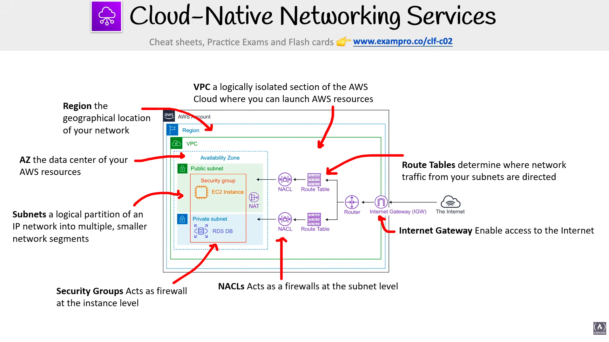

# Networks

> **Exam:** AWS Certified Cloud Practitioner (CLF-C02)
> **Topic 8:** **AWS Networking** — how AWS lets you carve out your *own* private, isolated piece of the AWS Cloud and control exactly how traffic flows in, out, and within it. The CLF-C02 exam doesn't ask you to *configure* networks, but it **loves** to test *which component does what* — especially the classic traps **Security Group vs NACL** and **Route Table vs Internet Gateway**.

Think of AWS networking as building your own private data center *inside* AWS. You get a fenced-off section of the cloud (a **VPC**), you split it into rooms (**subnets**), you decide which rooms face the street and which stay locked away (**public vs private**), you post guards at the doors (**Security Groups & NACLs**), and you put up signposts telling traffic where to go (**Route Tables**) with a gate to the outside world (**Internet Gateway**). Get this mental picture and the whole topic clicks.

Beyond the VPC itself, the exam also covers how you **connect networks** (Direct Connect, VPN, VPC Peering, Transit Gateway), reach AWS services **privately** (Endpoints/PrivateLink), and serve users **globally** at the edge (**Route 53** DNS, **CloudFront** CDN, **Global Accelerator**, plus edge security **WAF/Shield**). Those are all here too.

---

## 1. The Big Picture — Cloud-Native Networking Services

The diagram shows how the core building blocks nest inside each other and work together:

| Component | One-line role | Lives at the level of… |
|---|---|---|
| **Region** | The **geographical location** of your network | Global → contains everything below |
| **Availability Zone (AZ)** | The **data center** that holds your AWS resources | Inside a Region |
| **VPC** (Virtual Private Cloud) | A **logically isolated section of the AWS Cloud** where you launch resources | Spans AZs *within one Region* |
| **Subnet** | A **logical partition of an IP network** into smaller segments | Inside **one** AZ |
| **Security Group** | Acts as a **firewall at the *instance* level** | Wrapped around resources (e.g. EC2) |
| **NACL** (Network ACL) | Acts as a **firewall at the *subnet* level** | Boundary of a subnet |
| **Route Table** | **Determines where network traffic from your subnets is directed** | Attached to subnets |
| **Internet Gateway (IGW)** | **Enables access to the Internet** | Attached to the VPC |

> **Read the diagram inside-out:** Region ➝ AZ ➝ VPC ➝ Subnets ➝ resources (EC2/RDS), guarded by Security Groups (instance) and NACLs (subnet), with Route Tables + an Internet Gateway steering traffic to/from the internet.

---

## 2. VPC — Your Private Slice of the Cloud

A **Virtual Private Cloud (VPC)** is a **logically isolated** section of the AWS Cloud that *you* control. It's the outer boundary inside which everything else lives.

- **Region-bound:** a VPC exists in **one Region** but can stretch across **multiple AZs** in that Region (this is how you build high availability — see [[02_Cloud_Architecture]]).
- **Isolated by default:** nothing gets in or out unless *you* configure a route for it.
- You define the **IP address range** (CIDR block) and then chop it into subnets.

**Analogy:** the VPC is the **fenced-off plot of land** you've leased inside AWS's giant property. The fence keeps everyone else out; what you build inside is up to you.

---

## 3. Availability Zones & Subnets

- **Availability Zone (AZ):** the actual **data center** location where resources physically run. Spreading subnets across multiple AZs is what gives you fault tolerance.
- **Subnet:** a **logical partition** of your VPC's IP range into smaller segments. **Each subnet lives in exactly one AZ.**

### Public vs Private subnets — a top exam concept

| | **Public Subnet** | **Private Subnet** |
|---|---|---|
| **Internet reachable?** | **Yes** — has a route to the **Internet Gateway** | **No** direct route to the internet |
| **Typical resident** | Web servers, **EC2** behind a load balancer, **NAT** | **Databases (RDS)**, app/back-end servers |
| **In the diagram** | EC2 instance + NAT | RDS DB instance |

> A subnet is "public" **only because its Route Table sends traffic to an Internet Gateway** — there's no "public" checkbox. The route is what makes it public.

**NAT (NAT Gateway):** sits in the **public** subnet and lets resources in a **private** subnet reach **out** to the internet (e.g. to download updates) **without** allowing the internet to initiate connections **in**. One-way out.

---

## 4. VPC & Subnets Deep-Dive — CIDR & IP Addressing

When you create a VPC you don't just get an empty box — you **choose its range of IP addresses using a CIDR range**. Subnets then carve smaller IP ranges out of that.

### CIDR — how the address ranges work
- A **VPC** picks a **CIDR range**, e.g. **`10.0.0.0/16` = 65,536 IP addresses**.
- **Subnets** break up that IP range into **multiple smaller network segments** — *"you are breaking up your IP range for the VPC into smaller networks."*
- A **subnet must have a *smaller* CIDR range than the VPC** (it represents *part* of it), e.g. **`10.0.0.0/24` = 256 IP addresses**.

> **CIDR rule of thumb:** the **bigger the `/number`, the smaller the network.** `/16` (65,536 IPs) is a large VPC range; `/24` (256 IPs) is a small subnet slice. The number after the slash = how many bits are **fixed**, so more bits ⇒ fewer free addresses.

| Scope | Example CIDR | Usable size |
|---|---|---|
| **VPC** | `10.0.0.0/16` | **65,536** IP addresses |
| **Subnet** | `10.0.0.0/24` | **256** IP addresses |

### Public vs Private subnet (recap, from this slide)
- **Public Subnet** = a subnet that **can reach the internet**.
- **Private Subnet** = a subnet that **cannot reach the internet**.

(See §3 for *why* — it comes down to whether the subnet's Route Table points at the Internet Gateway.)

---

## 5. Firewalls — Security Groups vs NACLs ⭐

This is **the** most-tested networking comparison on CLF-C02. Memorise this table cold.

| | **Security Group** | **Network ACL (NACL)** |
|---|---|---|
| **Operates at** | **Instance level** (e.g. an EC2) | **Subnet level** |
| **Stateful or stateless?** | **Stateful** — return traffic is auto-allowed | **Stateless** — you must allow return traffic explicitly |
| **Rules** | **Allow rules only** | **Allow *and* Deny** rules |
| **Default behaviour** | **Implicitly denies all traffic** (deny all inbound, allow all outbound) | Default NACL allows all in & out |
| **Can block a single IP?** | **No** — you cannot block one specific IP | **Yes** — can **Deny** a specific IP |
| **Typical example** | Allow an EC2 instance access **on port 22 for SSH** | **Block a specific IP address known for abuse** |
| **Think of it as** | A guard checking **each person at the door of the instance** | A guard checking **everyone entering the whole building (subnet)** |

### The two examples the exam loves
- **Security Group** → *"Allow an EC2 instance access on port 22 for SSH."* Because SGs are **allow-only**, you **cannot** use one to **block a single bad IP** — there's no deny rule.
- **NACL** → *"Block a specific IP address known for abuse."* Because NACLs have **Deny** rules and sit at the subnet edge, they're the right tool to **block** an attacker's IP.

> **Mnemonic:** **S**ecurity Group = **S**tateful + **S**ingle instance + **A**llow-only. NACL = **N**etwork-wide (subnet) + can say **N**o (deny → block bad IPs).

---

## 6. Routing — Route Tables, Routers & Internet Gateway

- **Route Table:** a set of rules that **determines where network traffic from your subnets is directed**. Each subnet is associated with a route table. Adding a route to the IGW is what turns a subnet **public**.
- **Router:** moves traffic *between* subnets and toward the route table's targets (shown in the centre of the diagram).
- **Internet Gateway (IGW):** the VPC's **doorway to the internet** — it **enables access to the Internet** for resources whose route table points to it. Highly available and horizontally scalable by design; one per VPC.

**Flow to remember:** Subnet ➝ Route Table (where do I send this?) ➝ Router ➝ Internet Gateway ➝ Internet.

---

## 7. Enterprise / Hybrid Networking — Connecting On-Premise to AWS

Most companies don't move to AWS overnight — they run a **hybrid** setup where their existing **on-premise data center** must talk to resources inside an AWS **VPC**. AWS gives **three** ways to make that connection, and the exam wants you to tell them apart by their **defining trait**.

| Service | What it is | Travels over the…  | Remember it for… |
|---|---|---|---|
| **AWS Direct Connect** | A **dedicated gigabit network connection** from your **on-premise data center straight to AWS** | **Private dedicated line** (not the internet) | **Speed & consistency** — "a very fast connection" |
| **AWS VPN** (Virtual Private Network) | A **secure, encrypted connection** between **on-premise, remote offices, and mobile employees** and AWS | **Public internet** (encrypted tunnel) | **Secure but uses the internet** — quick & cheap to set up |
| **AWS PrivateLink** (VPC **Interface Endpoints**) | **Keeps traffic *within* the AWS network** instead of the internet to keep it secure | **AWS private network** (never the internet) | Private access to a service **without** exposing traffic to the internet |

### How to tell them apart (the exam angle)
- **Direct Connect** → the keyword is **"dedicated"** physical connection. Fastest and most consistent, but takes time/money to provision. Think: a **private leased highway** from your building to AWS.
- **VPN** → the keyword is **"encrypted tunnel over the internet."** Connects offices and **mobile/remote employees** too. Think: a **secure courier** driving on the public road.
- **PrivateLink** → the keyword is **"keep traffic *inside* the AWS network."** Used to reach AWS/partner services privately. Think: an **internal hallway** — you never step outside.

> **Direct Connect vs VPN trap:** both link on-premise to AWS, but **Direct Connect = dedicated private line (speed)**, **VPN = encrypted tunnel over the public internet (cheap/fast to deploy)**. They're often **combined** (VPN over Direct Connect) for an encrypted *and* dedicated path.

This builds on the hybrid concepts from [[01_AWS_Global_Infrastructure]] (Direct Connect locations) and the high-availability thinking in [[02_Cloud_Architecture]].

---

## 8. Connecting VPCs & Reaching AWS Services Privately

Beyond on-premise links, the exam expects you to recognise how **VPCs talk to each other** and how resources reach **AWS services without using the public internet**.

| Service | What it does | Exam keyword |
|---|---|---|
| **VPC Peering** | A **private 1-to-1 connection between two VPCs** so they route traffic as if on the same network | "**connect two VPCs**" / point-to-point |
| **Transit Gateway** | A **central hub** that connects **many VPCs and on-premise networks** together (replaces a mess of peering links) | "**hub-and-spoke**" / "connect **hundreds** of VPCs" |
| **VPC Endpoint — Gateway type** | Private access to **S3 and DynamoDB** only, via a route-table entry. **Free.** | "reach **S3/DynamoDB** privately, no internet" |
| **VPC Endpoint — Interface type (PrivateLink)** | Private access to **most other AWS services** via an elastic network interface (ENI). Hourly cost. | "reach an AWS service privately" (not S3/DynamoDB) |

> **Peering vs Transit Gateway:** Peering is **one-to-one** and does **not** route transitively (A↔B and A↔C does *not* give B↔C). **Transit Gateway** is the **one-to-many hub** that solves that at scale.
>
> **Gateway vs Interface endpoint:** **Gateway = S3 & DynamoDB only (free)**; **Interface/PrivateLink = everything else (uses an ENI).** This is a classic distractor pair.

---

## 9. DNS — Amazon Route 53

**Amazon Route 53** is AWS's **managed DNS** (Domain Name System) service — it **translates human-friendly domain names (e.g. `example.com`) into IP addresses**. The name comes from DNS port **53**.

What it does (CLF-C02 level):
- **Domain registration** — buy and manage domain names directly in AWS.
- **DNS resolution** — answer `name → IP` lookups for your domains (hosted zones).
- **Health checks** — monitor endpoints and **route around unhealthy ones**, supporting HA/DR.
- **Routing policies** — decide *which* IP to return: **Simple, Weighted, Latency-based, Failover, Geolocation**.

| Routing policy | Sends users to… |
|---|---|
| **Simple** | One record / basic round-robin |
| **Weighted** | Split traffic by % (e.g. A/B testing, gradual rollout) |
| **Latency-based** | The Region with the **lowest latency** for that user |
| **Failover** | A **standby** site if the primary fails (active-passive DR) |
| **Geolocation** | A site based on the **user's location** |

> **Exam cue:** any mention of **"DNS," "domain name," "route users to the nearest/healthy Region"** → **Route 53**. Pairs naturally with [[01_AWS_Global_Infrastructure]] (Regions) and ELB.

---

## 10. Edge Networking — CloudFront, Global Accelerator & Friends

These services use AWS's global **Edge Locations** (see [[01_AWS_Global_Infrastructure]]) to bring content and entry points **closer to users** for speed and protection.

| Service | One-liner | Exam keyword |
|---|---|---|
| **Amazon CloudFront** | **Content Delivery Network (CDN)** — **caches content at Edge Locations** near users for low-latency delivery | "**CDN**" / "cache content closer to users" / "reduce latency for static content" |
| **AWS Global Accelerator** | Routes user traffic over the **AWS global network** via the **nearest edge** to your app, with **static anycast IPs** | "improve **performance/availability** of a **non-HTTP** app" / "static IPs" |
| **Amazon API Gateway** | Fully managed **front door to create, publish & secure APIs** (REST/HTTP/WebSocket) | "managed **API** front-end" / "expose Lambda as an API" |
| **AWS WAF** | **Web Application Firewall** — filters HTTP(S) at layer 7 (blocks SQL injection, XSS, bad IPs) | "protect a **web app** from common exploits" |
| **AWS Shield** | **DDoS protection** (Standard = free/automatic; Advanced = paid, 24/7 + cost protection) | "**DDoS** attack protection" |

> **CloudFront vs Global Accelerator:** **CloudFront caches content** (great for static/cacheable web content & media). **Global Accelerator does *not* cache** — it **optimises the network path** to your application (great for gaming, IoT, VoIP, non-HTTP traffic) and gives you **fixed entry IPs**.
>
> **WAF vs Shield vs Security Group/NACL:** **WAF** = layer-7 web exploits; **Shield** = DDoS (volumetric) attacks; **SG/NACL** = your in-VPC firewalls. Different layers, different jobs.

---

## 11. Exam Triggers

| If the question says… | The answer is… |
|---|---|
| "logically isolated section of the AWS Cloud" | **VPC** |
| "firewall at the **instance** level" / "stateful" / "allow rules only" / "allow SSH on port 22" | **Security Group** |
| "firewall at the **subnet** level" / "stateless" / "allow **and** deny" / "**block a specific/bad IP**" | **NACL** |
| "determines where network traffic is directed" | **Route Table** |
| "enable access to the internet" / "doorway to the internet" | **Internet Gateway** |
| "let a **private** subnet reach the internet but block inbound" | **NAT Gateway** |
| "geographical location" of resources | **Region** |
| "data center" for resources / high availability across data centers | **Availability Zone** |
| "choose a **range of IPs**" / "CIDR range" for the VPC | **CIDR block** (e.g. `/16` ⇒ 65,536 IPs) |
| "subnet must have a **smaller CIDR** than the VPC" | True — subnet `/24` (256 IPs) ⊂ VPC `/16` |
| "**dedicated** gigabit connection from on-premise to AWS" / fastest, most consistent | **Direct Connect** |
| "secure **encrypted** connection over the **internet**" / remote/mobile employees | **VPN** |
| "keep traffic **within the AWS network**" / private access without the internet | **PrivateLink** (VPC Interface Endpoint) |
| "connect **two VPCs**" point-to-point | **VPC Peering** |
| "connect **many VPCs / on-premise** through a central hub" | **Transit Gateway** |
| "reach **S3 / DynamoDB** privately (no internet), free" | **Gateway VPC Endpoint** |
| "**DNS**" / "domain registration" / "route users to nearest or healthy Region" | **Route 53** |
| "**CDN**" / "cache static content at edge / closer to users" | **CloudFront** |
| "improve performance of a **non-HTTP** app" / "**static anycast IPs**" | **Global Accelerator** |
| "managed **API** front door" / "expose Lambda as a REST API" | **API Gateway** |
| "protect a **web app** from SQL injection / XSS / common exploits" | **AWS WAF** |
| "**DDoS** protection" | **AWS Shield** |

---

## 12. Common Confusions to Nail

- **Security Group vs NACL** — *instance* vs *subnet*, *stateful* vs *stateless*, *allow-only* vs *allow+deny*. This is the #1 trap. **Only a NACL can block a specific/bad IP** (SGs have no deny rule); SGs handle things like *allow SSH on port 22*.
- **Route Table vs Internet Gateway** — the Route Table is the *signpost* (rules); the IGW is the *actual gate* to the internet. A subnet is public because the **route table** points at the **IGW**.
- **Public vs Private subnet** — there's no setting called "public." Public = "has a route to the IGW."
- **Internet Gateway vs NAT Gateway** — IGW = two-way internet access for public subnets; NAT = **outbound-only** access for private subnets.
- **VPC vs Subnet** — VPC spans a whole **Region** (multiple AZs); a subnet lives in **one AZ**.
- **CIDR `/number` direction** — a **bigger** slash number = a **smaller** network. `/16` = 65,536 IPs (VPC-size), `/24` = 256 IPs (subnet-size). Subnet CIDR is always **smaller** than its VPC's.
- **Direct Connect vs VPN** — both connect on-premise to AWS, but **Direct Connect = dedicated private line (speed)**, **VPN = encrypted tunnel over the public internet (cheap/quick)**.
- **VPN vs PrivateLink** — VPN connects *you/on-premise* to AWS **over the internet**; PrivateLink keeps service traffic **inside the AWS network** (never the internet).
- **VPC Peering vs Transit Gateway** — Peering = **one-to-one**, non-transitive; Transit Gateway = **one-to-many hub** for many VPCs/on-premise.
- **Gateway vs Interface endpoint** — **Gateway = S3 & DynamoDB only (free)**; **Interface/PrivateLink = all other services (uses an ENI, hourly cost)**.
- **CloudFront vs Global Accelerator** — CloudFront **caches content** at edge (CDN, static/web); Global Accelerator **doesn't cache** — it optimises the **network path** + gives **static IPs** (best for non-HTTP apps).
- **Route 53 vs ELB** — Route 53 is **DNS** (which IP/Region to send a user to); ELB **distributes traffic across instances** inside a Region. They work together, not interchangeably.
- **WAF vs Shield** — **WAF** = layer-7 web exploits (SQLi/XSS); **Shield** = **DDoS** protection. Neither replaces your **SG/NACL** VPC firewalls.

---

## Quick Revision Cheat Sheet

| Component | Level | Job | Key fact |
|---|---|---|---|
| **Region** | Global | Geographic location | Contains AZs |
| **Availability Zone** | Region | Data center | Each subnet = 1 AZ |
| **VPC** | Region | Isolated cloud section | Spans AZs in one Region |
| **Subnet** | AZ | Partition of IP range | Public (route to IGW) vs Private; **smaller CIDR than VPC** |
| **CIDR** | VPC & Subnet | Defines IP range | `/16` = 65,536 IPs; `/24` = 256 IPs |
| **Security Group** | Instance | Firewall | **Stateful**, allow-only |
| **NACL** | Subnet | Firewall | **Stateless**, allow + deny |
| **Route Table** | Subnet | Directs traffic | Route to IGW ⇒ subnet is public |
| **Internet Gateway** | VPC | Internet access | One per VPC, highly available |
| **NAT Gateway** | Public subnet | Outbound-only internet for private subnets | Blocks inbound |
| **Direct Connect** | On-premise ↔ AWS | Dedicated private line | **Fast/consistent**, not over internet |
| **VPN** | On-premise/remote ↔ AWS | Encrypted tunnel | Secure but **over the internet** |
| **PrivateLink** | Within AWS | Private service access | Keeps traffic **inside the AWS network** |
| **VPC Peering** | VPC ↔ VPC | Connect 2 VPCs | One-to-one, **non-transitive** |
| **Transit Gateway** | Many VPCs/on-prem | Central network hub | One-to-many, scales to hundreds |
| **VPC Endpoint (Gateway)** | Within AWS | Private S3/DynamoDB access | **S3 & DynamoDB only, free** |
| **Route 53** | Global | **DNS** + domain registration | Routing policies, health checks |
| **CloudFront** | Edge | **CDN** — caches content | Low latency, static/web content |
| **Global Accelerator** | Edge | Optimise network path | **No caching**, static anycast IPs |
| **API Gateway** | Regional | Managed **API** front door | REST/HTTP/WebSocket |
| **AWS WAF** | Layer 7 | Web app firewall | Blocks SQLi/XSS/bad IPs |
| **AWS Shield** | Edge | **DDoS** protection | Standard free; Advanced paid |

### Top exam points to remember
1. **VPC = logically isolated section of the AWS Cloud**, lives in one **Region**, spans **multiple AZs**.
2. **Security Group = instance-level, stateful, allow-only** (e.g. allow SSH on port 22; **cannot block a single IP**). **NACL = subnet-level, stateless, allow + deny** (e.g. **block a bad IP**).
3. A subnet is **public** only because its **Route Table** has a route to the **Internet Gateway**.
4. **Internet Gateway** = two-way internet for public subnets; **NAT Gateway** = outbound-only for private subnets.
5. **Route Table determines where traffic goes; Internet Gateway is the door to the internet.**
6. **CIDR:** a VPC picks an IP range via CIDR (`10.0.0.0/16` = 65,536 IPs); subnets carve out **smaller** ranges (`/24` = 256 IPs). Bigger `/number` ⇒ smaller network.
7. **Hybrid connectivity:** **Direct Connect** = dedicated private line (speed); **VPN** = encrypted tunnel over the internet; **PrivateLink** = keep traffic inside the AWS network.
8. **VPC interconnect:** **Peering** = one-to-one; **Transit Gateway** = one-to-many hub; **Gateway Endpoint** = free private S3/DynamoDB access.
9. **Route 53 = DNS** (domain registration, health checks, latency/failover/geo routing).
10. **Edge:** **CloudFront** = CDN that **caches** content near users; **Global Accelerator** = optimises the network path (no cache, static IPs); **API Gateway** = managed API front door.
11. **Edge security:** **WAF** = web exploits (layer 7); **Shield** = DDoS. Distinct from in-VPC **SG/NACL** firewalls.
