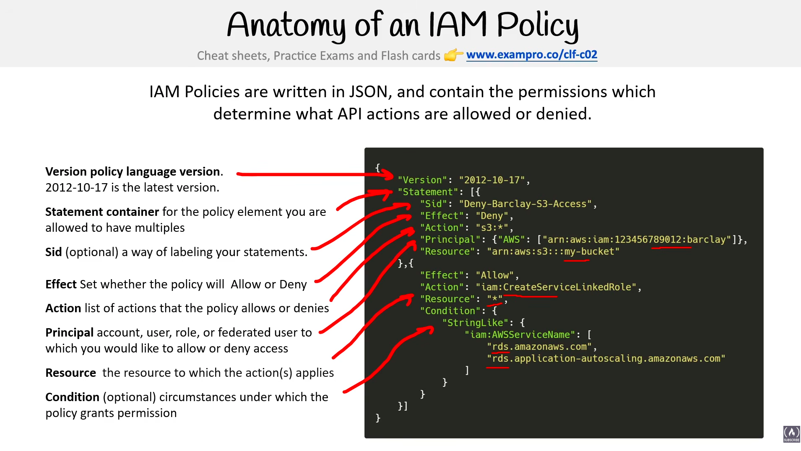

# Identity

> **Exam:** AWS Certified Cloud Practitioner (CLF-C02)
> **Topic 10:** **Identity** — *who* a user or service is, and *how* AWS proves and trusts that identity. This sits right next to IAM (which is about *permissions* — what an identity is allowed to do). On the exam, "identity" questions are usually about **where the user's identity actually lives** (in AWS? in your corporate directory? in Google/Facebook?) and **how AWS trusts a login that happened somewhere else**.

Every secure system has to answer one question before anything else: *"who are you, and can I trust that?"* The foundation in AWS is **IAM (Identity & Access Management)** — where you create users, groups, and roles and grant them permissions. But real organisations already have **thousands of identities** in a corporate directory (like Microsoft Active Directory), and users sign in to **dozens of apps**. Re-creating all those users inside IAM would be a nightmare to manage and a security risk. So AWS also leans heavily on **federation** — *trusting an identity that lives elsewhere* — and on a modern security philosophy called **Zero Trust**. This topic covers the building blocks: **IAM**, the Zero Trust model, Identity Providers, Active Directory, AWS Directory Service, Single Sign-On, and MFA.

> **Two halves of the question:** **Identity = who you are** (authentication). **Permissions = what you can do** (authorization). **IAM covers both** — it holds the identities *and* the policies that grant access. Cross-links to the Shared Responsibility Model ([[aws-notes-convention]] Topic 04) — managing identities and access is **always the customer's responsibility**.

---

## 1. IAM — Identity & Access Management

**AWS Identity and Access Management (IAM)** is the service that controls **who can do what** in your AWS account. It's a **global**, **free** service, and it's where every access decision starts. Two jobs in one:

- **Authentication** — *who are you?* (the identity: user, group, role)
- **Authorization** — *what are you allowed to do?* (the permissions: policies)

### The core building blocks (the "principals" and policies)

| Component | What it is | Think |
|---|---|---|
| **Root user** | The account's all-powerful owner (the email you signed up with). Can do **anything**. | **Lock it away** — enable MFA, don't use it day-to-day (see §2) |
| **IAM User** | A **person or application** with long-term credentials (password and/or access keys) | A named individual |
| **IAM Group** | A **collection of users** — attach a policy once, everyone in the group inherits it | A team / job role |
| **IAM Role** | An identity with permissions that is **assumed temporarily** — no long-term credentials; used by **services, EC2 instances, or federated users** | A **hat you put on** for a task |
| **IAM Policy** | A **JSON document** listing the permissions (allow/deny). Attached to users, groups, or roles | The **rulebook** |

> **User vs Role — the #1 IAM distinction:** a **user** has **permanent** credentials and is usually a **person**. A **role** has **no permanent credentials** — it's **assumed temporarily** and hands back **temporary** credentials, used by **AWS services (e.g. an EC2 instance accessing S3), or federated/cross-account access**. *"Grant an EC2 instance / Lambda access to S3"* → **IAM Role**, never store keys on the instance.

### Best-practice principles (exam favourites)
- **Least privilege** — grant only the permissions actually needed.
- **Use roles, not long-term keys**, for applications and AWS services.
- **Enable MFA**, especially on the **root user** (see §8).
- **Don't use the root user** for everyday tasks; create IAM users/roles instead (see §2).
- IAM is **deny by default** — nothing is allowed until a policy explicitly allows it, and **an explicit `Deny` always wins** over any allow.

### Anatomy of an IAM Policy

This is the one IAM detail worth knowing in depth: **IAM policies are written in JSON**, and they list the permissions that **allow or deny** specific API actions.

A policy is a JSON document made of these elements:

| Element | Required? | What it does |
|---|---|---|
| **Version** | Yes | The **policy language version** — use the latest, `"2012-10-17"`. (Not the date you wrote it — a fixed version string.) |
| **Statement** | Yes | The **container** for the policy's permission rule(s). A policy can hold **multiple** statements. |
| **Sid** | Optional | **Statement ID** — an optional **label** to name/identify a statement. |
| **Effect** | Yes | Either **`Allow`** or **`Deny`** — whether this statement grants or blocks access. |
| **Action** | Yes | The **list of API actions** the policy allows or denies (e.g. `s3:*`, `iam:CreateServiceLinkedRole`). |
| **Principal** | Sometimes | The **user, account, service, or federated identity** the policy applies to (or who is *denied* access). Used in **resource-based** policies (e.g. an S3 bucket policy), not identity-based ones. |
| **Resource** | Yes* | The **resource(s)** the actions apply to, identified by **ARN** (e.g. `arn:aws:s3:::my-bucket`). `*` = all resources. |
| **Condition** | Optional | **Circumstances** under which the policy applies (e.g. `aws:SourceVpc`, only from a certain IP, only if MFA present). |

> **How to read a statement:** *"**Effect**: Allow/Deny **Action** X on **Resource** Y (for **Principal** Z) **when Condition** C is true."* That one sentence is the whole model.

> **Exam triggers for policy anatomy:**
> - *"`Effect`, `Action`, `Resource`"* → core elements of an **IAM policy** (JSON).
> - *"`"Version": "2012-10-17"`"* → the **policy language version** (always recognise this string).
> - *"Specifies **who** the policy applies to"* → **`Principal`** (resource-based policies).
> - *"Restrict by IP / require MFA / time of day"* → **`Condition`**.
> - **Explicit `Deny` beats any `Allow`.**

---

## 2. The Root User & Root Account

When you **first create an AWS account**, AWS creates one special identity: the **root user**. It is the **original owner of the account**, identified by the **email address you signed up with**, and it has **complete, unrestricted access to everything** — every service, every resource, and all **billing/account settings**. There is exactly **one** root user per account, and you **cannot delete it** (you'd have to close the whole account).

> **Root account vs root user (terminology):** people say "**root account**" loosely, but technically the **account** is the AWS account itself; the **root user** is the all-powerful login that owns it. The exam uses **"root user"** for the identity.

### Why the root user is dangerous
- It has **full administrative power that IAM policies cannot restrict** — you can't attach a policy to "limit" the root user. It always has everything.
- If its credentials leak, an attacker owns your **entire account** (and your bill).
- So AWS's #1 piece of identity advice: **don't use the root user for everyday work.**

### Root user best practices (exam favourites)
- **Enable MFA on the root user** (ideally a hardware **security key** — see §8).
- **Don't create access keys for the root user**; if any exist, **delete them**.
- **Create an IAM admin user/role** for daily administration and **lock the root credentials away**.
- Use a **strong, unique password** and a secure email address you control.
- Sign in as root **only** for the few tasks that *require* it (below).

### Tasks that ONLY the root user can perform
Most work should be done by IAM users/roles — but a short list of **account-level tasks can be done *only* by the root user** (these are classic CLF-C02 answers):

| Task | Why it's root-only |
|---|---|
| **Change the account name, root email address, or root password** | These are core account-identity settings |
| **Change your AWS Support plan** (e.g. Basic → Business) | Account-level commercial change |
| **Close the AWS account** | Only the owner can shut it down |
| **Change/cancel/manage account-level settings** | Owner-only control |
| **Restore IAM user permissions** if an admin accidentally revokes their own access | Root is the break-glass identity |
| **Activate IAM access to the Billing & Cost Management console** | Grants IAM users visibility into billing |
| **Register as a seller in the Reserved Instance Marketplace** | Account-level commercial action |
| **Enable MFA Delete on an S3 bucket** (and fix certain invalid S3 bucket/VPC policies) | Requires root credentials |
| **Sign up for AWS GovCloud** | Account-level enrolment |

> **Exam framing:** if a scenario asks *"which task requires the root user?"* → think **account-wide / billing / support-plan / close-account / restore-lost-admin-access** tasks. If it's *"create users, grant S3 access, launch EC2"* → that's an **IAM user/role**, **not** root.

> **Mental hook:** the root user is the **master key to the building.** You use it to **set up the locks and hand out keys (IAM users/roles)**, then you **put the master key in a safe** and only take it out for the handful of things normal keys can't open.

---

## 3. The Zero Trust Model

**Zero Trust** is a security model built on one blunt principle:

> **"Never trust, always verify."**

The old way of thinking was the **castle-and-moat** model: build a strong perimeter (firewall / corporate network), and once you're *inside* the network, you're trusted by default. The problem: if an attacker gets through the perimeter — or is an insider — they can move around freely because everything inside trusts everything else.

**Zero Trust throws out the idea of a trusted internal network.** It assumes the network is **already hostile** and verifies **every single request** on its own merits, regardless of where it came from.

### Core principles

| Principle | Meaning |
|---|---|
| **Verify explicitly** | Authenticate **every** request using all available signals (identity, device, location, behaviour) — not just "you're inside the network." |
| **Least-privilege access** | Give each identity the **minimum permissions** needed, just-in-time. (This is the IAM least-privilege idea applied everywhere.) |
| **Assume breach** | Design as if attackers are **already inside**. Segment everything, encrypt everything, log everything, limit blast radius. |

### How it shows up in AWS
Zero Trust isn't a single product you buy — it's an **approach** you implement using existing services:

- **IAM & IAM Identity Center** — strong identity, least-privilege policies, MFA.
- **VPC segmentation, Security Groups, NACLs** — micro-segment the network so reaching one resource doesn't grant reaching others.
- **AWS PrivateLink / VPC endpoints** — let services talk **without traversing the public internet**, identity-verified.
- **AWS Verified Access** — provides secure access to corporate apps **without a VPN**, evaluating identity + device on every request.
- **Encryption everywhere** (in transit and at rest) and **logging** (CloudTrail) to support "assume breach."

> **Exam framing:** if a question describes *"don't trust the network, verify every request, even from inside"* or *"secure access without a traditional VPN perimeter"* → **Zero Trust**. It is a **mindset/strategy**, not one specific service.

---

## 4. Identity Providers (IdP) & Federation

An **Identity Provider (IdP)** is the **system that stores and verifies user identities** — the thing that actually checks your password/MFA and says *"yes, this really is Harsh."* Examples: Microsoft Active Directory, Okta, Google, Facebook, Amazon, Apple, or AWS's own IAM Identity Center.

**Federation** is the magic word: it means **trusting identities from an external IdP** so users can access AWS **without a separate AWS (IAM) user account**. The user logs in *once* with their existing credentials, and AWS trusts that login.

> **The big idea:** instead of creating IAM users for everyone, you **federate** — let people sign in with the identity they *already have* (corporate AD login, Google account, etc.), and AWS grants them temporary credentials.

### Why federate?
- **No duplicate accounts** — don't re-create your 5,000 corporate users inside IAM.
- **Single source of truth** — when someone leaves the company, you disable them in **one** place (the corporate directory) and AWS access dies too.
- **Better security** — fewer long-lived credentials; federated logins use **temporary** credentials.

### The two federation standards (know these names)

| Standard | Full name | Used for | Think |
|---|---|---|---|
| **SAML 2.0** | Security Assertion Markup Language | **Enterprise / corporate** federation — connecting **Active Directory**, Okta, etc. to AWS | "My **company** logs me in" |
| **OIDC / OAuth 2.0** | OpenID Connect | **Web & mobile app** federation — sign in with **Google/Facebook/Apple** | "My **social/web** account logs me in" |

### Key AWS services for identity & federation

| Service | What it does | Audience |
|---|---|---|
| **AWS IAM Identity Center** (formerly **AWS SSO**) | Central place to manage **workforce** SSO and access to multiple AWS accounts + business apps | **Employees** (workforce) — see §7 |
| **Amazon Cognito** | Adds **sign-up / sign-in** to **your own web & mobile apps**; federates with social + enterprise IdPs; scales to millions | **Your app's end users** (customers) |
| **IAM Identity Providers** (SAML/OIDC in IAM) | Lets you wire an external IdP directly into IAM to **assume roles** | Programmatic / role-based federation |

> **Exam trap — Cognito vs IAM Identity Center:**
> - **Customer-facing app** needs login ("let users sign up for *my* mobile app", "sign in with Google/Facebook", scale to millions of users) → **Amazon Cognito**.
> - **Your employees** need to access **AWS accounts/console** and internal apps with one corporate login → **IAM Identity Center**.

---

## 5. Active Directory (AD)

**Microsoft Active Directory (AD)** is the **directory service that dominates corporate IT.** It's the system most companies already use to store users, groups, computers, and permissions, and to handle login across all the Windows machines and apps in the organisation. It is **not** an AWS product — it's Microsoft's — but the exam expects you to know what it is because AWS integrates with it heavily.

### What AD does
- Stores **identities** (users, groups) and **objects** (computers, printers) in a central database.
- Handles **authentication** (verifying logins) and **authorization** (group-based access).
- Powers **single sign-on within the corporate network** — log into Windows once, reach many internal resources.

### Key terms
| Term | Meaning |
|---|---|
| **AD DS** (Active Directory Domain Services) | The core, **on-premises** AD role that runs the directory on a **domain controller**. |
| **Domain Controller** | The server that runs AD and answers authentication requests. |
| **LDAP** | The protocol used to query/talk to a directory like AD. |
| **Kerberos** | The protocol AD uses to authenticate users securely. |
| **Azure AD / Microsoft Entra ID** | Microsoft's **cloud** version of directory/identity (don't confuse with on-prem AD DS). |

> **Why it matters for AWS:** because so many enterprises run AD, AWS gives you ways to **extend or connect** that existing AD to the cloud rather than rebuilding identities. That's what **AWS Directory Service** (§6) is for.

### LDAP — the language for talking to a directory

**LDAP (Lightweight Directory Access Protocol)** is the **standard protocol for reading from and writing to a directory.** If a directory (like AD) is the *database* of users, groups, and computers, then **LDAP is the query language / API** you use to look things up in it — *"find the user `harsh`", "list everyone in the `Developers` group", "check this password."*

Key points for the exam:

- **LDAP is a protocol / open standard — not a product.** Active Directory **speaks** LDAP; so do many non-Microsoft directories (OpenLDAP, Linux directories). It's **vendor-neutral**.
- **Directory ≠ protocol.** The **directory** (AD, Simple AD) is *where the data lives*; **LDAP** is *how you talk to it*. Don't confuse the store with the protocol.
- **Hierarchical structure.** A directory is organised as a **tree** — entries identified by a **Distinguished Name (DN)**, e.g. `cn=harsh,ou=Developers,dc=example,dc=com` (`cn`=common name, `ou`=organizational unit, `dc`=domain component). You don't need to memorise the syntax for CLF-C02, just recognise it's a **tree of entries**.
- **LDAPS = LDAP over SSL/TLS** — the **encrypted** version (port 636 vs plain LDAP's 389). Prefer LDAPS so credentials aren't sent in clear text. *(Ports aren't tested, but "LDAPS = secure LDAP" is worth knowing.)*
- **Where it shows up in AWS:** **Simple AD** and **AWS Managed Microsoft AD** support LDAP/LDAPS, so Linux/third-party apps that authenticate via LDAP can use them. Authentication in AD typically uses **Kerberos**, while **LDAP** is used for **directory queries / lookups** — they're complementary.

> **LDAP vs Kerberos (easy mix-up):** **LDAP** = *querying the directory* (find/read/write entries). **Kerberos** = *authenticating* a user (proving who they are via tickets). AD uses **both**: Kerberos to log you in, LDAP to look things up.

---

## 6. AWS Directory Service

**AWS Directory Service** is AWS's family of **managed directory** offerings — a way to run or connect to **Active Directory (and other directories) in the AWS cloud** without managing the servers yourself. You pick the option based on whether you need a **full AWS-managed AD**, just a **bridge to your existing on-prem AD**, or a **lightweight standalone** directory.

### The three main options (know the differences)

| Option | What it is | When to use |
|---|---|---|
| **AWS Managed Microsoft AD** | A **real, full Microsoft Active Directory** managed by AWS, running in your VPC. Supports AD-aware apps, trust relationships with on-prem AD, Group Policy. | You want **actual AD features** in the cloud, or to **extend / trust** your on-prem AD. The "full power" option. |
| **AD Connector** | A **proxy / redirector** — no directory of its own. It **forwards** authentication requests from AWS back to your **existing on-premises AD**. | You want AWS services to use your **on-prem AD** for login **without** copying users into the cloud. A **gateway**, not a store. |
| **Simple AD** | A **lightweight, standalone, Linux-based** directory (Samba) that is **AD-compatible** for basic needs. **Not** full Microsoft AD. | Small workloads needing **basic** directory features (user accounts, group policies, Linux apps) and **no** on-prem AD dependency. Cheapest. |

### Quick decision cues
- *"Full Microsoft AD features / trust with on-prem / AD-dependent apps in the cloud"* → **AWS Managed Microsoft AD**.
- *"Use my **existing on-premises** AD, don't store anything in AWS, just proxy logins"* → **AD Connector**.
- *"Small, simple, standalone, cheap, basic features"* → **Simple AD**.

> **Exam trap:** **AD Connector ≠ a directory.** It stores no users — it's a **redirector** to your on-prem AD. If the scenario says *"I already have on-prem AD and just want AWS to authenticate against it,"* the answer is **AD Connector**, not Managed Microsoft AD.

---

## 7. Single Sign-On (SSO) — AWS IAM Identity Center

**Single Sign-On (SSO)** means a user **logs in once** with one set of credentials and then reaches **many applications and accounts** without logging in again to each one. It's the convenience-and-security combo: fewer passwords for users, central control for admins.

In AWS, SSO is delivered by **AWS IAM Identity Center** — **the new name for AWS Single Sign-On (AWS SSO)**. The exam may use either name; **they are the same service.**

### The slide in one line
**AWS Single Sign-On is where you create — or connect — your workforce identities in AWS *once*, and manage their access centrally across your whole AWS organization.** Three things to take from the slide:

**1. Choose your identity source** (where the identities actually live):
- **AWS SSO** — its own **built-in directory** (create users right here).
- **Active Directory** — connect your existing **corporate AD** (via AWS Directory Service).
- **SAML 2.0 IdP** — an external provider like **Okta / Azure AD (Entra)**.

**2. Manage user permissions centrally** — from one place, grant access to:
- **AWS accounts** (the consoles/roles across your AWS Organization),
- **AWS applications** (e.g. managed AWS apps), and
- **SAML applications** (business cloud apps + custom SAML apps built by you/partners).

**3. Users get single-click access** — after one login, the user sees a **portal of tiles** and clicks straight into any account or app they're entitled to, no re-login.

> **Use-case picture from the slide:** on-premises users/groups in a **corporate Microsoft Active Directory** → fed into **AWS SSO** → which then brokers **single-click access** out to **AWS consoles** (with permissions to each AWS account), **business cloud applications**, and **custom SAML applications**. AWS SSO is the **central broker** sitting between your directory and everything your workforce needs.

### What IAM Identity Center does
- **One login → many AWS accounts.** Especially powerful with **AWS Organizations** (multi-account setups): manage who can access which account/role from **one place**.
- **One login → business apps too** (Salesforce, Microsoft 365, etc.) via SAML.
- **Connects to an identity source:** its own **built-in directory**, your **Active Directory** (via Directory Service), or an **external IdP** (Okta, Azure AD/Entra) via SAML.
- **Permission sets** — define collections of permissions once and assign them to users/groups across accounts.

### IAM Identity Center vs IAM users
| | **IAM users** | **IAM Identity Center (SSO)** |
|---|---|---|
| **Scope** | One identity per account, long-lived credentials | **Central** identities across **many accounts** |
| **Best for** | Small/single-account setups, programmatic access | **Workforce** access at scale, multi-account orgs |
| **Credentials** | Long-lived (passwords/access keys) | **Temporary**, federated logins |
| **AWS recommendation** | Avoid creating many IAM users | **Preferred** modern approach for human/workforce access |

> **Exam framing:**
> - *"Employees sign in **once** to access **multiple AWS accounts** in our Organization"* → **IAM Identity Center** (AWS SSO).
> - *"Connect our **corporate Active Directory** so staff use existing credentials for AWS"* → **IAM Identity Center** + **AWS Directory Service**.
> - *"Old name **AWS Single Sign-On**"* → it's now **IAM Identity Center**.

> **SSO vs Federation vs IdP — how they relate:** an **IdP** *stores & verifies* identity (§3). **Federation** is *trusting* an external IdP. **SSO** is the *user experience* of logging in once to reach many things — usually **built on** federation. IAM Identity Center is the AWS service that delivers SSO for your workforce.

---

## 8. Multi-Factor Authentication (MFA) & Security Keys

A password alone is a **single factor** — anyone who steals it *is* you. **Multi-Factor Authentication (MFA)** fixes this by requiring **two or more** different types of proof before you're let in, so a stolen password isn't enough on its own. AWS **strongly recommends MFA on every account**, especially the **root user**.

### The three factors (an MFA combines at least two *different* ones)
| Factor | "Something you…" | Examples |
|---|---|---|
| **Knowledge** | **know** | password, PIN |
| **Possession** | **have** | phone authenticator app, **security key**, hardware token |
| **Inherence** | **are** | fingerprint, face, biometrics |

### What is a Security Key?
A **security key** is a small **physical device** (often USB-A/USB-C, sometimes NFC/Bluetooth) that you plug in or tap to prove **possession** — *"something you have."* Well-known examples: **YubiKey**, Google Titan. They implement the **FIDO2 / WebAuthn** open standards (the successor to the older **U2F**).

> **Why security keys are the strongest MFA:** they are **phishing-resistant.** The key cryptographically checks it's talking to the *real* AWS site before responding, so even if you're tricked onto a fake login page, the key won't hand over anything usable. Codes from an app (or SMS) **can** be typed into a fake site by a fooled user — a security key **can't be** in the same way.

### MFA options AWS supports
| MFA type | What it is | Notes |
|---|---|---|
| **Security key (FIDO2 / WebAuthn)** | Physical USB/NFC/Bluetooth key (e.g. YubiKey) | **Strongest / phishing-resistant.** Tap or plug in. |
| **Passkeys** | FIDO2 credentials stored on a phone/laptop/password manager | Newer; same standard as security keys, no separate dongle. |
| **Virtual MFA app** | Authenticator app generating a time-based code (TOTP) | e.g. Google Authenticator, Authy. Most common. |
| **Hardware TOTP token** | A small dedicated device that shows a rotating 6-digit code | A physical token, but **not** a FIDO2 security key. |

> **Security key vs virtual MFA — the distinction to hold:** both prove *"something you have."* A **virtual MFA app** shows a **code you type in** (phishable if you're fooled). A **security key** uses **cryptographic challenge-response** and is **phishing-resistant** — no code to retype. When a question stresses *"most secure"* or *"phishing-resistant"* MFA → **security key (FIDO2/WebAuthn)**.

> **Ties back to Zero Trust (§3):** strong MFA is a core way to **"verify explicitly"** — every login is proven with more than just a password.

---

## 9. Exam Triggers

- "Control **who can do what** in an AWS account / **global, free** access service" → **IAM**.
- "Give an **EC2 instance / Lambda / AWS service** access to S3 (no stored keys)" → **IAM Role**.
- "**All-powerful** identity created with the account / signed in with the **account email** / access IAM **can't restrict**" → **root user**.
- "Which task **requires the root user**?" → **change support plan / close the account / change account email or root password / restore lost admin access / enable S3 MFA Delete / register as RI Marketplace seller**.
- "**Lock away** these credentials, enable MFA on it, don't use day-to-day" → **root user** best practice.
- "JSON with **`Effect` / `Action` / `Resource`**" → **IAM policy**; **`"2012-10-17"`** → policy **Version**; **`Principal`** → who it applies to; **`Condition`** → restrict by IP/MFA/etc.
- "**Explicit Deny** vs Allow" → **Deny always wins**; IAM is **deny by default**.
- "Grant permissions to many users at once" → **IAM Group**.
- "**Never trust, always verify** / assume the network is hostile / verify every request" → **Zero Trust**.
- "Secure app access **without a VPN**" → **Zero Trust** (e.g. **AWS Verified Access**).
- "Let users sign in with **Google / Facebook / Apple**" → **federation** via **OIDC**, using **Amazon Cognito** for app users.
- "Add **sign-up / sign-in to my web or mobile app**, scale to millions of users" → **Amazon Cognito**.
- "Connect **corporate / Active Directory** to AWS, enterprise login" → **SAML federation** + **AWS Directory Service** / **IAM Identity Center**.
- "**Full Microsoft AD** in the cloud / trust with on-prem AD" → **AWS Managed Microsoft AD**.
- "Use my **existing on-premises AD**, proxy logins, store nothing in AWS" → **AD Connector**.
- "**Small, simple, standalone, cheap** directory" → **Simple AD**.
- "**One login → many AWS accounts** (especially with **Organizations**)" → **IAM Identity Center**.
- "**AWS Single Sign-On / AWS SSO**" (old name) → **IAM Identity Center**.
- "Trust an identity that lives **outside AWS** / no separate IAM user" → **federation**.
- "**Protocol** to **query / look up** entries in a directory" → **LDAP** (secure version = **LDAPS**).
- "Add a **second factor** / require more than a password" → **MFA**.
- "**Most secure** / **phishing-resistant** MFA" → **security key (FIDO2 / WebAuthn)**.
- "Always enable this on the **root user**" → **MFA**.

---

## 10. Common Confusions to Nail

1. **IAM User vs Role.** A **user** = a person with **permanent** credentials. A **role** = **assumed temporarily** (no stored keys), used by **services/EC2/Lambda or federated/cross-account** access. "Give an instance access to S3" → **Role**.
2. **Authentication vs authorization.** Identity = *who you are* (authentication). Policy = *what you can do* (authorization). **IAM does both.**
3. **Policy `Version` is a fixed string**, not the date you wrote it — always `"2012-10-17"`.
4. **Explicit `Deny` overrides any `Allow`** — and IAM denies by default until something allows.
5. **Cognito vs IAM Identity Center.** **Cognito = your app's customers** (sign-in for *your* web/mobile app). **IAM Identity Center = your employees/workforce** accessing AWS accounts & business apps. This is the #1 identity trap.
6. **AD Connector is not a directory.** It stores **no** users — it's a **proxy** to your on-prem AD. Managed Microsoft AD *is* a real directory; Simple AD is a lightweight standalone one.
7. **AWS SSO = IAM Identity Center.** Same service, renamed. Don't treat them as two things.
8. **Zero Trust is a strategy, not a product.** You implement it with IAM, segmentation, encryption, Verified Access, etc. — there's no single "Zero Trust" service to buy.
9. **SAML vs OIDC.** **SAML** = enterprise/corporate (Active Directory, Okta). **OIDC/OAuth** = web/social app logins (Google/Facebook).
10. **Active Directory is Microsoft's, not AWS's.** AWS *integrates with* and *manages* AD via Directory Service — it didn't invent AD.
11. **LDAP is a protocol, not a directory.** The directory (AD, Simple AD) *stores* the data; **LDAP** is how you *query* it. And **LDAP ≠ Kerberos**: LDAP = look things up, Kerberos = authenticate the login.
12. **Security key ≠ virtual MFA app.** Both are *"something you have,"* but a **security key (FIDO2)** uses cryptography and is **phishing-resistant**; a virtual MFA app gives a **code you type** (phishable). "Most secure MFA" → **security key**.
13. **MFA needs *different* factor types.** Two passwords ≠ MFA. You must combine **different** categories (e.g. password *+* security key), not two of the same.
14. **Root user vs IAM admin user.** Both can do "everything," but the **root user is account-owner-only**, **can't be restricted by IAM**, and is reserved for a **handful of account-level tasks** (change support plan, close account, change root email/password, restore lost admin access, enable S3 MFA Delete). For daily admin, use an **IAM admin user/role** — *not* root.

---

## Quick Revision Cheat Sheet

| Concept | What it is | Keyword |
|---|---|---|
| **IAM** | Global, free service controlling **who can do what** | "manage access", "users/groups/roles/policies" |
| **Root user** | Account owner (sign-up email), **unlimited** power, IAM can't restrict it | "all-powerful", "account-level tasks only", "lock away + MFA" |
| **IAM User / Group / Role** | Person (permanent creds) / set of users / **temporarily assumed** identity | "role = service/EC2/federated, no stored keys" |
| **IAM Policy** | JSON of permissions: **Effect, Action, Resource, Principal, Condition** | "`"2012-10-17"`", "Allow/Deny", "explicit Deny wins" |
| **Zero Trust** | "Never trust, always verify"; assume breach, least privilege | "verify every request", "no trusted network", "no VPN" |
| **Identity Provider (IdP)** | System that stores & verifies identities | "verifies the login", AD/Okta/Google |
| **Federation** | Trusting an external IdP; no separate IAM user | "sign in with existing credentials" |
| **SAML 2.0** | Enterprise federation standard | corporate AD / Okta → AWS |
| **OIDC / OAuth 2.0** | Web & social federation standard | "sign in with Google/Facebook" |
| **Amazon Cognito** | Sign-up/sign-in for **your** web & mobile apps | "app users", "customers", "millions of users" |
| **Active Directory (AD)** | Microsoft's corporate directory (users/groups/computers) | "domain controller", "corporate directory", Microsoft |
| **LDAP** | Open protocol to **query/read/write** a directory (secure = **LDAPS**) | "look up directory entries", "protocol not a product" |
| **MFA** | Requiring 2+ **different** factor types to log in | "second factor", "enable on root user" |
| **Security key** | Physical **FIDO2/WebAuthn** device (e.g. YubiKey) — strongest MFA | "phishing-resistant", "most secure MFA", "something you have" |
| **AWS Directory Service** | Managed directory family in AWS | umbrella for the 3 options below |
| **AWS Managed Microsoft AD** | Full real Microsoft AD, AWS-managed | "full AD features", "trust on-prem AD" |
| **AD Connector** | Proxy to your **on-prem** AD (stores nothing) | "use existing on-prem AD", "redirect/proxy" |
| **Simple AD** | Lightweight standalone AD-compatible directory | "small", "simple", "cheap", "standalone" |
| **IAM Identity Center** (was **AWS SSO**) | Central workforce SSO across many AWS accounts + apps | "one login → many accounts", "Organizations", "AWS SSO" |

### Top exam points to remember
1. **IAM = who can do what** (global, free). **Users** = permanent creds; **Groups** = bundle permissions; **Roles** = temporary, for services/EC2/federation (no stored keys). **Policies** are JSON (`Effect`/`Action`/`Resource`/`Principal`/`Condition`, `Version "2012-10-17"`); **explicit Deny always wins**.
2. **Root user = the account owner**, all-powerful and **not restrictable by IAM**. **Enable MFA, delete its access keys, lock it away, don't use it daily.** Reserved for **account-level tasks only** (change support plan, close account, change root email/password, restore lost admin access, enable S3 MFA Delete, RI Marketplace seller).
3. **Zero Trust = "never trust, always verify"** — a *strategy* (least privilege + assume breach + verify every request), not a single product.
4. **Federation = trust an identity that lives elsewhere** so users skip having a separate IAM user; uses **SAML** (enterprise) or **OIDC** (web/social).
5. **Cognito = your app's end users; IAM Identity Center = your workforce/employees.** Memorise this split.
6. **AWS Directory Service has 3 flavours:** **Managed Microsoft AD** (full real AD), **AD Connector** (proxy to on-prem AD, no storage), **Simple AD** (small/cheap standalone).
7. **AWS SSO is now IAM Identity Center** — one login to **many AWS accounts**, ideal with **AWS Organizations**.
8. **Active Directory is Microsoft's**, not AWS's — AWS just integrates with and manages it.
9. **Enable MFA everywhere (especially the root user).** For the **most secure / phishing-resistant** MFA, use a **security key (FIDO2/WebAuthn)** — stronger than a virtual MFA app's typed code.
