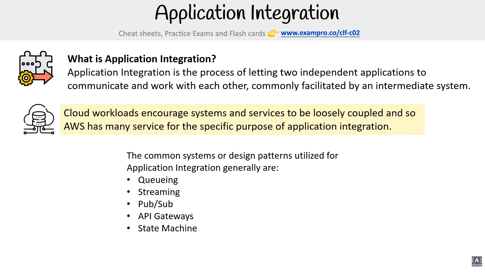
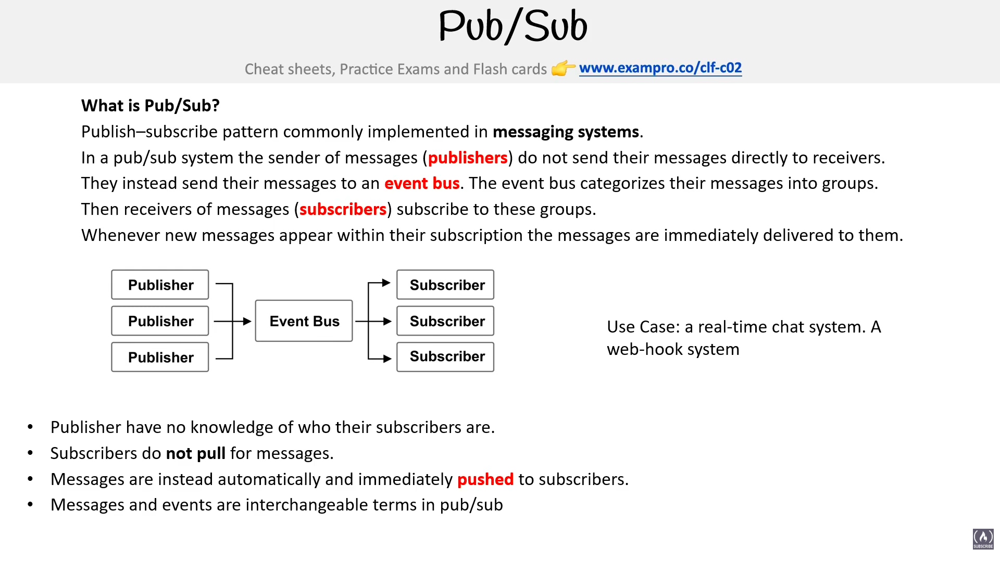

# Application Integration

> **Exam:** AWS Certified Cloud Practitioner (CLF-C02)
> **Topic 11:** **Application Integration** — the family of AWS services that let independent applications **talk to each other** without being directly wired together. The exam tests whether you can match a *scenario* ("decouple these two services", "fan-out a message to many subscribers", "buffer a burst of requests") to the *right integration service* (SQS, SNS, EventBridge, Kinesis, API Gateway, Step Functions).

When you build on the cloud, you don't build one giant program — you build many small services that each do one job. **Application Integration** is the process of letting two **independent** applications communicate and work with each other, usually through an **intermediate system** sitting in the middle rather than calling each other directly.

Cloud workloads strongly encourage systems to be **loosely coupled** (so one piece failing or getting slow doesn't drag the others down), and AWS offers many services built for exactly this purpose. This topic builds directly on the **Decoupling** idea from [Topic 02 — Cloud Architecture](02_Cloud_Architecture.md).

---

## 1. What Is Application Integration?

**Definition (memorize):** Application Integration is the process of letting **two independent applications communicate and work with each other**, commonly facilitated by an **intermediate system**.

The big idea on the slide:

> Cloud workloads encourage systems and services to be **loosely coupled**, and so AWS has many services for the specific purpose of application integration.

- **Tightly coupled** = App A calls App B *directly*. If B is down, slow, or changes, A breaks too. ❌
- **Loosely coupled** = App A hands its message to an **intermediate system** (a queue, a topic, a bus). B picks it up when ready. A and B never talk directly and don't even need to be online at the same time. ✅

That "intermediate system in the middle" is the heart of every integration service below.

---

## 2. The 5 Integration Patterns (the slide's list)

The slide lists the common systems / design patterns used for Application Integration. **These five are the spine of the whole topic — learn the pattern, then the AWS service that implements it.**

| # | Pattern | One-line meaning | Primary AWS service |
|---|---|---|---|
| 1 | **Queueing** | One sender → a buffer → **one** consumer pulls each message | **Amazon SQS** |
| 2 | **Streaming** | A continuous, ordered flow of records, replayable, many readers | **Amazon Kinesis** |
| 3 | **Pub/Sub** | One message **pushed** (fanned out) to **many** subscribers at once | **Amazon SNS** (+ **EventBridge**) |
| 4 | **API Gateways** | A managed **front door** that receives and routes API requests | **Amazon API Gateway** |
| 5 | **State Machine** | Coordinates multiple steps/services into one **workflow** | **AWS Step Functions** |

---

## 3. Queueing — Amazon SQS

### 3.1 What is a Messaging System?
A **messaging system** is used to provide **asynchronous communication** and **decouple processes** by passing **messages / events** between a **sender and a receiver** — i.e. a **producer** and a **consumer**.

- **Asynchronous** = the sender doesn't wait for the receiver. It drops the message and moves on; the receiver handles it whenever it's ready.
- This is the foundation of loose coupling from §1 — the message is the "intermediate system" between the two apps.

### 3.2 What is a Queueing System?
A **queueing system** is a *type of* messaging system with these defining traits (straight off the slide):

- **Generally deletes messages once they are consumed** — read-once, then gone (contrast with Kinesis streams in §4, which **retain** records).
- **Simple communication.**
- **Not real-time.**
- **Have to pull** — the consumer must **poll** the queue; nothing is pushed to it.
- **Not reactive** — the queue doesn't push or trigger; work waits until someone asks for it.

### 3.3 Amazon SQS (Simple Queue Service)
**Amazon SQS** = a **fully managed queueing service** that enables you to **decouple and scale microservices, distributed systems, and serverless applications**.

- **Pull-based** — consumers *poll* the queue for work.
- **Decouples** producer from consumer: if the consumer is busy or down, messages **wait safely** in the queue instead of being lost.
- **Buffers bursts/spikes** — a flood of requests piles up in the queue and gets worked off at a steady pace (classic exam scenario with an Auto Scaling Group reading the queue).
- **Two queue types:**
  - **Standard** — nearly unlimited throughput, *at-least-once* delivery, **best-effort ordering** (can be out of order / duplicated).
  - **FIFO** — strict **first-in-first-out** order, **exactly-once** processing, lower throughput.

**Use case (from the slide):** queue up **transaction emails** to be sent — e.g. **Signup** confirmation, **Reset Password** emails. The web app drops the "send email" message into SQS and responds to the user instantly; a worker pulls the message and sends the email in the background.

**The message lifecycle (the numbered diagram):**
1. **Producer** sends a message **into the queue**.
2. **Consumer polls** the queue and **receives** the message (it becomes temporarily hidden — *visibility timeout*).
3. Consumer **processes** the work.
4. Consumer **deletes** the message from the queue once done (so it isn't processed again).

> 🧠 **Hook:** SQS = a *to-do list*. Work waits in line until a worker is free to pull it, do it, and cross it off.

---

## 4. Streaming — Amazon Kinesis

### 4.1 What is Streaming?
**Streaming** is a continuous flow of data records (clickstreams, logs, IoT telemetry, video) processed in **real time**. The slide's defining traits:

- **Multiple consumers can react to events (messages)** — many readers, not just one (contrast SQS's single consumer).
- **Events live in the stream for long periods of time**, so **complex operations can be applied** — you can read, re-read, and **replay** the same data within the retention window (contrast SQS, which deletes once consumed).
- **Real-time** — data is available to process the instant it arrives.

### 4.2 Amazon Kinesis
**Amazon Kinesis** = the AWS **fully managed solution for collecting, processing, and analyzing streaming data** in the cloud.

**How the diagram flows:**
- **Producers** push data in — e.g. **EC2 instances, mobile apps, "traditional"** servers/on-prem sources.
- Data lands in **Kinesis Data Streams**, split across **Shards** (Shard 1, 2, … N). A **shard** is the unit of capacity/throughput — more shards = more parallel throughput.
- **Consumers** read from the stream and route data onward — e.g. **Redshift, DynamoDB, S3, EMR**.

**The four Kinesis services:**
- **Kinesis Data Streams** — ingest/process huge real-time streams (you manage capacity via **shards**).
- **Kinesis Data Firehose** — load streaming data into destinations (**S3, Redshift, OpenSearch**) with no admin / no shards to manage.
- **Kinesis Data Analytics** — run **SQL / Apache Flink** on the stream in real time.
- **Kinesis Video Streams** — stream video for analytics/ML.

- **Queue vs Stream (⭐ exam trap):** a **queue (SQS)** deletes a message once it's consumed — one reader, work-then-discard, **not real-time**. A **stream (Kinesis)** keeps records for a window so **many** consumers can **react in real time** to the **same** data and even **replay** it.

> 🧠 **Hook:** Kinesis = a *live TV feed*. The broadcast keeps flowing; many viewers can watch the same moment, and you can rewind within the window.

---

## 5. Pub/Sub — Amazon SNS (and EventBridge)

### 5.1 What is Pub/Sub?

**Pub/Sub (Publish–Subscribe)** is a pattern commonly implemented in **messaging systems**. The slide's definition:

- The sender of messages (**publishers**) do **not** send their messages **directly to receivers**.
- They instead send their messages to an **event bus**. The event bus **categorizes** the messages into **groups** (topics).
- Receivers (**subscribers**) **subscribe** to these groups.
- Whenever new messages appear within their subscription, the messages are **immediately delivered** to them.

**Flow:** `Publishers → Event Bus → Subscribers` (one publisher, many subscribers — **fan-out**).

**Key rules (from the slide):**
- Publishers have **no knowledge** of who their subscribers are.
- Subscribers do **not pull** for messages.
- Messages are instead **automatically and immediately pushed** to subscribers.
- **"Messages" and "events" are interchangeable terms** in pub/sub.

**Use case:** a **real-time chat system**; a **web-hook system**.

> ⭐ This is the mirror image of §3 SQS: a **queue** is **pull / one consumer / not real-time**; **pub/sub** is **push / many subscribers / immediate**.

### 5.2 Amazon SNS (Simple Notification Service)

**Amazon SNS** = a **highly available, durable, secure, fully managed pub/sub messaging** service that enables you to **decouple microservices, distributed systems, and serverless applications**.

**How the diagram flows:**
- **Publishers** send to SNS — e.g. **AWS SDK, AWS CLI, CloudWatch, AWS services**.
- Messages land on an **SNS Topic**, which performs **Message Filtering & Fan-out**.
- **Subscribers** receive the message — e.g. **Lambda, SQS, Email, HTTP/S**.

- **Push-based** (opposite of SQS's pull) — subscribers receive messages automatically.
- **Fan-out pattern:** one SNS topic → many **SQS** queues, so several systems each get their own copy of the same event. (Classic **SNS + SQS fan-out** exam answer.)
- **Message filtering** lets each subscriber receive only the subset of messages it cares about.

> 🧠 **Hook:** SNS = a *group text / loudspeaker*. Send once, everyone subscribed hears it immediately.
>
> **SQS vs SNS:** SQS = **pull**, one consumer, queue. SNS = **push**, many subscribers, fan-out.

### 5.3 The Event Bus & Amazon EventBridge

#### What is an Event Bus?
An **event bus** **receives events** from a **source** and **routes events** to a **target** based on **rules**.

> 🧠 **Think of it as a sorting hub:** events flow in from many sources, the bus checks them against **rules**, and forwards the matching ones to the right **targets**. Publishers and targets never talk directly — the bus sits in the middle (this is the pub/sub "intermediate system" from §1, made rule-driven).

**Amazon EventBridge** = a **serverless event bus** service used for **application integration** by **streaming real-time data** to your applications.

- **Serverless** — nothing to provision or manage; you only define buses, rules, and targets.
- **Formerly called Amazon CloudWatch Events** — same underlying service, rebranded and expanded. (⭐ exam fact.)

#### Anatomy of EventBridge

The slide breaks EventBridge into six building blocks:

| Component | What it is | Key limit / note |
|---|---|---|
| **Event Bus** | Holds event data; you **define rules on a bus** to react to events | Three kinds (below) |
| **Producers** | **AWS services that emit events** | Feed the **default** bus |
| **Partner Sources** | **Third-party SaaS apps** that emit events to a bus (e.g. Datadog, Salesforce, Zendesk, Shopify) | Feed a **SaaS** bus |
| **Rules** | Determine **what events to capture and pass to targets** | **100 rules per bus** |
| **Targets** | **AWS services that consume events** | **5 targets per rule** |
| **Events** | The data emitted by services — **JSON objects** that **travel (stream) within the event bus** | — |

**The three types of event bus:**
- **Default Event Bus** — every **AWS account has one** default bus; this is where **AWS services (Producers)** emit their events.
- **Custom Event Bus** — for **your own applications'** events; can be **scoped to multiple / other AWS accounts**.
- **SaaS (Partner) Event Bus** — **scoped to third-party SaaS providers** (Partner Sources) so their events flow into AWS.

**Flow:** `Producers / Partner Sources → Event Bus → (Events matched by Rules) → Targets`.

> ⭐ **Memorize the two numbers:** **100 rules per bus** and **5 targets per rule**.

#### Why it matters (exam framing)
- EventBridge is the go-to for **event-driven architectures** and **reacting to AWS service events** (e.g. "when an EC2 instance changes state, do X"; "on a schedule, trigger a Lambda").
- It supports **scheduling** (cron-like rules) — a common reason to pick EventBridge over SNS.
- **Richer than SNS:** SNS just fans a message out to subscribers; EventBridge **filters and routes** events with **rules** from **many sources** (AWS services, your apps, SaaS partners).

> 🧠 **Hook:** EventBridge = a *smart mail-room*. Events (JSON letters) arrive from staff (AWS services), outside vendors (SaaS partners), or your own departments (custom bus); the rulebook decides which trays (targets) each one goes to.

### 5.4 ⭐ SNS vs SQS (the #1 messaging exam trap)

![SNS vs SQS comparison slide — both connect apps via messages. Left, Simple Notification Service (SNS) "passes along messages, e.g. Pub/Sub": sends notifications to subscribers of topics via multiple protocols (HTTP, Email, SQS, SMS); generally used for plain-text emails triggered by other AWS services (e.g. billing alarms); can retry on failure for HTTPS; good for webhooks, simple internal emails, triggering Lambda functions. Right, Simple Queue Service (SQS) "queues up messages, guaranteed delivery": places messages into a queue that applications pull using the AWS SDK; can retain a message up to 14 days; can send in sequential order or in parallel; can ensure only one message is sent; can ensure at-least-once delivery; good for delayed tasks and queueing up emails](AWS_NOtes_Images/AWS_SNS_vs_SQS.png)

Both **connect applications via messages** to decouple them ([Topic 02](02_Cloud_Architecture.md) decoupling), but the **delivery model is opposite** — this is the single most-tested distinction in this topic:

- **SNS = PUSH / Pub-Sub** — SNS **pushes** each message *out* to **many subscribers** at once (fan-out). Subscribers don't ask; the message arrives.
- **SQS = PULL / Queue** — messages **sit in a queue** until an application **pulls** them (polls via the AWS SDK) and processes them, **one consumer** per message.

| | **Amazon SNS** (Pub/Sub) | **Amazon SQS** (Queue) |
|---|---|---|
| **Delivery model** | **Push** — fan-out to **many** subscribers | **Pull** — consumers **poll** and take messages |
| **Direction** | Producer → topic → **all subscribers** (1-to-many) | Producer → queue → **one** consumer pulls (1-to-1) |
| **Who initiates** | SNS **pushes** immediately | Application **pulls** when ready |
| **Persistence** | Not stored for you — delivered then gone | **Retains up to 14 days** until pulled & deleted |
| **Subscribers / protocols** | HTTP(S), **Email**, **SQS**, **SMS**, Lambda | Apps using the **AWS SDK** |
| **Ordering / once** | — | **FIFO** = sequential order + **exactly-once**; Standard = at-least-once |
| **Good for** | **Webhooks, plain-text emails (e.g. billing alarms), triggering Lambda**, real-time fan-out | **Delayed/background tasks, queueing up work/emails**, smoothing load |

> 🎯 **Exam reflex:** "**push** / **notify many** subscribers / **fan-out** / email or SMS alert / billing alarm" → **SNS**. "**queue** / **pull** / **decouple & buffer** work / **retain** until processed / one worker handles each" → **SQS**. Mnemonic: **S**N**S** = **S**end/pu**S**h to **S**ubscribers; **SQ**S = **Q**ueue you pull from.

> 🔗 **They combine — the "fan-out" pattern:** SNS topic → multiple **SQS queues** subscribed to it, so one published message is buffered into several queues for different workers. (SNS can be an SQS *subscriber*.)

---

## 6. API Gateways — Amazon API Gateway

### 6.1 What is an API Gateway?
An **API Gateway** is a program that sits between a **single entry point** and **multiple backends**. It allows for (straight off the slide):

- **Throttling** (rate-limiting requests),
- **Logging**,
- **Routing logic**, and
- **Formatting of the request and response**.

So instead of every client talking to every backend, all traffic enters through **one front door** that handles these cross-cutting concerns centrally.

### 6.2 Amazon API Gateway
**Amazon API Gateway** = a solution for **creating secure APIs** in your cloud environment **at any scale**. You create APIs that act as a **front door** for applications to access **data, business logic, or functionality** from back-end services.

**How the diagram flows:**
- **Clients** — **Mobile App, Web App, IoT Device** — call the gateway over **HTTPS**.
- **API Gateway** receives each request and **routes** it to the right backend (e.g. **Lambda, EC2**, other AWS services).
- Supporting pieces: **API Gateway Cache** (caches responses to cut latency & backend load) and **CloudWatch** (logging/monitoring of API calls).
- An API endpoint looks like `https://{id}.execute-api.{region}.amazonaws.com/{stage}`, with **HTTP methods** (`GET`, `POST`, `DELETE`, …) mapped to **resource paths**.

**Why it matters (exam framing):**
- Common pairing: **API Gateway → Lambda** = the backbone of **serverless** APIs (no servers to run).
- Handles cross-cutting concerns so your code doesn't: **throttling, logging, caching, auth, request/response formatting**.
- Decouples **clients** from **backends** — the client only ever talks to the gateway; you can change what's behind it freely.
- Supports **REST / HTTP / WebSocket** APIs.

> 🧠 **Hook:** API Gateway = the *reception desk* of a building. Every visitor (request) checks in there over HTTPS and gets directed to the right office.

---

## 7. State Machine — AWS Step Functions

### 7.1 What is a State Machine?
A **state machine** is an **abstract model** which decides **how one state moves to another based on a series of conditions**.

> 🧠 **Think of a state machine like a flow chart** — you're at one box (state), and which box you go to next depends on the conditions/result of the current step.

**Pattern:** a state machine coordinates a multi-step process — it defines the steps, the order, branching, retries, and error handling, turning many separate services into **one reliable workflow**.

### 7.2 What is AWS Step Functions?
**AWS Step Functions** = AWS's serverless **workflow orchestrator**, built from **states** (steps) wired together. Straight off the slide, it lets you:

- **Coordinate multiple AWS services into a serverless workflow.**
- Use a **graphical console** to **visualize the components** of your application as a **series of steps**.
- **Automatically triggers and tracks each step, and retries when there are errors**, so your application **executes in order and as expected, every time**.
- **Logs the state of each step**, so when things go wrong you can **diagnose and debug problems quickly**.

**The visual workflow (from the diagram):** a flow-chart of states — `Start → FetchOrder → CreateOrder / branches → ProcessOrder`, with error paths like `DatabaseError`, `UnreserveRegion`, and `NoOrderPossible`. Each state is colour-coded **Success / Failed / Cancelled / In Progress**, and **any one of these steps could be using an AWS service** (e.g. a Lambda function, an ECS task, a DynamoDB write).

- Great for orchestrating **multiple Lambda functions** or AWS services into an end-to-end business process (e.g., order → payment → ship → notify).
- Built-in **retry, error catching, parallel branches, and waits**.
- (Older sibling: **Amazon SWF — Simple Workflow Service** — the legacy option; Step Functions is the modern recommendation.)

> 🧠 **Hook:** Step Functions = a *flowchart that runs itself*. It remembers where you are in the process, what comes next, and retries/logs each step so the whole workflow runs in order, every time.

---

## 8. Application Integration Services — At a Glance (recap slide)

This summary slide is a **roll-call of every Application Integration service** with the one-line description the exam expects you to match to a scenario. Each row uses the slide's own phrasing (the **bold-highlighted "X service" tag** is what they want you to recognize).

| Service | The "X service" tag (memorize) | Slide details |
|---|---|---|
| **SNS** (Simple Notification Service) | a **pub-sub messaging system** | Sends notifications in various formats — **plain-text Email, HTTP/S (webhooks), SMS (text messages), SQS, and Lambda**. **Pushes** messages out to subscribers. |
| **SQS** (Simple Queue Service) | a **queueing messaging service** | Send events to a **queue**; other applications **pull** the queue for messages. Commonly used for **background jobs**. |
| **Step Functions** | a **state machine service** | **Coordinates multiple AWS services into serverless workflows.** Easily **share data among Lambdas**, have a group of Lambdas **wait for each other**, create logical steps. Also works with **Fargate Tasks**. |
| **EventBridge** (CloudWatch Events) | a **serverless event bus** | Makes it easy to **connect applications together** from your **own application, third-party services, and AWS services**. |
| **Kinesis** | a **real-time streaming data service** | Create **Producers** that send data to a **stream**; **multiple Consumers** can consume data within a stream. Use for **real-time analytics, click streams, ingesting data from a fleet of IoT devices**. |
| **Amazon MQ** | a **managed message broker service** | Uses **Apache ActiveMQ**. For migrating apps on standard messaging protocols. |
| **Amazon MSK** (Managed Streaming for Kafka) | a **fully managed Apache Kafka service** | Kafka is an open-source platform for building **real-time streaming data pipelines & applications**. **Similar to Kinesis but more robust.** |
| **API Gateway** | a **fully-managed API service** | For developers to **create, publish, maintain, monitor, and secure APIs**. Create API endpoints and **route them to AWS services**. |
| **AppSync** | a **fully managed GraphQL service** | **GraphQL** is an open-source, agnostic query adaptor that lets you **query data from many different data sources**. |

**Two services that appear here but weren't in the earlier sections — know them:**
- **Amazon MSK** — **managed Apache Kafka.** Kafka ≈ open-source Kinesis. ⭐ Exam cue: *"Apache Kafka"* or *"more robust streaming / migrate a Kafka workload"* → **MSK** (whereas plain "real-time streaming" with no Kafka mention → **Kinesis**).
- **AWS AppSync** — a **fully managed GraphQL service.** **GraphQL** is an open-source, data-source-agnostic **query language**: the client asks for **exactly the fields it wants in one request**, and AppSync fetches them from **many different data sources** behind the scenes — **DynamoDB, Lambda, RDS/Aurora, OpenSearch, HTTP APIs** — and stitches the result together. Also supports **real-time data** (subscriptions/live updates) and **offline sync** for mobile apps. ⭐ Exam cue: the word **"GraphQL"** → **AppSync** (whereas **"REST / HTTP / WebSocket API"** → **API Gateway**). It is commonly the **GraphQL backend** that **AWS Amplify** front ends connect to.

> ⭐ **Exam trap — Amazon MQ vs SQS/SNS:** choose **MQ** when *migrating* an app that already speaks **industry-standard messaging protocols** (JMS, AMQP, MQTT — via ActiveMQ/RabbitMQ) and you don't want to rewrite it. Choose **SQS/SNS** for **new, cloud-native** apps.
>
> ⭐ **Exam trap — MSK vs Kinesis:** both stream real-time data. **MSK = Apache Kafka** (open-source compatibility / lift-and-shift Kafka). **Kinesis = AWS-native**, simpler, serverless-ish.

**More to recognize (not on this slide):**
- **AWS AppFlow** — no-code data transfer between **SaaS apps** (Salesforce, Slack) and AWS; sync SaaS data to **S3/Redshift** without building custom integrations.
- **AWS Amplify** — a set of tools/services to **build and deploy full-stack web & mobile apps** fast. It wires the front end to backends like **AppSync (GraphQL), Cognito (auth), API Gateway/Lambda, DynamoDB, and S3**, and **Amplify Hosting** serves static/SPA sites with **Git-based CI/CD**. ⭐ Exam cue: *"quickly build / host a full-stack or serverless **web/mobile app** front-to-back"* → **Amplify**. (Don't confuse with **API Gateway**, which only exposes the API layer, or **AppSync**, which is just the GraphQL backend — Amplify orchestrates the whole front-end + backend experience.)

---

## 9. Exam Triggers

| If the question says… | The answer is… |
|---|---|
| "**Decouple** two components / **buffer** requests / process work later" | **SQS** (queue) |
| "Messages must be processed **in order, exactly once**" | **SQS FIFO** |
| "**Real-time** streaming data / clickstream / IoT / **replay** records / multiple readers of same data" | **Kinesis** |
| "**Fan-out** one message to **many** subscribers / send **notifications** / email / SMS / push" | **SNS** |
| "**Event-driven**, route events from AWS services with **rules** / schedule" | **EventBridge** |
| "Create / publish / secure a **REST or HTTP API**" / serverless API front door | **API Gateway** |
| "Managed / agnostic **GraphQL** API / query many data sources from one endpoint" | **AppSync** |
| "Quickly **build, host & deploy a full-stack web/mobile app** (front end + backend) with CI/CD" | **AWS Amplify** |
| "**Orchestrate / coordinate** multiple steps or Lambda functions into a **workflow**" | **Step Functions** |
| "**Migrate** an app using **RabbitMQ / ActiveMQ / standard messaging protocols**" | **Amazon MQ** |
| "Managed **Apache Kafka** / Kafka-compatible streaming / 'more robust' streaming pipeline" | **Amazon MSK** |
| "Loosely coupled / let independent apps communicate via an intermediate system" | **Application Integration** services (this whole topic) |

---

## 10. Common Confusions to Nail

- **SQS vs SNS** (⭐ see §5.4 for the full table) — SQS = **pull**, message **waits in a queue up to 14 days** for **one** consumer (FIFO can guarantee order + exactly-once); SNS = **push**, message **fanned out** to **many** subscribers (HTTP/Email/SQS/SMS/Lambda), great for **billing-alarm emails / webhooks / triggering Lambda**. They **combine** in the **fan-out pattern**: SNS topic → multiple SQS queues. Mnemonic: **SN*S* = pu*S*h to *S*ubscribers**, **S*Q*S = *Q*ueue you pull**.
- **SQS vs Kinesis** — SQS **deletes** a message after it's consumed (one-time, one reader). Kinesis **retains** records so **multiple** consumers can read and **replay** the same data.
- **SNS vs EventBridge** — both are pub/sub-ish. **SNS** = simple, high-throughput fan-out (notifications). **EventBridge** = richer **event bus** with **filtering rules**, many AWS/SaaS event sources, and scheduling.
- **Amazon MQ vs SQS/SNS** — MQ for **lifting-and-shifting** existing apps on standard protocols; SQS/SNS for **new cloud-native** designs.
- **Amazon MSK vs Kinesis** — both stream real-time data. **MSK = managed Apache Kafka** (open-source compatibility, "more robust"); **Kinesis = AWS-native**, simpler. Keyword **"Kafka" → MSK**.
- **AppSync vs API Gateway** — both expose APIs. **AppSync = GraphQL** (one endpoint, many data sources); **API Gateway = REST / HTTP / WebSocket**. Keyword **"GraphQL" → AppSync**.
- **Step Functions vs a queue** — a queue just holds messages; Step Functions **orchestrates the whole multi-step workflow** (order, retries, branching).
- **API Gateway is not a load balancer** — it's an **API front door** (auth, throttling, routing to Lambda/backends), not a traffic distributor like ELB.

---

## Quick Revision Cheat Sheet

| Pattern | Service | Push or Pull? | One-liner |
|---|---|---|---|
| **Queueing** | **SQS** | Pull | Buffer; one consumer per message; decouple & absorb bursts |
| **Streaming** | **Kinesis** | — | Real-time, retained, replayable; many readers |
| **Pub/Sub** | **SNS** | Push | Fan-out one message to many subscribers |
| **Event bus** | **EventBridge** | Push | Rule-based routing of events; scheduling |
| **API front door** | **API Gateway** | — | Create/secure REST/HTTP/WebSocket APIs; pairs with Lambda |
| **GraphQL API** | **AppSync** | — | Managed GraphQL; query many data sources from one endpoint |
| **Full-stack app** | **AWS Amplify** | — | Build/host/deploy full-stack web & mobile apps + CI/CD; wires front end to AppSync/Cognito/Lambda/S3 |
| **Workflow** | **Step Functions** | — | Orchestrate multi-step processes/state machines |
| **Managed broker** | **Amazon MQ** | — | RabbitMQ/ActiveMQ for migrating existing apps |
| **Managed Kafka** | **Amazon MSK** | — | Apache Kafka, "more robust" Kinesis; keyword *Kafka* |

### Top exam points to remember
1. **Application Integration = letting independent apps communicate via an intermediate system → loosely coupled.**
2. The five patterns: **Queueing (SQS), Streaming (Kinesis), Pub/Sub (SNS), API Gateways (API Gateway), State Machine (Step Functions).**
3. **SQS = pull/queue/one consumer; SNS = push/pub-sub/many subscribers.** (The #1 pairing the exam tests.)
4. **Kinesis = real-time streaming, retained & replayable;** SQS deletes after consume.
5. **API Gateway + Lambda = serverless API** backbone.
6. **Step Functions orchestrates workflows** across multiple services/Lambdas.
7. **Amazon MQ** when **migrating** apps on standard messaging protocols (RabbitMQ/ActiveMQ); **SQS/SNS** for new cloud-native apps.
8. **Keyword → service:** **"Kafka" → MSK** (managed Apache Kafka, "more robust" than Kinesis); **"GraphQL" → AppSync** (managed GraphQL over many data sources).
