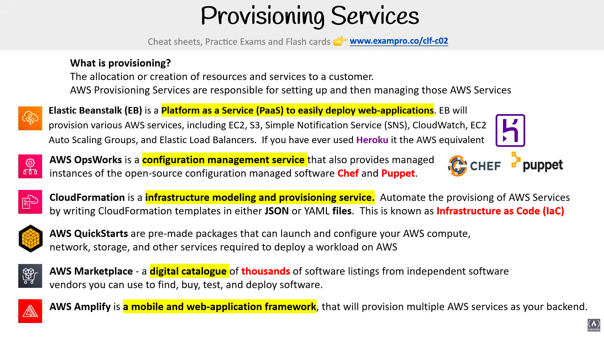
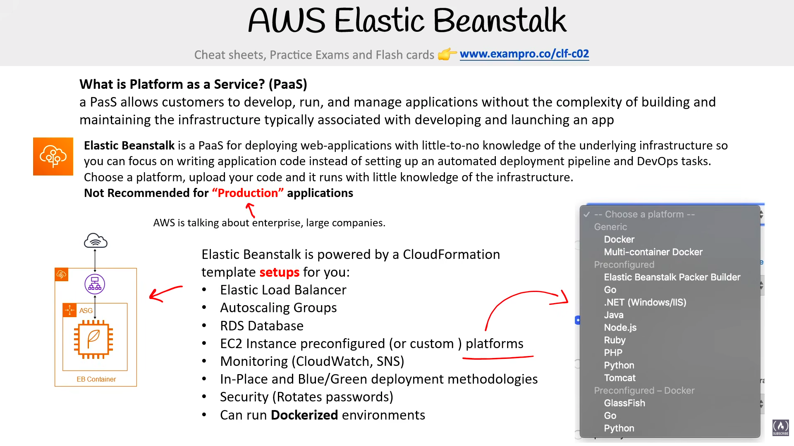
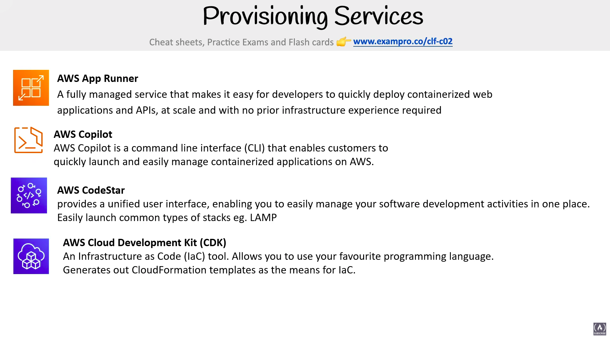

# Provisioning Services

> **Exam:** AWS Certified Cloud Practitioner (CLF-C02)
> **Topic 15:** **AWS Provisioning Services** — the AWS services whose job is to **set up (provision) and then manage** the cloud resources you need to run a workload. The exam loves to ask *"which service deploys / provisions / models infrastructure?"* — this topic is about matching each name to **how** it provisions.

**What is provisioning?** The **allocation or creation of resources and services to a customer.** When you "provision," you are spinning up the compute, network, storage and other services a workload needs. **Provisioning services** are the AWS tools responsible for **setting up** those resources and then **managing** them for you — so you don't click through the console by hand.

The common thread: instead of manually creating EC2 instances, load balancers, S3 buckets, etc. one-by-one, a provisioning service does the wiring for you — some from a template, some from your code, some from a pre-built package.

---

## 1. The Provisioning Services at a Glance (the slide)

| Service | One-liner | How it provisions | Keyword hook |
|---|---|---|---|
| **Elastic Beanstalk (EB)** | **PaaS** to easily **deploy web applications** | You give it **your code**; EB provisions the underlying AWS services for you | "deploy a web app fast", "PaaS", "**AWS Heroku**" |
| **AWS OpsWorks** | **Configuration management** service | Managed **Chef** & **Puppet** to configure servers | "Chef", "Puppet", "config management" |
| **CloudFormation** | **Infrastructure modeling & provisioning** | Write a **template** (JSON/YAML) → AWS builds it = **Infrastructure as Code (IaC)** | "template", "JSON/YAML", "**IaC**" |
| **AWS QuickStarts** | **Pre-made packages** / reference deployments | Pre-built CloudFormation that deploys a whole workload | "pre-made", "reference architecture" |
| **AWS Marketplace** | **Digital catalogue** of third-party software | Find / buy / deploy vendor software | "catalogue", "third-party / ISV software" |
| **AWS Amplify** | **Mobile & web app framework** | Provisions multiple AWS services as your **backend** | "front-end / mobile backend" |

> **Big mental split for the exam — *how* do you describe the resources you want?**
> - **By your application code** → **Elastic Beanstalk** (web apps) or **Amplify** (web/mobile front-ends + backend).
> - **By a declarative template** → **CloudFormation** (IaC), and its pre-built bundles **QuickStarts**.
> - **By server configuration scripts** → **OpsWorks** (Chef/Puppet).
> - **By buying someone else's software** → **AWS Marketplace**.

---

## 2. Elastic Beanstalk (EB) — "just give it your code"

### What is Platform as a Service (PaaS)?
**A PaaS allows customers to develop, run, and manage applications without the complexity of building and maintaining the infrastructure** typically associated with developing and launching an app. (See the PaaS row of the Shared Responsibility Model, Topic 04.)

### Elastic Beanstalk
- A **PaaS for deploying web applications** with **little-to-no knowledge of the underlying infrastructure** — you focus on **writing application code** instead of setting up an automated deployment pipeline and DevOps tasks.
- **The 3-step flow:** **choose a platform → upload your code → run it.** EB does the wiring.
- **Exam analogy:** *"If you've ever used **Heroku**, this is the AWS equivalent."* → fast, opinionated web-app deployment.
- **You manage:** your code (+ light config). **AWS manages:** servers, OS, scaling, load balancing.

> ⭐ **Big exam trap (from the slide): Elastic Beanstalk is NOT recommended for *"Production"* applications** — "AWS is talking about **enterprise, large companies**." For large-scale production you'd use the underlying services directly / CloudFormation / CDK. EB is best for **getting an app running quickly** (dev, test, small/simple apps).

### EB is powered by a CloudFormation template
EB doesn't reinvent provisioning — **under the hood it generates a CloudFormation template** (§4) that sets up:

| EB sets up | What it gives you |
|---|---|
| **Elastic Load Balancer** | distributes traffic (Topic 09 §8) |
| **Auto Scaling Groups** | elasticity + self-healing (Topic 09 §9) |
| **RDS Database** | optional managed relational DB |
| **EC2 instances** | on **preconfigured (or custom) platforms** |
| **Monitoring** | **CloudWatch + SNS** |
| **Deployment methodologies** | **In-Place** and **Blue/Green** |
| **Security** | **rotates passwords** automatically |
| **Docker** | **can run Dockerized environments** |

### Platforms you can choose
- **Generic / Docker:** Docker, Multi-container Docker, Preconfigured Docker (GlassFish, Java, Python).
- **Preconfigured languages/runtimes:** **Go, .NET (Windows/IIS), Java, Node.js, PHP, Python, Ruby, Tomcat.**
- → If your language/runtime isn't a native EB platform, package it as a **Docker** environment.

### Deployment methodologies (exam favourite)
- **In-Place** — update the existing instances in the current environment.
- **Blue/Green** — spin up a **new** environment, then **swap** traffic over (safer, easy rollback, no downtime).

> **Trap:** EB is **not** infrastructure-as-code itself and **not** a container orchestrator — even though it *uses* CloudFormation and *can run* Docker. It's "**hand over a web app, get a running environment.**" (EB also appears in Topic 05 §5 / Topic 12 §8; here it's framed as a *provisioning* service.)

---

## 3. AWS OpsWorks — managed Chef & Puppet

- A **configuration management service** that provides **managed instances of the open-source configuration-management software Chef and Puppet.**
- **Chef** and **Puppet** are tools that automate **how servers are configured** (packages installed, settings applied, app deployed) so every server is set up identically and stays in the desired state.
- OpsWorks lets you run those tools **without managing the Chef/Puppet servers yourself**.
- **Exam hook:** see **"Chef"** or **"Puppet"** → answer **OpsWorks.** It's the **"I already use Chef/Puppet and want it managed on AWS"** service.

> **Config management vs provisioning:** CloudFormation *creates* the infrastructure; OpsWorks (Chef/Puppet) *configures what runs inside* the servers. They're complementary, not competitors.

---

## 4. CloudFormation — Infrastructure as Code (IaC)

- An **infrastructure modeling and provisioning service.** You **automate the provisioning of AWS resources by writing CloudFormation templates** in either **JSON or YAML**.
- This approach is known as **Infrastructure as Code (IaC)** — your infrastructure is defined in a **text file** you can version-control, review, and reuse, instead of clicking in the console.
- **Declarative:** you describe the **desired end state** ("I want 1 VPC, 2 subnets, an ELB, an ASG…") and CloudFormation figures out how to build it, in the right order.
- **Repeatable & consistent:** deploy the same **stack** into multiple Regions/accounts identically; delete the stack to cleanly tear everything down.
- **Exam hooks:** "**template**", "**JSON or YAML**", "**Infrastructure as Code / IaC**", "model my infrastructure", "repeatable deployments" → **CloudFormation.**

> CloudFormation is also introduced in Topic 03 (Management & Dev Tools) alongside the **CDK** (write IaC in real programming languages that *compiles down to* CloudFormation). Cross-link [[aws-notes-project]] Topic 03.

---

## 5. AWS QuickStarts — pre-made reference deployments

- **Pre-made packages** that can **launch and configure** the AWS compute, network, storage, and other services required to **deploy a workload on AWS.**
- Built by AWS solutions architects and partners as **reference architectures**, delivered largely as **ready-made CloudFormation templates** — so you get a vetted, best-practice setup in a few clicks instead of building it from scratch.
- **Exam hook:** "**pre-built / pre-made package**", "**reference architecture**", "deploy a known workload quickly with best practices" → **QuickStarts.**

> **Relationship:** QuickStarts are essentially **packaged CloudFormation** — CloudFormation is the *engine*, QuickStarts are *ready-to-run blueprints* built on it.

---

## 6. AWS Marketplace — digital catalogue of third-party software

- A **digital catalogue with thousands of software listings from independent software vendors (ISVs)** that you can use to **find, buy, test, and deploy** software that runs on AWS.
- Think of it as an **app store for enterprise software** — AMIs, SaaS products, containers, ML models — with **billing rolled into your AWS bill** (consolidated billing).
- **Exam hook:** "**third-party / vendor / ISV software**", "**catalogue / marketplace**", "buy and deploy pre-built solutions" → **AWS Marketplace.**

> **Don't confuse with AWS Service Catalog** (Topic 13 Governance): Marketplace = **buy external vendors' software**; Service Catalog = your **own org's curated, approved internal products** for employees to self-provision.

---

## 7. AWS Amplify — front-end/mobile app framework + backend

- A **mobile and web-application framework** that will **provision multiple AWS services as your backend.**
- Aimed at **front-end and mobile developers**: it wires your app to backend services (auth, APIs, data, storage, hosting) and can host + CI/CD-deploy the front end.
- Under the hood it provisions services like **Cognito** (auth), **AppSync / API Gateway + Lambda** (APIs), **DynamoDB** (data), and **S3** (storage).
- **Exam hook:** "**mobile / web app backend**", "front-end developers", "build and host full-stack apps fast" → **Amplify.**

> Amplify is also covered in Topic 11 (Application Integration) — there it's framed as the glue that wires a front end to AppSync/Cognito/API-GW-Lambda/DynamoDB/S3. Cross-link [[aws-notes-project]] Topic 11.

---

## 8. More Provisioning Services (slide 2) — App Runner, Copilot, CodeStar, CDK

A second batch of provisioning/deployment helpers — these lean toward **developer experience**: getting containerized apps and full projects up quickly.

| Service | One-liner | Key detail | Keyword hook |
|---|---|---|---|
| **AWS App Runner** | Fully managed service to **quickly deploy containerized web apps & APIs** | **At scale, with no prior infrastructure experience required** | "containers", "no infra knowledge", "fully managed web app/API" |
| **AWS Copilot** | A **command-line interface (CLI)** to **launch & manage containerized apps** | Run/manage containers on AWS (ECS/Fargate/App Runner) from the **CLI** | "**CLI** for containers" |
| **AWS CodeStar** | A **unified UI** to manage your **software development activities in one place** | Easily launch common types of **stacks**, e.g. **LAMP** | "one place", "dev project dashboard", "LAMP stack" |
| **AWS Cloud Development Kit (CDK)** | An **Infrastructure as Code (IaC)** tool | Use your **favourite programming language**; **generates CloudFormation templates** as the means for IaC | "IaC in real code", "code → CloudFormation" |

### 8.1 AWS App Runner
- **Fully managed** — you bring a **container image (or source code)** and App Runner deploys it as a scalable web app/API.
- The slide's selling point: **"no prior infrastructure experience required"** — it handles load balancing, scaling, and the underlying compute (built on **ECS/Fargate**) for you.
- **Exam hook:** "deploy a **containerized web app/API** with the **least operational effort / no infra knowledge**" → **App Runner.**

### 8.2 AWS Copilot
- A **CLI tool** that lets developers **launch and manage containerized applications on AWS** without hand-wiring ECS/Fargate/App Runner.
- Think **"`copilot deploy` from the terminal"** — it provisions the container infrastructure behind the scenes.
- **Exam hook:** "**command-line** way to deploy/manage **containers**" → **Copilot.**

### 8.3 AWS CodeStar
- Provides a **unified user interface** to **manage your software development activities in one place** — code, build, deploy, and team collaboration on a single dashboard.
- Lets you **easily launch common types of stacks** (the slide example: **LAMP** — Linux/Apache/MySQL/PHP).
- Ties together the AWS developer tools (CodeCommit/CodeBuild/CodeDeploy/CodePipeline) into one project view.
- **Exam hook:** "manage dev activities **in one place / unified dashboard**", "quickly start a project stack" → **CodeStar.**

### 8.4 AWS Cloud Development Kit (CDK)
- An **Infrastructure as Code (IaC)** tool that lets you **define infrastructure in your favourite programming language** (TypeScript, Python, Java, C#, Go).
- It **generates / synthesizes CloudFormation templates** as the means for IaC — so CDK ultimately **becomes a CloudFormation stack** under the hood.
- **vs CloudFormation (§4):** CloudFormation = write **JSON/YAML** directly; CDK = write **real code** that *compiles down to* CloudFormation. Same engine, friendlier authoring.
- **Exam hook:** "**IaC in a programming language**", "code that **generates CloudFormation**" → **CDK.** (Also introduced in Topic 03.)

> **Container-deploy ladder (least → most control):** **App Runner** (fully managed, no infra knowledge) → **Copilot** (CLI convenience over ECS/Fargate) → raw **ECS/EKS/Fargate** (Topic 05/12). App Runner = easiest; the lower you go, the more you configure.

---

## 9. Exam Triggers

- "Allocation / creation of resources to a customer" → **Provisioning.**
- "**PaaS** to **deploy a web app** quickly", "**AWS Heroku**", "choose platform → upload code → run" → **Elastic Beanstalk.**
- "Deploy an app with **little/no knowledge of the underlying infrastructure**" → **Elastic Beanstalk** (PaaS).
- "EB is **powered by / generates a CloudFormation template**" → **true** (EB uses CloudFormation under the hood).
- "**In-Place vs Blue/Green** deployment" → **Elastic Beanstalk** deployment methodologies (Blue/Green = new env + swap = safe rollback).
- "Best service for a **quick/dev/test** web app vs **NOT for large enterprise production**" → **Elastic Beanstalk** (the slide's caveat).
- "Managed **Chef** / **Puppet**", "configuration management" → **OpsWorks.**
- "**Template** in **JSON or YAML**", "**Infrastructure as Code (IaC)**", "model/provision infrastructure" → **CloudFormation.**
- "Write IaC in a **programming language** (Python/TypeScript) that becomes CloudFormation" → **CDK** (Topic 03).
- "**Pre-made package** / reference architecture deploying a whole workload" → **QuickStarts.**
- "**Catalogue** of **third-party / ISV** software to find, buy, deploy" → **AWS Marketplace.**
- "**Mobile / web app** framework that provisions a **backend**", "front-end developers" → **Amplify.**
- "Deploy a **containerized web app/API** with **no infra experience / least effort**, fully managed" → **App Runner.**
- "**CLI** to launch & manage **containerized** apps" → **Copilot.**
- "**Unified UI** to manage dev activities **in one place**", "launch a **LAMP** stack" → **CodeStar.**
- "**IaC** in my **favourite programming language**", "**generates CloudFormation**" → **CDK.**

---

## 10. Common Confusions to Nail

1. **Elastic Beanstalk vs CloudFormation.** EB = *"give me your **app code**, I'll run it"* (PaaS, web apps). CloudFormation = *"give me a **template**, I'll build any infrastructure"* (IaC, general-purpose). EB even *uses* CloudFormation under the hood — but you don't write the template; you upload code.
2. **EB is "not for production."** Per the slide, EB is **not recommended for large enterprise production** apps — it's for **quick deployments / dev / test / simpler apps**. Don't pick EB when the question stresses *large-scale enterprise production*.
3. **CloudFormation vs CDK.** CloudFormation = write **JSON/YAML templates** directly. CDK = write **real code** (Python/TS/Java) that **synthesizes into** CloudFormation. Both end up as CloudFormation stacks.
4. **CloudFormation vs OpsWorks.** CloudFormation **provisions/creates** the infrastructure (IaC). OpsWorks (Chef/Puppet) **configures** the software **inside** servers (config management). Different jobs.
5. **QuickStarts vs CloudFormation.** QuickStarts = **pre-built, packaged** CloudFormation templates (blueprints). CloudFormation = the underlying engine you'd use to author your own.
6. **AWS Marketplace vs AWS Service Catalog.** Marketplace = **third-party/ISV** software store (external). Service Catalog = your **organization's own approved** products for internal self-service (Topic 13).
7. **Amplify vs Elastic Beanstalk.** Amplify = **front-end/mobile** apps + provisioned **backend** (Cognito/AppSync/DynamoDB/S3). Beanstalk = **traditional web-app** deployment on EC2/ELB/ASG. Different developer audiences.
8. **App Runner vs Copilot vs Elastic Beanstalk.** App Runner = **fully managed containers**, no infra knowledge (built on Fargate). Copilot = a **CLI** to deploy/manage containers on ECS/Fargate/App Runner. Beanstalk = **web apps** (not container-first). All three "deploy an app fast" — the giveaway is **"container + fully managed" (App Runner)** vs **"CLI" (Copilot)** vs **"web app / Heroku" (Beanstalk)**.
9. **CDK vs CloudFormation (again).** CDK = **programming language** → **synthesizes CloudFormation**. CloudFormation = author **JSON/YAML** directly. Both deploy as CloudFormation stacks.
10. **CodeStar vs Elastic Beanstalk.** CodeStar = a **unified UI / project dashboard** tying together the dev pipeline (CodeCommit/Build/Deploy/Pipeline) and launching stacks (e.g. LAMP). Beanstalk = the **runtime environment** that hosts the deployed app. CodeStar *organizes the project*; Beanstalk *runs the app*.

---

## Quick Revision Cheat Sheet

| Service | Category | Provisions via | #1 keyword |
|---|---|---|---|
| **Elastic Beanstalk** | PaaS / web-app deploy | Your **app code** (→ CFN) | "deploy web app", "Heroku", "not for prod" |
| **OpsWorks** | Config management | **Chef / Puppet** | "Chef", "Puppet" |
| **CloudFormation** | IaC | **JSON/YAML template** | "template", "IaC" |
| **CDK** *(also Topic 03)* | IaC | **Programming language** → CFN | "code → CloudFormation" |
| **QuickStarts** | Reference deployment | **Pre-built** CFN package | "pre-made", "reference arch" |
| **AWS Marketplace** | Software catalogue | **Buy ISV** software | "third-party catalogue" |
| **Amplify** | Web/mobile framework | Provisions a **backend** | "mobile/web app backend" |
| **App Runner** | Managed container deploy | A **container image / code** | "containers, no infra knowledge" |
| **Copilot** | Container deploy (CLI) | **CLI** commands | "CLI for containers" |
| **CodeStar** | Dev project management | A **unified UI** + stacks | "one place", "LAMP" |

### Top exam points to remember
1. **Provisioning = creating/allocating resources** for a workload; these services **set up and then manage** them so you don't do it by hand.
2. **Code → app running:** **Elastic Beanstalk** (web apps, PaaS, "AWS Heroku") and **Amplify** (web/mobile + backend). **EB is powered by CloudFormation, supports In-Place & Blue/Green deploys, and is NOT recommended for large enterprise production.**
3. **Template → infrastructure:** **CloudFormation** = **IaC** in **JSON/YAML**; **QuickStarts** = pre-built CloudFormation packages.
4. **Server configuration:** **OpsWorks** = managed **Chef & Puppet**.
5. **Buy third-party software:** **AWS Marketplace** (catalogue of ISV listings) — *not* Service Catalog (internal/curated).
6. **Deploy containers fast:** **App Runner** = fully managed, *no infra knowledge*; **Copilot** = same via the **CLI**.
7. **Manage the whole project:** **CodeStar** = unified dev dashboard (launch stacks like **LAMP**). **CDK** = IaC in a real programming language that **generates CloudFormation**.
