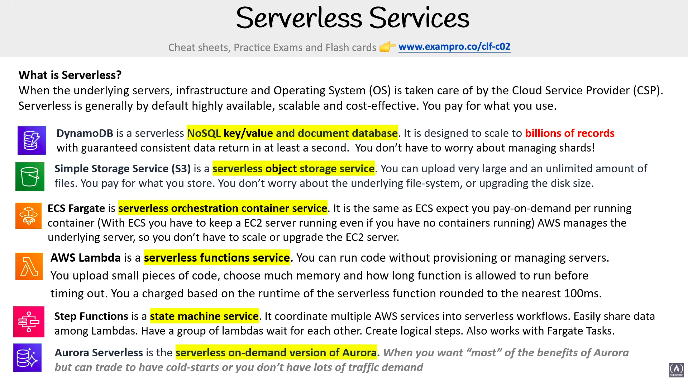

# Serverless Services

> **Exam:** AWS Certified Cloud Practitioner (CLF-C02)
> **Topic 16:** **AWS Serverless Services** — the services where **you never manage a server**. The exam loves *"which of these is serverless?"* and *"what does serverless mean?"* questions. The trick is that "serverless" doesn't mean *no servers* — it means **AWS runs the servers for you** and you **pay only for what you use**.

**What is Serverless?** When the **underlying servers, infrastructure, and Operating System (OS) are taken care of by the Cloud Service Provider (CSP)**. Serverless is generally by default **highly available, scalable, and cost-effective** — and **you pay for what you use** (no idle capacity to pay for).

> There ARE still servers — you just don't see, provision, patch, or scale them. AWS does. This is the most-managed end of the Shared Responsibility Model (Topic 04): you bring **code and data**, AWS brings **everything else.**

---

## 1. The Serverless Services at a Glance (the slide)

| Service | "Serverless ___" | What it is | Keyword hook |
|---|---|---|---|
| **DynamoDB** | serverless **key/value & document database** | scales to **billions of records**, consistent reads in ~1 sec, **no shard management** | "NoSQL", "no shards", "billions of records" |
| **Amazon S3** | serverless **object storage** | store unlimited files, any size; no file-system/disk to manage | "object storage", "unlimited", "no disk sizing" |
| **ECS Fargate** | serverless **orchestration / container** service | run containers **pay-on-demand per running container** — no EC2 server to keep running | "containers without managing servers" |
| **AWS Lambda** | serverless **functions** service | run **code** without provisioning servers; pay per **runtime**, billed rounded to nearest **100 ms** | "run code", "functions", "no servers" |
| **Step Functions** | serverless **state machine** service | coordinate multiple AWS services into **serverless workflows** | "workflow", "coordinate services", "state machine" |
| **Aurora Serverless** | serverless **on-demand version of Aurora** | relational DB that scales on demand; "**most**" of Aurora's benefits | "serverless relational DB", "on-demand Aurora" |

---

## 2. DynamoDB — serverless NoSQL key/value & document database

- A **serverless NoSQL key/value and document database**, designed to **scale to billions of records** with **guaranteed consistent data return in at least a second**.
- **You don't have to worry about managing shards** — AWS handles the partitioning/scaling for you.
- **Why it's serverless:** no instances to size, no capacity to pre-provision (on-demand mode), single-digit-millisecond latency at any scale.
- **Exam hook:** "**NoSQL** + **serverless** + **no shard management** + **billions of records**" → **DynamoDB.** (Deep dive in Topic 07 §5.)

---

## 3. Amazon S3 — serverless object storage

- A **serverless object storage service.** You can **upload very large and an unlimited amount of files**, and **pay for what you store**.
- **You don't worry about the underlying file-system, or upgrading the disk size** — S3 grows automatically.
- **Why it's serverless:** no volumes to provision, no capacity planning, 0 B–5 TB per object, 11 nines durability.
- **Exam hook:** "**object storage** + **unlimited** + **no disk/file-system management**" → **S3.** (Deep dive in Topic 06.)

---

## 4. ECS Fargate — serverless orchestration / container service

- A **serverless orchestration container service.** It's the **same as ECS, except you expect to pay-on-demand per running container.**
- **Contrast with plain ECS on EC2:** with ECS (on EC2) you must **keep an EC2 server running even if you have no containers running**; with **Fargate, AWS manages the underlying server**, so you **don't scale or upgrade the EC2 server** — you just run containers.
- **Why it's serverless:** no EC2 instances to manage; you pay only while containers run.
- **Exam hook:** "**containers without managing the EC2 server**", "pay per running container" → **Fargate.** (Topic 12 Containers / Topic 05 §2.)

---

## 5. AWS Lambda — serverless functions service

- A **serverless functions service.** You can **run code without provisioning or managing servers** — upload **small pieces of code**, choose **how much memory** and **how long the function is allowed to run** before timing out.
- **Billing:** you're charged **based on the runtime** of the serverless function, **rounded to the nearest 100 ms.** No charge when idle.
- The flagship example of **Function as a Service (FaaS)** — the most managed compute tier (Topic 04 §5).
- **Exam hook:** "**run code / functions** with **no servers**", "pay per execution / 100 ms", "event-driven" → **Lambda.**

---

## 6. Step Functions — serverless state machine service

- A **state machine service.** It **coordinates multiple AWS services into serverless workflows.**
- **Easily share data among Lambdas**, **have a group of Lambdas wait for each other**, **create logical steps** — and it **also works with Fargate Tasks.**
- **Why it's serverless:** no orchestration server to run; you define the workflow, AWS executes it.
- **Exam hook:** "**coordinate / orchestrate multiple services**", "**workflow** of Lambdas", "state machine", "steps wait for each other" → **Step Functions.** (Deep dive in Topic 11 §7.)

---

## 7. Aurora Serverless — serverless on-demand version of Aurora

- The **serverless, on-demand version of Amazon Aurora** — a relational database that **scales capacity up and down automatically** based on demand, so you don't provision instance sizes.
- The slide's honest caveat: *"You want **most** of the benefits of Aurora, but can **trade** to have **cold-starts** OR you don't have lots of traffic demand."*
- **Why it's serverless:** capacity scales automatically; you pay for what you use; great for **intermittent/unpredictable/low traffic** workloads.
- **Exam hook:** "**relational DB** that's **serverless / on-demand / auto-scaling**", "variable or infrequent traffic" → **Aurora Serverless.** (Aurora itself: Topic 07 §6.)

> **Trade-off to remember:** Aurora Serverless can have **cold-starts** (a pause before it warms up) — fine for spiky/low-traffic apps, not ideal for steady high-traffic where provisioned Aurora is better.

---

## 8. Wider Serverless Landscape (beyond the slide)

The slide shows six headline services, but the exam can label **many more** services "serverless." Recognise these so a question can't trick you with one that wasn't on the slide. (These aren't from the slide — added for full exam coverage.)

### Compute
| Service | Serverless because… | Home topic |
|---|---|---|
| **AWS Lambda** | run code, no servers (the flagship — §5) | this topic / 05 |
| **AWS Fargate** | run containers, no EC2 to manage (§4) | 05 / 12 |

### Databases & Analytics
| Service | Serverless because… | Home topic |
|---|---|---|
| **DynamoDB** | NoSQL, no shards/instances (§2) | 07 |
| **Aurora Serverless** | on-demand relational/SQL, auto-scales (§7) | 07 |
| **Amazon Redshift Serverless** | data-warehouse with no clusters to size | 07 |
| **Amazon Athena** | run **SQL queries directly on S3**, no infrastructure | — |
| **AWS Glue** | serverless **ETL** (data prep / transform) | — |
| **Amazon QuickSight** | serverless **BI / dashboards** | 14 |

### Storage
| Service | Serverless because… | Home topic |
|---|---|---|
| **Amazon S3** | object storage, no disks to size (§3) | 06 |
| **Amazon EFS** | file storage that grows/shrinks automatically | 06 |

### Application Integration / Messaging — *all serverless*
| Service | Role | Home topic |
|---|---|---|
| **Step Functions** | serverless **workflow / state machine** (§6) | 11 |
| **Amazon SQS** | serverless message **queue** | 11 |
| **Amazon SNS** | serverless **pub/sub** notifications | 11 |
| **Amazon EventBridge** | serverless **event bus** | 11 |
| **Amazon API Gateway** | serverless **API front door** (pairs with Lambda) | 11 |
| **AWS AppSync** | serverless **GraphQL** API | 11 |
| **Amazon Kinesis** (Data Streams/Firehose) | serverless real-time **streaming** | 11 |

> **The classic serverless web-app stack (exam favourite):** **API Gateway → Lambda → DynamoDB**, fronted by **S3 + CloudFront** for static content. Every piece is serverless → no servers to manage, scales automatically, pay per use.

> **What is NOT serverless (the traps):** **EC2** (you patch it, pay while idle), **RDS / provisioned Aurora** (only *Aurora Serverless* is), **ECS/EKS on EC2** (only the **Fargate** launch type is serverless), **Elastic Beanstalk** (it provisions EC2/ELB for you — managed, but *not* serverless).

---

## 9. Exam Triggers

- "Underlying **servers / OS / infrastructure managed by AWS**, **pay for what you use**, **auto-scaling & HA by default**" → **Serverless.**
- "**Serverless NoSQL** key/value & document DB, **no shard management**, billions of records" → **DynamoDB.**
- "**Serverless object storage**, unlimited, no disk sizing" → **S3.**
- "**Run containers without managing the EC2 server**, pay per running container" → **Fargate.**
- "**Run code / functions** with **no servers**, billed per **100 ms** of runtime" → **Lambda.**
- "**Coordinate multiple services** into a **serverless workflow**, Lambdas wait for each other" → **Step Functions.**
- "**Serverless / on-demand relational DB**, scales with traffic, may have **cold-starts**" → **Aurora Serverless.**
- "Serverless ≠ no servers" → it means **you don't manage the servers** (AWS does).
- "Run **SQL queries directly on S3** with no infrastructure" → **Amazon Athena** (serverless).
- "Serverless **ETL / data prep**" → **AWS Glue**.
- "Classic **serverless web-app stack**" → **API Gateway → Lambda → DynamoDB** (+ S3/CloudFront).
- "Which is **NOT** serverless?" → **EC2**, **RDS / provisioned Aurora**, **ECS/EKS on EC2**, **Elastic Beanstalk**.

---

## 10. Common Confusions to Nail

1. **"Serverless" does NOT mean "no servers."** There are servers — **AWS manages them** so you never provision, patch, or scale them. The exam phrases this as *"underlying servers/OS taken care of by the CSP."*
2. **Fargate vs ECS (on EC2).** Both run containers; **ECS on EC2 = you keep an EC2 server running** (and pay for it even when idle). **Fargate = serverless, pay per running container**, no EC2 to manage.
3. **Lambda vs Fargate.** Lambda = run **short pieces of code / functions** (event-driven, ≤15 min, billed per 100 ms). Fargate = run **long-running containers** serverlessly. Both serverless; pick by **"function/code" (Lambda)** vs **"container" (Fargate)**.
4. **DynamoDB vs RDS/Aurora.** DynamoDB = **serverless NoSQL** (key/value & document, no shards). **Aurora Serverless** = **serverless relational/SQL**. Don't call standard RDS or provisioned Aurora "serverless."
5. **Step Functions vs Lambda.** Lambda runs **one function**; Step Functions **orchestrates many** (Lambdas/Fargate tasks) into a multi-step **workflow** that can wait, branch, and share data.
6. **Aurora vs Aurora Serverless.** Standard Aurora = you pick instance sizes (best for steady, high traffic). Aurora Serverless = **auto-scaling/on-demand** (best for intermittent/unpredictable traffic) but can have **cold-starts**.
7. **"Managed" ≠ "Serverless".** Many services are *managed* (AWS runs them) but still make you **choose/pay for an instance size** that runs continuously — e.g. **RDS, provisioned Aurora, ECS-on-EC2, Elastic Beanstalk**. Serverless goes further: **no instance to pick and nothing to pay when idle.** If a question says "choose an instance type" or "runs even when idle," it's managed, **not** serverless.

---

## Quick Revision Cheat Sheet

| Service | Serverless flavour | Pay for | #1 keyword |
|---|---|---|---|
| **DynamoDB** | NoSQL key/value + document DB | usage (on-demand) | "no shards", "billions of records" |
| **S3** | Object storage | what you store | "unlimited", "no disk sizing" |
| **ECS Fargate** | Containers / orchestration | per running container | "containers, no EC2 server" |
| **AWS Lambda** | Functions (FaaS) | runtime per **100 ms** | "run code", "no servers" |
| **Step Functions** | State machine / workflow | per state transition | "coordinate services", "workflow" |
| **Aurora Serverless** | Relational DB (on-demand) | capacity used | "auto-scaling SQL", "cold-starts" |

### Top exam points to remember
1. **Serverless = AWS manages the servers/OS/infrastructure**; you **pay for what you use**; it's **HA, scalable, cost-effective by default.** ("No servers" is a myth — *you* don't manage them.)
2. **The serverless line-up to recognize:** **DynamoDB** (NoSQL DB), **S3** (object storage), **Fargate** (containers), **Lambda** (functions/code), **Step Functions** (workflows), **Aurora Serverless** (relational DB).
3. **Lambda vs Fargate:** code/functions (Lambda, per 100 ms) vs long-running containers (Fargate, per running container).
4. **DynamoDB = serverless NoSQL; Aurora Serverless = serverless SQL.** Both contrast with provisioned RDS/Aurora.
5. **Fargate removes the always-on EC2 server** that plain ECS-on-EC2 requires.
6. **Aurora Serverless trade-off = cold-starts**, ideal for intermittent/low or unpredictable traffic.
