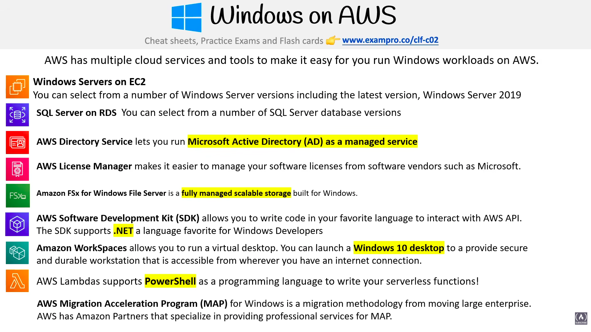
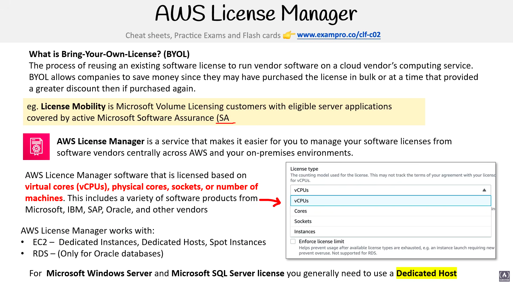

# Windows on AWS

> **Exam:** AWS Certified Cloud Practitioner (CLF-C02)
> **Topic 17:** **Windows on AWS** — the services and tools that make it easy to run **Microsoft Windows workloads** (Windows Server, SQL Server, Active Directory, .NET, etc.) on AWS. The exam asks *"which AWS service hosts/supports this Windows technology?"* — so the goal here is to match each **Windows thing** to its **AWS service.**

**AWS has multiple cloud services and tools to make it easy for you to run Windows workloads on AWS.** You can lift-and-shift existing Windows servers, run Windows-native apps, use Microsoft licensing, and connect to Active Directory — all without leaving AWS.

---

## 1. The Windows-on-AWS Services at a Glance (the slide)

| AWS service | Windows workload it handles | Keyword hook |
|---|---|---|
| **Windows Server on EC2** | Run **Windows Server** VMs (e.g. **Windows Server 2019** + older) | "Windows Server", "Windows VM" |
| **SQL Server on RDS** | Managed **Microsoft SQL Server** database | "SQL Server", "managed Windows DB" |
| **AWS Directory Service** | **Microsoft Active Directory (AD) as a managed service** | "Active Directory", "managed AD" |
| **AWS SDK (.NET)** | Write code that talks to the AWS API in **.NET** | "**.NET**", "Windows developers" |
| **Amazon FSx for Windows File Server** | **Fully managed, scalable** Windows file **storage** | "Windows file shares", "SMB", "FSx" |
| **Amazon WorkSpaces** | Virtual **Windows 10 desktop** (DaaS) | "Windows desktop in the cloud", "VDI" |
| **AWS Lambda (PowerShell)** | Run **PowerShell** in serverless functions | "PowerShell", "serverless Windows scripting" |
| **AWS Migration Acceleration Program (MAP)** | Methodology + partners to **migrate Windows** workloads | "migrate Windows to AWS", "MAP" |

> **Big idea:** for almost every Microsoft technology there's a matching AWS service — **Windows Server → EC2**, **SQL Server → RDS**, **Active Directory → Directory Service**, **file shares → FSx for Windows**, **desktops → WorkSpaces**, **.NET/PowerShell → SDK/Lambda**.

---

## 2. Windows Servers on EC2

- You can **select from a number of Windows Server versions**, including the latest, **Windows Server 2019**, as well as older versions.
- Runs as a normal **EC2 instance** with a Windows AMI — you get a full Windows Server VM in the cloud.
- **Licensing:** Windows license can be **included in the EC2 price** (license-included AMIs) or **brought yourself** via **BYOL** on a **Dedicated Host** (see Topic 09 §4 Tenancy / BYOL).
- **Exam hook:** "run **Windows Server**" → **EC2** (with a Windows AMI).

---

## 3. SQL Server on RDS

- You can **select from a number of SQL Server database versions** — **Microsoft SQL Server** runs as a **managed RDS** engine.
- As a managed service, **AWS handles OS/DB patching, backups, and HA (Multi-AZ)** — you just manage data and access (Topic 07 §6).
- **Exam hook:** "managed **Microsoft SQL Server** database" → **Amazon RDS** (SQL Server engine). (If they want it self-managed with OS access, that's **SQL Server on EC2** instead.)

---

## 4. AWS Directory Service — managed Active Directory

- Lets you run **Microsoft Active Directory (AD) as a managed service.**
- AD is Microsoft's identity/directory system (users, groups, domain-join, Group Policy). Directory Service runs it for you so Windows workloads can authenticate as they do on-premises.
- Options recap (Topic 10 §4): **AWS Managed Microsoft AD** (real AD in AWS), **AD Connector** (proxy to your on-prem AD), **Simple AD** (lightweight standalone).
- **Exam hook:** "**Active Directory** as a managed service", "domain-join Windows instances" → **AWS Directory Service.**

---

## 5. AWS SDK — .NET for Windows developers

- The **AWS Software Development Kit (SDK)** lets you **write code in your favourite language to interact with the AWS API.**
- The SDK **supports .NET**, the language favourite for **Windows developers** (C#/.NET).
- **Exam hook:** "**.NET** developers building on AWS" → **AWS SDK for .NET.**

---

## 6. Amazon FSx for Windows File Server

- A **fully managed, scalable storage** built for **Windows** — a native **Windows file system** (SMB protocol, NTFS, integrates with Active Directory).
- Use it for **Windows file shares / lift-and-shift apps** that expect a Windows file server, without running and patching a file server yourself.
- **Exam hook:** "**Windows file share / SMB / NTFS**", "fully managed Windows storage" → **FSx for Windows File Server.** (Contrast: **FSx for Lustre** = high-performance Linux/compute; Topic 06 §8.)

---

## 7. Amazon WorkSpaces — Windows desktops in the cloud

- Lets you **run a virtual desktop** — you can **launch a Windows 10 desktop** to provide a **secure and durable workstation** that's **accessible from wherever you have an internet connection.**
- This is **Desktop-as-a-Service (DaaS) / VDI** — a managed cloud PC for remote workers (Topic 14 §1).
- **Exam hook:** "**Windows desktop in the cloud**", "virtual desktop / VDI / remote workforce" → **Amazon WorkSpaces.** (Contrast: **AppStream 2.0** streams a *single app*, not a full desktop.)

---

## 8. AWS Lambda — PowerShell support

- **AWS Lambda supports PowerShell as a programming language** for your **serverless functions.**
- So Windows admins can run their familiar **PowerShell** scripts serverlessly, with no server to manage (Topic 16 §5).
- **Exam hook:** "run **PowerShell** serverlessly / as a Lambda runtime" → **AWS Lambda.**

---

## 9. AWS Migration Acceleration Program (MAP) for Windows

- A **migration methodology** for **moving large enterprise** Windows workloads to AWS.
- AWS has **Amazon Partners that specialise in providing professional services for MAP** — i.e. expert help to plan and execute the migration.
- **Exam hook:** "**migrate large Windows/enterprise** workloads with a proven methodology + partner help" → **Migration Acceleration Program (MAP).**

> MAP is a **program/methodology**, not a single technical service — pair it with migration tools like **AWS Application Migration Service / DMS** for the actual moving of servers and databases.

---

## 10. AWS License Manager & Bring-Your-Own-License (BYOL)

### What is Bring-Your-Own-License (BYOL)?
- **The process of reusing an existing software license to run vendor software on a cloud vendor's computing service.**
- **BYOL allows companies to save money**, since they may have **purchased the license in bulk** or at a time that **provided a greater discount** than buying again.
- **Example — License Mobility:** a benefit for **Microsoft Volume Licensing** customers with **eligible server applications** covered by **active Microsoft Software Assurance (SA)** — it lets them move those licenses to the cloud.

### AWS License Manager
- A service that makes it **easier to manage your software licenses from software vendors centrally across AWS and your on-premises environments.**
- It tracks licenses **based on the metric the software is licensed by:**
  - **Virtual cores (vCPUs)**
  - **Physical cores**
  - **Sockets**
  - **Number of machines / instances**
- Covers a variety of products from **Microsoft, IBM, SAP, Oracle**, and other vendors.
- You can define **license rules** and **Enforce license limits** — License Manager **stops launches that would breach your license count**, helping you stay compliant and avoid over-use penalties.

### What License Manager works with
| Resource | Support |
|---|---|
| **EC2** | **Dedicated Hosts, Dedicated Instances, Spot Instances** |
| **RDS** | **Only for Oracle databases** |

> ⭐ **The key licensing rule (ties to Topic 09 §4 Tenancy):** for **Microsoft Windows Server** and **Microsoft SQL Server** licenses, you **generally need to use a Dedicated Host** — because those licenses are often tied to **physical cores/sockets**, which only a Dedicated Host exposes and keeps stable for BYOL.

- **Exam hook:** "**centrally manage / track software licenses** by **vCPU/core/socket/instance**, across AWS + on-prem, **enforce limits**" → **AWS License Manager.**

---

## 11. Exam Triggers

- "Run **Windows Server** (e.g. **Server 2019**) in the cloud" → **EC2** (Windows AMI).
- "Managed **Microsoft SQL Server** database" → **RDS** (SQL Server engine).
- "Run **Active Directory** as a **managed service** / domain-join Windows" → **AWS Directory Service.**
- "Build on AWS in **.NET / C#**" → **AWS SDK for .NET.**
- "**Windows file share**, **SMB**, **NTFS**, fully managed Windows storage" → **FSx for Windows File Server.**
- "**Windows 10 virtual desktop** accessible over the internet" → **Amazon WorkSpaces.**
- "Run **PowerShell** in a serverless function" → **AWS Lambda.**
- "**Migrate large enterprise Windows** workloads (methodology + partners)" → **Migration Acceleration Program (MAP).**
- "Reuse my existing **Windows/SQL Server licenses (BYOL)**" → **EC2 Dedicated Host** (Topic 09 §4).
- "**Centrally manage / track software licenses** (Microsoft/Oracle/SAP/IBM) by **vCPU/core/socket/instance**, across AWS + on-prem, **enforce limits**" → **AWS License Manager.**
- "**Reuse an existing license** to run vendor software on AWS to **save money**" → **BYOL.**
- "**Microsoft Volume Licensing** + **Software Assurance (SA)** moving licenses to cloud" → **License Mobility.**

---

## 12. Common Confusions to Nail

1. **SQL Server on RDS vs on EC2.** RDS = **managed** (AWS patches OS + DB engine, you only manage data/access). EC2 = **self-managed** (you get OS/SSH access, you patch everything). Pick by "managed" vs "full control."
2. **FSx for Windows vs FSx for Lustre.** **Windows File Server** = SMB/NTFS Windows file shares + AD integration. **Lustre** = high-performance computing (Linux, HPC/ML). Don't swap them.
3. **WorkSpaces vs AppStream 2.0.** WorkSpaces = a **full persistent Windows desktop**. AppStream = streams a **single application**. "Whole desktop" → WorkSpaces.
4. **Directory Service ≠ IAM.** Directory Service runs **Microsoft Active Directory** (for Windows/domain identities). **IAM** controls access to **AWS resources** (Topic 10 §1). Different identity systems.
5. **MAP is a program, not a tool.** MAP = the **methodology + partner program** for migrating; the actual data/server moving is done by tools like **Application Migration Service / DMS**.
6. **Windows licensing — included vs BYOL.** License-included EC2 AMIs bundle the Windows license in the hourly price; **BYOL** (reuse your own licenses) requires a **Dedicated Host** (Topic 09 §4).
7. **License Manager ≠ License Mobility ≠ BYOL.** **BYOL** = the *concept* (reuse your own license on AWS). **License Mobility** = a specific *Microsoft benefit* (Volume Licensing + Software Assurance) that *permits* moving certain licenses to the cloud. **AWS License Manager** = the AWS *service* that *tracks and enforces* those licenses by vCPU/core/socket/instance.
8. **License Manager + RDS = Oracle only.** On RDS, License Manager supports **only Oracle databases** — not SQL Server. (SQL Server licensing on AWS is generally handled on **EC2 Dedicated Hosts**.)

---

## Quick Revision Cheat Sheet

| Windows need | AWS service | Keyword |
|---|---|---|
| Windows Server VM | **EC2** (Windows AMI) | "Windows Server 2019" |
| Managed SQL Server DB | **RDS** (SQL Server) | "managed SQL Server" |
| Managed Active Directory | **AWS Directory Service** | "managed AD" |
| Build on AWS in .NET | **AWS SDK (.NET)** | ".NET / C#" |
| Windows file shares (SMB) | **FSx for Windows File Server** | "SMB / NTFS / AD" |
| Virtual Windows desktop | **Amazon WorkSpaces** | "Windows 10 desktop / VDI" |
| Serverless PowerShell | **AWS Lambda** | "PowerShell runtime" |
| Migrate enterprise Windows | **Migration Acceleration Program (MAP)** | "methodology + partners" |
| Reuse Windows/SQL licenses | **EC2 Dedicated Host (BYOL)** | "bring your own license" |
| Centrally track/enforce licenses | **AWS License Manager** | "vCPU/core/socket/instance, AWS + on-prem" |

### Top exam points to remember
1. **Every Microsoft technology has a matching AWS home:** Windows Server → **EC2**, SQL Server → **RDS**, Active Directory → **Directory Service**, Windows file shares → **FSx for Windows**, desktops → **WorkSpaces**, .NET → **SDK**, PowerShell → **Lambda**.
2. **FSx for Windows File Server** = managed **SMB/NTFS** Windows storage with **AD integration** (≠ FSx for Lustre).
3. **WorkSpaces = full Windows desktop (DaaS)**; AppStream = single app.
4. **SQL Server: RDS = managed, EC2 = self-managed.**
5. **MAP** = the program/methodology (+ partners) to **migrate** large enterprise Windows workloads.
6. **BYOL** for Windows/SQL Server licenses → **EC2 Dedicated Host.**
7. **AWS License Manager** centrally **tracks & enforces** software licenses (Microsoft/Oracle/SAP/IBM) by **vCPU/core/socket/instance** across AWS + on-prem; with **RDS it's Oracle-only**. **BYOL** = the concept, **License Mobility** = the Microsoft SA benefit, **License Manager** = the AWS service.
