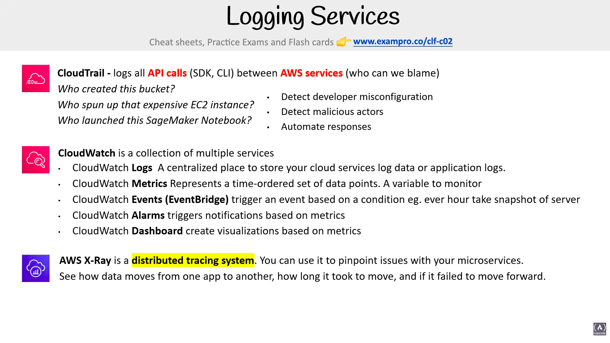
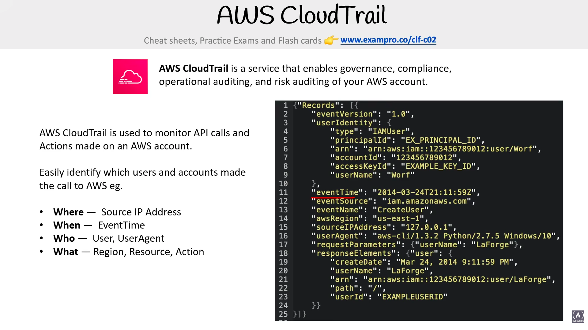
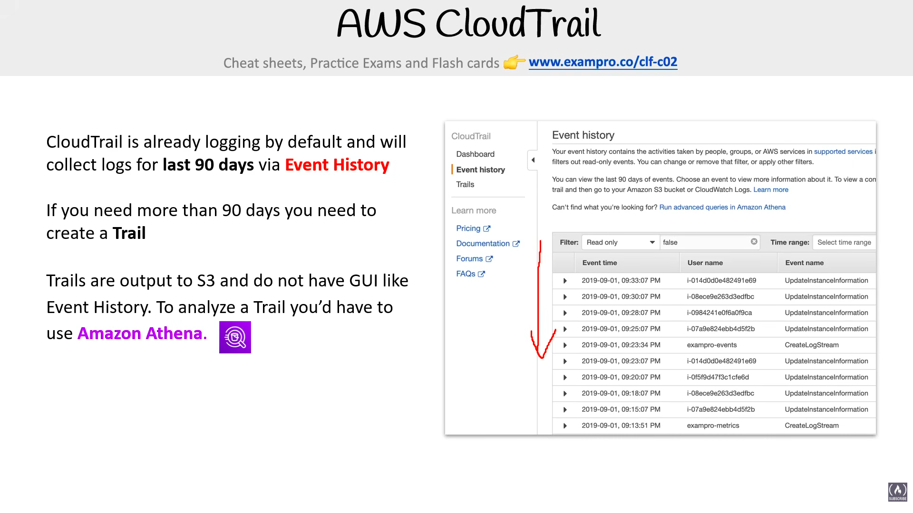
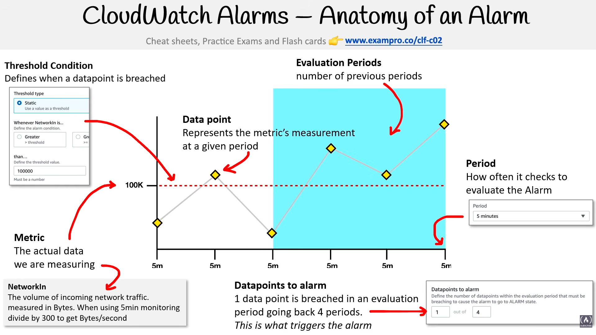

# Logging Services

> **Exam:** AWS Certified Cloud Practitioner (CLF-C02)
> **Topic 18:** **AWS Logging & Monitoring Services** — how AWS records *what happened, who did it, and how the system is performing.* The exam constantly asks *"which service tells you **who** made an API call?"* vs *"which service **monitors metrics / triggers alarms**?"* vs *"which service **traces a request** across microservices?"* — that's CloudTrail vs CloudWatch vs X-Ray. Getting this trio straight is worth several marks.

These three services finally graduate the placeholder overview from Topic 03 into a full treatment: **CloudTrail** (audit/who), **CloudWatch** (monitor/performance), **X-Ray** (trace/requests).

---

## 1. The Logging Services at a Glance (the slide)

| Service | Answers the question | One-liner | Keyword hook |
|---|---|---|---|
| **CloudTrail** | **WHO did what?** (the blame log) | Logs all **API calls** between AWS services | "who created/deleted/launched…", "API history", "audit" |
| **CloudWatch** | **HOW is it performing?** | A **collection** of monitoring services (Logs, Metrics, Events, Alarms, Dashboards) | "metrics", "alarm", "monitor", "logs" |
| **AWS X-Ray** | **WHERE did the request go / slow down?** | **Distributed tracing** across microservices | "trace", "microservices", "latency", "request path" |

> **The one-line split the exam tests:**
> - **CloudTrail = WHO** (audit of API calls / actions).
> - **CloudWatch = WHAT/HOW** (metrics, logs, alarms — system health & performance).
> - **X-Ray = WHERE** (trace a single request as it moves through services).

---

## 2. AWS CloudTrail — "who can we blame?"

- **Logs all API calls** (made via the **Console, SDK, or CLI**) **between AWS services.** Essentially a record of **every action taken in your account** — by whom, when, from where.
- The exam framing: **"who can we blame?"** CloudTrail answers questions like:
  - *Who **created this** S3 bucket?*
  - *Who **spun up** that expensive EC2 instance?*
  - *Who **launched** this SageMaker Notebook?*
- **What you use it for (from the slide):**
  - **Detect developer misconfiguration** — find the change that broke something.
  - **Detect malicious actors** — spot unauthorized/suspicious activity.
  - **Automate responses** — trigger automated reactions to specific API events.
- **Exam hook:** "**who** did X?", "**API call history / audit trail**", "**governance / compliance / forensics**" → **CloudTrail.**

> Cross-links Topic 13 §3: the classic trap is **CloudTrail (WHO did what API call, when, where) vs AWS Config (WHAT a resource's configuration is / how it changed + compliance).**

### 2.1 What CloudTrail is *for* (the four words)

CloudTrail is a service that enables **governance, compliance, operational auditing, and risk auditing** of your AWS account. It **monitors API calls and Actions** made on an AWS account.

It **easily identifies which users and accounts made the call to AWS** — every event answers four questions:

| Question | CloudTrail field |
|---|---|
| **Where** | **Source IP Address** |
| **When** | **EventTime** |
| **Who** | **User, UserAgent** |
| **What** | **Region, Resource, Action** |

Each logged event is a **JSON record** capturing exactly this — e.g. a `CreateUser` event shows `userIdentity` (the IAM user who made the call, their ARN, account ID, access key), `eventTime`, `eventName`, `awsRegion`, `sourceIPAddress`, `userAgent`, and the request/response parameters. **That JSON is the "who/when/where/what" audit trail.**

### 2.2 Event History vs Trail (⭐ the 90-day exam fact)

| | **Event History** | **Trail** |
|---|---|---|
| **On by default?** | **Yes** — CloudTrail is **already logging by default** | No — **you create it** |
| **Retention** | **Last 90 days only** | **Beyond 90 days** (long-term) |
| **Where it lives** | Built-in **console GUI** | **Output to an S3 bucket** (no GUI) |
| **How to analyze** | Browse/filter in the console | Use **Amazon Athena** (query the logs in S3) |

- **CloudTrail is already logging by default** and keeps the **last 90 days** of activity in **Event History** (a searchable console view).
- **If you need more than 90 days, you must create a Trail.**
- **Trails output to S3** and **do not have a GUI** like Event History — **to analyze a Trail you'd use Amazon Athena** (serverless SQL on S3, Topic 16 §8).

> **Exam hooks:** "view the **last 90 days** of activity, no setup" → **Event History.** "Keep API logs **longer than 90 days**" → **create a Trail** (→ **S3**). "**Analyze / query** CloudTrail logs stored in S3" → **Amazon Athena.**

---

## 3. Amazon CloudWatch — the monitoring collection

CloudWatch is **not one thing — it's a collection of multiple services** for monitoring your AWS resources and applications:

| CloudWatch component | What it does | Think of it as |
|---|---|---|
| **CloudWatch Logs** | A **centralized place to store** your cloud services' log data or application logs | the log bucket |
| **CloudWatch Metrics** | A **time-ordered set of data points** — a **variable to monitor** (e.g. CPU%) | the measurement |
| **CloudWatch Events (EventBridge)** | **Trigger an event based on a condition** (e.g. *every hour, take a snapshot of a server*) | the scheduler / reactor |
| **CloudWatch Alarms** | **Trigger notifications based on metrics** (e.g. CPU > 80% → alert/scale) | the alert |
| **CloudWatch Dashboard** | **Create visualizations based on metrics** | the charts |

- **How they fit together:** resources emit **Metrics** → you watch them on a **Dashboard** → an **Alarm** fires when a metric crosses a threshold → it can send a notification (often via **SNS**) or trigger an action (e.g. **Auto Scaling**). Apps/services ship text into **Logs**; **Events/EventBridge** react to conditions or schedules.
- **CloudWatch Events = EventBridge:** the same event-bus engine (Topic 11 §5.3) — CloudWatch Events is the older name.
- **Exam hooks:**
  - "store / search **log files**" → **CloudWatch Logs.**
  - "a **metric** / variable to monitor over time" → **CloudWatch Metrics.**
  - "**notify me / scale** when CPU crosses a threshold" → **CloudWatch Alarm.**
  - "**scheduled** action, e.g. nightly snapshot" → **CloudWatch Events / EventBridge.**
  - "**visualize** metrics on a screen" → **CloudWatch Dashboard.**

### 3.1 Anatomy of a CloudWatch Alarm (the alarm logic)

An alarm isn't just "value > X." It's built from several parts that together decide **when it actually fires**:

| Part | What it is | Example |
|---|---|---|
| **Metric** | The **actual data we are measuring** | `NetworkIn` = incoming network traffic in **Bytes** |
| **Period** | **How often** CloudWatch checks/evaluates the metric | every **5 minutes** |
| **Data point** | One **measurement of the metric at a given period** | the value plotted each 5-min mark |
| **Threshold Condition** | Defines **when a data point is "breached"** | `Greater than 100K` |
| **Evaluation Periods (N)** | The **number of previous periods** CloudWatch looks back over | last **4** periods |
| **Datapoints to alarm (M)** | **How many** breached data points (within the evaluation periods) are needed to **trigger** | **1 of 4** |

**The logic, in one sentence:**
> Every **Period**, CloudWatch records a **Data point** for the **Metric**; it checks the **Threshold Condition**; the alarm **triggers when M of the last N data points are breached** (the **"datapoints to alarm"** rule, e.g. **1 out of 4**).

**Worked example (the slide):** Metric = `NetworkIn`, Threshold = **> 100K Bytes**, Period = **5 min**, Evaluation Periods (N) = **4**, Datapoints to alarm (M) = **1**. → As soon as **1 data point in the last 4 five-minute periods** goes above 100K, the alarm fires.

> **Why M-of-N matters:** requiring **multiple** breached datapoints (e.g. 3 of 3) **avoids false alarms** from a single noisy spike; **1 of 1** reacts fastest but is twitchy. This M-of-N tuning is the part the exam likes to probe.

> **Units gotcha (from the slide):** `NetworkIn` is a **total volume in Bytes per period**, not a rate. With **5-minute** monitoring, **divide by 300** (seconds) to get **Bytes/second**.

**Alarm states:** an alarm sits in **OK** (within threshold), **ALARM** (M-of-N breached), or **INSUFFICIENT_DATA** (not enough data yet). When it enters **ALARM** it can notify via **SNS** or trigger an action like **Auto Scaling** (Topic 09 §9).

---

## 4. AWS X-Ray — distributed tracing

- A **distributed tracing system.** You use it to **pinpoint issues with your microservices.**
- It lets you **see how data moves from one application to another**, **how long it took** to move, and **if it failed** to move forward.
- In a microservices/serverless app (API Gateway → Lambda → DynamoDB…), X-Ray follows a **single request end-to-end** so you can find the **slow** or **failing** hop.
- **Exam hook:** "**trace a request** across **microservices**", "find **latency / bottleneck**", "see **where a request failed**", "distributed tracing" → **AWS X-Ray.**

> X-Ray was listed as a **container/serverless support service** in Topic 12 §8 — here it's framed in its true role: **application performance tracing.**

---

## 5. Putting It Together — which service answers which question?

| You want to know… | Service |
|---|---|
| **Who** created/deleted/launched a resource? | **CloudTrail** |
| **What** is the current/changed **configuration** of a resource? (compliance) | **AWS Config** (Topic 13) |
| **How** is CPU/memory/latency performing? Alert me. | **CloudWatch** (Metrics + Alarms) |
| Store and search my **application/system logs** | **CloudWatch Logs** |
| Run something **on a schedule / on an event** | **CloudWatch Events / EventBridge** |
| **Trace one request** across many microservices | **X-Ray** |

---

## 6. Exam Triggers

- "**Who** made this **API call** / created this resource?", "**audit / compliance / forensics**", "**SDK/CLI/Console** action history" → **CloudTrail.**
- "Detect **developer misconfiguration** / **malicious actors**, automate responses to API events" → **CloudTrail.**
- "**Governance, compliance, operational auditing, risk auditing** of an account" → **CloudTrail.**
- "View the **last 90 days** of account activity with **no setup**" → **CloudTrail Event History** (on by default).
- "Keep API-call logs for **more than 90 days**" → **create a Trail** → outputs to **S3.**
- "**Analyze / query** CloudTrail logs stored in S3" → **Amazon Athena.**
- "**Monitor metrics**, **CPU / memory**, set **alarms**, build **dashboards**" → **CloudWatch.**
- "Store / centralize **log files**" → **CloudWatch Logs.**
- "**Notify / scale** when a metric crosses a threshold" → **CloudWatch Alarm.**
- "Alarm fires only after **M of N** breached data points / **datapoints to alarm** / **evaluation periods**" → **CloudWatch Alarm anatomy.**
- "How **often** the alarm is evaluated" → **Period**; "how far **back** it looks" → **Evaluation Periods.**
- "Alarm states **OK / ALARM / INSUFFICIENT_DATA**" → **CloudWatch Alarm.**
- "**Scheduled** task (e.g. hourly snapshot) / react to a condition" → **CloudWatch Events (EventBridge).**
- "**Visualize** metrics" → **CloudWatch Dashboard.**
- "**Distributed tracing**, **microservices**, find **latency / where a request failed**" → **AWS X-Ray.**

---

## 7. Common Confusions to Nail

1. **CloudTrail vs CloudWatch — the #1 trap.** **CloudTrail = WHO did what (API calls / audit).** **CloudWatch = HOW it's performing (metrics, logs, alarms).** Mnemonic: **Trail = audit trail (people/actions)**; **Watch = watch the dials (performance)**.
2. **CloudTrail vs AWS Config.** CloudTrail = **WHO/what action** (API call, when, where). Config = **WHAT the configuration is / how it changed + compliance** (Topic 13 §3). Both are governance, different angles.
3. **CloudWatch Logs vs CloudTrail.** CloudWatch **Logs** = your **application/system log text** (output of apps). CloudTrail = **API-activity audit** (account actions). Don't confuse "logs."
4. **CloudWatch Metrics vs Alarms vs Dashboards.** Metric = the **measurement**; Alarm = **fires when a metric crosses a threshold**; Dashboard = **visual chart** of metrics. They build on each other.
5. **CloudWatch Events = EventBridge.** Same service, newer name is **EventBridge** (Topic 11). It's how CloudWatch does **scheduled/event-driven triggers.**
6. **CloudWatch vs X-Ray.** CloudWatch = **metrics/logs/alarms** (is it healthy?). X-Ray = **traces a single request's path** across services (where exactly is it slow/broken?). Monitoring vs tracing.
7. **Event History vs Trail.** **Event History** = on by **default**, **last 90 days**, console **GUI**. **Trail** = you **create** it for **>90 days**, outputs to **S3**, **no GUI** → analyze with **Athena**. If a question says "keep logs longer than 90 days" the answer is **create a Trail**, not Event History.
8. **Period vs Evaluation Periods.** **Period** = how *often* a metric is sampled (e.g. every 5 min). **Evaluation Periods (N)** = how *many* recent periods the alarm looks across. They're different knobs — don't merge them.
9. **An alarm ≠ a single breach.** It fires on **M of N** ("**datapoints to alarm**") breached data points, not necessarily one. Tuning M-of-N trades **speed** (1 of 1) vs **false-alarm resistance** (e.g. 3 of 3).

---

## Quick Revision Cheat Sheet

| Service / component | Role | #1 keyword |
|---|---|---|
| **CloudTrail** | Audit of **API calls** — who did what | "who", "audit", "API history", "governance/compliance" |
| **CloudTrail Event History** | Default log, **last 90 days**, GUI | "90 days", "no setup" |
| **CloudTrail Trail** | **>90 days** → **S3**, query with **Athena** | "long-term", "S3", "Athena" |
| **CloudWatch** (umbrella) | Monitoring **collection** | "monitor", "metrics" |
| **CloudWatch Logs** | Store app/system **logs** | "centralized logs" |
| **CloudWatch Metrics** | **Time-ordered** data points to monitor | "metric", "variable" |
| **CloudWatch Alarms** | **Notify/act** on a metric threshold | "alarm", "alert", "trigger scaling" |
| **Alarm anatomy** | Metric + Period + Threshold + **M of N** datapoints | "datapoints to alarm", "evaluation periods" |
| **CloudWatch Events / EventBridge** | **Schedule / event-driven** triggers | "every hour", "on event" |
| **CloudWatch Dashboard** | **Visualize** metrics | "dashboard", "charts" |
| **AWS X-Ray** | **Distributed tracing** of requests | "trace", "microservices", "latency" |

### Top exam points to remember
1. **CloudTrail = WHO (API-call audit).** CloudWatch = **HOW (metrics/logs/alarms/performance).** X-Ray = **WHERE (trace a request across microservices).**
2. **CloudWatch is an umbrella** of components: **Logs, Metrics, Events (EventBridge), Alarms, Dashboards.**
3. **CloudWatch Logs ≠ CloudTrail:** Logs = your app's output; CloudTrail = account API activity.
4. **CloudTrail ≠ AWS Config:** CloudTrail = *who did what (action)*; Config = *what the config is / how it changed (state + compliance)*.
5. **Alarms fire on metric thresholds** → notify (SNS) or trigger Auto Scaling.
6. **X-Ray = distributed tracing** to pinpoint latency/failures across microservices.
7. **CloudTrail = governance/compliance/operational+risk auditing**; every event captures **Where (source IP) / When (event time) / Who (user) / What (region, resource, action)** as a JSON record.
8. **Event History = last 90 days, default, GUI.** For **>90 days** create a **Trail** → stored in **S3** → analyzed with **Amazon Athena.**
9. **A CloudWatch Alarm = Metric + Period + Threshold + M-of-N datapoints.** It fires when **M of the last N** data points breach the threshold ("**datapoints to alarm**"); states are **OK / ALARM / INSUFFICIENT_DATA**, and ALARM can notify via **SNS** or trigger **Auto Scaling**.
