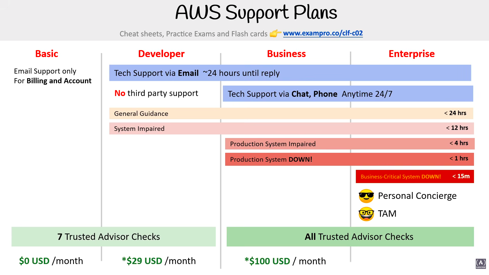
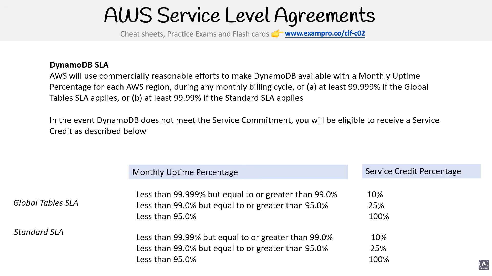
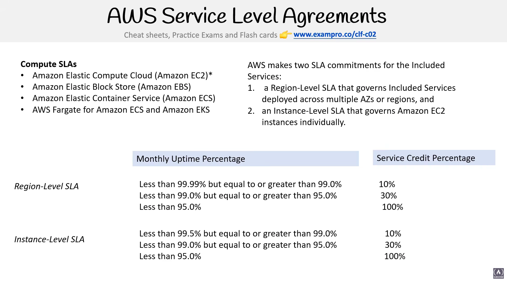
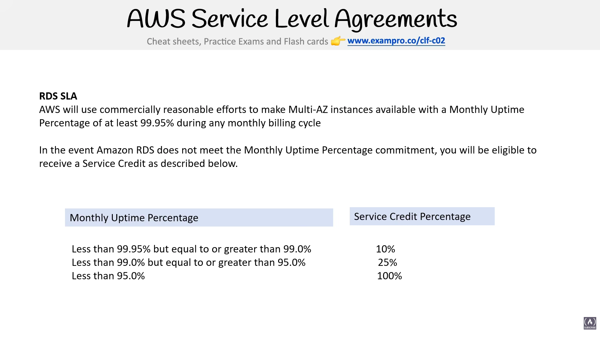

# Billing, Pricing & Support

> **Exam:** AWS Certified Cloud Practitioner (CLF-C02)
> **Topic 22:** **Billing, Pricing & Support.** This is one of the **four exam domains** — *Billing, Pricing, and Support* is **~12% of the CLF-C02 exam** all on its own, and the questions here are some of the easiest marks to bank if you memorise the tables. This topic covers the **AWS Support Plans** (who gets what, response times, who gets a TAM), and will grow to cover the billing & pricing tools (Cost Explorer, Budgets, Billing Console, Pricing Calculator, etc.).

AWS doesn't just sell you compute and storage — it sells you **tiers of help**. When something breaks at 2 a.m., *how fast AWS picks up the phone* and *who you get to talk to* depends entirely on which **Support Plan** your account is on. The exam loves to test this because it maps cleanly to "match the business need to the right plan."

> 💡 Much of the *pricing/cost* side already lives in other topics — **EC2 pricing models** (Topic 09 §11), **TCO, CAPEX vs OPEX, Pricing Calculator, Cost Explorer vs Budgets** (Topic 21 §5), **Cost Allocation Tags** (Topic 13 §4). This topic is the **Support** anchor; cost sections will be cross-linked here as they're added.

---

## 1. AWS Support Plans — the Big Picture



AWS offers **support tiers**, each adding faster response times, more channels, and more perks as you pay more. The slide shows **four** plans:

| Plan | Who it's for | Cost (starting) |
|---|---|---|
| **Basic** | Everyone — comes free with every account | **$0 / month** |
| **Developer** | Experimenting / early dev & test | **$29 / month*** |
| **Business** | Production workloads on AWS | **$100 / month*** |
| **Enterprise** | Business- & mission-critical workloads | **$15,000 / month*** |

> ⭐ **`*` = these are *starting / minimum* prices.** Above the floor, Developer/Business/Enterprise are billed as a **percentage of your monthly AWS usage** (the more you spend, the more support costs). The slide's "$29" and "$100" are just the entry price.

> ⚠️ **Slide is dated — there are actually FIVE plans now.** AWS added **Enterprise On-Ramp** (2021), which sits **between Business and Enterprise**. The exam can mention it. See §4.

---

## 2. What Each Plan Gives You

### 🟢 Basic — *free, comes with every account*
- **Email support for Billing and Account issues only** — **NOT** technical support.
- Access to **7 core Trusted Advisor checks** (the service-limit + basic security ones).
- Documentation, whitepapers, AWS re:Post (community Q&A), and the **Personal Health Dashboard**.
- ❌ No technical case support, no phone, no chat.

### 🔵 Developer — *$29/mo starting*
- **Technical support via email**, response **~24 hours until reply** (business hours).
- **Cloud Support Associates** answer — **one** primary contact can open cases.
- ❌ **No third-party software support.**
- **7 core Trusted Advisor checks** (same as Basic).
- **Use case:** experimenting / non-production dev & test.

### 🟠 Business — *$100/mo starting*
- **Technical support via email, chat, AND phone — 24/7** (anytime).
- **Unlimited contacts** can open unlimited cases.
- **ALL Trusted Advisor checks** (full set, not just 7).
- **Some** third-party software support (common OS & app stacks).
- Access to the **AWS Support API** (programmatically open/manage cases).
- **Use case:** you run **production** workloads on AWS.

### 🔴 Enterprise — *$15,000/mo starting*
- **Everything in Business**, plus:
- ⭐ **TAM — Technical Account Manager:** a **named, dedicated** AWS person who knows your account, does proactive reviews, and is your advocate inside AWS.
- ⭐ **Personal Concierge** support team for **billing & account** questions (a fast-lane, non-technical white-glove team).
- **ALL Trusted Advisor checks.**
- Access to **Infrastructure Event Management (IEM)** and **well-architected / operations reviews**.
- **Use case:** **business- and mission-critical** workloads where downtime costs serious money.

---

## 3. Response Times by Severity ⭐ (memorise this table)

Response time depends on **two things: your plan AND how severe the issue is.** Higher tiers unlock faster SLAs *and* more severe categories.

| Severity | Developer | Business | Enterprise On-Ramp | Enterprise |
|---|---|---|---|---|
| **General guidance** | < 24 business hrs | < 24 hrs | < 24 hrs | < 24 hrs |
| **System impaired** | < 12 business hrs | < 12 hrs | < 12 hrs | < 12 hrs |
| **Production system impaired** | — | < 4 hrs | < 4 hrs | < 4 hrs |
| **Production system down** | — | < 1 hr | < 1 hr | < 1 hr |
| **Business-critical system down** | — | — | **< 30 min** | **< 15 min** ⭐ |

**Reading the slide's severity colours (worst at the bottom):**
- General Guidance → System Impaired → **Production** System Impaired → **Production** System **DOWN!** → **Business-Critical** System **DOWN!**

> ⭐⭐ The single most-tested number: **Business-critical system down = < 15 minutes**, and **only the Enterprise plan** gives it. If a question says *"fastest response / 15-minute response / business-critical,"* the answer is **Enterprise**.

> 📌 **Developer maxes out at "System impaired" (< 12 hrs).** It has **no** production-down or business-critical SLA — that's the line between Developer and Business.

---

## 4. Enterprise On-Ramp (the 5th plan the slide is missing)

AWS added **Enterprise On-Ramp** in 2021 for customers who need **better-than-Business** support but can't justify full Enterprise.

| | **Business** | **Enterprise On-Ramp** | **Enterprise** |
|---|---|---|---|
| **Starting price** | $100/mo | **$5,500/mo** | $15,000/mo |
| **Business-critical down SLA** | ❌ none | **< 30 min** | **< 15 min** ⭐ |
| **TAM** | ❌ | **Pool of TAMs** (shared) | **Designated TAM** (named, dedicated) ⭐ |
| **Concierge** | ❌ | ✔️ | ✔️ |

> ⭐ **TAM distinction = exam trap:** **Enterprise = a *designated/named* TAM** (your own person). **Enterprise On-Ramp = a *pool* of TAMs** (shared, not dedicated). **Business and below = NO TAM at all.**

---

## 5. TAM — Technical Account Manager ⭐

A **Technical Account Manager (TAM)** is a **real, senior AWS expert assigned to your account** as your ongoing technical point of contact. The TAM is the headline perk that separates the **top support tiers** from everyone else — and a very common exam answer.

### Which plans include a TAM?

| Plan | TAM? | Type |
|---|:--:|---|
| Basic | ❌ | — |
| Developer | ❌ | — |
| Business | ❌ | — |
| **Enterprise On-Ramp** | ✔️ | **Pool of TAMs** (shared/on-demand) |
| **Enterprise** | ✔️ | **Designated TAM** (named, dedicated to you) ⭐ |

> ⭐⭐ **The #1 TAM exam fact:** a **TAM is ONLY available on Enterprise On-Ramp and Enterprise.** **Business and below get no TAM** — they get reactive case-based support only. And the two top tiers differ: **Enterprise = your own *designated/named* TAM; Enterprise On-Ramp = a *shared pool* of TAMs** you reach on demand.

### What does a TAM actually do?

A TAM is **proactive** — they don't just wait for you to open a support case, they help you avoid the case in the first place:

| Responsibility | What it means |
|---|---|
| **Your technical point of contact / advocate** | One person who **knows your architecture & account**, and represents you *inside* AWS to escalate issues fast. |
| **Proactive guidance & best practices** | Ongoing reviews of your workloads against AWS best practices; spots risks before they bite. |
| **Well-Architected Reviews** | Helps run **Well-Architected Framework** reviews (cross-links Topic 20) to harden your workloads. |
| **Infrastructure Event Management (IEM)** | Hands-on planning & real-time support for **big scaling events** (product launches, sales spikes, migrations) so you don't fall over under load. |
| **Cost optimization & operations reviews** | Reviews **Trusted Advisor** findings with you, recommends savings and operational improvements. |
| **Faster escalation & prioritization** | Can pull strings internally to **prioritize your support cases** and coordinate AWS specialists. |
| **Onboarding & adoption help** | Guides your teams as you adopt new AWS services / scale up. |

### TAM vs Concierge — don't mix them up

Both are premium perks on the top tiers, but they cover **different problems**:

| | **TAM** | **Concierge Support** |
|---|---|---|
| **Handles** | **Technical** — architecture, performance, scaling, best practices | **Billing & account** — invoices, payment methods, account questions |
| **Style** | Proactive, ongoing, knows your workloads | White-glove billing fast-lane |
| **Plans** | Enterprise On-Ramp (pool) & Enterprise (designated) | Enterprise On-Ramp & Enterprise |

> ⭐ **Trap:** if a question is about **billing/account** help on Enterprise → that's the **Concierge**, not the TAM. The **TAM is the *technical* contact.**

---

## 6. AWS Trusted Advisor

**AWS Trusted Advisor** is an **automated best-practice advisor** — it continuously **inspects your AWS account** and gives **real-time recommendations** to help you save money, boost performance, improve security, increase fault tolerance, and stay within service limits. Think of it as **a cloud expert that reviews your account 24/7 and hands you a to-do list.**

Each check shows a **colour-coded status**: 🟢 green = OK, 🟡 yellow = investigate / recommended action, 🔴 red = action recommended (a problem).

### The 5 categories (pillars) ⭐

| Category | What it checks for — examples |
|---|---|
| **Cost Optimization** | Idle/underutilised resources — **unattached EBS volumes, idle load balancers, low-use EC2 instances, unused RIs** → money you're wasting. |
| **Performance** | Bottlenecks — **over-utilised instances, high-latency config, excessive security-group rules** slowing things down. |
| **Security** | Risk exposure — **open security-group ports (e.g. SSH to 0.0.0.0/0), public S3 buckets, MFA not enabled on root, exposed access keys, no IAM use**. |
| **Fault Tolerance** | Resilience — **EBS snapshots missing, no Multi-AZ, Auto Scaling not enabled, single-AZ deployments** that could fail. |
| **Service Limits** (aka Service Quotas) | Usage **approaching account limits** (e.g. nearing your max number of EC2 instances / VPCs) before you hit a wall. |

> 💡 **Current AWS note:** newer consoles add a 6th category, **Operational Excellence**, and Trusted Advisor now integrates with **AWS Organizations** for org-wide views. CLF-C02 questions still center on the **classic 5** — memorise those.

### Check coverage depends on your Support Plan ⭐

*This is the most-tested Trusted Advisor fact.* **The number of checks you see depends on which Support Plan you're on:**

| Plan | Trusted Advisor checks |
|---|---|
| **Basic** | **7 core checks** (Service Limits + a handful of Security checks) |
| **Developer** | **7 core checks** (same as Basic) |
| **Business** | ⭐ **ALL checks** (full set across all categories) |
| **Enterprise On-Ramp** | **ALL checks** |
| **Enterprise** | **ALL checks** |

**Business & higher also unlock:**
- ✅ **All checks in all 5 categories** (not just the 7 core).
- ✅ **Programmatic access via the AWS Support API** (automate/pull check results).
- ✅ **Amazon EventBridge / CloudWatch alerts** on check status changes + weekly refresh notifications.

> ⭐ **Exam trap:** *"full / all Trusted Advisor checks"* or *"check approaching service limits across all categories"* → requires **Business or higher**. **Basic & Developer get only the 7 core checks** (Service-Limits + core Security). If a question wants automated/programmatic Trusted Advisor → also **Business+** (Support API).

> 📌 Trusted Advisor is also covered as a governance/cost tool — cross-links **Topic 03 §3** and **Topic 20 §5.5 (Cost Optimization)**. Note its 5 categories deliberately mirror the spirit of the **Well-Architected pillars** (Topic 20).

---

## 7. Quick Decision Cues — Match the Scenario to the Plan

| If the question says… | Pick… |
|---|---|
| "Free / comes with every account / billing questions only" | **Basic** |
| "Email-only technical support for a dev/test environment, cheapest tech support" | **Developer** |
| "24/7 phone + chat, production workload, all Trusted Advisor checks" | **Business** |
| "Need a TAM but cheaper than Enterprise / 30-min business-critical" | **Enterprise On-Ramp** |
| "Dedicated TAM + Concierge + 15-minute business-critical response" | **Enterprise** ⭐ |
| "Programmatically open support cases (Support API)" | **Business or higher** |
| "Third-party software support" | **Business or higher** |

---

## 8. AWS Marketplace — What's Sold & How It's Priced

**AWS Marketplace is a curated digital catalog** where you **find, buy, deploy, and manage third-party software** (from independent software vendors — **ISVs**) that runs on AWS. Think of it as an **app store for cloud software** — instead of building everything yourself, you subscribe to a ready-made product and it slots straight into your AWS account.

> ⭐ **The killer billing feature:** anything you buy on Marketplace is **billed through AWS on your single, consolidated AWS bill** — no separate vendor invoice, no new payment relationship. That's *why* Marketplace sits in the Billing/Pricing domain.

### What kinds of products are offered?

| Product type | Example |
|---|---|
| **AMIs (machine images)** | Pre-configured EC2 software — firewalls, OS images, dev stacks (e.g. a hardened Linux, a Fortinet firewall) |
| **SaaS products** | Software you subscribe to and access as a service |
| **Containers** | Container images for ECS / EKS |
| **Machine learning models & algorithms** | Deploy into SageMaker |
| **Data products** | Third-party datasets via **AWS Data Exchange** |
| **Professional services** | Consulting / implementation offerings from partners |
| **APIs** | Ready-to-call third-party APIs |

### Are products free or paid? ⭐ **Both.**

Marketplace lists products across the full pricing spectrum:

| Pricing model | What it means |
|---|---|
| **Free** | $0 for the software itself (you still pay for the underlying AWS resources it runs on, e.g. the EC2 instance) |
| **Free trial** | Try a paid product at no cost for a limited period |
| **BYOL (Bring Your Own License)** | You already own a license — reuse it on the Marketplace product (cross-links Topic 17 §10) |
| **Hourly / Annual** | Pay per hour the software runs, or a discounted yearly commitment |
| **Monthly subscription** | Flat recurring fee |
| **Usage-based / pay-as-you-go** | Charged on a metered metric (data processed, requests, etc.) |
| **Contract / private offer** | Negotiated custom pricing & terms direct with the seller |

> 📌 **Even a "free" Marketplace product isn't always $0 total** — the *software* may be free, but you still pay AWS for the **EC2/storage/resources** it consumes. Watch for this nuance in exam wording.

### Procurement & governance features (exam-relevant)

| Feature | What it does |
|---|---|
| **Private Marketplace** | Admins curate an **approved-products-only** catalog for their org (via AWS Organizations) so staff can only buy vetted software |
| **Private Offers** | A seller extends **custom negotiated pricing/terms** to a specific buyer |
| **Consolidated billing** | All purchases roll into your AWS invoice (and Organizations consolidated bill) |

> ⭐ **Marketplace vs Service Catalog (classic trap):** **AWS Marketplace = buy *third-party/ISV* software** (an external store). **AWS Service Catalog = publish *your own organisation's* approved products/templates** for internal self-service (cross-links Topic 13 / Topic 15 §6). Buy-from-outside vs offer-your-own-inside.

---

## 9. Consolidated Billing & Cost Management Tools

### Consolidated Billing ⭐

**Consolidated Billing** is a feature of **AWS Organizations** (cross-links Topic 13 §1): you designate **one account as the payer** and **all the other accounts roll their charges up into a single bill** paid by that one account.

- The **management account** (formerly *master* / *payer* account) **pays for everything**.
- The other accounts are **member accounts** (formerly *linked* accounts) — they keep running independently, but their spend lands on the management account's invoice.
- You still see **per-account usage broken out**, so you know exactly which account spent what — you just pay **one combined bill**.

```
                 ┌─────────────────────────────┐
                 │   MANAGEMENT (Payer) Account │  ← pays ONE bill
                 └──────────────┬──────────────┘
            ┌──────────────┬────┴────┬──────────────┐
      ┌─────▼─────┐  ┌─────▼─────┐  ┌─────▼─────┐  ┌─────▼─────┐
      │ Member A  │  │ Member B  │  │ Member C  │  │ Member D  │  ← usage rolls up
      └───────────┘  └───────────┘  └───────────┘  └───────────┘
```

**Why use it (exam benefits):**

| Benefit | Detail |
|---|---|
| **One bill** | A single invoice across all accounts — far easier than paying each separately. |
| **Per-account visibility** | Track and break down cost **by account** even though you pay once. |
| ⭐ **Volume / tiered discounts** | Usage from **all accounts is aggregated**, so you reach **higher-volume pricing tiers faster** (e.g. S3 tiered pricing, data-transfer tiers) than any single account would alone. |
| ⭐ **Shared Reserved Instances & Savings Plans** | **RI and Savings Plans discounts are shared across the whole organization** — an unused RI in one account can cover matching usage in another (cross-links Topic 09 §11). |
| **Free** | Consolidated Billing itself **costs nothing** — it's a built-in Organizations feature. |

> ⭐⭐ **Top exam facts:** *one management/payer account → one bill for many accounts*; **aggregated usage unlocks bigger volume discounts**; **RIs & Savings Plans are shared org-wide**; it's a **free** AWS Organizations feature.

> 📌 **Terminology note:** AWS retired "master account" → now **management account**, and "linked account" → **member account**. The exam may still use the old words.

#### Volume Discounts — how the aggregation works ⭐

Many AWS services use **tiered (volume) pricing**: the **more you use, the cheaper the per-unit price** gets as you cross into higher tiers (e.g. S3 storage, data transfer out). Normally each account is metered **on its own**, so a small account never reaches the cheaper tiers.

**With Consolidated Billing, AWS adds up the usage of *all* accounts and bills it as if it were one account.** That **combined volume pushes you into the discounted tiers sooner**, and every account benefits.

**Worked example (S3 tiered storage — illustrative numbers):**

| Tier | Price per GB |
|---|---|
| First 50 TB / month | $0.023 / GB |
| Next 450 TB / month | $0.022 / GB |
| Over 500 TB / month | $0.021 / GB |

- **Without** consolidated billing: Account A (20 TB), B (20 TB), C (20 TB) each sit **inside the first 50 TB tier** → all 60 TB billed at the **$0.023** top rate.
- **With** consolidated billing: 20 + 20 + 20 = **60 TB aggregated** → the **first 50 TB at $0.023** and the **next 10 TB drop to the $0.022 tier** → a **lower blended price** for the whole org.

> ⭐ **Exam phrasing to recognise:** *"combine usage to receive volume pricing discounts"* or *"the more you use, the less you pay, aggregated across accounts"* → **Consolidated Billing**. The same aggregation is also what lets **Reserved Instances & Savings Plans be shared** — an unused RI in one account automatically applies to matching usage in another.

> 📌 The management account can **turn off RI/Savings Plans sharing** for specific accounts if it doesn't want discounts pooled.

### Cost Explorer ⭐

**AWS Cost Explorer** is a **free visualization tool to view, analyze, and forecast your AWS cost and usage over time** — graphs and tables that turn your raw spend into an at-a-glance picture of *where the money goes*. (For the raw, exhaustive data behind it, see the **CUR** below.)

**Key facts ⭐**

| Aspect | Detail |
|---|---|
| **Time range** | Up to **12 months of history** + the current month + a **~12-month forecast**. |
| **Granularity** | **Monthly or daily** views (optional **hourly + resource-level** data for an extra charge). |
| **Filter & group by** | **Service, linked account, Region, AZ, instance type, usage type, or cost-allocation tag** — ideal for a consolidated-billing org to see *which account/service drives the bill*. |
| **Built-in reports** | Default reports (e.g. *Monthly costs by service*, *Daily costs*) **plus saved custom reports**. |
| **Recommendations** | **Rightsizing** (downsize/idle EC2), **Savings Plans**, and **Reserved Instance** purchase recommendations. |
| **Access** | **Billing & Cost Management console**, or programmatically via the **Cost Explorer API**. |

> 📌 First time you enable Cost Explorer, AWS takes **~24 hours** to prepare your data; once on, it refreshes regularly.

> ⭐ **Cost Explorer = analyze the PAST & forecast** (visualize what you *already spent* and where it's trending). Contrast with **AWS Budgets = alert you BEFORE/when you exceed a threshold** (proactive), **CUR = the raw line-item data** for your own deep analysis, and **Pricing Calculator = estimate a FUTURE workload before you build it** (cross-links Topic 21 §5).

### AWS Budgets ⭐

**AWS Budgets** lets you **set custom cost & usage thresholds and get alerted when you exceed — or are *forecasted* to exceed — them.** Where Cost Explorer looks **backward** at what you already spent, Budgets is **proactive / forward-looking** — it warns you *before* the bill gets out of hand.

**The 4 budget types ⭐**

| Budget type | What it tracks |
|---|---|
| **Cost budget** | A **dollar amount** of spend (e.g. "alert me if I exceed $500/month"). |
| **Usage budget** | **Usage** of a service in its own units (e.g. GB stored, EC2 hours). |
| **RI utilization budget** | Alerts when your **Reserved Instance utilization drops below** a threshold (you're wasting RIs). |
| **RI / Savings Plans coverage budget** | Alerts when the **% of usage covered** by RIs/Savings Plans falls below a threshold. |

**How alerts & actions work:**
- Triggers on **actual** spend **or** **forecasted** spend crossing your threshold.
- Notifies via **email** or an **Amazon SNS topic** (which can fan out to Lambda, chat, etc.).
- ⭐ **Budget Actions** — Budgets can **automatically *take an action*** when a threshold is breached: **apply a restrictive IAM/SCP policy** (e.g. deny launching new resources) or **stop EC2/RDS instances** — either automatically or after your approval. This turns Budgets from "just an alert" into an **enforcement** tool.
- Set at **monthly / quarterly / annual** granularity; **filter by service, account, region, or cost-allocation tag**.

> 💰 **Pricing:** your **first 2 budgets are free**; beyond that it's a few cents per budget per day. (One of the few cost tools that itself costs anything.)

> ⭐ **Exam line:** *"alert me when spend exceeds / is forecast to exceed a threshold"* → **AWS Budgets**. *"automatically stop resources / block new spend when over budget"* → **Budget Actions**. Contrast with **Cost Explorer** (analyze past, no alerts).

### AWS Cost & Usage Report (CUR) ⭐


The **AWS Cost & Usage Report (CUR)** is the **most comprehensive, granular billing data AWS provides** — a **detailed line-item spreadsheet** of every charge, so you can deeply analyze and understand exactly what drove your bill. Think of it as the **raw source data** that friendlier tools like Cost Explorer summarise.

**Key facts from the slide ⭐**

| Aspect | Detail |
|---|---|
| **What it is** | A **detailed spreadsheet** to better analyze & understand your AWS costs (most granular data available). |
| **Granularity** | Choose **hourly, daily, or monthly** line items. |
| **Includes** | **Cost Allocation Tags** (cross-links Topic 13 §4) so you can break costs down by tag. |
| **Format & destination** | Delivered as **CSV (GZIP)** or **Parquet** into **your chosen S3 bucket**. |

**What you do with it (the slide's 3 integrations):**
- 📦 **Places the reports into S3** — you own the bucket; reports refresh over time.
- 🔎 **Use Amazon Athena** to turn the report into a **queryable database** (run SQL over your billing data).
- 📊 **Use Amazon QuickSight** to **visualize your billing data as graphs/dashboards**.
- *(Also loadable into Amazon Redshift for warehouse-scale analysis.)*

> ⭐ **Exam line:** *"most detailed / granular line-item billing data,"* *"delivered to an S3 bucket,"* or *"query my billing data with Athena / visualize with QuickSight"* → **Cost & Usage Report (CUR)**. Contrast: **Cost Explorer = friendly visual summaries/forecasts** (no raw export); **CUR = the raw, exhaustive data** for your own deep analysis.

### Cost Allocation Tags ⭐

A **cost allocation tag** is a **key–value tag** (e.g. `Project = Phoenix`, `Environment = Prod`) that you **activate in the Billing console** so AWS will **break your bill down by that tag** — letting you see *which project / team / environment / cost-center* is driving spend. (The general tagging strategy lives in **Topic 13 §4**; here is the **billing** angle.)

**Two kinds of cost allocation tags ⭐**

| Type | Prefix | Who creates it |
|---|---|---|
| **AWS-generated tags** | **`aws:`** | Created **automatically by AWS** (e.g. `aws:createdBy`). You can **activate** them but **can't edit/delete** them. |
| **User-defined tags** | **`user:`** | Tags **you** add to your resources (e.g. `Project`, `Team`). You must **activate each one** for billing. |

**The #1 exam fact ⭐** — **tagging a resource is NOT enough.** A tag only shows up in cost reports **after you *activate* it** under **Billing & Cost Management → Cost Allocation Tags**. Key gotchas:
- Activation can take **up to ~24 hours** to take effect.
- It's **not retroactive** — only costs **incurred after activation** are broken out by that tag.
- Once active, the tag becomes a **filter/group dimension in Cost Explorer & AWS Budgets** and a **column in the CUR**.

> ⭐ **Exam line:** *"break down / allocate the bill by project, team, department, environment, or cost-center"* → **Cost Allocation Tags** (the #1 reason to tag). *"tagged my resources but costs still aren't split out"* → you forgot to **activate** the tag in the Billing console. **`aws:` = AWS-generated, `user:` = user-defined.**

### The other cost tools (at a glance)

| Tool | What it does |
|---|---|
| **Cost Explorer** | Visualize/analyze/forecast past & current spend |
| **AWS Budgets** | Set custom cost/usage thresholds → **alerts** (email/SNS) when exceeded or forecast to exceed |
| **AWS Cost & Usage Report (CUR)** | The **most detailed**, line-item billing data (delivered to S3, query with Athena/QuickSight) |
| **Billing & Cost Management Console** | The home for invoices, payment methods, and these tools |
| **Cost Allocation Tags** | Tag resources so the bill can be **broken down by tag** (cross-links Topic 13 §4) |
| **Cost Anomaly Detection** | ML-based detection of unexpected spend spikes |

> ⭐ **Quick split:** **Cost Explorer = analyze past · Budgets = alert on threshold · Pricing Calculator = estimate future · CUR = most granular raw data.**

---

## 10. Service Level Agreements (SLA, SLI, SLO)


When AWS publishes how reliable a service *will* be, it does so through three related terms. The exam wants you to tell them apart.

| Term | Stands for | What it is |
|---|---|---|
| **SLA** | **Service Level Agreement** | A **formal commitment** about the **expected level of service** between a customer and a provider. If the service level **is not met** (and the customer met *their* obligations), the customer is **eligible for compensation — Financial or Service Credits.** |
| **SLI** | **Service Level Indicator** | A **metric / measurement** of what level of performance the customer is *actually* receiving at a given time. Examples: **uptime, availability, performance, throughput, latency, error rate, durability, correctness.** |
| **SLO** | **Service Level Objective** | The **objective the provider agrees to meet** — expressed as a **specific target percentage over a period of time** (e.g. *99.99% availability per month*). |

> 🧠 **How they fit together:** the **SLI** is what you *measure*, the **SLO** is the *target* you set on that measurement, and the **SLA** is the *contract* (with consequences) that promises the SLO. → *measure (SLI) → goal (SLO) → promise + penalty (SLA).*

> ⭐ **Compensation = Service Credits, not cash.** When AWS misses an SLA, you typically get **service credits** applied to a future bill — and **you usually have to *claim* it** (submit a request), it isn't automatic. This is why SLAs live in the **Billing** domain.

### Target percentages — "the nines" ⭐

SLOs are written as a percentage of availability/durability over a period. The more **9s**, the less downtime:

| Target | Nickname | Example use |
|---|---|---|
| **99.95%** | — | Common compute SLA tier |
| **99.99%** | "**four nines**" | Many AWS service availability SLAs (e.g. *99.99% over 3 months*) |
| **99.9999999%** | "**nine nines**" | Very high reliability |
| **99.999999999%** | "**eleven nines**" | ⭐ **Amazon S3 / Glacier durability** (the famous number) |

> ⚠️ **Slide wording flag:** the slide labels the last tier *"Nine elevens"* — that's loose phrasing. The standard term is **"eleven nines" = 99.999999999%**, which is **S3's durability** figure. Read it as *eleven nines.*

### Availability → real downtime (handy intuition)

| Availability | Approx. downtime per **year** | per **month** |
|---|---|---|
| 99% (two nines) | ~3.65 days | ~7.2 hrs |
| 99.9% (three nines) | ~8.77 hrs | ~43 min |
| 99.95% | ~4.38 hrs | ~22 min |
| 99.99% (four nines) | ~52.6 min | ~4.3 min |
| 99.999% (five nines) | ~5.26 min | ~26 sec |

> 📌 The slide's example: **"Availability SLA of 99.99% over a period of 3 months"** — the *period* matters, because credits are calculated against downtime measured **within that window**.

### Real AWS service SLA examples ⭐

Every AWS service publishes its own SLA. They all share the same **shape**: AWS uses *"commercially reasonable efforts"* to hit a **Monthly Uptime Percentage**; if it misses, you get a **Service Credit that grows as uptime drops** (≈10% → 25–30% → 100%). The key exam pattern: **more resilient deployments (Multi-AZ / multi-Region) get a higher SLA (more 9s) than a single instance.**

#### DynamoDB SLA



Two tiers depending on configuration — **Global Tables (multi-Region) gets the higher commitment:**

| Config | Committed Monthly Uptime | Credit tiers |
|---|---|---|
| **Global Tables SLA** (multi-Region) | **99.999%** ⭐ | <99.999%→**10%** · <99.0%→**25%** · <95.0%→**100%** |
| **Standard SLA** (single-Region) | **99.99%** | <99.99%→**10%** · <99.0%→**25%** · <95.0%→**100%** |

#### Compute SLA (EC2, EBS, ECS, Fargate for ECS & EKS)



Covers **EC2, EBS, ECS, and Fargate (for ECS & EKS).** AWS makes **two** commitments — spreading across AZs/Regions earns a much higher SLA than a lone instance:

| SLA | Applies to | Committed Uptime | Credit tiers |
|---|---|---|---|
| **Region-Level SLA** | Services across **multiple AZs / Regions** | **99.99%** ⭐ | <99.99%→**10%** · <99.0%→**30%** · <95.0%→**100%** |
| **Instance-Level SLA** | A **single EC2 instance** | **99.5%** | <99.5%→**10%** · <99.0%→**30%** · <95.0%→**100%** |

> ⭐ **Exam takeaway:** a **single instance only gets 99.5%**; deploying **across multiple AZs raises it to 99.99%** — a direct argument for **Multi-AZ / high-availability design** (cross-links Topic 02 HA, Topic 09 §8–9 ELB/ASG).

#### RDS SLA



| Config | Committed Monthly Uptime | Credit tiers |
|---|---|---|
| **Multi-AZ instances** ⭐ | **99.95%** | <99.95%→**10%** · <99.0%→**25%** · <95.0%→**100%** |

> ⭐⭐ **RDS exam trap:** the RDS SLA **only applies to Multi-AZ instances.** A **Single-AZ** RDS instance is **not covered** by the uptime SLA — another nudge toward Multi-AZ for production (cross-links Topic 07 §6).

> 🧾 **Patterns to remember across all three:** (1) language is always *"commercially reasonable efforts"*; (2) credit ladder is **10% → 25%/30% → 100%** as uptime falls through 99% then 95%; (3) **more 9s for more resilient setups** — DynamoDB Global Tables **99.999%** > Region-level compute / DynamoDB Standard **99.99%** > RDS Multi-AZ **99.95%** > single EC2 instance **99.5%**.

---

## 11. AWS Health Dashboards — Service Health vs Personal Health ⭐

When something feels broken, the first question is always **"is it AWS, or is it me?"** AWS answers that with **two** dashboards. The exam loves to test which one you reach for.

> ⚠️ **Naming flag (current AWS vs older slides/docs):** AWS has **rebranded and merged** these into a single **AWS Health Dashboard** with two views — **"Service health"** (the old *Service Health Dashboard*) and **"Your account"** (the old *Personal Health Dashboard / PHD*). The exam still uses the **classic names** *Service Health Dashboard* and *Personal Health Dashboard*, so learn both the old names and that they're now one product.

### 🌐 AWS Service Health Dashboard (SHD) — *"is AWS itself up?"*

The **Service Health Dashboard** is the **public, general status page for AWS** — it shows the **overall health of every AWS service across every Region**, the **same view for everyone**.

- **Public — no sign-in, not tied to your account.** Anyone can open it (historically at **status.aws.amazon.com**).
- Shows the **current status** of all services per Region, plus a **history of past events/incidents** (rolling, e.g. the last several weeks).
- Answers the **generic** question *"is S3 having a global/regional outage right now?"* — **not** *"is MY instance affected?"*
- You can **subscribe to RSS feeds** per service/Region to get notified of broad service events.

> 💡 Think of it as the **AWS weather report for the whole platform** — broad, public, and **not personalised** to your resources.

### 👤 AWS Personal Health Dashboard (PHD) — *"is MY stuff affected?"*

The **Personal Health Dashboard** gives a **personalised view of how AWS health events affect *your* specific account and resources.** (Already noted under **Basic** in §2 — it's available on **every** support plan, including free.)

- **Account-specific — requires sign-in.** Shows alerts only for the services & resources **you actually use**.
- **Proactive notifications:** upcoming **scheduled changes / maintenance** (e.g. an **EC2 instance retirement**, an **RDS maintenance window**, an **EBS volume on degraded hardware**) **before** they hit you.
- Gives **remediation guidance** and **affected-resource detail** (exact instance IDs, etc.).
- Backed by the **AWS Health API** for programmatic access and **EventBridge** integration to automate responses — but the **Health API requires Business / Enterprise On-Ramp / Enterprise** support (cross-links §6 Support API gating).
- Aggregatable org-wide via **AWS Organizations** ("AWS Health organizational view").

> 💡 Think of it as **your personalised health alerts** — it only tells you about events that touch **your** resources, and warns you about maintenance in advance.

### Side-by-side ⭐

| | **Service Health Dashboard (SHD)** | **Personal Health Dashboard (PHD)** |
|---|---|---|
| **Question it answers** | "Is **AWS** (a service/Region) up?" | "Is **MY account/resources** affected?" |
| **Scope** | **All** AWS services & Regions, global | Only the services/resources **you use** |
| **Personalised?** | ❌ Same for everyone | ✔️ Specific to your account |
| **Sign-in?** | ❌ Public, no login | ✔️ Requires account sign-in |
| **Proactive maintenance alerts** | ❌ | ✔️ (instance retirements, maintenance windows) |
| **Programmatic access** | RSS feeds | **AWS Health API** (Business+ plans) + EventBridge |
| **Now called** | AWS Health Dashboard → **Service health** | AWS Health Dashboard → **Your account** |

> ⭐ **The exam trap in one line:** **public + all of AWS = Service Health Dashboard. Personalised + your resources + maintenance warnings = Personal Health Dashboard.** If a question mentions *"affected resources," "scheduled changes/maintenance on my instances,"* or *"programmatic/EventBridge health events"* → **Personal Health Dashboard.** If it's *"public status of AWS services / is there an outage"* → **Service Health Dashboard.**

> 📌 Cross-links: Personal Health Dashboard also appears in **§2 (Basic plan)** and **Topic 03 §3**. The Health **API** gating mirrors the **Support API** gating in §6 (Business & up).

---

## 12. Reporting Abuse — the AWS Abuse Report Form ⭐

Sometimes the problem isn't *your* account at all — it's that **AWS resources are being used to attack or abuse someone**. AWS has a dedicated **AWS Trust & Safety team** (the **AWS Abuse team**) for exactly this, and you reach it through the **AWS abuse report form** (or by emailing **abuse@amazonaws.com**).

> 💡 This is a **free, public channel — it has nothing to do with your Support Plan.** Anyone (even a non-AWS customer being attacked) can file an abuse report. Don't confuse it with opening a technical support case (§2–§3).

### When do you use it? (two directions)

| Direction | Scenario |
|---|---|
| **You report TO AWS** | You believe **AWS resources** (an EC2 instance, an AWS IP) are the **source** of abusive/illegal/malicious activity — e.g. it's attacking, spamming, or scanning **you**. |
| **AWS contacts YOU** | If **your** AWS resources are flagged for abuse, the Abuse team emails you to investigate/remediate — ignoring it can lead to **suspension**. |

### What counts as "abuse"? (typical exam examples)

- **Spam** — unwanted bulk email, or your address listed as the originator.
- **Port scanning / intrusion attempts** — probing other systems.
- **DoS / DDoS attacks** originating from AWS resources.
- **Malware / botnet / command-and-control** traffic.
- **Phishing / fraudulent websites** hosted on AWS.
- **Hosting objectionable / illegal / copyrighted (prohibited) content.**

### How to report

| Method | Detail |
|---|---|
| **AWS abuse report form** | Online form on the AWS site — the primary, recommended channel. |
| **Email** | **abuse@amazonaws.com** — include logs, timestamps (with time zone), and the offending **IP/resource**. |

> ⭐ **Exam trap:** *"How do I report suspected abusive, malicious, or illegal activity coming from AWS resources?"* → the **AWS abuse report form / abuse@amazonaws.com (AWS Trust & Safety / Abuse team)** — **not** a support case, and **not** dependent on your support tier.

> 📌 Related but different: **penetration testing** of *your own* AWS resources is now **pre-approved** for a list of services (no permission form needed for those) — but **simulated DDoS / abuse-style tests still require AWS approval**. The Abuse form is for **reporting** abuse, not requesting permission to test.

---

## 13. AWS Credits ⭐

**AWS credits** are **promotional / monetary credits applied to your account that automatically offset (reduce) your AWS bill.** When AWS calculates your monthly charges, **eligible credits are subtracted first**, and only the remainder is billed to your payment method.

> 💡 Don't confuse these with the **Service Credits** from an SLA breach (§10). Both reduce your bill, but their *origin* is different — see the confusion note below.

### Where do credits come from?

| Source | What it is |
|---|---|
| **AWS Activate** | Credits for **startups** (via accelerators, incubators, VCs, or the AWS Activate program). |
| **AWS Promotional Credits** | Codes from **events, trainings, webinars, proofs-of-concept**, or AWS-sponsored programs. |
| **AWS Educate / AWS Academy** | Credits for **students & educators** for learning/labs. |
| **Goodwill / support credits** | Issued by AWS Support as a courtesy (separate from formal SLA service credits). |

### How credits work — the exam facts ⭐

- **Redeemed in the Billing & Cost Management console** → *Credits* page (enter the **promo code**).
- **Applied automatically** to eligible charges before your card is charged.
- ⭐ **Every credit has an *expiration date*** — unused credit is lost after it expires.
- ⭐ **Credits often have *usage restrictions*** — valid only for **specific services and/or Regions** (e.g. "EC2 only," "us-east-1 only").
- **Not everything is covered:** credits typically **don't** apply to **AWS Marketplace third-party charges, certain taxes, or Reserved Instance/Savings Plans upfront fees.**
- AWS applies credits **soonest-to-expire / most-restrictive first** to maximise their use.

### Credits in AWS Organizations (consolidated billing)

- By default, **credits are *shared* across the whole organization** (an unused credit in one account can cover another account's eligible spend) — same pooling idea as RIs/Savings Plans (§9).
- The **management account can turn credit sharing on/off** per account.

> ⭐ **Exam takeaway:** *"a code that reduces my bill / startup credits / promotional credits"* → **AWS credits** (redeem in Billing console; have **expiration dates** and **service/Region restrictions**; shared org-wide by default but toggleable).

---

## 14. AWS Partner Network (APN) ⭐

The **AWS Partner Network (APN)** is AWS's **global community of third-party companies** that build products on AWS or help customers design, migrate, and run their AWS workloads. When you need outside expertise or a ready-made solution, APN is the **vetted ecosystem** AWS points you to.

> 💡 Key framing: **APN = *partner companies* (third parties), NOT AWS's own staff.** AWS's own consulting arm is **AWS Professional Services** — that's a different thing (see the confusion note).

### The two main partner types ⭐

| Type | Who they are | What they do |
|---|---|---|
| **Technology Partners** (ISVs) | **Independent Software Vendors** — software companies | Build **software/products** that run on or integrate with AWS (SaaS, tools, platforms). They commonly **list on AWS Marketplace** (cross-links §8). |
| **Consulting / Services Partners** | System Integrators, **MSPs**, resellers, agencies, consultancies | **Help customers** design, build, **migrate**, deploy, and **manage** workloads on AWS — i.e. they do the hands-on work *for* you. |

### Partner tiers & validations (exam-relevant)

| Concept | What it means |
|---|---|
| **Partner tiers** | Partners are ranked by proven expertise & customer success: **Select → Advanced → Premier** (Premier = highest). |
| **AWS Competencies** | A **validated badge of deep expertise** in a specific area — e.g. **Security, Migration, Machine Learning, DevOps**, or an industry vertical (Healthcare, Finance). "Look for a partner with the *X Competency*." |
| **MSP Program** | **Managed Service Provider** partners — validated to **operate & manage** your AWS environment end-to-end (monitoring, ops, optimization). |
| **Service Delivery / Well-Architected Programs** | Validate a partner's expertise with **specific AWS services** or at running **Well-Architected Reviews** (cross-links Topic 20). |

### Related: AWS IQ (small projects / individuals)

**AWS IQ** connects customers with **AWS Certified independent experts & freelancers** for **small, on-demand projects** (paid through your AWS bill). Contrast: **APN = partner *companies*** for larger engagements; **AWS IQ = individual certified *freelancers*** for quick help.

> ⭐ **Exam takeaway:** *"third-party company that builds software on AWS"* → **Technology Partner / ISV**. *"company that helps me migrate/manage my workloads"* → **Consulting / Services Partner** (or **MSP** if it's ongoing management). *"validated expertise in security/migration/ML"* → an **AWS Competency** partner. *"hire a certified freelancer for a small task"* → **AWS IQ**.

---

## 15. Exam Triggers

- **"< 15 minutes" / "business-critical system down" / "fastest response"** → **Enterprise**.
- **"< 30 minutes business-critical" / "pool of TAMs / cheaper than Enterprise"** → **Enterprise On-Ramp**.
- **"Technical Account Manager (TAM)"** → **Enterprise** (designated) or **Enterprise On-Ramp** (pool). **Never** Business or below.
- **"Concierge Support / dedicated billing & account help"** → **Enterprise** (and On-Ramp).
- **"24/7 phone and chat support"** → **Business or higher** (Developer is **email only**).
- **"All / full Trusted Advisor checks"** → **Business or higher**. **"7 / core checks"** → **Basic or Developer**.
- **"AWS Support API" / "programmatically manage cases"** → **Business or higher**.
- **"Free support included with the account"** → **Basic** (but it's **billing/account only, not technical**).
- **"$29 / month"** → **Developer**. **"$100 / month"** → **Business**.
- **"Production system down, ≤ 1 hour response"** → **Business** is the **cheapest** plan that qualifies.
- **"Buy / find third-party (ISV) software, billed on one AWS bill"** → **AWS Marketplace**.
- **"Curate an approved-only catalog of products for the org"** → **Private Marketplace**.
- **"Negotiated custom pricing from a seller"** → **Private Offer**.
- **"Publish *our own* approved templates for internal self-service"** → **AWS Service Catalog** (NOT Marketplace).
- **"One bill for many accounts / single payer account"** → **Consolidated Billing** (AWS Organizations).
- **"Volume discounts across accounts / share RIs & Savings Plans org-wide"** → **Consolidated Billing**.
- **"Visualize / analyze / forecast past spend, find top cost drivers"** → **Cost Explorer**.
- **"Rightsizing / Savings Plans / RI purchase recommendations"** → **Cost Explorer**.
- **"Alert me when spend exceeds / is forecast to exceed a threshold"** → **AWS Budgets** (not Cost Explorer).
- **"Automatically stop resources / block new spend when over budget"** → **AWS Budgets — Budget Actions**.
- **"Alert when RI/Savings Plans utilization or coverage drops"** → an **RI/SP utilization or coverage budget** (AWS Budgets).
- **"Most detailed / granular line-item billing data"** → **Cost & Usage Report (CUR)**.
- **"Billing data delivered to an S3 bucket (CSV/Parquet) / query my bill with Athena / visualize with QuickSight"** → **Cost & Usage Report (CUR)**.
- **"Break down / allocate the bill by project / team / department / environment / cost-center"** → **Cost Allocation Tags**.
- **"Tagged resources but costs still aren't split out"** → forgot to **activate** the tag in the Billing console. **`aws:` = AWS-generated, `user:` = user-defined.**
- **"Formal commitment / compensation when service level not met"** → **SLA** (compensation = **Service Credits**).
- **"Metric/measurement of performance received (uptime, latency, error rate)"** → **SLI**.
- **"Target percentage the provider agrees to meet over a period"** → **SLO**.
- **"Eleven nines / 99.999999999%"** → **S3 / Glacier *durability*** (not availability).
- **"AWS missed its SLA — what do I get?"** → **Service Credits** (claimed, applied to a future bill — not a cash refund).
- **"Higher uptime SLA / more 9s"** → **deploy across multiple AZs/Regions** (e.g. Multi-AZ RDS 99.95%, Region-level compute 99.99%, DynamoDB Global Tables 99.999%).
- **"RDS uptime SLA"** → applies to **Multi-AZ instances only** (Single-AZ isn't covered).
- **"Lower uptime SLA (99.5%)"** → a **single EC2 instance** (Instance-Level SLA).
- **"Public status page / is AWS / a service having an outage / status of all services & Regions"** → **Service Health Dashboard** (no sign-in).
- **"How does an AWS event affect MY resources / scheduled maintenance / instance retirement / affected resource IDs"** → **Personal Health Dashboard**.
- **"Programmatic health events / AWS Health API / EventBridge automation on health"** → **Personal Health Dashboard** (Health API needs **Business or higher**).
- **"Report abusive / malicious / illegal activity from AWS resources (spam, port scan, DDoS, malware, phishing)"** → **AWS abuse report form / abuse@amazonaws.com** (AWS Trust & Safety / Abuse team) — **free, not a support case**.
- **"Promotional code / startup credits / credits that reduce my bill (and expire / are service-restricted)"** → **AWS credits** (redeem in Billing console; **AWS Activate** = startup credits).
- **"Third-party company that builds software on AWS"** → **Technology Partner / ISV** (APN). **"Company that helps me migrate/build/manage my workloads"** → **Consulting / Services Partner** (MSP if ongoing).
- **"Partner with validated expertise in security/migration/ML"** → an **AWS Competency** partner (APN). **"Hire a certified freelancer for a small task"** → **AWS IQ**.

---

## 16. Common Confusions to Nail

| Confusion | The truth |
|---|---|
| **Basic = free technical support** | ❌ Basic gives **billing/account email support only** — **no technical case support**. |
| **Developer has phone support** | ❌ Developer is **email only** (~24 hr). Phone/chat starts at **Business**. |
| **Developer covers production-down** | ❌ Developer's worst SLA is **System Impaired (<12 hr)**. No production-down tier — that needs **Business**. |
| **Business gives you a TAM** | ❌ **TAM starts at Enterprise On-Ramp (pool) / Enterprise (designated).** Business has none. |
| **Designated TAM = pool of TAMs** | ⭐ **Enterprise = your own *named* TAM. Enterprise On-Ramp = a *shared pool*.** |
| **All plans get all Trusted Advisor checks** | ❌ Only **Business & up** get all checks; **Basic/Developer = 7 core**. |
| **"$15,000" is the fixed Enterprise price** | ❌ It's the **starting/minimum**; paid plans scale as a **% of monthly AWS usage**. |
| **There are only 4 plans** | ⚠️ The slide shows 4, but **Enterprise On-Ramp** makes it **5** today. |
| **Concierge = technical support** | ❌ Concierge is the **billing & account** white-glove team; the **TAM** is the technical/proactive contact. |
| **Marketplace = AWS's own software** | ❌ Marketplace sells **third-party / ISV** software; AWS's own services aren't "bought" there. |
| **A "free" Marketplace product is $0 total** | ❌ The **software** may be free, but you still pay AWS for the **EC2/storage/resources** it runs on. |
| **Marketplace = Service Catalog** | ⭐ **Marketplace = buy *external* ISV software. Service Catalog = offer *your own org's* approved products internally.** |
| **Consolidated Billing hides per-account cost** | ❌ You still see **per-account usage broken out**; you just pay **one combined bill**. |
| **Consolidated Billing costs extra** | ❌ It's a **free** AWS Organizations feature. |
| **Cost Explorer = Budgets** | ⭐ **Cost Explorer = analyze/forecast past spend. Budgets = set thresholds & get alerts.** |
| **Cost Explorer = Pricing Calculator** | ❌ **Cost Explorer = your *actual past* spend. Pricing Calculator = *estimate a future* workload** (Topic 21 §5). |
| **Support-plan response time = SLA** | ⭐ A **Support response-time** (§3, e.g. <15 min) is how fast **Support replies to your case**. A **service SLA** (§10) is AWS's **uptime/durability commitment** for a service. Different things. |
| **SLA = SLO = SLI** | ⭐ **SLI = the *metric* measured · SLO = the *target* on it · SLA = the *contract* (with Service Credits) promising the SLO.** |
| **SLA breach = automatic cash refund** | ❌ Compensation is usually **Service Credits**, and you typically must **submit a claim** — it's not auto-paid in cash. |
| **Eleven nines = availability** | ❌ **99.999999999% (eleven nines) is S3 *durability*** (data not lost), not uptime/availability. |
| **RDS SLA covers any RDS instance** | ⭐ The RDS uptime SLA is for **Multi-AZ instances only** — a **Single-AZ** instance isn't covered. |
| **One EC2 instance gets 99.99%** | ❌ A **single instance = 99.5%** (Instance-Level SLA). **Multi-AZ deployment = 99.99%** (Region-Level SLA). |
| **Service Health = Personal Health Dashboard** | ⭐ **Service Health = public, all of AWS, no login. Personal Health = your account's resources, requires sign-in, warns of maintenance.** |
| **Personal Health Dashboard is a paid perk** | ❌ The **dashboard** is free on **every** plan (incl. Basic). Only the **AWS Health *API*** needs **Business or higher**. |
| **Service Health Dashboard shows my instance's maintenance** | ❌ That's the **Personal** Health Dashboard. SHD only shows **broad service/Region** status, not your resources. |
| **Abuse report = open a support case** | ❌ Reporting abuse goes to the **AWS Abuse team via the abuse form / abuse@amazonaws.com** — a **free, separate channel**, not tied to your support plan. |
| **AWS credits = SLA Service Credits** | ⭐ **AWS (promotional) credits** = marketing/startup/Activate credits you redeem to cut your bill (expire, service-restricted). **SLA Service Credits** (§10) = compensation AWS owes when it **misses an uptime SLA**. Different origins, both reduce the bill. |
| **Credits never expire / apply to everything** | ❌ Credits have an **expiration date** and often **service/Region restrictions**, and **don't** cover Marketplace 3rd-party charges, some taxes, or RI/SP upfront fees. |
| **APN partners = AWS's own staff** | ⭐ **APN = third-party *partner companies*.** AWS's own consulting team is **AWS Professional Services** — separate. |
| **Technology Partner = Consulting Partner** | ⭐ **Technology Partner (ISV) = builds *software* on AWS** (often on Marketplace). **Consulting/Services Partner = does the *hands-on work* for you** (migrate/build/manage; **MSP** = ongoing management). |
| **APN = AWS IQ** | ❌ **APN = partner *companies*** for larger engagements; **AWS IQ = individual AWS-certified *freelancers*** for small on-demand projects. |
| **Tagging a resource auto-splits the bill** | ⭐ No — a cost allocation tag must be **activated in the Billing console** first, and it's **not retroactive** (only future costs are broken out). |

---

## Quick Revision Cheat Sheet

| Feature | Basic | Developer | Business | Ent. On-Ramp | Enterprise |
|---|:--:|:--:|:--:|:--:|:--:|
| **Starting price/mo** | $0 | $29* | $100* | $5,500* | $15,000* |
| **Technical support** | ❌ | Email | Email+Chat+Phone 24/7 | 24/7 | 24/7 |
| **Best response SLA** | — | 12 hr (impaired) | 1 hr (prod down) | **30 min** | **15 min** ⭐ |
| **Trusted Advisor** | 7 core | 7 core | **All** | **All** | **All** |
| **Support API** | ❌ | ❌ | ✔️ | ✔️ | ✔️ |
| **3rd-party software** | ❌ | ❌ | ✔️ | ✔️ | ✔️ |
| **TAM** | ❌ | ❌ | ❌ | Pool | **Designated** ⭐ |
| **Concierge** | ❌ | ❌ | ❌ | ✔️ | ✔️ |

**Top exam points to remember:**
1. **Basic = free, billing/account email only, NO technical support.**
2. **Developer = email-only tech support (~24 hr), 7 core Trusted Advisor checks, $29 start.**
3. **Business = first plan with 24/7 phone+chat, ALL Trusted Advisor checks, Support API, $100 start.**
4. **Enterprise = designated TAM + Concierge + 15-minute business-critical response, $15,000 start.**
5. **Enterprise On-Ramp (5th plan) = pool of TAMs + 30-minute business-critical, $5,500 start.**
6. **TAM only exists at Enterprise On-Ramp & Enterprise.** Concierge only at those two as well.
7. The magic numbers: **15 min → Enterprise**, **30 min → On-Ramp**, **1 hr → Business**, **12 hr → Developer's max**.

---

*Cross-links:* Trusted Advisor → Topic 03 §3 & Topic 20 §5.5 · Health Dashboards (Service & Personal) → §11 here & Topic 03 §3 · Pricing models → Topic 09 §11 · Cost tools (Cost Explorer / Budgets / Pricing Calculator) → Topic 21 §5 · Cost Allocation Tags → Topic 13 §4 · APN Technology Partners (ISVs) → §8 Marketplace · Well-Architected Partner Program → Topic 20.
