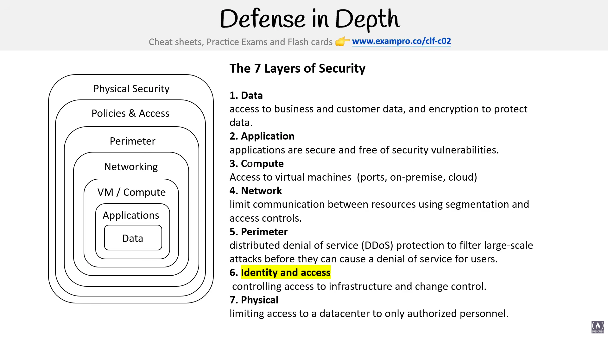

# Security

> **Exam:** AWS Certified Cloud Practitioner (CLF-C02)
> **Topic 23:** **Security** — the domain that carries the most weight on the CLF-C02 exam (Domain 2 "Security and Compliance" is ~30% of the marks). This topic collects the broad security *concepts and principles* AWS expects you to recognise, starting with the mental model that ties everything together: **Defense in Depth.**

Cloud security is never a single wall. A determined attacker who gets past one control should still hit another, and another, before reaching anything valuable. That layered idea — **Defense in Depth** — is the lens AWS wants you to view *every* other security service through (IAM, Security Groups, NACLs, KMS, Shield, WAF, etc. each live on a different layer). This topic builds on the [Topic 04 Shared Responsibility Model](04_Shared_Responsibility_Model.md) (whose layers do *you* secure vs AWS) and the [Topic 10 Identity](10_Identity.md) controls.

---

## 1. Defense in Depth



**Defense in Depth** is a security strategy that applies **multiple, independent layers of security controls** throughout a system, so that **no single point of failure** can compromise it. If one layer is breached, the next layer is still standing to slow or stop the attacker.

> **Mental model:** think of a medieval castle — a moat, then outer walls, then inner walls, then guards at the door, then a locked vault. An attacker has to defeat *every* layer to reach the treasure. Each layer buys time and adds a chance to detect and respond.

The diagram draws it as **nested boxes**: the most valuable thing — **your data** — sits in the centre, and every other layer wraps protectively around it. The outermost box (**Physical**) is the first thing an attacker meets; the innermost box (**Data**) is the last. (The slide labels the outer box "Policies & Access" — that's the **Identity & Access** layer.)

### The 7 Layers of Security

Read them from the **outside in** (first line of defence → last) — but the slide numbers them from the **innermost (Data) outward**. Either direction is fine to memorise; just know what sits at the **core (Data)** and what sits at the **outermost ring (Physical)**.

| # | Layer | What it protects / controls | Typical AWS controls |
|---|---|---|---|
| 1 | **Data** *(innermost core)* | Access to business and customer data, and **encryption** to protect data | KMS, encryption at rest/in transit, S3 bucket policies, [Macie](19_ML_AI_and_Big_Data.md) |
| 2 | **Application** | Applications are **secure and free of security vulnerabilities** | Code review, [WAF](08_Networks.md), Inspector, secrets in Secrets Manager |
| 3 | **Compute** (VM / Compute) | Access to **virtual machines** (ports, on-premise, cloud) | EC2 patching, Systems Manager, hardened AMIs, host firewalls |
| 4 | **Network** | **Limit communication** between resources using **segmentation and access controls** | [Security Groups, NACLs](08_Networks.md), subnets, VPC, PrivateLink |
| 5 | **Perimeter** | **DDoS protection** to filter large-scale attacks before they cause a denial of service for users | [AWS Shield](08_Networks.md), CloudFront, Route 53 |
| 6 | **Identity & Access** | **Controlling access** to infrastructure and **change control** | [IAM](10_Identity.md), IAM Identity Center (SSO), MFA, roles |
| 7 | **Physical** *(outermost ring)* | **Limiting access to a datacenter** to only authorized personnel | **AWS's responsibility** — guards, fences, biometrics |

### The Shared-Responsibility connection (⭐ exam favourite)

The bottom of the stack is **AWS's job**, the top is **yours** — exactly the split from [Topic 04](04_Shared_Responsibility_Model.md):

- **Physical** security (Layer 7) → **AWS** secures the datacenters. You never touch this layer.
- **Data, Application, Compute (OS), Identity, Network** → mostly **the customer's** responsibility *in* the cloud.

> Many "whose responsibility is X?" exam questions are really asking *"which Defense-in-Depth layer is this, and is that layer AWS's or the customer's?"*

---

## 2. Why Defense in Depth matters (the principles behind it)

- **No single point of failure** — one broken control ≠ total breach. Layers are **independent and redundant**.
- **Slows the attacker** — each layer adds time, friction, and another chance to **detect & respond**.
- **Assume breach** — design as if an outer layer *will* fail (this is also a **[Zero Trust](10_Identity.md)** principle).
- **Least privilege everywhere** — the Identity layer should grant only what's needed, so a compromised credential reaches little.
- It is a **strategy / pattern, NOT a single AWS product** — you implement it by *combining* services across the layers.

---

## 3. The CIA Triad — Confidentiality, Integrity, Availability

Where **Defense in Depth** answers *"how do we protect things?"* (many layers), the **CIA Triad** answers *"what are we actually trying to protect?"*. It's the **foundational model of information security** — the three goals **every** security control ultimately serves. If you can name which letter a control supports, you understand *why* it exists.

> **Mental model:** CIA is the **scorecard** for security. Any control — encryption, IAM, backups, checksums — is just a way of raising the **C**, **I**, or **A** score for your data and systems.

| Letter | Goal | Plain English | Broken when… |
|---|---|---|---|
| **C — Confidentiality** | Keep data **secret** | Only **authorized** people/systems can see the data | A leak / unauthorized disclosure (e.g. a public S3 bucket exposing customer data) |
| **I — Integrity** | Keep data **accurate & trustworthy** | Data is **not tampered with** or altered by unauthorized parties; you can detect if it was | Data is modified/corrupted without detection (e.g. an attacker silently edits a record) |
| **A — Availability** | Keep data & systems **reachable** | Authorized users can **access** the resource **when they need it** | Downtime / DoS (e.g. a DDoS attack takes the site offline) |

### How AWS services map to each goal (⭐ the exam angle)

| | **AWS controls that support it** |
|---|---|
| **Confidentiality** | **Encryption** (KMS, S3 SSE, encryption in transit/TLS), **IAM** least-privilege, [Security Groups/NACLs](08_Networks.md), S3 Block Public Access, **Secrets Manager** |
| **Integrity** | **Hashing/checksums**, S3 **versioning** & Object Lock, **digital signatures**, [CloudTrail](18_Logging.md) (tamper-evident audit trail), [AWS Config](13_Governance.md) (detect config drift), [QLDB](07_Databases.md) immutable ledger |
| **Availability** | **Multi-AZ** & multi-Region, **Auto Scaling & ELB** ([Topic 09](09_EC2.md)), **backups & snapshots**, **[AWS Shield](08_Networks.md)** (DDoS), Route 53 health checks, **[High Availability / fault tolerance](02_Cloud_Architecture.md)** design |

### CIA ↔ Defense in Depth

The two models work together: **Defense in Depth** is *how* (layered controls); **CIA** is *what for* (the three goals). Each of the 7 layers in §1 is ultimately raising one or more of the C-I-A scores.

> ⭐ **Exam tip:** when a scenario describes a *problem*, map it to the **missing letter** — "data was exposed" = **Confidentiality**, "data was altered / can't trust it" = **Integrity**, "site went down / users locked out" = **Availability**. Then pick the AWS service that restores that letter.

---

## 4. Encryption

**Encryption** is the process of scrambling readable data (**plaintext**) into an unreadable form (**ciphertext**) using an algorithm and a secret **key**. Without the correct key, the ciphertext is meaningless — so even if an attacker steals it, they get nothing useful. Encryption is the #1 tool for **Confidentiality** (the "C" in §3).

> **Mental model:** encryption is a **lock**, the **key** is what opens it, and the **algorithm** is the type of lock. Scrambling = locking; the data is safe as long as the key is.

### Two states where you encrypt data (⭐ exam classic)

| State | What it means | AWS examples |
|---|---|---|
| **Encryption at rest** | Protecting **stored** data on disk | S3 SSE, EBS volume encryption, RDS encryption — all backed by **KMS** |
| **Encryption in transit** | Protecting data **moving over a network** | **TLS/SSL** (HTTPS), VPN tunnels, TLS to RDS/load balancers |

### Two types of encryption (the key relationship)

| Type | Keys used | Speed / use | AWS service |
|---|---|---|---|
| **Symmetric** | **One shared secret key** encrypts *and* decrypts | **Fast** — bulk data, data at rest | **AWS KMS** (AES-256) |
| **Asymmetric** | A **key pair**: **public key** + **private key** (what one locks, only the other unlocks) | **Slower** — key exchange, signing | **KMS** asymmetric keys, **CloudHSM**, SSH/TLS handshakes |

- **Symmetric:** same key on both ends. Fast, but you must share the key *securely* — the hard part.
- **Asymmetric:** anyone can encrypt with your **public** key, but only **you** (with the **private** key) can decrypt. Solves the key-sharing problem and underpins **TLS** and **digital signatures** (§6).

### AWS encryption services

| Service | Role |
|---|---|
| **AWS KMS (Key Management Service)** | Create, store, rotate & control access to **encryption keys** (CMKs/KMS keys); the default key manager behind S3/EBS/RDS encryption; integrates with IAM & CloudTrail |
| **AWS CloudHSM** | Dedicated, single-tenant **hardware security module** — you fully control the keys; for strict compliance (FIPS 140-2 Level 3) |
| **Secrets Manager / SSM Parameter Store** | Store & rotate secrets (DB passwords, API keys), encrypted with KMS |

### At rest vs In transit — side by side (⭐ + the algorithms)

These two are the most-tested encryption distinction. They protect data in **different places** and lean on **different algorithm families**.

| | **Encryption at REST** | **Encryption in TRANSIT** |
|---|---|---|
| **Protects** | Data **stored** on disk / in a database | Data **moving** across a network |
| **Threat it stops** | Stolen disk, snapshot, or backup | Eavesdropping / man-in-the-middle on the wire |
| **Main algorithm** | **AES-256** (symmetric) | **TLS** protocol = asymmetric handshake **+** AES bulk encryption |
| **AWS examples** | S3 SSE, EBS, RDS, DynamoDB, EFS — keys via **KMS** | **HTTPS/TLS** to S3 & APIs, TLS to RDS, VPN, CloudFront |
| **Who manages keys** | **KMS** (or CloudHSM) | TLS certificate via **ACM**; cipher negotiated per-connection |

### Brief on the algorithms

- **AES (Advanced Encryption Standard)** — the workhorse **symmetric** cipher. AWS uses **AES-256** (256-bit key) for virtually all **at-rest** encryption (S3/EBS/RDS via KMS) and for the bulk-data part of TLS. Fast, hardware-accelerated, considered unbreakable with today's tech. **Symmetric** = same key encrypts and decrypts.
- **RSA** — the classic **asymmetric** algorithm (public/private key pair). Used in TLS handshakes for **key exchange** and in **digital signatures / certificates** (§6). Slow, so it's used only to set up a session or sign — not for bulk data. AWS KMS asymmetric keys and ACM certificates support RSA (e.g. RSA-2048).
- **ECC / ECDSA / ECDHE (Elliptic Curve)** — modern **asymmetric** family. Gives the **same strength as RSA with much smaller keys** (so faster, less overhead). ECDHE powers most modern TLS key exchange; ECDSA is the signature variant. Increasingly the default for TLS.
- **SHA-256 (Secure Hash Algorithm)** — a **hashing** function, **not encryption** (it's one-way and has no key — you can't "un-hash"). Produces a fixed-length **digest** used to verify **integrity** and to build **digital signatures**. Don't confuse hashing with encryption.

> ⭐ **How TLS actually combines them (hybrid encryption):** the **asymmetric** part (RSA or ECDHE) is used **once**, at the start, to securely agree on a shared secret key. Then the rest of the conversation uses **fast symmetric AES** with that key. You get asymmetric's safe key-exchange *and* symmetric's speed. This "asymmetric to exchange, symmetric to transfer" pattern is a common exam concept.

> 📌 **Exam reality check (CLF-C02):** you do **not** need to implement or deeply compare these algorithms. Just recognise: **AES = symmetric / at-rest**, **RSA & ECC = asymmetric / handshake & signatures**, **SHA = hashing / integrity**, and **TLS = the in-transit protocol that blends them**.

---

## 5. Decryption

**Decryption** is simply the **reverse** of encryption: converting **ciphertext back into readable plaintext** using the correct key. It's the same operation run backwards.

- **Symmetric:** decrypt with the **same key** used to encrypt.
- **Asymmetric:** decrypt with the **opposite key** of the pair — if it was encrypted with the **public** key, only the matching **private** key can decrypt it.

> ⭐ **Key takeaway:** encryption and decryption are a **matched pair governed by keys**. Security comes from protecting the **key**, *not* from hiding the algorithm (the algorithms like AES and RSA are public and well-studied). This is why **AWS KMS controls who can use a key** via IAM — losing control of the key = losing the data's confidentiality. In KMS, the **plaintext key never leaves AWS unencrypted**; you send data (or a small data key) to KMS to encrypt/decrypt.

---

## 6. Digital Signatures

A **digital signature** proves **who** created/sent a piece of data and that it **hasn't been altered** — it serves **Integrity** and **authenticity** (not secrecy). It's the electronic equivalent of a tamper-proof wax seal + handwritten signature.

It combines **hashing** with **asymmetric encryption**, used in *reverse* from confidentiality:

1. **Sign (sender):** the sender runs the message through a **hash** function to get a fixed-length **digest**, then encrypts that digest with their **private key** → this is the **signature**, attached to the message.
2. **Verify (receiver):** the receiver decrypts the signature with the sender's **public key** to recover the original digest, independently hashes the received message, and **compares the two digests**. If they **match** → the message is **authentic and unaltered**. If not → it was tampered with or didn't come from that sender.

### What a digital signature guarantees

| Property | Meaning |
|---|---|
| **Integrity** | The data was **not modified** in transit (any change breaks the hash match) |
| **Authentication** | It genuinely came from the holder of the **private key** (the claimed sender) |
| **Non-repudiation** | The sender **cannot later deny** signing it — only their private key could have produced it |

> ⭐ **Confidentiality vs signing — the direction flips:**
> - **Encrypt for secrecy:** lock with the **recipient's *public* key** → only they can unlock (private key). *Hides* the data.
> - **Sign for integrity:** lock the digest with **your own *private* key** → anyone can verify with your *public* key. Does **NOT hide** the data — a signed message is still readable; it just proves origin + integrity.

**On AWS:** KMS and ACM support signing operations; **TLS/HTTPS certificates** (via **AWS Certificate Manager, ACM**) rely on digital signatures to prove a website's identity; code-signing and signed URLs (CloudFront) use the same idea.

---

## 7. Compliance Programs

A **compliance program** is a recognised, third-party-audited **standard or regulation** that proves an organisation meets a defined set of security/privacy controls. On AWS the model is the same Shared-Responsibility split from [Topic 04](04_Shared_Responsibility_Model.md): **AWS gets its *infrastructure* certified** against these programs and hands you the **audit reports** — *you* are still responsible for making **your own workloads** compliant *on top* of that certified infrastructure. AWS calls this **"compliance inheritance."**

> **Mental model:** AWS gives you a **pre-certified building** (wiring, locks, fire exits all inspected). You still have to run *your* shop inside it to code. You inherit the building's certificates; you don't inherit a pass for your own behaviour.

### ⭐ AWS Artifact — the one service to remember

**AWS Artifact** is the **self-service portal** (free, in the console) to **download AWS's compliance reports and audit artifacts** (e.g. SOC reports, PCI DSS attestation, ISO certifications) and to **review & accept AWS agreements** (e.g. the **BAA** for HIPAA, or GDPR-related terms).

> 🎯 **Exam reflex:** *"Where do I get AWS's SOC / PCI / ISO compliance reports?"* → **AWS Artifact**. It is the **answer to almost every "download/obtain a compliance document" question.** (It does **not** make *you* compliant — it just provides AWS's evidence.)

### The programs you should recognise

You **don't** need deep knowledge of each — just **match the keyword to what it covers**:

| Program | Stands for / scope | Keyword trigger on the exam |
|---|---|---|
| **SOC 1 / 2 / 3** | **System & Organization Controls** — independent audit reports. **SOC 1** = controls relevant to **financial reporting**; **SOC 2** = **security, availability, confidentiality** (detailed, **confidential/NDA**); **SOC 3** = same as SOC 2 but a **public, general-use** summary | "audit report," "SOC," "third-party assurance report" |
| **PCI DSS** | **Payment Card Industry Data Security Standard** | "**credit card** / cardholder / payment data" |
| **HIPAA** | US **Health Insurance Portability & Accountability Act** — protects health data (**PHI**) | "**healthcare**," "patient / medical records," "PHI" → also needs a **BAA** (via Artifact) |
| **ISO 27001** | International **information security management system (ISMS)** standard | "ISO," "international security standard," "ISMS" |
| **ISO 27017 / 27018** | ISO **27017** = cloud-specific security; **27018** = **protecting PII / personal data** in the cloud | "cloud security standard" / "personal data in the cloud" |
| **FedRAMP** | **Federal Risk & Authorization Management Program** — standard for **US federal government** cloud use | "**US government / federal** agency" (see also **AWS GovCloud**) |
| **FISMA / DoD SRG / ITAR / CJIS** | Other **US-government** programs (federal info systems / Defense / defense-trade / criminal-justice) | "US **military / defense / federal** workload" → **GovCloud** |
| **GDPR** | EU **General Data Protection Regulation** — privacy law for **EU residents' personal data** | "**EU**," "data privacy," "personal data of EU citizens," "right to be forgotten" |
| **FIPS 140-2** | US standard for **cryptographic modules** | "FIPS 140-2 validated HSM" → **AWS CloudHSM** (and FIPS endpoints) |
| **GxP / FERPA / IRAP / C5 / etc.** | Industry- or country-specific (pharma / US education / Australia / Germany …) | region- or sector-specific name → it's "just another compliance program" |

### How compliance fits the Shared Responsibility Model (⭐)

- **AWS's side:** keeps the **infrastructure** (data centers, hardware, global network) **audited and certified** — and publishes the proof in **AWS Artifact**.
- **Your side:** configure **your** resources to **stay** compliant (encryption, IAM least-privilege, logging, data residency). A certified region does **not** auto-certify a misconfigured S3 bucket.

> Related services that help you *stay* compliant: **AWS Config** (compliance-as-code rules — [Topic 13](13_Governance.md)), **AWS Audit Manager** (continuously collect evidence & map controls to frameworks like PCI/HIPAA), **Security Hub** (aggregated security/compliance posture), **Macie** (find sensitive data, [Topic 19](19_ML_AI_and_Big_Data.md)). For the exam, **Artifact = get AWS's reports**, **Audit Manager = build *your* audit evidence**, **Config = enforce *your* compliance rules**.

---

## 8. Penetration Testing

![Penetration Testing slide — "What is PenTesting? An authorized simulated cyberattack on a computer system to evaluate its security," a highlighted note "Pen Testing IS ALLOWED on AWS," a left column of 8 Permitted Services (EC2, NAT Gateways, Elastic Load Balancers, RDS, CloudFront, Aurora, API Gateways, Lambda & Lambda@Edge, Lightsail, Elastic Beanstalk) and a right column of Prohibited Activities (DNS zone walking via Route 53 Hosted Zones, DoS/DDoS subject to the DDoS Simulation Testing policy, port/protocol/request flooding), with a footer "For Other Simulated Events submit a request to AWS — a reply could take up to 7 days"](AWS_NOtes_Images/AWS_PenTesting.png)

**Penetration testing ("pen testing")** is an **authorized, simulated cyberattack** on a system, performed to **evaluate its security** — you attack your own resources like a hacker would, to find weaknesses *before* a real attacker does.

> ⭐ **The single biggest exam fact: pen testing IS ALLOWED on AWS** — and for the permitted services below you **no longer need AWS's prior approval** (AWS dropped the old "request permission" form in 2019). You're testing *your own* resources, but always within the rules of the **[AWS Customer Support Policy for Penetration Testing](04_Shared_Responsibility_Model.md)**.

### Permitted services (test these without prior approval)

The slide lists **8 permitted services** you can pen test freely:

- **Amazon EC2** instances, **NAT Gateways**, and **Elastic Load Balancers**
- **Amazon RDS**
- **Amazon CloudFront**
- **Amazon Aurora**
- **Amazon API Gateways**
- **AWS Lambda** and **Lambda@Edge** functions
- **Amazon Lightsail** resources
- **Amazon Elastic Beanstalk** environments

> 📌 **Exam-current note:** AWS has since **expanded** this list (e.g. it now also covers some Amazon ECS/Fargate, Elasticsearch/OpenSearch, EFS, Transit Gateway and S3-hosted-app scenarios). For CLF-C02, just recognise these **8 are the canonical "allowed without approval" services** and the *theme*: **you can test your own resources, not AWS's shared infrastructure or other tenants.**

### Prohibited activities (NOT allowed / need special approval)

These are **banned by default** because they harm AWS's shared infrastructure or other customers:

| Prohibited | Why it's off-limits |
|---|---|
| **DNS zone walking** via Amazon **Route 53 Hosted Zones** | Enumerates other people's DNS records — not your resource to probe |
| **DoS / DDoS** attacks — incl. **simulated** DoS/DDoS | Subject to a **separate DDoS Simulation Testing policy**; you can't just launch them |
| **Port flooding** | Overwhelms shared network capacity |
| **Protocol flooding** | Same — abuses the shared network layer |
| **Request flooding** (login-request flooding, API-request flooding) | Looks like a real attack on shared/managed endpoints |

> ⭐ **Flooding & DoS/DDoS are the prohibited theme.** Anything that floods or denies service is **not** ordinary permitted pen testing — DoS/DDoS testing falls under the special **DDoS Simulation Testing policy**.

### Anything else → request approval first

> 🎯 For **"Other Simulated Events"** (anything beyond the permitted list — e.g. DDoS simulations, other security events) you must **submit a request to AWS first**, and a **reply can take up to 7 days**. So: permitted services = no approval needed; everything else = ask AWS and wait.

### Where this sits in the bigger picture

Pen testing is how the **customer** validates the **upper Defense-in-Depth layers** they own (Application, Compute, Network, Identity — §1) and is part of the **customer's side** of the [Shared Responsibility Model](04_Shared_Responsibility_Model.md). AWS itself continuously tests the **infrastructure** it owns. Don't confuse pen testing (active attack simulation) with **[Amazon Inspector](19_ML_AI_and_Big_Data.md)** (automated vulnerability *scanning*) or **GuardDuty** (threat *detection*) — those are services; pen testing is an *activity*.

---

## 9. AWS Artifact

**AWS Artifact** is a **free, self-service portal** in the AWS console that gives you **on-demand access to AWS's security & compliance documentation** — the central place to **download AWS's audit reports** and to **review & accept agreements** with AWS. It was introduced in §7 as the answer to *"where do I get a compliance document?"*; this section is the deeper look.

> **Mental model:** Artifact is AWS's **filing cabinet of compliance paperwork**. When *your* auditor asks "prove the cloud your app runs on is secure," you open Artifact, pull AWS's SOC/PCI/ISO report, and hand it over. You're not generating anything — you're **collecting AWS's evidence**.

### The two halves of Artifact (⭐ know both)

| Component | What it does | Examples |
|---|---|---|
| **AWS Artifact Reports** | **Download** AWS's **third-party audit reports** on-demand (read-only evidence about AWS's infrastructure) | **SOC 1/2/3**, **PCI DSS** attestation, **ISO 27001/27017/27018**, **FedRAMP** ATO letters, certifications |
| **AWS Artifact Agreements** | **Review, accept & manage legal agreements** between you and AWS — for a single account or **org-wide** via [AWS Organizations](13_Governance.md) | **BAA** (HIPAA), **NDA**, GDPR-related terms |

### Key facts for the exam

- **Free** and **self-service** — instant download, no need to email AWS or wait (contrast the **7-day** wait for pen-test approval in §8).
- Reports are **confidential** — many are covered by an **NDA**; you may share them with your **auditors/regulators** under those terms.
- Access is controlled with **IAM** (you decide who in your account can pull reports/accept agreements).
- It surfaces **AWS's** compliance posture — this is **"compliance inheritance"** ([§7](#7-compliance-programs)): you inherit the certified infrastructure, then prove *your own* layer separately.

### ⭐ Artifact vs the "make me compliant" services

Artifact only **hands you AWS's documents**. It does **not** scan, assess, or fix *your* resources:

| Need | Service |
|---|---|
| **Download AWS's** compliance reports / accept agreements | **AWS Artifact** |
| **Produce your own** audit evidence mapped to a framework (PCI/HIPAA/…) | **AWS Audit Manager** |
| **Enforce** compliance rules on your resources (compliance-as-code) | **[AWS Config](13_Governance.md)** |
| **Aggregate** your security/compliance findings & posture | **AWS Security Hub** |

> 🎯 **Exam reflex:** any question about **obtaining, downloading, or accessing AWS's SOC/PCI/ISO reports or accepting a BAA** → **AWS Artifact**. If it's about generating *your* evidence or checking *your* config → it's **Audit Manager / Config**, not Artifact.

---

## 10. Amazon Inspector


**Amazon Inspector** is AWS's **automated vulnerability-management service** — it continuously scans your workloads for **software vulnerabilities (CVEs)** and **unintended network exposure**, then reports prioritized findings to fix. It's the AWS tool for the **Application** and **Compute** layers of Defense-in-Depth (§1).

> **First, the slide's concept — "Hardening":** **hardening** = the act of **eliminating as many security risks as possible**, usually by running a collection of security checks called a **security benchmark** (e.g. the **CIS — Center for Internet Security — benchmark**, the slide's famous "699 checks"). Inspector automates that benchmarking against your resources.

### ⚠️ The slide is the *classic* Inspector — here's today's reality

The slide shows **Inspector v1 (classic)**: you manually **installed an agent**, picked **Network vs Host assessments**, and clicked **"Run weekly / Run once."** AWS **re-launched Amazon Inspector in 2021** ("the new Inspector"), and that older model is mostly gone. What changed:

| | **Classic Inspector (the slide)** | **Amazon Inspector today (v2)** |
|---|---|---|
| **Trigger** | Manual — "Run once / Run weekly" assessments | **Continuous & automatic** — scans on its own, no scheduling |
| **Agent** | Install a dedicated **Inspector agent** | Uses the **AWS Systems Manager (SSM) agent** (already on most EC2); EC2 scanning can be **agentless** |
| **What it scans** | **EC2 only** (Network + Host assessments) | **EC2 instances + Amazon ECR container images + AWS Lambda functions** |
| **Discovery** | You define assessment targets | **Auto-discovers** resources as they launch |
| **Output** | Findings list | **Contextual Inspector risk score** + prioritized findings, pushed to **Security Hub** & **EventBridge** |

> 📌 **For CLF-C02:** the exam tests the *idea* — **Inspector = automated vulnerability scanning of your resources**. Just know the modern facts: **continuous**, **agent-light (uses SSM)**, and it covers **EC2, container images (ECR), and Lambda** — not only EC2. The "install an agent / run weekly / Network vs Host" wording is legacy.

### How you use it (3 steps)

1. **Enable Inspector** (it auto-discovers and starts scanning EC2 / ECR / Lambda).
2. Inspector **continuously assesses** for CVEs and network reachability.
3. **Review prioritized findings and remediate** the security issues (patch software, close exposed ports).

### ⭐ Inspector vs the other security-finding services (the #1 trap)

These four get mixed up constantly — separate them by **what they look at**:

| Service | Looks at… | One-liner |
|---|---|---|
| **Amazon Inspector** | **Your resources' vulnerabilities** | Scans **EC2 / ECR / Lambda** for **CVEs & network exposure** |
| **Amazon GuardDuty** | **Logs & traffic for threats** | **Threat detection** from CloudTrail/VPC/DNS logs (malicious activity) |
| **Amazon Macie** | **Data in S3** | Finds & classifies **sensitive data / PII** in S3 ([Topic 19](19_ML_AI_and_Big_Data.md)) |
| **AWS Config** | **Resource configuration** | Tracks config + **compliance rules** ([Topic 13](13_Governance.md)) |

> 🎯 **Reflex:** "scan my **EC2 / containers / Lambda** for **known vulnerabilities (CVEs)**" → **Inspector**. "detect **malicious / suspicious activity**" → **GuardDuty**. "find **sensitive data in S3**" → **Macie**. "is my **config** compliant?" → **Config**.

---

## 11. DDoS & AWS Shield


### First — what is a DDoS attack?

A **DoS (Denial of Service)** attack floods a target with so much traffic or so many bogus requests that it **runs out of resources** and can no longer serve legitimate users — the site goes down. A **DDoS (Distributed Denial of Service)** does the same thing but from **many machines at once** (a **botnet** of thousands of hijacked devices), so you can't just block one IP.

> ⭐ **DDoS is an attack on Availability** — the **"A"** in the [CIA Triad](#3-the-cia-triad--confidentiality-integrity-availability) (§3). It doesn't steal or alter data; it makes the system **unreachable**. That's why DDoS protection lives on the **Perimeter** layer of Defense-in-Depth (§1).

DDoS attacks hit different **network layers** (the slide's "Layer 3, 4, 7"):

| Layer | Name | Example attack |
|---|---|---|
| **Layer 3** | **Network** | UDP/ICMP floods, reflection/amplification |
| **Layer 4** | **Transport** | **SYN floods** (exhaust connection tables) |
| **Layer 7** | **Application** | **HTTP floods** — masses of real-looking requests to your app |

### AWS Shield — managed DDoS protection

**AWS Shield** is a **managed DDoS protection service** that safeguards applications running on AWS. It automatically detects and mitigates attacks so your application stays **available** under attack. It comes in **two tiers**:

| | **Shield Standard** | **Shield Advanced** |
|---|---|---|
| **Cost** | **Free** — automatically on for **every** AWS customer | **Paid** — **$3,000/month** per organization (1-year commitment) + data fees |
| **Protects against** | Most common **Layer 3 / 4** (network & transport) attacks | Larger, more sophisticated attacks **including Layer 7**, with finer mitigation |
| **Where it applies** | Automatic when you use **Route 53, CloudFront, Global Accelerator, ELB** | **EC2, ELB, CloudFront, Global Accelerator, Route 53** |
| **Extras** | None — it's just on | **24/7 DDoS Response Team (DRT/SRT)**, **DDoS cost protection** (refunds scaling charges caused by an attack), real-time metrics/reports, **[AWS WAF](08_Networks.md) included** |

> 🎯 **The #1 Shield exam fact:** **Shield Standard is free and automatic** — *"when you route traffic through **Route 53** or **CloudFront**, you're already using Shield Standard."* You don't enable or pay for it. **Shield Advanced** is the **paid upgrade** ($3,000/mo) you pick when the scenario mentions **24/7 expert support, cost protection against attack-driven scaling, or protection for larger/L7 attacks**.

### How Shield fits with WAF & friends (⭐ don't mix them up)

DDoS defence is layered — Shield is one piece of the **Perimeter**:

| Service | Role | Layer |
|---|---|---|
| **AWS Shield** | **DDoS** protection (volume/flood attacks) | L3 / L4 (Standard) + L7 (Advanced) |
| **[AWS WAF](08_Networks.md)** | **Web Application Firewall** — filters malicious **HTTP(S)** requests by rules (SQL injection, XSS, bad IPs, rate-limiting) | **L7** only |
| **CloudFront / Route 53 / Global Accelerator** | **Absorb & distribute** traffic at AWS's edge — where Shield Standard auto-applies | Edge |

> **Shield vs WAF:** **Shield = DDoS** (stop the *flood* that takes you offline → **Availability**). **WAF = application-layer filtering** of *malicious requests* (block exploits like SQL injection → **Confidentiality/Integrity**). They're complementary; Shield Advanced even includes WAF.

---

## 12. Amazon GuardDuty

![Amazon GuardDuty slide — "What is IDS/IPS? Intrusion Detection System and Intrusion Protection System: a device or software application that monitors a network or systems for malicious activity or policy violations." GuardDuty is a threat detection service that continuously monitors for malicious, suspicious activity and unauthorized behavior, using Machine Learning to analyze CloudTrail Logs, VPC Flow Logs and DNS logs. A sample Finding "IAMUser/RootCredentialUsage" (severity LOW, region us-east-1) with an "Investigate with Detective" link. It alerts you of Findings which you can automate an incident response via CloudWatch Events or 3rd-party services](AWS_NOtes_Images/AWS_Guard_Duty.png)

### First — what is IDS / IPS?

- **IDS (Intrusion Detection System)** — software/device that **monitors** a network or system for **malicious activity or policy violations** and **alerts** you. It *watches and warns.*
- **IPS (Intrusion Prevention System)** — does the same **but also acts** to **block/stop** the threat automatically. It *watches and blocks.*

> GuardDuty is essentially a **cloud-native, managed IDS** for your AWS account — it detects and alerts; you (or automation) decide the response.

### Amazon GuardDuty — managed threat detection

**Amazon GuardDuty** is a **threat-detection service** that **continuously monitors** your AWS account for **malicious, suspicious activity and unauthorized behavior**. It uses **Machine Learning** (and threat-intelligence feeds of known-bad IPs/domains) to analyze AWS **logs** — there is **nothing to install** (it reads the logs directly, so it's **agentless**).

**Log sources it analyzes** (the slide's three core ones):

- **CloudTrail logs** — *who made which API calls* (e.g. root credentials used from an odd IP)
- **VPC Flow Logs** — network traffic in/out of your VPC
- **DNS logs** — domain lookups (e.g. traffic to a known malware domain)

> 📌 **Exam-current note:** GuardDuty has since **expanded** beyond these three — it can also analyze **S3 data-events, EKS audit logs, RDS login activity, Lambda network activity**, and includes **Malware Protection** (scans EBS volumes). For CLF-C02 the canonical three (**CloudTrail / VPC Flow / DNS**) are enough; just know the *theme*: **GuardDuty reads logs to spot threats.**

### Findings → automated response

When GuardDuty spots something, it produces a **Finding** (with a **severity**, the affected resource, region, etc. — like the slide's *`IAMUser/RootCredentialUsage`* alert). You can then:

- **Automate an incident response** by sending the Finding to **Amazon EventBridge** (the slide's "**CloudWatch Events**" — now EventBridge) → trigger a **Lambda**, notify via **SNS**, or hand off to a **3rd-party** tool.
- **Investigate with [Amazon Detective](18_Logging.md)** — a separate service for deep root-cause analysis (the "Investigate with Detective" link on the slide).

### ⭐ Where GuardDuty sits vs the look-alikes

This is the **most-tested security-service distinction** — separate them by **input** (what each reads) and **job**:

| Service | Reads / looks at | Job |
|---|---|---|
| **Amazon GuardDuty** | **Logs** (CloudTrail, VPC Flow, DNS…) | **Detect threats** — malicious/suspicious *activity* (an IDS) |
| **Amazon Inspector** (§10) | **Your resources** (EC2/ECR/Lambda) | Find **vulnerabilities (CVEs)** & network exposure |
| **Amazon Macie** | **Data in S3** | Find & classify **sensitive data / PII** |
| **Amazon Detective** | GuardDuty findings + logs | **Investigate** the root cause *after* detection |

> 🎯 **Reflex:** "continuously monitor **logs** for **malicious / suspicious / unauthorized activity** using **ML**" → **GuardDuty**. If the question is about *scanning resources for vulnerabilities* → **Inspector**; *finding sensitive data in S3* → **Macie**; *digging into the root cause of a finding* → **Detective**.

---

## 13. AWS VPN (and how it differs from Direct Connect)

![AWS Virtual Private Network (VPN) slide — "AWS VPN lets you establish a secure and private tunnel from your network or device to the AWS global network." Two types side by side: AWS Site-to-Site VPN (securely connect on-premises network or branch office site to a VPC) and AWS Client VPN (securely connect users to AWS or on-premises networks). "What is IPSec? Internet Protocol Security (IPsec) is a secure network protocol suite that authenticates and encrypts the packets of data to provide secure encrypted communication between two computers over an IP network — used in VPNs."](AWS_NOtes_Images/AWS_VPN.png)

**AWS VPN (Virtual Private Network)** lets you establish a **secure, encrypted tunnel** from **your network or device** to the **AWS global network**, *over the public internet*. The internet is untrusted, so the VPN wraps your traffic in encryption — this is **encryption in transit** (§4) applied to hybrid connectivity, sitting on the **Network** layer of Defense-in-Depth (§1).

### The two types of AWS VPN

| Type | Connects… | Use case |
|---|---|---|
| **AWS Site-to-Site VPN** | a whole **network** — your **on-premises / branch office** ↔ a **VPC** | Permanent link between your data center and AWS (uses a **Virtual Private Gateway** on the AWS side + a **Customer Gateway** on yours) |
| **AWS Client VPN** | individual **users / devices** ↔ AWS or on-premises | Remote workers / laptops securely reaching private resources |

> **Site-to-Site = network-to-network** (offices); **Client = a person's device** to the network (remote employee). That's the whole distinction.

### What is IPsec?

**IPsec (Internet Protocol Security)** is the **secure protocol suite** that **authenticates and encrypts** each packet of data, giving secure encrypted communication between two endpoints over an IP network. **Site-to-Site VPN tunnels are built on IPsec** — it's *what makes the tunnel "secure and private."*

### ⭐ VPN vs Direct Connect (the comparison you need)

Both connect **on-premises → AWS**, but they're fundamentally different. This is a **very common exam question**:

| | **AWS VPN (Site-to-Site)** | **AWS Direct Connect (DX)** |
|---|---|---|
| **What it is** | Encrypted tunnel **over the public internet** | A **dedicated private physical line** from your data center to AWS (**not** over the internet) |
| **Encryption** | **Yes** — IPsec, encrypted by default | **No** by default (it's private, but *not encrypted* — you can layer a **VPN over DX** to add encryption) |
| **Speed / consistency** | Variable — depends on the internet | **Consistent, high bandwidth, low latency** |
| **Setup time / cost** | **Minutes**, low cost | **Weeks** to provision, **higher cost** |
| **Best for** | Quick, cheap, or **backup** connectivity; encryption is the priority | **Steady high-throughput**, large/continuous data transfer, latency-sensitive workloads |

> 🎯 **Exam reflex:**
> - "**encrypted** tunnel **over the internet**, quick/cheap, or a **backup** link" → **VPN**
> - "**dedicated/private line**, **consistent** performance, **high bandwidth**, not over the internet" → **Direct Connect**
> - "private line that's **also encrypted**" → **VPN over Direct Connect** (combine both)

### ⚠️ "AWS Connect" vs Direct Connect — name trap

Don't confuse these similar-sounding names:

- **AWS Direct Connect** = the **networking** service above (dedicated private line to AWS).
- **Amazon Connect** = a completely unrelated service — a **cloud contact-center / virtual call-center** ([Topic 14](14_Business_Centric_Services.md)). It has **nothing to do with networking**. If a question mentions *call center / customer support / phone*, that's **Amazon Connect**, not Direct Connect.

> 🔗 VPN and Direct Connect also appear in [Topic 08 Networks](08_Networks.md) under enterprise/hybrid connectivity — here the angle is **secure** connectivity.

---

## 14. AWS WAF (Web Application Firewall)

![AWS WAF slide — "AWS Web Application Firewall (WAF) protects your web applications from common web exploits." Write your own rules to ALLOW or DENY traffic based on the contents of an HTTP request; use a ruleset from a trusted AWS Security Partner in the AWS WAF Rules Marketplace; WAF can be attached to either CloudFront or an Application Load Balancer. It protects against the OWASP Top 10 most dangerous attacks (Injection, Broken Authentication, Sensitive data exposure, XXE, Broken Access control, Security misconfigurations, XSS, Insecure Deserialization, Using components with known vulnerabilities). A diagram shows traffic flowing through an ALB+WAF to EC2 instances and through CloudFront+WAF to S3 static website hosting](AWS_NOtes_Images/AWS_WAF.png)

**AWS WAF (Web Application Firewall)** protects your **web applications** from **common web exploits** by filtering **HTTP/HTTPS requests** at **Layer 7** (the Application layer). It's the **Application/Perimeter** control in Defense-in-Depth (§1) — it inspects the *content* of each web request and decides whether to let it through.

> **Mental model:** a normal firewall ([Security Groups / NACLs](08_Networks.md)) checks *where* traffic comes from (IP/port). **WAF reads the actual request** — the URL, headers, and body — and blocks the *malicious-looking* ones (e.g. a request carrying a SQL-injection payload).

### What WAF does

- **Write your own rules** to **ALLOW or DENY** traffic based on the **contents of an HTTP request** — by IP address, country, headers, URI, request body, or **rate** (rate-based rules stop a flood of requests from one source). Rules are bundled into a **Web ACL** (Access Control List).
- **Use managed rulesets** instead of writing everything yourself — **AWS Managed Rules** or a **ruleset from a trusted AWS Security Partner** (via the **AWS Marketplace**). Quick way to get strong coverage.
- **Protects against the OWASP Top 10** — the most dangerous web-app attacks: **Injection (SQLi), Broken Authentication, Sensitive Data Exposure, XML External Entities (XXE), Broken Access Control, Security Misconfigurations, Cross-Site Scripting (XSS), Insecure Deserialization, Using Components with Known Vulnerabilities**, and insufficient logging/monitoring.

> 💡 **OWASP** = *Open Web Application Security Project*, a nonprofit; its **Top 10** is the industry-standard list of the most critical web-app risks. WAF's managed rules map directly onto it.

### Where you attach WAF

WAF isn't standalone — you **attach it in front of** a web-facing resource. The slide shows the two classic targets:

- **Amazon CloudFront** (the CDN edge)
- **Application Load Balancer (ALB)** ([Topic 09](09_EC2.md))

> 📌 **Exam-current note:** WAF has since **expanded** — it can also attach to **Amazon API Gateway**, **AWS AppSync (GraphQL)**, **Amazon Cognito** user pools, and **App Runner**. For CLF-C02, **CloudFront and ALB are the two canonical answers**; just know WAF guards web-facing entry points.

### ⭐ WAF vs Shield vs Security Groups/NACLs (don't mix the firewalls)

| Control | Layer | Decides based on… | Stops |
|---|---|---|---|
| **AWS WAF** | **L7** (application) | **Contents** of the HTTP request (URL/headers/body, rate) | **Web exploits** — SQLi, XSS, bad bots (OWASP Top 10) |
| **[AWS Shield](#11-ddos--aws-shield)** | L3/L4 (+L7 Advanced) | Traffic **volume / patterns** | **DDoS** floods (Availability) |
| **[Security Groups / NACLs](08_Networks.md)** | L3/L4 (network) | **IP address & port** | Unwanted *network* connections |

> 🎯 **Reflex:** "block **malicious HTTP requests** / **SQL injection / XSS** / filter by **request content** / **OWASP**" → **AWS WAF**. "stop a **DDoS flood**" → **Shield**. "allow/deny by **IP & port**" → **Security Groups / NACLs**. WAF and Shield work **together** at the edge (Shield Advanced even *includes* WAF — see §11).

---

## 15. Hardware Security Module (HSM) — KMS vs CloudHSM

![Hardware Security Module slide — "A Hardware Security Module (HSM) is a piece of hardware designed to store encryption keys. HSMs hold keys in memory and never write them to disk." FIPS = Federal Information Processing Standard, a US and Canadian government standard specifying security requirements for cryptographic modules that protect sensitive information. Multi-tenant HSMs (multiple customers virtually isolated on an HSM) are FIPS 140-2 Level 2 Compliant, e.g. AWS KMS. Single-tenant HSMs (single customer on a dedicated HSM) are FIPS 140-2 Level 3 Compliant, e.g. AWS CloudHSM. A photo of a physical Gemalto HSM appliance](AWS_NOtes_Images/AWS_HMS.png)

A **Hardware Security Module (HSM)** is a **dedicated piece of hardware designed to store and manage encryption keys**. Its defining trait: it **holds keys in memory and never writes them to disk**, and it's **tamper-resistant** — so the secret key material is extremely well protected. This is the physical foundation underneath the key services from §4 (**KMS** and **CloudHSM**).

> **Mental model:** an HSM is a **hardened safe purpose-built for cryptographic keys**. The keys live inside and do their encrypt/decrypt work *in* the safe — they never come out in plaintext.

### What is FIPS 140-2?

**FIPS (Federal Information Processing Standard) 140-2** is a **US & Canadian government standard** that specifies the **security requirements for cryptographic modules** that protect sensitive information. It has **levels** — the higher the level, the stronger the physical isolation and tamper protection:

| Tenancy | FIPS level | Meaning | AWS example |
|---|---|---|---|
| **Multi-tenant** | **FIPS 140-2 Level 2** | Multiple customers **virtually isolated** on a shared HSM | **AWS KMS** |
| **Single-tenant** | **FIPS 140-2 Level 3** | **One** customer on a **dedicated** HSM | **AWS CloudHSM** |

> ⭐ **The exam mapping:** **multi-tenant → Level 2 → KMS**; **single-tenant / dedicated → Level 3 → CloudHSM**. If a scenario demands **FIPS 140-2 Level 3** or a **dedicated, single-tenant HSM you fully control**, the answer is **CloudHSM**.

### ⭐ AWS KMS vs AWS CloudHSM (the key distinction)

Both manage encryption keys backed by HSMs — the difference is **who shares the hardware and who controls the keys**:

| | **AWS KMS** | **AWS CloudHSM** |
|---|---|---|
| **Tenancy** | **Multi-tenant** (shared, virtually isolated) | **Single-tenant** — your **dedicated** HSM |
| **FIPS 140-2** | **Level 2** | **Level 3** |
| **Who controls keys** | **AWS-managed** service; you control *access* via IAM | **You fully control** the keys; AWS can't access them |
| **Ease vs control** | **Easiest** — default, deeply integrated with S3/EBS/RDS/etc. | **More control & compliance**, more management effort |
| **Pick when…** | Default key management for almost everything | Strict compliance needs **dedicated hardware / Level 3 / full key control** |

> 🎯 **Reflex:** "manage keys, easy, integrated with AWS services" → **KMS**. "**dedicated / single-tenant HSM**, **FIPS 140-2 Level 3**, I must **fully control** the keys" → **CloudHSM**. (Both first appeared in §4 Encryption; this section adds *why* — the HSM tenancy & FIPS level.)

---

## 16. AWS KMS (Key Management Service) & Envelope Encryption

![AWS Key Management Service slide — "AWS KMS is a managed service that makes it easy for you to create and control the encryption keys used to encrypt your data." Bullets: KMS is a multi-tenant HSM; many AWS services are integrated to use KMS to encrypt your data with a simple checkbox; KMS uses Envelope Encryption. A console screenshot shows an "Enable Encryption" checkbox with a Master key dropdown (default aws/rds). An Envelope Encryption diagram shows the KMS Master Key encrypting a Data Key, which in turn encrypts the Data](AWS_NOtes_Images/AWS_KMS.png)

**AWS KMS (Key Management Service)** is a **managed service that makes it easy to create and control the encryption keys** used to encrypt your data. It's the **default key manager** behind almost all AWS encryption (S3, EBS, RDS, DynamoDB…) and was introduced in §4 — this section goes deeper on **how it works**.

- **KMS is a multi-tenant HSM** (FIPS 140-2 **Level 2** — see §15). AWS manages the hardware; you control **who can use each key** via [IAM](10_Identity.md), and every key use is logged in **[CloudTrail](18_Logging.md)**.
- **Deeply integrated** — most AWS services let you turn on encryption with a **simple checkbox** and pick a KMS key (e.g. the slide's *"Enable Encryption → Master key: (default) aws/rds"*).
- The key material **never leaves KMS unencrypted** — you send data (or a small data key) *to* KMS, not the master key *out*.

### KMS key types (good to recognise)

| Key type | Who creates/manages it |
|---|---|
| **AWS managed keys** | Created & managed **by AWS** for a service (e.g. `aws/s3`, `aws/rds`) |
| **Customer managed keys** | **You** create & control them (rotation, policies, deletion) — more control |
| **AWS owned keys** | Owned/managed entirely by AWS, **not visible** in your account |

> The master key (the **KMS key**, formerly called a **CMK / Customer Master Key**) **stays inside KMS** and is used to protect smaller **data keys**, as below.

### ⭐ Envelope Encryption (the key exam concept)

The problem: when you encrypt data, the data is protected — **but now you have to protect the encryption key too.** **Envelope Encryption** solves this by **encrypting the key with another key**:

1. **KMS Master Key encrypts → a Data Key** (an additional layer of security).
2. **The Data Key encrypts → your actual Data.**

So the data is "sealed in an envelope," and the *key* to that envelope is itself locked by the master key. You store the **encrypted data key right next to the encrypted data**; to read the data, KMS uses the master key to decrypt the data key, which then decrypts the data.

```
KMS Master Key ──encrypts──▶ Data Key ──encrypts──▶ Data
   (never leaves KMS)        (stored encrypted        (your file/
                              beside the data)         volume/object)
```

> ⭐ **Why it matters:** the **master key never leaves KMS**, only the small **data key** travels (and it's stored *encrypted*). This is faster (bulk data is encrypted locally by the data key, not round-tripped to KMS) and safer (compromising the stored data key is useless without the master key). *"Encrypt the data key with a master key as an additional layer of security."*

> 🎯 **Exam reflex:** "create & **control encryption keys**, integrated with AWS services, checkbox encryption" → **KMS**. "**encrypt the data key with a master key** / a key that protects another key" → **Envelope Encryption**. For a **dedicated single-tenant HSM / FIPS 140-2 Level 3 / full key control** → **CloudHSM** instead (§15).

---

## 17. AWS CloudHSM

![AWS CloudHSM slide — "CloudHSM is a single-tenant HSM as a service that automates hardware provisioning, software patching, high availability and backups." AWS CloudHSM enables you to generate and use your encryption keys on FIPS 140-2 Level 3 validated hardware. Built on open HSM industry standards to integrate with PKCS#11, Java Cryptography Extensions (JCE), and Microsoft CryptoNG (CNG) libraries. You can transfer your keys to other commercial HSM solutions to migrate keys on or off AWS. You can configure AWS KMS to use an AWS CloudHSM cluster as a custom key store rather than the default KMS key store. A diagram shows AWS CloudHSM inside a VPC, connected over SSL to a VPC instance running an Application/HSM Client, with users connecting](AWS_NOtes_Images/AWS_CloudHSM.png)

**AWS CloudHSM** is a **single-tenant HSM as a service** — a **dedicated** hardware security module (§15) that's yours alone, but where **AWS automates the heavy lifting**: **hardware provisioning, software patching, high availability, and backups**. You get full control of the keys *without* racking and managing physical appliances yourself.

- It lets you **generate and use your encryption keys on FIPS 140-2 Level 3 validated hardware** (the stronger, single-tenant tier from §15).
- It runs **inside your VPC**, and **only you** can access the keys — **AWS cannot** (unlike KMS, where it's AWS-managed).

> **CloudHSM = "your own dedicated HSM, but managed for you."** Compare KMS (multi-tenant, AWS controls the keys) — CloudHSM is the **single-tenant, you-control-everything** option.

### Built on open standards (vendor-neutral)

CloudHSM uses **open HSM industry standards**, so your applications integrate with it through standard crypto libraries:

- **PKCS#11**
- **Java Cryptography Extensions (JCE)**
- **Microsoft CryptoNG (CNG)** libraries

> Because it's standards-based, you can **transfer your keys to other commercial HSM solutions** — making it easy to **migrate keys on or off AWS** (no lock-in). This **key portability** is a CloudHSM selling point you won't get with KMS.

### ⭐ Custom Key Store — KMS + CloudHSM together

You can **configure AWS KMS to use a CloudHSM cluster as a "custom key store"** instead of the **default KMS key store**. This gives you the **best of both**:

- the **convenience & integration of KMS** (checkbox encryption for S3/EBS/RDS, §16) …
- … while the keys actually live in **your dedicated, single-tenant, FIPS 140-2 Level 3 CloudHSM** hardware.

> 🎯 **Pick CloudHSM when** the scenario demands a **dedicated/single-tenant HSM**, **FIPS 140-2 Level 3**, **full/sole control of keys** (AWS can't touch them), **key portability/migration**, or you need it accessed via **PKCS#11 / JCE / CNG**. Otherwise **KMS** is the simpler default (§16). For the **what-is-an-HSM** and the **KMS-vs-CloudHSM** comparison, see §15.

---

## 18. AWS Security Hub & AWS Audit Manager

These two get confused constantly because both deal with "security & compliance posture" across your account. But they answer **two different questions** — nail that and they separate cleanly:

- **Security Hub → *"Am I secure right now?"*** (operational security posture)
- **Audit Manager → *"Can I prove compliance to an auditor?"*** (audit evidence)

### AWS Security Hub — single pane of glass for security

**AWS Security Hub** is a service that gives you a **central dashboard** of your **security posture** across your AWS accounts. It does two things:

1. **Aggregates & prioritizes findings** from other security services into **one place** — **[GuardDuty](#12-amazon-guardduty)** (threats), **[Inspector](#10-amazon-inspector)** (vulnerabilities), **[Macie](19_ML_AI_and_Big_Data.md)** (sensitive data), IAM Access Analyzer, Firewall Manager, and partner tools. No more checking each console separately.
2. **Runs automated best-practice security checks** against standards like **AWS Foundational Security Best Practices**, **CIS AWS Foundations Benchmark**, **PCI DSS**, and **NIST** — and flags what's failing.

> **Mental model:** Security Hub is the **mission-control screen** for security — it pulls every alarm into one prioritized view so your security team sees the whole picture and acts. It's **continuous and operational**.

### AWS Audit Manager — automate audit evidence

**AWS Audit Manager** **continuously collects evidence** about your AWS usage and **maps it to the controls of a compliance framework** (e.g. **PCI DSS, HIPAA, GDPR, SOC 2, ISO 27001**), so you can **prepare for an audit** and hand auditors **audit-ready reports** instead of gathering screenshots by hand.

> **Mental model:** Audit Manager is the **automated paperwork assistant** for audits — it keeps a running file of "here's the evidence that we meet control X," organized by framework, ready to give a **regulator/auditor**. It's about **proving** compliance, not detecting threats.

### ⭐ The thin line — Security Hub vs Audit Manager (side by side)

| | **AWS Security Hub** | **AWS Audit Manager** |
|---|---|---|
| **Question it answers** | *"Am I **secure** right now?"* | *"Can I **prove** we're compliant?"* |
| **Primary job** | **Aggregate security findings** + run best-practice checks | **Collect evidence** & map it to a **compliance framework** |
| **Output** | A prioritized **security dashboard** / alerts | **Audit-ready evidence reports** for a framework |
| **Audience** | **Security / ops team** (act on threats) | **Auditors / compliance (GRC) team** (prove controls) |
| **Time orientation** | **Real-time, continuous** monitoring | **Evidence over time**, for a point-in-time **audit** |
| **Framing** | "What's **wrong / risky** and needs fixing?" | "**Document** that we meet the rules." |

> 🎯 **One-line split:** **Security Hub = SEE & FIX your security** (operational alerts). **Audit Manager = PROVE compliance** (evidence for auditors). If the question is about *threats/alerts/dashboard* → **Security Hub**; about *audit/evidence/framework report* → **Audit Manager**.

### How they fit with the other compliance tools (don't mix these four)

This is the cluster from §7/§9 — separate by **role**:

| Service | Role |
|---|---|
| **[AWS Artifact](#9-aws-artifact)** | **Download AWS's** own compliance reports (SOC/PCI/ISO) & accept agreements |
| **AWS Audit Manager** | Collect **your own** evidence, mapped to a framework, for **your** audit |
| **AWS Security Hub** | Aggregate **security findings** + best-practice checks (posture dashboard) |
| **[AWS Config](13_Governance.md)** | Track resource **configuration** + enforce **compliance-as-code rules** |

> ⭐ **The classic confusions:**
> - **Artifact vs Audit Manager** — Artifact = *get AWS's* certifications (you consume); Audit Manager = *build your own* audit evidence (you produce).
> - **Security Hub vs Config** — Config tracks *configuration/rules* on resources; Security Hub *aggregates security findings* (and uses Config rules among its checks). Config = "is this resource configured correctly?"; Security Hub = "what are all my security problems, ranked?"

---

## 19. AWS Firewall Manager

![AWS Firewall Manager slide — "AWS Firewall Manager allows you to centrally configure and manage firewall rules across accounts and applications." AWS services that can be managed: AWS WAF, AWS WAF Classic, AWS Shield Advanced, Security Groups, Network Access Controls (NACLs), AWS Network Firewall, Amazon Route 53 Resolver DNS Firewall, Third-Party Firewall Services. Prerequisites: your account must be a member of AWS Organizations; your account must be the Firewall Manager administrator; you must have AWS Config enabled for your accounts and Regions; you need Resource Access Manager (RAM) enabled for specific services (e.g. AWS Network Firewall or Route 53 Resolver DNS Firewall). A "Policy rules" panel shows options to identify/report non-compliant security groups, disassociate other security groups, and distribute tags/references](AWS_NOtes_Images/AWS_Firewall_Manager.png)

**AWS Firewall Manager** lets you **centrally configure and manage firewall rules across *many accounts and applications*** at once. Instead of setting up WAF/Shield/Security Group rules account-by-account, you define a **policy once** and Firewall Manager **enforces it org-wide** — and automatically applies it to **new resources and accounts** as they're created.

> **Mental model:** Firewall Manager is the **central control tower for your firewalls**. It doesn't *do* the filtering itself — it **pushes and polices the rules** of the firewall services that do (WAF, Shield, SGs, Network Firewall), across your whole [Organization](13_Governance.md).

### What it can manage

| Category | Services |
|---|---|
| **Web / DDoS** | **[AWS WAF](#14-aws-waf-web-application-firewall)** & WAF Classic, **[AWS Shield Advanced](#11-ddos--aws-shield)** |
| **Network** | **[Security Groups](08_Networks.md)**, **Network ACLs**, **AWS Network Firewall** |
| **DNS** | **Amazon Route 53 Resolver DNS Firewall** |
| **Partner** | **Third-party firewall** services (from AWS Marketplace) |

### Prerequisites (the slide's checklist — exam-friendly)

- Your account must be a **member of [AWS Organizations](13_Governance.md)** (it's an org-wide tool).
- Your account must be designated the **Firewall Manager administrator** account.
- You must have **[AWS Config](13_Governance.md) enabled** for your accounts and Regions (it watches for compliance).
- You need **Resource Access Manager (RAM)** enabled for certain services (e.g. AWS Network Firewall, Route 53 Resolver DNS Firewall).

> Policies can also **find & report non-compliant resources** (e.g. security groups that drift from the rule) and auto-remediate — the slide's "Policy rules" panel. Policy options **vary by the targeted service**.

### ⭐ WAF vs Firewall Manager (don't confuse the firewall with the *manager*)

This is the key trap:

| | **AWS WAF** (§14) | **AWS Firewall Manager** |
|---|---|---|
| **What it is** | **The firewall** — filters L7 HTTP requests on *a* resource | The **central manager** that deploys & enforces firewall **rules across many accounts** |
| **Scope** | One Web ACL on CloudFront/ALB | **Org-wide** — WAF *and* Shield *and* SGs *and* Network Firewall, everywhere |
| **Needs Organizations?** | No | **Yes** (plus Config + a designated admin account) |

> 🎯 **Reflex:** "**centrally manage / enforce firewall rules across all accounts** in my Organization" → **Firewall Manager**. "filter the HTTP requests hitting *this* app" → **WAF**. Think of Firewall Manager as the **governance layer over the firewalls** — the same "single control plane across the org" idea as [Security Hub](#18-aws-security-hub--aws-audit-manager) (findings) but for **firewall rules**.

---

## 20. AWS Trusted Advisor (the security angle)

**AWS Trusted Advisor** is an **automated best-practice advisor** that continuously inspects your account and gives **real-time recommendations** across **5 categories**: **Cost Optimization, Performance, Security, Fault Tolerance, and Service Limits** (newer consoles add a 6th, *Operational Excellence*). It's covered in full in **[Topic 22 §6](22_Billing_Pricing_and_Support.md)** (incl. the Support-plan check rules) — here we focus on its **Security** role, since it's one of the account-wide security tools.

> **Mental model:** Trusted Advisor is a **cloud expert that reviews your whole account 24/7 and hands you a checklist** of what to fix.

### What its Security checks catch

The **Security** category flags common misconfigurations that weaken your posture — these are classic exam examples:

- **Security Groups with unrestricted access** (e.g. port 22/3389 open to `0.0.0.0/0`)
- **S3 buckets with open / public permissions**
- **MFA not enabled on the root account**
- **IAM use** (are you using IAM instead of root? any password policy?)
- **Exposed access keys**
- **Public snapshots / overly permissive resources**

### ⭐ Depends on your Support Plan

The big exam fact (see [Topic 22](22_Billing_Pricing_and_Support.md)): **Basic & Developer plans get only the 7 core checks** (service limits + a few core security ones); **Business, Enterprise On-Ramp & Enterprise get ALL checks** across every category.

### ⭐ Trusted Advisor vs Inspector vs GuardDuty vs Security Hub

All four "look at your security," but they're very different — separate them by **what they do**:

| Service | What it does | Scope |
|---|---|---|
| **Trusted Advisor** | **Best-practice recommendations** (account-level checks across 5 categories) | Account configuration & hygiene — *"are you following AWS best practice?"* |
| **[Amazon Inspector](#10-amazon-inspector)** | **Vulnerability scanning** (CVEs, network exposure) of EC2/ECR/Lambda | Deep scan of specific workloads |
| **[Amazon GuardDuty](#12-amazon-guardduty)** | **Threat detection** from logs (malicious activity) | Active threats in CloudTrail/VPC/DNS logs |
| **[AWS Security Hub](#18-aws-security-hub--aws-audit-manager)** | **Aggregates** findings + runs best-practice **standards** checks | Single dashboard across services |

> 🎯 **Reflex:** "**best-practice recommendations** / open ports / root MFA / account checklist (and it depends on my **Support plan**)" → **Trusted Advisor**. "scan a workload for **CVEs**" → **Inspector**. "detect **malicious activity**" → **GuardDuty**. "**one dashboard** of all security findings" → **Security Hub**.

> 📌 **Inspector vs Trusted Advisor** (the pair you'll see): **Trusted Advisor = broad best-practice *advice* across the account** (cost/perf/security/FT/limits); **Inspector = deep *vulnerability scan* of your compute** (EC2/ECR/Lambda for CVEs). Advice/hygiene vs vulnerability scan.

---

## 21. Exam Triggers

| If the question says… | Think… |
|---|---|
| "multiple layers of security," "layered defence," "no single point of failure" | **Defense in Depth** |
| "if one control fails, another protects the resource" | **Defense in Depth** (redundant independent layers) |
| "most valuable asset at the centre / core to protect" | **Data** layer (innermost) |
| "DDoS protection at the edge / filter large-scale attacks" | **Perimeter** layer → **Shield** / CloudFront |
| "limit communication between resources / segmentation" | **Network** layer → **Security Groups & NACLs** |
| "controlling who can access infrastructure + change control" | **Identity & Access** layer → **IAM** |
| "physical access to the datacenter" | **Physical** layer → **AWS's responsibility** |
| "encrypt the data so it's useless if stolen" | **Data** layer → **KMS / encryption** |
| "keep data **secret** / prevent unauthorized **disclosure**" | **Confidentiality** → encryption, IAM, Security Groups |
| "data must not be **tampered with** / prove it wasn't **altered**" | **Integrity** → hashing/checksums, versioning, CloudTrail |
| "users must be able to **access** it **when needed** / survive an outage" | **Availability** → Multi-AZ, Auto Scaling, backups, Shield |
| "the three goals / pillars of information security" | **CIA Triad** (Confidentiality, Integrity, Availability) |
| "scramble stored data on disk so it's useless if stolen" | **Encryption at rest** → KMS (S3 SSE / EBS / RDS) |
| "protect data **moving** over the network / HTTPS" | **Encryption in transit** → **TLS/SSL** |
| "one shared key encrypts and decrypts" | **Symmetric** encryption → **AES-256** (KMS) |
| "public key + private key pair" | **Asymmetric** encryption → **RSA / ECC** |
| "AES-256 on stored data" | **At-rest** symmetric encryption |
| "TLS handshake / agree a session key then encrypt fast" | **Hybrid**: asymmetric (RSA/ECDHE) key-exchange + symmetric (AES) bulk |
| "fixed-length hash / digest / one-way, can't reverse" | **Hashing** → **SHA-256** (integrity, not encryption) |
| "create, rotate & control encryption **keys**" | **AWS KMS** (single-tenant HSM you control → **CloudHSM**) |
| "prove the data wasn't **altered** AND who **sent** it / sender can't deny it" | **Digital signature** (integrity + authentication + non-repudiation) |
| "prove a website's identity / TLS certificate" | **Digital signatures** via **ACM** (Certificate Manager) |
| "**download / obtain** AWS's **compliance reports** (SOC, PCI, ISO)" | **AWS Artifact** |
| "review / accept an AWS **agreement** (BAA, GDPR terms)" | **AWS Artifact** |
| "store / process **credit card / payment** data" | **PCI DSS** |
| "**healthcare** / patient / medical records / PHI" | **HIPAA** (needs a **BAA** via Artifact) |
| "audit report on security controls / SOC report" | **SOC 1/2/3** (public summary = **SOC 3**) |
| "international **information security** standard / ISMS" | **ISO 27001** |
| "**US federal government** agency workload" | **FedRAMP** (+ **AWS GovCloud**) |
| "**EU** residents' **personal data** / data privacy law" | **GDPR** |
| "continuously **collect audit evidence** mapped to a framework" | **AWS Audit Manager** (vs Artifact = just download AWS's reports) |
| "FIPS 140-2 validated cryptographic module" | **AWS CloudHSM** |
| "authorized **simulated cyberattack** to evaluate security" | **Penetration testing** |
| "can I pen test my AWS resources?" | **Yes — allowed**, and for the 8 permitted services **no prior approval** needed |
| "pen test EC2 / RDS / CloudFront / Lambda / Aurora / Lightsail / ELB / API GW / Beanstalk" | **Permitted** services (test freely) |
| "DoS / DDoS / port / protocol / request **flooding**, DNS zone walking" | **Prohibited** activities (DoS/DDoS = separate **DDoS Simulation Testing policy**) |
| "run a simulated **DDoS** / any non-permitted security test" | Submit a **request to AWS** first (reply up to **7 days**) |
| "**review / accept** a BAA / NDA / agreement with AWS" | **AWS Artifact** (Artifact **Agreements**) |
| "two halves: download reports + accept agreements" | **AWS Artifact** (Reports + Agreements) |
| "hand AWS's audit report to **my auditor**" | **AWS Artifact** (free, self-service, often under NDA) |
| "**eliminate as many security risks as possible** / run a security **benchmark**" | **Hardening** (e.g. **CIS benchmark**) → automated by **Amazon Inspector** |
| "scan **EC2 / container images / Lambda** for **vulnerabilities (CVEs)**" | **Amazon Inspector** |
| "**automated / continuous vulnerability** scanning of my resources" | **Amazon Inspector** |
| "detect **malicious or suspicious activity** from logs" | **Amazon GuardDuty** (not Inspector) |
| "find **sensitive data / PII in S3**" | **Amazon Macie** (not Inspector) |
| "flood of traffic makes the site **unreachable** / **DDoS** attack" | **AWS Shield** (DDoS → **Availability**) |
| "**managed DDoS** protection, **free / automatic** with Route 53 & CloudFront" | **AWS Shield Standard** |
| "**24/7 DDoS response team**, **cost protection**, protect against large/L7 attacks" | **AWS Shield Advanced** ($3,000/mo) |
| "filter malicious **HTTP requests** / SQL injection / XSS at Layer 7" | **AWS WAF** (not Shield) |
| "**IDS / IPS** — monitor network/systems for **malicious activity**" | **Amazon GuardDuty** (managed IDS) |
| "**continuously monitor logs** (CloudTrail/VPC Flow/DNS) for **threats** using **ML**" | **Amazon GuardDuty** |
| "**threat detection** / suspicious or **unauthorized behavior** / it produces **Findings**" | **Amazon GuardDuty** |
| "**investigate the root cause** of a security finding" | **Amazon Detective** (not GuardDuty) |
| "**secure encrypted tunnel** from my network/device to AWS **over the internet**" | **AWS VPN** (IPsec) |
| "connect a whole **on-premises network / branch office** to a VPC" | **Site-to-Site VPN** |
| "connect individual **remote users / laptops** to AWS" | **Client VPN** |
| "**dedicated private line**, consistent **high bandwidth**, not over the internet" | **AWS Direct Connect** |
| "private line that **must also be encrypted**" | **VPN over Direct Connect** |
| "**call center / customer support** service" | **Amazon Connect** (NOT Direct Connect) |
| "protect a **web application** from **common web exploits** / **OWASP Top 10**" | **AWS WAF** |
| "**ALLOW/DENY** traffic based on **contents of an HTTP request**" | **AWS WAF** (Web ACL rules) |
| "block **SQL injection / XSS** / malicious requests" | **AWS WAF** (Layer 7) |
| "**rate-limit** requests from a single source at L7" | **AWS WAF** rate-based rule |
| "attach a firewall to **CloudFront or an ALB**" | **AWS WAF** |
| "**hardware** that stores encryption keys / keys **never written to disk**" | **Hardware Security Module (HSM)** |
| "**multi-tenant** key service / **FIPS 140-2 Level 2** / easy & integrated" | **AWS KMS** |
| "**single-tenant / dedicated** HSM / **FIPS 140-2 Level 3** / I fully control the keys" | **AWS CloudHSM** |
| "**create & control encryption keys**, **checkbox** encryption integrated with AWS services" | **AWS KMS** |
| "**encrypt the data key with a master key** / a key that protects another key" | **Envelope Encryption** (KMS) |
| "audit **who used a key and when**" | **KMS + CloudTrail** |
| "**single-tenant HSM as a service**, AWS automates provisioning/patching/HA/backups" | **AWS CloudHSM** |
| "access keys via **PKCS#11 / JCE / CNG** libraries" | **AWS CloudHSM** (open standards) |
| "**migrate / transfer keys on or off AWS** / no lock-in" | **AWS CloudHSM** (key portability) |
| "use **KMS but keep keys in my own dedicated HSM**" | **CloudHSM custom key store** (for KMS) |
| "**single dashboard** that **aggregates security findings** (GuardDuty/Inspector/Macie) + best-practice checks" | **AWS Security Hub** |
| "central **security posture** / *am I secure right now?* / prioritized alerts" | **AWS Security Hub** |
| "**continuously collect evidence** mapped to a **framework** (PCI/HIPAA/SOC 2) for an **audit**" | **AWS Audit Manager** |
| "**prepare for an audit** / give auditors **audit-ready reports**" | **AWS Audit Manager** |
| "**centrally configure & manage firewall rules across all accounts**" | **AWS Firewall Manager** |
| "enforce **WAF / Shield / Security Group** rules **org-wide** + auto-apply to new accounts" | **AWS Firewall Manager** (needs Organizations) |
| "filter the **HTTP requests** hitting *this* application" | **AWS WAF** (not Firewall Manager) |
| "**best-practice recommendations** / open ports / root-MFA / account checklist (depends on Support plan)" | **AWS Trusted Advisor** |
| "**security best-practice advice** across the whole account (5 categories)" | **AWS Trusted Advisor** (vs Inspector = CVE scan of workloads) |
| "**download AWS's compliance reports / certifications**" | **AWS Artifact** (NOT Inspector) |
| "**scan my workloads for vulnerabilities (CVEs)**" | **Amazon Inspector** (NOT Artifact) |

---

## 22. Common Confusions to Nail

- **Defense in Depth ≠ a product.** It is a *strategy* of stacking many controls. You can't "enable Defense in Depth" — you *build* it from IAM + SGs + KMS + Shield + … .
- **Defense in Depth vs Zero Trust.** Defense in Depth = *many layers* of protection. [Zero Trust](10_Identity.md) = *"never trust, always verify"* — verify every request even inside the network. They're complementary, not the same; Zero Trust strengthens the **Identity/Network** layers in particular.
- **Layer ordering.** The slide numbers from **Data (1, innermost core)** outward to **Physical (7, outermost ring)** — but an *attacker* meets them in the **reverse** order (Physical first, Data last). Don't let "Layer 1" trick you into thinking Data is the outer wall — it's the **innermost treasure**.
- **Physical is AWS's, not yours.** On the exam the Physical layer is always **AWS's** side of the Shared Responsibility line.
- **Perimeter ≠ Network.** Perimeter = **edge / DDoS** (Shield, CloudFront). Network = **internal segmentation** (SGs, NACLs, subnets). Different layers.
- **CIA vs Defense in Depth.** CIA = the **goals** (what you protect: secrecy, accuracy, uptime). Defense in Depth = the **method** (how: stacked layers). Don't confuse the *why* with the *how*.
- **Confidentiality vs Integrity.** Confidentiality = **can't be seen** by the wrong people (encryption/access). Integrity = **can't be changed** undetected (hashing/versioning/CloudTrail). Encryption mainly serves **C**, not **I**.
- **Availability ≠ Durability.** Availability = reachable **right now** (Multi-AZ, ELB). [Durability](06_Storage_Services.md) = the data **won't be lost** over time (S3 eleven-nines). The exam tests both — availability is the **A** in CIA.
- **Encryption ≠ Digital signature.** Encryption = **confidentiality** (keeps data *secret*). A digital signature = **integrity + authenticity** (proves *unchanged* + *who sent it*) — a signed message is still **readable**. Different goals.
- **Which key locks?** *Encrypt for secrecy* → use the **recipient's public key** (only their private key decrypts). *Sign for integrity* → use **your own private key** (anyone verifies with your public key). The direction flips — a classic trap.
- **Symmetric vs Asymmetric.** Symmetric = **one** shared key (fast, bulk/at-rest, KMS default). Asymmetric = **key pair** (slower, used for key exchange & signing).
- **KMS vs CloudHSM.** KMS = AWS-managed multi-tenant key service (default, easy). CloudHSM = **dedicated single-tenant hardware**, you fully control keys (strict compliance). Both manage keys — pick CloudHSM only when "dedicated HSM / full control / FIPS 140-2 Level 3" is stated.
- **At rest vs in transit.** *At rest* = stored on disk (KMS-backed S3/EBS/RDS). *In transit* = moving over a network (**TLS/SSL**). A question may need **both**.
- **Hashing ≠ encryption.** **SHA-256** is **one-way** (no key, can't be reversed) — it proves **integrity**, it does **not** keep data secret. Encryption is **two-way** (decrypt with a key). If a question says "can't be undone / no key / digest" → **hashing**, not encryption.
- **TLS isn't one algorithm.** TLS is a **protocol** that *combines* an asymmetric handshake (RSA/ECDHE) with symmetric **AES** for the actual data. "Asymmetric to exchange the key, symmetric to move the data."
- **AWS Artifact ≠ AWS Audit Manager.** **Artifact** = *download AWS's* ready-made compliance reports/agreements (you consume them). **Audit Manager** = *build **your own** audit evidence* by continuously collecting data and mapping it to a framework. Artifact = get; Audit Manager = produce.
- **Artifact doesn't make *you* compliant.** It only gives you **AWS's** certifications. You still configure your workloads correctly — **compliance is shared**, just like security ([Topic 04](04_Shared_Responsibility_Model.md)).
- **SOC 2 vs SOC 3.** Same controls, but **SOC 2 is confidential** (under NDA, detailed) and **SOC 3 is the public, general-use** summary. "Publicly shareable report" → **SOC 3**.
- **SOC 1 vs SOC 2.** **SOC 1 = financial-reporting** controls; **SOC 2 = security/availability/confidentiality** controls. Most "is AWS secure?" questions → **SOC 2**.
- **PCI vs HIPAA vs GDPR — match the data.** **PCI DSS = card/payment** data, **HIPAA = US health/PHI**, **GDPR = EU personal data**. Pick by *what kind of data* the scenario describes.
- **FedRAMP / GovCloud.** "**US federal government**" workloads → **FedRAMP** standard, often run in **AWS GovCloud (US)** regions.
- **Pen testing is allowed — and (mostly) needs no approval.** A classic trap is the *old* rule that you had to request permission. Since 2019 the **8 permitted services need no prior approval**. Only **non-permitted tests (DoS/DDoS etc.)** require a request to AWS.
- **Permitted vs Prohibited.** Permitted = testing *your own* resources (EC2/RDS/Lambda/…). Prohibited = anything that **floods or denies service** (DoS/DDoS, port/protocol/request flooding) or probes others (**DNS zone walking** via Route 53). Flooding ≠ ordinary pen testing.
- **Pen testing (activity) ≠ a service.** It's an *activity you perform*. Don't confuse it with **Inspector** (automated vuln scanning) or **GuardDuty** (threat detection), which are AWS services.
- **Artifact has two halves.** **Reports** (download AWS's audit docs) **and** **Agreements** (accept BAA/NDA/GDPR terms). A question about *accepting a BAA* is still **Artifact**, not a separate HIPAA service.
- **Artifact ≠ Audit Manager (again).** Worth repeating: **Artifact = get AWS's reports**; **Audit Manager = build your own audit evidence**. Easy to swap on the exam.
- **Inspector ≠ GuardDuty ≠ Macie.** **Inspector** = *vulnerability* scanning of **EC2/ECR/Lambda** (CVEs, exposure). **GuardDuty** = *threat detection* from logs (malicious activity). **Macie** = *sensitive data/PII* in S3. Match by **what each one looks at**.
- **Inspector's slide is legacy.** "Install an agent / Run weekly / Network vs Host assessments" = **classic Inspector**. Today it's **continuous**, uses the **SSM agent** (can be agentless), and scans **EC2 + container images + Lambda**.
- **Hardening vs Inspector.** **Hardening** is the *goal* (eliminate risks via a **benchmark** like **CIS**); **Inspector** is the *service* that automates checking against it. Don't treat "hardening" as a product.
- **Shield vs WAF.** **Shield = DDoS** protection (stop the flood → **Availability**). **WAF = web application firewall** (filter malicious **L7 HTTP** requests like SQL injection/XSS). Different jobs; Shield Advanced *includes* WAF.
- **Shield Standard vs Advanced.** **Standard = free & automatic** (L3/L4, on via Route 53/CloudFront/ELB/Global Accelerator). **Advanced = paid $3,000/mo** (24/7 response team, **cost protection**, larger/L7 attacks). "Free/automatic" → Standard; "expert support / cost protection / pay" → Advanced.
- **DDoS = Availability, not data theft.** A DDoS doesn't read or change data — it makes the system **unreachable** (the **A** in CIA). Map "site taken offline by traffic flood" → **Shield**.
- **GuardDuty vs Inspector (the big one).** **GuardDuty** reads **logs** to detect **active threats/suspicious activity** (IDS, agentless). **Inspector** scans **resources** (EC2/ECR/Lambda) for **vulnerabilities (CVEs)**. Threat *activity* → GuardDuty; *weaknesses* in your stuff → Inspector.
- **GuardDuty vs Detective.** **GuardDuty = detect** (raises the Finding). **Detective = investigate** the root cause of that Finding. The slide's "Investigate with Detective" link is a *different service*.
- **GuardDuty is agentless.** It analyzes **logs** (CloudTrail/VPC Flow/DNS) — **nothing to install**, unlike the (legacy) Inspector agent. "No agent, reads logs, ML threat detection" → GuardDuty.
- **VPN vs Direct Connect.** **VPN = encrypted tunnel over the public internet** (fast/cheap to set up, variable performance). **Direct Connect = dedicated private line** (consistent, high bandwidth, *not* over the internet, *not* encrypted by default). Need both → **VPN over Direct Connect**.
- **Site-to-Site vs Client VPN.** **Site-to-Site = network↔VPC** (office/data center). **Client = individual user's device↔AWS** (remote worker).
- **Amazon Connect ≠ AWS Direct Connect.** **Amazon Connect = cloud call center** (Topic 14). **Direct Connect = private network line**. Pure name trap — match on "call center" vs "dedicated line."
- **WAF vs Shield.** **WAF = Layer 7**, filters **HTTP request content** (SQLi/XSS/OWASP, rate-limiting). **Shield = DDoS** (volume floods, Availability). Different jobs — Shield Advanced *bundles* WAF.
- **WAF vs Security Groups/NACLs.** **WAF reads the request content** (L7 — can block a SQL-injection payload). **SG/NACL only see IP & port** (L3/L4 — can't inspect the HTTP body). A "firewall that understands web requests" → **WAF**.
- **WAF attaches to something.** It's **not standalone** — it sits in front of **CloudFront / ALB** (also API Gateway, AppSync, Cognito). If a question implies a web entry point + content filtering → WAF.
- **HSM tenancy → FIPS level → service.** **Multi-tenant = FIPS 140-2 Level 2 = KMS**; **single-tenant/dedicated = FIPS 140-2 Level 3 = CloudHSM**. Memorise the chain — exams test "which is Level 3?" (**CloudHSM**).
- **KMS vs CloudHSM (control).** KMS = AWS-managed, you control *access* (IAM), easiest & integrated. CloudHSM = **dedicated hardware, you fully control the keys** (AWS can't), for strict compliance. "Dedicated / full control / Level 3" → **CloudHSM**.
- **HSM ≠ a key service itself.** HSM is the **hardware concept**; **KMS and CloudHSM are the AWS services** built on HSMs. Keys are held in memory and **never written to disk**.
- **Envelope Encryption = key encrypts a key.** The **master key (in KMS) encrypts the data key**, and the **data key encrypts the data**. The master key **never leaves KMS**; the data key is stored **encrypted** beside the data. Don't think it means "encrypt twice" — it means *protecting the key with another key*.
- **KMS vs CloudHSM (recap).** Same goal (manage keys) but **KMS = multi-tenant, AWS-managed, easy** vs **CloudHSM = dedicated single-tenant, you fully control, FIPS L3**. KMS is the default unless dedicated/Level-3/full-control is required.
- **Master key vs data key.** The **master key (KMS key / old "CMK")** stays in KMS and protects **data keys**. The **data key** does the actual bulk encryption of your data. Two different keys with two different jobs.
- **CloudHSM is still "managed" — but you control the keys.** AWS automates **provisioning/patching/HA/backups**, so "managed" doesn't mean AWS holds your keys. **You** alone control the keys (AWS can't access them) — that's the whole point vs KMS.
- **Custom key store ≠ default KMS.** Normally KMS keys live in the **default KMS key store** (multi-tenant). A **custom key store** points KMS at **your CloudHSM cluster**, so you get KMS's integration with dedicated Level-3 hardware. Trigger: "KMS convenience **but** dedicated/single-tenant keys."
- **Key portability is CloudHSM-only.** Open standards (**PKCS#11/JCE/CNG**) let you **move keys on/off AWS** to other commercial HSMs. KMS keys are **not** exportable like that. "Migrate keys / avoid lock-in / standard crypto libraries" → **CloudHSM**.
- **⭐ Security Hub vs Audit Manager (the thin line).** **Security Hub = "am I secure *right now*?"** — aggregates **security findings** + runs best-practice checks → a prioritized **dashboard** for the **security team** to **fix** things. **Audit Manager = "can I *prove* compliance?"** — **collects evidence** mapped to a **framework** → **audit-ready reports** for **auditors**. Posture/alerts → Security Hub; evidence/audit → Audit Manager.
- **Audit Manager vs Artifact.** Both are "compliance" but: **Artifact = download *AWS's* reports** (you consume AWS's certs). **Audit Manager = build *your own* audit evidence** (you produce, for your workloads). Get vs produce.
- **Security Hub vs Config.** **Config** = is each **resource configured correctly** (config + rules). **Security Hub** = **aggregate all my security findings, ranked** (and it *uses* Config rules among its checks). Single resource-config truth vs whole-account security view.
- **⭐ WAF vs Firewall Manager.** **WAF = the firewall** (filters requests on one resource). **Firewall Manager = the central manager** that deploys/enforces WAF + Shield + SG + Network Firewall rules **across all accounts** in an Organization. "The firewall" vs "the thing that manages firewalls org-wide."
- **Firewall Manager needs Organizations.** It's an **org-wide governance** tool — requires **AWS Organizations**, a designated **admin account**, and **AWS Config** enabled. If a single-account scenario, it's overkill — that's a hint the answer is the individual service (WAF/SG), not Firewall Manager.
- **Firewall Manager vs Security Hub.** Both are "central across the org," but **Firewall Manager manages firewall *rules*** (enforcement); **Security Hub aggregates security *findings*** (visibility). Enforce rules vs see alerts.
- **⭐ Trusted Advisor vs Inspector.** **Trusted Advisor = broad best-practice *advice* across the account** (cost/perf/security/FT/limits; security checks like open ports & root MFA; checks depend on **Support plan**). **Inspector = deep *vulnerability scan* of compute** (EC2/ECR/Lambda for CVEs). Advice/hygiene vs vulnerability scan.
- **Trusted Advisor vs Security Hub.** Trusted Advisor = **account best-practice checklist** (5 categories, Support-plan-gated). Security Hub = **aggregates security findings** from GuardDuty/Inspector/Macie + standards checks into one dashboard. Recommendations vs aggregated findings.
- **⭐ AWS Artifact vs Amazon Inspector.** They sound related but do **opposite things**. **Artifact = download *AWS's* compliance documents** (SOC/PCI/ISO reports, BAA) — paperwork *about AWS's infrastructure*, you consume it (§9). **Inspector = actively *scan your own* workloads** (EC2/ECR/Lambda) for **vulnerabilities/CVEs** (§10). **Artifact = get AWS's compliance paper; Inspector = find weaknesses in your stuff.** One is documents, the other is scanning.

---

## 23. Quick Revision Cheat Sheet

| Concept | One-liner |
|---|---|
| **Defense in Depth** | Multiple independent layers of security so no single failure compromises the system |
| **7 layers (core → outer)** | **Data → Application → Compute → Network → Perimeter → Identity & Access → Physical** |
| **Innermost / most valuable** | **Data** (protect with encryption) |
| **Outermost / first hit** | **Physical** (AWS-owned datacenters) |
| **Perimeter layer** | DDoS protection → **Shield**, CloudFront |
| **Network layer** | Segmentation & access → **Security Groups, NACLs** |
| **Identity layer** | Access control & change control → **IAM** |
| **It is a…** | **Strategy / pattern**, not a single service |
| **CIA Triad** | The 3 goals of security: **C**onfidentiality, **I**ntegrity, **A**vailability |
| **Confidentiality** | Keep data **secret** → encryption (KMS), IAM, Security Groups |
| **Integrity** | Keep data **accurate / untampered** → hashing, S3 versioning, CloudTrail |
| **Availability** | Keep it **reachable when needed** → Multi-AZ, Auto Scaling, backups, Shield |
| **Encryption** | Plaintext → ciphertext with a **key**; **at rest** (KMS) + **in transit** (TLS) |
| **Symmetric / Asymmetric** | One shared key (fast, KMS) / public+private key pair (signing, TLS) |
| **Algorithms** | **AES-256** = symmetric/at-rest · **RSA & ECC** = asymmetric/handshake+signatures · **SHA-256** = hashing/integrity · **TLS** = in-transit protocol (hybrid) |
| **At rest vs in transit** | At rest = AES-256 on disk (KMS) · in transit = **TLS** (asymmetric handshake + AES bulk) |
| **Decryption** | Ciphertext → plaintext with the correct key; protect the **key**, not the algorithm |
| **Digital signature** | Hash + sign with **private key** → proves **integrity + authenticity + non-repudiation** (not secrecy) |
| **KMS / CloudHSM / ACM** | Manage keys / dedicated HSM you control / TLS certificates (signatures) |
| **AWS Artifact** | Free self-service portal, two halves: **Reports** (download AWS's SOC/PCI/ISO audit reports) + **Agreements** (accept BAA/NDA/GDPR) — the go-to for "get a compliance document / accept a BAA" |
| **Compliance inheritance** | AWS certifies the **infrastructure**; **you** still secure your **workloads** on top — compliance is **shared** |
| **SOC 1/2/3** | Audit reports: **1**=financial, **2**=security (confidential), **3**=public summary |
| **PCI DSS / HIPAA / GDPR** | **Card** data / US **health** PHI / **EU** personal data |
| **ISO 27001 / FedRAMP** | International infosec (ISMS) / **US federal government** (→ GovCloud) |
| **Artifact vs Audit Manager** | **Get** AWS's reports vs **produce your own** audit evidence |
| **Penetration testing** | Authorized **simulated cyberattack** — **allowed on AWS**, **no prior approval** for the 8 permitted services |
| **Permitted to pen test** | EC2, NAT Gateways, ELB, RDS, CloudFront, Aurora, API Gateway, Lambda/Lambda@Edge, Lightsail, Elastic Beanstalk |
| **Prohibited pen test** | DoS/DDoS (incl. simulated → **DDoS Simulation Testing policy**), port/protocol/request **flooding**, **DNS zone walking** (Route 53) |
| **Anything else** | **Request AWS first** — reply up to **7 days** |
| **Hardening** | Eliminate as many security risks as possible by running a **security benchmark** (e.g. **CIS**) |
| **Amazon Inspector** | **Automated, continuous vulnerability scanning** of **EC2 / ECR container images / Lambda** (CVEs + network exposure); uses **SSM agent** |
| **Inspector vs GuardDuty vs Macie** | Inspector = **vulnerabilities** (EC2/ECR/Lambda) · GuardDuty = **threats** (logs) · Macie = **sensitive data/PII** (S3) |
| **DDoS** | Flood from many machines → system **unreachable** (attacks **Availability**); hits **L3/L4/L7** |
| **AWS Shield** | **Managed DDoS** protection. **Standard** = free/automatic (Route 53/CloudFront/ELB) · **Advanced** = $3,000/mo + 24/7 team + cost protection + WAF |
| **Shield vs WAF** | Shield = **DDoS** (flood) · WAF = **L7 HTTP filtering** (SQLi/XSS/rate-limit) |
| **IDS / IPS** | Monitor for malicious activity — IDS **detects/alerts**, IPS also **blocks** |
| **Amazon GuardDuty** | **Threat detection** (managed IDS) — **ML over logs** (CloudTrail/VPC Flow/DNS), **agentless**, emits **Findings** → EventBridge/Lambda/SNS |
| **GuardDuty vs Inspector vs Macie vs Detective** | Threats in **logs** / **vulnerabilities** in resources / **PII** in S3 / **investigate** the finding |
| **AWS VPN** | **Secure encrypted (IPsec) tunnel over the internet** to AWS — **Site-to-Site** (network↔VPC) / **Client** (user device↔AWS) |
| **VPN vs Direct Connect** | VPN = encrypted, over **internet**, fast/cheap · DX = **dedicated private line**, consistent/high-bandwidth, not encrypted by default · both → **VPN over DX** |
| **Amazon Connect (trap)** | A **call center** service (Topic 14), **NOT** networking — don't confuse with **Direct Connect** |
| **AWS WAF** | **Layer 7 Web Application Firewall** — ALLOW/DENY by **HTTP request content** (SQLi/XSS/**OWASP Top 10**, rate-limit); attach to **CloudFront / ALB** |
| **WAF vs Shield vs SG/NACL** | WAF = **L7 request content** · Shield = **DDoS** floods · SG/NACL = **IP & port** (L3/L4) |
| **OWASP Top 10** | Standard list of worst web-app attacks (Injection, XSS, …) — what WAF managed rules cover |
| **HSM** | Hardware that **stores encryption keys** (held in memory, **never written to disk**), tamper-resistant |
| **FIPS 140-2** | US/Canadian crypto-module standard — **Level 2 = multi-tenant (KMS)**, **Level 3 = single-tenant/dedicated (CloudHSM)** |
| **KMS vs CloudHSM** | KMS = multi-tenant, AWS-managed, easy/integrated · CloudHSM = **dedicated single-tenant**, **you fully control keys**, FIPS L3 |
| **AWS KMS** | Managed service to **create & control encryption keys**; multi-tenant HSM; **checkbox** integration with S3/EBS/RDS/etc.; logs to CloudTrail |
| **Envelope Encryption** | **Master key (KMS) encrypts a data key → data key encrypts the data**; master key never leaves KMS, data key stored encrypted beside data |
| **KMS key types** | **AWS managed** (aws/s3) · **Customer managed** (you control) · **AWS owned** (hidden) |
| **AWS CloudHSM** | **Single-tenant HSM as a service** (FIPS 140-2 **Level 3**); AWS automates provisioning/patching/HA/backups, but **only you** control the keys |
| **CloudHSM open standards** | **PKCS#11 / JCE / CNG** — integrate apps + **migrate keys on/off AWS** (portability, no lock-in) |
| **Custom key store** | Point **KMS** at a **CloudHSM cluster** instead of the default KMS store = KMS integration + dedicated Level-3 keys |
| **AWS Security Hub** | **Single dashboard** aggregating **security findings** (GuardDuty/Inspector/Macie) + best-practice checks (CIS/PCI/NIST) — *"am I secure now?"* |
| **AWS Audit Manager** | **Continuously collects evidence** mapped to a **framework** (PCI/HIPAA/SOC 2) → **audit-ready reports** — *"can I prove compliance?"* |
| **Security Hub vs Audit Manager** | **SEE & FIX security** (posture/alerts) · vs · **PROVE compliance** (evidence for auditors) |
| **AWS Firewall Manager** | **Centrally configure & manage firewall rules across all accounts** (WAF/Shield Adv/SG/NACL/Network Firewall/DNS Firewall); needs **Organizations + Config** |
| **WAF vs Firewall Manager** | WAF = **the firewall** (one resource) · Firewall Manager = **manages firewall rules org-wide** |
| **AWS Trusted Advisor** | Automated **best-practice checks** in **5 categories** (Cost/Performance/**Security**/Fault Tolerance/Service Limits); security checks = open ports, root MFA, public S3; **# of checks depends on Support plan** (full Q22 §6) |
| **Trusted Advisor vs Inspector** | Best-practice **advice** across account · vs · **vulnerability (CVE) scan** of EC2/ECR/Lambda |

**Top exam points to remember**
1. **Defense in Depth = layered, redundant security** → if one layer fails, the rest still protect the asset.
2. Memorise the **7 layers** and that **Data is the core**, **Physical is the outer ring (AWS's job)**.
3. **DDoS → Perimeter (Shield)**, **segmentation → Network (SG/NACL)**, **access control → Identity (IAM)**.
4. It's a **strategy you assemble from many AWS services**, not a product you turn on.
5. It maps directly onto the **[Shared Responsibility Model](04_Shared_Responsibility_Model.md)** — bottom layers AWS, top layers you.
6. **CIA Triad = the 3 goals of security**: **C**onfidentiality (secret), **I**ntegrity (untampered), **A**vailability (reachable). Map a problem to the **missing letter**, then pick the AWS service that restores it.
7. **Encryption = confidentiality**; encrypt **at rest** (KMS) *and* **in transit** (TLS). **Symmetric** = one key (fast); **asymmetric** = public+private pair.
8. **Digital signature = integrity + authenticity + non-repudiation** (NOT secrecy). Sign with your **private** key; verify with your **public** key. Encrypting for secrecy uses the keys the **opposite** way round.
9. Security comes from protecting the **key**, not hiding the algorithm → **KMS** manages keys, **CloudHSM** = dedicated HSM you fully control, **ACM** = TLS certificates.
10. **AWS Artifact = download AWS's compliance reports & accept agreements** — the single most-tested compliance answer. It gives you **AWS's** certifications; **you** still make *your* workloads compliant (**compliance is shared**).
11. **Match the program to the data/scope:** **PCI DSS = cards**, **HIPAA = US health/PHI** (needs a BAA), **GDPR = EU personal data**, **ISO 27001 = international ISMS**, **FedRAMP = US federal gov** (GovCloud), **SOC 3 = the public report**.
12. **Pen testing is ALLOWED on AWS** with **no prior approval** for the **8 permitted services** (EC2/ELB/RDS/CloudFront/Aurora/API GW/Lambda/Lightsail/Beanstalk). **Prohibited** = DoS/DDoS & all **flooding** (separate DDoS Simulation Testing policy) and **DNS zone walking**. For anything else, **request AWS first (up to 7 days)**.
13. **Amazon Inspector = automated vulnerability scanning** of **EC2 / ECR container images / Lambda** for **CVEs & network exposure** (automates **hardening** against benchmarks like **CIS**). Don't confuse it: **GuardDuty = threat detection** (logs), **Macie = sensitive data/PII in S3**.
14. **DDoS attacks Availability** (flood → unreachable). **AWS Shield = managed DDoS protection**: **Standard is free & automatic** (with Route 53/CloudFront/ELB/Global Accelerator, L3/L4); **Advanced is paid ($3,000/mo)** for 24/7 response team, **cost protection**, and larger/L7 attacks. **Shield = DDoS**, **WAF = L7 HTTP filtering** — don't swap them.
15. **Amazon GuardDuty = threat detection** (a managed **IDS**): **ML over logs** (CloudTrail / VPC Flow / DNS), **agentless**, emits **Findings** you can auto-respond to via **EventBridge**. Keep the family straight: **GuardDuty = threats (logs)**, **Inspector = vulnerabilities (resources)**, **Macie = PII (S3)**, **Detective = investigate** the finding.
16. **AWS VPN = secure encrypted (IPsec) tunnel over the internet** — **Site-to-Site** (network↔VPC) vs **Client** (user device↔AWS). vs **Direct Connect** = **dedicated private line** (consistent, high bandwidth, not over internet, not encrypted by default); need private *and* encrypted → **VPN over Direct Connect**. ⚠️ **Amazon Connect** = call center (Topic 14), **not** networking.
17. **AWS WAF = Layer 7 Web Application Firewall** — ALLOW/DENY by the **content of HTTP requests** (blocks **SQLi / XSS** / the **OWASP Top 10**, supports **rate-based** rules & **managed rulesets**); **attach to CloudFront or an ALB**. Keep the firewalls straight: **WAF = L7 request content**, **Shield = DDoS**, **Security Groups/NACLs = IP & port (L3/L4)**.
18. **HSM = hardware that stores encryption keys** (in memory, never on disk). **FIPS 140-2** levels map to tenancy: **Level 2 = multi-tenant = KMS**; **Level 3 = single-tenant/dedicated = CloudHSM**. Pick **CloudHSM** when you need a **dedicated HSM, FIPS 140-2 Level 3, or full control of the keys**; otherwise **KMS** (easy, AWS-managed, integrated).
19. **AWS KMS = managed service to create & control encryption keys** (multi-tenant HSM, checkbox-integrated with most AWS services, CloudTrail-audited). It uses **Envelope Encryption**: the **master key encrypts a data key**, the **data key encrypts your data** — the master key never leaves KMS, and the data key is stored **encrypted** next to the data ("encrypt the key with a key").
20. **AWS CloudHSM = single-tenant HSM as a service** (FIPS 140-2 **Level 3**): AWS automates provisioning/patching/HA/backups, but **you alone control the keys** (AWS can't access them). Built on **open standards (PKCS#11/JCE/CNG)** → app integration + **key portability** (migrate on/off AWS). Can back **KMS as a custom key store**. Pick it for dedicated hardware / Level 3 / full key control / key migration; otherwise **KMS**.
21. **Security Hub vs Audit Manager (the thin line):** **Security Hub = SEE & FIX security** — a single dashboard that **aggregates security findings** (GuardDuty/Inspector/Macie) + runs best-practice checks → *"am I secure right now?"* (security team). **Audit Manager = PROVE compliance** — **continuously collects evidence** mapped to a **framework** (PCI/HIPAA/SOC 2) → **audit-ready reports** → *"can I prove it to an auditor?"*. Also: **Artifact = download *AWS's* reports**, **Config = resource configuration/rules**.
22. **AWS Firewall Manager = centrally configure & manage firewall rules across all accounts** in an Organization (WAF, Shield Advanced, Security Groups, NACLs, Network Firewall, Route 53 DNS Firewall, 3rd-party) — auto-applies to new accounts/resources. Needs **AWS Organizations + a Firewall Manager admin account + AWS Config**. ⭐ **WAF = the firewall** (one resource); **Firewall Manager = manages the firewalls org-wide** (the governance layer).
23. **AWS Trusted Advisor = automated best-practice advisor** across **5 categories** (Cost / Performance / **Security** / Fault Tolerance / Service Limits); its **Security** checks flag open ports, public S3, missing root MFA, exposed keys. **# of checks depends on Support plan** (Basic/Developer = 7 core; Business+ = all — Topic 22 §6). ⭐ **Trusted Advisor = broad best-practice *advice*** vs **Inspector = deep *vulnerability (CVE) scan*** of EC2/ECR/Lambda.
