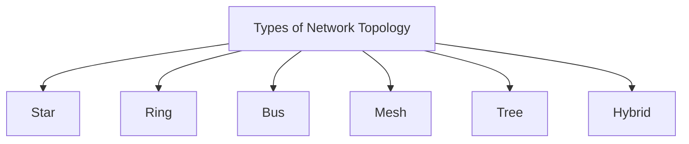
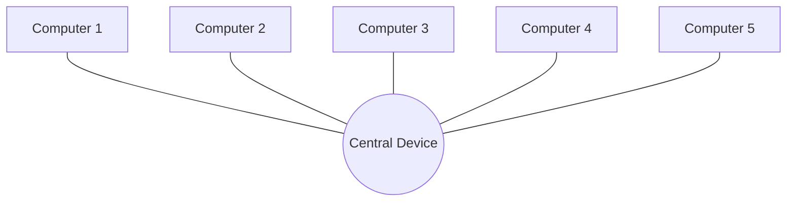
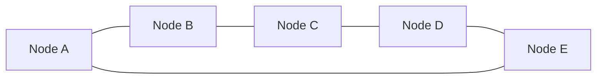
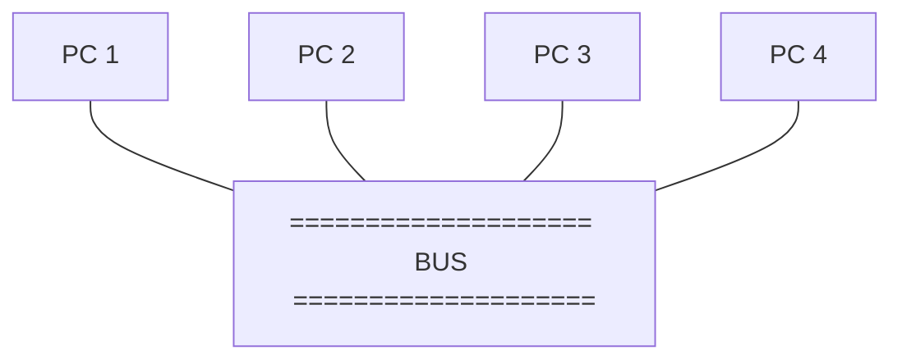
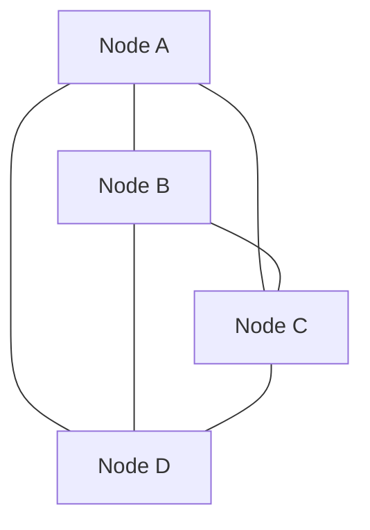
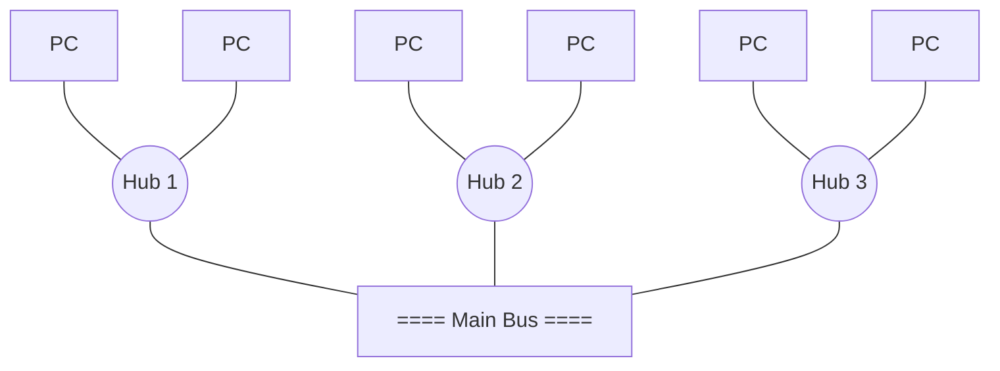

# 01 — Networks and Network Topologies

## What is a network?

A **network** is a set of devices connected by a physical media link. In a network, two or more nodes are connected by a physical link, or two or more networks are connected by one or more nodes. A network is a collection of devices connected to each other to allow the sharing of data.

## Node and Link

A network is a setup of two or more computers directly connected by physical media like optical fiber or coaxial cable.

- The **physical medium** of connection is the **link**.
- The **computers** it connects are called **nodes**.

## Network Topology

**Network topology** specifies the layout of a computer network — how devices and cables are connected to each other.

## Star

- All nodes are connected to a single device known as the **central device** (hub/switch).
- Requires more cable than other topologies, but is **robust** — a failure in one cable only disconnects the specific computer connected to it.
- If the central device is damaged, the whole network fails.
- Very easy to install, manage and troubleshoot. Commonly used in **office and home networks**.

## Ring

- Nodes are connected to exactly two neighbouring nodes, forming a single continuous path for transmission.
- Does **not** need a central server to control connectivity.
- If a single node is damaged, the whole network fails.
- Rarely used — expensive, difficult to install and manage.
- Examples: **SONET**, **SDH**.

## Bus

- All nodes are connected to a **single central cable** known as the **bus**.
- Acts as a **shared communication medium** — any device sending data puts it on the bus, and the bus delivers it to all attached devices.
- Useful for a small number of devices.
- If the bus is damaged, the whole network fails.

## Mesh

- Every node is individually connected to other nodes.
- Does **not** need a central switch or hub.
- Two variants:
  - **Fully connected mesh** — every node is connected to every other node.
  - **Partially connected mesh** — not every node is connected to every other node.
- Robust — a failure in one cable only disconnects the specific computer on that cable.
- Rarely used — installation and configuration are difficult as connectivity grows.
- **Cabling cost is high** — requires bulk wiring.

## Tree

- A combination of **star and bus** topology — also known as **expanded star topology**.
- All the star networks are connected to a single bus.
- **Ethernet** protocol is used.
- The network is divided into segments (star networks) that can be easily maintained. If one segment is damaged, other segments are unaffected.
- Depends on the "main bus" — if the bus breaks, the whole network is damaged.

## Hybrid

- A combination of different topologies forming a resulting topology.
- If a star topology is connected with another star topology, the result is still a **star**. If a star topology is connected with a *different* topology, the result is a **hybrid** topology.
- Provides **flexibility** — can be implemented across different network environments.
