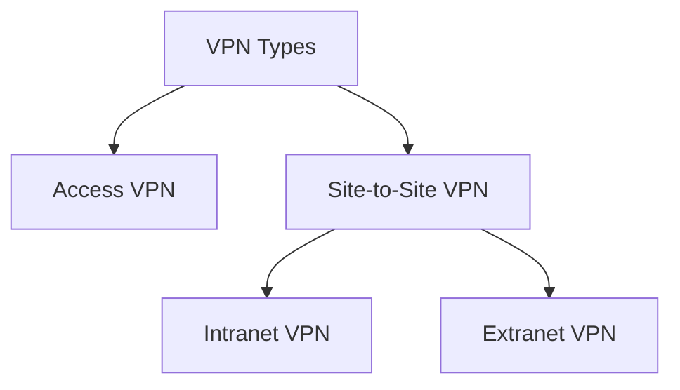

# 03 — VPN (Virtual Private Network)

## What is a VPN?

A **VPN (Virtual Private Network)** is a private WAN built on top of the internet. It allows the creation of a **secured tunnel** (protected network) between different networks using the internet (public network). Using a VPN, a client can connect to an organization's network remotely.

## Advantages of VPN

1. Connects offices in different geographical locations remotely — **cheaper than dedicated WAN** connections.
2. Enables **secure transactions** and confidential data transfer between multiple offices in different locations.
3. Keeps an organization's information secured against potential threats or intrusions by using virtualization.
4. **Encrypts internet traffic** and disguises online identity.

## Types of VPN

### Access VPN

- Provides connectivity to **remote mobile users and telecommuters**.
- Serves as an alternative to **dial-up** or **ISDN** (Integrated Services Digital Network) connections.
- Low-cost solution, wide range of connectivity.

### Site-to-Site VPN (a.k.a. Router-to-Router VPN)

Commonly used in large companies with branches in different locations, to connect one office's network to another. Split into two sub-categories:

#### Intranet VPN

- Connects remote offices in different geographical locations using **shared infrastructure** (internet connectivity and servers).
- Same accessibility policies as a private WAN.

#### Extranet VPN

- Uses shared infrastructure over an intranet with **suppliers, customers, partners**, and other external entities.
- Connects them using **dedicated connections**.
