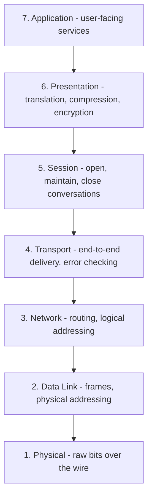

# 05 — OSI Model

## What is the OSI Model?

The **OSI (Open System Interconnections)** model is a network architecture model based on ISO standards. It's called the OSI model because it deals with connecting systems that are *open* for communication with other systems.

The OSI model has **seven layers**. The principles used to arrive at these seven layers:

1. Create a new layer if a **different abstraction** is needed.
2. Each layer should have a **well-defined function**.
3. The function of each layer is chosen based on **internationally standardized protocols**.

## The seven layers — top to bottom

**Mnemonic (top to bottom):** *All People Seem To Need Data Processing.*

---

## 1. Physical Layer

- The **lowest** layer of the OSI reference model.
- Used for the transmission of an **unstructured raw bit stream** over a physical medium.
- Transmits data in **electrical, optical, or mechanical** form.
- Physical connection between devices — via twisted-pair cable, fibre-optic, or wireless transmission media.

## 2. Data Link Layer

- Used for transferring data from one node to another node.
- Receives data from the network layer, converts it into **data frames**, attaches the **physical address** to these frames, and passes them to the physical layer.
- Enables **error-free** transfer of data between adjacent nodes.

**Functions of the Data-Link Layer**

- **Frame synchronization** — converts data into frames; the destination must recognize the start and end of each frame.
- **Flow control** — controls data flow within the network.
- **Error control** — detects and corrects errors during transmission.
- **Addressing** — attaches the physical address to frames so individual machines can be identified.
- **Link management** — handles initiation, maintenance, and termination of the link between source and destination.

## 3. Network Layer

- Converts the **logical address into the physical address**.
- Determines the **best route** for a packet to travel from source to destination — this is the **routing** concept.

**Functions of the Network Layer**

- **Routing** — determines the best route from source to destination.
- **Logical addressing** — defines the addressing scheme to identify each device uniquely.
- **Packetizing** — receives data from the upper layer and converts it into packets.
- **Internetworking** — provides logical connection between different types of networks to form a bigger network.
- **Fragmentation** — dividing packets into fragments.

## 4. Transport Layer

- Delivers the message through the network and provides **error checking** so no error occurs during transfer.
- Provides two kinds of services:
  - **Connection-oriented transmission** — the receiver sends an **acknowledgement** to the sender after a packet is received.
  - **Connectionless transmission** — the receiver does **not** send an acknowledgement.

## 5. Session Layer

- Main responsibility: **beginning, maintaining, and ending** communication between devices.
- Reports errors coming from the upper layers.
- Establishes and maintains the session between two users.

## 6. Presentation Layer

- Also known as the **Translation layer** — translates data from one format to another.
- At the **sender**: translates data format used by the application layer to a common format.
- At the **receiver**: translates the common format back into a format used by the application layer.

**Functions of the Presentation Layer**

- Character code translation
- Data conversion
- Data compression
- Data encryption

## 7. Application Layer

- Enables the user to **access the network**.
- The **topmost** layer of the OSI reference model.
- Application-layer protocols include: **FTP, SMTP, DNS**, and so on.
- The most widely used application protocol is **HTTP** (Hypertext Transfer Protocol) — a user sends a request for a web page using HTTP.

## Peer-to-peer processes

The processes on each machine that communicate at a given layer are called **peer-peer processes** (P2P). Each layer talks *conceptually* to its peer on the other machine, even though actual data travels down the stack, across the wire, and back up.
