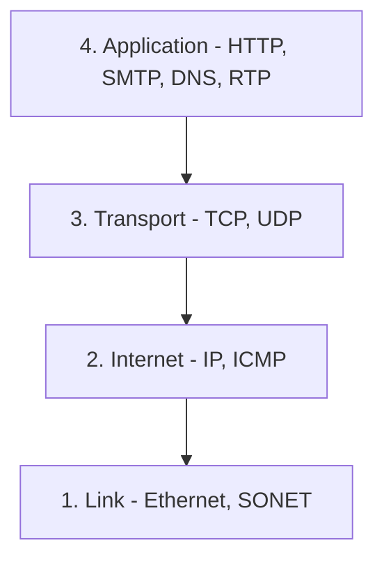
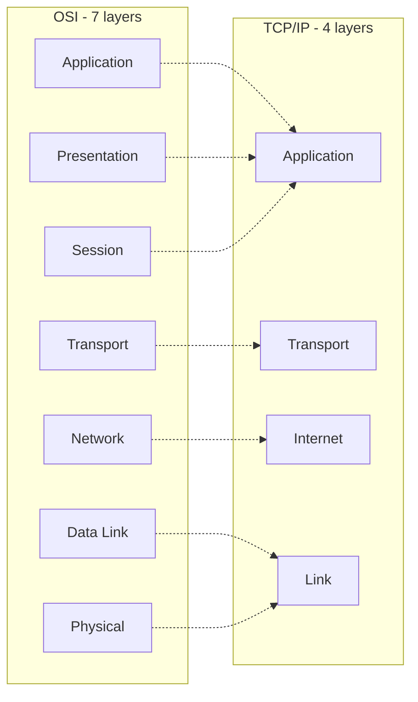

# 06 — TCP/IP Model and TCP vs UDP

## The TCP/IP Reference Model

The **TCP/IP** reference model is a compressed version of the OSI model with only **4 layers**. It was developed by the US Department of Defence (DoD).

> **Correction.** The source says "in the 1860s" — that's a typo. TCP/IP was designed by the US DoD in the **1960s–70s**; the TCP/IP protocol suite as we know it was standardized in the early **1980s**.

The name of this model comes from its two core protocols — **TCP** (Transmission Control Protocol) and **IP** (Internet Protocol).

### 1. Link

Decides which links — serial lines, classic Ethernet — must be used to meet the needs of the connectionless internet layer.
**Examples:** SONET, Ethernet.

### 2. Internet

The **most important layer** — holds the whole architecture together. Delivers IP packets to where they are supposed to be delivered.
**Examples:** IP, ICMP.

### 3. Transport

Its functionality is almost the same as the OSI transport layer. Enables peer entities on the network to carry on a conversation.
**Examples:** TCP, UDP (User Datagram Protocol).

### 4. Application

Contains all the higher-level protocols.
**Examples:** HTTP, SMTP, RTP, DNS.

## OSI vs TCP/IP (side by side)

The upper three OSI layers collapse into TCP/IP's single **Application** layer; the bottom two collapse into **Link**.

## TCP vs UDP

Both are **transport-layer** protocols — but with very different priorities.

| | **TCP** | **UDP** |
| --- | --- | --- |
| Connection | **Connection-oriented** — 3-way handshake, tears down cleanly | **Connectionless** — just fire and forget |
| Speed | Slower | **Faster** |
| Reliability | Retransmits lost packets | No retransmission |
| Error checking | **Extensive** — flow control, acknowledgements | Basic — checksums only |
| Use cases | HTTP, email, file transfer | DNS lookups, video streaming, gaming, VoIP |

**Key intuition:** TCP asks *"did you get it?"* every time. UDP just shouts and moves on. That's why UDP is much faster, simpler, and more efficient — but retransmission of lost data packets is only possible with TCP.
