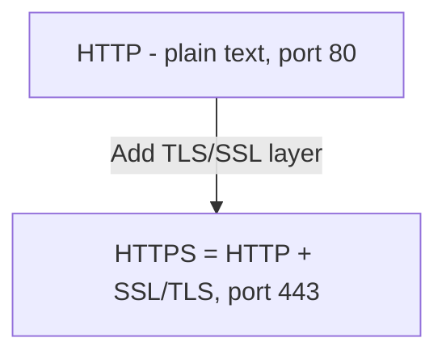
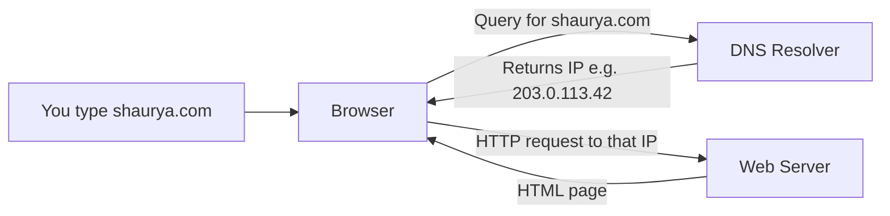

# 07 — DNS, HTTP, HTTPS, SMTP

## HTTP

**HTTP** is the **HyperText Transfer Protocol**. It defines the set of rules and standards for transmitting information on the World Wide Web (WWW), and it's the protocol web browsers and web servers use to communicate.

- **Stateless protocol** — each command is independent of the previous command.
- **Application-layer** protocol built on top of **TCP**.
- Uses **port 80** by default.

## HTTPS

**HTTPS** is **HyperText Transfer Protocol Secure** — an advanced and secured version of HTTP. On top of HTTP, the **SSL/TLS** protocol is used to provide security.

- Enables **secure transactions** by encrypting communication.
- Helps identify network servers **securely**.
- Uses **port 443** by default.

## DNS (Domain Name System)

- **DNS** stands for **Domain Name System**. Introduced by **Paul Mockapetris** and **Jon Postel** in **1983**.
- A naming system for all resources over the internet — physical nodes and applications. Used to locate resources easily over a network.
- DNS is a system on the internet that **maps domain names to their associated IP addresses**.
- Without DNS, users would have to know the IP address of every web page they wanted to access.

## How DNS works

Suppose you want to visit `https://www.shaurya.com`:

1. You type the domain into the browser's address bar.
2. The DNS translates the domain name into an IP address the computer can interpret.
3. Using the IP, the computer locates the web page you requested.

## DNS Forwarder

A **forwarder** is used with a DNS server when it receives DNS queries it can't resolve quickly. It **forwards** those requests to external DNS servers for resolution. A DNS server configured as a forwarder behaves differently than one that isn't.

## SMTP

**SMTP** — the **Simple Mail Transfer Protocol**. It sets the rules for communication between mail servers. These rules help software transmit emails over the internet.

- Supports both **End-to-End** and **Store-and-Forward** methods.
- Always in listening mode on **port 25**.
