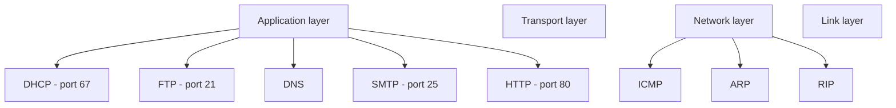
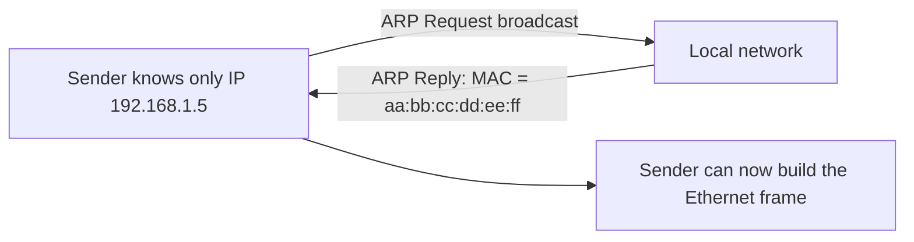

# 08 — Important Protocols

## What is a protocol?

A **protocol** is a set of rules that governs all aspects of information communication. A protocol has three main elements:

- **Syntax** — specifies the structure or format of the data, and the order in which parts are presented.
- **Semantics** — specifies the meaning of each section of bits.
- **Timing** — specifies two characteristics: **when** data should be sent and **how fast** it can be sent.

## The protocol lineup

## DHCP — Dynamic Host Configuration Protocol

- An **application-layer** protocol used to **auto-configure devices** on IP networks, enabling them to use TCP and UDP-based protocols.
- DHCP servers auto-assign **IP addresses** and other network configurations to devices, so they can communicate over the IP network.
- Helps get the **subnet mask** and **IP address**; also helps resolve DNS.
- Uses **port 67** by default (server side; port 68 client side).

## FTP — File Transfer Protocol

- An **application-layer** protocol used to transfer files and data **reliably and efficiently** between hosts.
- Can also be used to download files from remote servers to your computer.

> **Correction.** The source says "port 27" — that's wrong. **FTP uses port 21** for control and port 20 for data.

## ICMP — Internet Control Message Protocol

- A **network-layer** protocol used for **error handling**.
- Mainly used by network devices like routers to diagnose network connection issues.
- Crucial for error reporting and testing whether data reaches its preferred destination in time.

> **Correction.** The source says "port 7" — that's wrong. **ICMP is a network-layer protocol and does not use ports at all.** Ports are a transport-layer concept (TCP/UDP). Port 7 is actually the **Echo** service; ICMP has its own Echo Request/Reply messages (used by `ping`), which is likely where the confusion crept in.

## ARP — Address Resolution Protocol

- A **network-level** protocol used to convert the **logical address** (IP address) to the device's **physical address** (MAC address).
- Also used to get the MAC address of devices when they're trying to communicate over the local network.

## RIP — Routing Information Protocol

- Accessed by routers to send data from one network to another.
- A **dynamic protocol** used to find the best route from source to destination over a network — using the **hop count** algorithm.
- Routers use this protocol to exchange network topology information.
- Suitable for **small or medium-sized** networks.

## POP3 — Post Office Protocol version 3

- Responsible for **accessing the mail service** on a client machine.
- Works in two modes:
  - **Delete mode** — mail is deleted from the server after being downloaded to the client.
  - **Keep mode** — mail remains on the server after being downloaded.
