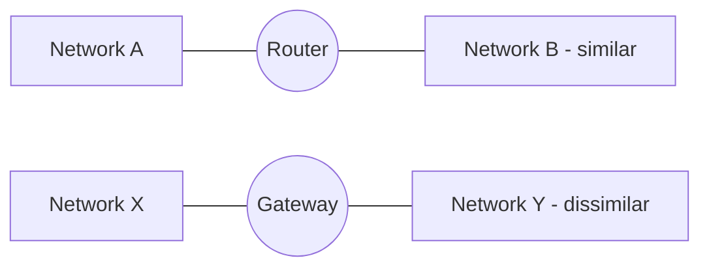

# 09 — Network Devices: Hub, Switch, Router, Firewall, NIC

## Hub

- A networking device that **transmits the signal to every port** (except the one from which the signal was received).
- Operates on the **Physical Layer**.
- **No packet filtering.**
- Two types:
  - **Active hub** — regenerates and amplifies the signal.
  - **Passive hub** — just relays the signal without regeneration.

## Switch

- A network device used to **enable connection establishment and termination** on the basis of need.
- Operates on the **Data Link Layer**.
- **Packet filtering is available.**
- Operates in **full-duplex** transmission mode.
- Also called an **efficient bridge**.

## Hub vs Switch — at a glance

| | Hub | Switch |
| --- | --- | --- |
| OSI layer | Physical | Data Link |
| Packet filtering | ❌ | ✅ |
| Duplex | Half | Full |
| Broadcast to all ports | Yes | No — only to the intended port |
| Intelligence | None | Learns MAC addresses per port |

## Router (and Gateway)

- A **node connected to two or more networks** is commonly known as a **gateway** — also known as a **router**.
- Used to **forward messages** from one network to another.
- Both regulate the **traffic** in the network.

**Gateway vs Router**

- A **router** sends data between two **similar** networks.
- A **gateway** sends data between two **dissimilar** networks.

## Firewall

- A **network security system** that monitors incoming and outgoing traffic and blocks it based on the **firewall security policies**.
- Acts as a wall between the **internet (public network)** and the **networking devices (private network)**.
- Can be a hardware device, software program, or a combination of both.
- Adds a **layer of security** to the network.

## NIC — Network Interface Card

- **NIC** stands for **Network Interface Card**.
- A peripheral card attached to the PC to **connect to a network**.
- Every NIC has its own **MAC address** that identifies the PC on the network.
- Provides a **wireless connection** to a local area network (in wireless NICs).
- Historically used mainly in desktop computers.

## Subnet and Subnetting

A **subnet** is a network *inside* a network — achieved by the process of **subnetting**, which divides a network into subnets.

**Why subnet?**

- Higher **routing efficiency**.
- Enhances the **security** of the network.
- Reduces the **time to extract the host address** from the routing table.
