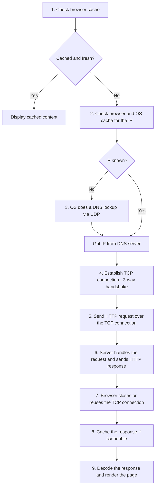
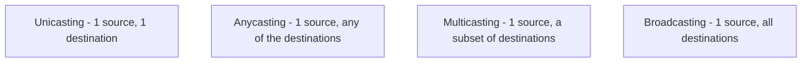
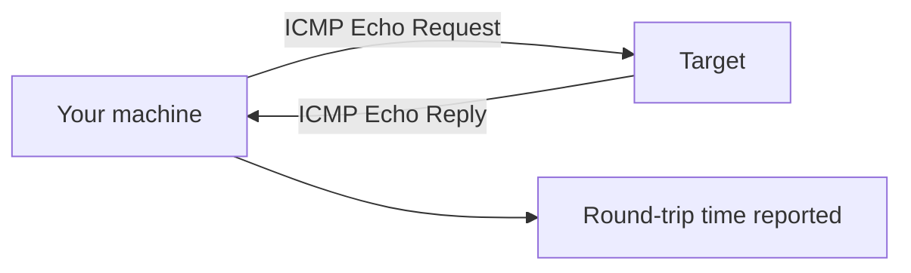

# 10 — What Happens When You Type google.com? (and Reference Nuggets)

## The classic interview question

**What happens when you enter `google.com` in the web browser?** — the walkthrough:

**Step-by-step in words**

1. Check the browser cache — if the content is fresh and present, display it.
2. If not, the browser checks whether the URL's IP is present in the cache (browser and OS). If not, it requests the OS to do a **DNS lookup using UDP** to get the corresponding IP address from a DNS server.
3. A new TCP connection is set up between the browser and the server using the **three-way handshake**.
4. An **HTTP request** is sent to the server using that TCP connection.
5. The web server running on the server handles the incoming HTTP request and sends the **HTTP response**.
6. The browser processes the response — it may close the TCP connection or reuse it for future requests.
7. If the response data is cacheable, browsers cache it.
8. The browser decodes the response and **renders the content** for you to see.

---

## Reliability of a network

The reliability of a network can be measured by:

- **Downtime** — the required time to recover.
- **Failure frequency** — how often it fails to work as intended.
- **Catastrophe** — indicates the network has been affected by some unexpected event (fire, earthquake).

## What makes a network effective and efficient?

Two big criteria, and two more that come up in practice:

- **Performance** — measurable in many ways: transmit time, response time.
- **Reliability** — measured by frequency of failure.
- **Robustness** — the quality or condition of being strong and in good working condition.
- **Security** — how well data is protected from unauthorized access and viruses.

## Casting: how the message reaches its audience

| Type | Definition | Where you see it |
| --- | --- | --- |
| **Unicasting** | Message sent to a **single node** from the source | Establishing a new connection |
| **Anycasting** | Message sent to **any one** of the nodes from the source | Content Delivery Networks — get content from any nearby server |
| **Multicasting** | Message sent to a **subset** of nodes from the source | Sending the same data to multiple receivers |
| **Broadcasting** | Message sent to **all** nodes in the network from a source | DHCP, ARP in local networks |

## Utility programs and misc.

- **RAID** (Redundant Array of Inexpensive / Independent Disks) — a method to provide **fault tolerance** by using multiple hard-disk drives.
- **Netstat** — a command-line utility that gives useful information about the current TCP/IP settings of a connection.
- **Ping** — a utility program that lets you check the **connectivity** between network devices. You can ping devices using their IP address or name.

## Peer-to-peer processes

The processes on each machine that communicate at a given layer are called **peer-peer (P2P) processes**. Each layer thinks it's talking directly to its peer on the other machine — even though the actual bytes travel all the way down the stack, across the wire, and back up.
