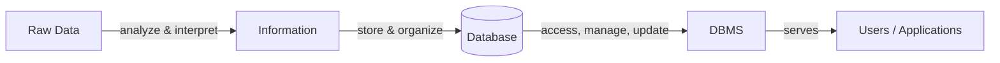

# 01 — Introduction to DBMS (LEC-1)

## What is Data?

**Data** is a collection of raw, unorganized facts and details such as text, observations, figures, symbols, and descriptions of things. On its own, data does not carry any specific purpose and has no significance by itself.

Data is measured in terms of **bits** and **bytes** — the basic units of information in the context of computer storage and processing. Data can be recorded, but it has no meaning unless it is processed.

### Types of Data

| Type | Description | Examples |
| --- | --- | --- |
| **Quantitative** | Numerical form | Weight, volume, cost of an item |
| **Qualitative** | Descriptive, but not numerical | Name, gender, hair color of a person |

## What is Information?

**Information** is processed, organized, and structured data. It provides context to the data and enables decision-making — it is processed data that makes sense to us.

Information is extracted from data by analyzing and interpreting individual pieces of it. For example, you may have data on all the people living in your locality. That is data. When you analyze and interpret it and reach conclusions, you produce information:

- There are 100 senior citizens.
- The sex ratio is 1.1.
- Newborn babies number 100.

## Data vs Information

| Aspect | Data | Information |
| --- | --- | --- |
| Nature | Collection of raw facts | Facts placed into context |
| Organization | Raw and unorganized | Organized |
| Relationship | Individual, sometimes unrelated points | Maps data into a big-picture view |
| Meaning | Meaningless on its own | Meaningful after analysis and interpretation |
| Dependency | Does not depend on information | Depends on data |
| Presentation | Graphs, numbers, figures, statistics | Words, language, thoughts, ideas |
| Decision-making | Not sufficient for decisions | Decisions can be made from it |

## The Big Picture

Raw data becomes meaningful information; that information lives in a database, and a DBMS is the software layer that lets users store and retrieve it efficiently.

## What is a Database?

A **database** is an electronic place/system where data is stored in a way that it can be easily accessed, managed, and updated. To make real use of data, we need **Database Management Systems (DBMS)**.

## What is DBMS?

A **database-management system (DBMS)** is a collection of interrelated data and a set of programs to access that data. The collection of data, usually referred to as the **database**, contains information relevant to an enterprise.

The primary goal of a DBMS is to provide a way to store and retrieve database information that is both convenient and efficient. A DBMS is the database itself along with all the software and functionality used to perform operations such as addition, access, updating, and deletion of the data.

## DBMS vs File Systems

File-processing systems have major disadvantages. The following seven problems of file systems are, in turn, the advantages of using a DBMS (the answer to "Why use a DBMS?").

| Problem in File Systems | Why it matters |
| --- | --- |
| **Data redundancy and inconsistency** | Same data duplicated in multiple files, leading to mismatched copies |
| **Difficulty in accessing data** | No convenient, general way to retrieve data on demand |
| **Data isolation** | Data scattered across files and formats |
| **Integrity problems** | Consistency constraints are hard to enforce |
| **Atomicity problems** | Operations may be left half-done on failure |
| **Concurrent-access anomalies** | Simultaneous access can corrupt data |
| **Security problems** | Hard to restrict access to specific data |
