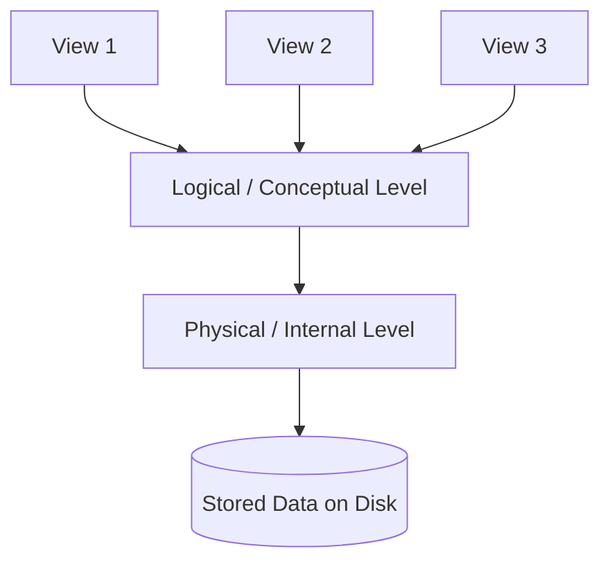
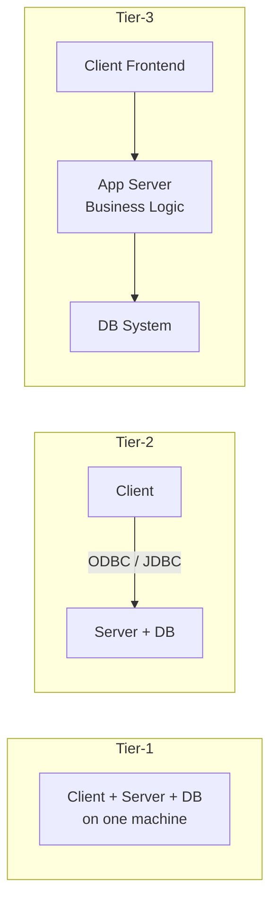

# 02 — DBMS Architecture (LEC-2)

## View of Data (Three-Schema Architecture)

The major purpose of a DBMS is to provide users with an **abstract view** of the data — the system hides certain details of how data is stored and maintained. To simplify user interaction, abstraction is applied through several levels.

The main objective of the three-level architecture is to enable multiple users to access the same data with a personalized view while storing the underlying data only once.

The view level offers personalized subschemas per user group, the logical level defines what data and relationships exist, and the physical level defines how data is stored.

### Physical Level (Internal Level)

- The lowest level of abstraction; describes **how** the data is stored.
- Uses low-level data structures.
- Has a **physical schema** that describes the physical storage structure of the DB.
- Covers storage allocation (N-ary trees, etc.), data compression, and encryption.
- **Goal:** define algorithms that allow efficient access to data.

### Logical Level (Conceptual Level)

- The **conceptual schema** describes the design of the database at the conceptual level: what data is stored and what relationships exist among that data.
- A user at the logical level need not be aware of physical-level structures.
- The **DBA**, who decides what information to keep in the DB, uses this level.
- **Goal:** ease of use.

### View Level (External Level)

- The highest level of abstraction; simplifies users' interaction by providing different views to different end-users.
- Each **view schema** describes the part of the database a particular user group is interested in and hides the rest.
- At the external level, a database contains several schemas, sometimes called **subschemas**, that describe different views.
- Views also provide a **security mechanism** to prevent users from accessing certain parts of the DB.

## Instances and Schemas

- **Instance** — the collection of information stored in the DB at a particular moment.
- **Schema** — the overall design of the DB; a structural description of data. The schema does not change frequently, though data may change frequently.
- A DB schema corresponds to variable declarations (along with their type) in a program.
- There are 3 types of schemas: **physical**, **logical**, and several **view schemas** (subschemas).
- The **logical schema** is the most important in terms of its effect on application programs, since programmers build apps using it.
- **Physical data independence** — a change to the physical schema should not affect the logical schema or application programs.

## Data Models

A **data model** provides a way to describe the design of a DB at the logical level. It is a collection of conceptual tools for describing data, data relationships, data semantics, and consistency constraints.

Examples: ER model, relational model, object-oriented model, object-relational data model.

## Database Languages

| Language | Purpose |
| --- | --- |
| **DDL** (Data Definition Language) | Specify the database schema |
| **DML** (Data Manipulation Language) | Express database queries and updates |

Practically, both features exist in a single language, e.g., **SQL**.

### DDL

With DDL we also specify **consistency constraints**, which must be checked every time the DB is updated.

### DML

Data manipulation involves four operations:

- **Retrieval** of information stored in the DB.
- **Insertion** of new information into the DB.
- **Deletion** of information from the DB.
- **Updating** existing information stored in the DB.

A **query language** is the part of DML used to specify statements that request the retrieval of information.

## How is a Database Accessed from Application Programs?

Applications written in **host languages** (C/C++, Java) interact with the DB. For example, a banking system's payroll module accesses the DB by executing DML statements from the host language.

An **API** is provided to send DML/DDL statements to the DB and retrieve results:

- **ODBC** (Open Database Connectivity) — for Microsoft "C".
- **JDBC** (Java Database Connectivity) — for Java.

## Database Administrator (DBA)

A **DBA** is a person who has central control of both the data and the programs that access that data.

### Functions of a DBA

- Schema definition.
- Defining storage structure and access methods.
- Schema and physical organization modifications.
- Authorization control.
- Routine maintenance — periodic backups, security patches, and any upgrades.

## DBMS Application Architectures

Client machines are where remote DB users work, and server machines are where the DB system runs.

The tiers differ by how the application is partitioned across the client, an optional application server, and the database.

### T1 Architecture

The client, server, and DB are all present on the same machine.

### T2 Architecture

- The application is partitioned into two components.
- The client machine invokes DB-system functionality at the server end through query-language statements.
- API standards like ODBC and JDBC are used for client-server interaction.

### T3 Architecture

- The application is partitioned into three logical components.
- The client machine is just a frontend and contains no direct DB calls.
- The client communicates with the App Server, and the App Server communicates with the DB system.
- **Business logic** (what action to take under a given condition) resides in the App Server itself.
- Best suited for **WWW applications**.

Advantages of T3:

- **Scalability** — due to distributed application servers.
- **Data integrity** — the App Server acts as a middle layer, minimizing chances of data corruption.
- **Security** — the client cannot directly access the DB, so it is more secure.
