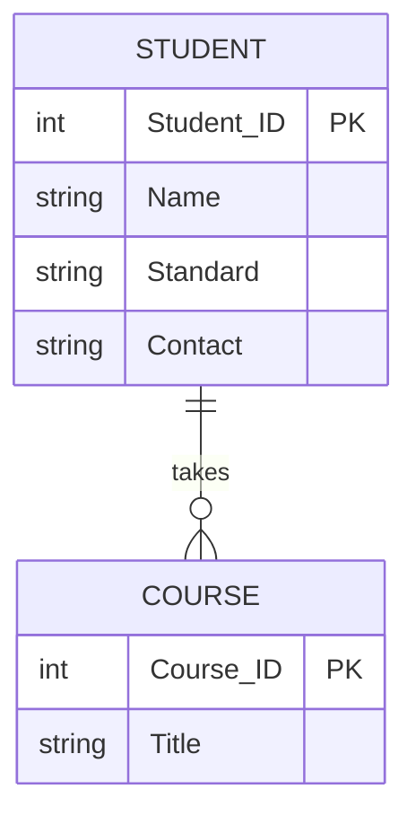
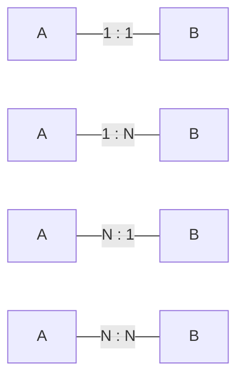

# 03 — Entity-Relationship Model (LEC-3)

## Data Model

A **data model** is a collection of conceptual tools for describing data, data relationships, data semantics, and consistency constraints.

## ER Model

The **ER (Entity-Relationship) model** is a high-level data model based on a perception of the real world that consists of a collection of basic objects, called **entities**, and of **relationships** among these objects.

The graphical representation of the ER model is the **ER diagram**, which acts as a blueprint of the database.

An entity set (STUDENT) is linked to another (COURSE) through a relationship (takes), and each entity carries its own attributes with a primary key.

## Entity

An **entity** is a "thing" or "object" in the real world that is distinguishable from all other objects.

- It has physical existence — e.g., each student in a college is an entity.
- An entity can be uniquely identified by a **primary attribute** (aka **Primary Key**).

| Entity Type | Definition | Example |
| --- | --- | --- |
| **Strong Entity** | Can be uniquely identified | Loan |
| **Weak Entity** | Cannot be uniquely identified; depends on a strong entity | Payment |

A **weak entity** lacks sufficient attributes to form a uniquely identifiable attribute, so it depends on a strong entity for its existence. For example, `Loan` is a strong entity while `Payment` is weak — installment counters can be generated separately (sequentially) for each loan.

## Entity Set

An **entity set** is a set of entities of the same type that share the same properties or attributes.

- E.g., `Student` is an entity set.
- E.g., `Customer` of a bank.

## Attributes

An entity is represented by a set of **attributes**. Each entity has a value for each of its attributes. For each attribute there is a set of permitted values, called the **domain** (or value set) of that attribute.

For example, a `Student` entity may have the attributes: Student_ID, Name, Standard, Course, Batch, Contact number, and Address.

### Types of Attributes

| Type | Definition | Example |
| --- | --- | --- |
| **Simple** | Cannot be divided further | Account number, Roll number |
| **Composite** | Can be divided into subparts (other attributes) | Name → first/middle/last; Address → street/city/state/PIN |
| **Single-valued** | Holds only one value | Student ID, loan-number |
| **Multi-valued** | Can hold more than one value | Phone-number, nominee-name, dependent-name |
| **Derived** | Value derived from other related attributes | Age, loan-age, membership-period |

For multi-valued attributes, a limit constraint (upper or lower limit) may be applied.

### NULL Value

An attribute takes a **NULL** value when an entity does not have a value for it. It can indicate:

- **Not applicable** — the value does not exist, e.g., a person having no middle name.
- **Unknown** — split into two cases below.
- **Missing** — a required entry is absent, e.g., a customer's `name` is NULL, meaning it is missing (name must have some value).
- **Not known** — e.g., an employee's `salary` is NULL, meaning it is not known yet.

## Relationships

A **relationship** is an association among two or more entities. E.g., Person *has* vehicle, Parent *has* child, Customer *borrows* loan.

- **Strong relationship** — between two independent entities.
- **Weak relationship** — between a weak entity and its owner/strong entity, e.g., `Loan <installment-payments> Payment`.

### Degree of Relationship

The **degree** is the number of entities participating in a relationship.

| Degree | Entities | Example |
| --- | --- | --- |
| **Unary** | One entity participates | Employee manages Employee |
| **Binary** | Two entities participate | Student takes Course |
| **Ternary** | Three entities participate | Employee works-on Branch, Employee works-on Job |

Binary relationships are the most common.

## Relationship Constraints

### Mapping Cardinality (Cardinality Ratio)

The **mapping cardinality** is the number of entities to which another entity can be associated via a relationship.

The four cardinality ratios describe how many entities of set A relate to entities of set B.

| Cardinality | Meaning | Example |
| --- | --- | --- |
| **One to One** | An entity in A associates with at most one in B, and vice versa | Citizen has Aadhar Card |
| **One to Many** | An entity in A associates with N in B; an entity in B with at most one in A | Citizen has Vehicle |
| **Many to One** | An entity in A associates with at most one in B; an entity in B with N in A | Course taken by Professor |
| **Many to Many** | An entity in A associates with N in B, and vice versa | Customer buys Product; Student attends Course |

### Participation Constraints

Also known as the **minimum cardinality constraint**. There are two types:

- **Partial Participation** — not all entities are involved in the relationship instance.
- **Total Participation** — each entity must be involved in at least one relationship instance.

For example, in "Customer borrows Loan", `Loan` has **total participation** (it cannot exist without a customer), while `Customer` has **partial participation**. A weak entity always has a total participation constraint, but a strong entity may not.
