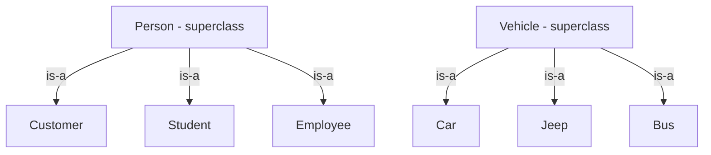
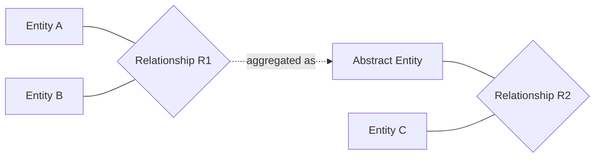

# 04 — Extended ER Features (LEC-4)

The basic ER features studied in LEC-3 can model most database requirements. But as complexity increases, it is better to use **Extended ER features** to model the database schema cleanly.

---

## Specialisation

**Specialisation** is the process of subgrouping an entity set into further sub-entity sets, based on distinctive functionalities, specialities, and features that set some entities apart from others.

- It is a **Top-Down** approach.
- The parent entity set is the **superclass**; the specialised sub-entity sets are **subclasses**.
- There is an **"is-a" relationship** between the superclass and its subclasses.
- It is depicted by a **triangle** component in the ER diagram.

**Example:** A `Person` entity set can be divided into `Customer`, `Student`, and `Employee`. Here `Person` is the superclass and the others are subclasses.

### Why Specialise?

- Certain attributes may only be applicable to a few entities of the parent entity set.
- The DB designer can show the distinctive features of the sub-entities.
- Grouping such entities via specialisation refines the overall DB blueprint.

---

## Generalisation

**Generalisation** is the reverse of specialisation. When the designer notices that certain properties of two or more entities overlap, they can combine them into a new **generalised entity set**, which becomes the superclass.

- It is a **Bottom-Up** approach.
- An **"is-a" relationship** exists between each subclass and the new superclass.

**Example:** `Car`, `Jeep`, and `Bus` share common attributes. To avoid repeating those common attributes, the designer generalises them into a new entity set, `Vehicle`.

### Why Generalise?

- Makes the DB more refined and simpler.
- Common attributes are not repeated across entities.

---

## Specialisation vs Generalisation

| Aspect | Specialisation | Generalisation |
| --- | --- | --- |
| Direction | Top-Down | Bottom-Up |
| Starting point | One general entity set | Multiple specific entity sets |
| Result | Splits into distinct subclasses | Combines into one superclass |
| Goal | Show distinctive sub-entity features | Remove repetition of common attributes |
| Relationship | "is-a" (superclass → subclass) | "is-a" (subclass → superclass) |

---

## Hierarchy Diagram

Specialisation reads top-down (Person split into subclasses); generalisation reads bottom-up (Car/Jeep/Bus combined into Vehicle).

---

## Attribute Inheritance

Both specialisation and generalisation feature **attribute inheritance**: the attributes of a higher-level entity set are inherited by the lower-level entity sets.

**Example:** `Customer` and `Employee` inherit the attributes of `Person`.

---

## Participation Inheritance

If a parent entity set participates in a relationship, then its child entity sets will also participate in that relationship.

---

## Aggregation

**Aggregation** is the technique used to show relationships among relationships.

- Abstraction is applied to treat a relationship as a **higher-level entity** — an *abstract entity*.
- This aggregated relationship can then itself participate in other relationships.
- It avoids redundancy by aggregating a relationship as an entity set in its own right.

Aggregation wraps an existing relationship (R1) into an abstract entity so it can take part in a further relationship (R2).
