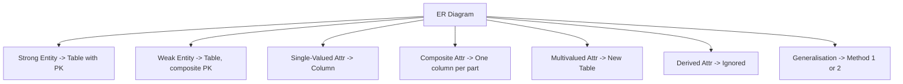

# 06 — ER Model to Relational Model (LEC-8)

Both the ER Model and the Relational Model are abstract logical representations of real-world enterprises. Because the two models imply similar design principles, an ER design can be converted into a relational design. Converting an ER diagram into a table format is how we arrive at a relational DB design.



Each ER construct maps to a specific treatment in the resulting set of relational tables.

---

## Quick Mapping Reference

| ER Construct | Relational Treatment |
| --- | --- |
| Strong Entity | Own table; entity PK becomes relation PK |
| Weak Entity | Own table; composite PK = {FK of owner + partial key} |
| Single-Valued Attribute | Direct column |
| Composite Attribute | One column per component; drop the parent name |
| Multivalued Attribute | Separate new table |
| Derived Attribute | Not stored |
| Generalisation | Method 1 or Method 2 (see below) |

---

## Strong Entity

- Becomes an individual table with the entity name; its attributes become the columns of the relation.
- The entity's **Primary Key** is used as the relation's PK.
- **Foreign Keys** are added to establish relationships with other relations.

---

## Weak Entity

- A table is formed with all the attributes of the entity.
- The PK of its corresponding **strong entity** is added as a **foreign key**.
- The relation's PK is a **composite PK**: `{FK + Partial discriminator key}`.

---

## Single-Valued Attributes

- Represented directly as columns in the tables/relations.

---

## Composite Attributes

- Handled by creating a separate column in the original relation for each component of the composite attribute.
- **Example:** `Address: {street-name, house-no}` is a composite attribute in the `Customer` relation. We add `address-street-name` and `address-house-no` as new columns and drop `address` itself as an attribute.

---

## Multivalued Attributes

- A new table (named after the original attribute) is created for each multivalued attribute.
- The PK of the entity is used as a **foreign key** column in the new table.
- A column with the attribute's name is added to hold the multiple values.
- The new table's PK is `{FK + multivalued name}`.

**Example:** For the strong entity `Employee`, `dependent-name` is a multivalued attribute.

- A new table `dependent-name` is formed with columns `emp-id` and `dname`.
- PK: `{emp-id, name}`
- FK: `{emp-id}`

---

## Derived Attributes

- Not considered / not stored in the tables.

---

## Generalisation

### Method 1

Create a table for the higher-level entity set. For each lower-level entity set, create a table that includes a column for each of its own attributes, plus a column for each attribute of the higher-level entity set's primary key.

**Example — Banking System:** generalisation of `Account` into `savings` and `current`.

```text
Table 1: account          (account-number, balance)
Table 2: savings-account  (account-number, interest-rate, daily-withdrawal-limit)
Table 3: current-account  (account-number, overdraft-amount, per-transaction-charges)
```

### Method 2

An alternative representation, possible only if the generalisation is **disjoint and complete** — that is, no entity belongs to two lower-level entity sets below a higher-level entity set, and every entity in the higher-level set also belongs to one of the lower-level sets.

Here, do **not** create a table for the higher-level entity set. Instead, for each lower-level entity set, create a table with a column for each of its attributes plus a column for each attribute of the higher-level entity set.

```text
Table 1: savings-account  (account-number, balance, interest-rate, daily-withdrawal-limit)
Table 2: current-account  (account-number, balance, overdraft-amount, per-transaction-charges)
```

### Drawbacks of Method 2

- If used for an **overlapping** generalisation, some values (e.g. `balance`) would be stored twice unnecessarily.
- If the generalisation were **not complete** — some accounts being neither savings nor current — such accounts could not be represented at all under Method 2.

---

## Aggregation

An aggregated relationship (a relationship treated as a higher-level abstract entity) is transformed into its own relation, combining the primary keys of the participating entities and relationship into the new table.
