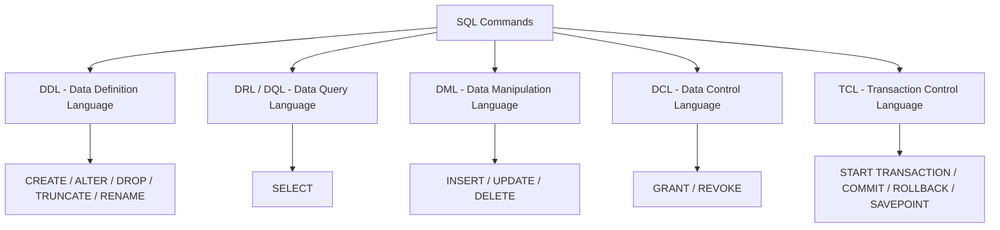

# 07 — SQL (LEC-9)

## What is SQL

**SQL (Structured Query Language)** is a query language used to access and manipulate data in a relational database. SQL is *not* a database itself — it is the language used to communicate with one.

SQL uses **CRUD** operations to communicate with the DB.

| Operation | Meaning |
| --- | --- |
| **CREATE** | Execute `INSERT` statements to insert a new tuple into the relation. |
| **READ** | Read data already present in the relations. |
| **UPDATE** | Modify already-inserted data in the relation. |
| **DELETE** | Delete a specific data point / tuple / row, or multiple rows. |

### RDBMS

**RDBMS (Relational Database Management System)** is software that lets us implement a designed relational model.

- Examples: MySQL, MS SQL, Oracle, IBM Db2, etc.
- A **table / relation** is the simplest form of data storage object in a relational DB.
- MySQL is an open-source RDBMS, and it uses SQL for all CRUD operations.
- MySQL uses a **client-server model**, where the client is a CLI or frontend that consumes services provided by the MySQL server.

### SQL vs MySQL

| SQL | MySQL |
| --- | --- |
| A Structured Query Language used to perform CRUD operations in a relational DB. | An RDBMS used to store, manage and administrate the DB (provided by itself) using SQL. |

## SQL Data Types

In an SQL DB, data is stored in the form of tables, and data can be of different types (INT, CHAR, etc.).

| Data Type | Description |
| --- | --- |
| `CHAR` | String with fixed size in range (0, 255], e.g. `CHAR(251)`. |
| `VARCHAR` | String (0–255). |
| `TINYTEXT` | String (0–255). |
| `TEXT` | String (0–65535). |
| `BLOB` | String (0–65535). |
| `MEDIUMTEXT` | String (0–16777215). |
| `MEDIUMBLOB` | String (0–16777215). |
| `LONGTEXT` | String (0–4294967295). |
| `LONGBLOB` | String (0–4294967295). |
| `TINYINT` | Integer (-128 to 127). |
| `SMALLINT` | Integer (-32768 to 32767). |
| `MEDIUMINT` | Integer (-8388608 to 8388607). |
| `INT` | Integer (-2147483648 to 2147483647). |
| `BIGINT` | Integer (-9223372036854775808 to 9223372036854775807). |
| `FLOAT` | Decimal with precision up to 23 digits. |
| `DOUBLE` | Decimal with 24 to 53 digits. |
| `DECIMAL` | Double stored as a string. |
| `DATE` | `YYYY-MM-DD`. |
| `DATETIME` | `YYYY-MM-DD HH:MM:SS`. |
| `TIMESTAMP` | `YYYYMMDDHHMMSS`. |
| `TIME` | `HH:MM:SS`. |
| `ENUM` | One of the preset values. |
| `SET` | One or many of the preset values. |
| `BOOLEAN` | 0 / 1. |
| `BIT` | e.g. `BIT(n)`, n up to 64, stores values in bits. |

**Notes on data types:**

- Size ordering: `TINYINT` < `SMALLINT` < `MEDIUMINT` < `INT` < `BIGINT`.
- Variable-length data types (e.g. `VARCHAR`) are better to use, as they occupy space equal to the actual data size.
- Values can also be unsigned, e.g. `INT UNSIGNED`.

## Categories of SQL Commands

SQL commands are grouped into five sub-languages.



The five sub-languages of SQL and the commands each contains.

| Sub-language | Purpose | Commands |
| --- | --- | --- |
| **DDL** (Data Definition Language) | Define the relation schema. | `CREATE` (table, DB, view), `ALTER TABLE` (modify structure — change column datatype, add/remove columns), `DROP` (delete table, DB, view), `TRUNCATE` (remove all tuples from a table), `RENAME` (rename DB, table, column). |
| **DRL / DQL** (Data Retrieval / Query Language) | Retrieve data from tables. | `SELECT` |
| **DML** (Data Manipulation Language) | Perform modifications in the DB. | `INSERT`, `UPDATE`, `DELETE` |
| **DCL** (Data Control Language) | Grant or revoke authorities from a user. | `GRANT` (access privileges to the DB), `REVOKE` (revoke user access privileges). |
| **TCL** (Transaction Control Language) | Manage transactions done in the DB. | `START TRANSACTION` (begin a transaction), `COMMIT` (apply all changes and end transaction), `ROLLBACK` (discard changes and end transaction), `SAVEPOINT` (checkpoint within a group of transactions to roll back to). |

## Managing Databases (DDL)

```sql
CREATE DATABASE IF NOT EXISTS db_name;

USE db_name;          -- choose which DB subsequent commands run on; enables switching between DBs

DROP DATABASE IF EXISTS db_name;   -- drop a database

SHOW DATABASES;       -- list all DBs in the server

SHOW TABLES;          -- list tables in the selected DB
```

## Data Retrieval Language (DRL / DQL)

Basic syntax — the order of execution is from **right to left**.

```sql
SELECT <set of column names> FROM <table_name>;
```

### SELECT without FROM (DUAL Tables)

Yes — `SELECT` can be used without a `FROM` clause via **DUAL tables**. Dual tables are dummy tables created by MySQL that let users do certain obvious actions without referring to user-defined tables.

```sql
SELECT 55 + 11;
SELECT now();
SELECT ucase('abc');
```

### WHERE

Reduces rows based on the given conditions.

```sql
SELECT * FROM customer WHERE age > 18;
```

### BETWEEN

Both bounds are **inclusive**.

```sql
SELECT * FROM customer WHERE age BETWEEN 0 AND 100;
```

### IN

Reduces multiple `OR` conditions into one clause.

```sql
SELECT * FROM officers WHERE officer_name IN ('Lakshay', 'Maharana Pratap', 'Deepika');
```

### AND / OR / NOT

```sql
SELECT * FROM t WHERE cond1 AND cond2;
SELECT * FROM t WHERE cond1 OR cond2;
SELECT * FROM t WHERE col_name NOT IN (1, 2, 3, 4);
```

### IS NULL

```sql
SELECT * FROM customer WHERE prime_status IS NULL;
```

### Pattern Searching / Wildcards

- `%` — any number of characters, from 0 to n (similar to `*` in regex).
- `_` — exactly one character.

```sql
SELECT * FROM customer WHERE name LIKE '%p_';
```

### ORDER BY

Sorts the retrieved data. `ASC` = ascending, `DESC` = descending.

```sql
SELECT * FROM customer ORDER BY name DESC;
```

### GROUP BY

The `GROUP BY` clause collects data from multiple records and groups the result by one or more columns; it is generally used in a `SELECT` statement to group into categories based on the given column.

```sql
SELECT c1, c2, c3 FROM sample_table WHERE cond GROUP BY c1, c2, c3;
```

- All column names mentioned after `SELECT` must be repeated in `GROUP BY` for the query to execute successfully.
- Used with aggregation functions to perform various actions.

### Aggregate Functions

| Function | Returns |
| --- | --- |
| `COUNT()` | Number of rows. |
| `SUM()` | Sum of values. |
| `AVG()` | Average of values. |
| `MIN()` | Minimum value. |
| `MAX()` | Maximum value. |

### DISTINCT

Finds distinct values in a table.

```sql
SELECT DISTINCT(col_name) FROM table_name;

-- GROUP BY gives the same output:
SELECT col_name FROM table GROUP BY col_name;
```

SQL is smart enough to realise that if you use `GROUP BY` without any aggregation function, you mean `DISTINCT`.

### GROUP BY ... HAVING

Out of the categories made by `GROUP BY`, `HAVING` lets us keep only particular ones (a condition). It is similar to `WHERE`, but applies to groups.

```sql
SELECT COUNT(cust_id), country FROM customer GROUP BY country HAVING COUNT(cust_id) > 50;
```

### WHERE vs HAVING

| WHERE | HAVING |
| --- | --- |
| Filters rows from the table based on a specified condition. | Filters rows from the *groups* based on a specified condition. |
| Used **before** `GROUP BY`. | Used **after** `GROUP BY`; `GROUP BY` is necessary when using `HAVING`. |
| Can be used with `SELECT`, `UPDATE` & `DELETE`. | Used with `SELECT` (with `GROUP BY`). |

## Constraints (DDL)

### Primary Key

A **Primary Key** is `NOT NULL`, unique, and there can be only one per table.

### Foreign Key

A **Foreign Key** refers to the primary key of another table. Each relation can have any number of foreign keys.

```sql
CREATE TABLE ORDER (
    id INT PRIMARY KEY,
    delivery_date DATE,
    order_placed_date DATE,
    cust_id INT,
    FOREIGN KEY (cust_id) REFERENCES customer(id)
);
```

### UNIQUE

Can be `NULL`, and a table can have multiple unique attributes.

```sql
CREATE TABLE customer (
    email VARCHAR(1024) UNIQUE
);
```

### CHECK

The name (`age_check`) can be omitted — MySQL generates a constraint name automatically.

```sql
CREATE TABLE customer (
    CONSTRAINT age_check CHECK (age > 12)
);
```

### DEFAULT

Sets a default value for a column.

```sql
CREATE TABLE account (
    saving_rate DOUBLE NOT NULL DEFAULT 4.25
);
```

An attribute can be both a Primary Key and a Foreign Key in a table.

## ALTER Operations

`ALTER` changes the schema of a table.

### ADD — add a new column

```sql
ALTER TABLE table_name ADD new_col_name datatype, ADD new_col_name_2 datatype;

ALTER TABLE customer ADD age INT NOT NULL;
```

### MODIFY — change the datatype of an attribute

```sql
ALTER TABLE table_name MODIFY col_name col_datatype;

-- VARCHAR to CHAR
ALTER TABLE customer MODIFY name CHAR(1024);
```

### CHANGE COLUMN — rename a column

```sql
ALTER TABLE table_name CHANGE COLUMN old_col_name new_col_name new_col_datatype;

ALTER TABLE customer CHANGE COLUMN name customer_name VARCHAR(1024);
```

### DROP COLUMN — drop a column completely

```sql
ALTER TABLE table_name DROP COLUMN col_name;

ALTER TABLE customer DROP COLUMN middle_name;
```

### RENAME — rename the table itself

```sql
ALTER TABLE table_name RENAME TO new_table_name;

ALTER TABLE customer RENAME TO customer_details;
```

## Data Manipulation Language (DML)

### INSERT

```sql
INSERT INTO table_name (col1, col2, col3) VALUES (v1, v2, v3), (val1, val2, val3);
```

### UPDATE

```sql
UPDATE table_name SET col1 = 1, col2 = 'abc' WHERE id = 1;

-- update multiple rows
UPDATE student SET standard = standard + 1;
```

**ON UPDATE CASCADE** can be added while creating constraints. When the primary key of one table is the foreign key of another and the primary key is updated, `ON UPDATE CASCADE` makes the foreign key in the second table update automatically.

### DELETE

```sql
DELETE FROM table_name WHERE id = 1;

DELETE FROM table_name;   -- all rows will be deleted
```

**ON DELETE CASCADE** — decides what happens to a child entry when the parent table's entry is deleted (the child rows are deleted too).

```sql
CREATE TABLE ORDER (
    order_id INT PRIMARY KEY,
    delivery_date DATE,
    cust_id INT,
    FOREIGN KEY (cust_id) REFERENCES customer(id) ON DELETE CASCADE
);
```

**ON DELETE SET NULL** — instead of deleting the child, sets its foreign key to `NULL`.

```sql
CREATE TABLE ORDER (
    order_id INT PRIMARY KEY,
    delivery_date DATE,
    cust_id INT,
    FOREIGN KEY (cust_id) REFERENCES customer(id) ON DELETE SET NULL
);
```

### REPLACE

Primarily used for a tuple already present in a table.

- Like `UPDATE` — using `REPLACE` with a `WHERE` clause on the PK replaces that row.
- Like `INSERT` — if there is no duplicate data, a new tuple is inserted.

```sql
REPLACE INTO student (id, class) VALUES (4, 3);

REPLACE INTO table SET col1 = val1, col2 = val2;
```

## Joining Tables

All RDBMS are relational in nature — we refer to other tables to get meaningful outcomes, and foreign keys are used to reference other tables.

| Join Type | Result |
| --- | --- |
| **INNER JOIN** | Matching values from both (or all) the tables. |
| **LEFT JOIN** | All data from the left table + matched data from the right table. |
| **RIGHT JOIN** | All data from the right table + matched data from the left table. |
| **FULL JOIN** | All data when there is a match on the left *or* right table (emulated in MySQL). |
| **CROSS JOIN** | Cartesian product of both tables (all possible variations). |
| **SELF JOIN** | Output from a table joined to itself. |

### INNER JOIN

Returns a resultant table with matching values from both (or all) the tables.

```sql
SELECT column_list FROM table1
INNER JOIN table2 ON condition1
INNER JOIN table3 ON condition2;
```

### Alias in MySQL (AS)

An alias gives a temporary name to a table or column for a particular query — a nickname that makes the query short and neat.

```sql
SELECT col_name AS alias_name FROM table_name;

SELECT col_name1, col_name2 FROM table_name AS alias_name;
```

### LEFT JOIN

```sql
SELECT columns FROM table1 LEFT JOIN table2 ON join_condition;
```

### RIGHT JOIN

```sql
SELECT columns FROM table1 RIGHT JOIN table2 ON join_cond;
```

### FULL JOIN

Emulated in MySQL using `LEFT JOIN UNION RIGHT JOIN`.

```sql
SELECT columns FROM table1 AS t1 LEFT JOIN table2 AS t2 ON t1.id = t2.id
UNION
SELECT columns FROM table1 AS t1 RIGHT JOIN table2 AS t2 ON t1.id = t2.id;
```

`UNION ALL` can also be used — it keeps duplicate values, whereas `UNION` gives unique values.

### CROSS JOIN

Returns the Cartesian product of both tables. Rarely used in practice — if table-1 has 10 rows and table-2 has 5, the result has 50 rows.

```sql
SELECT column_lists FROM table1 CROSS JOIN table2;
```

### SELF JOIN

Used to get output from a table when the same table is joined to itself (rarely used; emulated using `INNER JOIN`).

```sql
SELECT columns FROM table AS t1 INNER JOIN table AS t2 ON t1.id = t2.id;
```

### Join without JOIN keywords

```sql
SELECT * FROM table1, table2 WHERE condition;

SELECT artist_name, album_name, year_recorded
FROM artist, album
WHERE artist.id = album.artist_id;
```

## Set Operations

Set operations combine multiple `SELECT` statements and always return distinct rows.

### JOIN vs SET Operations

| JOIN | SET Operations |
| --- | --- |
| Combines multiple tables based on a matching condition. | Combines the result sets from two or more `SELECT` statements. |
| Column-wise combination (horizontal). | Row-wise combination (vertical). |
| Data types of the two tables can be different. | Datatypes of corresponding columns from each table should be the same. |
| Can generate both distinct or duplicate rows. | Generates distinct rows. |
| Number of columns selected may or may not be the same from each table. | Number of columns selected must be the same from each table. |

### UNION

Combines two or more `SELECT` statements. The number and order of columns must be the same for both tables.

```sql
SELECT * FROM table1
UNION
SELECT * FROM table2;
```

### INTERSECT

Returns common values of the tables (emulated in MySQL).

```sql
SELECT DISTINCT column_list FROM table1 INNER JOIN table2 USING(join_cond);

SELECT DISTINCT * FROM table1 INNER JOIN table2 USING(id);
```

### MINUS

Returns the distinct rows from the first table that do not occur in the second table (emulated in MySQL).

```sql
SELECT column_list FROM table1 LEFT JOIN table2 ON condition WHERE table2.column_name IS NULL;

SELECT id FROM table1 LEFT JOIN table2 USING(id) WHERE table2.id IS NULL;
```

## Sub Queries

A **subquery** is a nested query where the outer query depends on the inner query — an alternative to joins.

```sql
SELECT column_list FROM table_name WHERE column_name OPERATOR
    (SELECT column_list FROM table_name [WHERE]);

SELECT * FROM table1 WHERE col1 IN (SELECT col1 FROM table1);
```

Subqueries exist mainly in three clauses: inside a `WHERE` clause, inside a `FROM` clause, and inside a `SELECT` clause.

### Subquery in FROM clause

```sql
SELECT MAX(rating) FROM (SELECT * FROM movie WHERE country = 'India') AS temp;
```

### Subquery in SELECT clause

```sql
SELECT (SELECT column_list FROM T_name WHERE condition), columnList FROM T2_name WHERE condition;
```

### Derived Subquery

```sql
SELECT columnList FROM (SELECT columnList FROM table_name WHERE [condition]) AS new_table_name;
```

### Co-related Subqueries

With a normal nested subquery, the inner `SELECT` runs first and executes **once**, returning values used by the main query. A **correlated subquery**, however, executes **once for each candidate row** considered by the outer query — the inner query is driven by the outer query.

### JOIN vs Subqueries

| JOINS | SUBQUERIES |
| --- | --- |
| Faster. | Slower. |
| Maximise the calculation burden on the DBMS. | Keep the responsibility of calculation on the user. |
| Complex, difficult to understand and implement. | Comparatively easy to understand and implement. |
| Choosing the optimal join for the use case is difficult. | Easy. |

## MySQL Views

A **View** is a database object that has no values of its own — its contents are based on a base table and it contains rows and columns similar to a real table.

- In MySQL, a View is a **virtual table** created by a query that joins one or more tables. It operates similarly to a base table but does not contain any data of its own.
- The main difference between a View and a table: Views are definitions built on top of other tables (or views). If any change occurs in an underlying table, the same change is reflected in the View.

```sql
CREATE VIEW view_name AS SELECT columns FROM tables [WHERE conditions];

ALTER VIEW view_name AS SELECT columns FROM table WHERE conditions;

DROP VIEW IF EXISTS view_name;

-- View using a JOIN clause
CREATE VIEW Trainer AS
SELECT c.course_name, c.trainer, t.email
FROM courses c, contact t
WHERE c.id = t.id;
```

> Note: We can also import/export table schema from files (`.csv` or `json`).
