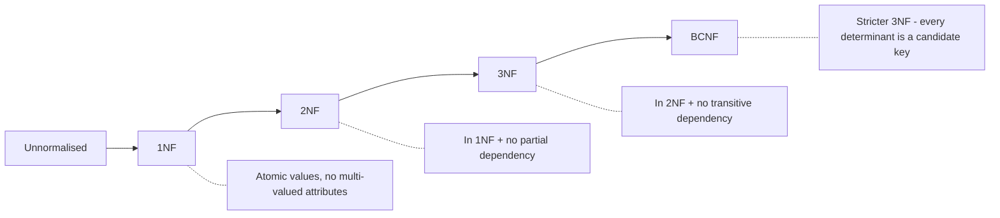

# 08 — Normalisation (LEC-11)

**Normalisation** is a step towards database optimisation. It minimises redundancy in relations and eliminates undesirable characteristics like insertion, update, and deletion anomalies.

## Functional Dependency (FD)

A **Functional Dependency** is a relationship between the primary key attribute (usually) of a relation and another attribute of the same relation.

In `X → Y`, the left side is the **Determinant** and the right side is the **Dependent**.

### Types of FD

| Type | Definition |
| --- | --- |
| **Trivial FD** | `A → B` is trivial if `B` is a subset of `A`. `A → A` and `B → B` are also trivial. |
| **Non-trivial FD** | `A → B` is non-trivial if `B` is *not* a subset of `A` (i.e. `A ∩ B` is NULL). |

### Rules of FD (Armstrong's Axioms)

| Axiom | Rule | Formal |
| --- | --- | --- |
| **Reflexive** | If `A` is a set of attributes and `B` is a subset of `A`, then `A → B` holds. | If `A ⊇ B` then `A → B`. |
| **Augmentation** | If `B` can be determined from `A`, adding an attribute to the FD changes nothing. | If `A → B` holds, then `AX → BX` holds too (`X` being a set of attributes). |
| **Transitivity** | If `A` determines `B` and `B` determines `C`, then `A` determines `C`. | If `A → B` and `B → C` then `A → C`. |

## Why Normalisation?

The goal is to **avoid redundancy** in the DB — not to store redundant data. If we store redundant data, insertion, deletion and updation anomalies arise.

## Anomalies

Anomalies means abnormalities. Data redundancy introduces three types of anomalies.

| Anomaly | Description |
| --- | --- |
| **Insertion anomaly** | When certain data (an attribute) cannot be inserted into the DB without the presence of some other data. |
| **Deletion anomaly** | When the deletion of data results in the unintended loss of some other important data. |
| **Updation (modification) anomaly** | When updating a single data value requires multiple rows to be updated. If one forgets to update the value everywhere, data inconsistency arises. |

Due to these anomalies, DB size increases and DB performance becomes very slow. To rectify them, we use the database optimisation technique called **Normalisation**.

## What is Normalisation?

- Normalisation minimises redundancy from relations and eliminates undesirable characteristics like insertion, update, and deletion anomalies.
- It divides composite attributes into individual attributes, or a larger table into smaller tables, and links them using relationships.
- The **normal form** is used to reduce redundancy from a database table.

## Types of Normal Forms

Each normal form builds on the previous one — a relation must satisfy the earlier form before it can be in the next.

Progression of normal forms, each with the extra condition it enforces.

### 1NF (First Normal Form)

- Every relation cell must have an **atomic value**.
- The relation must not have **multi-valued attributes**.

### 2NF (Second Normal Form)

- The relation must be in **1NF**.
- There should be **no partial dependency**.
- All non-prime attributes must be **fully dependent** on the primary key — a non-prime attribute cannot depend on part of the PK.

### 3NF (Third Normal Form)

- The relation must be in **2NF**.
- **No transitive dependency** should exist.

### BCNF (Boyce-Codd Normal Form)

BCNF is a stricter version of 3NF: the relation must be in 3NF, and for every functional dependency `A → B`, the determinant `A` must be a **candidate key** (a super key).
