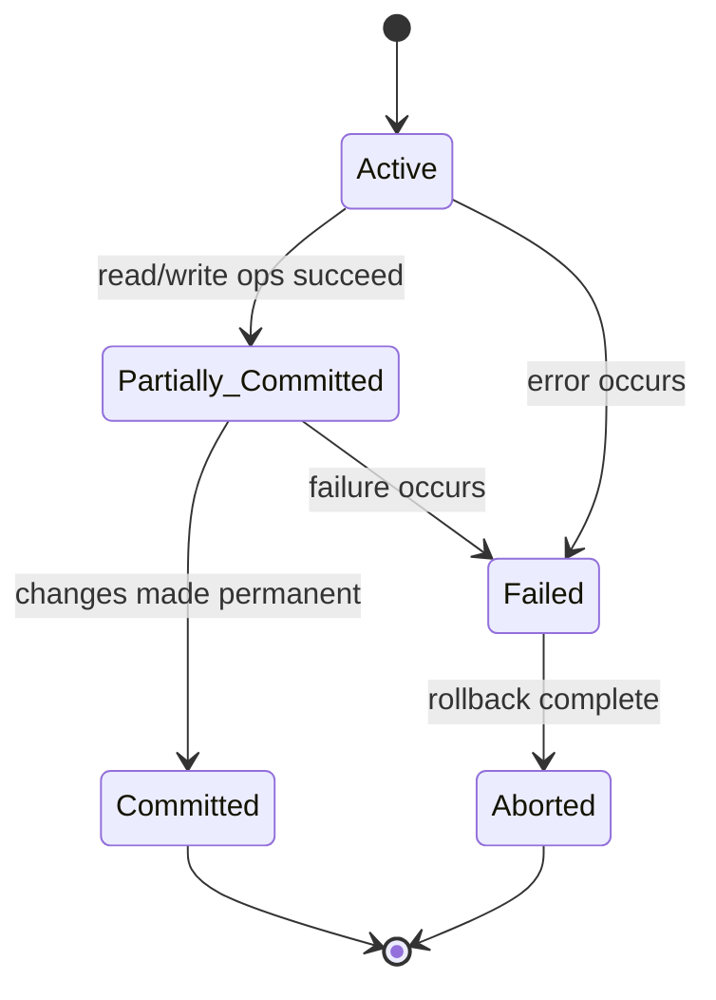

# 09 — Transaction (LEC-12)

A **transaction** is a unit of work done against the database in a logical sequence. The *sequence* of operations is very important in a transaction.

It is a logical unit of work that contains one or more SQL statements. The result of all these statements either gets **completed successfully** (all changes made to the database are made permanent) or, if any failure happens at any point, it gets **rolled back** (all the changes done are undone).

---

## ACID Properties

To ensure the integrity of the data, the DB system must maintain the following properties of a transaction.

| Property | Meaning |
| --- | --- |
| **Atomicity** | Either *all* operations of the transaction are reflected properly in the DB, or *none* are. |
| **Consistency** | Integrity constraints must be maintained before and after the transaction. The DB must be consistent after the transaction happens. |
| **Isolation** | Even though multiple transactions may execute concurrently, the system guarantees that for every pair of transactions Ti and Tj, it appears to Ti that either Tj finished execution before Ti started, or Tj started after Ti finished. Each transaction is unaware of other transactions executing concurrently, so they run without interfering with each other. |
| **Durability** | After a transaction completes successfully, the changes it made to the database persist, even if there are system failures. |

---

## Transaction States

A transaction moves through these states over its life cycle; **Committed** and **Aborted** are the two ways it terminates.

### Active State

The very first state of the transaction's life cycle. All the read and write operations are being performed here. If they execute without any error, the transaction moves to the **Partially Committed** state; if any error occurs, it moves to the **Failed** state.

### Partially Committed State

After the transaction is executed, the changes are saved in a **buffer in main memory**. If these changes are made permanent on the DB, the state transfers to **Committed**; if there is any failure, the transaction goes to **Failed**.

### Committed State

The updates have been made permanent on the DB. **Rollback cannot be done** from the committed state. A new consistent state is achieved at this stage.

### Failed State

Reached when the transaction is being executed and some failure occurs, due to which it becomes impossible to continue the execution of the transaction.

### Aborted State

When a transaction reaches the failed state, all the changes made in the buffer are reversed and the transaction **rolls back completely**. The transaction reaches the abort state after rollback, and the DB's state prior to the transaction is restored.

### Terminated State

A transaction is said to have **terminated** if it has either committed or aborted.
