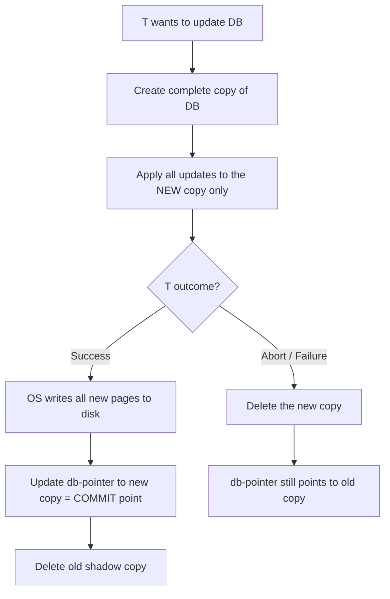

# 10 — Implementing Atomicity and Durability (LEC-13)

The **Recovery Mechanism Component** of a DBMS is what supports the *atomicity* and *durability* properties of transactions.

---

## Shadow-Copy Scheme

The shadow-copy scheme is based on making copies of the database, known as **shadow copies**. It assumes that **only one transaction (T) is active at a time**.

- A pointer called **db-pointer** is maintained on the disk; at any instant it points to the current copy of the DB.
- A transaction T that wants to update the DB first creates a **complete copy** of the DB.
- All further updates are done on the *new* copy, leaving the original copy (the **shadow copy**) untouched.
- If at any point T has to be aborted, the system simply deletes the new copy, and the old copy is unaffected.

On successful commit, the following happens:

- The OS makes sure all the pages of the new copy of the DB are written to disk.
- The DB system updates the **db-pointer** to point to the new copy of the DB.
- The new copy is now the current copy of the DB.
- The old copy is deleted.
- The transaction is said to have **COMMITTED** at the point where the updated db-pointer is written to disk.

The db-pointer swap is the atomic commit point: before it, the shadow copy is authoritative; after it, the new copy is.

### Atomicity in the Shadow-Copy Scheme

- If T fails at any time *before* the db-pointer is updated, the old contents of the DB are not affected.
- A T abort is done by just deleting the new copy of the DB.
- Hence, either **all** updates are reflected or **none** are.

### Durability in the Shadow-Copy Scheme

- Suppose the system fails at any time *before* the updated db-pointer is written to disk. When the system restarts, it reads the db-pointer and thus sees the original content of the DB — none of the effects of T are visible.
- T is assumed to be successful only when the db-pointer is updated.
- If the system fails *after* the db-pointer has been updated, then (since all pages of the new copy were already written to disk beforehand) the system reads the new DB copy on restart.

> The implementation depends on the write to the db-pointer being **atomic**. Disk systems provide atomic updates to an entire block, or at least a disk sector, so we make sure the db-pointer lies entirely within a single sector — by storing it at the beginning of a block.

**Drawback:** This scheme is **inefficient**, as the entire DB is copied for every transaction.

---

## Log-Based Recovery Methods

A **log** is a sequence of records. The log of each transaction is maintained in some **stable storage**, so that if any failure occurs the transaction can be recovered from there.

- If any operation is performed on the database, it is recorded in the log.
- The process of storing the log must be done **before** the actual transaction is applied to the database.

**Stable storage** is a classification of computer data storage technology that guarantees atomicity for any given write operation and allows software to be written that is robust against some hardware and power failures.

### Deferred DB Modifications

Ensures atomicity by recording all DB modifications in the log but **deferring** the execution of all write operations until the final action of the transaction has been executed.

- Log information is used to execute the deferred writes when T is completed.
- If the system crashes before T completes, or if T is aborted, the information in the logs is **ignored**.
- If T completes, the records associated with it in the log file are used to execute the deferred writes.
- If a failure occurs while this updating is taking place, we perform **redo**.

### Immediate DB Modifications

DB modifications are output to the DB while the transaction is still in the **active** state.

- DB modifications written by an active T are called **uncommitted modifications**.
- In the event of a crash or transaction failure, the system uses the **old value** field of the log records to restore the modified values.
- The update takes place only *after* the log record is written to stable storage.

**Failure handling:**

- If a system failure occurs before T completes, or if T is aborted, the **old value** field is used to **undo** the transaction.
- If T completes and the system then crashes, the **new value** field is used to **redo** T (for transactions that have commit records in the log).
