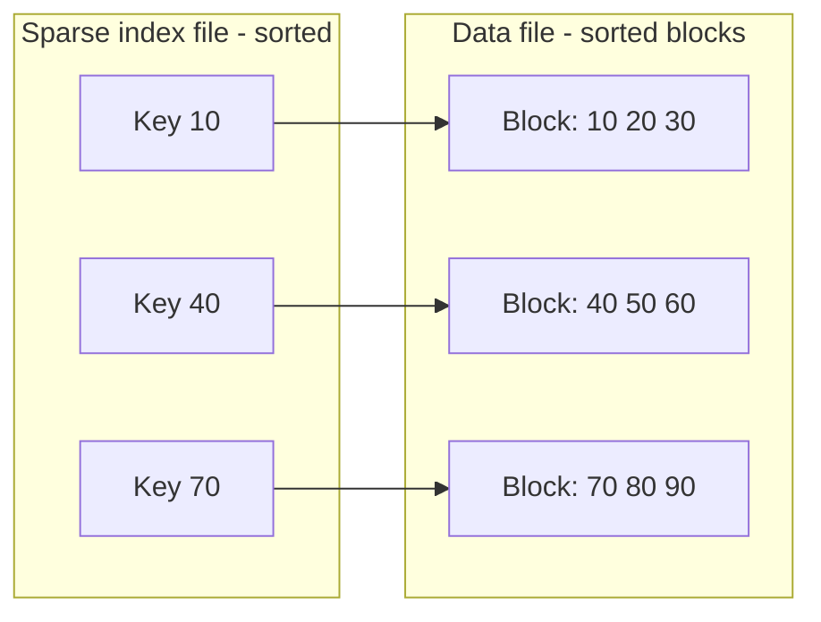

# 11 — Indexing in DBMS (LEC-14)

**Indexing** is used to optimise the performance of a database by minimising the number of disk accesses required when a query is processed. An index is a type of **data structure** used to locate and access the data in a database table quickly.

- It speeds up read operations such as `SELECT` queries, `WHERE` clauses, etc.
- Indexing is **optional**, but it increases access speed. It is not the primary means to access a tuple — it is a **secondary** means.
- The index file is always **sorted**.

---

## Key Components of an Index

| Component | Meaning |
| --- | --- |
| **Search Key** | Contains a copy of the primary key, a candidate key, or some other attribute of the table. |
| **Data Reference** | A pointer holding the address of the disk block where the value of the corresponding key is stored. |

---

## Primary Index (Clustering Index)

A file may have several indices, on different search keys. If the data file containing the records is **sequentially ordered**, a *primary index* is an index whose search key **also defines the sequential order** of the file.

> **NOTE:** The term "primary index" is sometimes used to mean an index on a primary key. However, such usage is nonstandard and should be avoided.

All files are ordered sequentially on some search key — this could be a primary key or a non-primary key.

---

## Dense vs Sparse Indices

| Type | Description |
| --- | --- |
| **Dense Index** | Contains an index record for **every** search-key value in the data file. Each record holds the search-key value and a pointer to the *first* data record with that value; the rest of the records with the same value are stored sequentially after it. Needs more space to store the index records. |
| **Sparse Index** | An index record appears for only **some** of the search-key values. It resolves the space issues of dense indexing: a range of index columns stores the same data-block address, and when data needs to be retrieved, that block address is fetched. |

A sparse index stores one entry per data block rather than per record, so the number of index entries equals the number of blocks.

---

## Primary Indexing: Key vs Non-Key

Primary indexing depends on whether the data file is sorted with respect to the primary-key attribute or a non-key attribute.

### Based on Key Attribute

- The data file is sorted with respect to the **primary-key** attribute.
- The PK is used as the search key in the index.
- A **sparse index** is formed, i.e. number of entries in the index file = number of blocks in the data file.

### Based on Non-Key Attribute

- The data file is sorted with respect to a **non-key** attribute.
- Number of entries in the index = number of unique non-key attribute values in the data file.
- This is a **dense index**, as all the unique values have an entry in the index file.
- **Example:** A company recruits many employees across various departments. Here, clustering indexing should be created for all employees who belong to the same department.

---

## Multi-Level Index

- An index with **two or more levels**.
- When a single-level index becomes large enough that a binary search on it is expensive (it too must be stored across many blocks and cannot fit conveniently in memory), an index is built **on top of the index**, producing a multi-level index that reduces the search cost further.
